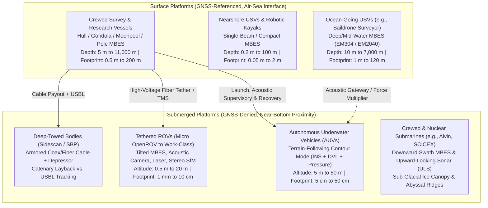

## 7.4 Marine Platforms: Ships, USVs, Towed Bodies, ROVs, AUVs, and Submarines

Mapping the subaqueous Earth—spanning intertidal mudflats, turbulent river channels, continental shelves, submarine canyons, and abyssal trenches down to $11{,}000\text{ m}$—requires platforms engineered to survive a fluid, optically opaque, acoustically refractive, and GNSS-denied environment. Unlike terrestrial or airborne platforms, where electromagnetic waves (optical or LiDAR) propagate to the target at nearly the speed of light ($c \approx 3 \times 10^8\text{ m s}^{-1}$) with negligible medium motion, marine platforms operate at or beneath a dynamically heaving air–sea interface and rely primarily on acoustic wave propagation ($c_w \approx 1450\text{–}1550\text{ m s}^{-1}$). Because two-way acoustic travel times in the deep ocean reach $5\text{–}15\text{ s}$ per ping, a marine platform undergoes substantial six-degree-of-freedom (6-DoF) translation and rotation between signal transmission and reception. Furthermore, seawater rapidly attenuates high-frequency acoustic energy ($>100\text{ kHz}$), forcing a fundamental trade-off between **surface platforms** (which enjoy continuous GNSS positioning and high power but suffer from wide acoustic footprints at depth) and **submerged platforms** (which bring high-frequency acoustic and optical sensors within meters of the seabed at the cost of losing direct satellite navigation).



---

### 7.4.1 Crewed Research and Hydrographic Survey Vessels

Crewed hydrographic launches ($7\text{–}15\text{ m}$ length overall, LOA), coastal survey vessels ($20\text{–}40\text{ m}$ LOA), and global class oceanographic research ships ($60\text{–}130\text{ m}$ LOA) remain the primary workhorses of continental shelf charting and deep-ocean reconnaissance. Converting raw acoustic travel times and beam angles from a shipboard multibeam echosounder (MBES) into an ellipsoidally or tidally referenced bathymetric Digital Elevation Model (DEM) requires rigorous control over transducer mounting hydrodynamics, 6-DoF vessel motion, and time-varying vertical waterline offsets.

#### Transducer Mounting Architectures and Bubble Sweepdown
The physical placement of the Mills-cross projector (transmit) and hydrophone (receive) arrays on a vessel hull governs both the acoustic signal-to-noise ratio (SNR) and the mechanical stability of the lever arms relative to the Inertial Measurement Unit (IMU):

1. **Flush Hull Mounts:** On many vessels, the transducer arrays are recessed into the keel or forward flat bottom plates so that the acoustic faces sit flush with the outer hull plating. While flush mounting minimizes hydrodynamic drag and protects the arrays during docking or ice transit, it places the sonar directly inside the **aerated hull boundary layer**. As a vessel pitches and slams into waves, breaking bow waves entrain plumes of micro-bubbles that are advected downward and aft along the hull streamlines—a phenomenon known as **bubble sweepdown**. Because air micro-bubbles in water exhibit an acoustic impedance mismatch orders of magnitude larger than sediment or water-mass boundaries and resonate near survey frequencies ($12\text{–}400\text{ kHz}$), a bubble layer only millimeters to centimeters thick across the transducer face causes severe acoustic attenuation ($20\text{–}40\text{ dB}$ transmission loss), total ping dropouts, and phase-front distortion that biases phase-differencing beam angles in the outer swath.
2. **Blister and Gondola Mounts:** To defeat bubble sweepdown on dedicated ocean mapping vessels, transducers are mounted inside a streamlined fiberglass or steel **blister** (a teardrop fairing extending $0.3\text{–}0.8\text{ m}$ below the keel) or a suspended **gondola** (a hydrodynamically faired pod hung $1.0\text{–}2.0\text{ m}$ beneath the forward hull via twin structural struts). By physically displacing the arrays below the turbulent, bubble-entrained hull boundary layer into undisturbed laminar flow, gondolas dramatically extend the sea-state operational envelope (often enabling clean bathymetric acquisition through Beaufort Sea State 5–6) while structurally isolating the hydrophones from engine-room vibration and hull plate resonance.
3. **Moonpools and Retractable Deployment Trunks:** Mid-ship vertical wells (**moonpools**) or retractable hydraulic rams locate the sonar near the vessel's longitudinal center of floatation, minimizing vertical heave accelerations compared to bow mounts and allowing technicians to retract transducers for cleaning biofouling or servicing without dry-docking.
4. **Over-the-Side and Bow-Mounted Rigid Poles:** On charters or "vessels of opportunity" (VOOs) where hull cutting is impossible, high-frequency multibeam heads ($200\text{–}700\text{ kHz}$) are clamped to a rigid aluminum or carbon-fiber pole mounted over the gunwale or bow, typically with the IMU mounted directly atop the sonar head (wet-pod IMU) or at the top of the pole. Over-the-side poles introduce severe structural dynamics hazards. As water flows past a cylindrical pole of diameter $D_{\text{pole}}$ at ship speed $v_{\text{ship}}$, alternating Kármán vortex shedding occurs at the Strouhal frequency:
   $$f_s = \text{St} \cdot \frac{v_{\text{ship}}}{D_{\text{pole}}}$$
   where $\text{St} \approx 0.2$ is the dimensionless Strouhal number over Reynolds numbers $10^3 < \text{Re} < 10^5$. If $f_s$ approaches the natural resonant frequency of the cantilevered pole, **vortex-induced vibration (VIV)** induces high-frequency roll/pitch jitter that blurs the outer beams and degrades IMU alignment unless helical strakes or hydrodynamic fairings are fitted. Simultaneously, steady hydrodynamic drag along the wetted pole shaft ($F_{D,\text{pole}} = \frac{1}{2} \rho_w C_{D,\text{pole}} D_{\text{pole}} L_{\text{pole}} v_{\text{ship}}^2$) and concentrated drag on the sonar head ($F_{D,\text{head}} = \frac{1}{2}\rho_w C_{D,\text{head}} A_{\text{head}} v_{\text{ship}}^2$) bend the cantilevered pole aft and outward, creating a speed-dependent angular tip deflection:
   $$\delta\theta_{\text{pole}}(v_{\text{ship}}) = \frac{F_{D,\text{pole}} L_{\text{pole}}^2}{6 E I} + \frac{F_{D,\text{head}} L_{\text{pole}}^2}{2 E I} \propto v_{\text{ship}}^2$$
   where $L_{\text{pole}}$ is the wetted cantilevered length, $E$ is Young's modulus, and $I$ is the cross-sectional area moment of inertia. If a surveyor conducts a multibeam patch test (Chapter 6) at $4\text{ knots}$ without fore-and-aft and athwartships stay wires and subsequently surveys at $8\text{ knots}$, $\delta\theta_{\text{pole}}$ quadruples—introducing an uncompensated dynamic pitch bias $\Delta\theta$ that shifts apparent seafloor features horizontally along-track by $\Delta x \approx H \tan(\Delta\theta)$ (inducing a vertical depth error $\Delta z_{\text{pitch}} \approx H \tan(\Delta\theta)\tan\alpha_x$ on seafloor slopes $\alpha_x$, alongside a severe outer-beam vertical roll error $\Delta z_{\text{roll}} \approx H \tan\beta \cdot \Delta\phi$ if asymmetrical hull wake bends the side-mounted pole outward by $\Delta\phi$).

#### 6-DoF Ship Motion Dynamics and Delayed Heave Filtering
A surface vessel responds continuously to wind, swell, and wind-chop across six degrees of freedom: three linear translations—**surge** ($x$, fore/aft), **sway** ($y$, port/starboard), and **heave** ($z$, vertical displacement around the mean water surface)—and three Euler rotations—**roll** ($\phi$, rotation about $x$), **pitch** ($\theta$, rotation about $y$), and **yaw/heading** ($\psi$, rotation about $z$). As derived in the terrestrial and marine direct georeferencing equations of Chapter 6, roll errors $\delta\phi$ dominate cross-track vertical uncertainty in the outer swath ($\delta z_{\text{roll}} = y_{\text{cross}} \tan\delta\phi \approx H \tan\beta \cdot \delta\phi$), whereas heave errors $\delta z_{\text{heave}}$ translate 1:1 into vertical depth artifacts across the entire swath width, manifesting in the final DEM as periodic along-track "ripples" or "washboards" at the encounter period of the ocean swell ($T_e = 4\text{–}15\text{ s}$).

When operating without centimeter-level GNSS kinematics (or as a backup to GNSS vertical positioning), marine inertial systems compute heave by double-integrating the vertical specific force measured by the IMU accelerometers after rotating out gravity. Because any tiny accelerometer bias $b_a$ integrates quadratically into a runaway vertical drift ($\delta z(t) = \frac{1}{2} b_a t^2$), **real-time (causal) heave estimators** must pass the integrated vertical displacement through a high-pass digital filter with a cutoff period $T_c$ (typically $15\text{–}25\text{ s}$) chosen above the longest expected ocean swell period. This real-time causal filter introduces two systematic DEM errors:
1. **Phase Lag:** A causal recursive high-pass filter shifts the phase of long-period swells, leaving residual heave ripples of $5\text{–}15\text{ cm}$ in heavy swell.
2. **Turn-Induced Heave Transients ("Filter Settling"):** During a $180^\circ$ tear-drop turn between survey lines, strong centripetal acceleration $a_c = v_{\text{ship}} \dot{\psi}$ couples into the vertical axis through imperfect roll/gravity alignment. This step change charges the high-pass filter state; upon straightening onto the new survey line, the filter requires $2\text{–}3 \times T_c$ ($30\text{–}90\text{ s}$) to exponentially decay back to zero, imprinting a false $10\text{–}30\text{ cm}$ vertical ramp across the start of every survey line unless the vessel executes a prolonged "lead-in" run.

Modern hydrographic workflows (governed by the **NOAA Hydrographic Surveys Specifications and Deliverables [HSSD]** and **IHO S-44**) eliminate both artifacts in post-processing via **delayed heave** (e.g., Trimble Applanix **TrueHeave™**), which records raw inertial data and applies a **non-causal, zero-phase forward-backward bandpass filter** over a symmetric time window surrounding each ping, or via **Ellipsoidally Referenced Surveying (ERS)**, where tightly coupled Post-Processed Kinematic (PPK) GNSS/INS smoothing directly resolves the absolute ellipsoidal height of the transducer at $50\text{–}200\text{ Hz}$ without relying on a zero-mean sea-surface assumption (processed in suites such as Teledyne CARIS HIPS and SIPS, QPS Qimera, Hypack, or `MB-System`).

#### Time-Varying Static Draft, Settlement, and Dynamic Squat
When bathymetry is referenced to the local water surface (conventional tidal reduction) or when validating ERS against water-level gauges, the vertical position of the acoustic center relative to the undisturbed ambient waterline ($z_{\text{waterline}}$, measured positive downward from the calm water surface to the transducer) is not a static constant. It varies continuously with vessel mass, water density, and vessel speed through the water according to the hydrodynamic draft equation:

$$z_{\text{waterline}}(v, t) = z_{\text{static draft}}(t_0) - \Delta z_{\text{fuel/ballast}}(t) + \Delta z_{\rho}(t) + C_B \frac{v^2}{g} f(\text{Fr}_h)$$

Each term represents a distinct physical mechanism that must be measured or modeled to meet **IHO S-44** Special Order / Exclusive Order and **NOAA HSSD** vertical uncertainty budgets:

* **Static Draft and Fuel/Ballast Depletion ($\Delta z_{\text{fuel/ballast}}(t)$):** At the start of a cruise ($t_0$), static draft is measured via sight gauges, pressure sensors, or tape drops from benchmarked hull reference marks to the water surface. Over a 2-to-4-week expedition, a research vessel burns hundreds of metric tons of diesel fuel, consumes potable water, or transfers ballast water to maintain stability. By Archimedes' principle, a mass loss $\Delta m(t)$ reduces the vessel's mean draft (causing the vessel and its hull-mounted transducer to rise higher in the water) by:
  $$\Delta z_{\text{fuel/ballast}}(t) = \frac{\Delta m(t)}{\rho_w A_{\text{WP}}}$$
  where $\rho_w$ is the ambient water density ($\text{kg m}^{-3}$) and $A_{\text{WP}}$ is the vessel's waterplane area ($\text{m}^2$). Simultaneously, longitudinal mass shifts alter the vessel's static pitch trim, changing the vertical offset of a bow-mounted gondola differently from the mid-ship reference point.
* **Salinity / Water-Mass Density Transitions ($\Delta z_{\rho}(t)$):** When a survey vessel transitions from open continental shelf seawater ($\rho_{\text{sea}} \approx 1025\text{ kg m}^{-3}$) into a freshwater river plume, estuary, or glacial meltwater fjord ($\rho_{\text{fresh}} \approx 1000\text{ kg m}^{-3}$), the hull must displace $\sim 2.5\%$ more volume to support the same weight, causing the ship to sink deeper by $\Delta z_{\rho} = \frac{\nabla}{A_{\text{WP}}} \left(\frac{\rho_{\text{sea}}}{\rho_{\text{fresh}}} - 1\right) \approx z_{\text{static draft}} \left(\frac{\rho_{\text{sea}}}{\rho_{\text{fresh}}} - 1\right)$. For a wall-sided vessel with a $5.0\text{ m}$ draft, entering freshwater increases draft by $12.5\text{ cm}$.
* **Hydrodynamic Settlement and Dynamic Squat ($C_B \frac{v^2}{g} f(\text{Fr}_h)$):** As a displacement hull advances through water of depth $h$ at speed through water $v$, the displaced water must accelerate aft and beneath the hull (return flow). By Bernoulli's principle, this increased flow velocity reduces the hydrostatic pressure beneath the hull, causing the entire vessel to sink lower into the water (**settlement** or mean sinkage) and rotate in pitch (**dynamic trim**, bow-down for full-form ships or stern-down for high-speed planing/semi-displacement launches). The combined vertical depression at the transducer location is termed **dynamic squat**. Squat scales with the vessel's **block coefficient** $C_B = \frac{\nabla}{L_{\text{PP}} B T}$ (the ratio of underwater displaced volume $\nabla$ to the rectangular prism defined by length between perpendiculars $L_{\text{PP}}$, beam $B$, and draft $T$), the velocity head $\frac{v^2}{g}$, and a dimensionless shallow-water confinement function $f(\text{Fr}_h)$ governed by the **depth Froude number**:
  $$\text{Fr}_h = \frac{v}{\sqrt{g h}}$$
  where $g \approx 9.80665\text{ m s}^{-2}$ is gravitational acceleration and $h$ is the total water depth ($\text{m}$). In deep water ($\text{Fr}_h \ll 0.2$), squat depends solely on speed ($s_{\text{deep}} \propto v^2$). However, as a survey vessel enters shallow channels ($h/T < 4$, where $\text{Fr}_h$ approaches $0.3\text{–}0.7$), the restricted cross-sectional channel area severely constricts return flow. Following the classical slender-body hydrodynamics of Tuck (1966) and empirical Barrass (1979) / ICORELS formulas, the shallow-water amplification factor follows:
  $$f(\text{Fr}_h) \propto \frac{1}{\sqrt{1 - \text{Fr}_h^2}} \quad \text{or empirically} \quad s_{\text{max}} \approx \frac{C_B}{30} S^{2/3} v_{\text{knots}}^{2.08}$$
  where $S$ is the blockage factor (ratio of submerged vessel midship cross-section to channel cross-section). On coastal survey launches operating at $8\text{–}12\text{ knots}$ ($4.1\text{–}6.2\text{ m s}^{-1}$), dynamic squat routinely reaches $10\text{–}30\text{ cm}$ and transitions rapidly to planing lift at higher speeds, necessitating empirical squat-table calibration via PPK GNSS across the vessel's full speed range in both shallow and deep water.

---

### 7.4.2 Uncrewed Surface Vessels (USVs / ASVs)

Over the past two decades, **Uncrewed Surface Vessels (USVs)**—also termed **Autonomous Surface Vehicles (ASVs)**—have evolved from bespoke academic prototypes into an operational tier of hydrographic surveying spanning two distinct regimes:

#### Ultralight Nearshore Catamarans and Robotic Kayaks
At the smallest scale ($1\text{–}4\text{ m}$ LOA, $15\text{–}100\text{ kg}$ displacement, $0.10\text{–}0.25\text{ m}$ draft), battery-powered twin-hull catamarans and monohull kayaks (e.g., Seafloor Systems HyDrone/EchoBoat, Teledyne Z-Boat, Maritime Robotics Otter) carry compact single-beam or high-frequency multibeam echosounders ($400\text{–}700\text{ kHz}$), Dual-Antenna RTK/PPK GNSS receivers, and MEMS IMUs. Their near-zero draft and uncrewed operation unlock shallow, hazardous environments that are physically unnavigable or lethal for crewed launches:
* **Coral Reef Flats and Rocky Surf Zones:** Surveying in $0.3\text{–}1.5\text{ m}$ water depth over jagged reef crests or submerged boulders without risking hull grounding or crew injury, bridging the notorious "white ribbon" data gap where turbidity defeats airborne bathy-LiDAR and shallow depth blocks crewed boats.
* **Actively Calving Tidewater Glaciers:** Operating within $10\text{–}100\text{ m}$ of vertical ice cliffs ($50\text{–}100\text{ m}$ high) where sudden subaerial ice collapse or submarine iceberg disarticulation generates destructive tsunami impulse waves.
* **Industrial Tailings Ponds, Acid Mine Drainage Lakes, and Dam Spillways:** Mapping subaqueous sludge volume and scour holes in chemically toxic, radioactive, or high-velocity intake environments.

From an error-budget perspective, miniature USVs face unique kinematic challenges: because their hull length is comparable to short wind-chop wavelengths ($\lambda_w = 0.5\text{–}3\text{ m}$, periods $T_w = 0.6\text{–}1.5\text{ s}$), they experience extreme angular velocities ($\dot{\phi}, \dot{\theta} > 30^\circ\text{–}50^\circ\text{ s}^{-1}$) and frequent thruster aeration. Achieving clean DEMs from micro-USVs requires sub-millisecond hardware time-synchronization (PPS + NMEA ZDA/PTP) between the IMU and sonar, dual-antenna GNSS heading with a baseline $B_{\text{GNSS}} \ge 0.8\text{–}1.5\text{ m}$ (to maintain heading uncertainty $\sigma_\psi < 0.1^\circ\text{–}0.2^\circ$ even when the USV crabs laterally at $0.5\text{ m s}^{-1}$ in strong cross-currents where course-over-ground velocity vectors diverge from hull heading), and real-time pitch/roll beam steering.

#### Coastal Force-Multipliers and Endurance Ocean-Going USVs
At the intermediate scale ($6\text{–}12\text{ m}$ LOA, e.g., Exail DriX, L3Harris C-Worker, Fugro Blue Essence), diesel-electric USVs operate either over-the-horizon from onshore Remote Operations Centers (ROCs) via satellite links or in "wingman" formation alongside a crewed mother ship, multiplying daily swath coverage by $2\times\text{–}4\times$ while reducing offshore personnel exposure. Noticeably, semi-submersible USV designs (such as the DriX) place the main displacement hull and multibeam gondola $1.5\text{–}2.0\text{ m}$ below the sea surface while piercing the waves with a narrow, low-drag strut mast housing the GNSS antennas, radar, and radio links—combining the continuous GNSS positioning of a surface ship with the bubble-free, low-roll acoustic environment of a submerged body.

At the largest scale, **endurance ocean-going USVs** such as the $22\text{ m}$ **Saildrone Surveyor** integrate a rigid wing sail for primary wind propulsion with an auxiliary diesel-electric generator to power both a shallow/mid-water multibeam (Kongsberg EM2040) and a full deep-ocean $1^\circ \times 1^\circ$ low-frequency multibeam array (Kongsberg EM304 MKII, $26\text{–}34\text{ kHz}$). Capable of remaining at sea autonomously for months while mapping down to $7000\text{ m}$ depth, ocean-going USVs eliminate the $30{,}000\text{–}80{,}000\text{ USD/day}$ fuel and crew operating costs of traditional UNOLS/national research vessels and generate an exceptionally quiet acoustic platform free of heavy main-propeller cavitation noise.

---

### 7.4.3 Submerged Platforms: Towed Bodies, ROVs, AUVs, and Submarines

Regardless of how well a surface ship or USV is stabilized, fundamental acoustics dictates that spatial resolution on the seafloor degrades linearly with range from the sensor. For a multibeam sonar with across-track and along-track beamwidths $\beta_x, \beta_y$ (in radians) mounted on a surface vessel at water depth $H$, the physical diameter of the acoustic footprint at nadir is:

$$D_{\text{fp, nadir}} = 2 H \tan\left(\frac{\beta}{2}\right) \approx H \beta$$

At an abyssal depth of $H = 4000\text{ m}$, even a massive, high-end $1^\circ \times 1^\circ$ ($0.01745\text{ rad}$) hull-mounted multibeam array illuminates a nadir circular patch of $D_{\text{fp, nadir}} \approx 70\text{ m}$ across, and at an outer swath angle of $\theta = 60^\circ$, slant range doubles ($R = H / \cos\theta$) and oblique projection onto a horizontal seabed stretches the across-track and along-track footprints to:

$$D_{\text{fp, across}}(\theta) = \frac{H \beta_x}{\cos^2\theta} = 4 H \beta_x \approx 280\text{ m}, \qquad D_{\text{fp, along}}(\theta) = \frac{H \beta_y}{\cos\theta} = 2 H \beta_y \approx 140\text{ m}$$

Within a $70\text{–}280\text{ m}$ footprint, steep fault scarps, submarine landslide headwalls, hydrothermal vent chimneys ($5\text{–}30\text{ m}$ wide), boulder fields, and sunken aircraft/shipwrecks are low-pass filtered into smooth, blurred undulations. Moreover, spherical spreading and seawater absorption limit surface-ship sonars at $4000\text{ m}$ depth to low acoustic frequencies ($12\text{–}30\text{ kHz}$). The only physical solution to resolve decimeter-to-millimeter seafloor morphology in deep water is to decouple the sensor from the sea surface and submerge it to an operating altitude $h_{\text{alt}} = 1\text{–}100\text{ m}$ above the seabed.

#### Deep-Towed Bodies and the Catenary Layback Problem
Before autonomous underwater vehicles matured in the late 1990s, deep-ocean high-resolution mapping relied on **deep-towed sleds and towfish** (e.g., Scripps Marine Physical Laboratory's *Deep Tow* pioneered by Fred Spiess in the 1960s, WHOI's *DSL-120*, IOS *TOBI*, and modern EdgeTech/Klein commercial towfish). A deep-tow system suspends a neutrally or negatively buoyant sensor sled—typically carrying $100\text{–}400\text{ kHz}$ sidescan sonars, interferometric bathymetric sidescans, and $2\text{–}16\text{ kHz}$ chirp sub-bottom profilers—at the end of $1{,}000\text{–}10{,}000\text{ m}$ of armored coaxial or electro-optical tow cable, often decoupled from ship heave via a heavy lead **depressor weight** ($500\text{–}2000\text{ kg}$) located $30\text{–}50\text{ m}$ ahead of a neutrally buoyant towfish tether.

While a quartz pressure transducer inside the towfish measures its vertical depth $Z_{\text{towfish}}$ to within $\pm 0.01\%\text{–}0.05\%$ of full scale, determining the towfish's horizontal coordinates $(X_{\text{towfish}}, Y_{\text{towfish}})$ relative to the GNSS-positioned ship stern sheave $(X_{\text{sheave}}, Y_{\text{sheave}})$ is the classic **layback problem**:

1. **Geometric / Catenary Layback Estimation (Un-Tracked Towfish):** In low-cost coastal or legacy deep-tow surveys lacking acoustic transponders, the horizontal distance behind the ship (**layback**, $X_{\text{layback}}$) must be estimated from the paid-out cable length $L_c$ measured by a sheave wheel encoder and the towfish depth $Z_{\text{towfish}}$ (plus altitude $h_{\text{alt}}$). A naive straight-cable Pythagorean model assumes $X_{\text{layback, straight}} = \sqrt{L_c^2 - Z_{\text{towfish}}^2}$. In reality, the cable is acted upon by its submerged weight per unit length $w_c = (\rho_c - \rho_w) g A_c$ and normal/tangential hydrodynamic drag $F_n, F_t$ from relative water flow $v$, forming a curved **hydrodynamic catenary**:
   $$X_{\text{layback}} = \int_0^{L_c} \cos\varphi(s)\,ds, \qquad Z_{\text{towfish}} = \int_0^{L_c} \sin\varphi(s)\,ds$$
   where $\varphi(s)$ is the local cable inclination angle with the horizontal at arc length $s$ along the cable, governed by the differential equilibrium of cable tension $T(s)$, weight $w_c$, and fluid drag. Standard hydrographic software applies an empirical catenary compression factor $k_{\text{cat}} \in [0.85, 0.98]$:
   $$X_{\text{layback}} \approx \sqrt{\left(k_{\text{cat}} L_c\right)^2 - Z_{\text{towfish}}^2}$$
   However, pure layback estimation suffers from catastrophic **Total Horizontal Uncertainty (THU)**: subsurface shear currents deflect the cable laterally out of the ship's vertical wake plane (azimuthal crabbing $\Delta Y_{\text{cross}}$ completely invisible to $L_c$ and $Z_{\text{towfish}}$), and during ship turns the towfish cuts inside the turn radius with a multi-minute dynamical lag. Consequently, un-tracked catenary layback incurs horizontal position errors of $2\%\text{–}10\%$ of cable payout $L_c$—amounting to $100\text{–}500\text{ m}$ of horizontal DEM misregistration when towing on $5000\text{ m}$ of wire.
2. **Ultra-Short Baseline (USBL) and Long Baseline (LBL) Acoustic Tracking:** To bound deep-tow THU, modern surveys mount an acoustic transponder/responder on the towfish interrogated by a hull-mounted **Ultra-Short Baseline (USBL)** transceiver (e.g., Kongsberg HiPAP, Sonardyne Ranger 2). The USBL measures two-way slant range $R_{\text{slant}}$ (preferably triggered via a fiber-optic electrical pulse down the tow cable—"responder mode"—to eliminate water-column trigger jitter) and the 3D acoustic arrival vector $(\theta_x, \theta_y)$ via phase comparison across a multi-element planar hydrophone array ($20\text{–}40\text{ cm}$ aperture). Advanced state-space USBL systems achieve angular accuracies of $0.05^\circ\text{–}0.2^\circ$ after ray-tracing through the local Sound Velocity Profile (SVP), reducing towfish horizontal uncertainty at $3000\text{ m}$ slant range from hundreds of meters down to $\sigma_{XY} \approx R_{\text{slant}} \sigma_{\theta,\text{rad}} \approx 3\text{–}10\text{ m}$.

#### Remotely Operated Vehicles (ROVs)
Whereas towed bodies are passive sleds constrained to quasi-linear trajectories at $1\text{–}3\text{ knots}$, **Remotely Operated Vehicles (ROVs)** are multi-thruster, hover-capable robotic platforms connected to a surface support vessel via an umbilical tether that supplies continuous electrical power and high-bandwidth optical fiber telemetry. Across the historical evolution of geospatial platforms (`gis-history`), ROVs span four orders of magnitude in cost and capability:
* **Micro-ROVs and Citizen-Science Democratization (OpenROV, 2011):** In **2011**, aerospace engineer Eric Stackpole and maker David Lang launched **OpenROV** out of a garage in Cupertino, California (initially designed to explore a flooded limestone cavern in Hall City Cave, and later evolving into the Sofar Ocean Trident). By combining open-source hardware designs, low-cost brushless thrusters, Arduino/BeagleBone controllers, red scaling lasers, and HD webcams over a thin two-wire neutrally buoyant tether, the 2011 OpenROV milestone reduced the entry cost of underwater robotic inspection from $>50{,}000\text{ USD}$ to $\sim 1{,}000\text{ USD}$. Today, portable observation-class and micro-ROVs (e.g., BlueRobotics BlueROV2, VideoRay, Chasing) paired with compact Doppler Velocity Logs (DVLs), USBL micro-beacons, and Structure-from-Motion (SfM) photogrammetry routinely produce millimeter-resolution 3D terrain models of shallow shipwrecks, coral nurseries, bridge piers, and dam faces.
* **Work-Class Science and Offshore Intervention ROVs:** At the upper end, $2{,}000\text{–}5{,}000\text{ kg}$ work-class ROVs rated to $4{,}000\text{–}6{,}500\text{ m}$ (e.g., WHOI's *Jason II*, MBARI's *Ventana* and *Doc Ricketts*, IFREMER's *Victor 6000*, and commercial offshore energy ROVs) operate either free-swimming on a $5\text{–}10\text{ km}$ steel-armored fiber-optic cable or decoupled through a heavy **Tether Management System (TMS)** cage/top-hat depressor that absorbs surface ship heave and pays out a $100\text{–}300\text{ m}$ neutral tether to the ROV. Already in **1993**, NASA Ames and the Monterey Bay Aquarium Research Institute (MBARI) pioneered the **Virtual Environment Vehicle Interface (VEVI, 1993)** (`gis-history`), fusing real-time ROV telemetry into a 3D stereoscopic terrain rendering to guide robotic pilots through turbid underwater canyons and beneath Antarctic sea ice.
* **Ultra-High-Resolution Vertical and 3D Structure Mapping:** Because a hovered ROV can translate at $0.1\text{–}0.5\text{ m s}^{-1}$ at an altitude or standoff distance of $0.5\text{–}15\text{ m}$—and can orient its sensors horizontally or upward—ROVs uniquely map **non-monotonic 3D underwater surfaces ($z(x,y)$ multi-valued overhangs)** that are completely occluded from nadir-looking surface ships or high-flying AUVs. Work-class mapping ROVs integrate four complementary sensor modalities onto a common INS/DVL navigation frame:
  1. *High-Frequency Multibeam Sonars ($200\text{–}700\text{ kHz}$, e.g., Kongsberg EM2040, Reson SeaBat T20/7125):* Mounted either downward for $5\text{–}20\text{ cm}$ gridded micro-bathymetry or tilted $30^\circ\text{–}90^\circ$ forward/sideways to map vertical fault scarps, submarine canyon walls, and active black-smoker hydrothermal chimneys.
  2. *2D/3D High-Frequency Acoustic Cameras / Imaging Sonars ($900\text{ kHz}\text{–}3.0\text{ MHz}$, e.g., Teledyne BlueView, Sound Metrics DIDSON/ARIS):* Operating in zero-visibility turbid water around dredging sites, subsea blowout preventers, and offshore wind monopile scour protection to resolve centimeter-scale geometry at $1\text{–}15\text{ m}$ range.
  3. *Underwater Green Laser Line Scanners (ULS, $532\text{ nm}$ blue-green transmission window, e.g., 2G Robotics / Voyis ULS-500, Cathx Ocean):* Sweeping a narrow fan of $532\text{ nm}$ laser light across a high-speed CMOS triangulation receiver at $1\text{–}6\text{ m}$ standoff to generate dense, sub-millimeter ($\sigma_z \sim 0.5\text{–}2\text{ mm}$) point clouds of subsea pipeline welds, sacrificial anodes, and deep-water coral colonies without acoustic sidelobe artifacts.
  4. *Strobe-Illuminated Stereo Photogrammetry and Multi-View Stereo (MVS):* Synchronized LED strobe arrays separated from dome-port digital cameras to minimize common-volume optical backscatter, generating colorized millimeter-scale 3D meshes and orthomosaics (Chapter 8).

#### Autonomous Underwater Vehicles (AUVs) and Submarines
While tethered ROVs excel at surgical site inspection, the hydrodynamic drag of a $5\text{ km}$ armored cable limits ROV horizontal transit speeds to $0.5\text{–}1.5\text{ knots}$ ($0.25\text{–}0.75\text{ m s}^{-1}$), making regional mapping of $10\text{–}100\text{ km}^2$ abyssal patches prohibitively slow. **Autonomous Underwater Vehicles (AUVs)**—such as the Kongsberg *HUGIN* ($3000\text{–}6000\text{ m}$), WHOI *Sentry* and *REMUS 6000*, NOC *Autosub Long Range*, and Exail *A18-D*—eliminate the physical tether altogether, carrying lithium-ion or aluminum-semi-fuel-cell energy packs inside a torpedo-shaped or multi-thruster hydrodynamically faired hull to survey at $3\text{–}4.5\text{ knots}$ ($1.5\text{–}2.3\text{ m s}^{-1}$) for $24\text{–}72\text{ hours}$ per dive.

1. **Terrain-Following Contour Flight vs. Constant-Depth Flight:**
   AUVs execute bathymetric surveys in one of two vertical guidance modes:
   * **Terrain-Following (Constant-Altitude) Mode:** Using forward-looking obstacle-avoidance sonars and DVL bottom-range beams, the AUV dynamically pitches and thrusters to maintain a constant altitude $h_{\text{alt}} = 5\text{–}70\text{ m}$ above the undulating seafloor. Flying at $h_{\text{alt}} = 50\text{ m}$ over a $4500\text{ m}$ deep ocean floor with a $400\text{ kHz}$ ($0.5^\circ \times 1.0^\circ$) multibeam sonar shrinks the nadir acoustic footprint to $D_{\text{fp}} = 2 (50\text{ m}) \tan(0.25^\circ) \approx 0.44\text{ m}$—an **improvement of more than two orders of magnitude ($160\times$)** over the $70\text{ m}$ footprint of a surface ship above the same site. When flown even lower ($h_{\text{alt}} = 5\text{–}15\text{ m}$) or equipped with **Synthetic Aperture Sonar (SAS)** (e.g., Hisas 1032, which coherently combines successive pings along the AUV trajectory to synthesize an array several meters long), AUVs achieve range-independent across- and along-track resolutions of $2\text{–}5\text{ cm}$ across a $150\text{–}400\text{ m}$ swath.
   * **Constant-Depth (Isobaric) Mode:** Over extremely rugged terrain where rapid vertical excursions would induce pitch instability or velocity changes, the AUV flies along a constant pressure surface $Z_{\text{AUV}} = \text{const}$ while its swath width expands and contracts with topographic relief.

2. **The Submerged Navigation Error Budget (INS + DVL + Pressure + USBL/SLAM):**
   Because radio-frequency GNSS signals attenuate within the top millimeters of seawater (skin depth $\delta_{\text{EM}} = \sqrt{2 / (\omega \mu \sigma)} < 1\text{ cm}$ at $1.5\text{ GHz}$), an AUV loses direct satellite positioning the instant it submerges. Its 3D trajectory $(X(t), Y(t), Z(t))$ must be reconstructed by fusing four independent physical observables:
   * **Vertical Coordinate ($Z_{\text{AUV}}$):** Paradoxically, the *vertical* position of an AUV at $4000\text{ m}$ depth is vastly better constrained than its horizontal position. A high-precision quartz crystal resonator pressure sensor (e.g., Paroscientific Digiquartz) measures ambient hydrostatic pressure $P(t)$ with a repeatability of $0.001\%\text{–}0.01\%$ of full scale ($4\text{–}40\text{ cm}$ at $4000\text{ m}$). By integrating the UNESCO / TEOS-10 thermodynamic equation of state for seawater density $\rho_w(S, T, p)$ from the sea surface (adjusted for atmospheric barometric pressure $P_{\text{atm}}(t)$ and surface tide/dynamic ocean topography $\eta_{\text{tide}}(t)$) down to the vehicle:
     $$Z_{\text{AUV}}(t) = \int_{P_{\text{atm}}(t)}^{P(t)} \frac{dp}{\rho_w(S, T, p)\, g(\phi_{\text{lat}}, z)} - \eta_{\text{tide}}(t)$$
     and adding the AUV's acoustic altitude $h_{\text{alt}}$, the total vertical uncertainty (TVU) of AUV bathymetry remains bounded to $\sigma_z \approx 0.10\text{–}0.50\text{ m}$ throughout an entire multi-day dive without any vertical drift.
   * **Horizontal Coordinates ($X_{\text{AUV}}, Y_{\text{AUV}}$):** Horizontal dead-reckoning relies on a navigation-grade **Inertial Navigation System (INS)** (ring-laser or fiber-optic gyroscopes with drift rates $<0.001^\circ\text{–}0.01^\circ\text{ h}^{-1}$) tightly coupled with a 4-beam Janus **Doppler Velocity Log (DVL)** ($150\text{–}1200\text{ kHz}$). Once the AUV descends within DVL bottom-lock range of the seafloor ($30\text{–}200\text{ m}$ altitude), the DVL measures the 3D bottom-track velocity vector $\mathbf{v}_{\text{b}}$ relative to the stationary seabed, bounding horizontal position drift from quadratic inertial runaway ($\propto t^2$) to a linear fraction of distance traveled:
     $$\sigma_{XY,\text{DVL-INS}}(s) \approx \epsilon_{\text{scale}} \cdot s_{\text{traveled}}$$
     where $\epsilon_{\text{scale}} \approx 0.05\%\text{–}0.2\%$ of distance traveled ($0.5\text{–}2.0\text{ m}$ per kilometer of survey line) is dominated by residual heading scale-factor error and sound speed error at the DVL transducer face. Note that during the initial descent through a $4000\text{ m}$ water column before acquiring DVL bottom lock, the AUV drifts horizontally with ocean currents by tens to hundreds of meters unless tracked from the surface ship via **USBL**, bounded by seafloor **Long Baseline (LBL)** acoustic transponder beacons, or corrected in post-processing by matching overlapping bathymetric features across cross-lines (**Bathymetric SLAM / Terrain-Aided Navigation**, implemented in open-source tools like `MB-System`'s `mbnavadjust`).

3. **Crewed Submersibles and Nuclear Submarines (`gis-history` & `SCICEX`):**
   Human-occupied submersibles have a four-century conceptual lineage in `gis-history`, extending back to **1562** (early European submersible diving trials and William Bourne's 1578 closed-hull ballast-tank submarine design in *Inventions or Devises*, built in practice by Cornelis Drebbel in 1620). In modern oceanography, deep-diving human-occupied vehicles (HOVs) such as WHOI's *Alvin* (commissioned 1964, upgraded to $6500\text{ m}$), IFREMER's *Nautile*, and full-ocean-depth submersibles (*Limiting Factor*, $10{,}925\text{ m}$) carry precision multibeam, sub-bottom, and stereo-camera suites directly to tectonic plate boundaries and hadal trenches.
   Uniquely, **nuclear-powered submarines** have provided irreplaceable bathymetric and cryospheric DEMs beneath the perennial Arctic sea-ice pack where neither surface icebreakers nor optical/radar satellites can map the seabed or ice draft directly. During the **SCICEX (Scientific Ice Exercises, 1993–1999)** program, the U.S. Navy made *Sturgeon*-class fast-attack nuclear submarines (including USS *Pargo*, *Cavalla*, *Pogy*, and *Hawkbill*) available to civilian geoscientists. Outfitted with the Submarine Arctic Science Program (SCAMP) geophysical suite—comprising a downward-looking wide-swath bathymetric sidescan/multibeam interferometer (SeaMARC / OAML) and a narrow-beam **Upward-Looking Sonar (ULS)**—SCICEX submarines cruised at constant depths of $100\text{–}250\text{ m}$ for thousands of kilometers beneath the Arctic pack ice. These missions simultaneously mapped ultraslow-spreading volcanic ridges on the Gakkel and Lomonosov Ridges below the submarine while generating continuous **inverted topographic profiles of sub-glacial sea-ice draft ($z_{\text{ice draft}}(x,y)$)** above the submarine, establishing the baseline record of late-20th-century Arctic sea-ice thinning.

---

### 7.4.4 Platform Comparison and Error Budgets

The following table synthesizes the operational envelopes, typical acoustic/optical payloads, navigation architectures, footprint scales, and dominant uncertainty sources across all major marine mapping platforms:

| Platform Category | Typical Operating Depth / Altitude | Primary Mapping Sensors | Georeferencing & Navigation Architecture | Typical Footprint / Grid Resolution | Dominant THU & TVU Error Sources |
| :--- | :--- | :--- | :--- | :--- | :--- |
| **Crewed Deep-Ocean Research Ship** ($60\text{–}130\text{ m}$ LOA) | Surface ($H = 200\text{–}11{,}000\text{ m}$) | Gondola/Hull MBES ($12\text{–}30\text{ kHz}$, $0.5^\circ\text{–}2^\circ$), SBP ($3.5\text{ kHz}$) | Dual-antenna PPK / Fugro Marinestar GNSS + Ring-Laser/FOG INS + SVP | $10\text{–}150\text{ m}$ | **THU:** SVP refraction ray-bending ($1\text{–}2\% H$).<br>**TVU:** Outer-beam roll/SVP error, bubble sweepdown, fuel draft shift. |
| **Crewed Coastal Hydrographic Launch** ($7\text{–}25\text{ m}$ LOA) | Surface ($H = 2\text{–}200\text{ m}$) | Hull/Pole MBES ($200\text{–}400\text{ kHz}$, $0.5^\circ\text{–}1^\circ$), Phase-Measuring Sidescan | RTK/PPK GNSS + Tactical/Nav IMU (ERS workflow) + Moving-Vessel Profiler | $0.1\text{–}2.0\text{ m}$ | **THU:** Pole dynamic deflection ($\propto v^2$), lever-arm calibration.<br>**TVU:** **Dynamic squat** ($10\text{–}30\text{ cm}$), causal heave transients, salinity draft shift. |
| **Nearshore Micro-USV / Robotic Kayak** ($1\text{–}4\text{ m}$ LOA) | Surface ($H = 0.2\text{–}50\text{ m}$) | Compact MBES ($400\text{–}700\text{ kHz}$) or Single-Beam ($200\text{ kHz}$) | Dual-antenna RTK/PPK GNSS + MEMS IMU | $0.05\text{–}0.5\text{ m}$ | **THU:** Short-baseline GNSS heading noise in cross-currents.<br>**TVU:** High angular rates ($\dot{\phi}, \dot{\theta} > 30^\circ/\text{s}$) in short chop, sensor latency. |
| **Ocean-Going USV** (e.g., *Saildrone Surveyor*, $22\text{ m}$) | Surface ($H = 10\text{–}7{,}000\text{ m}$) | Dual MBES: EM2040 ($200\text{–}400\text{ kHz}$) & EM304 ($26\text{–}34\text{ kHz}$) | Satellite PPP/RTK GNSS + Fiber-Optic INS + Winched SVT | $0.5\text{–}100\text{ m}$ | **THU/TVU:** Sparse temporal SVP casts over multi-week autonomous transits; static heel angle under wind sail load. |
| **Deep-Towed Body** (Sidescan / SBP Sled) | Submerged ($h_{\text{alt}} = 10\text{–}100\text{ m}$ at $H \le 6{,}000\text{ m}$) | Dual-Freq Sidescan ($100/400\text{ kHz}$), Interferometric Bathy, Chirp SBP | Ship GNSS + **Catenary Layback** or Hull **USBL** + Towfish Pressure Depth | $0.2\text{–}2.0\text{ m}$ | **THU:** Catenary layback error ($100\text{–}500\text{ m}$ without USBL; $3\text{–}15\text{ m}$ with USBL).<br>**TVU:** Pressure-to-depth density integration. |
| **Remotely Operated Vehicle (ROV)** (Micro to Work-Class) | Submerged ($h_{\text{alt}} = 0.5\text{–}20\text{ m}$ at $H \le 6{,}500\text{ m}$) | Tilted MBES ($400\text{ kHz}$), BlueView Imaging Sonar, $532\text{ nm}$ Laser, Stereo SfM | USBL/LBL + FOG INS + DVL + Quartz Pressure + Visual/Bathymetric SLAM | $0.001\text{–}0.10\text{ m}$ ($1\text{ mm}\text{–}10\text{ cm}$) | **THU:** USBL acoustic noise bounded by DVL/SLAM loop closure.<br>**TVU:** Pitch/roll lever arm on tilted mounts; refractive dome calibration (SfM). |
| **Autonomous Underwater Vehicle (AUV)** | Terrain-Following ($h_{\text{alt}} = 5\text{–}50\text{ m}$ at $H \le 6{,}000\text{ m}$) | High-Freq MBES ($200\text{–}400\text{ kHz}$), Synthetic Aperture Sonar (SAS), Laser/Photo | Pre-dive GNSS + USBL/LBL + **INS + DVL Bottom-Lock** + TEOS-10 Pressure + SLAM | $0.03\text{–}0.50\text{ m}$ ($3\text{–}50\text{ cm}$) | **THU:** Un-aided water-column descent drift + DVL-INS linear drift ($0.05\text{–}0.2\%$ of distance).<br>**TVU:** Pressure sensor calibration & surface tide correction ($\sim 10\text{–}30\text{ cm}$). |
| **Crewed / Nuclear Submarine** (*Alvin*, *SCICEX*) | Submerged ($H_{\text{sub}} = 100\text{–}6{,}500\text{ m}$) | Downward Swath MBES & **Upward-Looking Sonar (ULS)** for sub-ice draft | Shipboard Ring-Laser INS + Doppler/EM Log + Ice-Camp/Bottom Transponders | $0.5\text{–}25\text{ m}$ | **THU:** Long-endurance inertial drift between transponder/stellar/GNSS fixes.<br>**TVU:** Barometric/hydrostatic pressure reference for under-ice draft. |

---

### 7.4.5 Worked Numerical Examples: Squat, Layback, and AUV Footprint

To see how platform physics governs both vertical accuracy and spatial resolution in practice, consider three quantitative scenarios encountered on a combined coastal-to-abyssal hydrographic expedition:

#### 1. Vessel Dynamic Squat and Fuel-Consumption Draft Shift in a Shallow Channel
A coastal survey vessel ($L_{\text{PP}} = 24.0\text{ m}$, beam $B = 6.5\text{ m}$, initial static draft $z_{\text{static draft}}(t_0) = 2.20\text{ m}$, waterplane area $A_{\text{WP}} = 125\text{ m}^2$, block coefficient $C_B = 0.60$) conducts a conventional tidally referenced multibeam survey in a dredged navigation channel of depth $h = 8.0\text{ m}$ and effective width $W = 65\text{ m}$ ($g = 9.80665\text{ m s}^{-2}$, seawater density $\rho_w = 1025\text{ kg m}^{-3}$).
* **Fuel Depletion Over 10 Days:** After 10 days of operations, the vessel has burned $\Delta m = 18{,}000\text{ kg}$ ($18\text{ t}$) of diesel fuel without taking on ballast. The reduction in static draft (vessel rising out of the water) is:
  $$\Delta z_{\text{fuel}} = \frac{\Delta m}{\rho_w A_{\text{WP}}} = \frac{18{,}000\text{ kg}}{1025\text{ kg m}^{-3} \times 125\text{ m}^2} = \frac{18{,}000}{128{,}125} \approx +0.140\text{ m}\ (14.0\text{ cm})$$
* **Hydrodynamic Squat at Survey Speed:** The vessel runs survey lines at $v = 10\text{ knots} = 5.144\text{ m s}^{-1}$. The depth Froude number in the $8.0\text{ m}$ channel is:
  $$\text{Fr}_h = \frac{v}{\sqrt{g h}} = \frac{5.144\text{ m s}^{-1}}{\sqrt{9.80665\text{ m s}^{-2} \times 8.0\text{ m}}} = \frac{5.144}{8.857} \approx 0.581$$
  Because $\text{Fr}_h = 0.581$ is well into the shallow-water confinement regime, applying either the empirical Barrass shallow-water squat formulation ($\Delta z_{\text{squat}} \approx \frac{C_B}{30} S^{2/3} v_{\text{knots}}^{2.08}$ with channel blockage factor $S = \frac{B T}{W h} = \frac{6.5 \times 2.20}{65 \times 8.0} = 0.0275$) or the analytical Froude amplification $C_B \frac{v^2}{g} f(\text{Fr}_h)$ where $f(\text{Fr}_h) = \frac{0.11}{\sqrt{1 - \text{Fr}_h^2}} = 0.1351$ yields:
  $$\Delta z_{\text{squat}}(5.144\text{ m s}^{-1}) = 0.60 \times \frac{(5.144)^2}{9.80665} \times 0.1351 = 1.619\text{ m} \times 0.1351 \approx +0.219\text{ m}\ (21.9\text{ cm sinkage})$$
* **Net Waterline Bias if Unmodeled:** At $t = 10\text{ days}$ and $v = 10\text{ knots}$, the true transducer depth below the ambient waterline is $z_{\text{waterline}} = 2.200 - 0.140 + 0.219 = 2.279\text{ m}$. Worse, if the surveyor runs adjacent cross-lines at $4\text{ knots}$ ($2.058\text{ m s}^{-1}$, where $\Delta z_{\text{squat}} \approx 0.029\text{ m}$) while main-scheme lines are run at $10\text{ knots}$, an uncompensated **speed-dependent vertical step of $21.9 - 2.9 = 19.0\text{ cm}$** will appear at every main-scheme/cross-line intersection—consuming nearly the entire IHO S-44 Special Order total vertical uncertainty allowance ($\text{TVU}_{\text{max}}(8\text{ m}) = \sqrt{0.25^2 + (0.0075 \times 8)^2} = 0.257\text{ m}$) before even accounting for acoustic or tidal errors.

#### 2. Deep-Tow Catenary Layback vs. USBL Positioning at $3000\text{ m}$ Depth
A deep-towed sidescan/sub-bottom sled is towed at $Z_{\text{towfish}} = 2950\text{ m}$ depth ($50\text{ m}$ altitude above a $3000\text{ m}$ seabed) on $L_c = 4500\text{ m}$ of armored coax cable behind a research ship.
* **Un-Tracked Catenary Layback:** Assuming a nominal catenary compression factor $k_{\text{cat}} = 0.94 \pm 0.03$:
  $$X_{\text{layback}} = \sqrt{(0.94 \times 4500)^2 - 2950^2} = \sqrt{4230^2 - 2950^2} = \sqrt{17{,}892{,}900 - 8{,}702{,}500} \approx 3031.6\text{ m}$$
  An uncertainty of just $\delta k_{\text{cat}} = \pm 0.03$ ($\pm 135\text{ m}$ in effective chord length) propagates via $\delta X_{\text{layback}} = \frac{k_{\text{cat}} L_c}{X_{\text{layback}}} L_c \delta k_{\text{cat}}$ into an along-track position uncertainty of $\pm 188.4\text{ m}$, while a modest $0.15\text{ m s}^{-1}$ deep cross-current deflects the cable laterally by $\Delta Y_{\text{cross}} \approx 120\text{ m}$—yielding a combined radial horizontal error of $\sqrt{188.4^2 + 120^2} \approx 223.3\text{ m}$.
* **USBL Acoustic Tracking:** Adding a hull-mounted USBL system with calibrated angular accuracy $\sigma_\theta = 0.12^\circ = 0.002094\text{ rad}$ and responder range accuracy $\sigma_R = 0.20\text{ m}$ at slant range $R_{\text{slant}} = \sqrt{3031.6^2 + 2950^2} = 4230.0\text{ m}$ reduces the single-ping cross-track/angular horizontal uncertainty to:
  $$\sigma_{XY,\text{USBL}} \approx R_{\text{slant}} \sigma_\theta = 4230.0\text{ m} \times 0.002094\text{ rad} \approx 8.86\text{ m}$$
  and when smoothed in a Kalman filter with a towfish DVL/INS, bounds horizontal uncertainty to $< 2\text{–}3\text{ m}$.

#### 3. Surface-Ship vs. AUV Nadir Acoustic Footprint at $4000\text{ m}$ Depth
At an abyssal site of depth $H = 4000\text{ m}$, a surface ship with a $1^\circ \times 1^\circ$ ($30\text{ kHz}$) multibeam produces a nadir footprint of $D_{\text{fp, ship}} = 2(4000)\tan(0.5^\circ) = 69.81\text{ m}$. Deploying an AUV in terrain-following mode at altitude $h_{\text{alt}} = 25\text{ m}$ with a $0.5^\circ \times 1.0^\circ$ ($400\text{ kHz}$) multibeam yields an across-track nadir footprint of:
$$D_{\text{fp, AUV}} = 2 (25\text{ m}) \tan(0.25^\circ) = 0.218\text{ m}\ (21.8\text{ cm})$$
improving linear spatial resolution by a factor of $69.81 / 0.218 = 320\times$ and areal footprint resolution by more than $10^5\times$.

```python
import numpy as np

def dynamic_waterline_and_layback():
    # 1. Dynamic Waterline Offset (Static Draft - Fuel Burn + Shallow-Water Squat)
    g, rho_w, A_wp, C_B = 9.80665, 1025.0, 125.0, 0.60
    z_static_0, dm_fuel, v_ship, h_depth = 2.20, 18000.0, 5.144, 8.0
    dz_fuel = dm_fuel / (rho_w * A_wp)
    Fr_h = v_ship / np.sqrt(g * h_depth)
    dz_squat = C_B * (v_ship**2 / g) * (0.11 / np.sqrt(1.0 - Fr_h**2))
    z_waterline = z_static_0 - dz_fuel + dz_squat
    print(f"Fr_h = {Fr_h:.3f} | Fuel rise = -{dz_fuel:.3f} m | Squat = +{dz_squat:.3f} m | Net draft = {z_waterline:.3f} m")

    # 2. Deep-Tow Catenary Layback Uncertainty vs. USBL Tracking
    L_c, Z_fish, k_cat, dk_cat = 4500.0, 2950.0, 0.94, 0.03
    X_layback = np.sqrt((k_cat * L_c)**2 - Z_fish**2)
    sigma_X_cat = (k_cat * L_c**2 / X_layback) * dk_cat
    R_slant = np.hypot(X_layback, Z_fish)
    sigma_XY_usbl = R_slant * np.deg2rad(0.12)
    print(f"Layback = {X_layback:.1f} m | Catenary sigma_X = {sigma_X_cat:.1f} m vs. USBL sigma_XY = {sigma_XY_usbl:.2f} m")

if __name__ == "__main__":
    dynamic_waterline_and_layback()
```

In open-source production workflows, **`MB-System`** (`mbpreprocess`, `mbnavadjust`, `mbnavadjustmerge`, `mbprocess`, `mbgrid`) resolves residual submerged-platform navigation drift (AUV DVL-INS drift or ROV/deep-tow USBL noise) by matching bathymetric features at swath crossings and inverting a global least-squares spline correction to the vehicle trajectory before gridding the final DEM:

```bash
# Preprocess AUV Kongsberg EM2040 raw .kmall files with INS/DVL + TEOS-10 pressure depth
mbpreprocess --input=datalist_raw.mb-1 --platform-file=auv_em2040_platform.plf

# Interactive/automated bathymetric SLAM navigation adjustment across overlapping swaths
mbnavadjust -I auv_survey.nvh
mbnavadjustmerge --input=auv_survey.nvh --set-global-ties --recalc

# Apply adjusted 3D trajectory, SVP raytracing, and grid to a 0.25-m DEM
# Note: -A1 outputs topography/elevation (positive-up, m); -A2 outputs bathymetric depth (positive-down, m)
mbprocess -I datalistp.mb-1
mbgrid -I datalistp.mb-1 -O auv_hydrothermal_vent_25cm -A1 -F5 -E0.25/0.25/meters! -C2
```

---

> [!WARNING]
> **Common Pitfalls in Marine Platform Operations**
> * **Ignoring Vessel Dynamic Squat or Using Single-Speed Patch Tests:** A hydrographic launch running at $10\text{ knots}$ can sink $15\text{–}30\text{ cm}$ deeper into the water due to Bernoulli dynamic squat than when drifting at $0\text{ knots}$ during a dockside bar check or static draft tape measurement. In non-ERS (tidally reduced) surveys, failing to apply an empirical speed- and depth-dependent squat curve—or surveying across variable speeds—introduces systematic decimeter vertical offsets between adjacent lines. Even in Ellipsoidally Referenced Surveying (ERS), where PPK GNSS directly measures the vertical height of the GNSS antenna (automatically capturing both static draft changes and dynamic squat translation), any **dynamic pitch trim** during squat changes the vertical component of the GNSS-to-sonar lever arm ($\Delta z_{\text{lever}} = x_{\text{lever}}\sin\theta - z_{\text{lever}}(1-\cos\theta)$) if the IMU attitude is not rigorously applied.
> * **Survey Line Start Artifacts from Causal Heave Settling:** Turning a vessel sharply onto a survey line and immediately logging bathymetry with only a real-time causal heave filter active will imprint a $10\text{–}30\text{ cm}$ artificial hill or trough over the first $200\text{–}500\text{ m}$ of the line as the filter recovers from turn-induced centripetal acceleration. Always allow a $60\text{–}90\text{ s}$ straight-line "lead-in" before the survey polygon boundary and replace real-time heave with post-processed zero-phase **delayed heave (TrueHeave)** or tightly coupled PPK/INS ellipsoidal heights during processing.
> * **Failing to Re-Measure Draft and Water Density on Multi-Week Cruises:** Burning $20\text{–}100\text{ t}$ of fuel over a multi-week expedition or entering a freshwater glacial fjord/river plume alters hull draft by $10\text{–}25\text{ cm}$. For tidally referenced surveys, draft logs must be updated daily from fuel/ballast sounding tables and surface thermosalinograph (TSG) density measurements.
> * **Un-Tracked Catenary Layback and Un-Aligned AUV Drift:** Treating catenary layback deep-tow data or un-aided dead-reckoned AUV lines as geodetically absolute leads to double-imaged seafloor scarps and $10\text{–}200\text{ m}$ horizontal shifts between overlapping swaths. Always constrain submerged platforms with USBL/LBL acoustic positioning and refine trajectory self-consistency using bathymetric feature-matching SLAM (`mbnavadjust`) tied to surface-ship reference topography.

> [!IMPORTANT]
> **Key Takeaways**
> 1. **Transducer Mounting Dictates Sea-State Performance:** Isolating multibeam arrays below the aerated hull boundary layer via a **gondola or blister** prevents bubble sweepdown attenuation and phase distortion, whereas over-the-side poles must be structurally braced and faired to prevent vortex-induced vibration (VIV) and speed-squared dynamic bending ($\delta\theta_{\text{pole}} \propto v_{\text{ship}}^2$).
> 2. **Waterline Offsets Are Dynamic State Variables:** The vertical distance between a hull-mounted sonar and the ambient water surface varies continuously with fuel/ballast mass loss ($\Delta z_{\text{fuel}}$), water-mass density ($\Delta z_\rho$), and velocity- and depth-dependent **dynamic squat** ($\propto C_B (v^2/g) f(\text{Fr}_h)$). Ellipsoidally Referenced Surveying (ERS) with tightly coupled PPK GNSS/INS eliminates watermark-to-transducer draft and squat errors by referencing the sonar directly to the geodetic ellipsoid.
> 3. **Submerged Platforms Break the Depth-Resolution Barrier:** Because acoustic beam footprints expand linearly with range ($D_{\text{fp}} \approx 2 R \tan(\beta/2)$), only submerged platforms—deep-tow sleds, tethered ROVs (from the **2011 OpenROV** micro-ROV to $6000\text{ m}$ work-class ROVs), terrain-following AUVs, and submarines (e.g., **1562** historical roots to **SCICEX** under-ice ULS)—can bring high-frequency multibeam, synthetic aperture sonar, laser line scanners, and stereo cameras close enough ($0.5\text{–}50\text{ m}$) to resolve decimeter-to-millimeter deep-sea and sub-glacial DEMs.
> 4. **Submerged Georeferencing Swaps Vertical Uncertainty for Horizontal Uncertainty:** Unlike surface ships where GNSS tightly bounds horizontal position, submerged platforms achieve decimeter absolute vertical accuracy via TEOS-10 hydrostatic pressure integration + DVL altitude, while their horizontal error budget is governed by USBL slant-range angular uncertainty ($\sigma_{XY} \approx R_{\text{slant}}\sigma_\theta$) and DVL-INS dead-reckoning drift ($0.05\text{–}0.2\%$ of distance traveled), requiring acoustic aiding and bathymetric SLAM loop closure.

---

### Curated References for Section 7.4
* Barrass, C. B. (1979). The phenomena of ship squat. *International Shipbuilding Progress*, 26(294), 44–47.
* Caress, D. W., Thomas, H., Kirkwood, W. J., McEwen, R., Henthorn, R., Clague, D. A., Paull, C. K., Paduan, J., & Maier, K. L. (2008). High-resolution multibeam, sidescan, and subbottom surveys using the MBARI AUV. In *Marine Habitat Mapping Technology for Alaska* (pp. 47–69). Alaska Sea Grant, University of Alaska Fairbanks. https://doi.org/10.4027/mhmta.2008.04
* Edwards, M. H., Kurras, G. J., Tolstoy, M., Bohnenstiehl, D. R., Coakley, B. J., & Cochran, J. R. (2001). Evidence of recent volcanic activity on the ultraslow-spreading Gakkel ridge. *Nature*, 409(6822), 808–812. (SCICEX submarine swath bathymetry milestone). https://doi.org/10.1038/35057258
* Hughes Clarke, J. E. (2003). Dynamic motion residuals in swath sonar data: Ironing out the creases. *International Hydrographic Review*, 4(1), 6–23.
* International Hydrographic Organization (IHO). (2020). *IHO Standards for Hydrographic Surveys* (6th ed., Special Publication No. 44). Monaco: IHO.
* Lurton, X. (2010). *An Introduction to Underwater Acoustics: Principles and Applications* (2nd ed.). Springer Praxis. https://doi.org/10.1007/978-3-642-13835-5
* National Oceanic and Atmospheric Administration (NOAA). (2022). *NOS Hydrographic Surveys Specifications and Deliverables (HSSD)*. Silver Spring, MD: NOAA Office of Coast Survey.
* Paull, L., Saeedi, S., Seto, M., & Li, H. (2014). AUV navigation and localization: A review. *IEEE Journal of Oceanic Engineering*, 39(1), 131–149. https://doi.org/10.1109/JOE.2013.2278891
* Spiess, F. N., & Tyce, R. C. (1973). *Marine Physical Laboratory Deep Tow Instrumentation System* (SIO Reference 73-4). Scripps Institution of Oceanography.
* Tuck, E. O. (1966). Shallow-water flows past slender bodies. *Journal of Fluid Mechanics*, 26(1), 81–95. https://doi.org/10.1017/S0022112066001101
* Wynn, R. B., Huvenne, V. A. I., Le Bas, T. P., Murton, B. J., Connelly, D. P., Bett, B. J., Ruhl, H. A., Morris, K. J., Peakall, J., Parsons, D. R., Sumner, E. J., Darby, S. E., Dorrell, R. M., & Hunt, J. E. (2014). Autonomous Underwater Vehicles (AUVs): Their past, present and future contributions to the advancement of marine geoscience. *Marine Geology*, 352, 451–468. https://doi.org/10.1016/j.margeo.2014.03.012

