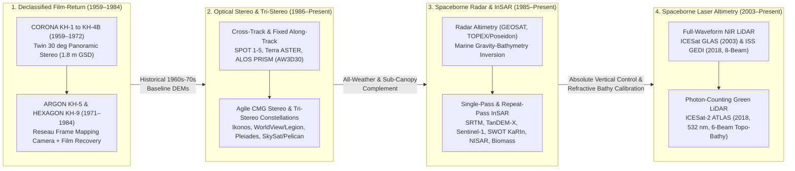

## 7.5 Spaceborne Platforms

Moving from airborne and marine vehicles to **spaceborne platforms** operating in Low Earth Orbit (LEO, altitudes $H \in [400, 1336]\text{ km}$) fundamentally alters the physics, kinematics, and error budgets of elevation mapping. Whereas an aircraft or survey vessel is buffeted continuously by atmospheric turbulence or ocean surface waves—requiring high-rate ($100\text{--}1000\text{ Hz}$) tightly coupled GNSS/INS integration to track high-frequency translational heave and angular roll/pitch perturbations—a spacecraft moves in a vacuum along a smooth gravitational trajectory governed by Keplerian mechanics and Earth's multipole geopotential. Conversely, operating across an orbital lever arm of $500\text{--}800\text{ km}$ magnifies angular attitude uncertainties by two orders of magnitude compared to airborne mapping: a star-tracker or gyroscope pointing bias of just $1\text{ arcsecond}$ ($\Delta\theta \approx 4.85\text{ }\mu\text{rad}$) at $H = 600\text{ km}$ translates directly into a $2.91\text{ m}$ planimetric ground shift ($\Delta x \approx H\,\Delta\theta$), which on a $30^\circ$ mountain slope induces a $1.68\text{ m}$ vertical elevation error.

Spaceborne platforms uniquely provide uniform, non-intrusive, global-scale coverage across geopolitical boundaries, extreme polar environments, and vast oceanic basins. Over the past seven decades, four distinct spaceborne architectural paradigms have evolved to reconstruct terrestrial elevation ($z$, positive-up) and marine/coastal bathymetric depth ($d$, positive-down):



---

### 7.5.1 Orbital Mechanics, Viewing Geometry, and the Spaceborne Error Budget

The spatial sampling pattern, revisit period, solar illumination geometry, and tidal aliasing characteristics of any spaceborne elevation mission are dictated by its six classical Keplerian orbital elements $(a, e, i, \Omega, \omega, \nu)$ and their secular perturbations under Earth's oblate gravity field.

#### 1. Sun-Synchronous vs. Non-Sun-Synchronous Orbits

Because Earth's equatorial bulge produces an oblateness zonal harmonic $J_2 \approx 1.08263 \times 10^{-3}$, a satellite orbiting at semi-major axis $a = R_e + H$ (where $R_e = 6378.137\text{ km}$), eccentricity $e$, and inclination $i$ experiences a secular torque that precesses the Right Ascension of the Ascending Node ($\Omega$) at a mean rate:

$$\dot{\Omega} = -\frac{3}{2} J_2 \left(\frac{R_e}{a(1 - e^2)}\right)^2 n \cos i, \qquad n = \sqrt{\frac{GM_e}{a^3}} \tag{7.1}$$

where $GM_e = 3.986004418 \times 10^{14}\text{ m}^3\,\text{s}^{-2}$ is Earth's gravitational parameter and $n$ is the mean motion ($\text{rad/s}$). To maintain a constant local solar time across all latitudes throughout the year—a **Sun-Synchronous Orbit (SSO)**—the nodal precession rate must match Earth's mean orbital rate around the Sun:

$$\dot{\Omega}_{\text{SSO}} = +\frac{360^\circ}{365.2422\text{ days}} \approx +0.9856^\circ\,\text{day}^{-1} \approx 1.991 \times 10^{-7}\text{ rad s}^{-1} \tag{7.2}$$

Because $J_2 > 0$, achieving $\dot{\Omega} > 0$ requires $\cos i < 0$, placing SSO platforms into slightly retrograde, near-polar orbits with inclinations $i \in [97.0^\circ, 99.0^\circ]$ for $H \in [450, 850]\text{ km}$. Within the SSO family, two distinct Local Times of the Ascending/Descending Node ($\text{LTAN}/\text{LTDN}$) dominate DEM acquisition:

* **Mid-Morning / Early-Afternoon SSO ($\approx 10:00\text{--}10:30$ or $13:30$ Local Solar Time):** Used by virtually all optical stereo missions (`SPOT`, `Terra ASTER`, `ALOS PRISM`, `WorldView-1/2/3`, `GeoEye-1`, `Pléiades 1A/1B/Neo`, `SkySat`). A $10:30\text{ AM}$ equator crossing provides moderate solar elevation angles ($35^\circ\text{--}65^\circ$) that generate sufficient topographic shading and surface texture for dense image correlation while minimizing tropical afternoon cumulus cloud convection and avoiding excessive topographic cast shadows.
* **Dawn-Dusk SSO ($\approx 06:00 / 18:00$ Local Solar Time):** Used by power-intensive active Synthetic Aperture Radar (SAR) missions (`RADARSAT-2`, `TerraSAR-X` / `TanDEM-X`, `Sentinel-1`, `NISAR`, `ESA Biomass`). Riding the day-night terminator keeps the spacecraft's solar arrays nearly continuously illuminated by the Sun (eliminating battery-draining orbital eclipses for most of the year) while flying through the dawn/dusk minimum of ionospheric Total Electron Content (TEC) gradients, which reduces L- and P-band Faraday rotation and phase scintillation.
* **Non-Sun-Synchronous Prograde Orbits ($i \in [51.6^\circ, 92^\circ]$):** Missions whose primary physics or host vehicles preclude sun-synchrony operate in prograde inclinations. The Space Shuttle (`SRTM`, $i = 57^\circ$) and the International Space Station (`GEDI`, $i = 51.6^\circ$) were constrained by crewed launch safety corridors, leaving polar caps unmapped beyond $\pm 60^\circ$ and $\pm 51.6^\circ$ latitude, respectively. Dedicated ocean/hydrology altimeters (`TOPEX/Poseidon` and `Jason-1/2/3` at $i = 66.0^\circ$, `SWOT` at $i = 77.6^\circ$) intentionally avoid sun-synchronous orbits so that the semi-diurnal solar tide ($S_2$, $12.00\text{ h}$ period) and lunar tide ($M_2$, $12.42\text{ h}$ period) are not aliased into static elevation biases or annual cycles. Similarly, `ICESat` ($94^\circ$) and `ICESat-2` ($92^\circ$) occupy near-polar non-SSO orbits to push coverage to $\pm 88^\circ$ latitude across Greenland and Antarctica while sampling across diurnal melt and tidal cycles.

#### 2. Base-to-Height Ratio ($B/H$), Agile Body-Pointing, and Error Propagation

For spaceborne optical stereo systems reconstructing terrain height $z$ from a forward viewing off-nadir pitch angle $\theta_f$ and a backward viewing pitch angle $\theta_b$ (measured in the orbital plane relative to local nadir, with $\theta_f > 0$ and $\theta_b < 0$), the effective along-track **Base-to-Height ratio** ($B/H$) over a spherical Earth of radius $R_e$ is:

$$\frac{B}{H} = \tan\theta_f - \tan\theta_b + \mathcal{O}\!\left(\frac{H}{R_e}\right) \tag{7.3}$$

For a symmetric convergence geometry ($\theta_f = -\theta_b = \theta_c$), $\frac{B}{H} \approx 2\tan\theta_c$. Thus, $\theta_c = 15^\circ$ (`CORONA KH-4B`, `Pléiades` outer tri-stereo) yields $B/H \approx 0.54$, whereas $\theta_c = 24^\circ$ (`ALOS PRISM` forward-backward) yields $B/H \approx 0.89\text{--}1.0$.

Two mechanical architectures achieve this stereo baseline in orbit:
1. **Fixed Multi-Telescope Pushbroom / Panoramic Systems (`CORONA KH-4B`, `Terra ASTER`, `ALOS PRISM`, `SPOT 5 HRS`):** Dedicated fore, nadir, and/or aft optical assemblies are rigidly mounted to a common optical bench. The spacecraft maintains a nadir-pointing attitude while the terrain passes sequentially through the forward, nadir, and backward fields of view over $\Delta t = B / v_g \approx 35\text{--}90\text{ s}$ (where ground track velocity $v_g \approx 6.7\text{--}7.1\text{ km/s}$).
2. **Agile Single-Telescope Body-Slewing Spacecraft (`Ikonos`, `QuickBird`, `WorldView-1/2/3/Legion`, `GeoEye-1`, `Pléiades 1A/1B/Neo`, `SkySat/Pelican`):** A single long-focal-length Cassegrain or Korsch telescope ($f \approx 5\text{--}13\text{ m}$) is mounted to the spacecraft bus. High-torque **Control Moment Gyroscopes (CMGs)** slew the entire $800\text{--}2800\text{ kg}$ spacecraft in pitch and roll at rates of $1^\circ\text{--}4^\circ\,\text{s}^{-1}$, scanning a forward strip, pitching back through nadir to scan a second (or third, for tri-stereo) strip of the same target within $30\text{--}60\text{ s}$, while performing continuous **Time-Delayed Integration (TDI)** rate control to prevent motion blur.

The total vertical uncertainty $\sigma_z$ (TVU) and horizontal uncertainty $\sigma_{xy}$ (THU) of a spaceborne optical stereo DEM prior to Ground Control Point (GCP) or laser-altimetry co-registration are governed by three error sources:

$$\sigma_z^2 = \underbrace{\left(\frac{H}{B} \cdot \text{GSD} \cdot \sigma_{p,\text{px}}\right)^2}_{\text{Image matching disparity noise}} + \underbrace{\left(\frac{H}{\cos^2\theta_c} \cdot \frac{H}{B} \cdot \sigma_{\Delta\theta}\right)^2}_{\text{Relative attitude \& jitter error}} + \underbrace{\sigma_{z,\text{orb}}^2 + \left(\tan\beta \cdot \sigma_{xy,\text{abs}}\right)^2}_{\text{Absolute orbit/pointing \& slope coupling}} \tag{7.4}$$

where $\text{GSD} = \frac{H\,p_{\text{det}}}{f\cos^2\theta_c}$ is the effective along-track Ground Sample Distance (m) for detector pitch $p_{\text{det}}$ and focal length $f$, $\sigma_{p,\text{px}}$ is the sub-pixel stereo matcher disparity precision (typically $0.1\text{--}0.3\text{ px}$ for Semi-Global Matching [SGM] or More Global Matching [MGM]), $\sigma_{\Delta\theta}$ is the relative pitch/roll attitude knowledge error and micro-vibration jitter between the two views, $\sigma_{z,\text{orb}}$ is the radial orbital ephemeris uncertainty ($2\text{--}5\text{ cm}$ with dual-frequency GPS/Galileo precise orbit determination), and $\tan\beta$ is the local terrain slope coupled with absolute planimetric pointing error $\sigma_{xy,\text{abs}} \approx H\,\sigma_{\theta,\text{abs}}$.

> [!WARNING]
> **Platform Micro-Vibration ("Jitter") and Cross-Track Ripple Artifacts:** Because linear pushbroom scanners acquire image lines sequentially at $5\text{--}20\text{ kHz}$, any unmodeled angular micro-vibration $\delta\theta(t) = \sum_k A_k \sin(2\pi f_k t + \phi_k)$ excited by reaction wheel imbalances, CMG gimbals, cryocoolers, or solar-array stepping motors ($f_k \in [0.5, 150]\text{ Hz}$) perturbs the line-of-sight of individual scanlines. As the sub-satellite ground point advances at ground-track velocity $v_g = v_{\text{sat}}\frac{R_e}{R_e + H} \approx 6.7\text{--}7.1\text{ km s}^{-1}$, each structural vibration mode $f_k$ imprints a spatial ripple of along-track wavelength:
>
> $$\Lambda_k = \frac{v_g}{f_k} \tag{7.4\text{a}}$$
>
> In a stereo pair, the differential pitch jitter $\Delta\theta_{\text{jitter}}(t)$ between the forward and backward passes translates directly via Equation $(7.4)$ into coherent, periodic **cross-track elevation ripples** of $0.2\text{--}2.5\text{ m}$ amplitude and $\Lambda_k \in [45\text{ m}, 14\text{ km}]$ along-track wavelength (e.g., $f_k = 70\text{ Hz}$ reaction-wheel harmonics produce $\Lambda_k \approx 100\text{ m}$ ripples, whereas $1.4\text{ Hz}$ solar-array flexing produces $\Lambda_k \approx 5\text{ km}$ waves). Modern pipelines (`NASA ASP jitter_solve`, `MicMac`, and `xdem` directional destriping) estimate and remove these high-frequency attitude oscillations directly from stereo tie-point residuals or multi-spectral band-to-band parallax offsets.

---

### 7.5.2 Declassified Reconnaissance Film-Return Satellites (`CORONA`, `ARGON`, `LANYARD`, `HEXAGON`, 1959–1984)

Modern digital spaceborne DEMs (`SRTM`, `ASTER`, `TanDEM-X`, `WorldView`) begin only in 1999–2000, leaving the critical mid-20th-century era of rapid glacier retreat, Cold War mega-dam construction, deforestation, and urban expansion without digital elevation baselines. A historic turning point in `gis-history` (1959 CORONA milestone) occurred when President Bill Clinton signed Executive Order 12951 in February 1995 (with subsequent releases in 2002 and 2011), declassifying over $990,000$ photographs acquired between 1959 and 1984 by the U.S. Central Intelligence Agency (CIA) and U.S. Air Force **Keyhole (`KH-1` through `KH-9`)** reconnaissance satellites.

#### 1. `CORONA` (`KH-1` to `KH-4B`, 1959–1972), `ARGON` (`KH-5`), and `LANYARD` (`KH-6`)

Before the invention of the Charge-Coupled Device (CCD) in 1969, high-resolution spaceborne reconnaissance relied on exposing silver-halide polyester film in low orbit ($H \approx 150\text{--}210\text{ km}$) and physically returning the film to Earth inside heat-shielded atmospheric re-entry capsules ("buckets"). After retro-fire and parachute deployment at $15,000\text{ ft}$ over the Pacific Ocean near Hawaii, the descending capsule was snatched mid-air by a USAF C-119 *Flying Boxcar* or C-130 *Hercules* aircraft trailing a winch-mounted trapeze hook.

While `KH-1`, `KH-2`, and `KH-3` (1959–1961) carried single nadir panoramic cameras and `ARGON` (`KH-5`, 1961–1964) carried a low-resolution ($140\text{ m}$ GSD) $f = 76\text{ mm}$ frame mapping camera, **stereoscopic high-resolution spaceborne photogrammetry was born in February 1962 with `KH-4` (*Mural*)**, evolving through `KH-4A` (1963–1969, adding a second recovery bucket) to the definitive **`KH-4B` (1967–1972)**:
* **Twin Convergent Panoramic Architecture:** `KH-4B` mounted two counter-rotating Itek Petzval lenses ($f = 609.6\text{ mm}$ [$24\text{ in}$], $f/3.5$) on an M-shaped stereo optical bench tilted $+15^\circ$ forward and $-15^\circ$ aft of nadir ($30^\circ$ convergence angle, yielding $B/H \approx 0.54\text{--}0.60$).
* **Dynamic Scanning Geometry:** Each lens rotated continuously across a $70^\circ$ cross-track scan arc, exposing a $5.5 \times 75.7\text{ cm}$ image strip on $70\text{ mm}$-wide Eastman Kodak ultra-thin polyester film with resolving power up to $160\text{ line-pairs/mm}$, achieving a native nadir ground resolution of **$1.8\text{ m}$ ($6\text{ ft}$)** across a $\sim 14 \times 188\text{ km}$ ground footprint.
* **Panoramic Distortion Modeling:** Because the spacecraft translated forward at $v_{\text{sat}} \approx 7.8\text{ km/s}$ while the panoramic lens swept cross-track at angular velocity $\omega_{\text{scan}} \approx 3.4\text{--}6.0\text{ rad/s}$ (accompanied by mechanical Forward Motion Compensation [FMC] cam rocking), `KH-4B` imagery exhibits compound **cylindrical panoramic projection distortion** (with cross-track scan angle $\alpha = y_{\text{film}}/f \in [-35^\circ, +35^\circ]$, along-track film scale decreases as $\cos\alpha$ and cross-track film scale as $\cos^2\alpha$) and S-shaped **dynamic scan-sweep distortion**. Standard frame-camera collinearity equations fail on `CORONA` strips; rigorous reconstruction requires integrating the time-dependent exterior orientation $(\mathbf{p}_{\text{sat}}(t), \mathbf{R}_{\text{sat}}(t))$ as a function of the film-axis scan coordinate $y_{\text{film}} = f\,\alpha(t)$ over the scan duration $\Delta t = \alpha / \omega_{\text{scan}}$ from center exposure epoch $t_0$:

$$\begin{bmatrix} x_{\text{film}} - x_0 - \dot{x}_{\text{FMC}}\Delta t \\ f\sin\alpha \\ -f\cos\alpha \end{bmatrix} = \lambda_{\text{scale}}\,\mathbf{R}_{\text{cam}}(\theta_{\text{tilt}}) \mathbf{R}_{\text{sat}}^T(t_0 + \alpha/\omega_{\text{scan}}) \left(\mathbf{X}_W - \mathbf{p}_{\text{sat}}(t_0 + \alpha/\omega_{\text{scan}})\right) \tag{7.5}$$

where $(x_0, 0)$ is the principal point on the cylindrical film platen, $\dot{x}_{\text{FMC}}$ is the mechanical FMC linear velocity, $\mathbf{R}_{\text{cam}}(\theta_{\text{tilt}})$ is the fixed $\pm 15^\circ$ fore/aft stereo convergence rotation, $\lambda_{\text{scale}}$ is the perspective scale factor, and $\mathbf{X}_W$ is the 3D ground coordinate in the Earth-Centered Earth-Fixed (ECEF) frame.

#### 2. `HEXAGON` (`KH-9`, 1971–1984) Mapping Camera System (MCS)

Between 1971 and 1984, twenty `KH-9 HEXAGON` ("Big Bird") satellites—the largest reconnaissance spacecraft of the Cold War ($18.9\text{ m}$ long, carrying four film-return buckets)—flew dual $0.6\text{ m}$-resolution panoramic cameras alongside a dedicated metric **Mapping Camera System (MCS)** on twelve missions (Missions 1205–1216, 1973–1980). Designed explicitly for the Defense Mapping Agency (DMA, predecessor to NGA) to build global geodetic control:
* **Metric Frame Geometry:** The `KH-9` MCS was a true metric frame camera ($f = 304.8\text{ mm}$ [$12\text{ in}$], $f/6.0$) exposing massive $22.9 \times 45.7\text{ cm}$ ($9 \times 18\text{ in}$) frames on $9.5\text{-inch}$ film at $6\text{--}9\text{ m}$ GSD over a $130 \times 260\text{ km}$ ground footprint. Sequential frames were triggered with $55\%\text{--}70\%$ forward overlap, providing **tri-stereo coverage** ($B/H \approx 0.4$ between adjacent frames and $B/H \approx 0.8$ between alternate frames $n$ and $n+2$).
* **The 1,058 Reseau Grid Crosses:** During exposure, the film was pressed by pneumatic pressure against a precision-ground glass focal-plane platen etched with a $23 \times 46$ matrix of **1,058 micro-engraved reseau crosses** spaced exactly $10.000\text{ mm}$ apart (plus four corner fiducial marks). When archival duplicate negatives stored at the USGS Earth Resources Observation and Science (EROS) Center are digitized at $7\text{--}14\text{ }\mu\text{m}$ resolution, automated template matching of all 1,058 reseau crosses allows a piecewise bivariate spline or thin-plate spline transformation to remove five decades of non-uniform film shrinkage, warpage, and scanner transport errors down to $\sigma_{\text{film}} < 2.0\text{ }\mu\text{m}$ ($\approx 0.15\text{--}0.3\text{ pixels}$).
* **Unlocking Pre-Anthropocene Baseline DEMs:** Once dewarped via reseau marks (`KH-9`) or modeled with time-dependent panoramic camera rigs (`KH-4B`) in open-source suites such as **NASA Ames Stereo Pipeline (`ASP`)** or **MicMac**, and co-registered to stable off-glacier/non-urban terrain from `ICESat-2` or `Copernicus DEM`, these historical archives yield $2\text{--}10\text{ m}$-posting DEMs with vertical accuracy $\sigma_z \approx 1.5\text{--}4.5\text{ m}$. They provide an irreplaceable window into **1960s–1970s glacier mass balance** across the Himalayas, Andes, and Alaska (Maurer et al., 2019; Dehecq et al., 2020), pre-urbanization fault scarps across active seismic zones, and the pristine fluvial geomorphology of major river basins prior to inundation by large reservoirs.

---

### 7.5.3 Civil and Commercial Optical Stereo and Tri-Stereo Constellations

The transition from film-return reconnaissance to civil and commercial electro-optical digital DEM generation progressed through three technological waves:

#### 1. Cross-Track Steerable Mirrors to Fixed Along-Track Pushbroom (`SPOT`, `ASTER`, `ALOS PRISM`)

* **SPOT 1–5 (1986–2015) and SPOT 6/7 (2012–present):** Launched by CNES in 1986, `SPOT 1` (`HRV`, $10\text{ m}$ panchromatic) pioneered civil satellite stereo by tilting a steerable flat mirror up to $\pm 27^\circ$ **cross-track** to view the same swath from adjacent orbits separated by $1\text{--}26\text{ days}$. While geometrically strong ($B/H$ up to $1.0$), multi-day cross-track stereo suffered severely from temporal radiometric decorrelation (cloud evolution, transient snow cover, agricultural plowing, and changing shadow geometry). `SPOT 5` (2002) solved this by adding the dedicated `HRS` **along-track** fore/aft stereo instrument ($B/H = 0.8$), followed by the agile body-pointing `SPOT 6` and `SPOT 7` ($1.5\text{ m}$ GSD along-track stereo/tri-stereo).
* **Terra ASTER (1999–present):** Launched aboard NASA's `Terra` flagship in December 1999, the Japanese Ministry of Economy, Trade and Industry (METI) `ASTER` sensor incorporated a nadir Near-Infrared telescope (`Band 3N`, $0.76\text{--}0.86\text{ }\mu\text{m}$, $15\text{ m}$ GSD) and a dedicated backward-looking telescope (`Band 3B`, tilted $27.6^\circ$ aft to yield $B/H = 0.6$ after a $55\text{ s}$ orbital delay). Stacking over two million cloud-screened scenes produced the global **ASTER GDEM** (Versions 1–3, $30\text{ m}$ posting covering $83^\circ\text{N}$ to $83^\circ\text{S}$), though residual cloud edges, sensor jitter, and scene-boundary steps limit its point-to-point vertical precision ($\text{RMSE}_z \approx 8\text{--}15\text{ m}$).
* **ALOS PRISM (2006–2011) and `AW3D30`:** JAXA's `ALOS` (*Daichi*) `PRISM` sensor ($2.5\text{ m}$ GSD, $35\text{ km}$ triplet swath) introduced the first civil spaceborne **three-line along-track tri-stereo** optical bench: Forward ($+23.8^\circ$), Nadir ($0^\circ$), and Backward ($-23.8^\circ$) telescopes giving an outer $B/H = 1.0$ and inner $B/H = 0.5$, tightly stabilized by high-bandwidth star trackers. Multi-scene stacking of `PRISM` triplets produced the commercial $5\text{ m}$ `ALOS World 3D (AW3D)` and the open **$30\text{ m}$ `AW3D30` DSM** ($\sigma_z \approx 4.4\text{ m}$ RMSE globally; Tadono et al., 2016).

#### 2. Commercial Sub-Meter Agile Stereo and Tri-Stereo (`Ikonos`, `WorldView`, `Pléiades`, `Planet`)

* **Ikonos (1999) and QuickBird (2001):** Marking the 1999 `gis-history` commercial space milestone, Space Imaging's `Ikonos` ($0.82\text{ m}$ panchromatic, $H = 681\text{ km}$) and DigitalGlobe's `QuickBird` (2001, $0.61\text{ m}$, $H = 450\text{ km}$) demonstrated that CMG-equipped commercial spacecraft could slew rapidly along-track to capture sub-meter stereo pairs on demand. To protect proprietary star-tracker and camera-rig geometry while enabling rigorous photogrammetry, the industry standardized the **Rational Polynomial Coefficient (RPC / RP00B)** sensor model (Grodecki & Dial, 2003), which expresses normalized image line and sample coordinates $(r_n, c_n) \in [-1, +1]^2$ as ratios of cubic polynomials (20 terms each) of normalized geodetic latitude, longitude, and ellipsoidal height $(\phi_n, \lambda_n, h_n)$.
* **WorldView-1/2/3/Legion & GeoEye-1 (`ArcticDEM`, `REMA`, `EarthDEM`):** Operating at $H \in [450, 770]\text{ km}$ with native nadir panchromatic GSDs of $0.50\text{ m}$ (`WorldView-1`, `WorldView-2`), $0.41\text{ m}$ (`GeoEye-1`), and **$0.31\text{ m}$** (`WorldView-3` and the high-revisit multi-plane `WorldView Legion` constellation launched in 2024), these agile spacecraft supply the petabyte-scale archive processed by the Polar Geospatial Center (PGC) into open **$2\text{ m}$-posting time-stamped strip and mosaic DSMs**: **ArcticDEM** (all land north of $60^\circ\text{N}$), the **Reference Elevation Model of Antarctica (REMA)**, and **EarthDEM** (Noh & Howat, 2015; Porter et al., 2018). When co-registered to `ICESat-2` laser altimetry, `WorldView` $2\text{ m}$ DSMs achieve internal relative vertical precision of $\sigma_z \approx 0.20\text{--}0.40\text{ m}$ on bare rock and snow.
* **Pléiades 1A/1B (2011–2012) and Pléiades Neo (2021–present):** Built by Airbus Defence and Space at $H \approx 694\text{ km}$ (`1A/1B`, $0.50\text{ m}$ native / $0.70\text{ m}$ physical GSD) and $H \approx 620\text{ km}$ (`Pléiades Neo`, $0.30\text{ m}$ native GSD), the Pléiades constellations were engineered from inception for **single-pass along-track tri-stereo** (typically pitched at $+14^\circ$, $0^\circ$, and $-14^\circ$, or narrower $+6^\circ / 0^\circ / -6^\circ$ for dense urban/alpine canyons).
  * *Why Tri-Stereo Is Transformative:* In classical two-view wide-baseline stereo ($B/H \approx 0.6$), steep mountainsides, forest clearings, and narrow urban streets suffer from severe **geometric occlusion** (one camera cannot see the base of a cliff or street occluded by the opposite wall) and perspective distortion of building façades. Adding a third near-nadir view creates two narrow-baseline pairs ($B/H \approx 0.25$) that preserve radiometric similarity and see directly into steep valleys and urban canyons, while the outer pair ($B/H \approx 0.5$) provides high geometric intersection strength on open gentle terrain.
  * *Through-Water Bathymetric Photogrammetry:* In clear oligotrophic coastal waters and coral atolls (Secchi depth $> 15\text{ m}$), `WorldView-2/3` and `Pléiades` blue/green bands ($450\text{--}580\text{ nm}$) image textured benthic reefs directly in tri-stereo. Because light rays bend at the air-water interface according to Snell's Law ($n_{\text{air}}\sin\theta_a = n_w\sin\theta_w$, with seawater phase refractive index $n_w \approx 1.34$), standard vacuum RPC bundle adjustment underestimates true water depth $d_{\text{true}}$ by a viewing-angle-dependent refractive factor:
    $$\frac{d_{\text{true}}}{d_{\text{apparent}}} = \frac{\tan\theta_a}{\tan\theta_w} = \frac{\sqrt{n_w^2 - \sin^2\theta_a}}{\cos\theta_a} \approx 1.34\text{--}1.48 \quad (\text{for }\theta_a \in [0^\circ, 35^\circ];\text{ Dietrich, 2017; Hodúl et al., 2018})$$
* **Planet Labs (founded 2010, `gis-history` milestone) `SkySat` and `Pelican`:** Complementing its daily-revisit `PlanetScope` ($3\text{ m}$) Dove CubeSat flock, Planet operates the `SkySat` ($0.50\text{ m}$ GSD, launched 2013–2020) and next-generation `Pelican` ($0.30\text{ m}$ GSD, launched 2023–present) agile micro-satellites. By capturing continuous overlapping frame/pushframe triplets and full-motion video ($30\text{ Hz}$) as the satellite slews across a target over $30\text{--}90\text{ s}$, `SkySat` enables rapid $1\text{ m}$-posting multi-view stereo (MVS) DSMs of ephemeral volcanic eruptions, landslides, and glacier calving fronts (Bhushan et al., 2021).

---

### 7.5.4 Spaceborne Radar Altimeters, Interferometric SAR (InSAR), and Laser Altimeters

Active microwave radar and optical laser altimeters overcome the two fundamental limitations of passive optical stereo: **cloud cover / polar night** and **inability to sense beneath dense forest canopies or featureless ocean surfaces**.

#### 1. Radar Altimetry and Marine Gravity-Derived Bathymetry (`GEOSAT` 1985, `TOPEX/Poseidon` 1992)

Because seawater attenuates electromagnetic radiation within millimeters (microwaves) to tens of meters (blue-green light), mapping the $71\%$ of Earth covered by deep oceans from space requires an indirect physical proxy: **marine gravity**. Uncharted abyssal hills, fracture zones, and seamounts of density $\rho_c \approx 2700\text{--}2900\text{ kg m}^{-3}$ exert excess gravitational attraction compared to surrounding seawater ($\rho_w \approx 1028\text{ kg m}^{-3}$), pulling the equipotential ocean surface (the marine geoid) upward into a subtle topographic dome of $1\text{--}20\text{ m}$ amplitude per kilometer of seafloor relief.

The U.S. Navy **`GEOSAT`** mission (1985–1990, Ku-band $13.5\text{ GHz}$ nadir radar altimeter, Exact Repeat and Geodetic Missions) and the joint NASA/CNES **`TOPEX/Poseidon`** mission (1992–2006, dual-frequency Ku/C-band altimeter with DORIS/GPS precise orbit determination achieving $\sim 2\text{ cm}$ Sea Surface Height [SSH] accuracy, followed by `Jason-1/2/3`, `CryoSat-2`, `SARAL/AltiKa`, and `Sentinel-6 Michael Freilich`) revolutionized global seafloor mapping. As formulated by **Smith and Sandwell (1997)**, after removing dynamic ocean topography and tides, the 2D Fourier transform of the sea-surface gravity anomaly $\Delta g(\mathbf{k})$ (derived from along-track sea-surface slopes as a function of cyclical spatial frequency $|\mathbf{k}| = 1/\lambda_{\text{topo}}$ in $\text{m}^{-1}$) is linked to seafloor bathymetry $h_b(\mathbf{k})$ around mean ocean depth $d_0$ via Parker's upward-continuation transfer function:

$$\Delta g(\mathbf{k}) = 2\pi G (\rho_c - \rho_w) e^{-2\pi |\mathbf{k}| d_0} h_b(\mathbf{k}) \implies h_b(\mathbf{k}) = \frac{1}{2\pi G(\rho_c - \rho_w)} e^{+2\pi |\mathbf{k}| d_0} \Delta g(\mathbf{k}) \tag{7.6}$$

where $2\pi G(\rho_c - \rho_w) \approx 72.2\text{ mGal km}^{-1}$ is the unattenuated Bouguer slab admittance (for $\rho_c - \rho_w = 1722\text{ kg m}^{-3}$). Because the upward-continuation exponential $e^{+2\pi |\mathbf{k}| d_0}$ amplifies high-frequency altimeter noise at full topographic wavelengths $\lambda_{\text{topo}}$ shorter than $2\pi d_0 \approx 25\text{ km}$ (corresponding to half-wavelength feature widths $\lambda_{1/2} = \pi d_0 \approx 12.6\text{ km}$ for $d_0 = 4\text{ km}$) and lithospheric flexural isostasy masks gravity signals at wavelengths $> 160\text{ km}$, satellite altimetry is bandpass-filtered inside $\lambda_{\text{topo}} \in [15, 160]\text{ km}$ and calibrated regionally against sparse shipboard multibeam echosounder (MBES) tie-lines to construct the global background grids of **`SRTM15+`** and **`GEBCO`** (Tozer et al., 2019).

#### 2. Spaceborne Interferometric SAR (InSAR): From `SRTM` to `TanDEM-X`, `SWOT`, `NISAR`, and `ESA Biomass`

In Synthetic Aperture Radar Interferometry (InSAR; detailed in Chapter 9), two SAR antennas separated by a **perpendicular baseline** $B_\perp$ normal to the slant-range line of sight $R$ (at incidence angle $\theta_{\text{inc}}$ and wavelength $\lambda$) measure the interferometric phase difference $\Delta\phi = \frac{2\pi p}{\lambda}\Delta R \approx \frac{2\pi p B_\perp}{\lambda R \sin\theta_{\text{inc}}} z$. Here $p = 1$ for **standard bistatic** operation (one antenna transmits, two antennas receive simultaneously, so only the one-way path difference varies) and $p = 2$ for **monostatic repeat-pass or pursuit/ping-pong** operation (both two-way paths vary). A $2\pi$ phase cycle corresponds to the **Height of Ambiguity ($h_a$)**:

$$h_a = \frac{\lambda R \sin\theta_{\text{inc}}}{p\, B_\perp}, \qquad \sigma_z^{\text{InSAR}} = \frac{h_a}{2\pi}\,\sigma_\phi(\gamma, N_L) \tag{7.7}$$

where $\sigma_\phi$ is the interferometric phase standard deviation, which improves with coherence $\gamma \in [0, 1]$ and number of multi-looks $N_L$.

* **Shuttle Radar Topography Mission (`SRTM`, February 2000, `gis-history` milestone):** Over an 11-day mission (STS-99, $H = 233\text{ km}$, $i = 57^\circ$), Space Shuttle *Endeavour* deployed a **$60\text{ m}$ extendable carbon-fiber mast** from its payload bay. Inboard (payload bay) and outboard (mast-tip) C-band ($\lambda = 5.6\text{ cm}$, $225\text{ km}$ ScanSAR swath) and X-band ($\lambda = 3.1\text{ cm}$, $50\text{ km}$ high-resolution swath) antennas acquired **single-pass bistatic interferometry** ($p = 1$) over $80\%$ of Earth's landmass ($60^\circ\text{N}$ to $56^\circ\text{S}$; Farr et al., 2007). Simultaneous acquisition completely eliminated temporal decorrelation and atmospheric delay differences, though subtle $0.1\text{ Hz}$ thermo-elastic mast oscillations excited by shuttle attitude thrusters left $1\text{--}3\text{ m}$ cross-track/along-track wave artifacts across the resulting $1\text{ arcsec}$ ($\sim 30\text{ m}$) global DEM.
* **`TanDEM-X` (2010–present) and the `Copernicus DEM`:** To overcome the physical length limit of mechanical masts in space, DLR launched `TanDEM-X` (2010) to fly in a closely controlled **Helix formation** ($B_\perp \approx 120\text{--}500\text{ m}$) with its twin `TerraSAR-X` (2007) at $H = 514\text{ km}$ ($\lambda = 3.1\text{ cm}$ X-band). By combining a small out-of-plane ascending node separation ($\Delta\Omega$, creating maximum horizontal separation at the equator) with an in-plane eccentricity/perigee offset ($\Delta\mathbf{e}$, creating maximum vertical separation at the poles), the two spacecraft spiral safely around each other without ever crossing paths (Krieger et al., 2007). Acquiring global dual-baseline bistatic coverages (2010–2015) enabled automated dual-baseline phase unwrapping and produced the $12\text{ m}$ **`TanDEM-X DEM`** ($\text{LE90} < 2\text{ m}$ relative, $< 10\text{ m}$ absolute) and the hydrologically edited $30\text{ m}$ (**`GLO-30`**) and $90\text{ m}$ (**`GLO-90`**) **Copernicus DEM**—currently the highest-fidelity open global radar DSM.
* **`Sentinel-1` (2014–present):** Operating in C-band ($\lambda = 5.55\text{ cm}$) Interferometric Wide-Swath (`IW` TOPS mode, $250\text{ km}$ swath) with a $6\text{--}12\text{ day}$ repeat cycle and orbital tube tightly controlled within $B_\perp < 150\text{ m}$, `Sentinel-1A/B/C` has a large height of ambiguity ($h_a > 100\text{ m}$) intentionally tuned to minimize topographic sensitivity and maximize sensitivity to **line-of-sight surface deformation** (Differential InSAR [DInSAR] and Persistent Scatterer / SBAS velocity fields down to $1\text{--}2\text{ mm yr}^{-1}$).
* **`SWOT` (Surface Water and Ocean Topography, December 2022):** Jointly developed by NASA and CNES ($H = 891\text{ km}$, $i = 77.6^\circ$), `SWOT` carries **KaRIn** (Ka-band Radar Interferometer, $\lambda = 0.84\text{ cm}$ [$35.75\text{ GHz}$]) with two antennas separated by a **$10\text{ m}$ rigid mast** ($p = 1$) imaging two $50\text{ km}$ swaths at near-nadir incidence angles $\theta_{\text{inc}} \in [0.6^\circ, 3.9^\circ]$ (Fu et al., 2024). Because $\lambda$ and $\sin\theta_{\text{inc}}$ are both small, a compact $10\text{ m}$ mast achieves $h_a \approx 3.5\text{--}22\text{ m}$, resolving 2D Water Surface Elevation ($z_{\text{WSE}}$) and river slopes ($\sim 1\text{ cm km}^{-1}$) across rivers wider than $50\text{--}100\text{ m}$, lakes, floodplains, and coastal estuaries, while doubling the spatial resolution of marine gravity-derived bathymetry down to $\sim 8\text{ km}$ half-wavelength!
* **`NISAR` (L+S Band) and `ESA Biomass` (P-Band, launched 2025):** Short-wavelength X-band (`TanDEM-X`) and C-band (`SRTM`) microwaves scatter primarily from upper leaves, needles, and twigs, producing a **canopy-biased DSM** that sits $5\text{--}35\text{ m}$ above the bare ground in forests. Longer wavelengths penetrate deeper into vegetation: **NASA-ISRO `NISAR`** ($\lambda = 24\text{ cm}$ L-band + $\lambda = 9.4\text{ cm}$ S-band, $12\text{-day}$ repeat) tracks sub-canopy ground deformation, ice-sheet velocity, and ecosystem structure, while **`ESA Biomass`** (launched in 2025 with a $12\text{ m}$ deployable mesh reflector operating at **P-band, $\lambda = 69\text{ cm}$ [$435\text{ MHz}$]**) uses multi-baseline **Polarimetric InSAR (PolInSAR)** and **SAR Tomography (TomoSAR)** to separate the vertical backscatter profile of tropical forest canopies from the **true sub-canopy ground terrain elevation** ($z_{\text{ground}}$).

#### 3. Spaceborne Laser Altimeters (`ICESat GLAS`, `ICESat-2 ATLAS`, `ISS GEDI`)

Whereas imaging stereo and InSAR provide continuous 2D swaths that suffer from long-wavelength attitude tilts, baseline calibration drift, or canopy bias, **spaceborne laser altimeters (LiDAR)** measure direct two-way laser time-of-flight ($R = \frac{1}{2} c\,\Delta t_{\text{ToF}}$) with centimeter-level range precision, serving as the **global vertical reference frame and sub-canopy/bathymetric truth** for all other DEMs:
* **`ICESat GLAS` (2003–2009):** NASA's first Ice, Cloud, and land Elevation Satellite carried the Geoscience Laser Altimeter System (`GLAS`), firing a single $1064\text{ nm}$ (near-infrared) laser beam at $40\text{ Hz}$ ($172\text{ m}$ along-track spacing) that illuminated $\sim 65\text{--}70\text{ m}$ diameter footprints and digitized the full return waveform. Over flat ice sheets, `GLAS` achieved $\sigma_z < 0.15\text{ m}$, but on sloping terrain ($\tan\beta$), the wide $70\text{ m}$ footprint spread the return waveform vertically by $\Delta z_{\text{slope}} \approx D_{\text{fp}}\tan\beta$ and coupled off-nadir laser pointing knowledge errors $\sigma_\theta$ directly into elevation error ($\sigma_{z,\text{point}} = H\tan\beta\,\sigma_\theta$).
* **`ICESat-2 ATLAS` (2018–present):** To eliminate large-footprint slope errors and resolve fine-scale topography, `ICESat-2` ($H \approx 496\text{ km}$, $i = 92^\circ$) replaced analog full-waveform NIR LiDAR with the **Advanced Topographic Laser Altimeter System (`ATLAS`)**: a **$532\text{ nm}$ (green) photon-counting micro-pulse laser** firing at **$10\text{ kHz}$** ($0.70\text{ m}$ along-track pulse spacing) with a narrow **$11\text{--}13\text{ m}$ footprint diameter** (Markus et al., 2017; Neuenschwander & Pitts, 2019). A diffractive optical element splits the laser into **6 beams arranged in 3 pairs** spaced $3.3\text{ km}$ apart cross-track; within each pair, a strong beam and a weak beam ($4:1$ energy ratio) are separated by **$90\text{ m}$ cross-track**, allowing direct separation of cross-track terrain slope from temporal elevation change!
  * *Green-Laser Spaceborne Bathymetry:* Because $532\text{ nm}$ green photons penetrate clear coastal, lacustrine, and coral-reef waters down to $30\text{--}40\text{ m}$ depth ($1.5\text{--}2.5$ diffuse attenuation lengths $K_d^{-1}$), `ICESat-2` records both sea-surface specular photons and refracted **seafloor bathymetric photons** (`ATL03` raw geolocated photons and the dedicated **`ATL24` Global Coastal Bathymetry** product; Parrish et al., 2019). Because light pulses travel slower in seawater at group refractive index $n_{g,w} \approx 1.34116$ ($532\text{ nm}$) and refract toward the normal at angle $\theta_w = \arcsin(\frac{n_{\text{air}}}{n_{p,w}}\sin\theta_a)$, applying the water-column group-velocity and Snell refraction correction ($d_{\text{true}} = \frac{c_{g,w}}{c_{\text{air}}}\cos\theta_w\, d_{\text{uncorr}} = \frac{\cos\theta_w}{n_{g,w}}\, d_{\text{uncorr}} \approx 0.7456\,d_{\text{uncorr}}$ at nadir) yields decimeter-accurate bathymetric profiles that calibrate optical **Satellite-Derived Bathymetry (SDB)** models across remote reefs worldwide without deploying a single survey boat.
* **`ISS GEDI` (Global Ecosystem Dynamics Investigation, 2018–present):** Mounted on the International Space Station ($H \approx 415\text{ km}$, $i = 51.6^\circ$), `GEDI` employs three $1064\text{ nm}$ Nd:YAG lasers (two full-power, one split into two coverage beams) optically dithered cross-track to produce **8 parallel ground tracks** spaced $600\text{ m}$ apart ($4.2\text{ km}$ total swath), with **$25\text{ m}$ footprint diameter** and $60\text{ m}$ along-track spacing (Dubayah et al., 2020). By digitizing the full vertical waveform ($1\text{ ns}$ bins $\approx 15\text{ cm}$) through dense temperate and tropical forests, `GEDI` (`L2A` elevation/height metrics) isolates the **lowest Gaussian mode (`elev_lowestmode`)** corresponding to the sub-canopy ground surface, providing over 10 billion bare-earth reference points used to train and bias-correct global bare-earth DTM models (`FABDEM`, `GEDTM30`).

| Platform / Mission (Era) | Orbit & Altitude ($H$) | Sensor Architecture & Wavelength | Stereo $B/H$ or InSAR $B_\perp$ | Native Posting / Footprint | Typical TVU ($\sigma_z$, $1\sigma$) | Primary DEM Products & Domain |
| :--- | :--- | :--- | :--- | :--- | :--- | :--- |
| **`CORONA KH-4B`** (1967–1972) | Prograde LEO ($150\text{--}185\text{ km}$) | Twin $30^\circ$ convergent panoramic film ($500\text{--}700\text{ nm}$) | $B/H \approx 0.54\text{--}0.60$ | $1.8\text{ m}$ GSD ($4\text{--}8\text{ m}$ DEM) | $2.0\text{--}5.0\text{ m}$ (after GCP/DEM align) | Historical 1960s glacier & pre-dam DEMs |
| **`HEXAGON KH-9 MCS`** (1973–1980) | Sun-Sync / LEO ($155\text{--}240\text{ km}$) | Metric frame film camera w/ 1,058 reseau crosses | $B/H \approx 0.4\text{--}0.8$ (tri-stereo) | $6\text{--}9\text{ m}$ GSD ($12\text{--}24\text{ m}$ DEM) | $1.5\text{--}4.0\text{ m}$ (after reseau + align) | Regional 1970s baseline DEMs ($130\times 260\text{ km}$) |
| **`Terra ASTER`** (1999–present) | 10:30 SSO ($705\text{ km}$, $98.2^\circ$) | Nadir + $27.6^\circ$ aft NIR pushbroom ($810\text{ nm}$) | $B/H = 0.60$ | $15\text{ m}$ GSD ($30\text{ m}$ DEM) | $6.0\text{--}12.0\text{ m}$ | `ASTER GDEM v3` ($30\text{ m}$ global DSM) |
| **`ALOS PRISM`** (2006–2011) | 10:30 SSO ($692\text{ km}$, $98.2^\circ$) | 3-telescope fore/nadir/aft tri-stereo ($520\text{--}770\text{ nm}$) | $B/H = 1.0$ (outer), $0.5$ (inner) | $2.5\text{ m}$ GSD ($5\text{ m} / 30\text{ m}$ DEM) | $1.5\text{--}4.4\text{ m}$ | `AW3D` ($5\text{ m}$), `AW3D30` ($30\text{ m}$ open DSM) |
| **`WorldView-1/2/3/Legion`** (2007–present) | 10:30 SSO ($450\text{--}770\text{ km}$) | Agile CMG body-slewing pushbroom ($450\text{--}800\text{ nm}$) | $B/H \approx 0.35\text{--}0.80$ (agile) | $0.31\text{--}0.50\text{ m}$ GSD ($2\text{ m}$ DEM) | $0.20\text{--}0.50\text{ m}$ (co-registered) | `ArcticDEM`, `REMA`, `EarthDEM` ($2\text{ m}$ DSMs) |
| **`Pléiades 1A/1B / Neo`** (2011–present) | 10:30 SSO ($620\text{--}694\text{ km}$) | Agile CMG single-pass tri-stereo ($450\text{--}850\text{ nm}$) | $B/H \approx 0.25\text{--}0.60$ (tri-stereo) | $0.30\text{--}0.50\text{ m}$ GSD ($1\text{--}2\text{ m}$ DEM) | $0.15\text{--}0.40\text{ m}$ (co-registered) | Urban/alpine DSMs, reef bathy ($d \le 15\text{ m}$) |
| **`SRTM`** (Feb 2000) | Prograde ($233\text{ km}$, $57.0^\circ$) | Single-pass InSAR ($60\text{ m}$ mast, C- & X-band) | $B_\perp \approx 45\text{--}60\text{ m}$ ($p=1$) | $30\text{ m}$ ($1\text{ arcsec}$) | $3.5\text{--}6.0\text{ m}$ | `SRTM GL1` / `NASADEM` ($\pm 60^\circ$ lat DSM) |
| **`TanDEM-X`** (2010–present) | 06:00/18:00 SSO ($514\text{ km}$, $97.4^\circ$) | Helix bistatic X-band InSAR ($\lambda = 3.1\text{ cm}$) | $B_\perp \approx 120\text{--}500\text{ m}$ ($p=1$) | $12\text{ m}$ / $30\text{ m}$ (`GLO-30`) | $0.8\text{--}1.8\text{ m}$ | `TanDEM-X` ($12\text{ m}$), **Copernicus DEM** ($30\text{ m}$) |
| **`SWOT KaRIn`** (2022–present) | Prograde ($891\text{ km}$, $77.6^\circ$) | Single-pass Ka-band InSAR ($\lambda = 0.84\text{ cm}$, $10\text{ m}$ mast) | $B_\perp \approx 10\text{ m}$ ($p=1$, $\theta_{\text{inc}} < 4^\circ$) | $100\text{--}250\text{ m}$ raster / nodes | $0.03\text{--}0.10\text{ m}$ (water surface) | River/lake/ocean WSE & marine gravity bathy |
| **`ESA Biomass`** (2025–present) | 06:00/18:00 SSO ($666\text{ km}$, $98.1^\circ$) | Multi-pass P-band PolInSAR/TomoSAR ($\lambda = 69\text{ cm}$) | $B_\perp \approx 150\text{--}750\text{ m}$ ($p=2$) | $50\text{--}200\text{ m}$ | $2.0\text{--}4.0\text{ m}$ (sub-canopy) | Tropical forest biomass & sub-canopy DTM |
| **`ICESat-2 ATLAS`** (2018–present) | Near-Polar ($496\text{ km}$, $92.0^\circ$) | 6-beam $532\text{ nm}$ photon-counting laser ($10\text{ kHz}$) | N/A (Direct ToF + $90\text{ m}$ pair) | $11\text{ m}$ footprint, $0.7\text{ m}$ step | $0.03\text{--}0.10\text{ m}$ (flat) / $0.25\text{ m}$ (bathy) | `ATL06` (Ice), `ATL08` (Land), `ATL24` (Bathy) |
| **`ISS GEDI`** (2018–present) | Prograde ISS ($415\text{ km}$, $51.6^\circ$) | 8-beam $1064\text{ nm}$ full-waveform laser ($242\text{ Hz}$) | N/A (Direct ToF waveform) | $25\text{ m}$ footprint, $60\text{ m}$ step | $0.30\text{--}1.50\text{ m}$ (sub-canopy) | `GEDI L2A/L2B` sub-canopy ground & canopy height |

---

### 7.5.5 Worked Numerical Comparison: Agile Optical Stereo vs. Bistatic X-Band InSAR

To illustrate how orbital altitude, baseline geometry, and attitude/phase noise govern spaceborne DEM precision, let us compare two flagship single-pass systems operating near $H \approx 500\text{ km}$:

#### Case A: Agile Along-Track Optical Stereo (`WorldView` / `Pléiades` Class)
Consider an agile satellite at $H = 500\text{ km}$ pitching symmetrically to $\theta_f = +16^\circ$ and $\theta_b = -16^\circ$, yielding $\frac{B}{H} = 2\tan 16^\circ = 0.5735$ ($B = 286.7\text{ km}$). At off-nadir angle $\theta_c = 16^\circ$, the effective ground sample distance is $\text{GSD} = 0.50\text{ m}$. Suppose dense stereo matching (e.g., SGM in `NASA ASP`) achieves disparity precision $\sigma_{p,\text{px}} = 0.20\text{ pixels}$, while high-frequency reaction-wheel micro-vibration leaves an unmodeled relative pitch jitter of $\sigma_{\Delta\theta} = 0.08\text{ arcseconds} = 3.88 \times 10^{-7}\text{ rad}$ between the fore and aft passes:
1. **Matching Disparity Component:**
   $$\sigma_{z,\text{match}} = \frac{H}{B} \cdot \text{GSD} \cdot \sigma_{p,\text{px}} = \frac{1}{0.5735} \times 0.50\text{ m} \times 0.20 = 0.174\text{ m}$$
2. **Relative Attitude Jitter Component:**
   $$\sigma_{z,\text{jitter}} = \frac{H}{\cos^2\theta_c} \cdot \frac{H}{B} \cdot \sigma_{\Delta\theta} = \frac{500,000\text{ m}}{\cos^2(16^\circ)} \times \frac{1}{0.5735} \times 3.88 \times 10^{-7}\text{ rad} = 541,026\text{ m} \times 1.7437 \times 3.88 \times 10^{-7} = 0.366\text{ m}$$
3. **Combined Relative TVU:** $\sigma_{z,\text{rel}} = \sqrt{0.174^2 + 0.366^2} = \mathbf{0.405\text{ m}}$. Notice that even sub-tenth-arcsecond attitude jitter ($\sim 0.4\text{ }\mu\text{rad}$) dominates the relative vertical error budget from $500\text{ km}$ orbit!

#### Case B: Bistatic Helix Formation X-Band InSAR (`TanDEM-X` Class)
Now consider `TanDEM-X` at $H = 514\text{ km}$, slant range $R = 615\text{ km}$, incidence angle $\theta_{\text{inc}} = 35^\circ$, radar wavelength $\lambda = 0.0311\text{ m}$ (X-band), and perpendicular baseline $B_\perp = 250\text{ m}$ in bistatic mode ($p = 1$):
1. **Height of Ambiguity ($h_a$):**
   $$h_a = \frac{\lambda R \sin\theta_{\text{inc}}}{p\, B_\perp} = \frac{0.0311\text{ m} \times 615,000\text{ m} \times \sin(35^\circ)}{1 \times 250\text{ m}} = \frac{10,970.5\text{ m}^2}{250\text{ m}} = \mathbf{43.88\text{ m}}$$
2. **Phase Noise Vertical Uncertainty:** For coherence $\gamma = 0.85$ and $N_L = 16$ looks, the interferometric phase standard deviation is $\sigma_\phi \approx 0.14\text{ rad}$ ($\approx 8.0^\circ$). Propagating via Equation $(7.7)$:
   $$\sigma_z^{\text{InSAR}} = \frac{h_a}{2\pi}\,\sigma_\phi = \frac{43.88\text{ m}}{2\pi} \times 0.14\text{ rad} = \mathbf{0.98\text{ m}}$$
3. **Baseline Knowledge Sensitivity:** A $1\text{ mm}$ radial baseline knowledge error ($\delta B_\parallel = 10^{-3}\text{ m}$) between the two Helix satellites induces a systematic cross-track height ramp of $\delta z = -\frac{R\sin\theta_{\text{inc}}}{B_\perp}\delta B_\parallel = -\frac{352,750\text{ m}}{250\text{ m}} \times 10^{-3}\text{ m} = \mathbf{-1.41\text{ m}}$—explaining why dual-frequency carrier-phase differential GPS must track the inter-satellite baseline vector to $< 1\text{ mm}$ precision, and why tying the final InSAR mosaic to `ICESat`/`ICESat-2` laser altimetry is mandatory.

---

### 7.5.6 Reproducible Workflow: Spaceborne Stereo Reconstruction (`NASA ASP`) and `ICESat-2` Co-Registration (`xdem`)

In production workflows, practitioners reconstruct a high-resolution optical stereo DSM (from commercial RPC pairs or declassified `KH-4B`/`KH-9` imagery) using the **NASA Ames Stereo Pipeline (`ASP`)** (Beyer et al., 2018; Shean et al., 2016) and then remove residual orbital/attitude planimetric shifts $(\Delta x, \Delta y, \Delta z)$ and tilt ramps by co-registering the DSM against **`ICESat-2` (`ATL06`/`ATL08`)** laser altimetry profiles using **`xdem`**:

```bash
# 1. Bundle adjust a WorldView/Pleiades RPC stereo pair constrained by a coarse reference DEM (Copernicus GLO-30)
bundle_adjust WV03_fwd.ntf WV03_bwd.ntf WV03_fwd.xml WV03_bwd.xml \
    --heights-from-dem COP30_ref.tif --heights-from-dem-uncertainty 10.0 \
    -t rpc -o ba_run/run

# 2. Orthoproject (mapproject) both images onto the reference DEM using bundle-adjusted RPCs to remove 95% of disparity
mapproject --tr 0.50 COP30_ref.tif WV03_fwd.ntf WV03_fwd.xml WV03_fwd_ortho.tif --bundle-adjust-prefix ba_run/run
mapproject --tr 0.50 COP30_ref.tif WV03_bwd.ntf WV03_bwd.xml WV03_bwd_ortho.tif --bundle-adjust-prefix ba_run/run

# 3. Run dense Multi-View / More-Global Matching (MGM --stereo-algorithm asp_mgm) and triangulate
parallel_stereo WV03_fwd_ortho.tif WV03_bwd_ortho.tif WV03_fwd.xml WV03_bwd.xml \
    stereo_out/run COP30_ref.tif \
    --bundle-adjust-prefix ba_run/run --stereo-algorithm asp_mgm --subpixel-mode 9

# 4. Rasterize the 3D point cloud to a 2.0 m GeoTIFF DSM and ray-intersection error grid (WGS84 / UTM Zone 10N)
point2dem --tr 2.0 --t_srs "EPSG:32610" --errorimage stereo_out/run-PC.tif
```

```python
import geopandas as gpd
import numpy as np
import xdem

# Load the raw 2.0 m spaceborne stereo DSM and stable bare-ground ICESat-2 ATL08 reference points
dsm = xdem.DEM("stereo_out/run-DEM.tif")
icesat2_pts = gpd.read_file("icesat2_atl08_stable_ground.gpkg").to_crs(dsm.crs)

# Fit a 3D Nuth & Kääb (2011) translation + 1st-order orbital tilt deramping pipeline against ICESat-2
coreg_pipeline = xdem.coreg.NuthKaab() + xdem.coreg.Deramp(poly_order=1)
dsm_aligned = coreg_pipeline.fit_and_apply(
    reference_elev=icesat2_pts,
    to_be_aligned_elev=dsm,
    z_name="h_te_best_fit",  # ICESat-2 ATL08 terrain height above WGS84 ellipsoid
)

# Compute robust Normalized Median Absolute Deviation (NMAD) before and after co-registration
dh_before = dsm.interp_points(
    (icesat2_pts.geometry.x.values, icesat2_pts.geometry.y.values)
) - icesat2_pts["h_te_best_fit"].values
dh_after = dsm_aligned.interp_points(
    (icesat2_pts.geometry.x.values, icesat2_pts.geometry.y.values)
) - icesat2_pts["h_te_best_fit"].values

print(f"Pre-alignment  Median bias: {np.nanmedian(dh_before):+.2f} m | NMAD: {xdem.spatialstats.nmad(dh_before):.2f} m")
print(f"Post-alignment Median bias: {np.nanmedian(dh_after):+.2f} m | NMAD: {xdem.spatialstats.nmad(dh_after):.2f} m")
dsm_aligned.save("WV03_2m_DSM_ICESat2_aligned.tif")
```

> [!IMPORTANT]
> **Key Takeaways for Spaceborne Platform Selection, Processing, and Survey Standards Compliance:**
> 1. **Orthorectify Before Dense Matching (`mapproject`):** Spaceborne pushbroom images span $15\text{--}60\text{ km}$ across rugged relief where raw disparity can exceed $1000\text{ pixels}$. Orthoprojecting both stereo images onto an existing $30\text{ m}$ reference DEM (`Copernicus GLO-30`) prior to stereo correlation reduces residual search disparities to a few tens of pixels, virtually eliminating matching blunders on steep slopes and accelerating SGM/MGM correlation.
> 2. **Combine Complementary Spaceborne Modalities:** No single satellite architecture solves every terrain problem. Optical tri-stereo (`WorldView`, `Pléiades`) delivers sub-meter planimetric sharpness and $2\text{ m}$ DSMs over bare rock and ice; bistatic/PolInSAR radar (`TanDEM-X`, `SWOT`, `NISAR`, `ESA Biomass`) penetrates clouds and senses water surfaces or sub-canopy topography; and spaceborne laser altimeters (`ICESat-2 ATLAS`, `ISS GEDI`) provide the absolute decimeter-accurate vertical control, sub-canopy ground truth, and refractive coastal bathymetry (`ATL24`) needed to anchor global elevation models.
> 3. **Map Spaceborne Error Budgets Realism Against Survey Standards:** Even when co-registered to `ICESat-2` or survey-grade GCPs, sub-meter commercial optical tri-stereo DSMs ($\text{RMSE}_z \approx 0.20\text{--}0.35\text{ m}$, $\text{LE95} \approx 0.39\text{--}0.69\text{ m}$ on open terrain) correspond to **ASPRS Positional Accuracy Standards $20\text{--}35\text{ cm}$ Vertical Accuracy Classes** and **USGS 3DEP Quality Level 3 (QL3)**, but cannot satisfy bare-earth **USGS 3DEP QL1/QL2 ($\text{RMSE}_z \le 10\text{ cm}$)** beneath vegetation canopies. Likewise, in coastal hydrography, `ICESat-2` green-laser bathymetry (`ATL24`, $\sigma_z \approx 0.25\text{ m}$) and optical Satellite-Derived Bathymetry (SDB) fulfill **IHO S-44 Order 2** (and approach **Order 1b** TVU limits of $a = 0.50\text{ m}, b = 0.013$ in clear shallow waters) for reconnaissance charting and shoreline change, whereas **IHO S-44 Special/Exclusive Order** and **NOAA HSSD** navigational object-detection mandates strictly require shipboard/USV multibeam sonar or dense airborne topobathymetric LiDAR.

---

### 7.5.7 Curated References

* Beyer, R. A., Alexandrov, O., & McMichael, S. (2018). The Ames Stereo Pipeline: NASA's open source software for deriving and processing terrain data. *Earth and Space Science*, 5(9), 537–548. https://doi.org/10.1029/2018EA000409
* Bhushan, S., Shean, D., Alexandrov, O., & Henderson, S. (2021). Automated digital elevation model (DEM) generation from very-high-resolution Planet SkySat triplet stereo and video imagery. *ISPRS Journal of Photogrammetry and Remote Sensing*, 173, 151–165. https://doi.org/10.1016/j.isprsjprs.2020.12.012
* Dehecq, A., Gardner, A. S., Alexandrov, O., McMichael, S., Hugonnet, R., Shean, D., & Marty, M. (2020). Automated processing of declassified KH-9 Hexagon satellite images for global glacier elevation change since the 1970s. *Frontiers in Earth Science*, 8, 566802. https://doi.org/10.3389/feart.2020.566802
* Dietrich, J. T. (2017). Bathymetric Structure-from-Motion: Extracting shallow stream bathymetry from multi-view stereo photogrammetry. *Earth Surface Processes and Landforms*, 42(2), 355–364. https://doi.org/10.1002/esp.4060
* Dubayah, R., Blair, J. B., Goetz, S., Fatoyinbo, L., Hansen, M., Healey, S., Hofton, M., Hurtt, G., Kellner, J., Luthcke, S., Armston, J., Tang, H., Duncanson, L., Hancock, S., Jantz, P., Marselis, S., Patterson, P. L., Qi, W., & Silva, C. (2020). The Global Ecosystem Dynamics Investigation: High-resolution laser ranging of the Earth's forests and topography. *Science of Remote Sensing*, 1, 100002. https://doi.org/10.1016/j.srs.2020.100002
* Farr, T. G., Rosen, P. A., Caro, E., Crippen, R., Duren, R., Hensley, S., Kobrick, M., Paller, M., Rodriguez, E., Roth, L., Seal, D., Shaffer, S., Shimada, J., Umland, J., Werner, M., Oskin, M., Burbank, D., & Alsdorf, D. (2007). The Shuttle Radar Topography Mission. *Reviews of Geophysics*, 45(2), RG2004. https://doi.org/10.1029/2005RG000183
* Fu, L.-L., Pavelsky, T., Cretaux, J.-F., Morrow, R., Farrar, J. T., Vaze, P., Sengenes, P., Vinogradova-Shiffer, N., Sylvestre-Baron, A., Picot, N., & Dibarboure, G. (2024). The Surface Water and Ocean Topography mission: A breakthrough in radar remote sensing of the ocean and land surface water. *Geophysical Research Letters*, 51(4), e2023GL107652. https://doi.org/10.1029/2023GL107652
* Grodecki, J., & Dial, G. (2003). Block adjustment of high-resolution satellite images described by rational polynomials. *Photogrammetric Engineering & Remote Sensing*, 69(1), 59–68. https://doi.org/10.14358/PERS.69.1.59
* Hodúl, M., Bird, S., Knudby, A., & Chénier, R. (2018). Satellite derived photogrammetric bathymetry. *ISPRS Journal of Photogrammetry and Remote Sensing*, 142, 268–277. https://doi.org/10.1016/j.isprsjprs.2018.06.015
* Krieger, G., Moreira, A., Fiedler, H., Hajnsek, I., Werner, M., Younis, M., & Zink, M. (2007). TanDEM-X: A satellite formation for high-resolution SAR interferometry. *IEEE Transactions on Geoscience and Remote Sensing*, 45(11), 3317–3341. https://doi.org/10.1109/TGRS.2007.900693
* Markus, T., Neumann, T., Martino, A., Abdalati, W., Brunt, K., Csatho, B., Farrell, S., Fricker, H., Gardner, A., Harding, D., Jasinski, M., Kwok, R., Magruder, L., Lubin, D., Luthcke, S., Morison, J., Nelson, R., Neuenschwander, A., Palm, S., Popescu, S., Shum, C. K., Schutz, B. E., Smith, B., Yang, Y., & Zwally, J. (2017). The Ice, Cloud, and land Elevation Satellite-2 (ICESat-2): Science requirements, concept, and implementation. *Remote Sensing of Environment*, 190, 260–273. https://doi.org/10.1016/j.rse.2016.12.029
* Maurer, J. M., Schaefer, J. M., Rupper, S., & Corley, A. (2019). Acceleration of ice loss across the Himalayas over the past 40 years. *Science Advances*, 5(6), eaav7266. https://doi.org/10.1126/sciadv.aav7266
* Neuenschwander, A., & Pitts, K. (2019). The ATL08 land and vegetation product for the ICESat-2 mission. *Remote Sensing of Environment*, 221, 247–259. https://doi.org/10.1016/j.rse.2018.11.005
* Noh, M.-J., & Howat, I. M. (2015). Automated stereophotogrammetric DEM generation at high latitudes: Surface Extraction with TIN-based Search-space Minimization (SETSM) validation and demonstration over glaciated regions. *GIScience & Remote Sensing*, 52(2), 198–217. https://doi.org/10.1080/15481603.2015.1008621
* Nuth, C., & Kääb, A. (2011). Co-registration and bias corrections of satellite elevation data sets for quantifying glacier thickness change. *The Cryosphere*, 5(1), 271–290. https://doi.org/10.5194/tc-5-271-2011
* Parrish, C. E., Magruder, L. A., Neuenschwander, A. L., Forfinski-Sarkozi, N., Alonzo, M., & Jasinski, M. (2019). Validation of ICESat-2 ATLAS bathymetry and analysis of measurement error in the Florida Keys. *Remote Sensing*, 11(14), 1634. https://doi.org/10.3390/rs11141634
* Porter, C., Morin, P., Howat, I., Noh, M.-J., Bates, B., Peterman, K., Keesey, S., Schlenk, M., Gardiner, J., Tomko, K., Willis, M., Kelleher, C., Cloutier, M., Husby, E., Foga, S., Nakamura, H., Platson, M., Wethington, M., Jr., Williamson, C., … Bojesen, M. (2018). *ArcticDEM, Version 3* [Data set]. Harvard Dataverse. https://doi.org/10.7910/DVN/OHHUKH
* Shean, D. E., Alexandrov, O., Moratto, Z. M., Smith, B. E., Joughin, I. R., Porter, C., & Morin, P. (2016). An automated, open-source pipeline for mass production of digital elevation models (DEMs) from very-high-resolution commercial stereo satellite imagery. *ISPRS Journal of Photogrammetry and Remote Sensing*, 116, 101–117. https://doi.org/10.1016/j.isprsjprs.2016.03.012
* Smith, W. H. F., & Sandwell, D. T. (1997). Global sea floor topography from satellite altimetry and ship depth soundings. *Science*, 277(5334), 1956–1962. https://doi.org/10.1126/science.277.5334.1956
* Tadono, T., Nagai, H., Ishida, H., Oda, F., Naito, S., Minakawa, K., & Iwamoto, H. (2016). Generation of the 30 m-mesh global digital surface model by ALOS PRISM. *International Archives of the Photogrammetry, Remote Sensing and Spatial Information Sciences*, XLI-B4, 157–162. https://doi.org/10.5194/isprs-archives-XLI-B4-157-2016
* Tozer, B., Sandwell, D. T., Smith, W. H. F., Olson, C., Beale, J. R., & Wessel, P. (2019). Global bathymetry and topography at 15 arc sec: SRTM15+. *Earth and Space Science*, 6(10), 1847–1864. https://doi.org/10.1029/2019EA000658
