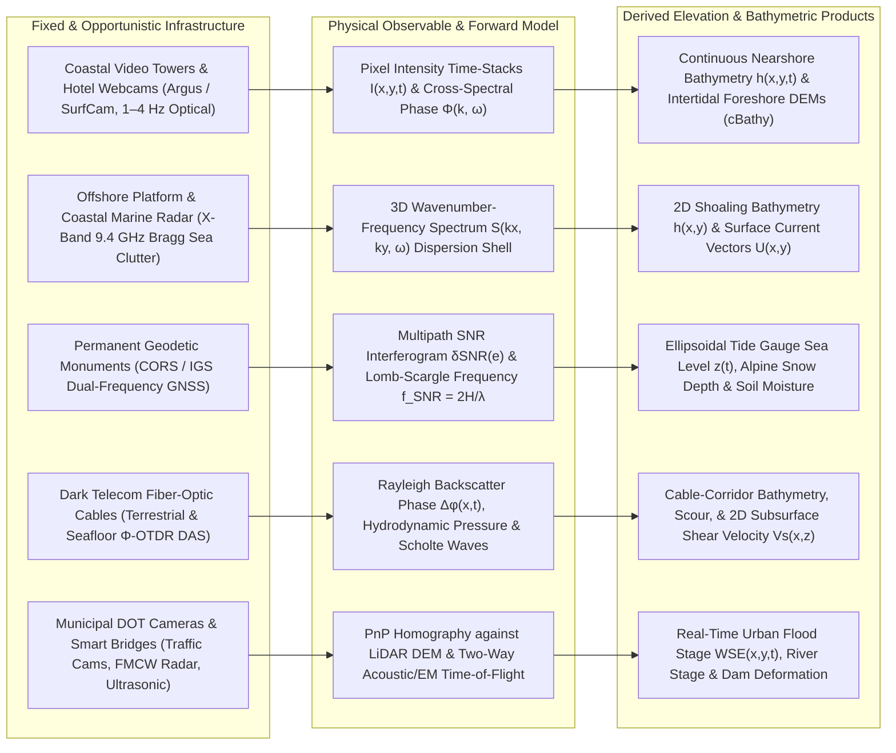

## 7.6 Using Fixed Infrastructure to Detect the World (Opportunistic & Stationary Sensing)

Mobile survey platforms—aircraft, satellites, uncrewed aerial vehicles (UAVs), and hydrographic vessels—provide broad spatial coverage but suffer from a fundamental operational trade-off: they sample the Earth's surface episodically. Worse, the most rapid and destructive geomorphological changes occur precisely when mobile platforms cannot safely operate. During category-force hurricanes, extratropical bomb cyclones, alpine blizzards, or flash floods, aircraft are grounded, optical satellites are blinded by thick cloud decks, and hydrographic survey launches cannot enter the breaking surf zone or debris-laden rivers.

Stationary and opportunistic sensing reverses the paradigm of platform kinematics. By mounting active or passive sensors onto fixed civil infrastructure—or by repurposing existing geodetic monuments, telecommunications cables, and municipal camera networks as unintentional topographic and bathymetric observatories—practitioners trade platform mobility for continuous, sub-hourly temporal resolution ($\Delta t \sim 1\text{ s}$ to $1\text{ hr}$) anchored directly to a static, survey-grade terrestrial reference frame. Because the sensor position $\mathbf{X}_s = [X_s, Y_s, Z_s]^\top$ is invariant (or tracked continuously to millimeter precision), platform trajectory errors are virtually eliminated, shifting the error budget entirely onto viewing-geometry obliquity, environmental propagation physics, and geophysical inverse modeling.



---

### 7.6.1 Coastal Video Monitoring Systems (`Argus`, Webcams) and Marine X-Band Radar

The nearshore surf zone ($0 < d < 10\text{ m}$) is one of the most dynamic morphodynamic environments on Earth, where submerged sandbars migrate tens of meters during a single storm event. Starting in the late 1980s and formalized by the Coastal Imaging Lab at Oregon State University (Holman & Stanley, 2007), the **Argus** coastal monitoring network—and subsequent open-source community frameworks such as the Coastal Imaging Research Network (**CIRN**) and citizen-science **CoastSnap** stations—demonstrated that fixed optical cameras mounted on coastal towers, lighthouses, high-rise beachfront hotels, or cliff tops can continuously reconstruct both intertidal foreshore topography and submerged nearshore bathymetry.

#### Photogrammetric Rectification and Intertidal Foreshore Profiling
A stationary camera with calibrated interior orientation (focal length $f$, principal point $(u_0, v_0)$, and Brown-Conrady radial/tangential distortion coefficients) and exterior position $\mathbf{X}_c = [X_c, Y_c, Z_c]^\top$ and attitude matrix $\mathbf{R}(\omega, \phi, \kappa)$ solved via ground control points (GCPs) projects 3D world coordinates $\mathbf{X} = [x, y, z]^\top$ onto undistorted 2D image pixel coordinates $(u, v)$ via the collinearity equations. Because a single camera provides only two equations per pixel for three unknown world coordinates, an additional geometric constraint is required. By assuming that the instantaneous mean water surface forms a horizontal plane at the known tidal plus wave-setup elevation $z = z_{\text{wl}}(t)$, the mapping from image coordinates $(u, v)$ to horizontal world coordinates $(x, y)$ becomes an invertible $3\times 3$ planar homography:

$$\begin{bmatrix} x \\ y \\ 1 \end{bmatrix} = \lambda_{\text{scale}} \mathbf{H}(z_{\text{wl}}(t)) \begin{bmatrix} u \\ v \\ 1 \end{bmatrix}$$

where $\lambda_{\text{scale}}$ is the projective homogeneous scale factor. Because coastal cameras view the ocean at high oblique incidence angles $\theta_i$ measured from nadir ($\theta_i = \tan^{-1}(r / H_c)$, where $H_c = Z_c - z_{\text{wl}}$ is camera height above water and $r$ is horizontal radial standoff), the rectified ground sample distance (GSD) degrades anisotropically with range. For an angular instantaneous field of view $\Delta\theta_{\text{IFOV}} \approx p / f$ (pixel pitch $p$ divided by focal length $f$), the azimuthal (alongshore) footprint $\Delta a$ and radial (cross-shore) footprint $\Delta r$ grow as:

$$\Delta a \approx \frac{H_c}{\cos\theta_i} \Delta\theta_{\text{IFOV}} = \sqrt{r^2 + H_c^2}\,\Delta\theta_{\text{IFOV}}, \qquad \Delta r \approx \frac{H_c}{\cos^2\theta_i} \Delta\theta_{\text{IFOV}} = \left(\frac{r^2 + H_c^2}{H_c}\right)\Delta\theta_{\text{IFOV}}$$

Standard coastal video stations record three core data products every hour over a 10-minute acquisition window at $1\text{–}4\text{ Hz}$:
1. **Snapshot images**, which capture individual breaking wave crests.
2. **Time-exposure (`timex`) images**, formed by averaging pixel intensities $\bar{I}(u,v) = \frac{1}{N}\sum_{n=1}^N I(u,v,t_n)$ over 10 minutes. Preferential wave breaking over shallow submerged sandbars and along the shoreline swash zone produces bright, high-albedo white foam bands that directly trace submerged bar crests and the intertidal shoreline contour $z(x,y) = z_{\text{tide}}(t) + \bar{\eta}_{\text{setup}}(t)$. By tracking this shoreline contour across the rising and falling astronomical tide, a complete 3D **intertidal foreshore DEM** is assembled daily with vertical accuracy $\text{TVU} \approx 0.10\text{–}0.20\text{ m}$ ($1\sigma$) (Plant et al., 2007).
3. **Variance (`var`) and pixel time-stack arrays**, where a sparse grid of rectified cross-shore and alongshore pixels is sampled at $2\text{ Hz}$ to track the phase propagation of incident surface gravity waves.

#### Wave Celerity Inversion (`cBathy`) for Submerged Bathymetry
Outside and across the surf zone, the phase speed (celerity) $c = \omega / k$ of surface gravity waves is governed by the linear Airy wave dispersion relation:

$$\omega^2 = g k \tanh(k h)$$

where $\omega = 2\pi f$ is the angular wave frequency ($\text{rad s}^{-1}$), $k = |\mathbf{k}| = 2\pi / L$ is the wavenumber magnitude ($\text{rad m}^{-1}$) for wavelength $L$ ($\text{m}$), $g \approx 9.80665\text{ m s}^{-2}$ is gravitational acceleration, and $h = z_{\text{wl}} - z_{\text{bed}}$ is the local total water depth ($\text{m}$, positive-down). In the shallow-water limit ($kh \ll 1$, where $\tanh(kh) \approx kh$), celerity simplifies to the non-dispersive form $c \approx \sqrt{gh}$, meaning waves slow down directly in proportion to the square root of depth. For general intermediate water depths ($0.05 < kh < \pi$), solving the dispersion relation explicitly for depth $h$ given measured $(\omega, k)$ pairs yields:

$$h(x,y) = \frac{1}{k(x,y)} \tanh^{-1}\!\left(\frac{\omega^2}{g k(x,y)}\right)$$

Implicit differentiation of $\omega^2 = gk\tanh(kh)$ at fixed frequency $\omega$ reveals how wavenumber estimation uncertainty $\sigma_k$ propagates into vertical depth uncertainty $\sigma_h$:

$$\sigma_h \approx \left|\frac{\partial h}{\partial k}\right| \sigma_k = \left(\frac{2kh + \sinh(2kh)}{2k^2}\right) \sigma_k$$

Because $\sinh(2kh)$ grows exponentially as $kh \to \pi$ ($h \to L/2$), depth inversion sensitivity to noise explodes in deep water where orbital wave motion no longer interacts with the seabed.

The industry-standard open-source algorithm **`cBathy`** (Holman et al., 2013) operationalizes this inversion in the frequency domain across an arbitrary 2D pixel array:
1. Pixel intensity time series $I(\mathbf{x}_m, t)$ at each rectification grid point $\mathbf{x}_m = (x_m, y_m)$ are transformed via Fast Fourier Transform (FFT) into complex Fourier coefficients $\hat{I}(\mathbf{x}_m, f_j)$ across dominant swell frequency bands $f_j \in [0.05, 0.25]\text{ Hz}$.
2. Within a local spatial sub-tile centered at $(x_0, y_0)$, the coherence-normalized cross-spectral matrix

$$C_{mn}(f_j) = \frac{\langle \hat{I}(\mathbf{x}_m, f_j) \hat{I}^*(\mathbf{x}_n, f_j) \rangle}{\sqrt{\langle |\hat{I}(\mathbf{x}_m, f_j)|^2 \rangle \langle |\hat{I}(\mathbf{x}_n, f_j)|^2 \rangle}}$$

is computed so that spatial variations in foam brightness do not bias phase extraction, and its dominant complex spatial empirical orthogonal function (cEOF) mode $v_m(f_j)$ is extracted.
3. The spatial phase gradient of the dominant cEOF mode is fitted by nonlinear least squares to a plane wave model:

$$\hat{v}_m(f_j) = A \exp\!\Big(i \big[ k_x(x_m - x_0) + k_y(y_m - y_0) + \phi_0 \big]\Big)$$

4. Multiple frequency bands $f_j$ are combined in a weighted nonlinear inversion to solve for a single best-fit depth $\hat{h}(x_0, y_0)$, which is then assimilated over time using a **Kalman filter** whose process noise $Q(H_s)$ scales with significant wave height $H_s$. When wave optical signatures are degraded by fog, glare, or calm seas, the Kalman filter propagates the prior bathymetric state forward while growing the formal posterior vertical uncertainty $\sigma_h(x,y,t)$.

#### Marine X-Band Radar Wave-Current-Bathymetry Inversion
Whereas optical video requires daylight and clear atmospheric lines of sight, **marine X-band navigation radars** ($9.3\text{–}9.5\text{ GHz}$, $\lambda_{\text{EM}} \approx 3.2\text{ cm}$) mounted on offshore oil/gas platforms, coastal towers, or vessels operate day and night through rain and fog out to ranges of $3\text{–}5\text{ km}$. At near-grazing incidence angles ($\theta_i > 80^\circ$ measured from nadir, corresponding to grazing angles $\psi_g = 90^\circ - \theta_i < 10^\circ$), microwave backscatter from the sea surface ("sea clutter") is governed by resonant Bragg scattering from centimeter-scale capillary ripples ($\lambda_{\text{Bragg}} = \lambda_{\text{EM}} / (2\sin\theta_i)$), which are spatially and temporally modulated by longer surface gravity waves via hydrodynamic strain, local slope tilt, and geometric wave-crest shadowing.

A rotating radar antenna (rotation period $T_{\text{rot}} \approx 1.5\text{–}2.5\text{ s}$) records a 3D polar-to-Cartesian sequence of sea-clutter intensity images $I(x, y, t)$. Applying a 3D FFT over a local spatial-temporal window (typically $512 \times 512\text{ m}$ over $32\text{–}64$ rotations) maps the image sequence into the 3D wavenumber-frequency power spectrum $S(k_x, k_y, \omega)$ (Bell, 1999; Senet et al., 2001). In the presence of a depth-averaged ambient surface current vector $\mathbf{U} = [U_x, U_y]^\top$ ($\text{m s}^{-1}$), the intrinsic wave frequency $\sigma_0(k) = \sqrt{gk\tanh(kh)}$ acquires a Doppler advective shift:

$$\omega(\mathbf{k}) = \sigma_0(k) + \mathbf{k} \cdot \mathbf{U} = \sqrt{g k \tanh(k h)} + k_x U_x + k_y U_y$$

In 3D $(k_x, k_y, \omega)$ space, true gravity wave energy concentrates tightly onto a curved funnel-shaped surface—the **dispersion shell**—whereas non-wave speckle noise falls outside the shell. By fitting this 3D surface simultaneously to the spectral energy peaks across multiple azimuths and harmonics, operational systems such as **WaMoS II** simultaneously invert for both the 2D bathymetric grid $h(x,y)$ ($\text{TVU} \approx 0.3\text{–}0.5\text{ m}$ at $1\sigma$ in depths $d < 20\text{ m}$) and the 2D vector surface current field $\mathbf{U}(x,y)$.

---

### 7.6.2 GNSS Interferometric Reflectometry (GNSS-IR / GNSS-R) at Permanent Geodetic Stations

Globally, thousands of **Continuously Operating Reference Stations (CORS)** and International GNSS Service (IGS) monuments have been bolted into coastal bedrock, harbor seawalls, and alpine ridges to monitor tectonic plate motion and crustal deformation. Historically, geodesists treated multipath—signals that bounce off the surrounding ground, snow, or water surface before entering the GNSS choke-ring antenna—as a nuisance error source to be suppressed via antenna gain-pattern design and elevation cutoff masks ($e > 10^\circ\text{–}15^\circ$).

Pioneered by Kristine Larson and colleagues (Larson et al., 2009, 2013), **GNSS Interferometric Reflectometry (GNSS-IR)** repurposes these existing geodetic monuments into high-precision, zero-additional-hardware environmental sensors capable of measuring coastal sea level (tide gauges), alpine snowpack accumulation, and surface soil moisture.

#### Interferometric Multipath Geometry and Lomb-Scargle Retrieval
Consider a stationary geodetic GNSS antenna whose phase center is located at vertical reflector height $H_{\text{refl}}$ ($\text{m}$) above a planar horizontal reflecting surface (such as the coastal sea surface or an alpine snowpack). For a GNSS satellite at low elevation angle $e$ ($5^\circ \le e \le 25^\circ$), the receiver records the coherent superposition of the direct right-hand circularly polarized (RHCP) line-of-sight carrier wave and the specularly reflected wave (which remains partially RHCP at low grazing angles $e < 25^\circ$ where the Brewster angle has not yet inverted polarization to LHCP).

From planar mirror geometry, the excess path length $\Delta \rho$ traveled by the specularly reflected ray relative to the direct ray is:

$$\Delta \rho(e) = 2 H_{\text{refl}} \sin e$$

Correspondingly, the interferometric phase difference between the direct and reflected carrier signals of wavelength $\lambda$ (e.g., GPS L1 $\lambda_1 \approx 0.1903\text{ m}$, L2 $\lambda_2 \approx 0.2442\text{ m}$, L5 $\lambda_5 \approx 0.2548\text{ m}$) is:

$$\Delta \psi(e) = \frac{2\pi \Delta \rho(e)}{\lambda} = \frac{4\pi H_{\text{refl}}}{\lambda} \sin e$$

After removing the smooth low-order polynomial trend of the direct signal's antenna gain pattern from the recorded Signal-to-Noise Ratio (SNR, converted from $\text{dB-Hz}$ to linear volts/volt scale via $10^{\text{SNR}/20}$), the detrended multipath residual $\delta\text{SNR}(e)$ oscillates as a cosine wave with respect to the independent variable $x_{\text{sin}} \equiv \sin e$:

$$\delta\text{SNR}(\sin e) = A(e) \cos\!\left(\frac{4\pi H_{\text{refl}}}{\lambda} \sin e + \phi_0\right) = A(e) \cos\!\left(2\pi f_{\text{SNR}} \sin e + \phi_0\right)$$

Differentiating the interferometric phase with respect to $\sin e$ yields the fundamental **GNSS-IR frequency-height relationship**:

$$f_{\text{SNR}} = \frac{1}{2\pi} \frac{d(\Delta \psi)}{d(\sin e)} = \frac{2 H_{\text{refl}}}{\lambda} \implies H_{\text{refl}} = \frac{\lambda \, f_{\text{SNR}}}{2}$$

Because a rising or setting GNSS satellite changes its elevation angle $e(t)$ at a variable rate, the samples $\sin e(t_k)$ are unevenly spaced. Consequently, a standard FFT cannot be applied directly; instead, the dominant oscillation frequency $f_{\text{SNR}}$ is extracted using a **Lomb-Scargle periodogram** (Larson, 2024, `gnssrefl`).

#### Dynamic Sea-Surface Rate and Tropospheric Bending Corrections
When GNSS-IR is applied as a coastal tide gauge where $H_{\text{refl}}(t)$ varies dynamically during a satellite arc ($15\text{–}45\text{ min}$) due to a rising or falling tide ($\dot{H}_{\text{refl}} = dH_{\text{refl}}/dt \ne 0$), differentiating the full phase $\Delta \psi(t) = \frac{4\pi}{\lambda} H_{\text{refl}}(t)\sin e(t)$ with respect to $\sin e$ introduces a dynamic velocity bias:

$$\frac{1}{2\pi}\frac{d(\Delta \psi)}{d(\sin e)} = \frac{2}{\lambda} \left[ H_{\text{refl}} + \dot{H}_{\text{refl}} \frac{\sin e}{\cos e \, \dot{e}} \right] = \frac{2}{\lambda} \left[ H_{\text{refl}} + \dot{H}_{\text{refl}} \frac{\tan e}{\dot{e}} \right]$$

where $\dot{e} = de/dt$ ($\text{rad s}^{-1}$) is the satellite elevation angle rate. Additionally, atmospheric refraction in the lower troposphere bends low-elevation rays downward, increasing the apparent elevation angle by $\Delta e_{\text{tropo}}$. The corrected vertical reflector height is therefore:

$$H_{\text{refl, corr}} = H_{\text{refl, raw}} - \dot{H}_{\text{refl}} \frac{\tan e}{\dot{e}} - \Delta H_{\text{tropo}}(e)$$

Crucially, because the GNSS antenna's Antenna Reference Point (ARP) ellipsoidal height $h_{\text{ARP}}$ is continuously determined in the International Terrestrial Reference Frame (ITRF) via precise point positioning (PPP) or network solutions, adding the upward vertical phase center offset $\Delta z_{\text{PCO}}$ (from ARP to the frequency-specific L1/L2/L5 phase center) and subtracting $H_{\text{refl, corr}}$ yields the **absolute ellipsoidal height of the water or snow surface**:

$$h_{\text{surface}}(t) = h_{\text{ARP}}(t) + \Delta z_{\text{PCO}} - H_{\text{refl, corr}}(t)$$

This directly ties sea-level or snow-surface elevation into a global geocentric frame without requiring spirit leveling to local tide-staff benchmarks that may be subsiding due to glacial isostatic adjustment, tectonics, or sediment compaction.

---

### 7.6.3 Traffic, Security, DOT Cameras, and Smart Civil Infrastructure

Beyond dedicated scientific observatories, modern cities, transportation corridors, and telecommunications networks host millions of stationary sensors that can be co-opted for opportunistic topographic and hydrographic mapping.

#### Opportunistic Urban Webcams and DOT Cameras
Departments of Transportation (DOT), municipal flood-control districts, and commercial entities operate dense networks of uncalibrated pan-tilt-zoom (PTZ) or fixed closed-circuit television (CCTV) cameras monitoring roadways, bridges, and mountain passes. While these cameras lack pre-surveyed photogrammetric exterior orientation, their scenes are rich in static, high-contrast anthropogenic features—curb lines, lane markings, bridge piers, Jersey barriers, and standardized street signs—whose 3D coordinates $\mathbf{X}_i$ can be extracted directly from existing municipal airborne or mobile LiDAR DEMs/point clouds.

By matching 2D image keypoints $\mathbf{u}_i = (u_i, v_i)$ to 3D LiDAR structural features $\mathbf{X}_i$, a **Perspective-$n$-Point (PnP)** solver with RANSAC outlier rejection (e.g., OpenCV `cv2.solvePnPRansac`) recovers the camera's 6-DoF exterior pose $(\mathbf{X}_c, \mathbf{R})$ and focal length $f$. Once registered to the urban LiDAR DEM:
* **Urban Flash-Flood Water Surface Elevation (WSE):** Semantic segmentation networks (e.g., U-Net or Segment Anything architectures trained on water specular reflections and turbidity) delineate the 2D floodwater boundary contour in the camera frame. Projecting this waterline intersection curve onto the underlying LiDAR bare-earth DTM or vertical building facades yields real-time 3D flood stage $z_{\text{WSE}}(x,y,t)$ with vertical uncertainties of $\text{TVU} \approx 0.05\text{–}0.15\text{ m}$ ($1\sigma$) (Moy de Vitry et al., 2019).
* **Roadway and Alpine Snowpack Depth:** By measuring the pixel occlusion height along vertical roadside snow poles, guardrail posts, or static rock faces relative to a snow-free baseline reference image, monocular camera networks generate continuous snow-depth time series across avalanche-prone highway corridors.

#### Bridges, Dams, and Non-Contact River Stage Gauges
Modern "smart infrastructure" integrates downward-looking rangefinders and internal deformation sensors directly into civil structures:
* **Bridge-Mounted Radar and Ultrasonic Stage Sensors:** Downward-looking Frequency-Modulated Continuous-Wave (FMCW) microwave radars ($24\text{–}80\text{ GHz}$, e.g., USGS non-contact stage gauges) and low-cost ultrasonic transducers (e.g., Iowa Flood Center bridge sensors) measure the vertical air-gap range $R_{\text{air}}$ from the bridge deck datum $z_{\text{deck}}$ down to the river surface: $z_{\text{WSE}}(t) = z_{\text{deck}} - R_{\text{air}}(t)$. While radar propagation relies on the nearly constant speed of light in air ($c_{\text{EM}} / n_{\text{air}}$), ultrasonic sensors measure acoustic two-way time-of-flight $\Delta t_{\text{echo}}$ ($R_{\text{air}} = c_{\text{air}} \Delta t_{\text{echo}} / 2$) and require explicit air-temperature compensation because the speed of sound in dry air varies strongly with temperature $T_C$ ($^\circ\text{C}$):

$$c_{\text{air}}(T_C) \approx 331.3 \sqrt{1 + \frac{T_C}{273.15}}\text{ m s}^{-1} \approx 331.3 + 0.606 \, T_C\text{ m s}^{-1}$$

An uncompensated $20^\circ\text{C}$ diurnal air-temperature swing over a $10\text{ m}$ bridge clearance introduces a $\sim 3.5\%$ ($\approx 0.35\text{ m}$) systematic stage bias.
* **Structural Health Monitoring (SHM) on Dams and Levees:** Micro-electro-mechanical systems (MEMS) biaxial inclinometers, vibrating-wire piezometers, and robotic total stations permanently mounted on concrete arch dams and earthen levees track millimeter-level crest subsidence, hydrostatic tilt, and embankment slumping continuously between periodic terrestrial laser scanning (TLS) epochs.

#### Distributed Acoustic Sensing (DAS) on Terrestrial and Seafloor Telecom Fiber
Perhaps the most transformative opportunistic sensing technology of the past decade is **Distributed Acoustic Sensing (DAS)**, which turns preexisting "dark" (unused) single-mode optical fibers inside commercial terrestrial and submarine telecommunications cables into dense arrays of tens of thousands of synchronous strain-rate sensors (Lindsey et al., 2019; Williams et al., 2019).

A shore-based opto-electronic **interrogator unit** injects coherent laser pulses (wavelength $\lambda_{\text{laser}} \approx 1550\text{ nm}$) into one end of a standard telecom fiber and measures the interferometric phase shift $\Delta \phi(x, t)$ of light naturally backscattered by microscopic silica density fluctuations (**Rayleigh scattering**) across a sliding spatial **gauge length** $L_g$ (typically $2\text{–}10\text{ m}$) at channel spacings of $1\text{–}5\text{ m}$ over total cable distances of $50\text{–}100\text{ km}$. Axial mechanical strain $\varepsilon_{xx}(x,t)$ along the fiber axis alters both the physical path length and the refractive index $n_{\text{eff}} \approx 1.468$ via the photoelastic Pockels effect (summarized by the photoelastic scaling factor $\xi \approx 0.78$):

$$\Delta \phi(x, t) = \frac{4\pi \, n_{\text{eff}} \, L_g \, \xi}{\lambda_{\text{laser}}} \, \varepsilon_{xx}(x, t)$$

On the continental shelf, submarine telecom cables resting on or buried $0.5\text{–}2\text{ m}$ beneath the seafloor directly sense two key morphodynamic and hydrographic processes (processed via open-source Python toolkits such as `DASCore` and `ObsPy`):
1. **Ocean Surface Gravity Wave Hydrodynamic Pressure and Bathymetry:** A surface gravity wave of amplitude $\eta_0$, wavenumber $k$, and angular frequency $\omega$ exerts a dynamic bottom pressure perturbation $\Delta P_b(x,t)$ on the seabed that attenuates with water depth $h$ via the hyperbolic cosine transfer function:

$$\Delta P_b(x, t) = \frac{\rho_w g \, \eta_0}{\cosh(k h)} \cos(k x - \omega t)$$

By applying a 2D wavenumber-frequency $(k, \omega)$ FFT across consecutive DAS channels along the cable path, the Doppler-shifted ocean surface gravity wave dispersion relation $\omega(k) = \sqrt{gk\tanh(kh)} + k U_\parallel$ is directly imaged along the cable corridor, enabling continuous monitoring of along-cable water depth $h(x)$, storm-wave attenuation, and cable-parallel depth-averaged currents $U_\parallel$.
2. **Scholte-Wave Inversion and Bedload Sediment Transport:** At higher frequencies ($0.5\text{–}20\text{ Hz}$), microseismic ambient noise and hydrodynamic loading excite **Scholte waves** (seismic interface waves propagating along the water–sediment boundary). Inverting the frequency-dependent phase velocity dispersion of Scholte waves along the DAS array yields high-resolution 2D cross-sections of subseafloor shear-wave velocity $V_s(x, z)$, tracking active seabed scour around cable spans, sediment liquefaction, and subsea permafrost thaw.

---

### 7.6.4 Quantitative Comparison and Standards Compliance of Fixed & Opportunistic Sensing

| Modality | Primary Observable | Spatial Footprint & Spacing | Temporal Resolution | Typical Vertical Uncertainty ($\sigma_z$, $1\sigma$ / $\text{TVU}_{95}$) | Primary Environmental Limitation |
| :--- | :--- | :--- | :--- | :--- | :--- |
| **Coastal Video (`Argus` / `cBathy`)** | Optical intensity $I(u,v,t)$ & wave phase $\Phi(\mathbf{k}, \omega)$ | $0.5\text{–}2\text{ km}$ reach; $5\text{–}20\text{ m}$ grid | $1\text{ hr}$ (daylight) | $0.10\text{–}0.20\text{ m}$ ($1\sigma$, intertidal)<br>$0.30\text{–}0.60\text{ m}$ ($1\sigma$, submerged) | Darkness, fog, sun glare, absence of breaking/propagating waves |
| **Marine X-Band Radar (`WaMoS II`)** | 3D Bragg sea-clutter spectrum $S(k_x, k_y, \omega)$ | $3\text{–}5\text{ km}$ radius; $50\text{–}200\text{ m}$ tiles | $2\text{–}30\text{ min}$ (24/7) | $0.30\text{–}0.60\text{ m}$ ($1\sigma$, depths $3\text{–}25\text{ m}$) | Calm wind ($U_{10} < 3\text{ m s}^{-1}$, no Bragg ripples); deep water ($kh > \pi$) |
| **GNSS Reflectometry (GNSS-IR)** | Multipath SNR frequency $f_{\text{SNR}} = 2H_{\text{refl}}/\lambda$ | First Fresnel zones ($30\text{–}150\text{ m}$ arcs) | $15\text{ min}\text{–}6\text{ hr}$ (per pass) | $0.02\text{–}0.05\text{ m}$ ($1\sigma$ per pass)<br>($< 0.015\text{ m}$ daily mean) | Azimuthal obstructions; high surface roughness ($k_0 \sigma_z \sin e \gg 1$) |
| **Urban / DOT Cameras + LiDAR PnP** | Waterline / snowline pixel intersection with DEM | $10\text{–}200\text{ m}$ scene; $0.1\text{–}1\text{ m}$ pixels | $1\text{ s}\text{–}5\text{ min}$ | $0.05\text{–}0.15\text{ m}$ ($1\sigma$, flood WSE & snow pole) | Camera PTZ drift, lens raindrops, nighttime illumination |
| **Bridge FMCW Radar / Ultrasonic** | Vertical two-way travel time $\Delta t_{\text{echo}}$ | Single nadir footprint ($0.5\text{–}2\text{ m}$ spot) | $1\text{–}15\text{ min}$ (24/7) | $0.003\text{–}0.01\text{ m}$ ($1\sigma$, radar)<br>$0.02\text{–}0.05\text{ m}$ ($1\sigma$, ultrasonic) | Air temperature gradients (ultrasonic); floating debris / ice jams |
| **Telecom Fiber DAS ($\Phi$-OTDR)** | Rayleigh backscatter phase $\Delta\phi(x,t) \propto \varepsilon_{xx}$ | $50\text{–}100\text{ km}$ cable; $1\text{–}10\text{ m}$ channels | Continuous ($100\text{ Hz}\text{–}1\text{ kHz}$) | $0.20\text{–}0.50\text{ m}$ ($1\sigma$, wave $h$)<br>$V_s$ to $\pm 5\%$ | Restricted to 1D cable corridor; unknown cable burial depth/coupling |

#### Compliance with Hydrographic and Topographic Standards (IHO S-44, NOAA HSSD, USGS 3DEP, ASPRS)
When integrating stationary and opportunistic measurements into multi-source DEMs, practitioners must evaluate their uncertainty budgets against statutory mapping standards:
* **Hydrographic Charting Standards (IHO S-44 & NOAA HSSD):** Under IHO S-44 (Edition 6.1.0), maximum allowable Total Vertical Uncertainty at the $95\%$ confidence level ($\text{TVU}_{95} = 1.96\,\sigma_z$) in $d = 5\text{ m}$ water depth is $0.25\text{ m}$ for **Special Order** ($a = 0.25\text{ m}, b = 0.0075$) and $0.50\text{ m}$ for **Order 1a/1b** ($a = 0.50\text{ m}, b = 0.013$). Because submerged wave-dispersion inversions (`cBathy`, X-band radar, and DAS) exhibit $1\sigma$ vertical uncertainties of $\sigma_z \approx 0.30\text{–}0.60\text{ m}$ ($\text{TVU}_{95} \approx 0.60\text{–}1.18\text{ m}$) and lack deterministic feature detection for discrete navigational hazards, they **do not qualify** for official nautical charting under NOAA HSSD or IHO Order 1a. Instead, they serve as continuous morphodynamic change-detection layers that trigger targeted USV/airborne lidar resurveys after major storms.
* **Topographic & Water-Level Standards (USGS 3DEP, ASPRS, & NOAA CO-OPS):** Intertidal shoreline DEMs derived from `timex` video ($\text{RMSE}_z \approx 0.10\text{–}0.20\text{ m}$, $\text{NVA}_{95} = 1.96\,\text{RMSE}_z \approx 0.20\text{–}0.39\text{ m}$) meet **USGS 3DEP Quality Level 2/3 (QL2/QL3)** and **ASPRS** $10\text{–}20\text{ cm}$ vertical accuracy classes for bare-earth coastal beaches. Meanwhile, multi-constellation GNSS-IR tide gauges achieving daily mean sea-level accuracies of $1.0\text{–}1.5\text{ cm}$ ($1\sigma$) and bridge-mounted FMCW radars ($\sigma_z \le 0.01\text{ m}$) approach **NOAA CO-OPS** operational water-level monitoring tolerances while maintaining direct geocentric ITRF datum stability.

---

### 7.6.5 Worked Numerical Examples & Computational Implementation

#### Example 1: Nearshore Wave Dispersion Inversion and Finite-Amplitude Surf-Zone Bias
A coastal `Argus` station tracks incident swell at a cross-shore pixel sub-tile located $180\text{ m}$ offshore. Cross-spectral cEOF analysis at peak swell period $T = 10.0\text{ s}$ ($f = 0.10\text{ Hz}$, $\omega = 2\pi f = 0.6283\text{ rad s}^{-1}$) yields a local wavelength of $L = 65.0\text{ m}$ ($k = 2\pi / L = 0.09666\text{ rad m}^{-1}$).
1. **Linear Dispersion Inversion:** Substituting $\omega$ and $k$ into the inverted dispersion relation:
   $$\frac{\omega^2}{g k} = \frac{(0.6283)^2}{9.80665 \times 0.09666} = \frac{0.3948}{0.9479} = 0.4165$$
   $$h_{\text{linear}} = \frac{1}{0.09666} \tanh^{-1}(0.4165) = 10.345 \times 0.4434 = 4.59\text{ m}$$
2. **Finite-Amplitude Bias in the Breaking Surf Zone:** If the wave at this location is steep and breaking with root-mean-square wave height $H_{\text{rms}} = 1.8\text{ m}$, nonlinear Boussinesq/solitary wave theory shows that finite-amplitude waves travel faster than linear waves: $c_{\text{nonlinear}}^2 \approx g(h + \alpha H_{\text{rms}})$ with empirical coefficient $\alpha \approx 0.42$ (Booij, 1981; Catalan & Haller, 2008). Using linear dispersion on nonlinear surf-zone waves overestimates the true water depth by $\Delta h_{\text{bias}} \approx +0.42 H_{\text{rms}} \approx +0.76\text{ m}$ (yielding an apparent linear depth of $4.59\text{ m}$ when the finite-amplitude corrected depth is $h_{\text{corr}} = 4.59 - 0.76 = 3.83\text{ m}$).

#### Example 2: GNSS-IR Reflector Height and Dynamic Tidal Rate Correction
A coastal CORS monument (`SC02` at Friday Harbor, WA) records GPS L1 ($\lambda_1 = 0.19029\text{ m}$) SNR data during a rising satellite pass across $e \in [5^\circ, 20^\circ]$ with mean elevation $\bar{e} = 12^\circ$ and elevation rate $\dot{e} = +1.10 \times 10^{-4}\text{ rad s}^{-1}$.
1. **Static Reflector Height:** The Lomb-Scargle periodogram of $\delta\text{SNR}(\sin e)$ peaks at frequency $f_{\text{SNR}} = 68.32\text{ cycles per }\sin e$. The uncorrected reflector height is:
   $$H_{\text{refl, raw}} = \frac{\lambda_1 \, f_{\text{SNR}}}{2} = \frac{0.19029 \times 68.32}{2} = 6.500\text{ m}$$
2. **Dynamic Tide Rate Correction:** During the pass, the semi-diurnal tide is rising at $+0.36\text{ m hr}^{-1}$, which means the vertical distance $H_{\text{refl}}$ from the antenna down to the water is shrinking at $\dot{H}_{\text{refl}} = -0.36\text{ m hr}^{-1} = -1.00 \times 10^{-4}\text{ m s}^{-1}$. Applying the dynamic correction:
   $$\Delta H_{\text{dyn}} = -\dot{H}_{\text{refl}} \frac{\tan \bar{e}}{\dot{e}} = -\left(-1.00 \times 10^{-4}\text{ m s}^{-1}\right) \frac{\tan(12^\circ)}{1.10 \times 10^{-4}\text{ rad s}^{-1}} = +0.193\text{ m}$$
   This yields a corrected reflector height of $H_{\text{refl, corr}} = 6.500 + 0.193 = 6.693\text{ m}$. Neglecting the dynamic sea-surface rate term during a rapid tidal transition introduces a nearly $20\text{ cm}$ bias in a single satellite arc.

```python
import numpy as np
from scipy.signal import lombscargle

def invert_wave_depth(freq_hz: np.ndarray, k_rad_m: np.ndarray, H_rms: float = 0.0, g: float = 9.80665) -> np.ndarray:
    """Invert linear (or finite-amplitude corrected) wave dispersion for water depth h (m)."""
    omega = 2.0 * np.pi * freq_hz
    arg = np.clip((omega ** 2) / (g * k_rad_m), 0.0, 0.9999)
    h_linear = np.arctanh(arg) / k_rad_m
    # First-order finite-amplitude solitary/Boussinesq wave height correction (Catalan & Haller, 2008)
    return h_linear - 0.42 * H_rms

def gnss_ir_reflector_height(
    elev_deg: np.ndarray, snr_dbhz: np.ndarray, wavelength_m: float = 0.19029367,
    edot_rad_s: float = 0.0, hdot_m_s: float = 0.0
) -> tuple[float, float]:
    """Extract corrected GNSS-IR reflector height H_refl (m) from a low-elevation SNR arc."""
    sin_e = np.sin(np.deg2rad(elev_deg))
    # Convert dB-Hz to linear V/V and remove 2nd-order direct-signal polynomial trend
    snr_lin = 10.0 ** (snr_dbhz / 20.0)
    poly_trend = np.polyval(np.polyfit(sin_e, snr_lin, deg=2), sin_e)
    dsnr = snr_lin - poly_trend

    # Search reflector heights from 1.5 m to 20.0 m via Lomb-Scargle periodogram
    h_grid = np.linspace(1.5, 20.0, 3701)
    angular_freqs = 2.0 * np.pi * (2.0 * h_grid / wavelength_m)
    pgram = lombscargle(sin_e, dsnr, angular_freqs, normalize=True)
    h_raw = float(h_grid[np.argmax(pgram)])

    # Apply dynamic surface height rate correction (Larson et al., 2013)
    mean_tan_e = float(np.tan(np.deg2rad(np.mean(elev_deg))))
    dyn_corr = -(hdot_m_s * mean_tan_e / edot_rad_s) if abs(edot_rad_s) > 1e-9 else 0.0
    return h_raw, h_raw + dyn_corr
```

---

### 7.6.6 Common Pitfalls & Key Takeaways

> [!WARNING]
> **Common Pitfalls in Stationary & Opportunistic Sensing**
> 1. **Applying Linear Wave Dispersion Inside the Breaking Surf Zone:** In shallow breaking waves ($H_w / h > 0.4$), amplitude dispersion causes wave crests to travel significantly faster than predicted by $\omega^2 = gk\tanh(kh)$. Failing to apply a finite-amplitude correction (or weakly nonlinear Boussinesq dispersion) systematically **overestimates water depth by $15\text{–}30\%$** across shallow sandbars.
> 2. **Optical Wave-Roller Viewing-Angle Parallax:** Because coastal cameras view the surf zone at oblique grazing angles ($70^\circ\text{–}85^\circ$ from nadir), the elevated foam roller at the crest of a breaking wave (height $\Delta z_{\text{roller}} \approx 0.5\text{–}1.5\text{ m}$ above mean water level) projects horizontally offshore by $\Delta x = \Delta z_{\text{roller}} \tan\theta_i$ ($3\text{–}15\text{ m}$) when rectified onto a flat sea-level plane.
> 3. **Neglecting the $\dot{H}_{\text{refl}}$ Dynamic Correction in Macro-Tidal GNSS-IR:** Treating the sea surface as stationary during a $30\text{ min}$ GNSS satellite pass in macro-tidal regimes ($|\dot{H}_{\text{refl}}| > 0.5\text{ m hr}^{-1}$) introduces systematic $15\text{–}40\text{ cm}$ biases that alias directly into M2/S2 tidal constituent amplitudes.
> 4. **Thermal Drift of Exterior Orientation on Towers and Bridges:** Solar differential heating causes steel camera towers and suspension bridges to twist and flex by $0.1^\circ\text{–}0.5^\circ$ diurnally. At a $1000\text{ m}$ oblique standoff distance, an uncompensated $0.2^\circ$ pitch drift shifts rectified pixel footprints by $3.5\text{ m}$ horizontally in the cross-shore direction unless horizon/GCP auto-stabilization is applied to every frame.

> [!IMPORTANT]
> **Key Takeaways**
> * **Stationary Platforms Trade Spatial Coverage for Continuous Storm-Resolving Time Series:** Fixed cameras, X-band radars, CORS monuments, and telecom fibers capture the peak morphodynamic states during storms and floods when mobile platforms cannot operate.
> * **Physics-Based Indirect Inversion Replaces Direct Geometric Ranging:** Rather than timing a direct laser or sonar echo from the seabed, stationary coastal sensors observe the kinematics of boundary-layer processes—Doppler-shifted gravity wave dispersion ($\omega = \sqrt{gk\tanh(kh)} + \mathbf{k}\cdot\mathbf{U}$), multipath SNR fringes ($f_{\text{SNR}} = 2H_{\text{refl}}/\lambda$), and seafloor Rayleigh strain ($\Delta\phi \propto \varepsilon_{xx}$)—to invert for elevation and depth.
> * **Direct Geocentric Datum Anchoring:** Permanent geodetic GNSS-IR stations measure water and snow surface elevations directly within the ITRF ellipsoidal frame, separating absolute climate-driven sea-level rise from local vertical land motion.

---

### References

* Bell, P. S. (1999). Shallow water bathymetry derived from an analysis of X-band marine radar images of waves. *Coastal Engineering*, 37(3–4), 513–527. https://doi.org/10.1016/S0378-3839(99)00041-1
* Booij, N. (1981). *Gravity waves on water with non-uniform depth and current* [Doctoral dissertation, Delft University of Technology]. Delft University Repository.
* Catalan, P. A., & Haller, M. C. (2008). Remote sensing of breaking wave phase speeds with application to non-linear depth inversions. *Coastal Engineering*, 55(1), 93–111. https://doi.org/10.1016/j.coastaleng.2007.09.010
* Holman, R. A., & Stanley, J. (2007). The history and technical capabilities of Argus. *Coastal Engineering*, 54(6–7), 477–491. https://doi.org/10.1016/j.coastaleng.2007.01.003
* Holman, R., Plant, N., & Holland, T. (2013). cBathy: A robust algorithm for estimating nearshore bathymetry. *Journal of Geophysical Research: Oceans*, 118(5), 2595–2609. https://doi.org/10.1002/jgrc.20199
* Larson, K. M., Gutmann, E. D., Zavorotny, V. U., Braun, J. J., Williams, M. W., & Nievinski, F. G. (2009). Can we measure snow depth with GPS receivers? *Geophysical Research Letters*, 36(17), L17502. https://doi.org/10.1029/2009GL039430
* Larson, K. M., Löfgren, J. S., & Haas, R. (2013). Coastal sea level measurements using a single geodetic GPS receiver. *Advances in Space Research*, 51(8), 1301–1310. https://doi.org/10.1016/j.asr.2012.04.017
* Larson, K. M. (2024). gnssrefl: An open source software package in python for GNSS interferometric reflectometry applications. *GPS Solutions*, 28, 165. https://doi.org/10.1007/s10291-024-01694-8
* Lindsey, N. J., Dawe, T. C., & Ajo-Franklin, J. B. (2019). Illuminating seafloor faults and ocean dynamics with dark fiber distributed acoustic sensing. *Science*, 366(6469), 1103–1107. https://doi.org/10.1126/science.aay5881
* Moy de Vitry, M., Kramer, S., Wegner, J. D., & Leitão, J. P. (2019). Scalable flood level trend monitoring with surveillance cameras using a deep convolutional neural network. *Hydrology and Earth System Sciences*, 23(11), 4621–4634. https://doi.org/10.5194/hess-23-4621-2019
* Plant, N. G., Aarninkhof, S. G. J., Turner, I. L., & Kingston, K. S. (2007). The performance of shoreline detection models applied to vertically stacked images. *Coastal Engineering*, 54(6–7), 493–506. https://doi.org/10.1016/j.coastaleng.2007.01.004
* Senet, C. M., Seemann, J., & Ziemer, F. (2001). The near-surface current velocity determined from image sequences of the sea surface. *IEEE Transactions on Geoscience and Remote Sensing*, 39(3), 492–505. https://doi.org/10.1109/36.911108
* Williams, E. F., Fernández-Ruiz, M. R., Magalhaes, R., Vanthillo, R., Zhan, Z., González-Herráez, M., & Martins, H. F. (2019). Distributed sensing of microseisms and teleseisms with submarine dark fibers. *Nature Communications*, 10, 5778. https://doi.org/10.1038/s41467-019-13262-7
