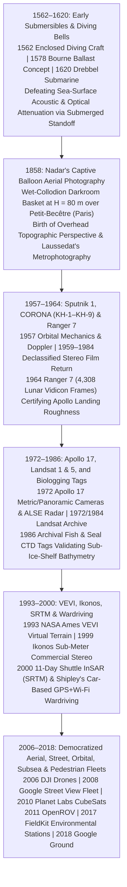

## 7.7 Historical Evolution (`gis-history` Context)

The history of Digital Elevation Models is inseparable from the history of the **vehicles and carriers** engineered to transport sensors across the Earth's fluid envelopes and into space. Because optical, radar, and acoustic waves obey fundamental physical laws of diffraction, attenuation, and parallax, the choice of platform—its altitude $H$ (or submerged standoff distance $h_{\text{alt}}$ above the seabed), baseline-to-height ratio $B/H$, kinematic stability, and revisit cadence—directly dictates both the **spatial resolution** and the **Total Vertical and Horizontal Uncertainty (TVU/THU)** of the resulting terrain model. Over the past four and a half centuries, platform engineering has evolved through seven transformative epochs: from early enclosed submersibles and tethered darkroom balloons to Cold War spy satellites, lunar impactors, instrumented marine mammals, single-pass interferometric radar shuttles, and ubiquitous consumer drones, CubeSats, and smartphones.



---

### 1562–1620: Early Submersibles, Diving Bells, and the Physics of Submerged Standoff

Long before humans left the ground in aircraft, Renaissance engineers recognized that mapping and salvage on the seabed required descending *into* the water column rather than probing blindly from the sea surface. In **1562**, Italian and Spanish chronicles recorded enclosed diving bell and submersible demonstrations in Venice and Toledo (building on Guglielmo de Lorena's 1535 Lake Nemi diving bell documented by Francesco De Marchi). In **1578**, English mathematician and former Royal Navy gunner **William Bourne** published *Inventions or Devises*, formulating the first rigorous physical design for a completely enclosed navigable submarine capable of submerging and surfacing by contracting and expanding internal leather ballast chambers to vary displaced water volume ($\Delta V$) at constant mass ($m$) under Archimedes' principle. Four decades later, in **1620**, Dutch polymath and court inventor **Cornelis Jacobszoon Drebbel** constructed and demonstrated the first working steerable submarine for King James I in the River Thames—a greased-leather-clad wooden hull propelled by twelve oarsmen sitting sealed beneath the waterline, submerging to depths of $3.5\text{–}4.5\text{ m}$ between Westminster and Greenwich with chemical oxygen regeneration.

From Drebbel's 1620 Thames submarine through Auguste Piccard's bathyscaphe *Trieste* (reaching the Challenger Deep at $10{,}916\text{ m}$ in 1960), Woods Hole Oceanographic Institution's human-occupied vehicle ***Alvin*** (commissioned **1964**) and autonomous underwater vehicle ***ABE* (*Autonomous Benthic Explorer*, 1995)**, to modern $6000\text{-m}$ Kongsberg *HUGIN* AUVs and **2011 OpenROV** micro-vehicles, the geodetic imperative for submerged platforms has remained unchanged. Because seawater absorbs electromagnetic radiation within meters and spreads acoustic beams with range $R$, a surface ship at ocean depth $d$ with multibeam beamwidth $\theta_{\text{beam}}$ and roll angle error $\sigma_\phi$ (in radians) suffers a nadir seafloor footprint diameter $\Delta x_{\text{nadir}}$ (and off-nadir cross-track footprint $\Delta x_{\text{cross}}(\beta) \approx h_{\text{alt}}\theta_{\text{beam}}/\cos^2\beta$) as well as a cross-track vertical lever-arm error $\sigma_{z,\text{roll}}$ proportional to full water depth $d$. Descending inside a submersible, ROV, or AUV to a terrain-following altitude $h_{\text{alt}} = d - d_{\text{sub}} \ll d$ shrinks both the acoustic footprint and the angular lever-arm uncertainty by the ratio $h_{\text{alt}} / d$:

$$\Delta x_{\text{nadir}} = 2\,h_{\text{alt}} \tan\!\left(\frac{\theta_{\text{beam}}}{2}\right), \qquad \sigma_{z,\text{roll}}(\beta) = h_{\text{alt}} \tan|\beta|\,\sigma_\phi$$

where $\beta$ is the swath look angle from nadir. At abyssal depth $d = 4000\text{ m}$, flying an AUV at $h_{\text{alt}} = 25\text{ m}$ compresses the nadir footprint and roll-induced vertical error by a factor of **$160\times$**, transforming $70\text{-m}$ shipboard blurs into $0.4\text{-m}$ decimeter bathymetric DEMs and enabling direct optical photogrammetry within the last $2\text{–}5\text{ m}$ above the seafloor.

---

### 1858: Gaspard-Félix Tournachon (Nadar) and Captive Balloon Aerial Photography

On land, the transition from terrestrial plane-table surveying (where hills, forests, and buildings occlude horizontal lines of sight) to overhead topographic mapping began in **October 1858** south of Paris. French caricaturist, journalist, and aeronaut **Gaspard-Félix Tournachon**—known universally by his pseudonym **Nadar**—had filed a visionary French patent in **October 1855** (*"Un nouveau système de photographie aérostatique"*) proposing to compile cadastral and topographic maps from overlapping vertical photographs captured from a tethered hot-air or hydrogen balloon. For three years, however, every attempt failed: the **wet-collodion glass-plate process** (invented by Frederick Scott Archer in 1851) required coating a glass plate with iodized collodion, sensitizing it in silver nitrate, exposing it in the camera, and developing it in pyrogallic acid *before the emulsion dried*, while hydrogen sulfide ($\text{H}_2\text{S}$) gas escaping from the balloon's neck valve chemically fogged the wet silver halide plates in mid-air.

In late **1858**, ascending to an altitude of **$H = 80\text{ m}$** in a tethered balloon over the village of **Petit-Becêtre** (modern Petit-Clamart) with a light-tight orange-canvas darkroom tent built directly into the wicker basket and the gas valve sealed, Nadar successfully exposed and developed the **world's first aerial photograph**, capturing three farmhouse rooftops, a roadside poplar tree, and a passing farm cart (Tournachon, 1900; Newhall, 1969). Two years later, on **October 13, 1860**, **James Wallace Black** and navigator Samuel Archer King photographed Boston from $365\text{ m}$ in the balloon *Queen of the Air* (yielding the earliest surviving aerial image, *"Boston, as the Eagle and the Wild Goose See It"*). Simultaneously, French Army Corps of Engineers officer **Colonel Aimé Laussedat** (working from 1849 to 1861 with terrestrial photo-theodolites, balloons, and kites) formulated the mathematical laws of **metrophotography** (*métrophotographie*—later renamed **photogrammetry** by Albrecht Meydenbauer in 1867), proving that 3D terrain coordinates $(X, Y, Z)$ could be reconstructed by intersecting conjugate optical rays from two perspective photographs separated by a known baseline $B$.

Nadar and Laussedat established the fundamental platform-to-sensor scaling equations that still govern every kite, balloon, drone, aircraft, and optical satellite survey. For a camera of focal length $f$ and detector pixel pitch $p_{\text{pitch}}$ (or film resolving power) flying at altitude $H$ above ground with stereo baseline $B$ and image matching parallax precision $\sigma_{p_x}$, the horizontal **Ground Sample Distance (GSD)** and vertical elevation precision $\sigma_z$ scale directly with platform altitude and base-to-height ratio $B/H$:

$$\text{GSD} = \frac{H \cdot p_{\text{pitch}}}{f}, \qquad \sigma_z = \left(\frac{H}{B}\right) \left(\frac{H}{f}\right) \sigma_{p_x} = \left(\frac{H}{B}\right) \text{GSD} \cdot \sigma_{p,\text{px}}$$

where $\sigma_{p,\text{px}} = \sigma_{p_x} / p_{\text{pitch}}$ is the stereo disparity matching uncertainty in pixels (typically $0.1\text{–}0.5\text{ px}$).

---

### 1957–1964: *Sputnik 1*, Declassified *CORONA* (`KH-1` to `KH-9`) Satellites, and *Ranger 7* Lunar Imaging

A century after Nadar's $80\text{-m}$ balloon ascent, Cold War rocketry vaulted remote sensing platforms outside the atmosphere:

1. **October 4, 1957 — *Sputnik 1* and the Birth of Orbital Geodesy:** When the Soviet Union placed the $83.6\text{-kg}$ sphere ***Sputnik 1*** into an elliptical low Earth orbit ($215 \times 939\text{ km}$, inclination $65.1^\circ$), it established the physical reality of artificial Earth satellites. Within days, physicists **William H. Guier** and **George C. Weiffenbach** at the Johns Hopkins Applied Physics Laboratory (APL) demonstrated that *Sputnik 1*'s complete 6-parameter Keplerian orbit could be determined from a single ground station by measuring the **Doppler frequency shift** $\Delta f(t) = -\frac{f_0}{c}\dot{\rho}(t)$ of its $20.005\text{ MHz}$ and $40.002\text{ MHz}$ CW radio transmissions—prompting APL's Frank McClure to invert the problem in March 1958 and invent the **Navy Transit (NNSS) satellite positioning system** (Section 5.3) as well as satellite gravity-field geodesy.
2. **1959–1984 — Project *CORONA* and the *Keyhole* (`KH-1` to `KH-9`) Film-Return Satellites:** Before radiation-hardened charge-coupled devices (CCDs) and high-bandwidth digital telemetry existed, acquiring high-resolution stereo imagery from orbit required physically returning exposed photographic film through Earth's atmosphere. Initiated under President Dwight D. Eisenhower in 1958 and managed jointly by the CIA and US Air Force, the covert **CORONA** program launched its first test spacecraft (*Discoverer 1*) from Vandenberg Air Force Base on **February 28, 1959**, and achieved the first mid-air parachute capture of a re-entry film bucket (*Discoverer 14*, `KH-1`) by a C-119 recovery aircraft over the Pacific Ocean on **August 19, 1960**.
   - Beginning with **`KH-4` (*Mural*, 1962)**, **`KH-4A` (1963–1969)**, and **`KH-4B` (1967–1972)**, CORONA introduced **dual counter-rotating panoramic cameras** (Itek $f = 609.6\text{ mm}$, $f/3.5$ Petzval lenses scanning a $70^\circ$ cross-track arc onto $70\text{-mm}$-wide Eastman Kodak polyester film). By tilting the forward-looking camera $+15^\circ$ ahead of nadir and the aft-looking camera $-15^\circ$ behind nadir, `KH-4A/B` created a **$30^\circ$ convergent along-track stereo geometry ($B/H \approx 2\tan 15^\circ = 0.536$)** from a $165\text{–}185\text{ km}$ orbital altitude, achieving **$1.8\text{ m}$ ($6\text{ ft}$) ground resolution**.
   - Between **1971 and 1984**, the massive **`KH-9` (*Hexagon* / "Big Bird")** satellites supplemented sub-meter twin panoramic cameras with a dedicated **$12\text{-inch}$ ($f = 304.8\text{ mm}$) frame Mapping Camera** equipped with a 1,081-cross internal **reseau grid** and stellar attitude camera across $29{,}000$ frames.
   - Declassified by President Bill Clinton under **Executive Order 12951 on February 22, 1995** (with `KH-7` and `KH-9` Mapping Camera archives declassified in 2002 and 2011 and digitized at $7\text{ }\mu\text{m}$ by the USGS EROS Center), the $>860{,}000$ CORONA/Hexagon stereo frames now serve as a priceless **historical time machine for DEMs**. Using modern open-source panoramic camera models in the **NASA Ames Stereo Pipeline (`ASP` `cam_gen` / `stereo`, OpticalBar model)** or `MicMac`, geoscientists routinely extract $2\text{–}5\text{ m}$ 1960s–1970s DEMs to quantify half-century Himalayan and Andean glacier mass loss ($\Delta h / \Delta t$), pre-dam river canyon topography, and historical earthquake fault scarps.
3. **July 31, 1964 — NASA/JPL *Ranger 7* Lunar Impact Mission:** To design the *Apollo* Lunar Module landing gear, NASA engineers urgently needed to know whether the Moon's maria were smooth enough to land on or buried under deep electrostatic dust and meter-scale boulder fields—features invisible to Earth-based telescopes (limited by atmospheric seeing to $\sim 0.5\text{–}1\text{ km}$ resolution). After six heartbreaking launch and spacecraft failures (Rangers 1–6), JPL's ***Ranger 7*** executed a direct lunar impact trajectory into ***Mare Cognitum*** on **July 31, 1964**. During the final **17 minutes and 13 seconds** of free-fall descent from $2110\text{ km}$ altitude down to impact at $2.62\text{ km s}^{-1}$, *Ranger 7*'s six **RCA Vidicon television cameras** (two full-scan F-cameras and four high-frame-rate partial-scan P-cameras) transmitted **4,308 pristine close-up images** over analog FM video telemetry. The final P-3 camera frame—captured at an altitude of just **$480\text{ m}$ ($1600\text{ ft}$)** milliseconds before the spacecraft shattered on impact—achieved a Ground Sample Distance of **$0.4\text{–}0.5\text{ m}$**, improving humanity's resolution of the lunar surface by **three orders of magnitude ($1000\times$)** in a single afternoon. By applying **photoclinometry (shape-from-shading)** (developed by Eugene Shoemaker, Alden Loomis, and Robert Nathan at USGS/JPL) to *Ranger 7*'s solar-illuminated frames, planetary cartographers derived the first sub-meter lunar micro-relief DEMs and slope histograms, proving that *Mare Cognitum*'s RMS surface slope at the $1\text{–}5\text{ m}$ Lunar Module footpad scale was a gentle $2^\circ\text{–}5^\circ$ and clearing the path for *Surveyor* and *Apollo*.

---

### 1972–1986: *Apollo 17* Orbital Geodesy, *Landsat 1 & 5*, and Archival Biologging Platforms

The 1970s and 1980s transformed both planetary and terrestrial observation from episodic reconnaissance into calibrated, physics-based global monitoring—even extending platform sensing to living marine animals:

* **December 7–19, 1972 — *Apollo 17* and the Scientific Instrument Module (SIM) Bay:** On the final crewed lunar mission (*Apollo 17* to the Taurus–Littrow valley, crewed by Eugene Cernan, Harrison "Jack" Schmitt, and Command Module Pilot Ronald Evans), the Service Module of CSM *America* carried the most sophisticated orbital photogrammetric and radar sounding suite yet flown in space:
  1. **Fairchild $3\text{-inch}$ ($f = 76\text{ mm}$) Metric Mapping Camera:** A calibrated frame camera with an internal $10\text{-mm}$ reseau glass platen, paired with a boresighted **$3\text{-inch}$ stellar camera** (photographing the star field simultaneously with every lunar frame to determine absolute spacecraft roll, pitch, and yaw to $<15\text{ arcsec}$) and a **$694.3\text{ nm}$ ruby Laser Altimeter** ($1\text{–}2\text{ m}$ range precision) that fixed the exact scale factor $H/f$ of every stereo model.
  2. **Itek $24\text{-inch}$ ($f = 610\text{ mm}$) Optical-Bar Panoramic Camera:** Derived directly from CORONA/Hexagon reconnaissance technology, capturing $1\text{–}2\text{ m}$ stereo imagery across $330\text{-km}$-wide swaths at $25^\circ$ convergence.
  3. **Apollo Lunar Sounder Experiment (ALSE):** A three-frequency coherent Synthetic Aperture / HF-VHF radar sounder ($5\text{ MHz}$, $15\text{ MHz}$, and $150\text{ MHz}$, corresponding to free-space wavelengths of $60\text{ m}$, $20\text{ m}$, and $2\text{ m}$) deployed with a $24\text{-m}$ dipole antenna and an optical CRT film recorder. ALSE generated continuous topographic elevation profiles and **subsurface radar echograms** down to $1.3\text{ km}$ beneath Mare Serenitatis and Mare Crisium—serving as the direct heritage architecture for modern planetary subsurface sounders (*MARSIS*, *SHARAD*, *REASON*) and airborne ice-penetrating radar over Greenland and Antarctica.
* **July 23, 1972 (*Landsat 1*) & March 1, 1984 (*Landsat 5*):** Just five months before *Apollo 17*, NASA and the US Department of the Interior / USGS launched the **Earth Resources Technology Satellite (*ERTS-1*, renamed *Landsat 1*)** into a sun-synchronous polar orbit ($917\text{ km}$ altitude, 18-day repeat). While *Landsat 1* carried three Return Beam Vidicon (RBV) television cameras, its triumph was the experimental **4-band Multispectral Scanner (MSS, $\sim 79\text{ m}$ pixel size)** championed and designed by Hughes engineer **Virginia T. Norwood** ("The Mother of Landsat"), which scanned across-track with an oscillating mirror and digitized radiometrically calibrated green, red, and near-infrared reflectance. Twelve years later, on **March 1, 1984**, NASA launched ***Landsat 5*** into a $705\text{ km}$ orbit (16-day repeat, Worldwide Reference System-2) carrying both the 4-band MSS and the 7-band **$30\text{-m}$ Thematic Mapper (TM)**. Designed for a 3-year mission, *Landsat 5* operated continuously for **28 years and 10 months** (decommissioned June 5, 2013; Guinness World Record for longest-operating Earth observation satellite), acquiring over **2.5 million scenes**. In DEM science, the 50+ year *Landsat 1–9* record provides the universal planimetric and spectral foundation for water-masking global DEMs (e.g., SRTM Water Body Data), mapping intertidal flat topography via waterline-tide stacking, and deriving **Satellite-Derived Bathymetry (SDB)** down to $20\text{–}30\text{ m}$ in clear coastal waters using the Stumpf (2003) blue-to-green log-ratio transform $\hat{d} = m_1 \frac{\ln(n R_w(\lambda_{\text{blue}}))}{\ln(n R_w(\lambda_{\text{green}}))} - m_0$.
* **1986 — Archival Fish Tags, Marine Mammal CTD-SRDLs, and Biological Bathymetry:** Even in the satellite era, vast regions of the Southern Ocean and Arctic continental shelves remain hidden year-round beneath pack ice and floating glacial ice shelves where neither research vessels nor optical/radar satellites can measure water depth or sound speed. Beginning in **1986** (following prototype microprocessor time-depth-temperature **archival fish tags** developed by pelagic fisheries scientists at Lowestoft, CSIRO, and Scripps—see Hunter et al., 1986; Gunn et al., 1994; Block et al., 1998—and later **Conductivity-Temperature-Depth Satellite Relay Data Loggers, CTD-SRDLs**, developed by the Sea Mammal Research Unit at the University of St Andrews; Boehme et al., 2009), marine biologists and physical oceanographers transformed living marine predators into **autonomous biological survey platforms**.
  - When benthic-foraging **southern elephant seals (*Mirounga leonina*)**, Weddell seals, or Greenland sharks dive repeatedly to the seafloor across the continental shelf to feed, their head-mounted archival or Argos/Iridium-linked CTD tags record hydrostatic pressure $p_{\max}$ (precision $\sim 0.5\text{–}2\text{ dbar}$), *in situ* temperature $T(z)$, and salinity $S(z)$ throughout every dive.
  - Because benthic foraging dives exhibit a characteristic flat-bottomed pressure plateau at the seabed, extracting the maximum dive pressure $p_{\max}$ and converting it to geometric depth $d_{\text{seal}}$ (via the UNESCO 1983 / TEOS-10 hydrostatic integral) yields direct **ground-truth seafloor depth soundings** beneath perennial sea ice. Over 500,000 seal dives archived in the **MEOP (*Marine Mammals Exploring the Oceans Pole to Pole*)** consortium (Treasure et al., 2017) have revealed deep, warm Circumpolar Deep Water (CDW) glacial troughs ($>800\text{–}1200\text{ m}$ deep) cutting across the Antarctic continental shelf—exposing errors of **$100\text{ to }>400\text{ m}$** in legacy interpolated bathymetry grids (`GEBCO`, `IBCSO`, `BedMachine Antarctica`; Padman et al., 2010; McMahon et al., 2023) while simultaneously supplying essential polar sound-speed profiles $c(z)$ for multibeam acoustic ray-tracing.

---

### 1993–2000: NASA Ames *VEVI*, *IKONOS*, *SRTM*, and *Wardriving*

As the twentieth century closed, four milestones within seven years unified virtual 3D terrain teleoperation, commercial sub-meter satellite stereo, single-pass global radar interferometry, and opportunistic vehicular mapping:

1. **1993 — NASA Ames *VEVI* (*Virtual Environment Vehicle Interface*):** Created by **Butler Hine**, **Terrence Fong**, and colleagues in the Intelligent Mechanisms Group at NASA Ames Research Center (Hine et al., 1994), **VEVI** pioneered the paradigm of operating remote air, land, and undersea robots *inside a real-time 3D Digital Elevation Model* rather than through laggy 2D video feeds. Deployed in **October 1993** to pilot the *TROV* underwater vehicle beneath the sea ice of McMurdo Sound, Antarctica, and in **July 1994** to guide CMU's eight-legged rappelling robot ***Dante II*** down the active crater of Mount Spurr Volcano, Alaska (Section 6.3), VEVI fused live 3D scanning laser rangefinder and stereo-camera sweeps into an interactive virtual terrain mesh, proving that a platform's onboard perception could construct its own operational DEM on the fly.
2. **September 24, 1999 — *IKONOS* (Space Imaging) and Commercial Sub-Meter Stereo:** Launched aboard an Athena II rocket from Vandenberg AFB, Space Imaging's ***IKONOS*** (built by Lockheed Martin with an Eastman Kodak $0.7\text{-m}$ aperture, $f = 10\text{ m}$ folded three-mirror anastigmat telescope) became the **world's first commercial sub-meter Earth observation satellite** ($0.82\text{ m}$ nadir panchromatic GSD, $3.2\text{ m}$ 4-band multispectral). Beyond breaking the military-intelligence monopoly on $<1\text{ m}$ orbital imagery, *IKONOS* revolutionized satellite photogrammetry in two ways:
   - **Agile Single-Pass Along-Track Stereo:** Using high-torque reaction wheels, *IKONOS* could pitch its entire spacecraft bus forward ($+26^\circ$) and backward ($-26^\circ$) during a single orbital pass, capturing near-simultaneous stereo pairs ($B/H \approx 0.54\text{–}0.83$) under identical solar illumination, cloud cover, and seasonal snow/vegetation state.
   - **Rational Polynomial Coefficients (RPCs):** To allow civilian photogrammetrists to triangulate 3D terrain points without disclosing proprietary spacecraft ephemeris, star-tracker attitude filters, or interior camera geometry, Space Imaging distributed each scene with **80 third-order Rational Polynomial Coefficients** (`RPC00B` standard; Dial et al., 2003; Fraser et al., 2002) mapping normalized geodetic coordinates $(\phi, \lambda, h)$ to image line/sample coordinates $(r, c)$—now the universal mathematical interface for commercial satellite stereo (`WorldView`, `Pleiades`, `SkySat`, `PlanetScope`) in `GDAL`, `ASP`, and `OTB` (*Orfeo ToolBox*).
3. **February 11–22, 2000 — *Shuttle Radar Topography Mission (SRTM)* (`STS-99`):** Optical stereo satellites like *IKONOS* and *SPOT* were still blinded by persistent tropical cloud cover over Amazonia, Congo, and Indonesia. On **February 11, 2000**, Space Shuttle ***Endeavour* (`STS-99`)** launched into a $233\text{ km}$, $57^\circ$-inclination orbit for a joint NASA/JPL, NIMA (now NGA), DLR, and ASI mission. Once in orbit, *Endeavour* deployed a **$60\text{-m}$-long rigid deployable carbon-fiber truss mast** (`ADAM`) out of its payload bay. With primary C-band ($\lambda = 5.6\text{ cm}$, $5.3\text{ GHz}$) and X-band ($\lambda = 3.1\text{ cm}$, $9.6\text{ GHz}$) transmit/receive radar antennas in the payload bay and secondary receive-only antennas mounted at the tip of the $60\text{-m}$ outboard mast (monitored to sub-millimeter precision by an Attitude and Orbit Determination Avionics system, AODA, using optical LED targets and star trackers), *Endeavour* formed a **single-pass spaceborne Interferometric Synthetic Aperture Radar (InSAR)** (Farr et al., 2007).
   - Because both interferometric phase channels $\phi_1, \phi_2$ were acquired simultaneously (with the inboard antenna transmitting and receiving path $2R_1$ and the outboard antenna receiving path $R_1 + R_2$, yielding a one-way path difference $\Delta r = R_2 - R_1$ and a phase factor of $2\pi/\lambda$ rather than the $4\pi/\lambda$ of repeat-pass InSAR), atmospheric water-vapor delay and temporal surface decorrelation cancelled out completely:
     $$\Delta\phi = \phi_1 - \phi_2 \approx -\frac{2\pi B_{\text{mast}} \sin(\theta_{\text{look}} - \alpha_{\text{mast}})}{\lambda}, \qquad \sigma_z^{\text{InSAR}} = \frac{\lambda\, R \sin\theta_{\text{look}}}{2\pi B_{\text{mast}} \cos(\theta_{\text{look}} - \alpha_{\text{mast}})}\,\sigma_{\Delta\phi}$$
   - In just **11 days ($222.4\text{ hours}$)** of radar operation, SRTM mapped **$119\text{ million km}^2$ ($80\%$ of Earth's landmass between $60^\circ\text{N}$ and $56^\circ\text{S}$)**, producing the first homogeneous near-global $1\text{ arc-second}$ ($\sim 30\text{ m}$) Digital Surface Model with an absolute 90% linear vertical error (LE90) of $<6\text{–}9\text{ m}$ (well inside its $16\text{ m}$ specification).
4. **October 2000 — Pete Shipley's *Wardriving* (Opportunistic Mobile Vehicular Sensing):** In **October 2000**, Berkeley computer security researcher **Pete Shipley** wired a Garmin GPS receiver and a Lucent Orinoco 802.11b wireless PCMCIA card with an external roof antenna to a laptop inside his car and systematically drove the street grid of San Francisco and Silicon Valley, automatically logging the geographic coordinates, signal strength (RSSI), and encryption status of thousands of newly deployed Wi-Fi access points (Shipley, 2001). Coining the term **"wardriving"** (by analogy to 1983 *WarGames* modem wardialing), Shipley's experiment catalyzed a global paradigm shift in geospatial data collection: **opportunistic mobile mapping from passenger vehicles**. Within five years, commercial and open-source fleets (`WiGLE` founded 2001, Skyhook Wireless, Google Location Services, Apple, Mozilla Location Service) deployed wardriving architectures across millions of vehicles and smartphones, creating the global Wi-Fi/cellular BSSID trilateration maps that today initialize Assisted-GNSS (A-GNSS) and indoor/urban-canyon positioning for mobile elevation scanners worldwide.

---

### 2006–2018: Democratized Drones, Street Fleets, CubeSats, Micro-ROVs, and Citizen Field Tools

Between 2006 and 2018, the miniaturization of MEMS inertial sensors, lithium-polymer batteries, CMOS global-shutter cameras, and smartphones triggered a democratization of platform engineering across air, road, orbit, ocean, and footpath:

* **2006 — DJI Founded by Frank Wang (*SZ DJI Technology Co.*):** In **2006**, starting from his dormitory room at the Hong Kong University of Science and Technology (HKUST) before moving across the border to Shenzhen, aeronautical engineering student **Frank Wang (Wang Tao)** founded **DJI (*Dà-Jiāng Innovations*)** to build reliable autonomous helicopter and multi-rotor flight controllers (`XP3.1`, `WooKong`, `Naza`). With the release of the ready-to-fly **Phantom 1 (2013)**, **Phantom 4 RTK (2018)**, and enterprise **Matrice 300/350 RTK** paired with **Zenmuse L1/L2** Livox LiDAR payloads, DJI transformed uncrewed aerial systems (UAS) from fragile hobbyist radio-control airframes into the dominant platform for site-scale ($0.01\text{–}10\text{ km}^2$) topographic surveying. Flying at $H = 50\text{–}120\text{ m}$ AGL with dual-frequency RTK/PPK GNSS, consumer and enterprise drones routinely deliver $1\text{–}3\text{ cm}$ GSD orthomosaics and $\sigma_z \approx 2\text{–}5\text{ cm}$ Structure-from-Motion (SfM) and LiDAR DEMs at a tiny fraction of crewed aircraft mobilization cost.
* **2007–2008 — Google Street View Fleet Launch and Expansion:** Following Stanford/Google prototypes (*CityBlock*) and an initial 5-city US launch in May 2007, **Google Street View** launched its custom-engineered global mobile mapping fleet in **2008** (Anguelov et al., 2010), equipping hundreds of vehicles—and subsequently pedestrian **Trekker** backpacks, tricycles, snowmobiles, and river boats—with roof-mounted $360^\circ$ multi-camera rosettes (`R5`/`R7`), dual-antenna GNSS, tactical IMU, wheel rotary encoders (DMI), and three SICK (later Velodyne) laser rangefinders scanning roadbed and building façades. Beyond street-level imagery over $>16\text{ million km}$ of roads in $>100$ countries, the Street View fleet demonstrated industrial-scale **Mobile Mapping System (MMS)** trajectory optimization (Section 7.2), extracting global curb/gutter drainage gradients, road crown cross-slopes, bridge clearances, and 3D building façade meshes.
* **2010 — Planet Labs Founded (*Cosmogia*) and the Daily CubeSat Constellation:** In **December 2010**, former NASA Ames physicists **Will Marshall**, **Robbie Schingler**, and **Chris Boshuizen** founded *Cosmogia* (renamed **Planet Labs** in 2013) in a Cupertino garage after pioneering the smartphone-powered *PhoneSat* nanosatellite project at NASA Ames. By applying agile aerospace iteration to $10 \times 10 \times 30\text{ cm}$ **3U CubeSats (*Dove* / *SuperDove*)** alongside high-resolution **SkySat** ($0.5\text{ m}$ tri-stereo/video) and **Pelican** spacecraft, Planet replaced the traditional "one exquisite billion-dollar school-bus satellite every decade" model with a continuous constellation of $150\text{–}200+$ spacecraft imaging Earth's entire landmass **every single day** at $3\text{ m}$ resolution. For DEM practitioners, high-cadence CubeSat constellations unlocked **multi-date / multi-view satellite stereo** (e.g., Shean et al., 2016; Bhushan et al., 2021) and rapid topographic disaster response—measuring co-seismic fault displacement, volcanic dome extrusion, and catastrophic glacier/landslide mass wasting within hours of the event.
* **2011 — OpenROV Founded (Eric Stackpole & David Lang):** Inspired by a legend of sunken gold inside the flooded limestone labyrinth of Hall City Cave in Northern California, NASA Ames engineer **Eric Stackpole** and citizen-science writer **David Lang** launched **OpenROV** in **2011** as an open-source, community-built micro-ROV ($<\$1{,}000$, depth-rated to $100\text{ m}$, communicating over a thin two-wire neutrally buoyant tether). Evolving into the *OpenROV Trident* and later merging with Spoondrift in 2019 to form **Sofar Ocean** (deploying thousands of solar-powered *Spotter* wave/bathymetry buoys globally), OpenROV sparked an explosion of low-cost subsea robotics (including *BlueRobotics BlueROV2*), empowering marine ecologists and coastal engineers to capture centimeter-resolution **underwater Structure-from-Motion (UwSfM)** 3D reef and structure DEMs without chartering a work-class ROV support vessel.
* **2017 *FieldKit* (Conservify) & 2018 *Google Ground* (Pedestrian & Environmental Democratization):** At the finest spatial scale—the human on foot and the stationary environmental gauge—two open-source platforms closed the "last-mile" validation gap:
  - In **2017**, National Geographic Explorer and aerospace engineer **Shah Selbe** (through **Conservify**) launched **FieldKit**, an open-source, modular environmental sensing hardware, firmware, and cloud platform first deployed across the Amazon Basin (`Wildlife Conservation Society`) and Congo tributaries. By pairing low-cost ultrasonic/pressure river-stage water-level sensors, weather stations, and GNSS/LoRa/iridium telemetry, FieldKit enabled local communities and hydrologists to establish dense *in situ* stage-discharge and flood-elevation networks where national gauge infrastructure had collapsed.
  - In **2018**, Google introduced **Ground** (built alongside the open-source **Open Data Kit / ODK** ecosystem initiated in 2008 by Carl Hartung, Yaw Anokwa, and Gaetano Borriello at the University of Washington), an offline-first, map-centric mobile data collection platform designed with Indigenous land stewards (such as the Borneo *Save Our Borneo* and Amazonian conservation teams) and FAO forestry surveyors. Together with modern dual-frequency GNSS and Apple `ARKit` / Android `ARCore` consumer LiDAR phones (Section 7.1), tools like FieldKit, ODK, and Ground enable field scientists to collect verifiable ground control points (GCPs), flood high-water marks, and vegetation canopy heights that anchor and validate satellite and airborne DEMs.

| Year | `gis-history` Milestone | Platform Domain | Primary Physical / Geometric Innovation | Enduring Impact on Terrestrial & Bathymetric DEMs |
| :--- | :--- | :--- | :--- | :--- |
| **1562–1620** | **Early Submersibles & Diving Bells** (1562 Venice/Toledo; Bourne, 1578; Drebbel, 1620) | Subsea (HOV / ROV / AUV heritage) | Variable-ballast submerged buoyancy ($\Delta V$) and deep standoff ($h_{\text{alt}} \ll d$) | Compresses multibeam footprint $\Delta x = 2h_{\text{alt}}\tan(\theta/2)$ and roll lever-arm TVU by $100\times$ at abyssal depths. |
| **1858** | **Nadar's Captive Balloon Photography** (G.-F. Tournachon; A. Laussedat) | Airborne (Tethered Aerostat / Kite) | Wet-collodion darkroom basket at $H=80\text{ m}$; perspective intersection (*métrophotographie*) | Establishes overhead $\text{GSD} = Hp/f$ and stereo parallax scaling $\sigma_z = (H/B)\text{GSD}\,\sigma_{p,\text{px}}$. |
| **1957–1959** | ***Sputnik 1* (1957) & *CORONA* (`KH-1`–`KH-9`, 1959–1984)** | Spaceborne (Low Earth Orbit) | Orbital Doppler tracking; $30^\circ$ convergent panoramic film-return stereo ($B/H \approx 0.54$) | Unlocks global satellite geodesy and $>860{,}000$ declassified 1960s–1970s stereo frames for multi-decadal DEM differencing. |
| **1964** | **NASA/JPL *Ranger 7* Lunar Impactor** | Planetary Descent Trajectory | 6 RCA Vidicon TV cameras (4,308 frames down to $0.5\text{ m}$ GSD); shape-from-shading | Certifies sub-meter lunar mare crater/slope roughness ($2^\circ\text{–}5^\circ$) for *Apollo* Lunar Module landing gear. |
| **1972 & 1984** | ***Apollo 17* SIM Bay & *Landsat 1* (1972) / *Landsat 5* (1984)** | Lunar & Earth Sun-Synchronous Orbit | Metric/stellar/laser-altimeter camera triad + ALSE radar; Virginia Norwood's MSS & 29-yr TM archive | Defines planetary photogrammetric control, radar sounding, water masks, and 50-year Satellite-Derived Bathymetry (SDB). |
| **1986** | **Archival Fish Tags & Marine Mammal CTD-SRDLs** | Biological Ocean Platforms | Benthic foraging dive pressure $p_{\max} \to d_{\text{seal}}$ and under-ice $T/S/c(z)$ profiles | Exposes $100\text{–}400\text{ m}$ trough errors in interpolated Antarctic sub-ice-shelf bathymetry (`MEOP` / `IBCSO`). |
| **1993–2000** | **VEVI (1993), *IKONOS* (1999), *SRTM* (2000) & *Wardriving* (2000)** | Virtual, Orbital Stereo/InSAR & Car MMS | Live 3D DEM teleoperation; $0.82\text{ m}$ agile RPC stereo; $60\text{-m}$ mast single-pass InSAR; GPS+Wi-Fi car logging | Delivers commercial $<1\text{ m}$ stereo DEMs, the $30\text{-m}$ global SRTM elevation baseline in 11 days, and vehicular RF/MMS mapping. |
| **2006–2018** | **DJI (2006), Street View (2008), Planet (2010), OpenROV (2011), FieldKit (2017) & Ground (2018)** | UAS, Car Fleet, CubeSat, Micro-ROV & Pedestrian | RTK multi-rotor drones; global LiDAR/camera car fleets; daily 3U CubeSats; open subsea/field hardware | Democratizes centimeter-scale drone, street, reef, and community-validated DEMs across every environment on Earth. |

---

### Worked Numerical Example: Platform Altitude, Standoff, and Biological Depth Validation

To appreciate quantitatively how platform physics governs spatial resolution and vertical accuracy across the historical milestones above, consider four concrete platform calculations:

1. **Airborne & Orbital Optical Stereo Scaling (1858 Nadar vs. 1967 CORONA `KH-4B` vs. 1999 *IKONOS* vs. 2018 DJI Phantom 4 RTK):**
   Using $\text{GSD} = \frac{H \cdot p_{\text{pitch}}}{f}$ and $\sigma_z = \left(\frac{H}{B}\right) \text{GSD} \cdot \sigma_{p,\text{px}}$ with a stereo matching disparity uncertainty of $\sigma_{p,\text{px}} = 0.35\text{ pixels}$ (or film scan equivalent):
   - **1858 Nadar Balloon ($H = 80\text{ m}$, $f = 0.25\text{ m}$, effective wet-plate resolution $p_{\text{eff}} = 25\text{ }\mu\text{m}$, $B/H = 0.30$):**
     $$\text{GSD} = \frac{80 \times 25\times 10^{-6}}{0.25} = \mathbf{0.0080\text{ m}\;(8.0\text{ mm})}, \qquad \sigma_z = \frac{1}{0.30}\times 0.0080 \times 0.35 = \mathbf{0.0093\text{ m}\;(0.93\text{ cm})}$$
     (achieved over a single $40\text{ m} \times 40\text{ m}$ village courtyard, assuming calibrated basket orientation).
   - **1967 CORONA `KH-4B` ($H = 165{,}000\text{ m}$, $f = 0.6096\text{ m}$, USGS digitized scan $p_{\text{eff}} = 7.0\text{ }\mu\text{m}$, $30^\circ$ stereo $B/H = 2\tan 15^\circ = 0.5359$):**
     $$\text{GSD} = \frac{165{,}000 \times 7.0\times 10^{-6}}{0.6096} = \mathbf{1.895\text{ m}}, \qquad \sigma_z = \frac{1}{0.5359}\times 1.895 \times 0.50\text{ px (film grain)} = \mathbf{1.768\text{ m}}$$
   - **1999 *IKONOS* ($H = 681{,}000\text{ m}$, $f = 10.0\text{ m}$, $p_{\text{pitch}} = 12.0\text{ }\mu\text{m}$, agile along-track stereo $B/H = 0.60$, $\sigma_{p,\text{px}} = 0.35\text{ px}$):**
     $$\text{GSD} = \frac{681{,}000 \times 12.0\times 10^{-6}}{10.0} = \mathbf{0.817\text{ m}}, \qquad \sigma_z = \frac{1}{0.60}\times 0.817 \times 0.35 = \mathbf{0.477\text{ m}}$$
   - **2018 DJI Phantom 4 RTK ($H = 100\text{ m}$, $f = 0.0088\text{ m}$, $p_{\text{pitch}} = 2.41\text{ }\mu\text{m}$, $B/H = 0.40$, $\sigma_{p,\text{px}} = 0.30\text{ px}$):**
     $$\text{GSD} = \frac{100 \times 2.41\times 10^{-6}}{0.0088} = \mathbf{0.0274\text{ m}\;(2.74\text{ cm})}, \qquad \sigma_z = \frac{1}{0.40}\times 0.0274 \times 0.30 = \mathbf{0.0205\text{ m}\;(2.05\text{ cm})}$$
     (comfortably satisfying the **ASPRS $2.5\text{ cm}$ $\text{RMSE}_z$ Vertical Accuracy Class** and **USGS 3DEP Quality Level 0** $\le 5.0\text{ cm}$ $\text{RMSE}_z$ specification).

2. **Submerged Standoff vs. Surface Ship Acoustic Footprint and Roll Lever-Arm TVU (1562–2011 Subsea Lineage):**
   Consider mapping an abyssal hydrothermal vent field at ocean depth $d = 4000.0\text{ m}$ using a $1.0^\circ \times 1.0^\circ$ multibeam echosounder ($\theta_{\text{beam}} = 1.0^\circ$) at outer-swath look angle $\beta = 60^\circ$ with inertial roll uncertainty $\sigma_\phi = 0.020^\circ$ ($0.349\text{ mrad}$):
   - **Surface Research Vessel ($h_{\text{alt}} = d = 4000.0\text{ m}$):**
     $$\Delta x_{\text{nadir}} = 2(4000)\tan(0.5^\circ) = \mathbf{69.81\text{ m}}, \qquad \sigma_{z,\text{roll}}(60^\circ) = 4000\tan(60^\circ)(3.491\times 10^{-4}) = \mathbf{2.418\text{ m}}$$
   - **Deep-Sea AUV / ROV at Submerged Standoff ($h_{\text{alt}} = d - d_{\text{sub}} = 25.0\text{ m}$ above seabed):**
     $$\Delta x_{\text{nadir}} = 2(25.0)\tan(0.5^\circ) = \mathbf{0.436\text{ m}}, \qquad \sigma_{z,\text{roll}}(60^\circ) = 25.0\tan(60^\circ)(3.491\times 10^{-4}) = \mathbf{0.0151\text{ m}\;(1.51\text{ cm})}$$
   Descending within $25\text{ m}$ of the bottom shrinks the horizontal acoustic blur from nearly $70\text{ m}$ to $44\text{ cm}$ and reduces outer-beam roll vertical error from $2.42\text{ m}$ to $1.5\text{ cm}$—allowing an abyssal survey at $4000\text{ m}$ depth to achieve **IHO S-44 Special Order / Exclusive Order** feature resolution relative to the vehicle frame.

3. **2000 *SRTM* (`STS-99`) Single-Pass C-Band InSAR Height of Ambiguity and Phase Precision:**
   For Space Shuttle *Endeavour* orbiting at altitude $H = 233\text{ km}$ with C-band wavelength $\lambda = 0.0566\text{ m}$, look angle $\theta_{\text{look}} = 45^\circ$ (slant range $R \approx H / \cos 45^\circ = 329{,}512\text{ m}$), mast length $B_{\text{mast}} = 60.0\text{ m}$, and mast tilt angle $\alpha_{\text{mast}} = 45^\circ$ (so perpendicular baseline $B_\perp = B_{\text{mast}}\cos(\theta_{\text{look}} - \alpha_{\text{mast}}) = 60.0\text{ m}$), a $2\pi$ interferometric phase cycle corresponds to a **height of ambiguity** $h_a$:
   $$h_a = \frac{\lambda\, R \sin\theta_{\text{look}}}{B_\perp} = \frac{0.0566 \times 329{,}512 \times \sin 45^\circ}{60.0} = \mathbf{219.8\text{ m per }2\pi\text{ cycle}}$$
   With an interferometric phase noise of $\sigma_{\Delta\phi} = 8.0^\circ$ ($0.1396\text{ rad}$), the relative vertical radar precision is $\sigma_z^{\text{InSAR}} = \frac{h_a}{2\pi}\sigma_{\Delta\phi} = 34.98 \times 0.1396 = \mathbf{4.88\text{ m}}$.

4. **Biologging Seal Dive Pressure to Sub-Ice-Shelf Bathymetric Depth (1986–Present MEOP CTD-SRDL):**
   A southern elephant seal foraging beneath the Amery Ice Shelf buffer zone at latitude $\phi = 67.5^\circ\text{S}$ reaches the seafloor on a flat-bottomed benthic dive and records a maximum hydrostatic sea pressure of **$p_{\max} = 950.0\text{ dbar}$**. Using the standard **Saunders & Fofonoff (1976) / UNESCO (1983)** ocean pressure-to-depth equation (where normal gravity at sea level is $g(\phi) = 9.780318\,(1 + 5.2788\times 10^{-3}\sin^2\phi + 2.36\times 10^{-5}\sin^4\phi) = 9.82455\text{ m s}^{-2}$ at $\phi = 67.5^\circ\text{S}$):
   $$d(p, \phi) = \frac{9.72659\,p - 2.512\times 10^{-5}\,p^2 + 2.279\times 10^{-10}\,p^3 - 1.82\times 10^{-15}\,p^4}{g(\phi) + 1.092\times 10^{-6}\,p} = \frac{9240.26 - 22.67 + 0.195 - 0.001}{9.82455 + 0.00104} = \mathbf{938.1\text{ m}}$$
   When compared against a legacy pre-biologging interpolated grid (`GEBCO_08`) that predicted a shallow $520\text{ m}$ continental bank at that coordinate, the seal's benthic dive exposes a **$-418.1\text{ m}$ unmapped glacial trough** capable of funneling warm Circumpolar Deep Water directly to the ice-shelf grounding line.

> [!WARNING]
> **Common Pitfalls When Processing Historical & Legacy Platform Datasets:**
> * **Treating CORONA (`KH-4A/B`) Panoramic Strips as Standard Pinhole Frame Images:** Because CORONA's optical bar rotated across a $70^\circ$ arc while the spacecraft translated forward at $7.8\text{ km s}^{-1}$, raw scans exhibit severe **panoramic S-curve distortion**, scan-velocity variations, and off-nadir scale compression. Fitting a standard frame pinhole model produces $30\text{–}100\text{ m}$ systematic vertical bowing; practitioners must use a dynamic optical-bar camera model (e.g., `ASP` `OpticalBar` with motion compensation $v/H$).
> * **Differencing Historical Optical DEMs Against 2000 SRTM C-Band Without Accounting for Canopy & Ice Penetration Bias:** SRTM's C-band radar ($\lambda = 5.6\text{ cm}$) scatters from within the upper forest canopy (biasing elevations $+5\text{ to }+15\text{ m}$ above bare ground) but penetrates $1\text{–}4\text{ m}$ into dry cold firn/snow on glaciers, creating systematic vertical biases when differenced against optical stereo DEMs (`CORONA`, `IKONOS`, `Planet`).
> * **Ingesting Biologging Seal Depths Without Filtering Argos Doppler Location Classes:** While a seal's CTD pressure sensor measures depth $d_{\text{seal}}$ to $\pm 1\text{ m}$, surface Argos Doppler fixes taken before or after an under-ice foraging transit can have horizontal uncertainties of $0.5\text{–}5\text{ km}$ (Argos classes A, B, 0–3). Always apply state-space Kalman/particle trajectory smoothing constrained by maximum swim speed ($v_{\max} \approx 2\text{ m s}^{-1}$) and stipulate that $d_{\text{true}}(x,y) \ge d_{\text{seal}}$ along the dive segment (Padman et al., 2010).

```python
import numpy as np

# 1. Optical Platform GSD and Stereo Vertical Precision Scaling (1858 - 2018)
platforms = [
    ("1858 Nadar Balloon",   80.0,     0.2500, 25.0e-6, 0.3000, 0.35),
    ("1967 CORONA KH-4B",    165000.0, 0.6096, 7.0e-6,  0.5359, 0.50),
    ("1999 IKONOS Stereo",   681000.0, 10.000, 12.0e-6, 0.6000, 0.35),
    ("2018 DJI P4 RTK",      100.0,    0.0088, 2.41e-6, 0.4000, 0.30),
]
for name, H, f, pitch, bh, sig_px in platforms:
    gsd = (H * pitch) / f
    sig_z = (1.0 / bh) * gsd * sig_px
    print(f"{name:20s}: GSD = {gsd:7.4f} m | sigma_z = {sig_z:7.4f} m")

# 2. Subsea Standoff: Surface Vessel (4000 m) vs Deep AUV (25 m altitude)
for mode, h_alt in [("Surface Ship (4000m)", 4000.0), ("Deep-Sea AUV (25m)", 25.0)]:
    fp = 2.0 * h_alt * np.tan(np.deg2rad(0.5))
    tvu_roll = h_alt * np.tan(np.deg2rad(60.0)) * np.deg2rad(0.020)
    print(f"{mode:20s}: Footprint = {fp:6.2f} m | Roll TVU(60deg) = {tvu_roll:6.3f} m")

# 3. 2000 SRTM Single-Pass C-Band InSAR Height of Ambiguity
lam, R_slant, theta_look, B_perp = 0.0566, 233000.0 / np.cos(np.deg2rad(45.0)), np.deg2rad(45.0), 60.0
h_ambig = (lam * R_slant * np.sin(theta_look)) / B_perp
sig_z_srtm = (h_ambig / (2.0 * np.pi)) * np.deg2rad(8.0)
print(f"2000 SRTM C-Band:     h_a = {h_ambig:.1f} m/cycle | sigma_z(8deg phase) = {sig_z_srtm:.2f} m")

# 4. 1986-Heritage Biologging Seal Dive Pressure to True Seafloor Depth (UNESCO 1983)
def unesco_depth_from_pressure(p_dbar: float, lat_deg: float) -> float:
    x = np.sin(np.deg2rad(lat_deg)) ** 2
    g = 9.780318 * (1.0 + (5.2788e-3 + 2.36e-5 * x) * x)
    num = (( (-1.82e-15 * p_dbar + 2.279e-10) * p_dbar - 2.512e-5 ) * p_dbar + 9.72659) * p_dbar
    return float(num / (g + 1.092e-6 * p_dbar))

d_seal = unesco_depth_from_pressure(p_dbar=950.0, lat_deg=-67.5)
print(f"Elephant Seal Benthic Dive (950 dbar @ 67.5S): d_true = {d_seal:.1f} m (vs 520 m interpolated grid)")
```

> [!IMPORTANT]
> **Historical Synthesis for DEM Practitioners:** Over 450 years of `gis-history`, every major leap in DEM fidelity has come from either **moving the platform closer to the surface** (1562–1620 submersibles, 1964 *Ranger 7*, 2006 DJI drones, 2008 Street View, 2011 OpenROV), **widening or stabilizing the viewing baseline** (1858 Nadar/Laussedat stereo, 1959 CORONA `KH-4B`, 1972 *Apollo 17* Metric Camera, 1999 *IKONOS*, 2000 *SRTM* $60\text{-m}$ mast), or **multiplying platform numbers through opportunistic and autonomous fleets** (1986 biologging seals/fish, 2000 Wardriving, 2010 Planet CubeSats, 2017 FieldKit, and 2018 Google Ground).

### Key Historical References
* Bourne, W. (1578). *Inventions or Devises: Very Necessary for All Generalles and Captaines, or Leaders of Men, as Wel Be Sea as By Land*. London: Thomas Woodcock.
* Tournachon, G.-F. [Nadar] (1900). *Quand j'étais photographe*. Paris: Ernest Flammarion.
* Guier, W. H., & Weiffenbach, G. C. (1960). A satellite Doppler navigation system. *Proceedings of the IRE*, 48(4), 507–516. https://doi.org/10.1109/JRPROC.1960.287400
* Day, D. A., Logsdon, J. M., & Latell, B. (Eds.). (1998). *Eye in the Sky: The Story of the Corona Spy Satellites*. Smithsonian Institution Press.
* Hine, B., Stoker, C., Sims, M., Rasmussen, D., Hontalas, P., Fong, T., et al. (1994). The application of telepresence and virtual reality to subsea exploration (*VEVI*). *Proc. ROV '94 / Intervention '94*, Marine Technology Society.
* Dial, G., Bowen, H., Gerlach, F., Grodecki, J., & Oleszczuk, R. (2003). IKONOS satellite, imagery, and products. *Remote Sensing of Environment*, 88(1–2), 23–36. https://doi.org/10.1016/j.rse.2003.08.014
* Farr, T. G., Rosen, P. A., Caro, E., Crippen, R., Duren, R., Hensley, S., et al. (2007). The Shuttle Radar Topography Mission. *Reviews of Geophysics*, 45(2), RG2004. https://doi.org/10.1029/2005RG000183
* Anguelov, D., Dulong, C., Filip, D., Frueh, C., Lafon, S., Lyon, R., et al. (2010). Google Street View: Capturing the world at street level. *Computer*, 43(6), 32–38. https://doi.org/10.1109/MC.2010.170
* Padman, L., Costa, D. P., Bolmer, S. T., Goebel, M. E., Huckstadt, L. A., Jenkins, A., et al. (2010). Seals map bathymetry of the Antarctic continental shelf. *Geophysical Research Letters*, 37(21), L21601. https://doi.org/10.1029/2010GL044921
* Treasure, A. M., Roquet, F., Ansorge, I. J., Bester, M. N., Boehme, L., Bornemann, H., et al. (2017). Marine Mammals Exploring the Oceans Pole to Pole: A review of the MEOP consortium. *Oceanography*, 30(2), 132–138. https://doi.org/10.5670/oceanog.2017.234
