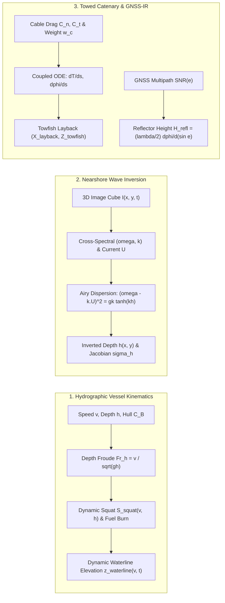

## 7.8 Mathematical Foundations

Platform kinematics and viewing geometry govern how raw range, phase, and optical observations map into geodetic coordinates. Unlike static terrestrial tripods, mobile hydrographic vessels experience hydrodynamic pressure fields that alter their vertical reference frame as a function of speed and water depth, towed abyssal sensors trail behind their surface vessels along nonlinear catenary curves, and opportunistic fixed coastal sensors infer submerged topography indirectly through surface wave kinematics or multipath interferometry. This section derives the governing physical equations and error-propagation Jacobians for these platform-dependent transformations.



---

### 7.8.1 Hydrographic Vessel Dynamic Squat, Settlement, and Static Draft Reduction

When a hydrographic survey vessel references its multibeam echosounder (MBES) or single-beam transducer to the local water surface (conventional water-level or tidal zoning reduction), any unmodeled vertical motion of the hull relative to the undisturbed ambient water level maps 1:1 as a systematic vertical bias into the seafloor Digital Elevation Model (DEM). Two quasi-static and hydrodynamic mechanisms govern the instantaneous effective draft of the vessel: **consumable mass depletion** (fuel and water burn) and **hydrodynamic squat**.

#### 1. Static Draft Reduction from Fuel and Ballast Changes
Let $z_{\text{static draft}}(t_0) > 0$ denote the initial vertical distance (measured positive downward from the calm-water surface to the acoustic reference point) determined by direct tape, sight-glass, or optical leveling prior to departure at epoch $t_0$. As the vessel consumes fuel, lubricants, and potable water of cumulative mass $\Delta m_{\text{consumed}}(t)$ and takes on or discharges ballast water $\Delta m_{\text{ballast}}(t)$, Archimedes' principle dictates that the hull rises out of the water by an amount inversely proportional to the waterplane area $A_{\text{WP}}(z) = C_{\text{WP}} L_{\text{PP}} B$:

$$\Delta z_{\text{fuel/ballast}}(t) = \frac{\Delta m_{\text{consumed}}(t) - \Delta m_{\text{ballast}}(t)}{\rho_w \, A_{\text{WP}}(z)} = \frac{\Delta m_{\text{consumed}}(t) - \Delta m_{\text{ballast}}(t)}{100\,\text{000} \cdot \text{TPC}} \tag{7.1}$$

where:
* $\rho_w$ is the ambient in-situ water density ($\text{kg}\cdot\text{m}^{-3}$, typically $1025\text{ kg}\cdot\text{m}^{-3}$ in coastal seawater and $1000\text{ kg}\cdot\text{m}^{-3}$ in freshwater),
* $L_{\text{PP}}$ is the hull length between perpendiculars ($\text{m}$), $B$ is the moulded beam at the waterline ($\text{m}$), and $C_{\text{WP}} \in [0.65, 0.85]$ is the waterplane area coefficient,
* $\text{TPC} = \frac{\rho_w A_{\text{WP}}}{100\,\text{000}}$ is the hydrostatic *Tonnes Per Centimeter* immersion index ($\text{t}\cdot\text{cm}^{-1}$, with $\rho_w$ in $\text{kg}\cdot\text{m}^{-3}$ and $\Delta m$ in $\text{kg}$ in Eq. 7.1, or equivalently $\Delta z\text{ [cm]} = \Delta m\text{ [t]} / \text{TPC}$).

#### 2. Bernoulli Streamline Hydrodynamics and Slender-Body Squat
When the vessel advances at speed through water $v$ ($\text{m}\cdot\text{s}^{-1}$) in water of finite depth $h$ ($\text{m}$), the water displaced by the bow must accelerate aftward around the hull and through the restricted cross-section between the keel and the seabed. Applying Bernoulli's equation along a streamline from the undisturbed far-field flow (speed $v$, free-surface elevation $\eta_0 = 0$, pressure $p_0$) to the accelerated return flow beneath the hull (speed $v + \Delta v$, elevation $\eta$, pressure $p$):

$$p_0 + \frac{1}{2}\rho_w v^2 = p + \frac{1}{2}\rho_w (v + \Delta v)^2 + \rho_w g \eta \implies \frac{p - p_0}{\rho_w g} + \eta = -\frac{v\,\Delta v}{g}\left(1 + \frac{\Delta v}{2v}\right) < 0 \tag{7.2}$$

where $g \approx 9.80665\text{ m}\cdot\text{s}^{-2}$ is gravitational acceleration. Because continuity requires $\Delta v > 0$, the local dynamic pressure beneath the hull drops, inducing both a mean vertical bodily sinkage (**settlement**, $\bar{s}$) and a longitudinal hydrodynamic pitching moment (**dynamic trim**, $\Delta\theta$). The combined downward vertical displacement at the transducer or bow/stern is the **dynamic squat** $S_{\text{squat}}(v, h)$.

The dimensionless governing parameters of shallow-water ship hydrodynamics are the **depth Froude number** $\text{Fr}_h$, the **hull block coefficient** $C_B$, and the **channel blockage factor** $K_{\text{blockage}}$ (also denoted $S_b$):

$$\text{Fr}_h = \frac{v}{\sqrt{gh}}, \qquad C_B = \frac{\nabla_{\text{disp}}}{L_{\text{PP}} B T}, \qquad K_{\text{blockage}} = \frac{A_{\text{mid}}}{A_{\text{channel}}} = \frac{C_M B T}{W_{\text{eff}} h} \tag{7.3}$$

where $\nabla_{\text{disp}}$ is the displaced underwater volume ($\text{m}^3$), $T$ is the mean static draft ($\text{m}$), $A_{\text{mid}} = C_M B T$ is the submerged midship cross-sectional area (with midship coefficient $C_M \approx 0.85\text{–}0.98$), and $W_{\text{eff}}$ is the physical channel width (or in laterally unrestricted open water, Barrass's effective width of hydrodynamic influence $W_{\text{eff}} \approx \left[7.04 / C_B^{0.85}\right] B$). Note that $\text{Fr}_h$ represents the ratio of vessel speed $v$ to the linear shallow-water wave celerity $c_0 = \sqrt{gh}$. Combining static draft, fuel/ballast reduction, and dynamic squat yields the **dynamic waterline elevation equation** (expressed as effective downward draft relative to the undisturbed ambient water surface):

$$z_{\text{waterline}}(v, t) = z_{\text{static draft}}(t_0) - \Delta z_{\text{fuel/ballast}}(t) + S_{\text{squat}}(v, h), \qquad S_{\text{squat}}(v, h) = C_B \frac{v^2}{g} f\left(\text{Fr}_h, K_{\text{blockage}}\right) \tag{7.4}$$

In conventional water-level (tidal) reduction, the total water depth below the undisturbed surface is $D_{\text{total}} = d_{\text{sonar}} + z_{\text{waterline}}(v, t)$, and the dynamic draft uncertainty $\sigma_{z_{\text{waterline}}}^2 = \sigma_{\text{static}}^2 + \sigma_{\text{fuel}}^2 + \sigma_{\text{squat}}^2$ propagates directly into the IHO S-44 and NOAA HSSD Total Vertical Uncertainty ($\text{TVU}$) budget. Crucially, the two unmodeled terms produce opposite systematic biases: as fuel burns off ($\Delta z_{\text{fuel}} > 0$), the hull rises out of the water and moves the transducer *farther* from the seabed, so neglecting $\Delta z_{\text{fuel}}$ produces a hydrographically dangerous **deep bias** (overestimating navigable depth); conversely, as the hull squats downward ($S_{\text{squat}} > 0$), the transducer moves *closer* to the seabed, so neglecting or underestimating $S_{\text{squat}}$ produces a **shoal bias** ($D_{\text{reduced}} < D_{\text{true}}$).

#### 3. Classical Squat Formulations vs. Modern GNSS ERS Calibration
Three theoretical and empirical representations of $S_{\text{squat}}(v, h)$ are widely used across maritime engineering and hydrography:

1. **Tuck (1966) Slender-Body Theory and ICORELS (1980) / PIANC Formula:**
   Using matched asymptotic expansions of a slender hull in shallow water of uniform depth $h$, Tuck (1966) proved that hydrodynamic sinkage scales with the Prandtl–Glauert-like compressibility factor $\text{Fr}_h^2 / \sqrt{1 - \text{Fr}_h^2}$ as $\text{Fr}_h \to 1$:

   $$S_{\text{Tuck/ICORELS}}(v, h) = C_S \frac{\nabla_{\text{disp}}}{L_{\text{PP}}^2} \frac{\text{Fr}_h^2}{\sqrt{1 - \text{Fr}_h^2}} = C_B \frac{v^2}{g} \underbrace{\left[ C_S \left(\frac{B T}{h L_{\text{PP}}}\right) \frac{1}{\sqrt{1 - \text{Fr}_h^2}} \right]}_{f(\text{Fr}_h, K_{\text{blockage}})} \tag{7.5}$$

   where $C_S$ is the empirical squat constant ($C_S = 2.4$ in the ICORELS 1980 standard for bow squat of full-form vessels in open shallow water; Huuska 1976 and PIANC multiply Eq. 7.5 by a blockage correction factor $K_s(K_{\text{blockage}})$ for restricted canals).

2. **Barrass (1979, 2004) Empirical Formula:**
   Regressing over $600$ full-scale and model-basin measurements, Barrass expressed maximum squat in terms of the velocity-return blockage ratio $S_2 = \frac{K_{\text{blockage}}}{1 - K_{\text{blockage}}}$ and speed in knots $V_k = 1.94384\,v$:

   $$S_{\text{Barrass}}(v, h) = \frac{C_B \, S_2^{2/3} \, V_k^{2.08}}{30} \approx \begin{cases} \dfrac{C_B V_k^2}{100} & \text{(laterally unrestricted shallow water, } h/T \in [1.1, 1.4]\text{)} \\[6pt] \dfrac{C_B V_k^2}{50} & \text{(confined channels, } K_{\text{blockage}} \in [0.10, 0.265]\text{)} \end{cases} \tag{7.6}$$

3. **Modern GNSS Ellipsoidally Referenced Surveying (ERS) & Dynamic Draft Curves:**
   While Eqs. (7.5)–(7.6) accurately model displacement merchant ships ($C_B \in [0.65, 0.85]$, $\text{Fr}_h < 0.35$), hydrographic survey launches ($L_{\text{PP}} = 8\text{–}15\text{ m}$, $C_B \approx 0.40\text{–}0.55$) routinely operate at $\text{Fr}_h \in [0.4, 0.8]$. These semi-displacement hulls settle by $10\text{–}25\text{ cm}$ at moderate survey speeds ($5\text{–}9\text{ kn}$) before hydrodynamic lift raises the bow toward planing above the hump speed. In modern IHO S-44 Exclusive/Special Order and NOAA HSSD surveys, **Ellipsoidally Referenced Surveying (ERS)** bypasses Eq. (7.4) entirely by referencing the acoustic transducer directly to the geodetic ellipsoid via RTK/PPK GNSS and an Inertial Navigation System (INS), absorbing static draft, fuel burn, dynamic squat, and wave heave into the 3D antenna trajectory. Where tidal reduction is still used, dynamic draft is calibrated empirically by running stepped-speed reciprocal lines under PPK GNSS to fit a vessel-specific polynomial $S_{\text{squat}}(v) = a_1 v + a_2 v^2 + a_3 v^3$.

| Formulation | Governing Equation | Target Hull Regime | Primary Limitations in Hydrography |
| :--- | :--- | :--- | :--- |
| **Tuck (1966) / ICORELS (1980)** | $S = C_S \frac{\nabla_{\text{disp}}}{L_{\text{PP}}^2} \frac{\text{Fr}_h^2}{\sqrt{1 - \text{Fr}_h^2}}$ | Slender displacement hulls, subcritical ($\text{Fr}_h < 0.7$) | Singular as $\text{Fr}_h \to 1$; neglects planing lift on small launches |
| **Barrass (1979, 2004)** | $S = \frac{1}{30} C_B S_2^{2/3} V_k^{2.08}$ | Merchant ships ($C_B \in [0.5, 0.9]$, $h/T \in [1.1, 1.5]$) | Overpredicts squat in deeper water ($h/T > 3$); ignores hull trim sign |
| **Empirical GNSS Speed-Step Curve** | $S(v) = \sum_{j=1}^3 a_j v^j$ | Specific survey vessel at calibration depth $h_{\text{cal}}$ | Calibrated in deep water; underpredicts squat when entering shoals ($h/T < 2$) |
| **Direct GNSS/INS ERS Reduction** | $z_{\text{chart}} = h_{\text{GNSS}} - \Delta z_{\text{lever}} - d_{\text{sonar}} - \text{SEP}$ | All vessels equipped with RTK/PPK + IMU | Requires continuous carrier-phase GNSS lock and accurate VDatum $\text{SEP}$ ($h_{\text{ellip}} - z_{\text{chart}}$, positive-up) model |

---

### 7.8.2 Nearshore Bathymetry Inversion from Linear Wave Dispersion

Fixed coastal video stations (e.g., Argus cameras; Holman et al., 2013), satellite optical/SAR time-series, and marine X-band radars image the space-time evolution of surface gravity wave crests $I(x, y, t)$ across the nearshore zone. Because shoaling surface waves feel the seabed when the water depth $h$ is less than half the wavelength $L_w$, water depth can be inverted from the observed wave phase speed.

#### 1. Derivation from Airy Linear Potential Wave Theory
Consider an incompressible ($\nabla \cdot \mathbf{u} = 0$), inviscid, irrotational fluid ($\nabla \times \mathbf{u} = \mathbf{0}$) over a locally horizontal or mildly sloping seabed ($\lvert\nabla_h h\rvert \ll kh$, the WKBJ approximation). In right-handed Cartesian coordinates where $z$ is positive upward from the undisturbed mean water level ($z = 0$) and the impermeable seabed lies at $z = -h(x,y)$, the total velocity field in the presence of a depth-uniform ambient horizontal current $\mathbf{U} = (U_x, U_y, 0)^\top$ is $\mathbf{u} = \mathbf{U} + \nabla\phi(x, y, z, t)$. Mass continuity yields **Laplace's equation** throughout the fluid column ($-h \le z \le \eta$):

$$\nabla^2 \phi = \frac{\partial^2 \phi}{\partial x^2} + \frac{\partial^2 \phi}{\partial y^2} + \frac{\partial^2 \phi}{\partial z^2} = 0 \tag{7.7}$$

subject to three boundary conditions linearized for small wave steepness $\epsilon = k a \ll 1$ (where $a = H_w / 2$ is wave amplitude and $\nabla_h = (\partial_x, \partial_y)^\top$):
1. **Impermeable bottom boundary condition** at $z = -h$:
   $$\left.\frac{\partial \phi}{\partial z}\right|_{z=-h} = 0 \tag{7.8a}$$
2. **Linearized kinematic free-surface condition** at $z = 0$:
   $$\frac{\partial \eta}{\partial t} + \mathbf{U}\cdot\nabla_h \eta = \left.\frac{\partial \phi}{\partial z}\right|_{z=0} \tag{7.8b}$$
3. **Linearized dynamic free-surface (Bernoulli) condition** at $z = 0$:
   $$\left.\frac{\partial \phi}{\partial t}\right|_{z=0} + \mathbf{U}\cdot\left.\nabla_h \phi\right|_{z=0} + g\eta = 0 \tag{7.8c}$$

Applying the advective derivative $\left(\frac{\partial}{\partial t} + \mathbf{U}\cdot\nabla_h\right)$ to Eq. (7.8c) and substituting Eq. (7.8b) eliminates the free-surface elevation $\eta(x, y, t)$:

$$\left(\frac{\partial}{\partial t} + \mathbf{U}\cdot\nabla_h\right)^2 \left.\phi\right|_{z=0} + g\left.\frac{\partial \phi}{\partial z}\right|_{z=0} = 0 \tag{7.9}$$

Seeking a monochromatic plane-wave solution $\phi(\mathbf{x}_h, z, t) = Z(z)\exp[i(\mathbf{k}\cdot\mathbf{x}_h - \omega t)]$ with horizontal wavevector $\mathbf{k} = (k_x, k_y)^\top$, wavenumber magnitude $k = \lVert\mathbf{k}\rVert = \frac{2\pi}{L_w}$ ($\text{rad}\cdot\text{m}^{-1}$), and Eulerian absolute angular frequency $\omega = \frac{2\pi}{T_w}$ ($\text{rad}\cdot\text{s}^{-1}$), Laplace's equation (7.7) reduces to $Z''(z) - k^2 Z(z) = 0$. Enforcing the bottom boundary condition $Z'(-h) = 0$ selects the hyperbolic cosine vertical profile $Z(z) = C \cosh(k(z + h))$, where surface orbital motions decay with depth as $\frac{\cosh(k(z+h))}{\cosh(kh)}$. Substituting this profile into Eq. (7.9) at $z = 0$ and defining the intrinsic (Lagrangian) frequency $\sigma = \omega - \mathbf{k}\cdot\mathbf{U}$ yields:

$$-\sigma^2 \cosh(kh) + g k \sinh(kh) = 0 \implies \sigma^2 = (\omega - \mathbf{k}\cdot\mathbf{U})^2 = g k \tanh(kh) \tag{7.10}$$

Taking the positive root for forward-propagating waves gives the **Doppler-shifted linear wave dispersion relation**:

$$\omega(\mathbf{k}) = \sqrt{g k \tanh(kh)} + \mathbf{k}\cdot\mathbf{U} \tag{7.11}$$

#### 2. Exact Analytical Inversion and Jacobian Uncertainty Propagation
Dividing Eq. (7.10) by $gk$ defines the dimensionless dispersion ratio $\gamma = \frac{(\omega - \mathbf{k}\cdot\mathbf{U})^2}{gk} = \tanh(kh) \in (0, 1)$. Applying the inverse hyperbolic tangent identity $\tanh^{-1}(\gamma) = \frac{1}{2}\ln\left(\frac{1+\gamma}{1-\gamma}\right)$ yields the exact analytical inversion for water depth $h$:

$$h = \frac{1}{k}\tanh^{-1}\left(\frac{(\omega - \mathbf{k}\cdot\mathbf{U})^2}{gk}\right) = \frac{1}{2k}\ln\left(\frac{gk + (\omega - \mathbf{k}\cdot\mathbf{U})^2}{gk - (\omega - \mathbf{k}\cdot\mathbf{U})^2}\right) \tag{7.12}$$

To propagate spectral estimation uncertainties $(\sigma_k, \sigma_\omega)$ from cross-spectral video or radar algorithms (such as `cBathy`) into bathymetric Total Vertical Uncertainty (TVU), we differentiate Eq. (7.12) with respect to $\omega$ and $k$ using $\frac{d}{d\gamma}\tanh^{-1}(\gamma) = \frac{1}{1-\gamma^2} = \cosh^2(kh)$ (shown here at fixed intrinsic frequency or $\mathbf{U} = \mathbf{0}$; if a non-zero current component $U_k = \hat{\mathbf{k}}\cdot\mathbf{U}$ is present, $\frac{\partial h}{\partial k}$ includes the additional Doppler-advection term $-U_k \frac{\partial h}{\partial \omega}$):

$$\frac{\partial h}{\partial \omega} = \frac{2(\omega - \mathbf{k}\cdot\mathbf{U})}{g k^2 (1 - \gamma^2)} = \frac{\sinh(2kh)}{k(\omega - \mathbf{k}\cdot\mathbf{U})}, \qquad \frac{\partial h}{\partial k} = -\frac{h}{k} - \frac{\gamma}{k^2(1 - \gamma^2)} = -\frac{h}{k} - \frac{\sinh(2kh)}{2k^2} \tag{7.13}$$

For uncorrelated frequency and wavenumber errors, the first-order depth error variance is $\sigma_h^2 = \left(\frac{\partial h}{\partial k}\right)^2 \sigma_k^2 + \left(\frac{\partial h}{\partial \omega}\right)^2 \sigma_\omega^2$. Equation (7.13) exposes two fundamental physical limits of wave-based bathymetry inversion:

1. **Deep-Water Singularity ($kh \gtrsim \pi$):** In deep water ($h / L_w \ge 0.5$, or $kh \ge \pi$), wave orbitals no longer interact with the seabed: $\gamma = \tanh(kh) \to 1$ ($\tanh(\pi) = 0.99627$) and $1 - \gamma^2 = \text{sech}^2(kh) \approx 4e^{-2kh} \to 0$. Consequently, the forward sensitivity $\frac{\partial \omega}{\partial h} = \frac{gk^2}{2\sigma}\text{sech}^2(kh)$ vanishes, while the inverse Jacobians $\left\lvert\frac{\partial h}{\partial k}\right\rvert$ and $\left\lvert\frac{\partial h}{\partial \omega}\right\rvert$ grow exponentially as $e^{2kh}$. Furthermore, any positive noise in $k$ or $\omega$ that pushes $\gamma \ge 1$ makes $gk - (\omega - \mathbf{k}\cdot\mathbf{U})^2 \le 0$, rendering Eq. (7.12) undefined.
2. **Finite-Amplitude Dispersion Bias in the Breaking Surf Zone:** As waves shoal into very shallow water ($kh \ll 1$, Ursell number $\text{Ur} = \frac{H_w L_w^2}{h^3} \gtrsim 1$), the small-amplitude assumption $ka \ll 1$ fails. Under the composite weakly nonlinear dispersion theory of **Kirby and Dalrymple (1986)** and the **Booij (1981)** / solitary-wave limit, wave phase speed increases with wave height $H_w$:

   $$\omega^2 = g k \tanh\Big(k\big(h + f(H_w / h)\,h\big)\Big) \approx g k \tanh\big(k(h + \alpha_{\text{NL}} H_w)\big) \tag{7.14}$$

   where $\alpha_{\text{NL}} \approx 0.42\text{–}0.50$ in the inner surf zone. Because nonlinear waves travel faster than Airy waves at the same depth ($c_{\text{NL}} \approx \sqrt{g(h + \alpha_{\text{NL}} H_w)}$), plugging observed nonlinear wave celerities into the linear inversion formula (Eq. 7.12) **overestimates water depth** by $\Delta h_{\text{bias}} \approx +\alpha_{\text{NL}} H_w$ ($20\text{–}50\%$ too deep over shallow sandbars, shifting depth contours shoalward/landward). Conversely, neglecting an opposing offshore undertow or rip current ($\mathbf{k}\cdot\mathbf{U} < 0$) reduces the apparent Eulerian celerity $\omega/k$, biasing the linear inversion **shoalward (underestimating water depth)**.

---

### 7.8.3 Deep-Tow Cable Catenary Layback Mechanics & GNSS-IR Multipath Interferometry

#### 1. Differential Equilibrium of a Negatively Buoyant Towed Cable
When an abyssal sidescan sonar, sub-bottom profiler, or synthetic aperture sonar towfish is towed behind a ship on an armored coaxial or fiber-optic cable of length $L_c$ without an Ultra-Short Baseline (USBL) acoustic beacon, its horizontal **layback** $X_{\text{layback}}$ and depth $Z_{\text{towfish}}$ must be integrated from cable mechanics (and any unmodeled current shear $\delta U(z)$ along the cable column dominates the towfish Total Horizontal Uncertainty, $\text{THU}$). Let $s \in [0, L_c]$ be the unstretched arclength measured upward along the cable from the towfish ($s = 0$) to the ship's tow block ($s = L_c$), and let $\phi(s)$ be the local cable inclination angle relative to the horizontal. Balancing axial tension $T(s)$, submerged weight per unit length $w_c = (\rho_c - \rho_w)g A_c$ ($\text{N}\cdot\text{m}^{-1}$), normal pressure drag (over projected width $d_c$), and tangential skin friction (over wetted circumference $\pi d_c$) in a steady relative horizontal flow $v_{\text{rel}}(z) = v - U(z)$ yields the coupled 2D catenary ODE system (Pode, 1951; Chapman, 1984):

$$\frac{dT}{ds} = w_c \sin\phi + \frac{1}{2}\rho_w d_c C_t \pi v_{\text{rel}}^2 \cos^2\phi, \qquad T\frac{d\phi}{ds} = w_c \cos\phi - \frac{1}{2}\rho_w d_c C_n v_{\text{rel}}^2 \sin^2\phi \tag{7.15}$$

$$\frac{dx}{ds} = \cos\phi(s), \qquad \frac{dz}{ds} = \sin\phi(s) \tag{7.16}$$

where $d_c$ is the cable diameter ($\text{m}$), $C_n \approx 1.2\text{–}1.8$ is the normal drag coefficient, and $C_t \approx 0.01\text{–}0.03$ is the tangential friction coefficient. Given the towfish submerged weight $W_{\text{fish}}$ and horizontal drag $D_{\text{fish}}$ at $s = 0$, the initial conditions are $T(0) = \sqrt{W_{\text{fish}}^2 + D_{\text{fish}}^2}$ and $\phi(0) = \arctan(W_{\text{fish}} / D_{\text{fish}})$. As $s$ increases upward from a heavy towfish, $\phi(s)$ relaxes asymptotically toward the critical cable angle $\phi_{\text{crit}}$ where $w_c \cos\phi_{\text{crit}} = \frac{1}{2}\rho_w d_c C_n v_{\text{rel}}^2 \sin^2\phi_{\text{crit}}$. Integrating Eq. (7.16) over $s \in [0, L_c]$ gives the horizontal layback and vertical towfish depth below the tow block:

$$X_{\text{layback}} = \int_0^{L_c} \cos\phi(s)\,ds, \qquad Z_{\text{towfish}} = \int_0^{L_c} \sin\phi(s)\,ds \tag{7.17}$$

#### 2. GNSS Interferometric Reflectometry (GNSS-IR) Reflector Height
A stationary coastal or terrestrial geodetic GNSS antenna mounted at vertical reflector height $H_{\text{refl}}$ above a horizontal planar boundary (sea surface, lake, snowpack, or bare soil) simultaneously receives a direct satellite signal at elevation angle $e$ above the horizon and a specularly reflected multipath signal bouncing off the surface at horizontal distance $x_{\text{spec}} = H_{\text{refl}}\cot e$. By the method of images, the excess path length of the reflected ray relative to the direct ray is $\Delta D(e) = 2 H_{\text{refl}} \sin e$, which modulates the composite Signal-to-Noise Ratio ($\text{SNR}$) with interferometric phase $\phi_{\text{SNR}}(e)$ (expressed in cycles of carrier wavelength $\lambda$, e.g., $\lambda_{\text{GPS L1}} = 0.19029\text{ m}$):

$$\phi_{\text{SNR}}(e) = \frac{\Delta D(e)}{\lambda} = \frac{2 H_{\text{refl}}}{\lambda}\sin e \implies H_{\text{refl}} = \frac{\lambda}{2}\frac{d\phi_{\text{SNR}}}{d(\sin e)} \tag{7.18}$$

where $\frac{d\phi_{\text{SNR}}}{d(\sin e)}$ is extracted as the dominant peak frequency of a Lomb–Scargle periodogram of detrended $\delta\text{SNR}$ versus $\sin e$ over low satellite elevations ($e \in [5^\circ, 25^\circ]$). (If $\phi_{\text{SNR}}$ is expressed in radians rather than cycles, the prefactor $\frac{\lambda}{2}$ becomes $\frac{\lambda}{4\pi}$; for rapidly changing tides, a dynamic rate correction $\Delta H_{\text{dyn}} = \frac{\tan e}{\dot{e}}\dot{H}_{\text{refl}}$ is subtracted per Larson et al., 2013.)

---

### 7.8.4 Worked Numerical Examples and Verification Script

1. **Vessel Dynamic Squat & Fuel Burn:** A coastal survey launch ($L_{\text{PP}} = 12.0\text{ m}$, $B = 4.0\text{ m}$, initial static draft $z_{\text{static draft}}(t_0) = 1.200\text{ m}$, $C_B = 0.50$, $C_{\text{WP}} = 0.75 \implies A_{\text{WP}} = 36.0\text{ m}^2$, $\text{TPC} = 0.369\text{ t}\cdot\text{cm}^{-1}$, $\nabla_{\text{disp}} = 28.80\text{ m}^3$) burns $\Delta m_{\text{fuel}} = 1845\text{ kg}$ of diesel in seawater ($\rho_w = 1025\text{ kg}\cdot\text{m}^{-3}$), reducing its static draft by $\Delta z_{\text{fuel}} = \frac{1845}{1025 \times 36.0} = 0.0500\text{ m}$ ($5.00\text{ cm}$). Surveying at $v = 4.00\text{ m}\cdot\text{s}^{-1}$ ($7.775\text{ kn}$) in $h = 5.00\text{ m}$ depth yields $\text{Fr}_h = \frac{4.00}{\sqrt{9.80665 \times 5.00}} = 0.5712$. Under ICORELS ($C_S = 2.4$), $S_{\text{squat}} = 2.4 \times \frac{28.80}{144.0} \times \frac{0.3263}{\sqrt{1 - 0.3263}} = 0.1908\text{ m}$ ($19.08\text{ cm}$), giving a dynamic waterline draft $z_{\text{waterline}} = 1.200 - 0.0500 + 0.1908 = 1.3408\text{ m}$.
2. **Nearshore Wave Dispersion Inversion:** A coastal camera observes waves of period $T_w = 8.00\text{ s}$ ($\omega = 0.7854\text{ rad}\cdot\text{s}^{-1}$) and wavelength $L_w = 45.00\text{ m}$ ($k = 0.13963\text{ rad}\cdot\text{m}^{-1}$) with $\mathbf{U} = \mathbf{0}$. The dispersion ratio is $\gamma = \frac{0.7854^2}{9.80665 \times 0.13963} = 0.4505$, yielding linear depth $h_{\text{lin}} = \frac{1}{2(0.13963)}\ln\left(\frac{1.4505}{0.5495}\right) = 3.4759\text{ m}$, with Jacobians $\frac{\partial h}{\partial \omega} = +10.31\text{ m}\cdot\text{s}\cdot\text{rad}^{-1}$ and $\frac{\partial h}{\partial k} = -24.89 - 28.99 = -53.89\text{ m}^2\cdot\text{rad}^{-1}$ (so uncertainties $\sigma_k = 0.005\text{ rad}\cdot\text{m}^{-1}$ and $\sigma_\omega = 0.01\text{ rad}\cdot\text{s}^{-1}$ propagate to $\sigma_h = 0.2885\text{ m}$). If breaking wave height is $H_w = 1.40\text{ m}$ ($\alpha_{\text{NL}} = 0.42$), true depth is $h_{\text{true}} \approx 3.4759 - 0.42(1.40) = 2.8879\text{ m}$ (a $+0.588\text{ m}$ deep bias).
3. **Deep-Tow Catenary & GNSS-IR:** A $1000\text{ m}$ armored cable ($d_c = 17.3\text{ mm}$, $w_c = 8.50\text{ N}\cdot\text{m}^{-1}$, $C_n = 1.4$, $C_t = 0.02$) towing a heavy sonar fish ($W_{\text{fish}} = 4500\text{ N}$, $D_{\text{fish}} = 900\text{ N}$) at $v_{\text{rel}} = 1.00\text{ m}\cdot\text{s}^{-1}$ yields RK4-integrated horizontal layback $X_{\text{layback}} = 561.5\text{ m}$, vertical depth $Z_{\text{towfish}} = 815.1\text{ m}$, and A-frame top tension $T(L_c) = 11\,710\text{ N}$. Simultaneously, a GPS L1 ($\lambda = 0.19029\text{ m}$) coastal station with $\frac{d\phi_{\text{SNR}}}{d(\sin e)} = 126.1208\text{ cycles}$ measures $H_{\text{refl}} = 12.000\text{ m}$. The script below verifies all three calculations.

```python
import numpy as np

g = 9.80665  # standard gravity (m/s^2)

# 1. Hydrographic Vessel Dynamic Squat & Fuel Burn Reduction
L_pp, B, T0, C_B, C_WP, rho_w = 12.0, 4.0, 1.20, 0.50, 0.75, 1025.0
dm_fuel, v, h_chan, C_S = 1845.0, 4.00, 5.00, 2.4
A_wp = C_WP * L_pp * B
disp_vol = C_B * L_pp * B * T0
dz_fuel = dm_fuel / (rho_w * A_wp)
Fr_h = v / np.sqrt(g * h_chan)
S_icorels = C_S * (disp_vol / L_pp**2) * (Fr_h**2 / np.sqrt(1.0 - Fr_h**2))
S_barrass_open = (C_B * (v * 1.943844)**2) / 100.0
z_waterline = T0 - dz_fuel + S_icorels
print(f"[1] Fr_h = {Fr_h:.4f}, dz_fuel = {dz_fuel:.4f} m, S_ICORELS = {S_icorels:.4f} m, "
      f"S_Barrass = {S_barrass_open:.4f} m, z_waterline = {z_waterline:.4f} m")

# 2. Nearshore Wave Dispersion Inversion & Jacobians
T_w, L_w, U_dot_k = 8.00, 45.00, 0.0
omega = 2.0 * np.pi / T_w
k = 2.0 * np.pi / L_w
sigma = omega - U_dot_k
gamma = (sigma**2) / (g * k)
h_lin = (1.0 / (2.0 * k)) * np.log((g * k + sigma**2) / (g * k - sigma**2))
dh_domega = 2.0 * sigma / (g * (k**2) * (1.0 - gamma**2))
dh_dk = -h_lin / k - gamma / ((k**2) * (1.0 - gamma**2))
sigma_h = np.hypot(dh_dk * 0.005, dh_domega * 0.01)
h_true_nl = h_lin - 0.42 * 1.40
print(f"[2] gamma = {gamma:.4f}, h_lin = {h_lin:.4f} m, dh/domega = {dh_domega:.2f} m*s, "
      f"dh/dk = {dh_dk:.2f} m^2, sigma_h = {sigma_h:.4f} m, h_true_NL = {h_true_nl:.4f} m")

# 3. Deep-Tow Catenary ODE (RK4) & GNSS-IR Reflector Height
L_c, d_c, w_c, C_n, C_t, v_tow = 1000.0, 0.0173, 8.50, 1.4, 0.02, 1.0
W_fish, D_fish = 4500.0, 900.0
y = np.array([np.hypot(W_fish, D_fish), np.arctan2(W_fish, D_fish), 0.0, 0.0])  # [T, phi, x, z]
ds = 1.0
for _ in range(int(L_c / ds)):
    def ode(state):
        T_s, phi_s, _, _ = state
        dT = w_c * np.sin(phi_s) + 0.5 * rho_w * d_c * C_t * np.pi * (v_tow**2) * (np.cos(phi_s)**2)
        dphi = (w_c * np.cos(phi_s) - 0.5 * rho_w * d_c * C_n * (v_tow**2) * (np.sin(phi_s)**2)) / T_s
        return np.array([dT, dphi, np.cos(phi_s), np.sin(phi_s)])
    k1 = ode(y); k2 = ode(y + 0.5*ds*k1); k3 = ode(y + 0.5*ds*k2); k4 = ode(y + ds*k3)
    y += (ds / 6.0) * (k1 + 2*k2 + 2*k3 + k4)
H_refl = 0.5 * 0.19029367 * 126.1208
print(f"[3] Towfish Layback X = {y[2]:.2f} m, Depth Z = {y[3]:.2f} m, Top Tension = {y[0]:.1f} N | "
      f"GNSS-IR H_refl = {H_refl:.3f} m")
```

> [!WARNING]
> **Shallow-Water Squat Amplification, Fuel-Burn Deep Bias, and Surf-Zone Dispersion Bias:** A dynamic draft curve $S_{\text{squat}}(v)$ calibrated via GNSS in $25\text{ m}$ of water ($\text{Fr}_h \approx 0.25$) severely underestimates squat when the same launch surveys a $3\text{ m}$ shoal at $8\text{ kn}$ ($\text{Fr}_h \approx 0.76$), where the $\text{Fr}_h^2/\sqrt{1-\text{Fr}_h^2}$ factor amplifies sinkage by $2\text{–}3\times$ (biasing water-level-reduced soundings shoalward and creating speed-correlated steps between adjacent swath lines), whereas failing to log multi-day fuel burn $\Delta z_{\text{fuel}}(t)$ biases water-level-reduced soundings **deep** (violating IHO S-44 and NOAA HSSD safety-of-navigation limits). Similarly, applying linear Airy wave inversion inside the breaking surf zone without a finite-amplitude correction ($\alpha_{\text{NL}} H_w$) biases inverted depths $20\text{–}50\%$ too deep.

---

### References
* Barrass, C. B. (2004). *Ship Design and Performance for Masters and Mates*. Elsevier Butterworth-Heinemann.
* Booij, N. (1981). Gravity waves on water with non-uniform depth and current. *Communications on Hydraulics*, Report No. 81-1, Delft University of Technology.
* Chapman, D. A. (1984). Towed cable behaviour during ship turns. *Ocean Engineering*, 11(4), 327–361. https://doi.org/10.1016/0029-8018(84)90010-6
* Holman, R., Plant, N., & Holland, T. (2013). cBathy: A robust algorithm for estimating nearshore bathymetry. *Journal of Geophysical Research: Oceans*, 118(5), 2595–2609. https://doi.org/10.1002/jgrc.20199
* Kirby, J. T., & Dalrymple, R. A. (1986). An approximate model for nonlinear dispersion in monochromatic wave propagation models. *Coastal Engineering*, 9(6), 545–561. https://doi.org/10.1016/0378-3839(86)90003-7
* Larson, K. M., Ray, R. D., Nievinski, F. G., & Freymueller, J. T. (2013). The accidental tide gauge: A GPS reflection case study from Kachemak Bay, Alaska. *IEEE Geoscience and Remote Sensing Letters*, 10(5), 1200–1204. https://doi.org/10.1109/LGRS.2012.2236075
* Pode, L. (1951). *Tables for Computing the Equilibrium Configuration of a Flexible Cable in a Uniform Stream*. David Taylor Model Basin Report 687.
* Tuck, E. O. (1966). Shallow-water flows past slender bodies. *Journal of Fluid Mechanics*, 26(1), 81–95. https://doi.org/10.1017/S0022112066001101
