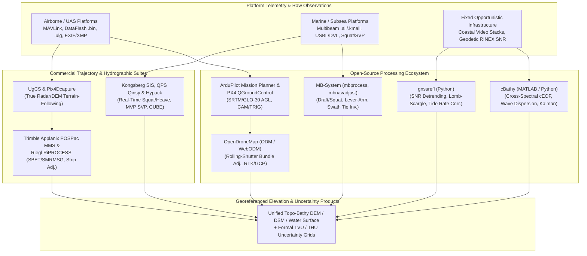

## 7.9 Software Ecosystem

Translating raw sensor observations from moving or opportunistic platforms into a geodetically rigorous Digital Elevation Model requires software that explicitly models the **carrier vehicle's six-degree-of-freedom (6-DoF) kinematics, structural lever arms, hydrodynamic or aerodynamic interactions, and viewing geometry**. Unlike static terrestrial surveying—where sensor position is treated as a fixed boundary condition—platform-centric software must synchronize microsecond-level hardware triggers, compensate for electronic rolling-shutter distortion or vessel dynamic squat, reconcile dead-reckoned subsea trajectories, or invert environmental wave physics from stationary infrastructure. This section examines both the open-source and commercial software ecosystems that bridge platform operations and elevation grid generation.



---

### 7.9.1 Open-Source Platform and Opportunistic Sensing Ecosystem

#### ArduPilot (`Mission Planner`) and PX4 (`QGroundControl`)
For uncrewed aerial systems (UAS), uncrewed surface vessels (USVs), and autonomous rovers, the open-source autopilot stacks **ArduPilot** (paired with `Mission Planner`) and **PX4** (paired with `QGroundControl`) govern both real-time platform trajectory control and sensor-trigger timestamping:
* **DEM-Driven Terrain Following:** To maintain a constant Ground Sample Distance ($\text{GSD} = \frac{H_{\text{AGL}} p}{f}$, where $p$ is pixel pitch and $f$ is focal length) and uniform forward/side overlap over steep topography, both ground control stations ingest reference elevation grids—by default streaming $30\text{ m}$ SRTM or Copernicus GLO-30 tiles, or importing custom high-resolution GeoTIFFs. In ArduPilot (`TERRAIN_ENABLE = 1`, `TERRAIN_FOLLOW = 1`), the ground station transmits `TERRAIN_DATA` blocks over MAVLink to an onboard SD-card cache (`terrain/` `.DAT` files with $100\text{ m}$ grid spacing). During flight, the Extended Kalman Filter (EKF3) blends barometric/GNSS ellipsoidal height with the interpolated terrain grid—or fuses a downward-facing laser/radar altimeter (e.g., LightWare SF11/C)—to command a constant height Above Ground Level ($H_{\text{AGL}}$).
* **Hardware Event Logging (`CAM` vs. `TRIG`):** When flying at $v = 12\text{ m s}^{-1}$, a $25\text{ ms}$ latency between the autopilot's shutter command and actual CMOS exposure introduces a $30\text{ cm}$ along-track position bias ($\delta x = v \Delta t$), which propagates into vertical base-to-height parallax errors ($\delta z = \frac{H_{\text{AGL}}}{B}\delta x$). ArduPilot DataFlash `.bin` logs and PX4 `.ulg` (ULog) files distinguish between the software command message (`CAM`) and the hardware hot-shoe feedback interrupt (`TRIG` / `CAMERA_CAPTURE`), capturing the exact GNSS epoch of exposure to within $<10\ \mu\text{s}$ for Post-Processed Kinematic (PPK) geotagging.

#### OpenDroneMap (`ODM` and `WebODM`)
**OpenDroneMap (`ODM`)** is an open-source photogrammetric engine (integrating OpenSfM, OpenMVS, PDAL, and GDAL) tailored for imagery collected from low-altitude platforms, including multi-rotor/fixed-wing drones, balloons, and Kite Aerial Photography (KAP):
* **Rolling-Shutter Compensation:** Consumer and prosumer UAS cameras frequently utilize electronic rolling shutters that expose CMOS rows sequentially over a readout duration $\tau_{\text{readout}} \in [10, 35]\text{ ms}$. If a wind-buffeted platform translates at velocity $\mathbf{v}$ and rotates at angular rate $\boldsymbol{\omega}$ during exposure, each image row $r \in [0, R]$ is captured from a distinct exterior orientation:
  $$\mathbf{X}_c(r) = \mathbf{X}_c(t_0) + \mathbf{v} \left(\frac{r}{R}\tau_{\text{readout}}\right), \qquad \mathbf{R}_c(r) = \mathbf{R}_c(t_0) \exp\!\left([\boldsymbol{\omega}]_\times \frac{r}{R}\tau_{\text{readout}}\right)$$
  Unmodeled rolling shutter induces systematic camber ("doming") or shear across photogrammetric DEMs, particularly when flying opposing strip directions without cross-strips (where readout translation $\mathbf{v}\tau_{\text{readout}}$ becomes collinear with interior focal length $f$ and flying height $H_{\text{AGL}}$ in the bundle adjustment normal matrix). Enabling `--rolling-shutter` and specifying `--rolling-shutter-readout` (in milliseconds) within `ODM` solves for per-image linear kinematics during bundle adjustment.
* **Hybrid RTK/PPK and GCP Weighting:** `ODM` parses camera-center a priori coordinates and standard deviations $(\sigma_{\phi}, \sigma_{\lambda}, \sigma_h)$ directly from EXIF/XMP metadata (`RtkStdLon`, `RtkStdLat`, `RtkStdHgt`) or an external `geo.txt` file, combining them in a weighted least-squares bundle adjustment with surveyed Ground Control Points (`gcp_list.txt`) to prevent vertical datum drift, constrain interior focal-length self-calibration, and report independent checkpoint residuals formatted for **ASPRS Positional Accuracy Standards** ($\text{RMSE}_z$ and Non-Vegetated Vertical Accuracy $\text{NVA} = 1.96 \times \text{RMSE}_z$) and **USGS 3DEP** validation.

#### MB-System
Maintained by David W. Caress and Dale N. Chayes (MBARI and LDEO, 1993–present), **MB-System** is the foundational open-source software suite for processing swath bathymetry and sidescan sonar data from research vessels, USVs, ROVs, and AUVs:
* **Non-Destructive Parameter Architecture (`mbset` and `mbprocess`):** Rather than overwriting raw vendor files (e.g., Kongsberg `.all`/`.kmall`, Reson `.s7k`, Edgetech `.jsf`), `MB-System` writes platform and environmental corrections to human-readable parameter files (`.par`). Executing `mbprocess` applies static 3D lever-arm translations between the Inertial Measurement Unit (IMU), GNSS antennas, and sonar transducers; compensates for attitude timing latency; and raytraces acoustic beams through water-column Sound Velocity Profiles (SVPs) curated via `mbvelocitytool` or climatological databases (`mblevitus`).
* **Time-Varying Draft and Squat Correction:** For surface vessels whose waterline changes due to fuel/ballast burn and speed-dependent hydrodynamic squat (Section 7.8), `mbset` supports both constant draft offsets (`DRAFTMODE:1` with `DRAFTOFFSET`) and explicit time-series draft/squat files (`DRAFTMODE:2` with `DRAFTFILE`, or `DRAFTMODE:3` combining offset and file), subtracting $z_{\text{waterline}}(t)$ prior to vertical datum reduction.
* **Subsea Trajectory Inversion (`mbnavadjust`):** Submerged platforms (AUVs flying $5\text{–}50\text{ m}$ above the abyssal seafloor, ROVs, and deep-tow sleds) rely on Inertial Navigation Systems aided by Doppler Velocity Logs (INS/DVL) and Ultra-Short Baseline (USBL) acoustic ranging, which accumulate horizontal position errors of meters to tens of meters and vertical depth biases from pressure-gauge drift and tare. `mbnavadjust` allows the analyst (or automated cross-correlation routines) to align bathymetric features across intersecting and parallel swath crossings, solving a sparse global linear least-squares inversion for a smooth, self-consistent 3D platform trajectory $(x(t), y(t), z(t))$ that is applied during `mbprocess` prior to spline-under-tension gridding via `mbgrid`.

#### cBathy (Coastal Video Bathymetry Inversion)
Developed by Rob Holman, Nathaniel Plant, and T. Holland (2013) in MATLAB and subsequently ported to Python workflows, **cBathy** extracts nearshore bathymetric DEMs and formal error grids from stationary coastal video monitoring stations (such as the global **Argus** network, municipal webcams, or hovering UAS time-stacks):
* **Phase 1 (Frequency-Domain cEOF Analysis):** Oblique camera views are photogrammetrically rectified onto a world horizontal coordinate grid $(x, y)$ at $2\text{ Hz}$. For each target grid node $(x_m, y_m)$, pixel intensity time-series $I(\mathbf{x}_p, t)$ within a local spatial sub-domain (typically $\pm 20\text{ m}$ cross-shore by $\pm 50\text{ m}$ alongshore) are band-pass filtered across candidate gravity-wave frequencies $f_b \in [0.05, 0.25]\text{ Hz}$ to form a normalized cross-spectral matrix $\mathbf{C}(f_b)$. The first complex Empirical Orthogonal Function (cEOF) isolates the dominant spatial wave train, whose phase ramp $\phi(x, y) = k_x x + k_y y$ yields the radial wavenumber $k_{\text{obs}} = \sqrt{k_x^2 + k_y^2}$ and propagation angle $\alpha$.
* **Phase 2 (Dispersion Inversion and Error Estimation):** Across the $N_f$ most coherent frequency bands (weighted by coherence squared $\gamma^2$ and cEOF skill), `cBathy` performs a Levenberg–Marquardt nonlinear inversion matching observed wavenumbers $k_{\text{obs}}(f_b)$ against forward-modeled wavenumbers $k_{\text{model}}(f_b, h)$ satisfying the implicit linear dispersion relation $\omega_b^2 = g k_{\text{model}} \tanh(k_{\text{model}} h)$:
  $$\omega_b^2 = g k_{\text{model}} \tanh(k_{\text{model}} h) \implies \hat{h}(x_m, y_m, t_k) = \underset{h}{\arg\min} \sum_{b=1}^{N_f} w_b \left[ k_{\text{obs}}(f_b) - k_{\text{model}}(f_b, h) \right]^2$$
  Subtracting the inverted instantaneous water depth $\hat{h}$ from the measured or modeled tidal elevation $z_{\text{tide}}(t_k)$ yields seabed elevation $z_{\text{bed}} = z_{\text{tide}}(t_k) - \hat{h}$, accompanied by a formal uncertainty $\sigma_{\hat{h}}$ derived from the Jacobian sensitivity $\frac{\partial k_{\text{model}}}{\partial h} = \frac{-k_{\text{model}}^2 \operatorname{sech}^2(k_{\text{model}} h)}{\tanh(k_{\text{model}} h) + k_{\text{model}} h \operatorname{sech}^2(k_{\text{model}} h)}$.
* **Phase 3 (Kalman Filter Running Average):** Because individual video runs suffer from sun glare, fog, or depth-limited wave breaking over shallow sandbars (where finite-amplitude dispersion $c \approx \sqrt{g(h + H_s)}$ violates linear theory and biases Phase 2 depths deep by $20\text{–}50\%$), Phase 3 implements a temporal Kalman filter:
  $$K_k = \frac{P_{k|k-1}}{P_{k|k-1} + \sigma_{\hat{h},k}^2}, \qquad \bar{z}_k = \bar{z}_{k-1} + K_k\left(z_{\text{bed},k} - \bar{z}_{k-1}\right), \qquad P_k = (1 - K_k)P_{k|k-1}$$
  where the prior error variance $P_{k|k-1} = P_{k-1} + Q(H_s^2)$ inflates with significant wave height $H_s$ to permit rapid morphological updating during storms while preserving stable bathymetry during calm conditions.

#### gnssrefl (Opportunistic GNSS Interferometric Reflectometry)
Created by Kristine M. Larson (2024), **gnssrefl** is an open-source Python package that transforms standard geodetic GNSS receivers (CORS stations) into opportunistic tide gauges, snow-depth sensors, and lake-level altimeters using multipath Signal-to-Noise Ratio (SNR) interferometry:
* **SNR Multipath Isolation (`rinex2snr`):** Standard RINEX v2/v3 observation files from multi-constellation receivers (GPS, GLONASS, Galileo, BeiDou) are parsed within user-defined azimuth and elevation masks (`gnssir_input`) that exclude pier pilings and harbor walls to extract low-elevation satellite arcs ($e \in [5^\circ, 25^\circ]$) reflecting off the surrounding snowpack or water surface. Converting logarithmic $\text{SNR}_{\text{dB-Hz}}$ to linear amplitude ($A_{\text{lin}} = 10^{\text{SNR}/20}$) and removing a low-order polynomial representing the direct line-of-sight transmission isolates the detrended interferometric fringe:
  $$\delta\text{SNR}(e) = A(e) \cos\!\left(\frac{4\pi H_R(t)}{\lambda} \sin e(t) + \phi_0\right)$$
  where $\lambda$ is the carrier wavelength (e.g., $0.1903\text{ m}$ for GPS L1, $0.2442\text{ m}$ for L2) and $H_R(t)$ is the vertical reflector height—the distance from the GNSS antenna phase center (APC) down to the reflecting surface.
* **Lomb–Scargle Inversion and Dynamic Tidal Correction (`gnssir`, `quickLook`, `subdaily`):** Because $\sin e$ is unevenly sampled in time, `gnssir` computes a Lomb–Scargle Periodogram (LSP) with respect to $x = \sin e$. When the water surface moves vertically at rate $\dot{H}_R = \frac{dH_R}{dt}$ during a 15–30 minute satellite pass, differentiating the interferometric phase $\Phi(t) = \frac{4\pi}{\lambda} H_R(t) \sin e(t)$ with respect to $\sin e$ via the chain rule ($\frac{dH_R}{d(\sin e)} = \frac{\dot{H}_R}{\dot{e}\cos e}$) shows that the LSP peak measures an apparent reflector height $H_R^{\text{obs}} = H_R + \frac{\dot{H}_R \tan e}{\dot{e}}$. The `subdaily` module applies both tropospheric refraction bending corrections ($\Delta e_{\text{refr}}$) and this dynamic height-rate correction (Larson et al., 2013):
  $$H_R^{\text{corr}}(t) = H_R^{\text{obs}}(t) - \frac{\dot{H}_R(t) \tan e(t)}{\dot{e}(t)}$$
  where $\dot{e}(t) = \frac{de}{dt}$ is the satellite elevation angle rate (in $\text{rad s}^{-1}$). The resulting orthometric water surface elevation is $z_{\text{surface}}(t) = z_{\text{APC}} - H_R^{\text{corr}}(t)$.

> [!WARNING]
> **Neglecting the $\dot{H}_R$ Dynamic Correction in Coastal GNSS-IR:** In macro-tidal estuaries where $|\dot{H}_R|$ exceeds $1\text{ m hr}^{-1}$ ($2.8 \times 10^{-4}\text{ m s}^{-1}$), failing to run `gnssrefl`'s `subdaily` spline-derivative correction introduces systematic, elevation-dependent biases of $10\text{–}35\text{ cm}$ that alias rising and falling satellite passes into artificial semi-diurnal phase lags.

---

### 7.9.2 Closed-Source and Commercial Platform Suites

#### Trimble Applanix (`POSPac MMS`) and Riegl (`RiACQUIRE` / `RiPROCESS`)
In crewed airborne, helicopter-pod, and automotive Mobile Mapping Systems (MMS), direct georeferencing accuracy hinges on tightly coupled GNSS/Inertial post-processing and multi-pass strip adjustment:
* **Applanix `POSPac MMS`:** Combines dual-antenna GNSS carrier-phase observations with tactical- or navigation-grade IMU raw angular rates ($\boldsymbol{\omega}_{ib}^b$) and specific forces ($\mathbf{f}_{ib}^b$) inside a forward-backward Rauch–Tung–Striebel (RTS) Kalman smoother (`IN-Fusion+`). Using Virtual Reference Station (`SmartBase`) networks or precise point positioning (`PP-RTX`), `POSPac` exports the industry-standard `SBET` (Smoothed Best Estimate of Trajectory) and `SMRMSG` (Smoothed RMS Error) binary files at $200\text{ Hz}$, providing time-tagged 6-DoF pose and formal covariance matrices required to compute per-point Total Propagated Uncertainty (TPU).
* **Riegl `RiACQUIRE` and `RiPROCESS`:** `RiACQUIRE` manages real-time multi-sensor synchronization during airborne or mobile acquisition, while `RiPROCESS` integrates `SBET` trajectories with full-waveform LiDAR (`SDCImport`). Its `RiPRECISION` (StripAdjustment) module extracts thousands of planar roof, road, and terrain facets across overlapping flight lines or vehicle passes, solving jointly for static sensor-to-IMU boresight angles $(\Delta\omega, \Delta\phi, \Delta\kappa)$, lever arms, and time-dependent trajectory correction splines to eliminate decimeter-level IMU drift in urban canyons or beneath dense canopy, ensuring compliance with **USGS 3DEP Quality Level 1/2 (QL1/QL2)** vertical accuracy ($\text{RMSE}_z \le 10\text{ cm}$) and exporting per-point TPU in LAS 1.4 Extra Bytes.

#### Kongsberg `SIS`, `QPS Qinsy`, and `Hypack`
Aboard crewed hydrographic vessels and ocean-going USVs, commercial acquisition suites serve as the real-time helm, timing, and kinematic integration hub:
* **Kongsberg `SIS` (Seafloor Information System):** Interfaces directly with EM-series multibeam echosounders, Seapath or POS MV attitude/heave sensors, and Moving Vessel Profilers (MVPs). `SIS` applies real-time raytracing, beam-angle stabilization for pitch and yaw, delayed-heave ("TrueHeave") filtering, and speed-dependent dynamic squat tables, displaying live **IHO S-44** (Edition 6.1.0) Special/Exclusive Order coverage and **CUBE** (Combined Uncertainty and Bathymetry Estimator; Calder & Mayer, 2003) uncertainty grids at the helm.
* **`QPS Qinsy` and `Hypack`:** Provide vendor-agnostic real-time hydrographic acquisition across multibeam, single-beam, magnetometer, and side-scan payloads. Both platforms enforce hardware Pulse-Per-Second (PPS) + NMEA ZDA time synchronization across all serial/UDP streams, manage complex 3D vessel reference frames (tracking fuel/ballast draft changes and articulated crane/A-frame angles for towed bodies), stream real-time RTK-tide or dynamic squat corrections, and export **NOAA HSSD**-compliant Open Navigation Surface Bathymetric Attributed Grids (`.bag`) and **IHO S-102** (HDF5) bathymetric surface and uncertainty products.

#### `UgCS` (`SPH Engineering`) and `Pix4Dcapture`
While mobile applications such as **`Pix4Dcapture`** (and its successor **`Pix4Dcapture Pro`**) automate standard 2D lawnmower grids, double-grid oblique missions, and orbital cylinder flights for photogrammetric drones over moderate relief, industrial low-altitude payloads over complex topography require precision terrain following:
* **`UgCS` (`SPH Engineering`):** Designed for low-altitude airborne LiDAR, bathymetric green LiDAR, ground-penetrating radar (GPR), and aeromagnetometry. `UgCS` imports custom high-resolution GeoTIFF DEMs for pre-flight 3D trajectory planning with bank-turn constraints, and pairs with an onboard **SkyHub** companion computer and millimeter-wave radar or laser altimeter to execute true closed-loop terrain following at $1\text{–}30\text{ m}$ AGL over steep quarry walls, coastal bluffs, and river corridors where coarse global DEMs (such as canopy-biased SRTM) would result in terrain collision or severe point-density dropout.

---

### 7.9.3 Platform Software Comparison Matrix

| Software Suite | License | Target Platforms | Core Kinematic & Platform Capabilities | Key Formats | Uncertainty / Error Support |
| :--- | :--- | :--- | :--- | :--- | :--- |
| **ArduPilot / PX4** (`Mission Planner`, `QGroundControl`) | Open-Source (GPLv3 / BSD-3) | Multi-rotor/VTOL/fixed-wing UAS, USVs, rovers | SRTM/GLO-30/GeoTIFF terrain following; rangefinder fusion; sub-ms `CAM`/`TRIG` hot-shoe logging | MAVLink, `.bin`, `.ulg`, `.waypoints` | EKF3 innovation variances (`NKF4` / `XKF4`); PPK event timing accuracy |
| **OpenDroneMap** (`ODM` / `WebODM`) | Open-Source (AGPLv3) | UAS, kites (KAP), balloons, handheld cameras | Linear electronic rolling-shutter compensation; hybrid RTK/PPK camera priors + 3D GCP bundle adjustment | JPEG/TIFF EXIF XMP, `geo.txt`, LAS/LAZ, COG | Point-cloud reprojection RMSE; ASPRS/3DEP GCP & checkpoint residual reports |
| **MB-System** | Open-Source (GPLv3) | Ships, USVs, AUVs, ROVs, deep-tow sleds | Time-varying draft/squat tables (`DRAFTMODE:2`); 3D lever-arm/latency calibration; `mbnavadjust` trajectory inversion | `.all`, `.kmall`, `.s7k`, `.par`, GMT `.grd` | Per-beam footprint scaling; cross-over elevation difference histograms |
| **cBathy** | Open-Source (MIT / BSD) | Fixed coastal towers (`Argus`), webcams, hovering UAS | Cross-spectral cEOF wavenumber extraction; multi-frequency wave dispersion inversion; temporal Kalman filtering | MATLAB `.mat`, NetCDF, rectified video stacks | Formal nonlinear least-squares depth error $\sigma_{\hat{h}}$ and Kalman posterior variance $P_k$ |
| **gnssrefl** | Open-Source (MIT) | Coastal/riparian geodetic GNSS (CORS) stations | Low-elevation SNR multipath detrending; Lomb–Scargle reflector height $H_R$; refraction & tidal $\dot{H}_R$ rate correction | RINEX v2/v3, SNR `.snr66`, CSV/JSON | Spectral peak-to-noise ratio (PK2Noise), azimuth/constellation inter-arc $\sigma_{H_R}$ |
| **Trimble Applanix `POSPac MMS`** | Commercial | Crewed aircraft, helicopters, MMS vans, USVs | Tightly coupled INS/GNSS RTS smoothing (`IN-Fusion+`); `SmartBase` / `PP-RTX`; DMI wheel-odometer fusion | POS `.raw`, `SBET` (`.out`), `SMRMSG` | Full 6-DoF time-varying RMS position, velocity, and attitude covariance (`SMRMSG`) |
| **Riegl `RiPROCESS`** | Commercial | Airborne, UAS, mobile, and terrestrial laser scanners | `RiPRECISION` multi-pass planar facet extraction; dynamic trajectory drift splines; boresight/lever-arm solver | `.rxp`, `.sdc`, `SBET`, LAS/LAZ (Extra Bytes) | Per-point TPU propagation from `SMRMSG` + ranging precision; 3DEP strip-overlap grids |
| **Kongsberg `SIS` / `QPS Qinsy` / `Hypack`** | Commercial | Crewed survey vessels, USVs, ROVs | Real-time PPS/ZDA synchronization; dynamic squat/draft lookup; TrueHeave; live MVP sound velocity raytracing | `.all`, `.kmall`, `.db`, `.hsx`, `.bag`, S-102 | Real-time IHO S-44 / NOAA HSSD TVU & THU gating; CUBE hypothesis uncertainty surfaces |
| **`UgCS`** (`SPH Engineering`) | Commercial | Low-altitude LiDAR, bathy-lidar, GPR, mag UAS | Custom GeoTIFF DEM flight planning; onboard SkyHub radar/laser altimeter closed-loop true terrain following | `.ugcs`, GeoTIFF, KML, MAVLink | Real-time AGL deviation logging and radar altimeter quality flags |

---

### 7.9.4 Reproducible CLI and Python Workflows

#### 1. CLI Workflow: `OpenDroneMap` Rolling-Shutter Compensation & `MB-System` Draft/Navigation Adjustment
```bash
# --- A. OpenDroneMap: Process wind-buffeted UAS survey with rolling-shutter & RTK priors ---
# Note: In ODM, --dem-resolution and --orthophoto-resolution are specified in cm/pixel (5.0 = 5 cm, 2.0 = 2 cm)
docker run -ti --rm -v "$(pwd)/uas_project:/datasets/project" opendronemap/odm:latest \
  --project-path /datasets \
  --rolling-shutter \
  --rolling-shutter-readout 18.5 \
  --geo /datasets/project/geo_rtk_priors.txt \
  --dem-resolution 5.0 --orthophoto-resolution 2.0 \
  --pc-ept --dsm --dtm

# --- B. MB-System: Apply vessel speed-dependent dynamic squat/draft & AUV crossing inversion ---
# 1. Attach time-varying draft/squat table (time_d, draft_m) to multibeam parameter files (DRAFTMODE:2)
mbset -I datalist_raw.mb-1 -PDRAFTMODE:2 -PDRAFTFILE:vessel_dynamic_squat.txt
# 2. After tie-point matching in mbnavadjust, merge/export the inverted trajectory adjustments (.na0)
mbnavadjustmerge -I auv_survey_naverr.nvh -O auv_survey_inverted.nvh
# 3. Execute mbprocess to apply raytracing, attitude/heave, dynamic draft, and inverted navigation
mbprocess -I datalist_raw.mb-1
# 4. Grid processed swaths (datalistp.mb-1) into a 1.0 m bathymetric DEM using spline-under-tension
mbgrid -I datalist_rawp.mb-1 -O nearshore_bathy_1m -A2 -E1.0/1.0/meters! -F1
```

#### 2. Python Workflow: Opportunistic `gnssrefl` Tide Extraction and `cBathy`-Style Wave Dispersion Inversion
The following self-contained script demonstrates the physical core of both stationary opportunistic pipelines: (1) extracting coastal water-surface elevation from GNSS SNR interferometric fringes generated by a vertically moving tide ($H_R(t) = H_{R,0} + \dot{H}_R t$) and applying the dynamic tidal-rate compensation ($\dot{H}_R \tan e / \dot{e}$), and (2) inverting multi-frequency wave wavenumbers $(f_b, k_b)$ via the exact implicit linear dispersion relation $\omega^2 = g k \tanh(k h)$ for nearshore water depth $h$ and formal Jacobian uncertainty $\sigma_h$.

```python
import numpy as np
from scipy.optimize import least_squares
from scipy.signal import lombscargle


def gnssir_invert_reflector_height(
    elev_deg: np.ndarray,
    snr_dbhz: np.ndarray,
    wavelength_m: float = 0.19029367,  # GPS L1 wavelength (m)
    h_bounds: tuple[float, float] = (2.0, 15.0),
    dh_dt_mps: float = 0.0,
    de_dt_radps: float = 1.2e-4,
) -> tuple[float, float]:
    """Invert detrended GNSS SNR fringes for reflector height H_R and apply tidal rate correction."""
    sin_e = np.sin(np.deg2rad(elev_deg))
    # Convert dB-Hz to linear volts/volts and remove direct-signal quadratic polynomial
    snr_lin = 10.0 ** (snr_dbhz / 20.0)
    poly_trend = np.polyval(np.polyfit(sin_e, snr_lin, deg=2), sin_e)
    dsnr = snr_lin - poly_trend

    # Map candidate reflector heights H_R (m) to angular frequencies in sin(e) space:
    # Phase = (4 * pi * H_R / lambda) * sin(e)  =>  omega_lsp = 4 * pi * H_R / lambda
    h_grid = np.linspace(h_bounds[0], h_bounds[1], 4000)
    omega_grid = (4.0 * np.pi * h_grid) / wavelength_m
    pgram = lombscargle(sin_e, dsnr, omega_grid, normalize=True)

    idx_peak = int(np.argmax(pgram))
    h_obs = float(h_grid[idx_peak])
    pk2noise = float(pgram[idx_peak] / np.mean(pgram))

    # Dynamic water-surface rate correction: Delta_H = (dH_R/dt * tan(e_mean)) / (de/dt)
    e_mean_rad = float(np.deg2rad(np.mean(elev_deg)))
    h_corr = h_obs - (dh_dt_mps * np.tan(e_mean_rad)) / de_dt_radps
    return h_corr, pk2noise


def solve_dispersion_k(freq_hz: np.ndarray, depth_m: float, g: float = 9.80665) -> np.ndarray:
    """Solve omega^2 = g * k * tanh(k * h) for wavenumber k(f, h) via Newton-Raphson."""
    omega = 2.0 * np.pi * freq_hz
    k = omega / np.sqrt(g * depth_m)  # Shallow-water initial guess
    for _ in range(8):
        kh = k * depth_m
        tanh_kh = np.tanh(kh)
        sech2_kh = 1.0 - tanh_kh**2
        f_val = g * k * tanh_kh - omega**2
        df_dk = g * (tanh_kh + kh * sech2_kh)
        k = k - f_val / df_dk
    return k


def cbathy_invert_depth(
    freq_hz: np.ndarray,
    k_obs_radpm: np.ndarray,
    coherence_sq: np.ndarray,
    g: float = 9.80665,
) -> tuple[float, float]:
    """Invert multi-frequency cBathy wavenumbers k(f) for water depth h and 1-sigma error."""
    weights = np.sqrt(coherence_sq / np.sum(coherence_sq))

    def residuals(h_param: np.ndarray) -> np.ndarray:
        k_model = solve_dispersion_k(freq_hz, float(h_param[0]), g=g)
        return weights * (k_obs_radpm - k_model)

    res = least_squares(residuals, x0=[3.0], bounds=(0.2, 25.0))
    h_hat = float(res.x[0])
    # Propagate formal 1-sigma depth uncertainty from Jacobian J: Cov(h) = s^2 * (J^T J)^(-1)
    dof = max(1, len(freq_hz) - 1)
    mse = float(np.sum(res.fun**2) / dof)
    jtj_inv = float(1.0 / (res.jac.T @ res.jac).item())
    sigma_h = float(np.sqrt(mse * jtj_inv))
    return h_hat, sigma_h


if __name__ == "__main__":
    # 1. Synthetic coastal GNSS-IR arc with time-varying reflector height H_R(t) during rising tide
    e_arc = np.linspace(5.0, 22.0, 300)
    e_rad = np.deg2rad(e_arc)
    lam_l1, h_mid_true, dh_dt, de_dt = 0.19029367, 6.40, -1.8e-4, 1.2e-4
    t_rel = (e_rad - np.mean(e_rad)) / de_dt
    h_t = h_mid_true + dh_dt * t_rel  # Instantaneous reflector height H_R(t) along the satellite pass
    snr_sim = 42.0 + 3.5 * np.cos((4.0 * np.pi * h_t / lam_l1) * np.sin(e_rad))
    h_est, p2n = gnssir_invert_reflector_height(e_arc, snr_sim, lam_l1, dh_dt_mps=dh_dt, de_dt_radps=de_dt)
    print(f"[gnssrefl] Corrected Reflector Height H_R = {h_est:.3f} m (True: {h_mid_true:.3f} m, PK2Noise: {p2n:.1f})")

    # 2. Synthetic cBathy multi-frequency wavenumber inversion (true depth h = 4.20 m)
    f_bands = np.array([0.07, 0.09, 0.11, 0.13, 0.15])
    h_true_bathy = 4.20
    k_true = solve_dispersion_k(f_bands, h_true_bathy)
    k_meas = k_true + np.array([0.0012, -0.0008, 0.0015, -0.0019, 0.0025])
    coh_sq = np.array([0.92, 0.95, 0.89, 0.81, 0.72])
    h_bathy, sig_h = cbathy_invert_depth(f_bands, k_meas, coh_sq)
    print(f"[cBathy]   Inverted Depth h = {h_bathy:.3f} +/- {sig_h:.3f} m (1-sigma, True: {h_true_bathy:.2f} m)")
```

> [!TIP]
> **Best Practice for Multi-Platform Campaigns:** Always archive the raw platform trajectory and timing logs (DataFlash `.bin`, PX4 `.ulg`, `POSPac` `.raw`/`SBET`, and multibeam `.par` files) alongside the final GeoTIFF or `.bag` DEM. Upwards of 70% of vertical striping and step artifacts discovered during multi-temporal DEM differencing originate from uncalibrated lever arms, shutter-trigger latency, or vessel draft tables—errors that can be retroactively eliminated via `mbprocess`, `RiPRECISION`, or PPK reprocessing without re-flying or re-steaming the survey.

---

### Curated References for Section 7.9
* Calder, B. R., & Mayer, L. A. (2003). Automatic processing of high-rate, high-density multibeam echosounder data. *Geochemistry, Geophysics, Geosystems*, 4(6), 1048. https://doi.org/10.1029/2002GC000486
* Caress, D. W., & Chayes, D. N. (1996). Improved processing of Hydrosweep DS multibeam data on the R/V *Maurice Ewing*. *Marine Geophysical Researches*, 18(6), 631–650. https://doi.org/10.1007/BF00313878
* Caress, D. W., Thomas, H., Kirkwood, W. J., McEwen, R., Henthorn, R., Clague, D. A., Paull, C. K., Paduan, J., & Maier, K. L. (2008). High-resolution multibeam, sidescan, and subbottom survey of the Mostaganem Canyon and shelf using the MBARI mapping AUV. *Journal of Geophysical Research: Oceans*, 113, C08043. https://doi.org/10.1029/2007JC004498
* Holman, R., Plant, N., & Holland, T. (2013). cBathy: A robust algorithm for estimating nearshore bathymetry. *Journal of Geophysical Research: Oceans*, 118(5), 2595–2609. https://doi.org/10.1002/jgrc.20199
* Larson, K. M. (2024). gnssrefl: An open source Python software package for environmental GNSS interferometric reflectometry applications. *GPS Solutions*, 28, 57. https://doi.org/10.1007/s10291-023-01594-9
* Larson, K. M., Ray, R. D., Nievinski, F. G., & Freymueller, J. T. (2013). The accidental tide gauge: A GPS reflection case study from Kachemak Bay, Alaska. *IEEE Geoscience and Remote Sensing Letters*, 10(5), 1200–1204. https://doi.org/10.1109/LGRS.2012.2236075
* OpenDroneMap Authors. (2020). *ODM—A command line toolkit to generate maps, point clouds, 3D models and DEMs from drone, balloon or kite images*. GitHub Repository. https://github.com/OpenDroneMap/ODM
