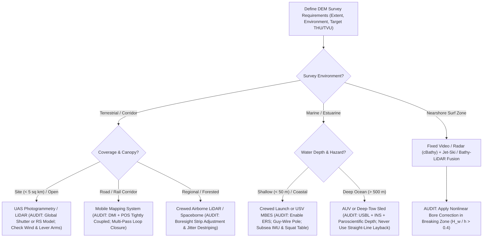

## 7.10 Common Pitfalls & Key Takeaways

Across terrestrial, airborne, marine, spaceborne, and stationary-infrastructure sensing, the carrier platform is never a passive geometric origin. Instead, it acts as a dynamic mechanical filter that couples with wind, waves, currents, gravity, and propulsion forces to imprint structured, spatially correlated artifacts onto the resulting Digital Elevation Model (DEM). While sensor physics (Chapters 8–12) sets the fundamental range precision of an individual measurement, **platform kinematics and viewing geometry dictate both the spatial frequency of systematic elevation errors and the occluded "shadow" zones of a DEM**. When platform motion or structural deformation occurs at frequencies that alias into the trajectory solution—or when environmental inversion models neglect nonlinear boundary effects—centimeter-grade sensors routinely produce decimeter- to meter-scale topographic and bathymetric biases.

This section examines five classic platform-induced failure modes spanning hydrographic launches, uncrewed aerial systems (UAS), opportunistic sonar poles, deep-towed marine sleds, and fixed coastal wave-inversion stations, complete with governing physical equations, worked numerical error budgets, and diagnostic remedies.

---

### 7.10.1 Five Platform-Induced Pitfall Case Studies

#### Pitfall 1: Ignoring Hydrographic Vessel Dynamic Squat and Fuel/Ballast Draft Changes in Non-ERS Surveys

In traditional tidal-datum hydrographic surveys (where water-level gauges rather than Ellipsoidally Referenced Surveying [ERS] provide the vertical datum reference), the acoustic transducer's depth below the instantaneous water surface is referenced to the vessel's static waterline. Two platform effects violate the assumption of a constant static draft: **hydrostatic displacement changes** as fuel and consumables are burned over a multi-day cruise, and **hydrodynamic squat** (the combined bodily sinkage and dynamic trim change caused by accelerated return flow and Bernoulli pressure drop beneath the hull at survey speed, derived in Section 7.8.1).

The instantaneous waterline elevation (effective downward draft of the transducer below the undisturbed ambient water surface) is governed by Eq. (7.4):

$$z_{\text{waterline}}(v, t) = z_{\text{static},0} - \frac{\Delta m_{\text{fuel/ballast}}(t)}{\rho_w A_{WP}} + C_B \frac{v^2}{g} f(\text{Fr}_h), \quad \text{Fr}_h = \frac{v}{\sqrt{gh}}$$

where:
* $z_{\text{static},0}$ is the initial static draft measured at the dock ($\text{m}$, positive downward into the water column),
* $\Delta m_{\text{fuel/ballast}}(t)$ is the net mass of fuel, fresh water, and ballast expended by epoch $t$ ($\text{kg}$),
* $\rho_w$ is the ambient water density ($\approx 1025\text{ kg/m}^3$ for coastal seawater),
* $A_{WP}$ is the area of the hull's waterplane at the waterline ($\text{m}^2$), defining the vessel's Tonnes Per Centimeter immersion $\text{TPC} = \rho_w A_{WP} / 10^5$ ($\text{t/cm}$),
* $C_B$ is the hull block coefficient (dimensionless), $v$ is vessel speed through water ($\text{m/s}$), $g = 9.81\text{ m/s}^2$, and $f(\text{Fr}_h) \approx \frac{S_b}{\sqrt{1 - \text{Fr}_h^2}}$ is the Tuck (1966) / ICORELS (1980) depth-Froude amplification factor in restricted water depth $h$ ($\text{m}$), with dimensionless slenderness-depth factor $S_b = C_S \frac{B T}{h L_{\text{PP}}}$ (Eq. 7.5).

Because a non-ERS echosounder measures the vertical acoustic range from the transducer to the seabed, $d_{\text{acoustic}} = h_{\text{true}} - z_{\text{waterline}}(v, t)$, and adds the constant assumed static draft $z_{\text{static},0}$, the charted depth $\hat{h}_{\text{chart}}$ is:

$$\hat{h}_{\text{chart}} = d_{\text{acoustic}} + z_{\text{static},0} = h_{\text{true}} + \underbrace{\frac{\Delta m_{\text{fuel/ballast}}(t)}{\rho_w A_{WP}}}_{\text{deep bias } (>0)} - \underbrace{\Delta z_{\text{squat}}(v, h)}_{\text{shoal bias } (<0)}$$

Consequently, unmodeled dynamic squat makes the seafloor appear artificially **shoal** ($\Delta \hat{h} = -\Delta z_{\text{squat}}$), whereas unmodeled fuel consumption makes the seafloor appear dangerously **deep** ($\Delta \hat{h} = +\Delta z_{\text{fuel}}$).

* **Worked Numerical Example:** Consider two operational scenarios:
  1. *Dynamic Squat in a Shallow Channel:* A $10\text{ m}$ hydrographic launch ($C_B = 0.45$, empirical squat constant $S_b = 0.085$) surveys a $h = 5.0\text{ m}$ navigation channel. During a slow cross-line at $v_1 = 4\text{ kn}$ ($2.06\text{ m/s}$), the depth Froude number is $\text{Fr}_{h,1} = 2.06 / \sqrt{9.81 \times 5.0} = 0.294$, yielding a minor dynamic squat of $\Delta z_{\text{squat},1} = 0.45 \times \frac{2.06^2}{9.81} \times \frac{0.085}{\sqrt{1 - 0.294^2}} = 0.017\text{ m}$ ($1.7\text{ cm}$). When the coxswain accelerates to $v_2 = 12\text{ kn}$ ($6.17\text{ m/s}$) on the main survey lines, $\text{Fr}_{h,2}$ rises to $0.881$, and hydrodynamic squat jumps to:
     $$\Delta z_{\text{squat},2} = 0.45 \times \frac{6.17^2}{9.81} \times \frac{0.085}{\sqrt{1 - 0.881^2}} = 1.746 \times 0.180 = 0.314\text{ m} \quad (31.4\text{ cm})$$
     Without a speed-dependent squat table (`MB-System` or `Kongsberg SIS`) or full 3D GNSS-INS ERS processing (NOAA HSSD, 2022), the main lines record depths $29.7\text{ cm}$ *shoaler* than the $4\text{ kn}$ cross-lines, exceeding both IHO S-44 (Edition 6.0.0, 2020) Exclusive Order ($\text{TVU}_{\max} = \sqrt{0.15^2 + (0.0075 \times 5.0)^2} = 15.5\text{ cm}$) and Special Order ($\text{TVU}_{\max} = \sqrt{0.25^2 + (0.0075 \times 5.0)^2} = 25.3\text{ cm}$ at $5\text{ m}$ depth) from platform hydrodynamics alone.
  2. *Multi-Week Fuel Burn:* An offshore survey ship with waterplane area $A_{WP} = 325\text{ m}^2$ ($\text{TPC} = 1025 \times 325 / 10^5 = 3.331\text{ t/cm}$) consumes $\Delta m = 40\text{ t}$ ($40{,}000\text{ kg}$) of diesel over a 14-day cruise. As the tanks empty, the hull rises out of the water by:
     $$\Delta z_{\text{fuel}} = \frac{40{,}000\text{ kg}}{1025\text{ kg/m}^3 \times 325\text{ m}^2} = 0.120\text{ m} \quad (12.0\text{ cm})$$
     If the static draft value in the acquisition software is not updated daily (or bypassed via ERS), Day 14 soundings are biased $12.0\text{ cm}$ too deep, producing a sharp $12\text{ cm}$ vertical step across swath seams with Day 1 lines.

> [!WARNING]
> **Pitfall 1 — Unmodeled Squat and Fuel Draft Drift:** Never rely on a single dockside sight-glass draft reading for a multi-day survey, and never apply deep-water empirical squat curves in shallow channels where $\text{Fr}_h > 0.4$. Adopt Ellipsoidally Referenced Surveying (ERS) with RTK/PPK GNSS and a calibrated vessel reference unit (VRU) so that both dynamic squat and fuel-burn draft changes are measured directly in the geodetic vertical frame.

---

#### Pitfall 2: Flying a Fast Drone with an Electronic Rolling-Shutter Camera Without Readout-Time Modeling

Consumer and prosumer UAS platforms frequently carry lightweight CMOS cameras equipped with an **electronic rolling shutter (ERS)** rather than a mechanical leaf or global shutter. Instead of exposing all $R$ pixel rows simultaneously at trigger epoch $t_0$, an electronic rolling shutter exposes and reads out rows sequentially from top to bottom over a readout duration $\tau_{\text{readout}}$ (typically $15\text{–}35\text{ ms}$). The exposure epoch $t_r$ of row $r \in [0, R]$ is:

$$t_r = t_0 + \tau_{\text{readout}} \left(\frac{r}{R} - \frac{1}{2}\right)$$

When the aircraft translates forward at ground speed $v$ ($\text{m/s}$) at altitude $H$ ($\text{m}$ AGL) with angular body rates $\boldsymbol{\omega} = (\omega_{\text{roll}}, \omega_{\text{pitch}}, \omega_{\text{yaw}})^T$, the camera projection center translates and rotates across the duration of a single frame, shearing the ground footprint along-track by (Vautherin et al., 2016):

$$\Delta x_{\text{shear}} = \left(v + H \omega_{\text{pitch}}\right) \tau_{\text{readout}} \xrightarrow{\omega_{\text{pitch}} = 0} v \cdot \tau_{\text{readout}}$$

When standard rigid-frame collinearity equations are used in Structure-from-Motion (SfM) bundle adjustment without a rolling-shutter readout model, the software absorbs the steady translational affine shear $\Delta x_{\text{shear}} = v \cdot \tau_{\text{readout}}$ between opposing flight strips ($\pm v$) by perturbing the self-calibrated interior orientation—specifically biasing the principal distance (focal length) by $\frac{\Delta f}{f} \approx \pm \frac{v \cdot \tau_{\text{readout}}}{d_{\text{footprint}}}$—which in turn warps the entire block into a quadratic vertical "bowl" or "dome" (James & Robson, 2014).

* **Worked Numerical Example:** A fixed-wing or fast multi-rotor UAS maps a corridor at altitude $H = 100\text{ m}$ AGL and ground speed $v = 15.0\text{ m/s}$ ($54\text{ km/h}$) using a 20 MP rolling-shutter camera with readout time $\tau_{\text{readout}} = 30\text{ ms}$ ($0.030\text{ s}$) and ground sampling distance $\text{GSD} = 2.5\text{ cm/pixel}$.
  * During a single frame exposure in level flight ($\omega_{\text{pitch}} = 0$), the drone translates forward by:
    $$\Delta x_{\text{shear}} = 15.0\text{ m/s} \times 0.030\text{ s} = 0.450\text{ m} \quad (45.0\text{ cm})$$
  * In image space, the bottom row of the frame is captured $18.0\text{ pixels}$ ($0.45\text{ m} / 0.025\text{ m/pixel}$) further along-track than the top row. If turbulent wind gusts induce an angular pitch rate of $\omega_{\text{pitch}} = 5^\circ/\text{s}$ ($0.0873\text{ rad/s}$), rotational coupling adds a further $H \omega_{\text{pitch}} \tau_{\text{readout}} = 100 \times 0.0873 \times 0.030 = 0.262\text{ m}$ ($10.5\text{ pixels}$) of non-affine intra-frame warp.
  * Across two adjacent opposing lawnmower strips ($+15\text{ m/s}$ northbound vs. $-15\text{ m/s}$ southbound), the relative geometric shear between tie points at frame edges reaches $2 \Delta x_{\text{shear}} = 0.90\text{ m}$. For an along-track ground footprint of $d_{\text{footprint}} = 90\text{ m}$ at $H = 100\text{ m}$, an uncompensated bundle adjustment shifts the calibrated focal length by $\Delta f / f \approx 0.45 / 90 = 0.5\%$, inducing a systematic vertical elevation bias of $\Delta Z = H \cdot (\Delta f / f) \approx 100\text{ m} \times 0.005 = 0.50\text{ m}$ ($50\text{ cm}$) alongside severe multi-decimeter block doming!

> [!WARNING]
> **Pitfall 2 — Rolling-Shutter Shear and Block Doming:** Flying a rolling-shutter camera at high airspeed ($v > 8\text{ m/s}$) without enabling linear/angular rolling-shutter compensation in the photogrammetric adjustment (`OpenDroneMap` `--rolling-shutter`, `Pix4D`, `Agisoft Metashape`) corrupts camera self-calibration and ruins RTK/PPK elevation accuracy. Either use a mechanical/global shutter payload, reduce flight speed, or explicitly solve for $\tau_{\text{readout}}$ using cross-grid flight lines with oblique views.

---

#### Pitfall 3: Over-the-Side Pole Flexure and Bubble Sweepdown on Opportunistic Survey Vessels

Rapid-response hydrographic surveys routinely mount a multibeam echosounder (MBES) on an over-the-side pole bolted to the gunwale of an opportunistic vessel, with the IMU and GNSS antennas mounted at the top or base of the pole. Two coupled fluid-structure pitfalls degrade such installations:
1. **Cantilever Drag Flexure and Kármán Vortex Shedding:** A cylindrical pole of diameter $D_{\text{pole}}$ and flexural rigidity $EI$ submerged over length $L_{\text{sub}}$ in flow speed $v$ experiences distributed hydrodynamic drag $F_D = \frac{1}{2}\rho_w C_D D_{\text{pole}} L_{\text{sub}} v^2$ along the shaft and concentrated drag $F_{\text{head}}$ on the sonar head at total length $L_{\text{pole}}$. By Euler–Bernoulli cantilever mechanics, this load induces a speed-dependent aftward pitch deflection at the transducer head of $\Delta\theta_{\text{pitch}} = \frac{F_{\text{head}} L_{\text{pole}}^2}{2EI} + \frac{F_D L_{\text{sub}}^2}{6EI}$, together with alternating transverse lift forces driven by a **Kármán vortex street** shedding at frequency:
   $$f_v = \frac{\text{St} \cdot v}{D_{\text{pole}}}$$
   where $\text{St} \approx 0.20$ is the dimensionless Strouhal number for subcritical and transitional cylinder flow ($300 < \text{Re} \lesssim 3.5 \times 10^5$). When $f_v$ approaches the structural natural frequency $f_n$ of the unbraced cantilever, **vortex-induced vibration (VIV)** locks in, oscillating the sonar head in roll and pitch out of phase with an IMU mounted above the deck clamp.
2. **Bubble Sweepdown:** A flat-bottomed or V-hull bow breaking through short-period chop entrains plumes of microbubbles along the hull boundary layer. By Wood's (1930) low-frequency effective medium equation, $\frac{1}{c_{\text{eff}}^2} \approx \frac{(1-\alpha_b)^2}{c_w^2} + \frac{\rho_w \alpha_b (1-\alpha_b)}{\gamma_g P_0}$, even a tiny air void fraction $\alpha_b \sim 10^{-4}$ at shallow hydrostatic pressure $P_0$ increases water compressibility by orders of magnitude—dropping the effective acoustic phase speed $c_{\text{eff}}$ from $\sim 1500\text{ m/s}$ by $300\text{–}600\text{ m/s}$ and causing severe ray-bending refraction or complete acoustic extinction ("dropouts") across outer beams.

* **Worked Numerical Example:** An unbraced aluminum pipe ($D_{\text{pole}} = 0.10\text{ m}$) is clamped to a vessel gunwale and towed at $v = 4.0\text{ m/s}$ ($7.8\text{ kn}$, $\text{Re} = v D_{\text{pole}}/\nu \approx 3.4 \times 10^5$) in $h = 25.0\text{ m}$ water depth.
  * The vortex shedding frequency is:
    $$f_v = \frac{0.20 \times 4.0\text{ m/s}}{0.10\text{ m}} = 8.0\text{ Hz}$$
    If the IMU is mounted at the top of the pole rather than co-located inside or directly atop the sonar head (`Subsea IMU`), an unmeasured $\pm 0.4^\circ$ dynamic roll oscillation at $8.0\text{ Hz}$ produces outer-beam ($\theta = 60^\circ$) vertical ripples of $\Delta z_{\text{ripple}} = h \tan(60^\circ) \sin(0.4^\circ) = 25.0 \times 1.732 \times 0.00698 = \pm 0.30\text{ m}$ ($60\text{ cm}$ peak-to-trough washboard corrugations every $v / f_v = 0.50\text{ m}$ along-track; Hughes Clarke, 2003).
  * Simultaneously, a steady $1.2^\circ$ aftward pole flexure under drag shifts the nadir sounding backward by $\Delta x = h \tan(1.2^\circ) = 0.524\text{ m}$ ($52.4\text{ cm}$). Over a flat seabed, the elongated slant path biases uncompensated nadir depth slightly deep by $\Delta z_{\text{flat}} = h(\sec 1.2^\circ - 1) \approx +0.0055\text{ m}$, whereas over a $20^\circ$ seafloor scarp ($\tan 20^\circ = 0.364$), the horizontal along-track shift induces a vertical depth error of $\Delta z_{\text{slope}} = \Delta x \tan(20^\circ) = 0.191\text{ m}$ ($19.1\text{ cm}$) alongside a pitch-coupled swath distortion.

> [!WARNING]
> **Pitfall 3 — Unbraced Sonar Poles and Top-Mounted IMUs:** Never assume an over-the-side hydrographic pole behaves as a rigid body under tow. Always brace the lower pole flange with tensioned fore-and-aft and athwartships cables (or rigid struts), fit hydrodynamic fairings or helical strakes to break up Kármán vortex shedding, and mount a submersible IMU directly on the multibeam transducer head.

---

#### Pitfall 4: Deep-Tow Cable Layback Misestimation During Vessel Turns and Depth Changes

When mapping the deep seafloor ($d > 1000\text{ m}$) with a towed sidescan or interferometric bathymetric sled, GNSS signals cannot penetrate the ocean. Low-budget surveys sometimes estimate towfish position from shipboard GNSS using a geometric **straight-line layback approximation**:

$$X_{\text{straight}} = \sqrt{L_{\text{cable}}^2 - (d_{\text{tow}} - d_{\text{sheave}})^2}$$

where $L_{\text{cable}}$ is the paid-out cable length ($\text{m}$) and $d_{\text{tow}}$ is towfish depth ($\text{m}$, positive-down, measured by an onboard pressure sensor). In reality, normal hydrodynamic drag $F_{Dn} = \frac{1}{2}\rho_w C_n d_c v_{\text{rel}}^2 \sin^2\phi$ and submerged cable weight per unit length $w_c$ deform the armored cable into a curved catenary governed by the coupled differential equations (7.15)–(7.17) in Section 7.8.3 (Pode, 1951; Chapman, 1984). By the Cauchy–Schwarz inequality on arclength integration, any non-zero cable curvature ($d\phi/ds \neq 0$) consumes cable scope along the sag profile and strictly reduces the horizontal span relative to a straight hypotenuse at the same depth ($X_{\text{catenary}}^2 + d_{\text{tow}}^2 < L_{\text{cable}}^2$). Conversely, if towfish depth $d_{\text{tow}}$ is *not* measured by a pressure gauge and is instead extrapolated from the surface wire angle $\phi_0$, hydrodynamic drag lifts the cable far shallower and further aft than expected. Furthermore, during vessel speed changes or turns, the miles of submerged cable act as a compliant hydrodynamic damper: the towfish cuts inside the ship's turning radius and sinks tens of meters as cable tension drops.

* **Worked Numerical Example:** A deep-tow bathymetric sidescan sled equipped with a pressure sensor is towed at depth $d_{\text{tow}} = 3000\text{ m}$ ($z_{\text{tow}} = -3000\text{ m}$) behind a research vessel with $L_{\text{cable}} = 4500\text{ m}$ of $17\text{ mm}$ armored coaxial cable ($d_{\text{sheave}} = 0\text{ m}$).
  * The naive straight-line layback formula estimates the towfish horizontal distance aft of the stern sheave as:
    $$X_{\text{straight}} = \sqrt{4500^2 - 3000^2} = \sqrt{11{,}250{,}000} = 3354.1\text{ m}$$
  * Integrating the steady-state hydrodynamic catenary ODEs (Eqs. 7.15–7.17) at $v = 1.5\text{ m/s}$ ($3\text{ kn}$) with a heavy depressor weight yields an actual horizontal layback of $X_{\text{catenary}} = 2980.0\text{ m}$—exposing a systematic along-track horizontal positioning error of $\Delta X = 3354.1 - 2980.0 = 374.1\text{ m}$!
  * Worse still, if the vessel slows by $0.5\text{ kn}$ to execute a turn without a high-precision ambient pressure gauge (`Paroscientific Digiquartz`) and an **Ultra-Short Baseline (USBL)** acoustic tracking beacon on the towfish, the sled sinks by $\Delta d \approx 35\text{ m}$ while swinging $450\text{ m}$ inside the ship's track, misplacing hydrothermal vents and fault scarps by hundreds of meters horizontally ($\text{THU} > 400\text{ m}$) and tens of meters vertically ($\text{TVU} > 30\text{ m}$).

> [!WARNING]
> **Pitfall 4 — Cable Layback vs. Acoustic Tracking:** Straight-line or static catenary layback models fail catastrophically in deep-tow surveys whenever cross-currents, speed variations, or vessel turns occur. Deep-tow sleds and ROVs must be tracked acoustically via USBL or Long Baseline (LBL) transponders fused with an onboard pressure-depth sensor and Doppler Velocity Log (DVL).

---

#### Pitfall 5: Linear Wave Dispersion Bias in Breaking Surf Zones (`cBathy` / Marine Radar)

Stationary coastal video systems (e.g., Argus stations running `cBathy`, Section 7.6; Holman et al., 2013) and marine X-band radars infer nearshore bathymetry $h(x,y)$ by tracking the phase speed $c = \omega / k$ of incoming surface gravity waves and inverting the **linear Airy wave dispersion relation** (Eqs. 7.10–7.12 in Section 7.8.2, assuming negligible ambient current $\mathbf{k}\cdot\mathbf{U} = 0$):

$$\omega^2 = gk \tanh(kh) \implies c_{\text{linear}} = \sqrt{\frac{g}{k}\tanh(kh)} \xrightarrow{kh \ll 1} \sqrt{gh}$$

However, as waves shoal over shallow nearshore sandbars and begin to break, the wave height $H_w$ becomes comparable to the water depth $h$ (governed by the depth-limited breaker index $\gamma_b = H_w / h \approx 0.42\text{–}0.78$). In this strongly nonlinear regime (Eq. 7.14; Booij, 1981; Kirby & Dalrymple, 1986), wave crests and turbulent surface foam rollers propagate as finite-amplitude bores whose phase speed includes **amplitude dispersion**:

$$c_{\text{nonlinear}} \approx \sqrt{g(h + \alpha_{\text{NL}} H_w)} = \sqrt{gh(1 + \alpha_{\text{NL}} \gamma_b)}$$

where $\alpha_{\text{NL}} \approx 0.42\text{–}0.50$ for weakly nonlinear shoaling waves and rises to $\alpha_{\text{NL}} \approx 0.70\text{–}0.85$ when optical cross-spectra lock onto turbulent breaking foam rollers. When a linear inversion algorithm (`cBathy`) substitutes the observed nonlinear phase speed $c_{\text{obs}} = c_{\text{nonlinear}}$ into the linear shallow-water inversion $\hat{h}_{\text{linear}} = c_{\text{obs}}^2 / g$, it systematically overestimates the true water depth by:

$$\hat{h}_{\text{linear}} = \frac{c_{\text{nonlinear}}^2}{g} \approx h(1 + \alpha_{\text{NL}} \gamma_b) \implies \frac{\Delta h}{h} = \frac{\hat{h}_{\text{linear}} - h}{h} \approx +\alpha_{\text{NL}} \gamma_b \quad (+20\%\text{ to }+50\%)$$

(Conversely, as shown by Eq. 7.11, neglecting an opposing offshore rip current or undertow $\mathbf{k}\cdot\mathbf{U} < 0$ reduces the Eulerian wave speed and biases inverted depths *shoal*.)

* **Worked Numerical Example:** A coastal video tower monitors a hazardous nearshore sandbar where the true water depth over the bar crest is $h = 2.00\text{ m}$. Storm swell breaks across the bar with wave height $H_w = 1.10\text{ m}$ ($\gamma_b = H_w / h = 0.55$).
  * Under weakly nonlinear solitary-wave dispersion ($\alpha_{\text{NL}} = 0.42$, Section 7.8.2), $c_{\text{obs}} = \sqrt{9.81 \times (2.00 + 0.42 \times 1.10)} = 4.914\text{ m/s}$, yielding a linear depth estimate $\hat{h}_{\text{linear}} = 2.462\text{ m}$ ($+0.462\text{ m}$ or $+23.1\%$ too deep).
  * When optical intensity tracking locks onto the turbulent breaking surface foam roller ($\alpha_{\text{NL}} = 0.85$), the observed propagation speed reaches:
    $$c_{\text{obs}} = \sqrt{9.81\text{ m/s}^2 \times \bigl(2.00\text{ m} + 0.85 \times 1.10\text{ m}\bigr)} = \sqrt{9.81 \times 2.935} = 5.366\text{ m/s}$$
  * Inverting $c_{\text{obs}} = 5.366\text{ m/s}$ with the linear shallow-water dispersion limit ($kh \ll 1$) yields an inverted depth of:
    $$\hat{h}_{\text{linear}} = \frac{(5.366\text{ m/s})^2}{9.81\text{ m/s}^2} = 2.935\text{ m}$$
  * The linear dispersion inversion **overestimates the water depth over the sandbar by $+0.935\text{ m}$ ($+46.8\%$)**—reporting nearly $3\text{ m}$ of navigable water where only $2.0\text{ m}$ actually exists!

> [!CAUTION]
> **Pitfall 5 — Surf-Zone Depth Overestimation in Wave Celerity Inversion:** Never use uncalibrated linear Airy wave dispersion (`cBathy` or marine X-band radar without breaking-wave dissipation filters) to certify minimum navigable depths over breaking surf-zone sandbars. Always incorporate a finite-amplitude breaking-wave roller correction ($\hat{h} = c_{\text{obs}}^2 / [g(1 + \alpha_{\text{NL}} \gamma_b)]$) and validate bar-crest elevations with surf-zone jet-ski echo-sounders, bathymetric LiDAR, or wading-rod RTK transects.

---

### 7.10.2 Summary Diagnostic Matrix & Platform Selection Workflow

| Platform & Sensor Domain | Primary Physical Pitfall | Characteristic DEM Artifact Signature | Typical Error Magnitude (THU / TVU) | Engineering Mitigation & Verification Protocol |
| :--- | :--- | :--- | :--- | :--- |
| **Pedestrian & Mobile Mapping** (RTK Poles / MMS Vans) | Uncompensated $2\text{ m}$ rover pole tilt ($\theta_p$); MMS DMI wheel-circumference drift & urban GNSS multipath | Horizontal shift $L_p\sin\theta_p$ & vertical drop $L_p(1-\cos\theta_p)$; multi-pass curb/crown splitting in urban canyons | $\text{THU} = 0.05\text{–}0.30\text{ m}$ $\text{TVU} = 0.02\text{–}0.15\text{ m}$ | Use IMU tilt-compensated RTK poles; calibrate MMS DMI tire pressure daily and enforce multi-pass SLAM/strip loop closure |
| **Fast UAS / Drones** (CMOS Rolling Shutter) | Sequential row readout ($\tau_{\text{readout}} \approx 30\text{ ms}$) shearing frames by $(v + H\omega_{\text{pitch}}) \tau_{\text{readout}}$ | Quadratic block "bowling/doming" ($> 0.5\text{ m}$); biased self-calibrated focal length $f$ | $\text{THU} = 0.15\text{–}0.50\text{ m}$ $\text{TVU} = 0.20\text{–}1.00\text{ m}$ | Use mechanical/global shutter cameras; enable rolling-shutter camera model (`--rolling-shutter`) in bundle adjustment; fly cross-strips with oblique views |
| **Hydrographic Vessels** (Non-ERS MBES/SBES) | Unmodeled hydrodynamic squat ($\propto v^2 \text{Fr}_h$) & multi-day fuel draft rise | Speed-dependent shoal bias on main lines; day-to-day deep bias as fuel burns | $\text{TVU} = 0.10\text{–}0.35\text{ m}$ (exceeds IHO Special Order) | Use RTK/PPK Ellipsoidally Referenced Surveying (ERS); calibrate empirical speed-squat curves across depth regimes; log daily fuel/ballast TPC |
| **Opportunistic Vessels** (Over-the-Side Pole MBES) | Cantilever drag deflection ($\Delta\theta_{\text{pitch}}$), Kármán VIV ($f_v = \text{St}\cdot v/D$), & bubble sweepdown | High-frequency outer-beam "corrugated" ripples; slope shifts; outer-beam acoustic dropouts | $\text{THU} = 0.30\text{–}1.50\text{ m}$ $\text{TVU} = 0.15\text{–}0.60\text{ m}$ | Install fore-and-aft tensioned guy-wires and hydrodynamic fairings; mount a subsea IMU directly on the sonar head; extend pole below hull bubble layer |
| **Deep-Tow Marine Sleds** (Sidescan / Interferometric) | Straight-line cable layback assumption vs. 3D hydrodynamic catenary & turn lag | Features displaced hundreds of meters along/across-track; vertical depth jumps on turns | $\text{THU} = 100\text{–}500\text{ m}$ $\text{TVU} = 10\text{–}40\text{ m}$ | Equip towfish with USBL/LBL acoustic positioning responder and high-accuracy pressure depth sensor + altimeter; maintain steady speed on lines |
| **Spaceborne Stereo & InSAR** (Pushbroom / Radar) | Spacecraft attitude jitter (reaction wheels / solar array modes) & baseline thermal drift | Cross-track sinusoidal "striping" or banding ($0.2\text{–}2.0\text{ m}$); long-wavelength orbital ramps | $\text{THU} = 0.50\text{–}5.0\text{ m}$ $\text{TVU} = 0.30\text{–}3.0\text{ m}$ | Apply star-tracker/gyro micro-jitter destriping filters (`ASP` `jitter_solve`); tie InSAR/stereo blocks to ICESat-2 laser altimetry control points |
| **Fixed Coastal Towers** (`cBathy` Video / X-Band Radar) | Applying linear Airy dispersion ($\omega^2 = gk\tanh kh$) to nonlinear breaking surf bores | Systematic depth *overestimation* ($20\%\text{–}50\%$ too deep) directly over shallow sandbar crests | $\text{THU} = 2.0\text{–}10.0\text{ m}$ $\text{TVU} = 0.50\text{–}1.50\text{ m}$ | Apply finite-amplitude breaking-wave dispersion correction ($c \approx \sqrt{g(h + \alpha_{\text{NL}} H_w)}$); fuse with pre-breaking offshore wave tracks and jet-ski truth |

---

### 7.10.3 Key Takeaways & Field Audit Checklist

> [!IMPORTANT]
> **Key Takeaways — Chapter 7:**
> 1. **Platform Kinematics Govern Error Spatial Frequency:** High-frequency platform vibrations (UAS motor resonance, pole vortex shedding at $f_v = \text{St}\cdot v/D_{\text{pole}}$, spacecraft reaction-wheel jitter, wave chop) create short-wavelength corrugated ripples across the DEM, whereas low-frequency platform dynamics (vessel fuel burn, satellite thermal orbit drift, INS heading drift in urban canyons) introduce long-wavelength tilts, steps, and block doming.
> 2. **Viewing Geometry Controls Occlusions and Anisotropy:** Nadir airborne/spaceborne platforms suffer from steep-wall and under-bridge occlusions; ground-based TLS and street-level MMS capture vertical facades with millimeter fidelity but leave roof tops and back-slopes in geometric shadow; deep-water surface ships suffer wide acoustic footprints ($\Delta x = 2 d \tan(\Delta\theta/2)$) that can only be overcome by flying an AUV or ROV $5\text{–}50\text{ m}$ above the seabed.
> 3. **Co-Locate Motion Sensors with the Measurement Head:** Whenever a structural mount can flex under aerodynamic or hydrodynamic load (over-the-side sonar poles, helicopter-slung pods, gimbaled UAS cameras), mounting the IMU on the primary vehicle body rather than directly on the sensor head introduces uncompensated dynamic lever-arm and boresight errors.
> 4. **Opportunistic and Fixed Infrastructure Require Physics-Informed Calibration:** Extracting elevation and bathymetry from coastal webcams (`cBathy`), CORS multipath (`gnssrefl`), or telecom fiber (`DAS`) transforms civilian infrastructure into persistent environmental observatories, but requires explicit accounting for nonlinear boundary physics (such as finite-amplitude wave breaking and atmospheric refraction).

> [!TIP]
> **Practitioner's Pre- and Post-Survey Platform Audit Checklist:**
> - [ ] **Rigid Lever Arms & Boresight:** Have the 3D offsets $(\Delta X, \Delta Y, \Delta Z)$ between the GNSS phase center, IMU center of navigation, and sensor optical/acoustic center been surveyed to $\le 2\text{ mm}$, and has a full patch test / boresight strip adjustment been executed before production?
> - [ ] **Pedestrian & Mobile Pole/Wheel Verification:** Have terrestrial GNSS rover poles been checked with a concentric bullseye bubble or calibrated IMU tilt sensor (noting that a $5^\circ$ tilt on a $2.0\text{ m}$ pole causes $\Delta X = 17.4\text{ cm}$ horizontal error and $\Delta Z = 0.8\text{ cm}$ vertical error), and have MMS wheel-odometer (DMI) scale factors been calibrated at operating tire pressure?
> - [ ] **Structural Rigidity & Vortex Mitigation:** Are over-the-side poles braced with tensioned fore-and-aft and athwartships guy-wires, fitted with helical strakes or fairings to suppress Kármán vortex lock-in, and lowered beneath the hull's aerated bubble-sweepdown layer?
> - [ ] **Ellipsoidal Vertical Referencing (ERS) & Squat Verification:** On marine platforms, is vertical positioning tied directly to the ellipsoid via RTK/PPK GNSS-INS? If operating on conventional water-level datums, have speed-stepped squat trials ($2\text{ kn}$ to $\text{max speed}$) and daily fuel/ballast draft readings been logged?
> - [ ] **Shutter & Timestamp Synchronization:** On airborne photogrammetric platforms, is hardware camera exposure synchronization (`Event Marker` pulse to the GNSS receiver) active with sub-millisecond latency, and is rolling-shutter readout modeling enabled if a CMOS rolling-shutter payload is flown?
> - [ ] **Submerged Acoustic Tracking:** For deep-tow bodies, ROVs, and AUVs, is a calibrated USBL/LBL acoustic positioning system integrated with a Doppler Velocity Log (DVL), INS, and ambient pressure sensor, verified via reciprocal cross-lines over a seafloor feature?
