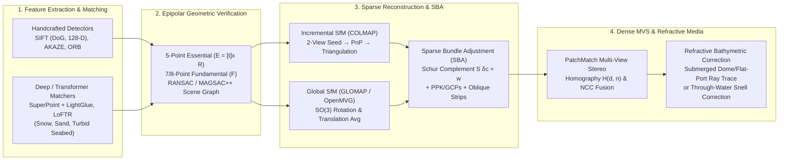

## 8.2 Structure from Motion (SfM) and Multi-View Stereo (MVS)

Whereas classical metric photogrammetry (Section 8.1) requires pre-calibrated metric cameras, tightly controlled flight strips, and known *a priori* exterior orientation seeds to triangulate stereo pairs, **Structure from Motion (SfM)** and **Multi-View Stereo (MVS)** invert the problem: given an unordered or loosely structured collection of highly overlapping images ($75\%\text{–}90\%$ forward overlap, $65\%\text{–}80\%$ sidelap) acquired from consumer drones, handheld cameras, aircraft, or underwater Remotely Operated Vehicles (ROVs), SfM simultaneously recovers the 3D scene structure $\{\mathbf{X}_i\}$, the 6-DoF extrinsic camera poses $\{\mathbf{R}_j, \mathbf{t}_j\}$, and the intrinsic calibration parameters $\mathbf{K}_j$ without requiring prior knowledge of camera positions. Rooted in projective geometry and computer vision milestones—including the eight-point Essential matrix algorithm (Longuet-Higgins, 1981), **RANSAC** robust estimation (`gis-history` 1981 milestone; Fischler & Bolles, 1981), orthographic factorization of image streams (`gis-history` 1992 milestone; Tomasi & Kanade, 1992), Scale-Invariant Feature Transform (**SIFT**; Lowe, 2004), and large-scale internet photo reconstruction (Snavely et al., 2006)—the modern SfM–MVS pipeline (`COLMAP`, Schönberger & Frahm, 2016; `MicMac`, Rupnik et al., 2017; `OpenDroneMap`; Agisoft `Metashape`; `Pix4D`) has democratized centimeter-resolution topographic and bathymetric DEM generation across the Earth sciences (Westoby et al., 2012; James & Robson, 2012).

Yet this mathematical flexibility introduces severe metrological vulnerabilities when applied to geospatial DEM production. Because SfM typically relies on **on-the-job self-calibration** to estimate lens distortion parameters alongside terrain coordinates, degenerate viewing geometries—most notably nadir-only parallel UAV flight lines over flat or gently sloping landscapes—create projective couplings in the Bundle Adjustment normal equations that warp the entire reconstructed DEM into a systematic paraboloidal **"dome" or "bowl"** (James & Robson, 2014). Furthermore, when photogrammetry is extended into the marine and fluvial domains—either via **submerged underwater housings** on ROVs/AUVs or via **two-media (through-water) airborne/drone imagery**—light rays bend across refractive interfaces according to Snell's law, violating the single-viewpoint pinhole camera model and systematically distorting reconstructed depths unless refractive ray geometry and wavelength-dependent water attenuation are explicitly modeled (Treibitz et al., 2012; Dietrich, 2017).



---

### 8.2.1 Feature Detection, Geometric Verification, Incremental vs. Global SfM, and Sparse Bundle Adjustment (SBA)

#### Scale- and Rotation-Invariant Features vs. Learned Deep Matchers

To initialize camera poses without human-measured tie points, an SfM pipeline must automatically detect and match thousands of conjugate 2D image features across overlapping views despite changes in camera scale (altitude variations), in-plane rotation (crab and yaw), perspective foreshortening, and illumination:

1. **Classical Handcrafted Detectors and Descriptors:**
   - **SIFT (Scale-Invariant Feature Transform; Lowe, 2004):** Convolves each image $I(u,v)$ with a bank of Gaussian kernels $G(u,v,\sigma)$ across multiple octaves to construct a **Difference-of-Gaussians (DoG)** scale space:
     $$D(u,v,\sigma) = \bigl(G(u,v,k\sigma) - G(u,v,\sigma)\bigr) * I(u,v)$$
     Local 3D extrema $(u,v,\sigma)$ across adjacent DoG scales are refined to sub-pixel and sub-scale accuracy ($\sim 0.05\text{–}0.15\text{ px}$) via a second-order Taylor expansion, while poorly localized step-edge responses are rejected by bounding the ratio of principal curvatures of the $2\times 2$ spatial Hessian $\mathbf{H}_D$ ($\operatorname{Tr}(\mathbf{H}_D)^2 / \det(\mathbf{H}_D) < (r+1)^2/r$, typically $r = 10$). Each keypoint is assigned a canonical orientation from the dominant peak of its local gradient orientation histogram and encoded into a $4\times 4 \times 8 = 128$-dimensional gradient histogram descriptor normalized to unit $\ell_2$ length (with values clamped at $0.2$ to suppress non-linear illumination shifts). Candidate matches between images $j$ and $j'$ are filtered using **Lowe's nearest-neighbor distance ratio test**, accepting a correspondence only if the Euclidean distance to the closest descriptor $d_1$ is significantly smaller than to the second-closest descriptor $d_2$ ($d_1 / d_2 < \tau_{\text{ratio}}$, typically $0.75\text{–}0.80$).
   - **AKAZE (Alcantarilla et al., 2013) and ORB (Rublee et al., 2011):** Whereas SIFT's isotropic Gaussian blurring smooths across both noise and true object boundaries, **AKAZE** constructs a non-linear diffusion scale space ($\partial L / \partial t = \nabla \cdot (c(\|\nabla L\|)\nabla L)$) via Fast Explicit Diffusion (FED) that preserves sharp rock fractures and building edges, pairing it with a binary Modified Local Difference Binary (M-LDB) descriptor. **ORB** (Oriented FAST and Rotated BRIEF) replaces multi-scale derivatives with high-speed FAST corner intensity tests and 256-bit binary strings compared via hardware `POPCNT` Hamming distance, achieving $10\text{–}30\times$ lower latency for real-time visual odometry at the cost of reduced invariance to large scale changes ($>1.5\times$) and off-nadir perspective warps.

2. **Learned Deep Feature Matchers for Low-Texture Earth Surfaces:**
   Handcrafted gradient detectors rely on localized high-frequency contrast; consequently, they routinely fail over **low-texture or repetitive natural surfaces** such as fresh snowfields and glacier accumulation zones, dry aeolian sand dunes, intertidal mudflats, shadowed canyon walls, and homogeneous sandy seabeds. Recent deep learning architectures resolve this bottleneck through two paradigms:
   - **Learned Keypoint + Graph Attention Matchers (**`SuperPoint` **+** `SuperGlue` **/** `LightGlue`**):** **SuperPoint** (DeTone et al., 2018) uses a shared convolutional encoder trained via self-supervised homographic adaptation to jointly predict repeatable interest points and 256-D descriptors. Rather than matching descriptors via greedy nearest-neighbor heuristics that ignore spatial layout, **SuperGlue** (Sarlin et al., 2020) and its computationally streamlined successor **LightGlue** (Lindenberger et al., 2023) construct a complete bipartite graph over keypoints in both images, alternating **self-attention** (encoding intra-image geometric context) and **cross-attention** (comparing inter-image appearance) layers in a Transformer network before solving a differentiable optimal transport / assignment problem. Because the network learns that neighboring points on a smooth surface must move coherently, it reliably matches subtle, low-contrast albedo variations across snow and sand where SIFT ratio tests reject $>95\%$ of candidates.
   - **Detector-Free Dense Transformer Matchers (**`LoFTR`**):** **LoFTR** (Local Feature TRansformer; Sun et al., 2021) eliminates the discrete keypoint detection bottleneck altogether. It applies self- and cross-attention directly to dense coarse feature grids ($1/8$ image resolution) to establish correspondences even inside completely featureless patches, and then crops $5\times 5$ fine-resolution correlation windows ($1/2$ resolution) to compute sub-pixel expected positions.

| Feature / Matcher Paradigm | Descriptor Representation & Metric | Scale / Viewpoint Invariance | Compute Cost (per MP) | Performance on Low-Texture Terrain (Snow, Sand, Seabed) |
| :--- | :--- | :--- | :--- | :--- |
| **SIFT** (`RootSIFT`, Lowe, 2004; Arandjelović & Zisserman, 2012) | 128-D float/uint8; $\ell_2$ or Hellinger (`RootSIFT`) | High ($\Delta s > 2.5\times$, $\Delta\theta \le 40^\circ$) | Moderate (GPU SIFT fast) | **Poor–Moderate:** Fails where DoG contrast falls below threshold ($\tau_c \approx 0.03$) |
| **AKAZE** (Alcantarilla et al., 2013) | 486-bit M-LDB binary; Hamming | Moderate–High ($\Delta\theta \le 35^\circ$) | Fast (CPU/GPU) | **Moderate:** Preserves subtle step edges better than Gaussian DoG |
| **ORB** (Rublee et al., 2011) | 256-bit binary; Hamming | Low–Moderate ($\Delta s < 1.5\times$) | Ultra-Fast (Real-Time SLAM) | **Poor:** High outlier rate on repetitive natural textures |
| **SuperPoint + LightGlue** (DeTone et al., 2018; Lindenberger et al., 2023) | 256-D learned + GNN Transformer attention | Very High ($\Delta\theta \le 60^\circ$, day/night) | Fast on GPU ($15\text{–}30\text{ ms/pair}$) | **High:** Graph context disambiguates weak, repetitive snow/dune patterns |
| **LoFTR** (Sun et al., 2021) | Detector-free coarse-to-fine linear Transformer | Very High ($\Delta\theta \le 60^\circ$) | Heavy GPU ($80\text{–}200\text{ ms/pair}$) | **Very High:** Establishes dense matches across textureless ice, snow, and sand |

#### Epipolar Geometric Verification (`RANSAC` and `MAGSAC++`)

Raw descriptor matching inevitably admits $20\%\text{–}85\%$ false correspondences (outliers) caused by repetitive foliage, waves, roof tiles, or shadows. Before entering 3D reconstruction, every candidate image pair $(j, j')$ undergoes **two-view epipolar geometric verification**. Let $\mathbf{x} = [u, v, 1]^\top$ and $\mathbf{x}' = [u', v', 1]^\top$ denote homogeneous pixel coordinates of a candidate match, and let $\tilde{\mathbf{x}} = \mathbf{K}^{-1}\mathbf{x}$ and $\tilde{\mathbf{x}}' = \mathbf{K}'^{-1}\mathbf{x}'$ denote normalized image coordinates when nominal camera intrinsics $\mathbf{K}, \mathbf{K}'$ are known from EXIF or laboratory calibration. Coplanarity of the two viewing rays with the baseline vector $\mathbf{t}$ connecting the camera centers enforces:

$$\tilde{\mathbf{x}}'^\top \mathbf{E} \tilde{\mathbf{x}} = 0 \quad (\text{Calibrated, 5 DoF}), \qquad \mathbf{x}'^\top \mathbf{F} \mathbf{x} = 0 \quad (\text{Uncalibrated, 7 DoF})$$

where $\mathbf{E} = [\mathbf{t}]_\times \mathbf{R} \in \mathbb{R}^{3\times 3}$ is the **Essential Matrix** (characterized by two equal non-zero singular values $[\sigma, \sigma, 0]$ and solved minimally from $5$ point correspondences via **Nistér's 5-point degree-10 polynomial solver**; Nistér, 2004) and $\mathbf{F} = \mathbf{K}'^{-\top} \mathbf{E} \mathbf{K}^{-1}$ is the rank-2 **Fundamental Matrix** ($\det(\mathbf{F}) = 0$, solved from $7$ points via a cubic determinant constraint or $\ge 8$ points via Hartley's normalized 8-point algorithm; Hartley, 1997). When two views image a nearly planar ground surface or are related by pure rotation ($\|\mathbf{t}\| \to 0$), $\mathbf{F}$ degenerates and verification simultaneously tests a 4-point planar **Homography** $\mathbf{x}' \sim \mathbf{H}\mathbf{x}$, selecting the non-degenerate model via Geometric Robust Information Criterion (GRIC; Torr, 1998).

Minimal solvers are embedded inside **RANSAC** (Fischler & Bolles, 1981), Locally Optimized RANSAC (**LO-RANSAC**), or **MAGSAC++** (Marginalizing Sample Consensus; Baráth et al., 2020). Whereas classical RANSAC requires a user-tuned hard pixel threshold $\tau_{\text{ep}}$ to classify inliers via the first-order **Sampson epipolar distance**:

$$d_{\text{Sampson}}^2(\mathbf{x}, \mathbf{x}', \mathbf{F}) = \frac{\left(\mathbf{x}'^\top \mathbf{F} \mathbf{x}\right)^2}{(\mathbf{F}\mathbf{x})_1^2 + (\mathbf{F}\mathbf{x})_2^2 + (\mathbf{F}^\top\mathbf{x}')_1^2 + (\mathbf{F}^\top\mathbf{x}')_2^2} \le \tau_{\text{ep}}^2$$

**MAGSAC++** marginalizes over the unknown noise scale $\sigma \in (0, \sigma_{\max}]$ under a $\chi^2$ inlier distribution, converting model scoring and refinement into an iteratively reweighted least-squares (IRLS) problem that preserves valid matches even when lens distortion or rolling-shutter readout slightly inflates epipolar residuals near image borders. Verified image pairs with sufficient inliers ($N_{\text{in}} \ge 15\text{–}30$) and adequate median ray triangulation angle ($\alpha_{\text{tri}} \ge 1.5^\circ\text{–}2.0^\circ$) form the edges of the **SfM scene graph**.

#### Incremental vs. Global Structure from Motion

From the verified scene graph, two algorithmic paradigms recover the initial 3D camera poses and sparse tie-point cloud:

- **Incremental SfM (e.g., `COLMAP`, Schönberger & Frahm, 2016; `Bundler`, Snavely et al., 2006):** Starts by selecting a single well-conditioned two-view seed pair with a high verified match count and wide triangulation baseline, decomposing its Essential matrix $\mathbf{E}$ into $(\mathbf{R}_0 = \mathbf{I}_3, \mathbf{t}_0 = \mathbf{0})$ and $(\mathbf{R}_1, \mathbf{t}_1)$ via cheirality checks (points must lie in front of both cameras), and triangulating initial 3D tracks $\{\mathbf{X}_i\}$. It then loops through four sequential stages: (1) **Next-Best-View Registration**, selecting the uncalibrated image that observes the largest number of well-distributed existing 3D points and estimating its 6-DoF pose via **Perspective-$n$-Point (PnP)** (e.g., P3P/EPnP inside RANSAC); (2) **Multi-View Triangulation** of new 3D tracks; (3) **Iterative Local Bundle Adjustment** over the most recently connected sub-block of cameras; and (4) periodic **Global Bundle Adjustment** whenever the reconstructed model grows by a fixed percentage (e.g., $10\%$). Incremental SfM is exceptionally resilient against surviving scene-graph outliers, but repeated global BA sweeps incur $O(M^4)$ computational scaling over $M$ images and can accumulate slow trajectory drift along unclosed linear corridors.
- **Global SfM (e.g., `OpenMVG`, Moulon et al., 2013; `Theia`; `GLOMAP`, Pan et al., 2024):** Eliminates sequential bootstrapping by solving for all camera poses simultaneously in a single global pass. First, **Global Rotation Averaging** estimates all absolute orientations $\{\mathbf{R}_j \in SO(3)\}_{j=1}^M$ from pairwise relative rotations $\mathbf{R}_{jj'} \approx \mathbf{R}_{j'}\mathbf{R}_j^\top$ (after rejecting false edges via loop cycle-consistency checks $\mathbf{R}_{jk}\mathbf{R}_{kl}\mathbf{R}_{lj} \approx \mathbf{I}_3$) by minimizing chordal or geodesic distances on the Lie algebra $\mathfrak{so}(3)$ (Chatterjee & Govindu, 2013). Second, with rotations fixed, **Global Translation / Positioning Averaging** solves for all camera centers $\{\mathbf{C}_j\}$ and 3D tracks $\{\mathbf{X}_i\}$ jointly from unit direction constraints $\frac{\mathbf{C}_{j'} - \mathbf{C}_j}{\|\mathbf{C}_{j'} - \mathbf{C}_j\|} \approx \mathbf{R}_j^\top \mathbf{t}_{jj'}$ and point-to-camera ray alignments (Pan et al., 2024), followed by a single global Bundle Adjustment. Global SfM runs $10\text{–}50\times$ faster on massive blocks ($10^4\text{–}10^5$ images) and distributes closure errors uniformly across the block rather than concentrating drift at the end of a sequential chain.

#### Sparse Bundle Adjustment (SBA) and the Schur Complement Trick

Regardless of whether cameras are initialized incrementally or globally, final geometric fidelity rests on **Sparse Bundle Adjustment (SBA)** (Triggs et al., 2000; Lourakis & Argyros, 2009)—the joint nonlinear least-squares optimization of all camera parameter vectors $\mathbf{c}_j \in \mathbb{R}^{d_c}$ (comprising 6 extrinsic parameters $[\boldsymbol{\omega}_j^\top, \mathbf{C}_j^\top]^\top$ plus shared or per-camera intrinsic parameters $\mathbf{k} = [f, c_x, c_y, k_1, k_2, k_3, p_1, p_2]^\top$) and all $N$ 3D tie-point coordinates $\mathbf{X}_i = [X_i, Y_i, Z_i]^\top \in \mathbb{R}^3$. Incorporating survey-grade GNSS/PPK camera exposure center priors $\mathbf{C}_j^{\text{GNSS}}$ (covariance $\boldsymbol{\Sigma}_{C,j}$, corrected for the IMU/antenna-to-camera lever arm $\mathbf{C}_j = \mathbf{p}_{\text{GNSS}}(t_j) - \mathbf{R}_j^\top \boldsymbol{\ell}_{\text{cam}}^b$) and surveyed 3D Ground Control Points $\mathbf{X}_k^{\text{GCP}}$ (covariance $\boldsymbol{\Sigma}_{\text{GCP},k}$), the full SBA objective is:

$$\min_{\{\mathbf{c}_j\}_{j=1}^M, \{\mathbf{X}_i\}_{i=1}^N} \sum_{i=1}^{N} \sum_{j \in \mathcal{V}(i)} \rho\!\left( \left\| \mathbf{x}_{ij} - \pi(\mathbf{c}_j, \mathbf{X}_i) \right\|_{\boldsymbol{\Sigma}_{ij}}^2 \right) + \sum_{j \in \mathcal{G}_{\text{cam}}} \left\| \mathbf{C}_j - \mathbf{C}_j^{\text{GNSS}} \right\|_{\boldsymbol{\Sigma}_{C,j}}^2 + \sum_{k \in \mathcal{G}_{\text{GCP}}} \left\| \mathbf{X}_k - \mathbf{X}_k^{\text{GCP}} \right\|_{\boldsymbol{\Sigma}_{\text{GCP},k}}^2$$

where $\mathcal{V}(i)$ is the set of cameras observing 3D point $i$, $\pi(\mathbf{c}_j, \mathbf{X}_i)$ is the collinearity projection operator (including Brown–Conrady distortion), $\boldsymbol{\Sigma}_{ij} = \sigma_{ij}^2 \mathbf{I}_2$ is the 2D feature measurement covariance (scaled by the SIFT octave scale factor), and $\rho(\cdot)$ is a robust loss function (such as Huber or Cauchy) that downweights residual matching blunders.

In a typical UAV or airborne block of $M = 2,000$ images and $N = 1,000,000$ tie points, the total state vector $\boldsymbol{\theta} = [\mathbf{c}_1^\top, \dots, \mathbf{c}_M^\top, \mathbf{X}_1^\top, \dots, \mathbf{X}_N^\top]^\top$ has dimension $P = d_c M + 3N \approx 3.01 \times 10^6$; naively forming and inverting a dense $P \times P$ Hessian matrix ($O(P^3) \approx 2.7 \times 10^{19}$ operations) is computationally impossible. SBA overcomes this by exploiting the **primary bipartite sparsity structure** of the Jacobian $\mathbf{J} = [\mathbf{J}_c \;\; \mathbf{J}_X]$ of the reprojection residual vector $\mathbf{r}_{ij} = \pi(\mathbf{c}_j, \mathbf{X}_i) - \mathbf{x}_{ij}$, where $\mathbf{J}_{c,ij} = \frac{\partial \pi(\mathbf{c}_j, \mathbf{X}_i)}{\partial \mathbf{c}_j} \in \mathbb{R}^{2\times d_c}$ and $\mathbf{J}_{X,ij} = \frac{\partial \pi(\mathbf{c}_j, \mathbf{X}_i)}{\partial \mathbf{X}_i} \in \mathbb{R}^{2\times 3}$. At each Levenberg–Marquardt (LM) iteration, the damped normal equations $\left(\mathbf{J}^\top \mathbf{W} \mathbf{J} + \lambda \mathbf{D}\right) \boldsymbol{\delta} = -\mathbf{J}^\top \mathbf{W} \mathbf{r}$ partition naturally into camera blocks and 3D point blocks:

$$\begin{bmatrix} \mathbf{U}_c & \mathbf{W}_{cX} \\ \mathbf{W}_{cX}^\top & \mathbf{V}_X \end{bmatrix} \begin{bmatrix} \delta\mathbf{c} \\ \delta\mathbf{X} \end{bmatrix} = \begin{bmatrix} \boldsymbol{\epsilon}_c \\ \boldsymbol{\epsilon}_X \end{bmatrix}$$

where $\mathbf{U}_c \in \mathbb{R}^{d_c M \times d_c M}$ is block-diagonal across cameras (or bordered block-diagonal when cameras share a single intrinsic vector $\mathbf{k}$), $\mathbf{W}_{cX} \in \mathbb{R}^{d_c M \times 3N}$ has non-zero off-diagonal blocks $\mathbf{W}_{ji} = \mathbf{J}_{c,ij}^\top \mathbf{W}_{ij} \mathbf{J}_{X,ij} \in \mathbb{R}^{d_c \times 3}$ coupling camera $j$ to point $i$ if and only if $j \in \mathcal{V}(i)$, and—crucially—because no single 2D image observation directly connects two distinct 3D points $\mathbf{X}_i$ and $\mathbf{X}_{i'}$ ($i \neq i'$), the $3N \times 3N$ point-point matrix $\mathbf{V}_X$ is **strictly block-diagonal** with $N$ independent $3\times 3$ symmetric positive-definite blocks:

$$\mathbf{V}_X = \operatorname{blkdiag}\!\left(\mathbf{V}_1, \mathbf{V}_2, \dots, \mathbf{V}_N\right), \qquad \mathbf{V}_i = \sum_{j \in \mathcal{V}(i)} \mathbf{J}_{X,ij}^\top \mathbf{W}_{ij} \mathbf{J}_{X,ij} + \lambda \mathbf{D}_{X,i} \in \mathbb{R}^{3\times 3}$$

Left-multiplying the partitioned system by $\begin{bmatrix} \mathbf{I} & -\mathbf{W}_{cX} \mathbf{V}_X^{-1} \\ \mathbf{0} & \mathbf{I} \end{bmatrix}$ eliminates all $3N$ 3D point unknowns via the **Schur complement** $\mathbf{S}$ of $\mathbf{V}_X$, leaving the **Reduced Camera System** of size $d_c M \times d_c M$ (e.g., $12,000 \times 12,000$ instead of $3,012,000 \times 3,012,000$):

$$\mathbf{S}\,\delta\mathbf{c} = \left( \mathbf{U}_c - \mathbf{W}_{cX} \mathbf{V}_X^{-1} \mathbf{W}_{cX}^\top \right) \delta\mathbf{c} = \boldsymbol{\epsilon}_c - \mathbf{W}_{cX} \mathbf{V}_X^{-1} \boldsymbol{\epsilon}_X, \qquad \mathbf{S} = \mathbf{U}_c - \sum_{i=1}^{N} \mathbf{W}_{*,i} \mathbf{V}_i^{-1} \mathbf{W}_{*,i}^\top$$

Computing $\mathbf{V}_X^{-1}$ requires inverting $N$ tiny $3\times 3$ matrices in linear $O(N)$ time, while the reduced matrix $\mathbf{S}$ has non-zero off-diagonal blocks $\mathbf{S}_{jj'}$ only between camera pairs $(j, j')$ that co-observe at least one common 3D point. Once $\delta\mathbf{c}$ is solved via sparse Cholesky factorization or Preconditioned Conjugate Gradients (PCG; Agarwal et al., 2010), the $N$ 3D point updates are recovered in parallel by back-substitution:

$$\delta\mathbf{X}_i = \mathbf{V}_i^{-1} \left( \boldsymbol{\epsilon}_{X,i} - \sum_{j \in \mathcal{V}(i)} \mathbf{W}_{ji}^\top \delta\mathbf{c}_j \right), \qquad i = 1, \dots, N$$

If no absolute geodetic priors ($\mathcal{G}_{\text{cam}} = \emptyset, \mathcal{G}_{\text{GCP}} = \emptyset$) are supplied, the unconstrained normal matrix $\mathbf{S}$ possesses a **7-Degree-of-Freedom gauge nullspace** corresponding to a global 3D similarity transformation (3 translations, 3 rotations, 1 uniform scale $s$) of the entire reconstruction; at least three non-collinear 3D GCPs (9 scalar constraints) or non-collinear PPK camera centers are required to lock the reconstruction into an Earth-fixed datum.

#### Multi-View Stereo (MVS) Dense Reconstruction

Once SBA locks the extrinsic and intrinsic camera parameters, **Multi-View Stereo (MVS)** transforms the sparse tie-point cloud ($10^5\text{–}10^6$ points) into a dense surface model ($10^7\text{–}10^9$ points, approaching 1 point per pixel). Modern production pipelines (`COLMAP`, `OpenMVS`, `MicMac`, `Metashape`) rely on **PatchMatch MVS** (Bleyer et al., 2011; Schönberger et al., 2016): for every pixel $\mathbf{x}_r = [u, v, 1]^\top$ in a reference image $I_r$, the algorithm estimates an optical-axis depth $d(\mathbf{x}_r)$ (such that $\mathbf{X}^r = d\,\mathbf{K}_r^{-1}\mathbf{x}_r$) and a 3D surface normal $\mathbf{n}(\mathbf{x}_r)$ in the reference camera frame. Together, $(d, \mathbf{n})$ define a local 3D tangent plane $\mathbf{n}^\top \mathbf{X}^r + d_{\perp} = 0$ (where $d_{\perp} = -d\,\mathbf{n}^\top \mathbf{K}_r^{-1}\mathbf{x}_r$), which induces a local **plane-induced homography** $\mathbf{H}_{m \leftarrow r}(d, \mathbf{n})$ warping a square patch around $\mathbf{x}_r$ directly into each neighboring source image $I_m$ (with relative pose $\mathbf{R}_{mr}, \mathbf{t}_{mr}$):

$$\mathbf{H}_{m \leftarrow r}(d, \mathbf{n}) = \mathbf{K}_m \left( \mathbf{R}_{mr} - \frac{\mathbf{t}_{mr} \mathbf{n}^\top}{d_{\perp}} \right) \mathbf{K}_r^{-1}$$

By warping patches via $\mathbf{H}_{m \leftarrow r}(d, \mathbf{n})$ rather than a fronto-parallel square window, PatchMatch eliminates perspective foreshortening bias on steep cliffs and building roofs (Section 8.1), evaluating bilaterally weighted Normalized Cross-Correlation (NCC) across multiple views selected via an Expectation–Maximization (EM) visibility model. After alternating spatial propagation and random perturbation sweeps, per-view depth/normal maps are cross-checked for geometric consistency across $\ge 3$ views (rejecting pixels whose reprojected depth differs by $>1\%$ or normal differs by $>10^\circ$) and fused into a dense point cloud or Poisson/Delaunay surface mesh.

---

### 8.2.2 Self-Calibration Pathologies: Radial Distortion ($k_1$) and the Classic "Doming / Bowling" Error

#### Projective Coupling Between $\delta k_1$, Focal Length $\delta f$, and DEM Curvature

Because consumer and prosumer UAV cameras suffer from thermal expansion and mechanical focus shifts between flights, operators routinely enable **camera self-calibration** inside SBA, estimating $(f, c_x, c_y, k_1, k_2, p_1, p_2)$ directly from the image block. However, when a drone executes a standard **nadir-only parallel strip survey** ($\theta_{\text{pitch}} \approx 0^\circ$) at constant altitude $H$ over flat or gently sloping terrain, the viewing geometry becomes projectively degenerate, causing systematic errors in the interior orientation parameters to trade off directly against large-scale 3D ground deformation (James & Robson, 2014; Carbonneau & Dietrich, 2017; Sanz-Ablanedo et al., 2018).

Two distinct couplings arise in the reduced normal matrix $\mathbf{S}$:

1. **Focal Length vs. Altitude Coupling ($\delta f \leftrightarrow \delta H$):** For a nadir camera at altitude $H$ above flat terrain ($Z \approx Z_0$), the normalized image coordinate of a ground point at horizontal offset $X$ is $\tilde{x} = X / H$, and its pixel coordinate is $u - c_x = f (X / H)$. Perturbing $f \to f + \delta f$ and $H \to H + \delta H$ produces a first-order image shift:
   $$\delta u = \frac{X}{H} \delta f - \frac{f X}{H^2} \delta H = \left( \frac{\delta f}{f} - \frac{\delta H}{H} \right) (u - c_x)$$
   Consequently, whenever terrain relief $\Delta Z_{\text{terrain}}$ is small compared to flying height ($\Delta Z_{\text{terrain}} / H \ll 1$) and all images are nadir, $\delta f / f = \delta H / H$ produces $\delta u \equiv 0$: the Jacobian column for focal length $\mathbf{J}_f$ is nearly collinear with the vertical camera translation column $\mathbf{J}_{Z_c}$, creating a near-zero eigenvalue in $\mathbf{S}$. Without vertical distance diversity or simultaneously constrained PPK camera heights *and* ground control points, a $0.1\%$ focal length bias ($\delta f / f = 10^{-3}$) shifts the entire reconstructed terrain elevation by $\delta Z = -H (\delta f / f) = -10\text{ cm}$ at $H = 100\text{ m}$.

2. **First Radial Distortion Coefficient vs. Paraboloidal DEM "Doming / Bowling" ($\delta k_1 \leftrightarrow \Delta z(R)$):**
   In the Brown–Conrady lens model, an uncompensated error $\delta k_1$ in the leading cubic radial distortion term shifts the normalized image radius $\tilde{r} = r_{\text{px}} / f = \sqrt{\tilde{x}^2 + \tilde{y}^2} = \tan\theta$ of every off-axis point by:
   $$\delta \tilde{r} = \delta k_1 \, \tilde{r}^3 \quad \implies \quad \delta r_{\text{px}} = f \, \delta k_1 \left(\frac{r_{\text{px}}}{f}\right)^3$$
   Consider two adjacent nadir cameras $j$ and $j+1$ separated by baseline $B$ along the $X$-axis at altitude $H$ (normalized baseline $\beta = B / H$). For a tie point located directly beneath camera $j$ ($X = X_j$), its projection lies at the principal point of camera $j$ ($\tilde{r}_j = 0 \implies \delta\tilde{r}_j = 0$), but at normalized radius $\tilde{r}_{j+1} = \beta$ in camera $j+1$ ($\delta\tilde{r}_{j+1} = \delta k_1 \beta^3$). Meanwhile, a point located outboard of both cameras exhibits asymmetric cubic radial shifts between the two frames. When SBA minimizes reprojection residuals $\sum \|\mathbf{r}_{ij}\|^2$ across a sequential chain of nadir strips, it compensates for this systematic radial parallax discrepancy without inflating image residuals by rotating each successive camera attitude outward (or inward) by a constant incremental pitch/roll angle $\Delta\omega_{\text{step}} \propto -\delta k_1 \beta^2$ per baseline $B$:
   $$\frac{d\omega}{dX} = \frac{\Delta\omega_{\text{step}}}{B} \approx -\kappa_1 \frac{\delta k_1 \, \beta^2}{H}$$
   where $\kappa_1 \sim \mathcal{O}(1)$ is a dimensionless overlap geometry factor depending on image forward/side overlap and sensor aspect ratio. Because each camera's local vertical axis is tilted by $\omega(R) = \int_0^R \frac{d\omega}{dR'} dR' \approx -\kappa_1 \frac{\delta k_1 \beta^2}{H} R$ at radial distance $R = \sqrt{(X - X_c)^2 + (Y - Y_c)^2}$ from the block centroid $(X_c, Y_c)$, integrating the vertical displacement $dz / dR = \tan\omega(R) \approx \omega(R)$ outward across the survey block produces a **paraboloidal vertical surface deformation ("doming" or "bowling")** (James & Robson, 2014):

   $$\Delta z_{\text{dome}}(X, Y) = z_{\text{DEM}}(X,Y) - z_{\text{true}}(X,Y) = \Delta z_0 - \frac{\kappa_1}{2} \frac{\beta^2}{H} \, \delta k_1 \left[ (X - X_c)^2 + (Y - Y_c)^2 \right]$$

   Equivalently, expressed in terms of the number of stereo baselines $N_B = R_{\max} / B$ from the block center to the perimeter $R_{\max}$ and the parallax-induced vertical error per model $\delta z_{\text{model}} \approx H \delta k_1 \beta^2$, the peak-to-edge doming amplitude grows **quadratically** with the spatial extent $R_{\max}$ of the nadir block:

   $$\Delta z_{\text{dome}}(R_{\max}) - \Delta z_0 \propto -H \, \delta k_1 \, \beta^4 \left(\frac{R_{\max}}{B}\right)^2 = -\frac{B^2}{H^3} \, \delta k_1 \, R_{\max}^2$$

#### Worked Numerical Example: Meter-Scale Doming from Sub-Pixel Residual Distortion

Consider a nadir-only UAV survey of a $1.0\text{ km} \times 1.0\text{ km}$ floodplain ($R_{\max} = 500\text{ m}$ at edge midpoints, $R_{\text{corner}} = 707\text{ m}$) flown at $H = 100\text{ m}$ AGL with $80\%$ forward overlap ($B = 25\text{ m}$, $\beta = B/H = 0.25$) using a $20\text{ MP}$ mechanical-shutter camera ($5472 \times 3648\text{ px}$, focal length $f = 3660\text{ px}$, $\text{GSD} = H/f = 2.73\text{ cm}$). Suppose unconstrained self-calibration converges with a residual cubic distortion error of $\delta k_1 = +2.5 \times 10^{-3}$:
1. **Apparent Image Residual Quality:** At a typical tie-point radius $\tilde{r} = 0.35$ ($r_{\text{px}} = 1281\text{ px}$), the unmodeled radial displacement is $\delta r_{\text{px}} = f\,\delta k_1 \tilde{r}^3 = 3660 \times (2.5 \times 10^{-3}) \times (0.35)^3 = 0.39\text{ pixels}$, and after SBA absorbs the linear component into camera poses, the reported RMS reprojection residual in the processing report is an innocuous **$0.28\text{ pixels}$**—giving the operator a false sense of sub-centimeter quality!
2. **Accumulated Block Doming Error:** With $\kappa_1 \approx 1.2$, $\beta = 0.25$, $H = 100\text{ m}$, and $\delta k_1 = +2.5 \times 10^{-3}$, the paraboloidal elevation error at the block edges ($R = 500\text{ m}$) and corners ($R = 707\text{ m}$) is:
   $$\Delta z_{\text{dome}}(500\text{ m}) = -\frac{1.2}{2} \frac{(0.25)^2}{100\text{ m}} (2.5 \times 10^{-3}) (500\text{ m})^2 = -0.234\text{ m} \quad (-8.6\times \text{GSD})$$
   $$\Delta z_{\text{dome}}(707\text{ m}) = -\frac{1.2}{2} \frac{(0.25)^2}{100\text{ m}} (2.5 \times 10^{-3}) (707\text{ m})^2 = -0.469\text{ m} \quad (-17.2\times \text{GSD})$$
   Across a larger $2.0\text{ km} \times 2.0\text{ km}$ corridor ($R_{\text{corner}} = 1414\text{ m}$), the exact same $0.39\text{ px}$ distortion bias produces **$1.88\text{ m}$ of vertical bowling**, completely inverting synthetic river flow directions and corrupting flood inundation volumes.

#### Breaking the Self-Calibration Projective Nullspace

Four operational strategies decouple $\delta k_1$ and $\delta f$ from terrain curvature in the normal matrix $\mathbf{S}$ (James & Robson, 2014; Sanz-Ablanedo et al., 2018; Griffiths & Burningham, 2019):
1. **Convergent Oblique Cross-Strips ($15^\circ\text{–}25^\circ$ Gimbal Pitch):** Supplementing the primary nadir grid with even a sparse cross-strip (e.g., at $2\times\text{–}3\times$ wider line spacing) flown with the camera pitched **$15^\circ\text{–}25^\circ$ off-nadir** (or using a 5-camera oblique pod) breaks both projective couplings simultaneously. First, an oblique view spans a large slant-range depth gradient ($\Delta Z_{\text{ray}} / H \approx 0.3\text{–}0.5$) within every single frame, decoupling $\delta f$ from $\delta H$. Second, non-coplanar optical axes cause conjugate rays to intersect at asymmetric image radii $(\tilde{r}_j, \tilde{r}_{j'})$ without allowing camera pitch rotations $\Delta\omega$ to absorb $\delta k_1 \tilde{r}^3$, suppressing doming amplitude by **$15\text{–}40\times$** (down to $<1\text{–}2\text{ cm}$).
2. **Multi-Altitude Flights ($\Delta H / H \ge 20\%\text{–}30\%$):** Flying a single cross-strip $25\%$ higher or lower than the main grid changes the ground-to-image scale ratio $f/H$ for fixed 3D tie points, directly resolving the $\delta f \leftrightarrow \delta H$ singularity.
3. **RTK/PPK Camera Exposure Centers + At Least 1–3 GCPs:** Constraining all camera stations $\mathbf{C}_j^{\text{GNSS}}$ with centimeter-level PPK covariance ($\sigma_{C} \approx 2\text{ cm}$) prevents the camera trajectory from bending into a paraboloid ($\Delta z_{\text{dome}} \to 0$). However, in a pure nadir flight without oblique views, PPK camera centers alone *cannot* break the $\delta f \leftrightarrow \delta H$ coupling: a focal length error $\delta f$ simply leaves the camera heights fixed at $\mathbf{C}_j^{\text{GNSS}}$ while shifting the entire ground surface vertically by $\delta Z_{\text{ground}} = -H(\delta f / f)$! At least 1–3 surveyed GCPs (or an oblique strip) are still mandatory to lock the vertical datum and calibrate $f$.
4. **Interior Orientation Pre-Calibration and Parameter Locking:** Calibrating the lens over a 3D multi-depth testfield (or an oblique multi-altitude calibration flight) and fixing higher-order distortion parameters ($k_3, k_4, p_1, p_2$) during production SBA prevents over-parameterization.

---

### 8.2.3 Underwater and Two-Media (Through-Water) Refractive Photogrammetry

When optical photogrammetry is deployed to map submerged topography—either from an underwater vehicle/diver below the surface or from an aircraft/drone looking *through* the air-water boundary—light rays cross media of differing refractive indices: air ($n_a \approx 1.0003$), viewport glass/acrylic ($n_p \approx 1.49\text{–}1.52$), and freshwater or seawater ($n_w \approx 1.334\text{–}1.344$, varying with wavelength $\lambda$, temperature $T$, salinity $S$, and hydrostatic pressure $P$; Millard & Seaver, 1990). At every dielectric interface with unit normal $\hat{\mathbf{n}}_{\text{int}}$ pointing from medium 1 ($n_1$) into medium 2 ($n_2$), an incident unit ray vector $\hat{\mathbf{d}}_1$ (making incidence angle $\theta_1 = \arccos(\hat{\mathbf{d}}_1 \cdot \hat{\mathbf{n}}_{\text{int}})$) bends into the refracted unit ray vector $\hat{\mathbf{d}}_2$ according to the **3D vector form of Snell's law**:

$$n_1 \sin\theta_1 = n_2 \sin\theta_2, \qquad \hat{\mathbf{d}}_2 = \frac{n_1}{n_2} \hat{\mathbf{d}}_1 + \left( \sqrt{1 - \left(\frac{n_1}{n_2}\right)^2 \left[ 1 - (\hat{\mathbf{d}}_1 \cdot \hat{\mathbf{n}}_{\text{int}})^2 \right]} - \frac{n_1}{n_2}(\hat{\mathbf{d}}_1 \cdot \hat{\mathbf{n}}_{\text{int}}) \right) \hat{\mathbf{n}}_{\text{int}}$$

#### Submerged Underwater Photogrammetry: Flat-Port vs. Hemispherical Dome-Port Housings

In deep-sea ROV, AUV, towed-sled, and diver photogrammetry (applied to coral reef structural complexity, hydrothermal vents, polymetallic nodule fields, and underwater archaeology at sub-millimeter to millimeter GSD), the camera operates inside an air-filled pressure housing behind one of two optical viewport geometries (Treibitz et al., 2012; Sedlazeck & Koch, 2012; Shortis, 2015; Jordt et al., 2016):

1. **Flat-Port Viewport (Non-Central Axial Caustic Camera):**
   A planar acrylic or sapphire window of thickness $t_p$ with normal $\hat{\mathbf{n}}_p$ located at distance $d_p$ in front of the lens entrance pupil refracts every off-axis ray ($\theta_a > 0^\circ$) twice: first at the air–port boundary ($n_a \sin\theta_a = n_p \sin\theta_p$) and second at the port–water boundary ($n_p \sin\theta_p = n_w \sin\theta_w$). By transitivity, the overall angular relationship is $n_a \sin\theta_a = n_w \sin\theta_w$. Because $n_w \approx 1.34 > n_a \approx 1.00$, rays entering the water bend **closer to the viewport normal** ($\theta_w = \arcsin(\sin\theta_a / n_w) < \theta_a$), inducing three severe optical artifacts:
   - **FOV Compression and Focal Length Magnification:** The underwater field of view shrinks by $\sim 25\%$, increasing the paraxial effective focal length to $f_{\text{eff}} \approx n_w f_{\text{air}} \approx 1.34\,f_{\text{air}}$.
   - **Violation of Single Viewpoint (Axial Caustic Shift):** If the refracted water rays $\hat{\mathbf{d}}_w(\theta_a)$ are extended backward into the housing, they **do not intersect at a single projection center**! Instead, their envelope forms a rotationally symmetric **caustic surface** along the optical axis. Neglecting port thickness $t_p$ for clarity, a ray leaving the entrance pupil at angle $\theta_a$ pierces the flat port at radial height $r_p = d_p \tan\theta_a$ and exits into water at the shallower angle $\theta_w < \theta_a$. Tracing the refracted water ray backward to the optical axis places its virtual axial intersection at distance $d_{\text{virt}}(\theta_a) = r_p / \tan\theta_w = d_p \tan\theta_a / \tan\theta_w$ behind the port, corresponding to an apparent virtual viewpoint shifted backward along the optical axis from the entrance pupil by a view-angle-dependent distance $\Delta z_{\text{axial}}(\theta_a)$ (and a meridional caustic cusp at $d_{\text{merid}}(\theta_a) = d_p n_w (\cos\theta_w / \cos\theta_a)^3$; Treibitz et al., 2012):
     $$\Delta z_{\text{axial}}(\theta_a) = d_p \left( \frac{\tan\theta_a}{\tan\theta_w} - 1 \right) = d_p \left( \frac{\sqrt{n_w^2 - \sin^2\theta_a}}{\cos\theta_a} - 1 \right)$$
     As $\theta_a$ increases from $0^\circ$ (nadir) to $40^\circ$ (frame corner) with $d_p = 30\text{ mm}$ and $n_w = 1.34$, the virtual axial intersection migrates from $\Delta z_{\text{axial}}(0^\circ) = (n_w - 1)d_p = 10.20\text{ mm}$ behind the entrance pupil to $\Delta z_{\text{axial}}(40^\circ) = 16.05\text{ mm}$ (a $5.85\text{ mm}$ non-central axial shift across the field of view). Approximating a flat port with a standard single-viewpoint pinhole + Brown–Conrady radial distortion model ($k_1 > 0$ pin-cushion distortion) only fits this non-central geometry at a *single* calibration working distance $D_{\text{cal}}$; when seafloor relief varies from $D_{\text{cal}}$, unmodeled non-central ray offsets induce systematic scale and doming errors unless an explicit **refractive flat-port camera model** (parameterizing port normal $\hat{\mathbf{n}}_p$ and interface distance $d_p$, as implemented in `COLMAP` and Jordt et al., 2016) is used in SBA.
   - **Lateral Chromatic Dispersion:** Because water and glass exhibit optical dispersion ($n_w(\lambda = 440\text{ nm}) \approx 1.346$ for blue light vs. $n_w(\lambda = 650\text{ nm}) \approx 1.337$ for red light), an oblique ray at $\theta_a = 35^\circ$ splits across a dispersion angle $\Delta\theta_w \approx 0.22^\circ$, smearing peripheral seabed features across $4\text{–}8\text{ pixels}$ of lateral chromatic aberration.

2. **Hemispherical Dome-Port Viewport (Preserved Central Perspective):**
   When a concentric hemispherical dome of inner radius $R_{\text{in}}$ and outer radius $R_{\text{out}}$ is mechanically positioned so that the camera lens **entrance pupil coincides exactly with the center of curvature of the dome** ($d_{\text{offset}} = 0$), every chief ray passing through the entrance pupil travels along a radial normal of the sphere ($\theta_a = \theta_p = \theta_w = 0^\circ$ relative to the local surface normal $\hat{\mathbf{n}}_{\text{dome}}(\theta, \phi)$). Because $\sin 0^\circ = 0$, **chief rays undergo zero refraction at both the air–dome and dome–water interfaces**! A properly centered dome port preserves the full in-air FOV ($f_{\text{eff}} = f_{\text{air}}$), eliminates refractive pin-cushion distortion and lateral chromatic aberration, and strictly obeys the **single-viewpoint pinhole projection model**. (Optically, the curved water–dome boundary acts as a diverging spherical lens that forms a virtual image sphere for distant objects at distance $d_{\text{virt}} = \frac{R_{\text{out}}}{n_w - 1} \approx 2.94\,R_{\text{out}}$ in front of the dome surface—or radius $R_{\text{virt}} = \frac{n_w}{n_w - 1} R_{\text{out}} \approx 3.94\,R_{\text{out}}$ from the entrance pupil; to prevent field curvature and corner blur at wide apertures, dome ports require $R_{\text{out}} \ge 10\text{–}15\text{ cm}$ paired with a close-focus macro lens or an internal positive diopter corrector).

#### Underwater Radiative Transfer: Beer–Lambert Attenuation and Backscatter Veil

Unlike subaerial photogrammetry where atmospheric transmittance over $100\text{ m}$ exceeds $99\%$, water absorbs and scatters photons over meter-scale distances. Under the **Revised Underwater Image Formation Model** (Jaffe, 1990; Mobley, 1994; Akkaynak & Treibitz, 2018), the image irradiance $I_c(\mathbf{x})$ recorded in spectral channel $c \in \{R, G, B\}$ from a seafloor patch at slant range $r(\mathbf{x})$ is the sum of exponentially attenuated direct signal $D_c(\mathbf{x})$ and additive water-column **backscatter veil** $B_c(\mathbf{x})$:

$$I_c(\mathbf{x}) = \underbrace{J_c(\mathbf{x}) \, \exp\!\left(-\beta_c^D(\mathbf{v}_D) \, r(\mathbf{x})\right)}_{\text{Direct Seabed Signal } D_c(\mathbf{x})} + \underbrace{B_c^\infty \left( 1 - \exp\!\left(-\beta_c^B(\mathbf{v}_B) \, r(\mathbf{x})\right) \right)}_{\text{Backscatter Veil } B_c(\mathbf{x})}, \qquad c \in \{R, G, B\}$$

where $J_c(\mathbf{x})$ is the unattenuated radiance of the seabed, $B_c^\infty$ is the asymptotic backscatter radiance at infinite water depth, and $\beta_c^D \neq \beta_c^B$ are wideband direct and backscatter attenuation coefficients that depend on range $r(\mathbf{x})$, ambient vs. artificial strobe spectrum, and water inherent optical properties (absorption $a(\lambda)$ and scattering $b(\lambda)$). Because red wavelengths ($\lambda \approx 620\text{–}700\text{ nm}$) suffer massive molecular absorption by pure water ($a_R \approx 0.35\text{–}0.50\text{ m}^{-1}$, attenuating $90\%$ of red light over a $5\text{ m}$ round-trip path), deep or turbid ROV surveys must fly at low altitude ($h_s = 1.0\text{–}3.5\text{ m}$), mount high-power LED/xenon strobes on wide lateral booms ($0.8\text{–}1.5\text{ m}$ off-axis from the camera to shrink the illuminated near-field backscatter volume), and apply physics-based radiometric de-scattering (such as **Sea-thru**, Akkaynak & Treibitz, 2019, which uses the rough SfM range map $r(\mathbf{x})$ to strip $B_c(\mathbf{x})$ and invert $\beta_c^D$ prior to dense MVS matching).

#### Through-Water (Two-Media) Airborne and Drone Bathymetric Photogrammetry

In shallow, optically clear rivers, alpine lakes, and coastal coral reefs (where depth is within $1.0\text{–}1.5\times$ Secchi disk depth and turbidity is $< 2\text{–}5\text{ NTU}$), UAV and airborne cameras flying in air ($n_a \approx 1.000$) can reconstruct submerged bed topography directly through the water surface $z = z_w(X,Y)$ (Westaway et al., 2001; Woodget et al., 2015; Dietrich, 2017; Mandlburger, 2019).

When a camera at exposure station $\mathbf{C}_j = [X_{c,j}, Y_{c,j}, Z_{c,j}]^\top$ views a submerged bed point $\mathbf{X}_{\text{true}} = [X, Y, z_{\text{true}}]^\top$ at true water depth $h_{\text{true}} = z_w - z_{\text{true}}$ across a calm horizontal air-water interface ($\hat{\mathbf{n}}_w = [0, 0, -1]^\top$), the viewing ray travels through air at nadir angle $\theta_{a,j}$, pierces the water surface at $\mathbf{P}_{w,j} = [X_{p,j}, Y_{p,j}, z_w]^\top$, and refracts steeper toward the vertical into water at angle $\theta_{w,j} = \arcsin(\sin\theta_{a,j} / n_w) < \theta_{a,j}$. Standard in-air SfM/MVS software is blind to the water surface: it extends the straight in-air rays $\hat{\mathbf{d}}_{a,j}$ along angle $\theta_{a,j}$, intersecting them at an **apparent (virtual) bed elevation** $z_{\text{app}} > z_{\text{true}}$ corresponding to a shallower **apparent water depth** $h_{\text{app}} = z_w - z_{\text{app}} < h_{\text{true}}$.

Equating the horizontal radial distance $r_w$ from the air-water pierce point $(X_{p,j}, Y_{p,j})$ to the bed point under both the refracted ray ($r_w = h_{\text{true},j} \tan\theta_{w,j}$) and the unrefracted apparent ray ($r_w \approx h_{\text{app}} \tan\theta_{a,j}$ when flying height $H_a = Z_{c,j} - z_w \gg h_{\text{true}}$) yields **Dietrich's (2017) view-angle-dependent refractive depth ratio** $\eta_{\text{eff}}(\theta_{a,j})$:

$$\eta_{\text{eff}}(\theta_{a,j}) = \frac{h_{\text{true},j}}{h_{\text{app}}} = \frac{\tan\theta_{a,j}}{\tan\theta_{w,j}} = \frac{\sqrt{n_w^2 - \sin^2\theta_{a,j}}}{\cos\theta_{a,j}}$$

Notice the critical geometric behavior of $\eta_{\text{eff}}(\theta_a)$ for freshwater ($n_w = 1.334$):
- **At Nadir ($\theta_a \to 0^\circ$):** $\cos 0^\circ = 1$ and $\sin 0^\circ = 0$, reducing to the classic small-angle paraxial approximation $\eta_{\text{eff}}(0^\circ) = n_w = 1.334$ (Woodget et al., 2015).
- **At Moderate Off-Nadir ($\theta_a = 25^\circ$):** $\eta_{\text{eff}}(25^\circ) = \frac{\sqrt{1.334^2 - \sin^2 25^\circ}}{\cos 25^\circ} = 1.396$.
- **At Wide Off-Nadir / Oblique ($\theta_a = 40^\circ$):** $\eta_{\text{eff}}(40^\circ) = \frac{\sqrt{1.334^2 - \sin^2 40^\circ}}{\cos 40^\circ} = 1.526$.

Consequently, multiplying an entire apparent riverbed DEM by a single constant scalar ($h_{\text{true}} = 1.334 \, h_{\text{app}}$) systematically **underestimates true depth by $5\%\text{–}14\%$** wherever wide-angle lenses or oblique views contribute to the reconstruction! Instead, **multi-ray refractive correction** (Dietrich, 2017) interpolates the water-surface elevation $z_w(X_i, Y_i)$ (delineated from wetted-perimeter shoreline points or simultaneous NIR/LiDAR water-surface returns), computes the incidence angle $\theta_{a,j} = \arccos\!\left(\frac{Z_{c,j} - z_{\text{app},i}}{\|\mathbf{C}_j - \mathbf{X}_{\text{app},i}\|}\right)$ for every camera $j \in \mathcal{V}(i)$ that observed point $i$, and averages the per-camera refractive depth corrections:

$$z_{\text{true},i} = z_w(X_i, Y_i) - \frac{1}{|\mathcal{V}(i)|} \sum_{j \in \mathcal{V}(i)} \frac{\sqrt{n_w^2 - \sin^2\theta_{a,j}}}{\cos\theta_{a,j}} \bigl(z_w(X_i, Y_i) - z_{\text{app},i}\bigr)$$

Or, for rigorous **two-media Bundle Adjustment** (Mandlburger, 2019; Maas, 2015), each camera ray $\hat{\mathbf{d}}_{a,j}$ is intersected directly with the 3D water surface mesh at $\mathbf{P}_{w,j}$, refracted via the exact 3D vector Snell law into $\hat{\mathbf{d}}_{w,j}$, and triangulated in 3D by minimizing the sum of squared perpendicular distances from $\mathbf{X}_{\text{true},i}$ to all refracted rays $\{\mathbf{P}_{w,j} + s_j \hat{\mathbf{d}}_{w,j}\}_{j \in \mathcal{V}(i)}$. Finally, in the presence of wind-driven **gravity and capillary surface waves** with RMS surface slope $\sigma_{\text{slope}}$ ($\text{rad}$), unmodeled local tilts of the interface normal $\hat{\mathbf{n}}_w$ deflect each underwater ray by $\sigma_{\theta_w} \approx \frac{n_w - 1}{n_w} \sigma_{\text{slope}} \approx 0.25\,\sigma_{\text{slope}}$, injecting a depth-proportional vertical uncertainty $\sigma_{z,\text{wave}} \approx 0.25 \, h_{\text{true}} \tan\bar{\theta}_a \, \sigma_{\text{slope}} / \sqrt{|\mathcal{V}(i)|}$.

```python
import numpy as np

def evaluate_nadir_doming_error(
    x_grid: np.ndarray, y_grid: np.ndarray, H: float = 100.0, B: float = 25.0,
    delta_k1: float = 2.5e-3, kappa_1: float = 1.2
) -> np.ndarray:
    """Compute paraboloidal doming delta_z(X, Y) (m) from delta_k1 in a nadir UAV block."""
    beta = B / H
    r_sq = (x_grid - np.mean(x_grid)) ** 2 + (y_grid - np.mean(y_grid)) ** 2
    return -0.5 * kappa_1 * (beta ** 2 / H) * delta_k1 * r_sq

def correct_through_water_bathymetry(
    xyz_apparent: np.ndarray, z_water: np.ndarray, cam_centers: np.ndarray,
    visibility_list: list[list[int]], n_w: float = 1.334
) -> tuple[np.ndarray, np.ndarray]:
    """Apply Dietrich (2017) multi-ray depth correction and 3D Snell ray intersection."""
    z_dietrich, xyz_snell = xyz_apparent[:, 2].copy(), xyz_apparent.copy()
    n_int = np.array([0.0, 0.0, -1.0])  # Downward normal from air into water
    for i, pt_app in enumerate(xyz_apparent):
        h_app = z_water[i] - pt_app[2]
        if h_app <= 0.0 or len(visibility_list[i]) < 2:
            continue
        etas, A_rays, b_rays = [], np.zeros((3, 3)), np.zeros(3)
        for cam_idx in visibility_list[i]:
            C_j = cam_centers[cam_idx]
            d_air = (pt_app - C_j) / np.linalg.norm(pt_app - C_j)
            cos_theta_a = -d_air[2]
            sin_sq_theta_a = max(0.0, 1.0 - cos_theta_a ** 2)
            etas.append(np.sqrt(n_w ** 2 - sin_sq_theta_a) / cos_theta_a)  # Dietrich (2017)
            P_pierce = C_j + ((z_water[i] - C_j[2]) / d_air[2]) * d_air
            ratio = 1.0 / n_w
            cos_theta_w = np.sqrt(1.0 - (ratio ** 2) * sin_sq_theta_a)
            d_water = ratio * d_air + (cos_theta_w - ratio * cos_theta_a) * n_int
            P_orth = np.eye(3) - np.outer(d_water, d_water)
            A_rays += P_orth
            b_rays += P_orth @ P_pierce
        z_dietrich[i] = z_water[i] - np.mean(etas) * h_app
        xyz_snell[i] = np.linalg.solve(A_rays, b_rays)
    return z_dietrich, xyz_snell
```

---

> [!WARNING]
> **Common Pitfalls in SfM, Self-Calibration, and Refractive Photogrammetry**
> - **Trusting Sub-Pixel SBA Reprojection Residuals in Nadir-Only Drone Surveys:** A Bundle Adjustment report showing $0.25\text{–}0.40\text{ px}$ RMS reprojection error does *not* guarantee vertical DEM accuracy. In nadir-only parallel strips, uncalibrated radial distortion $\delta k_1$ is absorbed into progressive camera pitch tilts, producing $0.5\text{–}2.0\text{ m}$ of paraboloidal **doming or bowling** without inflating image residuals.
> - **Relying on RTK/PPK Camera Centers Alone Without Oblique Views or GCPs:** While centimeter-grade PPK camera positions eliminate quadratic trajectory doming, they cannot decouple camera focal length $\delta f$ from vertical terrain distance $\delta H$ in a single-altitude nadir flight; a $0.15\%$ focal length error still biases the entire reconstructed DEM vertically by $15\text{ cm}$ per $100\text{ m}$ of flying height unless anchored by at least 1–3 GCPs or convergent oblique cross-strips.
> - **Applying a Constant $1.334\times$ Multiplier to Through-Water SfM Bathymetry or Using In-Air Pinhole Models on Flat-Port ROV Housings:** Scaling apparent water depth by a constant paraxial refractive index ($n_w = 1.334$) underestimates true riverbed depth by $5\%\text{–}15\%$ across off-nadir rays ($\theta_a = 20^\circ\text{–}40^\circ$ where $\eta_{\text{eff}} = 1.37\text{–}1.53$). Similarly, calibrating a submerged flat-port camera in air—or with a single-viewpoint polynomial model—ignores the axial caustic shift and induces severe scale and radial errors underwater.

> [!IMPORTANT]
> **Key Takeaways**
> 1. **The Schur Complement Enables Million-Point SBA:** Because 3D tie points do not directly observe one another, the $3N \times 3N$ point Hessian $\mathbf{V}_X$ is strictly block-diagonal; eliminating $\mathbf{V}_X$ via the Schur complement $\mathbf{S} = \mathbf{U}_c - \mathbf{W}_{cX}\mathbf{V}_X^{-1}\mathbf{W}_{cX}^\top$ reduces Bundle Adjustment from millions of variables to the compact camera pose graph.
> 2. **Oblique Cross-Strips Break the Self-Calibration Nullspace:** Adding a sparse cross-grid pitched at **$15^\circ\text{–}25^\circ$ off-nadir** introduces within-frame depth diversity and asymmetric ray intersections that decouple both $\delta f \leftrightarrow \delta H$ and $\delta k_1 \leftrightarrow \Delta z_{\text{dome}}(R)$, eliminating paraboloidal doming at the acquisition stage.
> 3. **Refractive Geometry Must Be Modeled Explicitly in Water:** Submerged ROV/AUV surveys should pair concentric **hemispherical dome ports** (centered at the entrance pupil to preserve central perspective) with wide-baseline strobes and radiometric de-scattering (`Sea-thru`), while through-water UAV bathymetry requires per-ray Snell's law refraction ($\eta_{\text{eff}}(\theta_a) = \sqrt{n_w^2 - \sin^2\theta_a}/\cos\theta_a$) referenced to an explicit water-surface model $z_w(X,Y)$.

---

### References

- Agarwal, S., Snavely, N., Seitz, S. M., & Szeliski, R. (2010). Bundle adjustment in the large. In *Computer Vision – ECCV 2010* (pp. 29–42). Springer. https://doi.org/10.1007/978-3-642-15552-9_3
- Akkaynak, D., & Treibitz, T. (2018). A revised underwater image formation model. In *Proceedings of the IEEE/CVF Conference on Computer Vision and Pattern Recognition (CVPR)* (pp. 6723–6732). https://doi.org/10.1109/CVPR.2018.00703
- Akkaynak, D., & Treibitz, T. (2019). Sea-thru: A method for removing water from underwater images. In *Proceedings of the IEEE/CVF Conference on Computer Vision and Pattern Recognition (CVPR)* (pp. 1682–1691). https://doi.org/10.1109/CVPR.2019.00178
- Alcantarilla, P. F., Nuevo, J., & Bartoli, A. (2013). Fast explicit diffusion for accelerated features in nonlinear scale spaces. In *Proceedings of the British Machine Vision Conference (BMVC)* (pp. 13.1–13.11). https://doi.org/10.5244/C.27.13
- Baráth, D., Noskova, J., Ivashechkin, M., & Matas, J. (2020). MAGSAC++, a fast, reliable and accurate robust estimator. In *Proceedings of the IEEE/CVF Conference on Computer Vision and Pattern Recognition (CVPR)* (pp. 1304–1312). https://doi.org/10.1109/CVPR42600.2020.00138
- Bleyer, M., Rhemann, C., & Rother, C. (2011). PatchMatch Stereo - Stereo matching with slanted support windows. In *Proceedings of the British Machine Vision Conference (BMVC)* (pp. 14.1–14.11). https://doi.org/10.5244/C.25.14
- Carbonneau, P. E., & Dietrich, J. T. (2017). Cost-effective non-metric photogrammetry from consumer-grade sUAS: implications for direct georeferencing of structure from motion photogrammetry. *Earth Surface Processes and Landforms*, 42(3), 473–486. https://doi.org/10.1002/esp.4012
- DeTone, D., Malisiewicz, T., & Rabinovich, A. (2018). SuperPoint: Self-supervised interest point detection and description. In *IEEE/CVF Conference on Computer Vision and Pattern Recognition Workshops (CVPRW)* (pp. 224–236). https://doi.org/10.1109/CVPRW.2018.00060
- Dietrich, J. T. (2017). Bathymetric Structure-from-Motion: extracting shallow stream bathymetry from multi-view stereo photogrammetry. *Earth Surface Processes and Landforms*, 42(2), 355–364. https://doi.org/10.1002/esp.4060
- Fischler, M. A., & Bolles, R. C. (1981). Random sample consensus: a paradigm for model fitting with applications to image analysis and automated cartography. *Communications of the ACM*, 24(6), 381–395. https://doi.org/10.1145/358669.358692
- James, M. R., & Robson, S. (2014). Mitigating systematic error in topographic models derived from UAV and ground-based image networks. *Earth Surface Processes and Landforms*, 39(10), 1413–1420. https://doi.org/10.1002/esp.3609
- Jordt, A., Köser, K., & Koch, R. (2016). Refractive 3D reconstruction on underwater images. *Methods in Oceanography*, 15–16, 90–113. https://doi.org/10.1016/j.mio.2016.03.001
- Lindenberger, P., Sarlin, P.-E., & Pollefeys, M. (2023). LightGlue: Local feature matching at light speed. In *Proceedings of the IEEE/CVF International Conference on Computer Vision (ICCV)* (pp. 17627–17638). https://doi.org/10.1109/ICCV51070.2023.01616
- Lourakis, M. I. A., & Argyros, A. A. (2009). SBA: A software package for generic sparse bundle adjustment. *ACM Transactions on Mathematical Software*, 36(1), Article 2. https://doi.org/10.1145/1486525.1486527
- Lowe, D. G. (2004). Distinctive image features from scale-invariant keypoints. *International Journal of Computer Vision*, 60(2), 91–110. https://doi.org/10.1023/B:VISI.0000029664.99615.94
- Mandlburger, G. (2019). Through-water dense image matching for shallow water bathymetry. *Photogrammetric Engineering & Remote Sensing*, 85(6), 445–454. https://doi.org/10.14358/PERS.85.6.445
- Nistér, D. (2004). An efficient solution to the five-point relative pose problem. *IEEE Transactions on Pattern Analysis and Machine Intelligence*, 26(6), 756–770. https://doi.org/10.1109/TPAMI.2004.17
- Pan, L., Baráth, D., Pollefeys, M., & Schönberger, J. L. (2024). Global Structure-from-Motion revisited. In *Computer Vision – ECCV 2024* (pp. 58–77). Springer. https://doi.org/10.1007/978-3-031-73220-1_4
- Rublee, E., Rabaud, V., Konolige, K., & Bradski, G. (2011). ORB: An efficient alternative to SIFT or SURF. In *Proceedings of the IEEE International Conference on Computer Vision (ICCV)* (pp. 2564–2571). https://doi.org/10.1109/ICCV.2011.6126544
- Sanz-Ablanedo, E., Chandler, J. H., Rodríguez-Pérez, J. R., & Ordóñez, C. (2018). Accuracy of unmanned aerial vehicle (UAV) and SfM photogrammetry survey as a function of the number and location of ground control points used. *Remote Sensing*, 10(10), 1606. https://doi.org/10.3390/rs10101606
- Sarlin, P.-E., DeTone, D., Malisiewicz, T., & Rabinovich, A. (2020). SuperGlue: Learning feature matching with graph neural networks. In *Proceedings of the IEEE/CVF Conference on Computer Vision and Pattern Recognition (CVPR)* (pp. 4938–4947). https://doi.org/10.1109/CVPR42600.2020.00499
- Schönberger, J. L., & Frahm, J.-M. (2016). Structure-from-Motion revisited. In *Proceedings of the IEEE Conference on Computer Vision and Pattern Recognition (CVPR)* (pp. 4104–4113). https://doi.org/10.1109/CVPR.2016.445
- Schönberger, J. L., Zheng, E., Frahm, J.-M., & Pollefeys, M. (2016). Pixelwise view selection for unstructured multi-view stereo. In *Computer Vision – ECCV 2016* (pp. 501–518). Springer. https://doi.org/10.1007/978-3-319-46487-9_31
- Sun, J., Shen, Z., Wang, Y., Bao, H., & Zhou, X. (2021). LoFTR: Detector-free local feature matching with transformers. In *Proceedings of the IEEE/CVF Conference on Computer Vision and Pattern Recognition (CVPR)* (pp. 8922–8931). https://doi.org/10.1109/CVPR46437.2021.00881
- Treibitz, T., Schechner, Y. Y., Kunz, C., & Singh, H. (2012). Flat refractive geometry. *IEEE Transactions on Pattern Analysis and Machine Intelligence*, 34(1), 51–65. https://doi.org/10.1109/TPAMI.2011.105
- Triggs, B., McLauchlan, P. F., Hartley, R. I., & Fitzgibbon, A. W. (2000). Bundle adjustment — A modern synthesis. In *Vision Algorithms: Theory and Practice* (LNCS Vol. 1883, pp. 298–372). Springer. https://doi.org/10.1007/3-540-44480-7_21
- Westoby, M. J., Brasington, J., Glasser, N. F., Hambrey, M. J., & Reynolds, J. M. (2012). 'Structure-from-Motion' photogrammetry: A low-cost, effective tool for geoscience applications. *Geomorphology*, 179, 300–314. https://doi.org/10.1016/j.geomorph.2012.08.021
