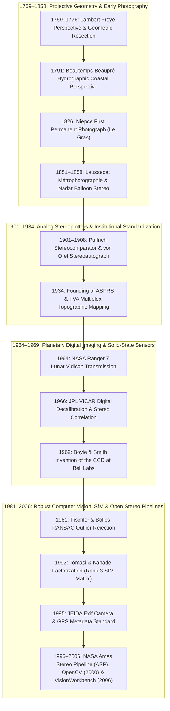

## 8.3 Historical Evolution (`gis-history` Context)

Long before active laser altimeters or interferometric synthetic aperture radar orbited the Earth, optical perspective geometry provided the sole rigorous mathematical bridge between two-dimensional images and three-dimensional topographic surfaces. The evolution of photogrammetric Digital Elevation Model (DEM) generation spans more than two and a half centuries—moving from hand-drawn hydrographic perspective sketches and wet-collodion glass plates to opto-mechanical analog plotters, planetary Vidicon television tubes, solid-state Charge-Coupled Devices (CCDs), and modern multi-view computer vision. Tracing the `gis-history` milestones of this lineage reveals that every modern Structure from Motion (SfM) and satellite stereo pipeline rests directly upon 18th-century projective geometry, 1960s planetary image processing, and 1980s–1990s statistical computer vision.



---

### 8.3.1 1759–1776: The Mathematical and Cartographic Beginnings of Photogrammetry

Nearly seventy years before chemical photography existed, the mathematical inverse problem of photogrammetry—reconstructing 3D object coordinates and viewing station geometry from 2D perspective drawings—was solved analytically. In **1759**, the Swiss polymath **Johann Heinrich Lambert** published *Die freye Perspective* (expanded in its second edition in 1774), establishing the laws of inverse perspective, vanishing points, and spatial resection from a single perspective view. Between **1759 and 1776** (`gis-history` milestone: **1776 beginnings of photogrammetry**), European military engineers, geometers (including Gaspard Monge's descriptive geometry school), and hydrographers formalized the projective geometry linking an observer's center of projection $\mathbf{C} = [X_0, Y_0, Z_0]^T$ (in meters, $\text{m}$) to homologous rays intersecting a picture plane at principal distance $f$ ($\text{m}$).

Remarkably, the first operational cartographic deployment of perspective intersection occurred not on land, but at sea. In **1791**, the French hydrographer **Charles-François Beautemps-Beaupré**, sailing aboard Admiral d'Entrecasteaux's expedition in search of La Pérouse, pioneered hydrographic *reconnaissance hydrographique* along the coasts of Tasmania and the Solomon Islands. Using a *chambre claire* (camera lucida) and marine sextant bearings from two or more anchored or sailing ship positions separated by a known baseline $B$ ($\text{m}$), Beautemps-Beaupré sketched calibrated perspective coastal profiles and intersected horizontal and vertical angles $(\alpha_j, \beta_j)$ to chart coastal headlands, reefs, and shoals without setting foot ashore. Given two perspective views from ship stations $\mathbf{C}_1, \mathbf{C}_2$ separated by baseline $B$, the horizontal slant range $R_1$ ($\text{m}$) along station 1's line of sight, the perpendicular planimetric distance $Y$ ($\text{m}$) from the baseline, and the elevation $z$ ($\text{m}$, positive-up above sea level) of a coastal peak were recovered via graphical ray intersection:

$$R_1 = B \frac{\sin\alpha_2}{\sin(\alpha_1 + \alpha_2)}, \qquad Y = R_1 \sin\alpha_1 = B \frac{\sin\alpha_1 \sin\alpha_2}{\sin(\alpha_1 + \alpha_2)}, \qquad z = Y \frac{y_1}{f} + Z_{0,1}$$

where $\alpha_1, \alpha_2$ are the horizontal interior baseline angles ($\text{rad}$), $y_1$ is the vertical offset of the peak on a calibrated perspective sketch plane oriented parallel to the baseline at principal drawing distance $f$ ($\text{m}$) (or $z = R_1 (y_1 / f) + Z_{0,1}$ when the sketch plane is oriented normal to the viewing ray $R_1$), and $Z_{0,1}$ is the deck eye height above the instantaneous sea surface ($\text{m}$). This marine workflow established the foundational geometry of multi-view intersection long before the invention of photographic emulsions.

---

### 8.3.2 1826–1934: From Niépce and Nadar to Analog Stereoplotters and ASPRS

The transition from manual perspective sketching to physical light recording began in **1826** (or 1827) (`gis-history` milestone: **1826 first permanent camera photograph**), when French inventor **Nicéphore Niépce** captured *View from the Window at Le Gras* at Saint-Loup-de-Varennes using a camera obscura and a pewter plate coated with bitumen of Judea (*heliography*), requiring an exposure lasting roughly eight hours. Following Louis Daguerre's announcement of the daguerreotype in **1839**—immediately recognized by physicist François Arago before the French Chamber of Deputies for its potential to automate topographic surveying—and Frederick Scott Archer's **1851** wet-collodion glass plate process, photographic exposures dropped from hours to seconds.

Between **1849 and 1859**, Colonel **Aimé Laussedat** of the French Army Corps of Engineers—universally recognized as the "Father of Photogrammetry"—replaced the camera lucida with a precision terrestrial survey camera mounted on a transit theodolite (*phototheodolite*). Calling his discipline *métrophotographie* (1851), Laussedat surveyed the façade of the Hôtel des Invalides and compiled a complete topographic contour map of the village of Buc near Versailles in 1861. Simultaneously, in **1858** (`gis-history` milestone: **1858 Nadar balloon photography**), the French photographer and aeronaut **Gaspard-Félix Tournachon (Nadar)** ascended in a tethered gas balloon 80 m above Petit-Bicêtre (now Petit-Clamart) outside Paris, coating and developing wet-collodion glass plates inside a darkroom tent suspended in the balloon's wicker basket to capture the world's first aerial photograph. In **1867**, the Prussian architectural surveyor **Albrecht Meydenbauer** coined the term *Photogrammetrie* in the *Wochenblatt des Architektenvereins zu Berlin*, recognizing that terrestrial imagery could document both gothic cathedrals and alpine terrain.

Point-by-point graphical intersection from single plates remained painstakingly slow until the turn of the 20th century, when binocular stereopsis was fused with precision mechanics:
1. **Pulfrich's Stereocomparator (1901):** Working at Carl Zeiss in Jena, physicist **Carl Pulfrich** introduced the stereocomparator, allowing an operator to view overlapping glass plates binocularly and measure horizontal x-parallax $p_x = x_L - x_R$ ($\text{mm}$) with micrometer screws.
2. **Von Orel's Stereoautograph (1908):** Austrian Captain **Eduard von Orel**, collaborating with Zeiss, coupled the stereocomparator to a mechanical system of levers (*Parallelogramm von Zeiss*) that continuously solved the terrestrial coplanarity and parallax equations, enabling an operator to guide a "floating mark" (*wandernde Marke*) along a constant elevation $z$ to trace continuous contour lines directly onto a map sheet without discrete point computations.
3. **Aerial Analog Plotters and the 1934 Founding of ASPRS:** Extending continuous plotting from terrestrial horizontal cameras to tilted aerial photographs required full three-dimensional opto-mechanical space rods or optical projection (such as Reinhard Hugershoff's 1921 Autograph, Wild Heerbrugg's autograph series, and the Zeiss Multiplex double-projection anaglyph plotters). In **1934** (`gis-history` milestone: **1934 ASPRS founded**), twelve pioneering photogrammetrists met in Washington, D.C., to found the **American Society of Photogrammetry** (now the American Society for Photogrammetry and Remote Sensing, **ASPRS**), launching *Photogrammetric Engineering* (later *PE&RS*). Immediately partnered with the USGS and the newly created **Tennessee Valley Authority (TVA)**, ASPRS standardized aerial camera calibration certificates, fiducial mark geometry, base-to-height ($B/H$) flight planning, and empirical stereoplotter **C-factors** ($C = H / \text{CI}$, the ratio of flying height $H$ to the minimum reliable contour interval $\text{CI}$, which rose from $C \approx 600\text{--}800$ on 1930s Multiplex projectors to $C \approx 1{,}500\text{--}2{,}500$ on precision optical-mechanical plotters). Under the resulting 1947 U.S. National Map Accuracy Standards (NMAS)—requiring $90\%$ of well-defined points to fall within $\frac{1}{2}\,\text{CI}$ ($\text{LE90} = 1.6449\,\sigma_z \le 0.5\,\text{CI} \implies \sigma_z \approx 0.304\,\text{CI} = \frac{0.304\,H}{C}$)—this empirical C-factor directly prefigured the modern **ASPRS Positional Accuracy Standards for Digital Geospatial Data** ($\text{RMSE}_z$ and Non-Vegetated Vertical Accuracy $\text{NVA} = 1.9600 \times \text{RMSE}_z$).

In the hydrographic and underwater realm, optical bathymetric mapping advanced in parallel. During World War II, shoreline wave-refraction and two-media aerial photogrammetry were developed to estimate nearshore depth $d$ ($\text{m}$, positive-down), while in **1951–1953** **Dimitri Rebikoff** and optical physicist **Alexandre Ivanoff** invented the corrective water-contact lens port, eliminating refractive radial pincushion distortion and chromatic aberration across flat underwater camera housings and enabling metric deep-sea stereophotogrammetry (famously deployed in the 1963 search for the nuclear submarine USS *Thresher* at $d \approx 2{,}560\text{ m}$).

---

### 8.3.3 1964–1969: Planetary Exploration (`Ranger 7`), JPL `VICAR`, and the CCD Revolution

While terrestrial mapping agencies relied on large-format $230 \times 230\text{ mm}$ ($9 \times 9\text{ in}$) aerial film cameras through the 1970s, the Space Race forced an abrupt transition from physical film to digital image transmission and computational stereogrammetry. Film could not be physically returned from deep space missions to the Moon or Mars.

On **July 31, 1964** (`gis-history` milestone: **1964 Ranger 7**), NASA's ***Ranger 7*** spacecraft transmitted 4,308 close-up television frames of the lunar surface (subsequently named *Mare Cognitum*, the "Known Sea") before impacting the Moon, achieving a final ground resolution of $0.5\text{ m}$—improving upon Earth-based telescopic lunar maps by three orders of magnitude. *Ranger 7* (followed by *Ranger 8* and *9*, and the **1965 *Mariner 4*** Mars flyby) used **Vidicon** electron-beam television tubes. Unlike metric film cameras, Vidicon tubes suffered from severe, time-varying geometric electron-beam deflection distortions, non-linear radiometric response, and coherent electronic transmission noise.

To turn distorted planetary Vidicon scans into metric topographic products and lunar landing-site DEMs for the Apollo program, **Robert Nathan** and colleagues at NASA's Jet Propulsion Laboratory (JPL) created **`VICAR` (Video Image Communication and Retrieval)** in **1966** (`gis-history` milestone: **1966 JPL VICAR**) on an IBM 360 mainframe. `VICAR` pioneered virtually every foundational operation of modern digital photogrammetry and remote sensing:
- **Geometric Reseau Decalibration:** Sub-pixel detection of a permanent grid of $K$ etched fiducial **reseau marks** on the Vidicon faceplate with known calibrated coordinates $(x_k^{\text{cal}}, y_k^{\text{cal}})$ ($\text{mm}$) against measured scan coordinates $(u_k, v_k)$ (pixels) to fit bivariate polynomial warp fields that removed electron-beam geometric distortion prior to stereo matching:

$$x^{\text{cal}}(u, v) = \sum_{m=0}^{M} \sum_{n=0}^{M-m} a_{mn} u^m v^n, \qquad y^{\text{cal}}(u, v) = \sum_{m=0}^{M} \sum_{n=0}^{M-m} b_{mn} u^m v^n$$

- **Radiometric Decalibration & Point-Spread Deconvolution:** Pixel-by-pixel flat-field dark-current subtraction, non-linear gain lookup tables, and 2D Fourier/spatial-domain modulation transfer function (MTF) restoration.
- **Digital Area-Based Stereo Correlation:** Automated normalized cross-correlation (NCC) of image patches across overlapping *Ranger*, *Surveyor*, and *Lunar Orbiter* digital scans to compute disparity maps and digital terrain matrices without human stereoplotter operators.

Three years later, on **October 17, 1969** (`gis-history` milestone: **1969 CCD invented**), **Willard S. Boyle** and **George E. Smith** at Bell Telephone Laboratories invented the **Charge-Coupled Device (CCD)**—an achievement later recognized with the 2009 Nobel Prize in Physics. By shifting photo-generated electron packets across a monolithic silicon metal-oxide-semiconductor (MOS) capacitor array, the CCD eliminated both the fragile vacuum electron beam of the Vidicon tube and the hygroscopic/thermal warpage of celluloid film. Because CCD pixel centers are photolithographically etched onto rigid crystalline silicon with sub-micrometer geometric stability ($\sigma_{\text{pixel}} < 0.1\,\mu\text{m}$), solid-state linear pushbroom arrays (beginning with SPOT-1 in 1986 and airborne ADS sensors) and 2D focal-plane arrays permanently eliminated the need for internal fiducial marks and reseau grids, transforming every digital camera into a stable metric grid once interior lens distortion is calibrated.

---

### 8.3.4 1981–1995: `RANSAC`, Tomasi–Kanade Factorization, and the `Exif` Revolution

As solid-state digital imagery proliferated in the 1980s and 1990s, the photogrammetric community and the emerging computer vision community converged on a central challenge: how to automatically recover camera poses and 3D surface structure from uncalibrated, unordered image collections contaminated by gross feature-matching blunders. Three `gis-history` milestones solved this problem:

#### 1. 1981: Fischler & Bolles' `RANSAC` (Random Sample Consensus)
Classical photogrammetric bundle adjustment (formalized by Duane Brown in the late 1950s) relied on least-squares estimation, which breaks down catastrophically when even a single tie point is a gross mismatch (outlier). In **1981** (`gis-history` milestone: **1981 RANSAC**), **Martin A. Fischler** and **Robert C. Bolles** at SRI International published their seminal paper in *Communications of the ACM* introducing **RANSAC (Random Sample Consensus)** directly in the context of automated cartography and the photogrammetric *Location Determination Problem* (camera spatial resection). Rather than fitting a model to all data points and pruning high-residual observations, RANSAC repeatedly draws the minimal sample size $s$ required to instantiate a geometric hypothesis (e.g., $s = 3$ points for P3P spatial resection, $s = 5$ for the calibrated Essential matrix $\mathbf{E}$, or $s = 7\text{--}8$ for the uncalibrated Fundamental matrix $\mathbf{F}$) and scores the hypothesis by counting how many remaining correspondences fall within an inlier reprojection threshold $\tau$ (in pixels).

If the true fraction of inliers in a putative feature match set is $w \in (0, 1]$, the probability that a single random draw of $s$ correspondences consists purely of true inliers is $w^s$. The minimum number of trials $N$ required to guarantee with confidence probability $p$ (typically $p = 0.99$ or $0.999$) that at least one outlier-free minimal sample is drawn is:

$$1 - (1 - w^s)^N \ge p \implies N = \left\lceil \frac{\ln(1 - p)}{\ln(1 - w^s)} \right\rceil$$

##### Worked Numerical Example (RANSAC Iteration Budget & Minimal-Sample Scaling)
Suppose an automated feature matcher (such as SIFT) pairs two overlapping UAV frames over a repetitive forest canopy, yielding an inlier ratio of only $w = 0.50$ ($50\%$ gross outliers). To estimate the **calibrated Essential matrix** ($s = 5$ point correspondences) with confidence $p = 0.999$:

$$N_{s=5} = \left\lceil \frac{\ln(1 - 0.999)}{\ln(1 - 0.50^5)} \right\rceil = \left\lceil \frac{\ln(0.001)}{\ln(1 - 0.03125)} \right\rceil = \left\lceil \frac{-6.9078}{-0.03175} \right\rceil = 218 \text{ iterations}$$

Whereas classical least squares fails completely under $50\%$ corruption, 218 fast minimal-solver evaluations in RANSAC isolate the true epipolar geometry in milliseconds. By contrast, if camera intrinsics are unknown and the **uncalibrated 8-point Fundamental matrix** solver ($s = 8$) is used at $w = 0.50$, the required budget rises to $N_{s=8} = \lceil \ln(0.001) / \ln(1 - 0.50^8) \rceil = 1{,}765$ iterations; under severe outlier contamination ($w = 0.20$ over glint-corrupted coastal water), $s = 5$ requires $21{,}584$ trials whereas $s = 8$ explodes to $2{,}698{,}339$ trials. Furthermore, if a minimal sample is inadvertently drawn from a **degenerate geometric configuration**—such as coplanar terrain points when estimating $\mathbf{F}$ without calibration—the hypothesis fits the coplanar points with zero residual while yielding an erroneous epipolar geometry for off-plane relief, necessitating degeneracy-aware variants (such as DEGENSAC) or prior `Exif` focal-length initialization.

#### 2. 1992: Tomasi & Kanade's Factorization Method for Structure from Motion
In **November 1992** (`gis-history` milestone: **1992 Tomasi & Kanade *Shape and Motion from Image Streams***), **Carlo Tomasi** and **Takeo Kanade** at Carnegie Mellon University published *Shape and Motion from Image Streams under Orthography: A Factorization Method* in the *International Journal of Computer Vision*. Prior to Tomasi and Kanade, multi-frame 3D reconstruction suffered from noise amplification across short baselines and required fragile frame-to-frame chaining. Tomasi and Kanade proved a profound geometric theorem: if $P$ 3D surface points $\mathbf{X}_p = [X_p, Y_p, Z_p]^T$ ($\text{m}$, centered at their centroid $\bar{\mathbf{X}} = \mathbf{0}$) are tracked across $F$ image frames with centroid-registered 2D image coordinates $(\tilde{u}_{fp}, \tilde{v}_{fp}) = (u_{fp} - \bar{u}_f, v_{fp} - \bar{v}_f)$ (in pixels or $\text{m}$), stacking all $2F$ coordinates across all $P$ points forms a registered **measurement matrix** $\tilde{\mathbf{W}} \in \mathbb{R}^{2F \times P}$ that factors directly into a camera motion matrix $\mathbf{R} \in \mathbb{R}^{2F \times 3}$ and a 3D surface shape matrix $\mathbf{S} \in \mathbb{R}^{3 \times P}$:

$$\tilde{\mathbf{W}}_{2F \times P} = \begin{bmatrix} \tilde{u}_{1,1} & \cdots & \tilde{u}_{1,P} \\ \vdots & \ddots & \vdots \\ \tilde{u}_{F,1} & \cdots & \tilde{u}_{F,P} \\ \tilde{v}_{1,1} & \cdots & \tilde{v}_{1,P} \\ \vdots & \ddots & \vdots \\ \tilde{v}_{F,1} & \cdots & \tilde{v}_{F,P} \end{bmatrix} = \underbrace{\begin{bmatrix} \mathbf{i}_1^T \\ \vdots \\ \mathbf{i}_F^T \\ \mathbf{j}_1^T \\ \vdots \\ \mathbf{j}_F^T \end{bmatrix}}_{\mathbf{R}_{2F \times 3}} \underbrace{\begin{bmatrix} \mathbf{X}_1 & \cdots & \mathbf{X}_P \end{bmatrix}}_{\mathbf{S}_{3 \times P}}$$

where $\mathbf{i}_f, \mathbf{j}_f \in \mathbb{R}^3$ are the orthonormal row vectors of camera $f$'s orientation. Because $\tilde{\mathbf{W}}$ is the product of a $2F \times 3$ matrix and a $3 \times P$ matrix, **$\operatorname{rank}(\tilde{\mathbf{W}}) \le 3$ in the absence of noise!** Computing the Singular Value Decomposition $\tilde{\mathbf{W}} = \mathbf{U}\boldsymbol{\Sigma}\mathbf{V}^T$ and retaining the top three singular values $\boldsymbol{\Sigma}_3 = \operatorname{diag}(\sigma_1, \sigma_2, \sigma_3)$ yields an initial affine factorization $\hat{\mathbf{R}} = \mathbf{U}_3 \boldsymbol{\Sigma}_3^{1/2}$ and $\hat{\mathbf{S}} = \boldsymbol{\Sigma}_3^{1/2} \mathbf{V}_3^T$. Upgrading this affine reconstruction to Euclidean 3D terrain coordinates requires finding an invertible $3 \times 3$ metric upgrade matrix $\mathbf{Q} \in \text{GL}(3)$ such that $\mathbf{R} = \hat{\mathbf{R}}\mathbf{Q}$ and $\mathbf{S} = \mathbf{Q}^{-1}\hat{\mathbf{S}}$ satisfy the camera row orthonormality constraints across all $f = 1, \dots, F$:

$$\hat{\mathbf{i}}_f^T (\mathbf{Q}\mathbf{Q}^T) \hat{\mathbf{i}}_f = 1, \qquad \hat{\mathbf{j}}_f^T (\mathbf{Q}\mathbf{Q}^T) \hat{\mathbf{j}}_f = 1, \qquad \hat{\mathbf{i}}_f^T (\mathbf{Q}\mathbf{Q}^T) \hat{\mathbf{j}}_f = 0$$

which is linear in the six unique entries of the symmetric positive-definite matrix $\mathbf{L} = \mathbf{Q}\mathbf{Q}^T$ (recovered via Cholesky decomposition, provided the scene relief is non-coplanar so that $\sigma_3 > 0$ and camera rotations span at least two independent axes). Tomasi and Kanade's factorization demonstrated that global 3D structure and camera motion can be extracted simultaneously across hundreds of frames without prior camera calibration, catalyzing the modern Structure from Motion (SfM) paradigm later extended to perspective cameras and Sparse Bundle Adjustment (SBA):

```python
import numpy as np

def tomasi_kanade_factorization(W: np.ndarray) -> tuple[np.ndarray, np.ndarray]:
    """
    Tomasi & Kanade (1992) Rank-3 SVD Factorization and Euclidean metric upgrade
    of a 2F x P measurement matrix W.
    Rows 0..F-1 are u-coordinates; rows F..2F-1 are v-coordinates across P 3D points.
    """
    F = W.shape[0] // 2
    # 1. Subtract frame centroids to form registered measurement matrix W_tilde
    W_tilde = W - np.mean(W, axis=1, keepdims=True)
    # 2. Compute SVD and truncate to Rank 3 (affine motion R_hat and shape S_hat)
    U, sigma, Vt = np.linalg.svd(W_tilde, full_matrices=False)
    sqrt_sigma3 = np.diag(np.sqrt(sigma[:3]))
    R_hat = U[:, :3] @ sqrt_sigma3        # 2F x 3 affine motion matrix
    S_hat = sqrt_sigma3 @ Vt[:3, :]       # 3 x P affine 3D terrain shape matrix

    # 3. Metric upgrade: solve linear system for symmetric L = Q @ Q.T
    def sym_basis(a: np.ndarray, b: np.ndarray) -> list[float]:
        return [
            a[0] * b[0],
            a[0] * b[1] + a[1] * b[0],
            a[0] * b[2] + a[2] * b[0],
            a[1] * b[1],
            a[1] * b[2] + a[2] * b[1],
            a[2] * b[2],
        ]

    G_rows, c_vals = [], []
    for f in range(F):
        i_hat, j_hat = R_hat[f, :], R_hat[f + F, :]
        G_rows.extend([sym_basis(i_hat, i_hat), sym_basis(j_hat, j_hat), sym_basis(i_hat, j_hat)])
        c_vals.extend([1.0, 1.0, 0.0])

    l_vec, *_ = np.linalg.lstsq(np.asarray(G_rows), np.asarray(c_vals), rcond=None)
    L = np.array([
        [l_vec[0], l_vec[1], l_vec[2]],
        [l_vec[1], l_vec[3], l_vec[4]],
        [l_vec[2], l_vec[4], l_vec[5]],
    ])
    Q = np.linalg.cholesky(L)
    R_metric = R_hat @ Q                  # 2F x 3 Euclidean camera rotation rows
    S_metric = np.linalg.solve(Q, S_hat)  # 3 x P Euclidean 3D coordinates (up to global rotation)
    return R_metric, S_metric
```

#### 3. 1995: The `Exif` Metadata Standard
In **October 1995** (`gis-history` milestone: **1995 Exif**), the **Japan Electronic Industry Development Association (JEIDA)** released the **Exchangeable image file format (`Exif`)** standard (version 1.0 in 1995, version 2.1 in 1998). By embedding structured TIFF metadata tags directly inside JPEG and TIFF headers—specifically camera make/model (`Exif.Image.Make`, `Exif.Image.Model`), nominal focal length (`Exif.Photo.FocalLength`, in $\text{mm}$), 35-mm equivalent focal length, exposure timestamp, and standardized GNSS receiver coordinates and altitude (`Exif.GPSInfo.GPSLatitude`, `GPSLongitude`, `GPSAltitude`)—`Exif` enabled automated SfM pipelines (such as Bundler, COLMAP, OpenDroneMap, and Metashape) to automatically look up sensor pixel pitch, initialize intrinsic calibration matrices $\mathbf{K}$, and restrict feature matching to spatially adjacent images via GPS priors.

---

### 8.3.5 1996–2006: NASA Ames Stereo Pipeline (`ASP`), `OpenCV`, and `VisionWorkbench`

The final link uniting rigorous planetary photogrammetry with open-source computer vision emerged between 1996 and 2006:

- **1996: Origins of the NASA Ames Stereo Pipeline (`ASP`)** (`gis-history` milestone: **1996 NASA Ames Stereo Pipeline (ASP)**). Beginning in **1996** within the Intelligent Robotics Group (IRG) at NASA Ames Research Center (founded by Laurence Edwards, Michael Sims, Carol Stoker, and later led by Ross Beyer, Zack Moratto, Ara Nefian, and Oleg Alexandrov), NASA engineers built automated stereo correlation and terrain reconstruction software to process stereo imagery from the **1997 *Mars Pathfinder* IMP lander/Sojourner rover** and the **1997 *Mars Global Surveyor* (MGS) Mars Orbiter Camera (MOC)**. Unlike consumer SfM tools restricted to pinhole frame cameras, the Ames pipeline natively modeled planetary orbital ephemerides (SPICE kernels), USGS ISIS camera models, and linear pushbroom scanners.
- **2000: Intel `OpenCV` (Open Source Computer Vision Library)** (`gis-history` milestone: **2000 OpenCV**). Initiated by **Gary Bradski** at Intel Research in 1999 and publicly released in **June 2000** at CVPR, `OpenCV` democratized real-time C/C++ implementations of Zhang's (2000) checkerboard camera calibration, Brown-Conrady radial/tangential lens undistortion (`cv::undistort`), epipolar rectification (`cv::stereoRectify`), and Hirschmüller's Semi-Global Block Matching (`cv::StereoSGBM`).
- **2006: NASA `VisionWorkbench` (`VW`)** (`gis-history` milestone: **2006 VisionWorkbench**). In **2006**, NASA Ames re-architected its planetary stereo codebase into **`VisionWorkbench` (`VW`)**—a modular C++ template library for arbitrary-dimension, multi-threaded, tile-streamed image processing and bundle adjustment—which serves as the computational engine beneath the open-source **NASA Ames Stereo Pipeline (`ASP`)**. Today, `ASP` (`parallel_stereo`, `bundle_adjust`, `point2dem`, `pc_align`, and `dem_mosaic`) is the gold-standard open-source stereogrammetric suite across both planetary science (HiRISE, CTX, LROC) and terrestrial glaciology/geomorphology (WorldView/Pléiades RPC stereo, declassified KH-4 Corona and KH-9 Hexagon panoramic spy-satellite film recovery, and historic aerial archival DEM reconstruction):

```bash
# Modern NASA Ames Stereo Pipeline (ASP) workflow built on VisionWorkbench (2006)
# 1. Jointly refine satellite pushbroom RPC / pinhole camera poses against a reference DEM
bundle_adjust img_left.tif img_right.tif img_left.xml img_right.xml \
    --mapprojected-data "img_left_map.tif img_right_map.tif ref_lidar_dem.tif" \
    -o ba_run/out

# 2. Multi-threaded tile-streamed MGM/SGM dense stereo correlation in VisionWorkbench/ASP
parallel_stereo img_left.tif img_right.tif img_left.xml img_right.xml \
    --bundle-adjust-prefix ba_run/out \
    --stereo-algorithm asp_mgm --subpixel-mode 9 \
    stereo_out/run

# 3. Gridding 3D triangulated point cloud to an ellipsoid-referenced GeoTIFF DEM + error map
point2dem stereo_out/run-PC.tif --tr 1.0 --t_srs EPSG:32610 --errorimage
```

| Historical Era | `gis-history` Milestones | Primary Sensor & Recording Medium | Orientation & 3D Reconstruction Math | Typical Vertical Error ($\sigma_z / H$) |
| :--- | :--- | :--- | :--- | :--- |
| **Pre-Photographic** (1759–1825) | **1776** Photogrammetry beginnings; Lambert (1759); Beautemps-Beaupré (1791) | Camera lucida & marine sextant sketches on paper | Graphical inverse perspective & coastal horizontal/vertical angle intersection | $\sim 10^{-2}$ (1% of range) |
| **Analog Plate & Film** (1826–1963) | **1826** Niépce photograph; **1858** Nadar balloon; **1934** ASPRS founded | Wet-collodion glass plates $\rightarrow$ $230\text{ mm}$ roll film with fiducial marks | Opto-mechanical coplanarity levers & double-projection anaglyph space rods | $10^{-3}$ to $1.5 \times 10^{-4}$ ($H/1{,}000$ to $H/6{,}500$) |
| **Early Digital & Planetary** (1964–1980) | **1964** *Ranger 7*; **1966** JPL `VICAR`; **1969** CCD invented | Vidicon electron-beam tubes with reseau marks $\rightarrow$ early silicon CCD arrays | Polynomial reseau warp decalibration + 2D normalized cross-correlation (NCC) | $5 \times 10^{-4}$ to $10^{-4}$ |
| **Computer Vision & Modern Stereo** (1981–Present) | **1981** `RANSAC`; **1992** Tomasi & Kanade; **1995** `Exif`; **1996** `ASP`; **2000** `OpenCV`; **2006** `VisionWorkbench` | Rigid CMOS/CCD frame arrays, satellite pushbroom TDI scanners, ROV dome ports | RANSAC minimal solvers + SVD factorization + Sparse Bundle Adjustment + SGM/MGM | $10^{-4}$ to $2 \times 10^{-5}$ ($\sim 0.1\text{--}0.3\text{ GSD}$) |

> [!WARNING]
> **Common Pitfall: Treating Historical Archival Film Scans as Digital CCD Frame Imagery**
> When reconstructing historical time-series DEMs from scanned 1930s–1980s aerial photographs or declassified KH-9 Hexagon film using modern SfM software (designed around post-1969 rigid CCD/CMOS sensors and 1995 `Exif` tags), practitioners frequently skip **interior orientation fiducial/reseau registration** (`VICAR` / `ASP` historical camera workflow). Because desktop scanners introduce non-uniform transport jitter and historical film undergoes anisotropic shrinkage of $0.05\%\text{--}0.3\%$, feeding raw scanned pixels directly into a standard pinhole SfM bundle adjustment aliases film warpage into the exterior orientation, inducing multi-meter vertical domes and warps across the resulting historical DEM. Always perform an affine or thin-plate-spline transformation onto the calibrated camera fiducial marks (or Vidicon/KH-9 reseau crosses) before stereo matching.

> [!IMPORTANT]
> **Key Takeaways**
> 1. **Projective Geometry Preceded Photography (1759–1791):** Lambert's *Freye Perspective* (1759) and Beautemps-Beaupré's 1791 hydrographic coastal perspective intersections established the mathematical equations of spatial resection and multi-view triangulation decades before Niépce's 1826 photograph and Nadar's 1858 aerial photography.
> 2. **Planetary Exploration Drove Digital Photogrammetry (1964–1969):** Because *Ranger 7* (1964) could not return physical film from the Moon, JPL's `VICAR` (1966) invented digital reseau geometric decalibration, radiometric restoration, and automated stereo image correlation—techniques later freed from vacuum-tube distortions by Boyle and Smith's 1969 invention of the silicon CCD.
> 3. **Modern SfM Fuses Robust Statistics with Projective Linear Algebra (1981–2006):** The combination of Fischler and Bolles' `RANSAC` (1981) for outlier immunity, Tomasi and Kanade's rank-3 measurement matrix factorization (1992), `Exif` metadata standardization (1995), and open-source engines (`ASP` 1996, `OpenCV` 2000, `VisionWorkbench` 2006) transformed photogrammetry from a manual opto-mechanical craft into an automated, planetary-scale computational science.

---

### References

- American Society for Photogrammetry and Remote Sensing (ASPRS). (2023). *ASPRS Positional Accuracy Standards for Digital Geospatial Data* (Edition 2, Version 1.0). Bethesda, MD: ASPRS.
- Beautemps-Beaupré, C.-F. (1808). Appendice contenant l'exposé des méthodes pour lever et construire les cartes et plans hydrographiques. In *Voyage de Dentrecasteaux, envoyé à la recherche de La Pérouse* (Vol. 1, pp. 593–668). Paris: Imprimerie Impériale.
- Beyer, R. A., Alexandrov, O., & McMichael, S. (2018). The Ames Stereo Pipeline: NASA's open source software for deriving and processing terrain data. *Earth and Space Science*, 5(9), 537–548. https://doi.org/10.1029/2018EA000409
- Boyle, W. S., & Smith, G. E. (1970). Charge coupled semiconductor devices. *Bell System Technical Journal*, 49(4), 587–593. https://doi.org/10.1002/j.1538-7305.1970.tb01790.x
- Bradski, G. (2000). The OpenCV Library. *Dr. Dobb's Journal of Software Tools*, 25(11), 120–125.
- Fischler, M. A., & Bolles, R. C. (1981). Random sample consensus: A paradigm for model fitting with applications to image analysis and automated cartography. *Communications of the ACM*, 24(6), 381–395. https://doi.org/10.1145/358669.358692
- Japan Electronic Industry Development Association (JEIDA). (1995). *Digital Still Camera Image File Format Standard (Exchangeable image file format for Digital Still Camera: Exif), Version 1.0* (JEIDA-49-1995; revised Version 2.1, JEIDA-49-1998). Tokyo: JEIDA.
- Lambert, J. H. (1759). *Die freye Perspective, oder Anweisung, jeden perspektivischen Aufriß von freyen Stücken und ohne Grundriß zu verfertigen*. Zürich: Heidegger und Compagnie.
- Laussedat, A. (1898–1903). *Recherches sur les instruments, les méthodes et le dessin topographiques* (Vols. 1–2). Paris: Gauthier-Villars.
- Moratto, Z. M., Broxton, M. J., Beyer, R. A., Lundy, M., & Husmann, K. (2010). Ames Stereo Pipeline, NASA's open source automated stereogrammetry software. In *Proceedings of the 41st Lunar and Planetary Science Conference* (Abstract #2364). Lunar and Planetary Institute.
- Nathan, R. (1966). *Digital Video-Data Handling: Mars, The Moon, and Beyond* (JPL Technical Report No. 32-877). Pasadena, CA: Jet Propulsion Laboratory, California Institute of Technology.
- Pulfrich, C. (1902). Über neuere Anwendungen der Stereoskopie und über einen hierfür bestimmten Stereo-Komparator. *Zeitschrift für Instrumentenkunde*, 22, 65–81.
- Rebikoff, D., & Cherney, P. (1965). *A Guide to Underwater Photography*. New York: Amphoto.
- Tomasi, C., & Kanade, T. (1992). Shape and motion from image streams under orthography: A factorization method. *International Journal of Computer Vision*, 9(2), 137–154. https://doi.org/10.1007/BF00129684
