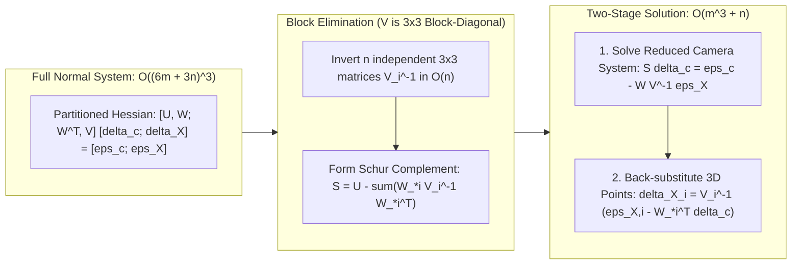

## 8.4 Mathematical Foundations

Reconstructing a rigorously georeferenced Digital Elevation Model (DEM) or bathymetric surface from overlapping optical imagery requires propagating photons backward from a discrete 2D detector array through a non-ideal optical system, across refractive media boundaries, and into a 3D terrestrial or marine coordinate reference frame. Unlike active ranging sensors (Chapters 9–11), which directly measure round-trip signal propagation time or phase, passive optical photogrammetry is purely angular: depth and elevation are recovered exclusively through the intersection of rays from spatially separated perspective centers. Consequently, every millimeter of unmodeled focal plane distortion, sub-pixel stereo correspondence noise, or air–water refractive bending translates directly—and nonlinearly—into systematic terrain deformation or random vertical variance.

This section establishes the complete mathematical framework governing photogrammetric DEM generation:
1. The central perspective **collinearity equations** coupled with the **Brown-Conrady lens distortion model**.
2. The **Robust Sparse Bundle Adjustment (SBA)** functional model, analytic Jacobian structure, and the **Schur complement** normal equations that make million-point triangulations computationally tractable.
3. First-order **epipolar parallax error propagation** ($\sigma_z$, $\sigma_{xy}$) and the analytical derivation showing how uncalibrated radial distortion ($\delta k_1$) couples with nadir viewing geometry to produce paraboloidal DEM **doming**.
4. Exact 3D vector **Snell's law refractive ray-tracing** for two-media (through-water and underwater flat-port) bathymetric photogrammetry.

---

### 8.4.1 Central Perspective Collinearity Equations and Brown-Conrady Distortion

Consider a 3D object point $i$ with coordinates $\mathbf{X}_i = [X_i, Y_i, Z_i]^T$ (in meters) in a right-handed local tangent plane or geocentric Cartesian frame (e.g., East-North-Up, where $Z_i$ is elevation positive-up), observed by camera view $j$ with perspective center $\mathbf{C}_j = [X_{c,j}, Y_{c,j}, Z_{c,j}]^T$ (in meters) and orthogonal rotation matrix $\mathbf{R}_j \in \text{SO}(3)$ mapping world vectors into the camera coordinate frame. 

In the **computer vision convention** (adopted by OpenCV, COLMAP, and PROJ-compatible modern pipelines), the camera coordinate axes are defined with $+X_c$ pointing right along the sensor rows, $+Y_c$ pointing down along the sensor columns, and the optical axis $+Z_c$ pointing forward from the perspective center toward the scene. The 3D coordinates of point $i$ in the $j$-th camera frame are:

$$
\mathbf{X}_{c,ij} = \begin{bmatrix} X_{c,ij} \\ Y_{c,ij} \\ Z_{c,ij} \end{bmatrix} = \mathbf{R}_j (\mathbf{X}_i - \mathbf{C}_j) = \mathbf{R}_j \mathbf{X}_i + \mathbf{t}_j
$$

where $\mathbf{t}_j = -\mathbf{R}_j \mathbf{C}_j \in \mathbb{R}^3$ is the translation vector, and the rotation matrix components are written row-wise as $\mathbf{R}_j = [\mathbf{r}_{1,j}^T; \, \mathbf{r}_{2,j}^T; \, \mathbf{r}_{3,j}^T]$. (In classical aerial photogrammetry, where $+z_c$ points upward away from the ground and the image plane lies at $z_c = -f$, the signs of the numerator and denominator are negated; both conventions yield identical projective ratios once consistent axes are maintained.)

Dividing by the depth $Z_{c,ij} > 0$ along the optical axis projects the 3D ray onto the **normalized (undistorted) image plane** at $Z_c = 1$ (dimensionless tangent of the off-axis ray angle):

$$
x'_{ij} = \frac{X_{c,ij}}{Z_{c,ij}} = \frac{r_{11,j}(X_i - X_{c,j}) + r_{12,j}(Y_i - Y_{c,j}) + r_{13,j}(Z_i - Z_{c,j})}{r_{31,j}(X_i - X_{c,j}) + r_{32,j}(Y_i - Y_{c,j}) + r_{33,j}(Z_i - Z_{c,j})}
$$

$$
y'_{ij} = \frac{Y_{c,ij}}{Z_{c,ij}} = \frac{r_{21,j}(X_i - X_{c,j}) + r_{22,j}(Y_i - Y_{c,j}) + r_{23,j}(Z_i - Z_{c,j})}{r_{31,j}(X_i - X_{c,j}) + r_{32,j}(Y_i - Y_{c,j}) + r_{33,j}(Z_i - Z_{c,j})}
$$

Real multi-element lenses deviate from an ideal pinhole projection due to **symmetrical radial distortion** (off-axis refraction variations across spherical lens surfaces) and **decentering (tangential) distortion** (imperfect alignment of the optical centers of individual lens elements, formulated by Conrady in 1919 and Brown in 1966). Let $r^2 = (x'_{ij})^2 + (y'_{ij})^2$ be the squared radial distance on the normalized image plane. The **Brown-Conrady distortion mapping** transforms $(x'_{ij}, y'_{ij})$ into distorted normalized coordinates $(x''_{ij}, y''_{ij})$:

$$
\begin{aligned}
x''_{ij} &= x'_{ij} \underbrace{\left(1 + k_1 r^2 + k_2 r^4 + k_3 r^6\right)}_{\text{Radial distortion } D_r(r)} + \underbrace{\left[2 p_1 x'_{ij} y'_{ij} + p_2 \left(r^2 + 2(x'_{ij})^2\right)\right]}_{\text{Tangential distortion } \Delta x_t} \\
y''_{ij} &= y'_{ij} \left(1 + k_1 r^2 + k_2 r^4 + k_3 r^6\right) + \left[p_1 \left(r^2 + 2(y'_{ij})^2\right) + 2 p_2 x'_{ij} y'_{ij}\right]
\end{aligned}
$$

where $k_1, k_2, k_3$ are dimensionless radial distortion coefficients ($k_1 < 0$ produces barrel distortion typical of wide-angle consumer drone lenses; $k_1 > 0$ produces pincushion distortion) and $p_1, p_2$ are dimensionless decentering coefficients. Finally, the **intrinsic calibration matrix** $\mathbf{K}_{\text{int}}$ maps the distorted normalized coordinates to sensor pixel coordinates $\hat{\mathbf{x}}_{ij} = [u_{ij}, v_{ij}]^T$ (in pixels):

$$
\begin{bmatrix} u_{ij} \\ v_{ij} \\ 1 \end{bmatrix} = \mathbf{K}_{\text{int}} \begin{bmatrix} x''_{ij} \\ y''_{ij} \\ 1 \end{bmatrix} = \begin{bmatrix} f_x & s & c_x \\ 0 & f_y & c_y \\ 0 & 0 & 1 \end{bmatrix} \begin{bmatrix} x''_{ij} \\ y''_{ij} \\ 1 \end{bmatrix}
$$

Here $f_x = f / p_x$ and $f_y = f / p_y$ are the effective focal lengths in pixels (for physical focal length $f$ in $\text{mm}$ and detector pitch $p_x, p_y$ in $\text{mm/pixel}$), $(c_x, c_y)$ is the principal point in pixels, and $s$ is the pixel skew parameter ($s = 0$ for modern orthogonal CMOS/CCD arrays). Collecting all interior parameters into the vector $\mathbf{K} = [f_x, f_y, c_x, c_y, k_1, k_2, k_3, p_1, p_2]^T$, the complete forward projection operator is denoted $\hat{\mathbf{x}}_{ij} = \pi(\mathbf{K}, \mathbf{R}_j, \mathbf{t}_j, \mathbf{X}_i)$. (For linear pushbroom satellite scanners such as WorldView or Pléiades where each scanline $v$ has a time-varying exterior orientation, this physical camera model is commonly approximated in vendor metadata by **Rational Polynomial Coefficients (RPCs)**, expressing normalized image coordinates $(u_n, v_n)$ as ratios of cubic polynomials in normalized $(\text{Lon}_n, \text{Lat}_n, h_n)$ comprising 78 rational coefficients per image.)

---

### 8.4.2 Robust Sparse Bundle Adjustment (SBA) and the Schur Complement

When $m$ cameras observe $n$ 3D tie points across overlapping flight strips, errors in initial exterior orientations $(\mathbf{R}_j, \mathbf{t}_j)$, interior camera parameters $\mathbf{K}$, and 3D point coordinates $\mathbf{X}_i$ produce 2D reprojection residuals $\mathbf{e}_{ij} = \mathbf{x}_{ij} - \pi(\mathbf{K}, \mathbf{R}_j, \mathbf{t}_j, \mathbf{X}_i) \in \mathbb{R}^2$, where $\mathbf{x}_{ij}$ is the measured image feature location. Because automated feature matching (e.g., SIFT, SuperPoint) inevitably introduces outlier correspondences even after RANSAC filtering, and because operational workflows integrate airborne GNSS/IMU trajectories ($\tilde{\mathbf{C}}_j^{\text{GNSS}}$) and Ground Control Points ($\tilde{\mathbf{X}}_g^{\text{GCP}}$), modern photogrammetric block adjustment minimizes a **hybrid robust non-linear least-squares objective** (Triggs et al., 2000; Agarwal et al., 2010):

$$
\min_{\{\mathbf{P}_j\}, \{\mathbf{X}_i\}, \mathbf{K}} \sum_{i=1}^{n} \sum_{j \in \mathcal{V}(i)} \rho\!\left( \|\mathbf{x}_{ij} - \pi(\mathbf{K}, \mathbf{R}_j, \mathbf{t}_j, \mathbf{X}_i)\|_{\boldsymbol{\Sigma}_{ij}}^2 \right) + \frac{1}{2}\sum_{j=1}^{m} \|\mathbf{C}_j - \tilde{\mathbf{C}}_j^{\text{GNSS}}\|_{\boldsymbol{\Sigma}_{C_j}}^2 + \frac{1}{2}\sum_{g \in \mathcal{G}} \|\mathbf{X}_g - \tilde{\mathbf{X}}_g^{\text{GCP}}\|_{\boldsymbol{\Sigma}_{\text{GCP},g}}^2
$$

where:
* $\mathcal{V}(i)$ is the subset of cameras in which 3D point $i$ is visible, and $\mathbf{P}_j = (\mathbf{R}_j, \mathbf{t}_j) \in \text{SE}(3)$ represents the 6-DoF pose of camera $j$.
* $\|\mathbf{e}\|_{\boldsymbol{\Sigma}}^2 = \mathbf{e}^T \boldsymbol{\Sigma}^{-1} \mathbf{e}$ is the squared Mahalanobis norm weighted by the inverse measurement covariance matrix ($\boldsymbol{\Sigma}_{ij} = \sigma_{\text{obs}}^2 \mathbf{I}_2$ in $\text{pixels}^2$, $\boldsymbol{\Sigma}_{C_j} \in \mathbb{R}^{3\times 3}$ in $\text{m}^2$, and $\boldsymbol{\Sigma}_{\text{GCP},g} \in \mathbb{R}^{3\times 3}$ in $\text{m}^2$).
* $\rho(s)$ is a sub-quadratic **robust M-estimator loss function** applied to the squared Mahalanobis residual $s = \|\mathbf{e}_{ij}\|_{\boldsymbol{\Sigma}_{ij}}^2$ to downweight gross matching blunders.

| M-Estimator Kernel | Loss Function $\rho(s)$ (where $s = r^2$) | Influence Weight $w(r) = \frac{1}{r}\frac{\partial \rho}{\partial r} = 2\frac{\partial \rho}{\partial s}$ | Outlier Suppression Behavior |
| :--- | :--- | :--- | :--- |
| **L2 (Standard Gauss-Newton)** | $\frac{1}{2} s$ | $1$ | None; a single gross blunder corrupts the entire block. |
| **Huber** (threshold $k$) | $\begin{cases} \frac{1}{2}s & \sqrt{s} \le k \\ k(\sqrt{s} - \frac{1}{2}k) & \sqrt{s} > k \end{cases}$ | $\begin{cases} 1 & |r| \le k \\ k / |r| & |r| > k \end{cases}$ | Convex; bounds linear influence of moderate outliers ($1.5\text{–}3\text{ px}$). |
| **Cauchy (Lorentzian)** | $\frac{c^2}{2} \ln\!\left(1 + \frac{s}{c^2}\right)$ | $\left(1 + \frac{r^2}{c^2}\right)^{-1}$ | Quasi-convex; smoothly suppresses large multi-pixel blunders. |
| **Geman-McClure** | $\frac{s / 2}{1 + s / c^2}$ | $\left(1 + \frac{r^2}{c^2}\right)^{-2}$ | Redescending; rapidly drives extreme outlier weights $w(r) \to 0$. |

#### Linearization, Analytic Jacobians, and the Schur Complement

Let $\boldsymbol{\delta}_c \in \mathbb{R}^{6m + n_K}$ stack all camera pose perturbations $\boldsymbol{\delta}_{P_j} = [\delta \boldsymbol{\omega}_j^T, \delta \mathbf{t}_j^T]^T \in \mathfrak{se}(3)$ (parameterized via left-multiplication on the Lie group $\text{SE}(3)$ so that camera-frame coordinates perturb as $\mathbf{X}_{c,ij} \leftarrow \exp([\delta\boldsymbol{\omega}_j]_\times)\mathbf{X}_{c,ij} + \delta\mathbf{t}_j$, avoiding Euler-angle gimbal lock) together with the shared intrinsic perturbations $\delta \mathbf{K}$, and let $\boldsymbol{\delta}_X \in \mathbb{R}^{3n}$ stack all 3D point perturbations $\delta \mathbf{X}_i \in \mathbb{R}^3$. Taylor-expanding the reprojection residual around the current estimate gives $\mathbf{e}_{ij}(\boldsymbol{\delta}_c, \boldsymbol{\delta}_X) \approx \mathbf{e}_{ij,0} - \mathbf{A}_{ij} \boldsymbol{\delta}_{c,j} - \mathbf{B}_{ij} \delta \mathbf{X}_i$, where the analytic block Jacobians are:

$$
\mathbf{A}_{ij} = \frac{\partial \pi(\mathbf{K}, \mathbf{R}_j, \mathbf{t}_j, \mathbf{X}_i)}{\partial \boldsymbol{\delta}_{c,j}} \in \mathbb{R}^{2 \times (6 + n_K)}, \qquad \mathbf{B}_{ij} = \frac{\partial \pi(\mathbf{K}, \mathbf{R}_j, \mathbf{t}_j, \mathbf{X}_i)}{\partial \mathbf{X}_i} = \frac{\partial \pi}{\partial \mathbf{X}_{c,ij}} \mathbf{R}_j \in \mathbb{R}^{2 \times 3}
$$

For an ideal pinhole camera (or pre-undistorted coordinates), differentiating $\pi$ with respect to the camera-frame vector $\mathbf{X}_{c,ij} = [X_c, Y_c, Z_c]^T$ yields the fundamental $2 \times 3$ perspective Jacobian:

$$
\frac{\partial \pi}{\partial \mathbf{X}_{c,ij}} = \begin{bmatrix} \frac{f_x}{Z_c} & 0 & -\frac{f_x X_c}{Z_c^2} \\ 0 & \frac{f_y}{Z_c} & -\frac{f_y Y_c}{Z_c^2} \end{bmatrix}
$$

while using the Lie algebra cross-product identity $\frac{\partial (\exp([\delta\boldsymbol{\omega}]_\times)\mathbf{X}_c)}{\partial \delta\boldsymbol{\omega}}\big|_{\mathbf{0}} = -[\mathbf{X}_c]_\times$ gives the exact $2 \times 6$ exterior orientation Jacobian with respect to $[\delta\boldsymbol{\omega}_j^T, \delta\mathbf{t}_j^T]^T$:

$$
\frac{\partial \pi}{\partial \boldsymbol{\delta}_{P_j}} = \begin{bmatrix} -\frac{f_x X_c Y_c}{Z_c^2} & f_x\!\left(1 + \frac{X_c^2}{Z_c^2}\right) & -\frac{f_x Y_c}{Z_c} & \frac{f_x}{Z_c} & 0 & -\frac{f_x X_c}{Z_c^2} \\ -f_y\!\left(1 + \frac{Y_c^2}{Z_c^2}\right) & \frac{f_y X_c Y_c}{Z_c^2} & \frac{f_y X_c}{Z_c} & 0 & \frac{f_y}{Z_c} & -\frac{f_y Y_c}{Z_c^2} \end{bmatrix}
$$

Assembling the Iteratively Reweighted Least Squares (IRLS) and Levenberg-Marquardt (LM) damping (damping parameter $\lambda > 0$) across all observations yields the **augmented partitioned normal equations**:

$$
\begin{bmatrix} \mathbf{U} & \mathbf{W} \\ \mathbf{W}^T & \mathbf{V} \end{bmatrix} \begin{bmatrix} \boldsymbol{\delta}_c \\ \boldsymbol{\delta}_X \end{bmatrix} = \begin{bmatrix} \boldsymbol{\epsilon}_c \\ \boldsymbol{\epsilon}_X \end{bmatrix}
$$

where the block submatrices and right-hand-side gradient vectors are accumulated over all valid rays $(i,j)$ with effective robust-weighted information matrix $\widetilde{\mathbf{W}}_{ij} = w_{ij} \boldsymbol{\Sigma}_{ij}^{-1}$:
* $\mathbf{U} = \sum_{i,j} \mathbf{A}_{ij}^T \widetilde{\mathbf{W}}_{ij} \mathbf{A}_{ij} + \mathbf{J}_C^T \boldsymbol{\Sigma}_{C}^{-1} \mathbf{J}_C + \lambda \text{diag}(\mathbf{U}) \in \mathbb{R}^{(6m+n_K) \times (6m+n_K)}$ is the damped camera Hessian block (with $\mathbf{J}_C = \partial \mathbf{C}/\partial \boldsymbol{\delta}_c$).
* $\mathbf{V} = \text{diag}(\mathbf{V}_1, \dots, \mathbf{V}_n) \in \mathbb{R}^{3n \times 3n}$, with $\mathbf{V}_i = \sum_{j \in \mathcal{V}(i)} \mathbf{B}_{ij}^T \widetilde{\mathbf{W}}_{ij} \mathbf{B}_{ij} + \boldsymbol{\Sigma}_{\text{GCP},i}^{-1} + \lambda \text{diag}(\mathbf{V}_i) \in \mathbb{R}^{3 \times 3}$, is strictly **block-diagonal** because 3D tie points do not directly interact with one another.
* $\mathbf{W} \in \mathbb{R}^{(6m+n_K) \times 3n}$, with blocks $\mathbf{W}_{ji} = \mathbf{A}_{ij}^T \widetilde{\mathbf{W}}_{ij} \mathbf{B}_{ij}$, couples camera $j$ to point $i$.
* $\boldsymbol{\epsilon}_c = \sum_{i,j} \mathbf{A}_{ij}^T \widetilde{\mathbf{W}}_{ij} \mathbf{e}_{ij,0} - \mathbf{J}_C^T \boldsymbol{\Sigma}_C^{-1}(\mathbf{C} - \tilde{\mathbf{C}}^{\text{GNSS}})$ and $\boldsymbol{\epsilon}_{X,i} = \sum_{j \in \mathcal{V}(i)} \mathbf{B}_{ij}^T \widetilde{\mathbf{W}}_{ij} \mathbf{e}_{ij,0} - \boldsymbol{\Sigma}_{\text{GCP},i}^{-1}(\mathbf{X}_i - \tilde{\mathbf{X}}_i^{\text{GCP}})$ are the negative gradient vectors.

In a survey of $m = 1{,}000$ images and $n = 10^6$ tie points, inverting the full $(3{,}006{,}000)^2$ Hessian directly requires $\mathcal{O}((6m + 3n)^3)$ operations and is impossible in memory. Instead, multiplying the bottom block row by $\mathbf{W}\mathbf{V}^{-1}$ and subtracting it from the top row eliminates $\boldsymbol{\delta}_X$ via the **Schur complement** $\mathbf{S} = \mathbf{U} - \mathbf{W}\mathbf{V}^{-1}\mathbf{W}^T$:

$$
\underbrace{\left(\mathbf{U} - \sum_{i=1}^{n} \mathbf{W}_{*i} \mathbf{V}_i^{-1} \mathbf{W}_{*i}^T\right)}_{\mathbf{S} \;\in\; \mathbb{R}^{(6m+n_K)\times(6m+n_K)}} \boldsymbol{\delta}_c = \boldsymbol{\epsilon}_c - \sum_{i=1}^{n} \mathbf{W}_{*i} \mathbf{V}_i^{-1} \boldsymbol{\epsilon}_{X,i}
$$

Because each $\mathbf{V}_i$ is a trivial $3 \times 3$ symmetric positive-definite matrix inverted in $\mathcal{O}(1)$ time, forming and solving the **Reduced Camera System** $\mathbf{S}\boldsymbol{\delta}_c = \boldsymbol{\epsilon}_{\text{red}}$ reduces the complexity to $\mathcal{O}(m^3)$ (via sparse Cholesky factorization) or $\mathcal{O}(m)$ per iteration via Preconditioned Conjugate Gradients (PCG). Once $\boldsymbol{\delta}_c$ is obtained, every 3D point update is recovered independently in parallel by back-substitution:

$$
\delta \mathbf{X}_i = \mathbf{V}_i^{-1} \left( \boldsymbol{\epsilon}_{X,i} - \sum_{j \in \mathcal{V}(i)} \mathbf{W}_{ji}^T \boldsymbol{\delta}_{c,j} \right), \qquad i = 1, \dots, n
$$



---

### 8.4.3 Epipolar Parallax Error Propagation and Radial Doming Coupling

#### First-Order Stereo Error Propagation ($\sigma_z$ and $\sigma_{xy}$)

To quantify the random vertical uncertainty (TVU) and horizontal uncertainty (THU) of a photogrammetric DEM, consider the canonical normal (epipolar-rectified) stereo case: two nadir-looking cameras with focal length $f$ (in $\text{m}$ or $\text{mm}$) separated by baseline $B$ (in $\text{m}$) at flying height $H = Z_c$ above a terrain point at $(X, Y, Z_{\text{ground}})$. Let $x_L$ and $x_R$ denote the image coordinates along the baseline direction; the **absolute stereoscopic parallax** (or horizontal disparity $d$ in pixel units, where $p = d \cdot p_{\text{pixel}}$) is:

$$
p = x_L - x_R = f \frac{X}{H} - f \frac{X - B}{H} = \frac{f B}{H} \quad \Longleftrightarrow \quad H = \frac{f B}{p}
$$

Since terrain elevation is $Z = Z_{\text{aircraft}} - H$, differentiating $H$ with respect to the measured parallax $p$ yields the sensitivity of elevation to disparity measurement noise:

$$
\frac{\partial Z}{\partial p} = -\frac{\partial H}{\partial p} = \frac{f B}{p^2} = \frac{f B}{(f B / H)^2} = \frac{H^2}{f B}
$$

Applying the law of propagation of variances for an uncorrelated parallax measurement uncertainty $\sigma_p$ (in meters on the focal plane), and noting that the Ground Sample Distance is $\text{GSD} = \frac{H}{f} p_{\text{pixel}}$ (so that $\frac{H}{f}\sigma_p = \text{GSD}\cdot\sigma_{p,\text{pixels}}$), we obtain the fundamental **photogrammetric vertical error equation**:

$$
\sigma_z = \left|\frac{\partial Z}{\partial p}\right| \sigma_p = \frac{H}{B} \cdot \frac{H}{f} \sigma_p = \left(\frac{H}{B}\right) \cdot \text{GSD} \cdot \sigma_{p,\text{pixels}}
$$

Similarly, since $X = \frac{x_L}{f} H$ and $Y = \frac{y_L}{f} H$, propagating both image coordinate noise $\sigma_x = p_{\text{pixel}}\sigma_{x,\text{pixels}}$ and the induced depth uncertainty $\sigma_H = \sigma_z$ gives the **horizontal planimetric uncertainty** at off-nadir radial distance $R = \sqrt{X^2 + Y^2}$:

$$
\sigma_X = \sqrt{\left(\frac{H}{f}\sigma_x\right)^2 + \left(\frac{X}{H}\sigma_z\right)^2} = \text{GSD} \sqrt{\sigma_{x,\text{pixels}}^2 + \left(\frac{X}{B}\right)^2 \sigma_{p,\text{pixels}}^2}
$$

Thus, directly beneath the flight line ($X \ll B$), horizontal accuracy is governed directly by the GSD ($\sigma_{xy} \approx \text{GSD}\cdot\sigma_{x,\text{pixels}}$), whereas vertical uncertainty is amplified by the inverse base-to-height ratio $(H/B)$.

#### Analytical Proof of the Radial Distortion Doming Effect ($\delta k_1 \leftrightarrow \Delta Z(R)$)

Why do nadir-only UAV blocks processed with self-calibration (`k1` free) and few or no GCPs suffer from meter-scale paraboloidal "doming" or "bowling"? Consider two consecutive nadir cameras along the $X$-axis at $X_{c,1} = -B/2$ and $X_{c,2} = +B/2$ at altitude $H$ viewing a flat horizontal ground plane ($Z = 0$) at ground point $(X, Y)$. Their normalized undistorted image coordinates are:

$$
\mathbf{x}'_1 = \frac{1}{H}\begin{bmatrix} X + B/2 \\ Y \end{bmatrix}, \qquad \mathbf{x}'_2 = \frac{1}{H}\begin{bmatrix} X - B/2 \\ Y \end{bmatrix}
$$

Suppose the self-calibration in Bundle Adjustment converges to a slightly erroneous first-order radial distortion parameter $k_1 + \delta k_1$. This uncalibrated perturbation shifts the normalized image coordinates radially by $\delta \mathbf{x}'_j = \delta k_1 \, r_j^2 \, \mathbf{x}'_j$, where $r_j^2 = \|\mathbf{x}'_j\|^2$. Expanding the $x$-component of the radial shift for both cameras to first order in $B/H$ around the midpoint radial distance $R^2 = X^2 + Y^2$:

$$
\begin{aligned}
\delta x'_1 &= \frac{\delta k_1}{H^3}\left[(X + B/2)^2 + Y^2\right](X + B/2) \approx \frac{\delta k_1}{H^3}\left[ R^2 X + \frac{B}{2}\left(3X^2 + Y^2\right) \right] \\
\delta x'_2 &= \frac{\delta k_1}{H^3}\left[(X - B/2)^2 + Y^2\right](X - B/2) \approx \frac{\delta k_1}{H^3}\left[ R^2 X - \frac{B}{2}\left(3X^2 + Y^2\right) \right]
\end{aligned}
$$

The resulting spurious normalized parallax perturbation $\delta p' = \delta x'_1 - \delta x'_2 = \frac{\delta p}{f}$ between the two views is $\delta p' = \frac{\delta k_1 B}{H^3}\left(3X^2 + Y^2\right)$. When averaged over isotropic multi-strip flight directions (where $\langle X^2 \rangle = \langle Y^2 \rangle = \frac{1}{2}R^2$, so $3X^2 + Y^2 \to 2R^2$), and substituted into the vertical sensitivity relation $\Delta Z = \frac{H^2}{B}\delta p'$, the baseline $B$ cancels out, leaving a **paraboloidal vertical doming error** across the DEM block (proportionally scaling as $\frac{H}{B}\delta p' \propto \frac{H}{B}\delta k_1 R^2$ for fixed disparity-to-base geometry):

$$
\Delta Z(R) \approx \frac{H^2}{B} \left(\frac{2 \, \delta k_1 B}{H^3} R^2\right) = \frac{2 \, \delta k_1}{H} R^2
$$

> [!WARNING]
> **Projective Coupling of $\delta k_1$ and Paraboloidal Terrain Curvature**
> Notice two devastating consequences of $\Delta Z(R) = \frac{2\delta k_1}{H} R^2$:
> 1. **Zero Nadir Reprojection Residual:** In the $Y$-direction (perpendicular to the baseline), $\delta y'_1 - \delta y'_2 = \frac{2\delta k_1 B}{H^3}XY$, which is absorbed by a tiny adjustment in camera pitch/roll along the strip. Thus, a flat terrain with $\delta k_1 = 0$ and a curved paraboloidal dome $\Delta Z(R) \propto R^2$ with $\delta k_1 \neq 0$ yield *nearly identical 2D reprojection residuals* in a nadir-only block!
> 2. **Quadratic Growth with Block Radius $R$:** A seemingly negligible calibration error of $\delta k_1 = -2 \times 10^{-3}$ at flying height $H = 100\text{ m}$ causes only $-0.4\text{ mm}$ of vertical error at $R = 10\text{ m}$, but explodes to **$\Delta Z = -1.0\text{ m}$** at $R = 158\text{ m}$ from the block center. Adding $15^\circ\text{–}20^\circ$ oblique images breaks this symmetry by varying depth $Z_c$ across every single image frame.

---

### 8.4.4 Two-Media (Air–Water) Snell's Law Refractive Ray-Tracing Geometry

When mapping shallow riverbed, lacustrine, or coastal bathymetry from an airborne platform (through-water photogrammetry) or from an underwater camera behind a flat glass housing port, light rays bend at the refractive interface according to **Snell's Law**. Standard collinearity equations assume a homogeneous medium and systematically underestimate true water depth.

Let a ray in medium 1 (air, refractive index $n_a \approx 1.00029 \approx 1$) with unit propagation direction vector $\hat{\mathbf{v}}_a \in \mathbb{R}^3$ ($\|\hat{\mathbf{v}}_a\| = 1$) strike the air–water interface at point $\mathbf{X}_s = [X_s, Y_s, Z_w]^T$, where the local upward-pointing surface unit normal is $\hat{\mathbf{n}}$ (for a calm horizontal water surface at elevation $Z_w$, $\hat{\mathbf{n}} = [0, 0, 1]^T$; for a gravity-wave-tilted surface $Z = \eta(X,Y)$, $\hat{\mathbf{n}} = [-\eta_X, -\eta_Y, 1]^T / \sqrt{1 + \eta_X^2 + \eta_Y^2}$). Define the incidence angle $\theta_a \in [0, \pi/2)$ via $\cos\theta_a = -\hat{\mathbf{n}} \cdot \hat{\mathbf{v}}_a > 0$, and let $n_w \approx 1.333$ (freshwater) to $1.340$ (seawater at $20^\circ\text{C}$, $35\text{ PSU}$, $\lambda = 532\text{ nm}$) be the refractive index of water. By Snell's law, $n_a \sin\theta_a = n_w \sin\theta_w$. Because the incident ray $\hat{\mathbf{v}}_a$, the surface normal $\hat{\mathbf{n}}$, and the refracted underwater ray $\hat{\mathbf{v}}_w$ are coplanar, **3D vector Snell's law** expresses $\hat{\mathbf{v}}_w$ directly as:

$$
\hat{\mathbf{v}}_w = \mu \, \hat{\mathbf{v}}_a + \left(\mu \cos\theta_a - \sqrt{1 - \mu^2\left(1 - \cos^2\theta_a\right)}\right)\hat{\mathbf{n}}, \qquad \mu = \frac{n_a}{n_w}
$$

For a horizontal water surface ($\hat{\mathbf{n}} = [0,0,1]^T$) at elevation $Z_w$, a submerged benthic point at true depth $h_{\text{true}} = Z_w - Z_b > 0$ along the refracted ray has horizontal offset $\Delta R = h_{\text{true}} \tan\theta_w$ from the pierce point $\mathbf{X}_s$. If standard single-medium stereo photogrammetry intersects two rays with incidence angle $\theta_a$ without refraction correction, it reconstructs an **apparent depth** $h_{\text{apparent}} = \Delta R / \tan\theta_a$. Taking the ratio and using $\sin\theta_w = \frac{1}{n_w}\sin\theta_a$ (with $n_a = 1$) gives the exact **apparent-to-true depth conversion factor**:

$$
\frac{h_{\text{true}}}{h_{\text{apparent}}} = \frac{\tan\theta_a}{\tan\theta_w} = \frac{\sin\theta_a / \cos\theta_a}{\sin\theta_w / \sqrt{1 - \sin^2\theta_w}} = \frac{n_w \sqrt{1 - \frac{1}{n_w^2}\sin^2\theta_a}}{\cos\theta_a} = \sqrt{n_w^2 + \left(n_w^2 - 1\right)\tan^2\theta_a}
$$

At strict nadir ($\theta_a \to 0^\circ$), $\frac{h_{\text{true}}}{h_{\text{apparent}}} \to n_w \approx 1.333\text{–}1.340$ (the classic paraxial $1.34\times$ rule). However, at off-nadir viewing angles ($\theta_a = 35^\circ$), the factor rises to $\sqrt{1.34^2 + (1.34^2 - 1)\tan^2 35^\circ} \approx \mathbf{1.478}$. Applying a constant $1.34\times$ scalar multiplier to a wide-angle drone DEM therefore under-corrects outer-swath depths by more than $10\%$ of water depth!

---

### 8.4.5 Worked Numerical Example and Verification Script

**Problem:** A UAV mapping survey flies at $H = 120\text{ m}$ AGL using a frame camera with focal length $f = 24\text{ mm}$, pixel pitch $p_{\text{pixel}} = 3.76\text{ }\mu\text{m}$ ($6000 \times 4000\text{ px}$), and $80\%$ forward overlap ($B = 36\text{ m}$, so $B/H = 0.30$).
1. Compute the $\text{GSD}$ and the vertical precision $\sigma_z$ for a dense matcher with disparity uncertainty $\sigma_{p,\text{pixels}} = 0.25\text{ px}$.
2. Compute the vertical doming error $\Delta Z(R)$ at $R = 200\text{ m}$ if self-calibration leaves a residual radial distortion error $\delta k_1 = -1.5 \times 10^{-3}$.
3. Over a clear coastal lagoon ($n_w = 1.340$) where single-medium stereo measures an apparent depth $h_{\text{apparent}} = 3.00\text{ m}$ at an off-nadir ray angle $\theta_a = 30^\circ$, compute the true depth $h_{\text{true}}$ and the error incurred by using the naive paraxial $n_w h_{\text{apparent}}$ approximation.

**Analytical Solution:**
1. **GSD and Vertical Precision:** $\text{GSD} = \frac{H}{f} p_{\text{pixel}} = \frac{120}{0.024} \times 3.76 \times 10^{-6} = \mathbf{1.88\text{ cm}}$; $\sigma_z = \left(\frac{120}{36}\right) \times 0.0188 \times 0.25 = \mathbf{1.57\text{ cm}}$.
2. **Radial Doming Error at $R = 200\text{ m}$:** $\Delta Z(200\text{ m}) = \frac{2 \times (-1.5 \times 10^{-3})}{120\text{ m}} \times (200\text{ m})^2 = \mathbf{-1.000\text{ m}}$.
3. **Through-Water Refraction ($\theta_a = 30^\circ$):** $k_{\text{exact}}(30^\circ) = \sqrt{1.340^2 + (1.340^2 - 1)/3} = 1.4355 \implies h_{\text{true}} = 1.4355 \times 3.00 = \mathbf{4.307\text{ m}}$, whereas $h_{\text{naive}} = 1.340 \times 3.00 = 4.020\text{ m}$ (a shallow bias of $-28.7\text{ cm}$).

The self-contained Python script below verifies these analytical derivations, implements the Brown-Conrady projection, demonstrates exact Schur complement normal equation reduction, and ray-traces 3D vector Snell's law:

```python
import numpy as np

def brown_conrady_project(X_world, R, C, K_vec):
    """Project 3D world point X_world (m) to pixel (u, v) via Collinearity + Brown-Conrady."""
    fx, fy, cx, cy, k1, k2, k3, p1, p2 = K_vec
    Xc = R @ (X_world - C)
    xp, yp = Xc[0] / Xc[2], Xc[1] / Xc[2]
    r2 = xp**2 + yp**2
    dr = 1.0 + k1 * r2 + k2 * (r2**2) + k3 * (r2**3)
    xpp = xp * dr + 2.0 * p1 * xp * yp + p2 * (r2 + 2.0 * xp**2)
    ypp = yp * dr + p1 * (r2 + 2.0 * yp**2) + 2.0 * p2 * xp * yp
    return np.array([fx * xpp + cx, fy * ypp + cy])

def schur_complement_solve(U, W, V, eps_c, eps_X):
    """Solve partitioned SBA normal equations via the Reduced Camera System (Schur complement)."""
    V_inv = np.linalg.inv(V)
    S = U - W @ V_inv @ W.T
    delta_c = np.linalg.solve(S, eps_c - W @ (V_inv @ eps_X))
    delta_X = V_inv @ (eps_X - W.T @ delta_c)
    return delta_c, delta_X

def snell_vector_3d(v_air, n_surf, n_a=1.0, n_w=1.340):
    """Refract unit vector v_air across interface with upward normal n_surf."""
    mu = n_a / n_w
    cos_ta = -np.dot(n_surf, v_air)
    cos_tw = np.sqrt(1.0 - mu**2 * (1.0 - cos_ta**2))
    return mu * v_air + (mu * cos_ta - cos_tw) * n_surf

if __name__ == "__main__":
    H, B, f_m, pitch_m, sigma_px = 120.0, 36.0, 0.024, 3.76e-6, 0.25
    gsd = (H / f_m) * pitch_m
    sigma_z = (H / B) * gsd * sigma_px
    dz_dome = (2.0 * (-1.5e-3) / H) * (200.0**2)
    theta_a = np.deg2rad(30.0)
    v_w = snell_vector_3d(np.array([np.sin(theta_a), 0.0, -np.cos(theta_a)]), np.array([0.0, 0.0, 1.0]))
    ratio_vec = np.tan(theta_a) / abs(v_w[0] / v_w[2])
    ratio_analytic = np.sqrt(1.340**2 + (1.340**2 - 1.0) * np.tan(theta_a)**2)
    print(f"GSD={gsd*100:.2f}cm | sigma_z={sigma_z*100:.2f}cm | Doming={dz_dome:.3f}m | Ratio={ratio_vec:.4f}=={ratio_analytic:.4f}")
```

> [!TIP]
> **Key Takeaway on Mathematical Conditioning of Photogrammetric Blocks**
> The precision of any photogrammetric DEM rests on two orthogonal pillars: **ray intersection geometry** ($B/H$ and multi-angle convergence, which govern the eigenvalues of the $3 \times 3$ point matrices $\mathbf{V}_i$) and **decoupling of interior/exterior parameters** in the Schur complement $\mathbf{S} = \mathbf{U} - \mathbf{W}\mathbf{V}^{-1}\mathbf{W}^T$. Whenever nadir-only imagery is combined with uncalibrated lens distortion or uncorrected air–water refraction, $\mathbf{S}$ develops near-null-space modes that manifest directly as large-wavelength topographic warping.
