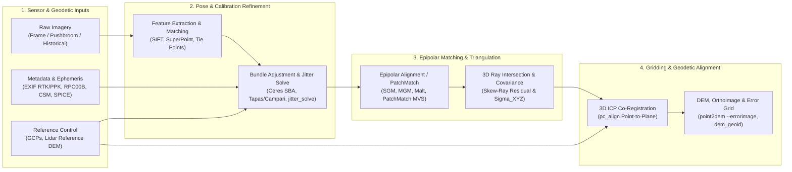

## 8.5 Software Ecosystem

The software ecosystem for deriving Digital Elevation Models from optical imagery spans nearly three decades of computer vision, planetary robotics, and national-agency photogrammetry. While every package solves the same fundamental equations—bundle adjustment of viewing rays (Section 8.4) followed by dense correspondence matching and 3D triangulation—individual suites differ profoundly in their **sensor physics assumptions**, **self-calibration parameterization**, and **error propagation rigor**. A tool engineered for unordered consumer drone frames (e.g., `COLMAP` or `OpenSfM`) relies on perspective or fisheye projection matrices and aggressive intrinsic self-calibration, whereas a satellite stereo engine (e.g., NASA `ASP` or BAE `SOCET GXP`) models time-dependent pushbroom linear arrays, orbital ephemeris, spacecraft attitude jitter, and Rational Polynomial Coefficients (RPCs).



---

### 8.5.1 Open-Source Photogrammetry, Satellite Stereo, and SfM/MVS Suites

#### NASA Ames Stereo Pipeline (`ASP`) and `VisionWorkbench` (`gis-history` 1996, 2006)
Initiated in 1996 by the NASA Ames Intelligent Robotics Group to support Mars Pathfinder and planetary rover localization (`gis-history` 1996) and re-architected in 2006 atop `VisionWorkbench` (`vw`, `gis-history` 2006)—a modular C++ template library for large-scale image processing and mathematical optimization—the **NASA Ames Stereo Pipeline (`ASP`)** (Beyer et al., 2018; Shean et al., 2016) is the premier open-source scientific suite for satellite, planetary, and historical aerial stereo processing. Unlike consumer SfM tools, `ASP` natively ingests both rigorous physical linescan models (including USGS `ISIS` planetary cubes and the NGA **Community Sensor Model [CSM]** standard) and vendor-supplied **Rational Polynomial Coefficient (`RPC00B`)** camera models for commercial Earth-observation constellations (Maxar WorldView-1/2/3, GeoEye-1, Airbus Pléiades and SPOT-6/7, Planet SkySat, ASTER, and Cartosat).

The `ASP` production workflow is decomposed into composable command-line executables backed by the Google **Ceres Solver** nonlinear least-squares library:
* **`bundle_adjust`:** Refines extrinsic camera trajectories (position offsets $\Delta \mathbf{t}_j$ and attitude Euler/quaternion corrections $\Delta \mathbf{R}_j$) and optional intrinsic parameters across overlapping strips using multi-view tie points, ground control points (GCPs), or soft height constraints against an existing reference DEM.
* **`jitter_solve`:** Solves for high-frequency spacecraft attitude oscillations ("jitter") along pushbroom linescan trajectories. Reaction-wheel harmonics or solar-array vibrations during imaging (e.g., on Mars Reconnaissance Orbiter HiRISE, LROC NAC, WorldView, or Pléiades) induce cross-track and along-track sinusoidal elevation artifacts ($\Delta z(t)$ with amplitudes of $0.2\text{–}3.0\text{ m}$ and wavelengths of $0.5\text{–}5\text{ km}$) that cannot be removed by rigid 6-DOF block adjustment. `jitter_solve` models time-varying roll, pitch, and yaw splines at dense timestamp nodes along the scanline.
* **`cam_gen` and Historical Film Calibration:** Instantiates physical pinhole and optical-bar panoramic camera models for declassified Cold War reconnaissance archives—specifically **KH-4A/B CORONA** (dual-convergent panoramic cameras, 1960–1972) and **KH-9 HEXAGON** (mapping frame cameras with reseau grids, 1971–1986)—enabling multi-decadal geomorphic, tectonic, and glaciological change detection back to the 1960s.
* **`stereo` / `parallel_stereo`:** Executes tiled, multi-node stereo reconstruction across five modular stages: preprocessing (`stereo_pprc`), disparity correlation (`stereo_corr`), sub-pixel parabolic or Bayes EM refinement (`stereo_rfne`), outlier filtering (`stereo_fltr`), and 3D ray triangulation (`stereo_tri`). Setting `--stereo-algorithm asp_mgm` invokes **More Global Matching (MGM)** (Facciolo et al., 2015), a two-dimensional quadrant dynamic-programming refinement of Hirschmüller's 1D **Semi-Global Matching (SGM)** (`asp_sgm`) that suppresses directional scanline "streaking" over low-contrast snowfields, ice sheets, and desert dunes.
* **`point2dem`:** Grids the 3D triangulated point cloud (`*-PC.tif`, storing $(X, Y, Z)$ offsets from the tile center plus the ray-intersection error $\epsilon_{\text{tri}}$) onto a target projected coordinate reference system (`--t_srs`) using weighted Gaussian radial kernels, while simultaneously emitting an orthorectified image (`--orthoimage`) and a co-registered per-pixel **triangulation error raster** (`--errorimage`).
* **`pc_align` and `dem_geoid`:** Prior to multi-temporal elevation differencing, `pc_align` performs 3D Iterative Closest Point (ICP, point-to-plane or point-to-point) co-registration against reference airborne lidar or satellite laser altimetry (ICESat-2 `ATL06`/`ATL08`, GEDI) to eliminate residual meter-scale orbital ephemeris translations and rotations (Nuth & Kääb, 2011). `dem_geoid` converts the resulting WGS84/ITRF ellipsoidal heights ($h$, positive-up in meters) to orthometric elevations ($H = h - N$) relative to EGM96, EGM2008, or planetary equipotential geoids.

#### `COLMAP` (Schönberger & Frahm, 2016)
`COLMAP` is the gold-standard open-source computer vision framework for **Incremental and Global Structure from Motion (SfM)** and **PatchMatch Multi-View Stereo (MVS)** (Schönberger & Frahm, 2016; Schönberger et al., 2016). Engineered for unordered, heterogeneous ground, UAV, and underwater image collections, `COLMAP` separates reconstruction into a modular SQLite database-driven pipeline:
1. **Feature Extraction & Geometric Verification (`feature_extractor`, `exhaustive_matcher`, `vocab_tree_matcher`):** Extracts scale- and rotation-invariant SIFT descriptors on the GPU and verifies epipolar geometry using multi-model RANSAC (`gis-history` 1981). By simultaneously estimating the Fundamental Matrix ($\mathbf{F}$), Essential Matrix ($\mathbf{E}$), and planar Homography ($\mathbf{H}$), `COLMAP` computes the geometric inlier ratio to distinguish well-conditioned 3D baselines from degenerate panoramic (pure rotation) or planar scenes.
2. **Incremental Mapping (`mapper`, `bundle_adjuster`):** Selects an initial two-view seed with wide baseline and high triangulation angle, then iteratively registers views via Perspective-$n$-Point (P$n$P), performs multi-view triangulation with recursive outlier filtering, and runs local and global Sparse Bundle Adjustment (SBA) with Huber/Cauchy robust loss functions.
3. **Dense PatchMatch MVS (`patch_match_stereo`, `stereo_fusion`):** Estimates jointly consistent per-pixel depth and surface normal maps via probabilistic PatchMatch sampling (incorporating both normalized cross-correlation photometric consistency and multi-view geometric reprojection consistency), fusing valid depths into a dense 3D point cloud. Beyond topographic DSM generation, `COLMAP` serves as the canonical pose-estimation front end for modern neural scene representations, including Neural Radiance Fields (NeRFs) and 3D Gaussian Splatting (3DGS).

#### `MicMac` (IGN France)
Developed at the French National Institute of Geographic and Forest Information (IGN) and ENSG (Pierrot Deseilligny & Cléry, 2011; Rupnik et al., 2017), **MicMac** (*Multi-Images Correspondances, Méthodes Automatiques de Corrélation*) prioritizes **metrological transparency** over black-box automation. Whereas commercial SfM tools often hide lens optimization heuristics, `MicMac` exposes explicit command-line controls over every calibration degree of freedom:
* **`Tapioca` & `Tapas`:** Extracts multi-scale tie points and solves relative orientation alongside hierarchical lens distortion models (`RadialBasic`, `Fraser`, `FraserBasic`, `FishEyeEqui`, or arbitrary high-degree polynomials). Operators can freeze intrinsic parameters during early bundle iterations and release radial/decentering coefficients progressively to prevent projective coupling with terrain curvature.
* **`Campari`:** Executes absolute block bundle adjustment integrating GNSS camera centers, IMU attitude priors, and weighted GCPs, outputting detailed per-image and per-tie-point residual diagnostics.
* **`Malt` & `MM2DPosSism`:** `Malt` performs pyramidal multi-resolution dense energy-minimization correlation either directly in ground object space (`Ortho` / `UrbanMNE` mode for true DSMs) or in sensor geometry (`GeomImage`). `MM2DPosSism` implements sub-pixel phase and frequency correlation on orthoimage pairs to measure 2D horizontal ground displacements down to $0.05\text{–}0.1\text{ pixels}$, widely used for mapping coseismic fault slip, slow-moving landslides, and alpine glacier velocity fields.

#### `OpenDroneMap` (`ODM` / `OpenSfM`), `AliceVision Meshroom`, and `OpenCV` (`gis-history` 2000)
For automated UAV mapping and custom algorithm development, three additional open-source frameworks anchor the ecosystem:
* **`OpenDroneMap` (`ODM` / `WebODM`):** An end-to-end containerized UAV photogrammetry suite built around Mapillary's **`OpenSfM`** (graph-based Python/C++ SfM supporting spherical, fisheye, and dual-camera rigs), **`OpenMVS`** (dense depth-map fusion and mesh refinement), and **`PDAL` / `GDAL`**. `ODM` automates the transition from raw drone JPEG/DNG frames (with EXIF RTK/PPK tags) to classified point clouds, generating both a Digital Surface Model (DSM) and a bare-earth Digital Terrain Model (DTM) via morphological or Cloth Simulation Filtering (CSF).
* **`AliceVision Meshroom`:** A node-based visual programming photogrammetry and MVS environment originating from visual effects (VFX) and close-range cultural heritage metrology, allowing fine-grained graphical customization of feature extractors (SIFT, AKAZE), depth-map filtering, and textured 3D mesh topology.
* **`OpenCV` (`Open Source Computer Vision Library`, `gis-history` 2000):** Initiated by Intel in 2000 (Bradski, 2000), `OpenCV` provides the foundational C++ and Python primitives underlying countless custom stereo rigs, autonomous vehicles, and subsea ROV stereo cameras. Its core calibration and stereo modules implement Zhang's planar calibration (`cv2.calibrateCamera`), Bouguet's epipolar stereo rectification (`cv2.stereoRectify`, `cv2.initUndistortRectifyMap`), local Block Matching (`cv2.StereoBM_create`), and Hirschmüller's Semi-Global Block Matching (`cv2.StereoSGBM_create`).

---

### 8.5.2 Closed-Source and Commercial Photogrammetric Production Suites

#### Agisoft `Metashape` and `Pix4Dmapper` / `Pix4Dmatic`
In commercial UAV surveying, airborne corridor mapping, and underwater photogrammetry, **Agisoft `Metashape`** (formerly `PhotoScan`) and **`Pix4Dmapper` / `Pix4Dmatic`** serve as the primary industry workhorses. Their dominance stems from engineering features tailored to operational surveying workflows:
* **Selective Intrinsic Optimization and Rolling-Shutter Compensation:** Both suites allow surveyors to selectively toggle individual Brown-Conrady lens parameters ($f, c_x, c_y, k_1, k_2, k_3, k_4, p_1, p_2, b_1, b_2$) during bundle adjustment and incorporate explicit **electronic rolling-shutter models**. Because low-cost CMOS drone sensors read out pixel rows sequentially over $\Delta t_{\text{read}} \approx 10\text{–}30\text{ ms}$ while the airframe translates at velocity $\mathbf{v}$ and rotates at angular rate $\boldsymbol{\omega}$, unmodeled rolling shutter induces systematic shear and altitude errors; estimating $(\mathbf{v}, \boldsymbol{\omega})$ per exposure restores metric fidelity.
* **RTK/PPK Direct Georeferencing, Covariance Weighting, and ASPRS QA/QC:** Camera exposure centers $\mathbf{C}_j$ carry full 3D standard deviations $(\sigma_{X_0}, \sigma_{Y_0}, \sigma_{Z_0})$ parsed directly from post-processed kinematic (PPK) GNSS/INS logs or XMP metadata, rigorously balancing camera-station priors against 3D GCPs in the normal equations while withholding independent Check Points (CPs) to report **ASPRS Positional Accuracy Standards** (2014/2023) Non-Vegetated Vertical Accuracy ($\text{NVA}_{95\%} = 1.96 \times \text{RMSE}_z$) and Vegetated Vertical Accuracy ($\text{VVA}_{95\%}$, 95th percentile absolute error). `Pix4Dmatic` extends this architecture with out-of-core memory management to process $>10{,}000$ high-resolution Phase One or oblique corridor images alongside terrestrial lidar scans.
* **Bathymetric Through-Water and Subsea ROV Applications:** For shallow clear-water coastal and fluvial mapping (Section 8.2 and Section 8.4.4), `Metashape` (via its native planar water-surface refraction solver) and external multi-view ray-tracing tools such as `py_sfm_depth` (Dietrich, 2017) correct for Snell's law ray bending at the air–water interface ($n_{\text{water}} \approx 1.334$, $n_{\text{air}} \approx 1.0003$). Because each camera ray $j$ intersects the water surface at a distinct incidence angle $i_j$ and refracts to angle $r_j = \arcsin\!\big(\frac{n_{\text{air}}}{n_{\text{water}}}\sin i_j\big)$, the ratio of true bathymetric depth $d = z_{\text{water\_surface}} - z_{\text{true}}$ (positive-down, in $\text{m}$) to apparent depth $d_{\text{app}} = z_{\text{water\_surface}} - z_{\text{app}}$ equals $\frac{\tan i_j}{\tan r_j}$—increasing from $\approx 1.34$ near nadir ($i_j \to 0^\circ$) to $>1.50$ at oblique viewing angles ($i_j > 35^\circ$). For deep-water ROV and diver photogrammetry, flat-port pressure housings introduce non-central refractive radial caustic shifts that high-order radial polynomials ($k_1\text{–}k_4$) only partially absorb, whereas concentric **dome ports** align principal rays normal to the spherical interface to preserve a strict central perspective pinhole geometry capable of meeting **IHO S-44 Special Order / Exclusive Order** TVU tolerances on coral reefs and subsea infrastructure.

#### Enterprise, Defense, and National Mapping Suites
At the scale of national mapping agencies (USGS, NGA, IGN, Ordnance Survey) and commercial aerial survey firms operating large-format metric frame or pushbroom cameras (Leica ADS100, Vexcel UltraCam, Phase One PAS), specialized enterprise workstations dominate:
* **BAE Systems `SOCET SET` and `SOCET GXP`:** The long-standing defense and planetary benchmark (historically paired with USGS `ISIS` for Mars exploration), featuring the **Next Generation Automatic Terrain Extraction (`NGATE`)** and **Automatic Spatial Modeler (`ASM`)** engines. `SOCET GXP` natively processes NITF 2.1 imagery with rigorous `RPC00B` and **Community Sensor Model (CSM)** plugins, propagates full $6 \times 6$ error covariance matrices from orbital/airborne state vectors into per-post Total Horizontal Uncertainty (THU) and Total Vertical Uncertainty (TVU), and integrates with hardware-accelerated 3D stereoscopic viewing monitors (active shutter or passive polarized glasses) for manual breakline compilation, bridge deck removal, and **USGS 3DEP** hydro-enforcement.
* **Trimble `Inpho` (`MATCH-AT`, `MATCH-T DSM`, `OrthoMaster`, `OrthoVista`):** Engineered for massive metric aerial blocks ($>50{,}000$ frames), `MATCH-AT` performs automated aerial triangulation tightly coupled with Applanix `POSPac` GNSS/INS Smoothed Best Estimate of Trajectory (SBET) files, solving for IMU boresight misalignment angles and GNSS lever-arm offsets while `MATCH-T DSM` fuses feature-based and SGM dense matching into bare-earth DTMs and surface grids.
* **Bentley `ContextCapture` (now `iTwin Capture Modeler`):** Built on the Acute3D engine, `ContextCapture` pioneered out-of-core, multi-resolution adaptive 3D reality meshes from oblique multi-camera airborne pods (e.g., 5-head nadir + $45^\circ$ forward/aft/left/right configurations) fused with mobile and airborne lidar, resolving vertical building facades and under-bridge geometry that pure 2.5D raster DEMs cannot represent.
* **`Catalyst` (formerly `PCI Geomatics` `OrthoEngine` / `Geomatica`):** An enterprise Earth-observation suite renowned for **Toutin's 3D Physical Model** and rigorous RPC block bundle adjustment across heterogeneous optical (WorldView, Pléiades, SPOT, Kompsat, Gaofen, Cartosat) and radar constellations, enabling continental-scale stereo DEM extraction and seamline-feathered orthomosaicking.

---

### 8.5.3 Uncertainty Propagation and Triangulation Diagnostics in Software

A critical distinction between consumer visualization tools and scientific/metrological suites (`ASP`, `MicMac`, `SOCET GXP`, `Inpho`) is the explicit propagation of observation uncertainty into the output DEM. During 3D triangulation of a ground point $\mathbf{X} = [X, Y, Z]^{\top}$ (in an Earth-Centered Earth-Fixed or local East-North-Up frame, in $\text{m}$, with $Z$ positive-up) from two calibrated viewing rays $\mathbf{r}_1(s_1) = \mathbf{C}_1 + s_1 \hat{\mathbf{u}}_1$ and $\mathbf{r}_2(s_2) = \mathbf{C}_2 + s_2 \hat{\mathbf{u}}_2$ ($s_1, s_2 > 0$), random disparity matching errors and residual camera pose errors prevent the rays from intersecting exactly in $\mathbb{R}^3$.

1. **Skew-Ray Triangulation Midpoint ($\hat{\mathbf{X}}$) and Intersection Error ($\epsilon_{\text{tri}}$):** Let $\mathbf{b} = \mathbf{C}_2 - \mathbf{C}_1 \in \mathbb{R}^3$ denote the baseline vector (in $\text{m}$) between the perspective or instantaneous pushbroom camera centers, and let $\hat{\mathbf{u}}_1, \hat{\mathbf{u}}_2 \in \mathbb{S}^2$ denote the unit look-direction vectors (dimensionless) with convergence angle $\gamma = \arccos(\hat{\mathbf{u}}_1 \cdot \hat{\mathbf{u}}_2)$ and $c = \cos\gamma$. Minimizing the squared Euclidean distance $\|(\mathbf{C}_1 + s_1 \hat{\mathbf{u}}_1) - (\mathbf{C}_2 + s_2 \hat{\mathbf{u}}_2)\|_2^2$ yields the closest-approach ray distances $s_1^*, s_2^*$, the triangulated midpoint $\hat{\mathbf{X}}$, and the scalar **skew-ray miss distance** $\epsilon_{\text{tri}}$ (in $\text{m}$) output by `ASP`'s `stereo_tri` and `point2dem --errorimage`:
   $$s_1^* = \frac{(\mathbf{b} \cdot \hat{\mathbf{u}}_1) - c(\mathbf{b} \cdot \hat{\mathbf{u}}_2)}{\sin^2\gamma}, \qquad s_2^* = \frac{c(\mathbf{b} \cdot \hat{\mathbf{u}}_1) - (\mathbf{b} \cdot \hat{\mathbf{u}}_2)}{\sin^2\gamma}, \qquad \hat{\mathbf{X}} = \frac{1}{2}\left(\mathbf{C}_1 + s_1^*\hat{\mathbf{u}}_1 + \mathbf{C}_2 + s_2^*\hat{\mathbf{u}}_2\right)$$
   $$\epsilon_{\text{tri}} = \min_{s_1, s_2 \in \mathbb{R}} \left\| (\mathbf{C}_1 + s_1 \hat{\mathbf{u}}_1) - (\mathbf{C}_2 + s_2 \hat{\mathbf{u}}_2) \right\|_2 = \frac{\left| \mathbf{b} \cdot (\hat{\mathbf{u}}_1 \times \hat{\mathbf{u}}_2) \right|}{\left\| \hat{\mathbf{u}}_1 \times \hat{\mathbf{u}}_2 \right\|_2} = \frac{\left| \mathbf{b} \cdot (\hat{\mathbf{u}}_1 \times \hat{\mathbf{u}}_2) \right|}{\sin\gamma}$$
   Notice how $\sin^2\gamma = \|\hat{\mathbf{u}}_1 \times \hat{\mathbf{u}}_2\|_2^2$ in the denominator of $s_1^*, s_2^*$ quantifies geometric conditioning: as the base-to-height ratio $B/H = 2\tan(\gamma/2) \to 0$, $\sin^2\gamma \to 0$ and depth sensitivity explodes. While $\epsilon_{\text{tri}}$ measures disparity consistency in the cross-epipolar direction, large values ($\epsilon_{\text{tri}} > 2 \cdot \text{GSD}$) reliably flag stereo blunders, cloud edges, water specular reflections, or uncompensated pushbroom attitude jitter.
2. **Full 3D Covariance Propagation ($\boldsymbol{\Sigma}_{XYZ}$):** Rigorous photogrammetric suites propagate the image-space matching covariance $\boldsymbol{\Sigma}_{\text{disp}}$ (typically $\sigma_p \approx 0.1\text{–}0.3\text{ pixels}$) and the bundle-adjusted camera exterior/interior orientation covariance $\boldsymbol{\Sigma}_{\text{pose}}$ through the linearized stereo intersection Jacobian $\mathbf{J}_{\text{stereo}} = \frac{\partial \mathbf{X}}{\partial (\mathbf{x}_1, \mathbf{x}_2)}$ and pose Jacobian $\mathbf{J}_{\text{pose}} = \frac{\partial \mathbf{X}}{\partial \mathbf{p}}$:
   $$\boldsymbol{\Sigma}_{XYZ} = \begin{bmatrix} \sigma_X^2 & \sigma_{XY} & \sigma_{XZ} \\ \sigma_{XY} & \sigma_Y^2 & \sigma_{YZ} \\ \sigma_{XZ} & \sigma_{YZ} & \sigma_Z^2 \end{bmatrix} = \underbrace{\mathbf{J}_{\text{stereo}} \, \boldsymbol{\Sigma}_{\text{disp}} \, \mathbf{J}_{\text{stereo}}^{\top}}_{\text{Short-wavelength matching noise}} + \underbrace{\mathbf{J}_{\text{pose}} \, \boldsymbol{\Sigma}_{\text{pose}} \, \mathbf{J}_{\text{pose}}^{\top}}_{\text{Long-wavelength datum/pose bias}}$$
   From $\boldsymbol{\Sigma}_{XYZ}$ (in $\text{m}^2$), standard 95% confidence error metrics (compliant with FGDC NSSDA, ASPRS, and IHO S-44 / S-102) follow directly:
   $$\text{TVU}_{95\%} = 1.96 \, \sigma_Z, \qquad \text{THU}_{95\%} \approx 2.4477 \sqrt{\frac{\sigma_X^2 + \sigma_Y^2}{2}} \quad (\text{for } \sigma_X \approx \sigma_Y)$$
   *Worked Numerical Example (WorldView-3 Stereo Pair in `ASP`):* Consider an along-track WorldView-3 stereo pair acquired from orbital altitude $H = 617\text{ km}$ with mean Ground Sample Distance $\text{GSD} = 0.31\text{ m}$ and stereo convergence angle $\gamma = 30^\circ$, giving a base-to-height ratio $B/H = 2\tan(15^\circ) = 0.536$. With MGM sub-pixel matching precision $\sigma_d = 0.20\text{ px}$, the uncorrelated short-wavelength vertical precision per post is $\sigma_{Z,\text{match}} = \frac{\text{GSD} \cdot \sigma_d}{B/H} = \frac{0.31 \times 0.20}{0.536} = 0.116\text{ m}$ ($\text{TVU}_{95\%,\text{match}} = 0.23\text{ m}$). However, prior to ground control or lidar co-registration, vendor `RPC00B` ephemeris/attitude uncertainty contributes a spatially correlated vertical bias of $\sigma_{Z,\text{pose}} \approx 2.50\text{ m}$, yielding a total unaligned uncertainty of $\sigma_Z = \sqrt{0.116^2 + 2.50^2} = 2.503\text{ m}$ ($\text{TVU}_{95\%} = 4.91\text{ m}$). Running 3D point-to-plane ICP (`pc_align`) against ICESat-2 `ATL06` or airborne lidar reduces the long-wavelength datum uncertainty to $\sigma_{Z,\text{pose}} \approx 0.10\text{ m}$, bringing the final co-registered DEM uncertainty down to $\sigma_Z = \sqrt{0.116^2 + 0.10^2} = 0.153\text{ m}$ ($\text{TVU}_{95\%} = 0.30\text{ m}$).

---

### 8.5.4 Comprehensive Software Comparison Matrix

| Software Package | License | Primary Sensor Domain | Camera Models Supported | Dense Matching Engine | Uncertainty & Error Diagnostics | Primary Use Cases |
| :--- | :--- | :--- | :--- | :--- | :--- | :--- |
| **NASA `ASP`** (`VisionWorkbench`) | Open-Source (Apache 2.0) | Satellite pushbroom, planetary (`ISIS`), historical film | Pinhole, Brown-Conrady, Optical Bar (`CORONA`), `RPC00B`, USGS `CSM` / `ISIS` | SGM (`asp_sgm`), MGM (`asp_mgm`), Normalized Cross-Correlation | Per-pixel 3D skew-ray error (`--errorimage`), propagation of horizontal/vertical stddev, `pc_align` ICP residuals | Cryosphere, tectonics, planetary DEMs, WorldView / Pléiades / KH-9 stereo |
| **`COLMAP`** | Open-Source (BSD-3) | Ground, UAV frame, underwater close-range | Simple/Full Radial, OpenCV, Fisheye, FOV, Thin-Prism | Probabilistic PatchMatch MVS (`patch_match_stereo`) | Reprojection error (px), track length, per-pixel depth/normal consistency | Computer vision benchmarks, 3D reconstruction, NeRF/3DGS pose priors |
| **`MicMac`** (IGN France) | Open-Source (CeCILL-B) | Metric aerial frame, UAV, historical archives, satellite RPC | Radial/Decentering (`Fraser`), Fisheye, Polynomial, RPC (`SAT4GEO`) | Multi-scale pyramidal energy minimization (`Malt`), phase correlation (`MM2DPosSism`) | Full bundle covariance (`Campari`), correlation score maps, sub-pixel displacement variance | Geomorphology, metrology, glacier/fault slip tracking, historical aerial DEMs |
| **`OpenDroneMap`** (`ODM` / `OpenSfM`) | Open-Source (AGPLv3 / BSD) | UAV / Drone frame and multispectral | Perspective, Brown-Conrady, Fisheye, Dual/Spherical | `OpenMVS` PatchMatch + depth fusion | GPS/GCP residual reports, point-cloud density and confidence masks | Turnkey UAV orthomosaics, DSM/DTM generation, precision agriculture |
| **`AliceVision Meshroom`** | Open-Source (MPLv2) | Close-range, UAV, cultural heritage | Pinhole, Radial, Brown, Fisheye, Equirectangular | Semi-Global Matching + plane-sweep depth maps | Per-view reprojection residuals, depth-map visibility counts | Node-based 3D reality meshes, cultural heritage, VFX asset capture |
| **`OpenCV`** | Open-Source (Apache 2.0) | Embedded stereo rigs, robotics, ROV stereo | Brown-Conrady (`calibrateCamera`), Kannala-Brandt Fisheye | Block Matching (`StereoBM`), SGBM (`StereoSGBM_create`) | Calibration RMS reprojection error, per-parameter standard deviations | Custom C++/Python stereo pipelines, real-time robotics, subsea stereo vision |
| **Agisoft `Metashape`** | Commercial (Proprietary) | UAV, airborne frame, underwater ROV, satellite RPC | Frame, Fisheye, Spherical, Cylindrical, RPC, Rolling Shutter | Multi-view depth maps (SGM/PatchMatch hybrid) | Tie-point covariance ellipsoids, GCP/CP RMSE tables, DEM confidence layer | Commercial drone surveying, archaeology, shallow/underwater bathymetry |
| **`Pix4Dmapper` / `Pix4Dmatic`** | Commercial (Proprietary) | UAV RTK/PPK, large corridor aerial, terrestrial | Perspective, Fisheye, Spherical, Linear Rolling Shutter | Multi-scale multi-view stereo + lidar fusion (`Pix4Dmatic`) | Full variance-covariance matrix of adjusted poses, GCP/CP accuracy reports | Civil engineering, corridor mapping, construction BIM, agriculture |
| **BAE `SOCET GXP` / `SOCET SET`** | Commercial (Proprietary) | Defense/commercial satellite, metric airborne | NITF `RPC00B`, Rigorous `CSM`, Frame, Pushbroom, SAR | `NGATE` (edge + area correlation) and `ASM` (SGM-based) | Rigorous $6 \times 6$ covariance propagation to per-post THU and TVU (90%/95% LE/CE) | National mapping agencies (NGA/USGS), defense intelligence, planetary stereo |
| **Trimble `Inpho`** (`MATCH-AT` / `T`) | Commercial (Proprietary) | Large-format metric airborne frame & pushbroom | Metric Frame (UltraCam, DMC), Pushbroom (ADS100) + GNSS/INS | `MATCH-T DSM` (feature + multi-ray SGM matching) | Full aerial triangulation variance components, SBET boresight/lever-arm statistics | National/statewide aerial lidar + photogrammetric DTM/ortho production |
| **Bentley `ContextCapture`** | Commercial (Proprietary) | Oblique airborne multi-camera, UAV, mobile lidar | Multi-head oblique frame, Fisheye, Pinhole + lidar point clouds | Out-of-core multi-view stereo + adaptive 3D mesh reconstruction | Aerotriangulation tie-point uncertainty, GCP/CP 3D residual vectors | City-scale 3D Digital Twins, infrastructure inspection, reality modeling |
| **`Catalyst`** (`PCI Geomatics`) | Commercial (Proprietary) | Regional/continental optical & SAR satellite stereo | Toutin's 3D Physical Model, `RPC00B`, Aerial Frame | Epipolar SGM / Normalized Cross-Correlation | Block bundle adjustment residual vectors, per-pixel quality masks | Continental satellite ortho/DEM production, disaster response mapping |

---

### 8.5.5 Reproducible CLI and Python Workflows

#### 1. Satellite Stereo Processing & Lidar Co-Registration with NASA `ASP`
The following bash pipeline processes a commercial along-track satellite stereo pair (e.g., Maxar WorldView-3 `.NTF` imagery with exact linescan and `RPC00B` `.XML` metadata) into a geoid-referenced, lidar-aligned DEM and triangulation error grid:

```bash
# 1. Refine extrinsic camera poses against a coarse reference DEM (e.g., Copernicus GLO-30)
bundle_adjust img_left.ntf img_right.ntf img_left.xml img_right.xml \
    --heights-from-dem ref_cop30.tif --heights-from-dem-uncertainty 10.0 \
    --ip-per-tile 1000 -o ba/run

# 2. (Optional, for linescan/CSM models) Solve for high-frequency spacecraft attitude jitter
#    Outputs adjusted CSM camera state files: jitter/run-*.adjusted_state.json
jitter_solve img_left.ntf img_right.ntf img_left.xml img_right.xml \
    --bundle-adjust-prefix ba/run --num-lines-per-position 500 \
    --heights-from-dem ref_cop30.tif --heights-from-dem-uncertainty 10.0 \
    -o jitter/run

# 3. Map-project both images onto the coarse reference DEM to remove terrain foreshortening,
#    then run distributed stereo with More Global Matching (MGM) and 7x7 kernel
mapproject --tr 0.5 ref_cop30.tif img_left.ntf jitter/run-img_left.adjusted_state.json left_map.tif
mapproject --tr 0.5 ref_cop30.tif img_right.ntf jitter/run-img_right.adjusted_state.json right_map.tif

parallel_stereo left_map.tif right_map.tif \
    jitter/run-img_left.adjusted_state.json jitter/run-img_right.adjusted_state.json \
    --stereo-algorithm asp_mgm --corr-kernel 7 7 --subpixel-mode 9 \
    --corr-seed-mode 1 stereo_out/run ref_cop30.tif

# 4. Co-register the 3D stereo point cloud to airborne lidar/ICESat-2 via Point-to-Plane ICP
pc_align --max-displacement 15.0 --alignment-method point-to-plane \
    ref_lidar_dem.tif stereo_out/run-PC.tif -o aligned/run --save-transformed-source-points

# 5. Grid aligned 3D points to a 2.0 m UTM DEM, orthoimage, and 3D ray-intersection error map
point2dem aligned/run-trans_source.tif --t_srs "EPSG:32610" --tr 2.0 \
    --errorimage --orthoimage stereo_out/run-L.tif -o final_utm/wv3

# 6. Convert WGS84 ellipsoidal heights (h) to EGM2008 orthometric elevations (H) -> final_utm/wv3-adj.tif
dem_geoid final_utm/wv3-DEM.tif --geoid EGM2008 -o final_utm/wv3
```

#### 2. Automated Incremental SfM/MVS with `COLMAP` and `OpenCV` Uncertainty Estimation
For terrestrial, coastal cliff, or underwater frame datasets, `COLMAP`'s command-line interface executes reproducible sparse and dense reconstruction, while Python (`OpenCV` + `NumPy`) enables direct inspection of the disparity-to-elevation Jacobian and vertical uncertainty $\sigma_z$:

```bash
# Run COLMAP feature extraction, exhaustive RANSAC matching, and Sparse Bundle Adjustment
colmap feature_extractor --database_path project.db --image_path ./images \
    --ImageReader.camera_model OPENCV --ImageReader.single_camera 1
colmap exhaustive_matcher --database_path project.db
mkdir -p sparse/0 dense/0
colmap mapper --database_path project.db --image_path ./images --output_path ./sparse
colmap image_undistorter --image_path ./images --input_path ./sparse/0 --output_path ./dense/0 --output_type COLMAP
colmap patch_match_stereo --workspace_path ./dense/0 --PatchMatchStereo.geom_consistency true
colmap stereo_fusion --workspace_path ./dense/0 --output_path ./dense/0/fused.ply
```

```python
import cv2
import numpy as np

def compute_sgbm_dem_and_tvu(
    rect_left: np.ndarray,
    rect_right: np.ndarray,
    focal_px: float,
    baseline_m: float,
    altitude_m: float,
    sigma_disp_px: float = 0.25,
) -> tuple[np.ndarray, np.ndarray]:
    """Compute disparity via OpenCV SGBM and propagate vertical uncertainty (TVU_95)."""
    block_size = 5
    n_channels = 1 if rect_left.ndim == 2 else rect_left.shape[2]
    sgbm = cv2.StereoSGBM_create(
        minDisparity=0,
        numDisparities=128,  # Must be divisible by 16
        blockSize=block_size,
        P1=8 * n_channels * block_size**2,
        P2=32 * n_channels * block_size**2,
        uniquenessRatio=10,
        speckleWindowSize=100,
        speckleRange=2,
        mode=cv2.STEREO_SGBM_MODE_HH,  # Full 8-direction Hirschmueller SGM
    )
    # OpenCV returns 16-bit fixed-point disparity with 4 fractional bits (scale factor 16)
    disp_px = sgbm.compute(rect_left, rect_right).astype(np.float32) / 16.0
    valid = disp_px > 0.5

    # Convert disparity d (px) to sensor-to-surface range Z_cam = (f * B) / d and elevation z (m)
    z_elev = np.full_like(disp_px, np.nan, dtype=np.float32)
    sigma_z = np.full_like(disp_px, np.nan, dtype=np.float32)

    z_cam = (focal_px * baseline_m) / disp_px[valid]
    z_elev[valid] = altitude_m - z_cam

    # Error propagation: sigma_z = (Z_cam^2 / (f * B)) * sigma_d = (H / B) * GSD * sigma_d
    sigma_z[valid] = ((z_cam ** 2) / (focal_px * baseline_m)) * sigma_disp_px
    tvu_95 = 1.96 * sigma_z
    return z_elev, tvu_95
```

> [!WARNING]
> **Unconstrained Self-Calibration and Datum Drift in Black-Box SfM**
> Allowing commercial or open-source SfM suites (`Metashape`, `Pix4D`, `COLMAP`, `ODM`) to simultaneously optimize all radial ($k_1\text{–}k_4$), tangential ($p_1, p_2$), and affinity ($b_1, b_2$) lens parameters on a nadir-only flight block without high-accuracy RTK/PPK camera priors or well-distributed 3D GCPs will almost always induce meter-scale parabolic **doming** (Section 8.2). Furthermore, satellite RPC models have native horizontal and vertical geolocation biases of $2\text{–}15\text{ m}$ CE90/LE90; differencing a raw `ASP` or `Catalyst` satellite DEM against a historical baseline without running 3D ICP co-registration (`pc_align` on stable off-glacier/off-landslide bedrock) will conflate orbital ephemeris bias with real topographic change.

> [!TIP]
> **Interpreting the `ASP` `--errorimage` Triangulation Residual**
> Always generate and inspect the `--errorimage` (`*-IntersectionErr.tif`) in `point2dem` or the correlation confidence map in `MicMac`/`Metashape`. Because $\epsilon_{\text{tri}}$ measures the 3D skew-ray miss distance perpendicular to the epipolar plane, stripes of periodic high/low error parallel to the cross-track scan direction diagnose unmodeled **spacecraft attitude jitter** (requiring `jitter_solve`), whereas localized spikes ($\epsilon_{\text{tri}} > 3 \cdot \text{GSD}$) pinpoint cloud shadows, moving water, or steep-slope occlusions that should be masked prior to hydrological or geomorphic analysis.
