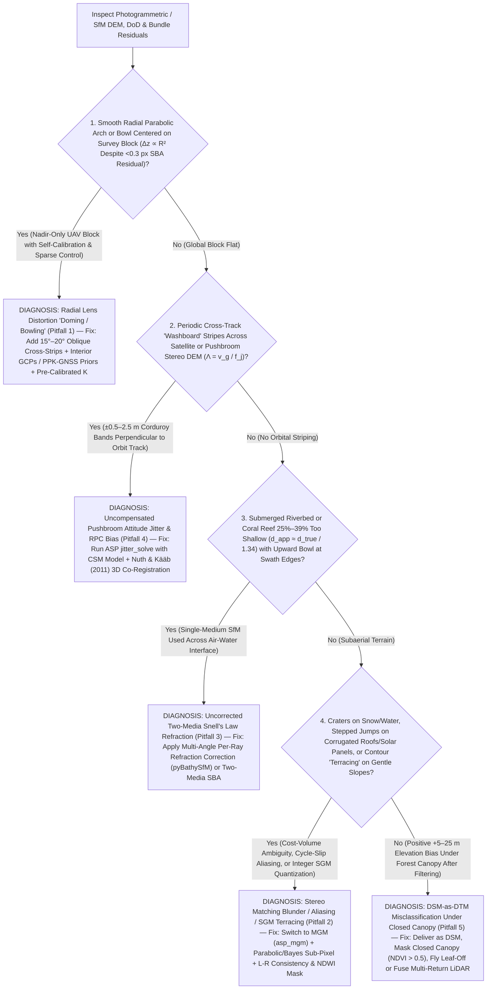

## 8.6 Common Pitfalls & Key Takeaways

Modern Structure-from-Motion (SfM), Multi-View Stereo (MVS), and satellite pushbroom stereo pipelines (`ASP`, `COLMAP`, `MicMac`, `Agisoft Metashape`, `Pix4D`) routinely produce visually stunning orthomosaics and dense point clouds containing hundreds of points per square meter, accompanied by bundle-adjustment reports boasting sub-pixel root-mean-square reprojection residuals ($\text{RMSE}_{uv} < 0.3\text{ pixels}$). Yet in photogrammetry, **a low reprojection residual is a measure of internal ray-intersection precision, not external topographic accuracy**. Because passive optical reconstruction simultaneously solves for camera poses, interior lens calibration, and 3D surface geometry from 2D projective ray bundles—and relies on ambient surface texture and single-medium straight-line ray propagation—subtle degeneracies in viewing geometry, surface radiometry, optical refraction, platform vibration, or canopy occlusion can inject meter-scale systematic vertical errors into a Digital Elevation Model (DEM) while leaving orthophotos and reprojection statistics seemingly flawless.

This section analyzes the five most prevalent and destructive failure modes in terrestrial, spaceborne, and bathymetric photogrammetric DEM production—complete with governing physical derivations and worked numerical case studies—followed by a diagnostic summary matrix, a troubleshooting decision tree, and a practitioner quality-assurance checklist.

---

### 8.6.1 Detailed Case Studies of Photogrammetric, Stereo, and SfM/MVS Failure Modes

#### Pitfall 1: Nadir-Only Drone Flights with Uncalibrated Consumer Lenses Inducing Meter-Scale Radial "Doming / Bowling" ($\Delta z(R) \propto \delta k_1 R^2$)

* **Physical & Projective Mechanism:** When an uncrewed aerial vehicle (UAV) surveys a terrain block using only parallel nadir flight lines ($\omega \approx 0^\circ, \phi \approx 0^\circ$) at a constant altitude $H$ with a non-metric consumer camera, operators commonly enable camera **self-calibration** inside the Sparse Bundle Adjustment (SBA; Sections 8.2.1–8.2.2) without interior Ground Control Points (GCPs) or survey-grade RTK/PPK camera station priors. As demonstrated by James and Robson (2014) and Carbonneau and Dietrich (2017), parallel nadir viewing geometry suffers from a fundamental projective coupling between the Brown–Conrady first-order radial lens distortion parameter $k_1$ (along with principal distance $f$) and the global quadratic vertical curvature of the reconstructed terrain. A small uncompensated radial distortion error $\delta k_1$ shifts image tie points radially outward or inward near the frame edges ($\delta r_{\text{norm}} = \delta k_1 r_{\text{norm}}^3$). Because all viewing rays in a nadir-only block intersect at nearly identical off-nadir angles without multi-angle convergent cross-constraints, the bundle adjustment cancels the radial image residuals almost perfectly ($\|\mathbf{r}_{ij}\| < 0.3\text{ px}$) by tilting consecutive camera poses by a systematic incremental pitch/roll curvature $\kappa_{\text{dome}} = d\theta / dR$ across the block—bending the entire DEM into a paraboloidal **"dome" (arch) or "bowl"**!
* **Governing Equations:** Let $r_{\text{norm}} = r / f = \tan\theta_{\text{fov}}$ denote the normalized image radius at off-nadir half-swath angle $\theta_{\text{fov}}$, and let $\varepsilon_{\text{rad}} = \delta r / r = \delta k_1 r_{\text{norm}}^2$ denote the uncompensated fractional radial lens distortion residual at the image edge (inducing an apparent horizontal ground radial shift $\delta d_r = H\,\delta k_1 r_{\text{norm}}^3 = H\,\varepsilon_{\text{rad}}\tan\theta_{\text{fov}}$ at flying height $H$). In a parallel nadir block without fixed camera positions or oblique rays, each strip connection absorbs $\delta d_r$ via a systematic angular tilt rate $\kappa_{\text{dome}}$ ($\text{rad m}^{-1}$), which integrates twice with radial horizontal distance $R = \sqrt{(X - X_0)^2 + (Y - Y_0)^2}$ from the block center $(X_0, Y_0)$ to produce a quadratic vertical elevation deformation $\Delta z_{\text{dome}}(R)$ (with elevation $z$ positive-up):
  $$
  \Delta z_{\text{dome}}(R) = \frac{1}{2}\kappa_{\text{dome}}\,R^2 \approx \alpha_{\text{net}}\,\frac{\delta k_1\,r_{\text{norm}}^2}{H}\,R^2 = \alpha_{\text{net}}\,\frac{\varepsilon_{\text{rad}}}{H}\,R^2
  $$
  where $\alpha_{\text{net}} \sim \mathcal{O}(0.5\text{–}1.5)$ is the dimensionless network overlap coupling coefficient determined by forward/side overlap and tie-point weighting. Notice the dangerous scaling law: **vertical doming grows quadratically with block radius $R$ and inversely with flying height $H$**. Flying lower to achieve a finer Ground Sample Distance (GSD) over a $1\text{ km}$ site *amplifies* the meter-scale vertical bow, even while the SBA reprojection residual remains sub-pixel!
* **Worked Numerical Case:** A UAV maps a $1{,}000\text{ m} \times 1{,}000\text{ m}$ ($1.0\text{ km}^2$) alluvial floodplain at flying height $H = 100.0\text{ m}$ ($\text{GSD} = 2.5\text{ cm}$) using a parallel nadir flight plan without interior GCPs or RTK-GNSS camera priors. Self-calibration converges with an apparent reprojection error of $\text{RMSE}_{uv} = 0.27\text{ pixels}$, but leaves an uncompensated radial distortion residual of $\varepsilon_{\text{rad}} = \delta r / r = -0.30\%$ ($-0.0030$, or $6.0\text{ pixels}$ at a $2{,}000\text{-pixel}$ image radius) with network coupling factor $\alpha_{\text{net}} = 0.50$, yielding an effective block curvature of $\kappa_{\text{dome}} = 2\,\alpha_{\text{net}}\,\varepsilon_{\text{rad}} / H = -3.00 \times 10^{-5}\text{ rad m}^{-1}$ ($-6.19''/\text{m}$).
  * **Vertical Doming Error at the Block Edges ($R = 500.0\text{ m}$ from Center):**
    $$
    \Delta z_{\text{dome}}(500\text{ m}) = \frac{1}{2}\left(-3.00 \times 10^{-5}\text{ rad m}^{-1}\right)(500.0\text{ m})^2 = -1.50 \times 10^{-5} \times 250{,}000 = \mathbf{-3.750\text{ m}}
    $$
    Even for a milder residual of $\kappa_{\text{dome}} = -1.50 \times 10^{-5}\text{ rad m}^{-1}$ ($\varepsilon_{\text{rad}} = -0.15\%$), the mid-edge vertical distortion is $\Delta z_{\text{dome}}(500\text{ m}) = \mathbf{-1.875\text{ m}}$ (and $\mathbf{-3.750\text{ m}}$ at the block corners $R_{\text{corner}} = 707.1\text{ m}$). If GCPs are placed only around the perimeter ($R = 500\text{ m}$), the center of the DEM bows upward by $+\mathbf{1.875\text{ m}}$ ($75 \times \text{GSD}$!), completely invalidating flood-volume and sediment-budget calculations.
* **Remediation & Operational Verification:** (1) Add **$15^\circ\text{–}20^\circ$ convergent oblique cross-strips** (or a perimeter/cross box flown at a $20\text{–}30\%$ different altitude) so identical ground points are imaged across both center and edge lens zones, mathematically decoupling $k_1$ and $f$ from terrain curvature (James & Robson, 2014); (2) equip the UAV with **survey-grade PPK/RTK-GNSS** ($\sigma_{X,Y,Z} \le 2\text{–}5\text{ cm}$ with hardware exposure event markers $\delta t \le 1\text{ ms}$) or install interior GCPs every $200\text{–}300\text{ m}$; and (3) audit radial elevation residuals $\Delta z(R)$ against independent check points as a function of distance $R$ from the block centroid.

---

#### Pitfall 2: Stereo Matching Blunders on Textureless Surfaces (Fresh Snowfields, Specular Water, Dry Sand Dunes, Deep Shadows) and Repetitive Patterns (Corrugated Metal Roofs, Solar Panel Arrays, Orchard Rows)

* **Physical & Algorithmic Mechanism:** Dense stereo correlation (Section 8.1.3) and Multi-View Stereo (Section 8.2.1) determine disparity $d(u,v)$ by minimizing a radiometric matching cost $C(u, v, d)$—such as Census Transform Hamming distance or Zero-Mean Normalized Cross-Correlation (ZNCC)—along the 1D epipolar line, regularized by Semi-Global Matching (SGM; Hirschmüller, 2008) smoothness penalties $P_1$ (for $\Delta d = \pm 1\text{ px}$) and $P_2$ (for $|\Delta d| > 1\text{ px}$). This formulation breaks down across three distinct surface regimes:
  1. **Textureless Homogeneous Surfaces** (freshly fallen snow, dry wind-blown sand dunes, calm turbid water, or underexposed 8-bit cliff shadows where local intensity variance $\sigma_I^2 \to 0$): The matching cost profile $C(d)$ flattens across the entire disparity search range ($\partial^2 C / \partial d^2 \approx 0$). Sensor read/shot noise triggers random outlier spikes ("salt-and-pepper craters"), or SGM smoothness paths bridge blindly across terrain concavities with flat triangulation webs.
  2. **Non-Lambertian Specular Water & Sun Glint:** Calm lakes, rivers, and coastal waters act as optical mirrors. A specular sun reflection violates Lambertian view-invariance: its apparent position depends on camera viewing angle rather than seabed geometry, creating false parallax at infinity (or virtual conjugate intersections tens of meters **below the true riverbed**).
  3. **Periodic Repetitive Patterns & SGM Fronto-Parallel Terracing:** Engineered and agricultural surfaces—such as corrugated metal roofs, photovoltaic solar-panel arrays, planted orchard rows, and brick facades—exhibit periodic intensity modulation with spatial period $\Lambda_{\text{tex}}$. Along the epipolar line, $C(d)$ exhibits periodic local minima spaced by $\Delta d_{\text{alias}} = \Lambda_{\text{tex}} / \text{GSD}$ pixels, causing the matcher to lock onto an adjacent period (**cycle-slip aliasing**). Furthermore, because SGM evaluates disparities on a discrete integer grid $d \in \mathbb{Z}$ and penalizes $\Delta d = \pm 1$ via $P_1$, gentle slopes are quantized into artificial horizontal staircase steps (**fronto-parallel terracing**) whenever sub-pixel interpolation is disabled or suffers from symmetric kernel peak-locking.
* **Governing Equations:** From the fundamental stereo parallax-to-height relation (Section 8.4), a disparity error $\Delta d$ (in pixels) at ground sample distance $\text{GSD} = (H/f)p$ and base-to-height ratio $B/H$ propagates into a vertical elevation error $\Delta z$:
  $$
  \Delta z = \left(\frac{H}{B}\right) \text{GSD} \cdot \Delta d
  $$
  * **Repetitive Pattern Aliasing ($m$-Cycle Slip):** If a periodic pattern of ground wavelength $\Lambda_{\text{tex}}$ along the epipolar axis induces an integer $m$-period cycle slip ($m \in \{\pm 1, \pm 2, \dots\}$, corresponding to $\Delta d_{\text{alias}} = m\,\Lambda_{\text{tex}} / \text{GSD}$ pixels), the resulting vertical step blunder is independent of GSD and scales purely with $\Lambda_{\text{tex}}$ and $H/B$:
    $$
    \Delta z_{\text{alias}} = \left(\frac{H}{B}\right) \text{GSD} \cdot \left(\frac{m\,\Lambda_{\text{tex}}}{\text{GSD}}\right) = m \left(\frac{H}{B}\right) \Lambda_{\text{tex}}
    $$
  * **Integer-Disparity Terracing Step ($\Delta d = 1\text{ px}$):** Without accurate sub-pixel refinement, each $1.0\text{-pixel}$ integer disparity jump creates an artificial vertical contour step of height $\Delta z_{\text{step}} = (H/B)\,\text{GSD}$.
* **Worked Numerical Case:** Consider a high-resolution aerial or agile satellite stereo pair with $\text{GSD} = 0.30\text{ m}$ and base-to-height ratio $B/H = 0.25$ ($H/B = 4.0$):
  * **Case 2A (Corrugated Roof / Solar Array Aliasing with Period $\Lambda_{\text{tex}} = 1.20\text{ m}$):** One spatial period spans $\Delta d_{\text{alias}} = 1.20\text{ m} / 0.30\text{ m/px} = 4.0\text{ pixels}$. A single-cycle slip ($m = \pm 1$) in the SGM cost volume shifts the reconstructed surface vertically by:
    $$
    \Delta z_{\text{alias}} = \pm 1 \times 4.0 \times 1.20\text{ m} = \mathbf{\pm 4.80\text{ m}}
    $$
  * **Case 2B (SGM Terracing on a Gentle $3^\circ$ Snowfield Slope):** A 1-pixel disparity quantization step ($\Delta d = 1.0\text{ px}$) produces artificial horizontal terraces every $\Delta z_{\text{step}} = 4.0 \times 0.30\text{ m} = \mathbf{1.20\text{ m}}$ vertically (spaced every $1.20 / \tan 3^\circ = 22.9\text{ m}$ horizontally), corrupting finite-difference slope maps ($\tan\beta$) with alternating $0^\circ$ flats and $\approx 39^\circ\text{–}63^\circ$ micro-scarps ($\tan^{-1}(1.20 / 1.50) = 38.7^\circ$ on a $1.5\text{ m}$ post-spaced DEM or $\tan^{-1}(1.20 / 0.60) = 63.4^\circ$ across a $2\text{-pixel}$ central difference)!
* **Remediation & Operational Verification:** (1) Replace standard 1D-path SGM (`--stereo-algorithm asp_sgm`) with 2D-quadrant **More Global Matching (`MGM`, `--stereo-algorithm asp_mgm`)** (Facciolo et al., 2015) to suppress low-texture streaking, paired with slanted-plane PatchMatch priors or parabolic / affine-adaptive Bayes-EM sub-pixel refinement (`--subpixel-mode 2` or `3` in `ASP`) to eliminate fronto-parallel stair-stepping; (2) enforce strict **left-right epipolar consistency checking** ($|d_L(u,v) - d_R(u - d_L, v)| \le 1.0\text{ px}$), local texture-variance thresholds, and water/cloud spectral masks (`NDWI`) so ambiguous pixels are flagged as `NoData` rather than interpolated blindly; and (3) record 12-bit/14-bit raw imagery (`TIFF`/`DNG`) to preserve radiometric contrast over snow and shadow.

---

#### Pitfall 3: Uncorrected Two-Media Air-Water Refraction in Through-Water Bathymetric SfM

* **Physical & Optical Mechanism:** Clear shallow rivers, alpine lakes, and tropical coral reef lagoons ($d \le 5\text{–}10\text{ m}$) are widely mapped using UAV optical imagery. However, standard SfM/MVS packages (`Metashape`, `Pix4D`, `ODM`) use single-medium collinearity equations that assume light travels in straight lines through air ($n_a \approx 1.0003 \approx 1$). In through-water photogrammetry (Section 8.2.3), every light ray originating from a submerged bed feature at true water depth $d_{\text{true}} = z_{\text{wl}} - z_{\text{bed}}$ (measured positive-down from the water surface elevation $z_{\text{wl}}$) refracts away from the vertical surface normal upon crossing the air-water interface according to **Snell's Law**:
  $$
  n_w \sin\theta_w = n_a \sin\theta_a, \qquad \bar{n} \equiv \frac{n_w}{n_a} \approx \begin{cases} 1.333 & \text{(freshwater, } 20^\circ\text{C)} \\ 1.340 & \text{(seawater, } S = 35\text{ PSU)} \end{cases}
  $$
  where $\theta_w$ is the subsurface incidence angle in water and $\theta_a > \theta_w$ is the refracted viewing angle in air. When an uncorrected single-medium SfM solver intersects refracted air rays as straight lines, they cross at a **virtual apparent depth $d_{\text{app}} < d_{\text{true}}$**, systematically shoaling the entire bathymetric DEM by $25\text{–}39\%$ and degrading multi-ray bundle intersections (Maas, 2015; Dietrich, 2017).
* **Governing Equations:** For a planar water surface at elevation $z_{\text{wl}}$ above a bed point at true depth $d_{\text{true}}$, a ray leaving the bed at subsurface angle $\theta_w = \sin^{-1}(\sin\theta_a / \bar{n})$ breaches the surface at horizontal offset $r_w = d_{\text{true}}\tan\theta_w$ and enters the camera at air angle $\theta_a$. Intersecting symmetric off-nadir stereo rays at air angle $\theta_a$ yields the **radial-intersection apparent depth** $d_{\text{app,rad}}(\theta_a) = d_{\text{true}} / \eta_{\text{eff}}(\theta_a)$ (where $\eta_{\text{eff}}(\theta_a) = \sqrt{\bar{n}^2 - \sin^2\theta_a} / \cos\theta_a$ is Dietrich's 2017 effective refractive index), while intersecting an infinitesimal in-plane stereo baseline at viewing angle $\theta_a$ ($dr_w / d\tan\theta_a = \cos^2\theta_a\,dr_w/d\theta_a$) yields the **differential (tangential caustic) apparent depth** $d_{\text{app,diff}}(\theta_a)$:
  $$
  d_{\text{app,rad}}(\theta_a) = d_{\text{true}}\,\frac{\tan\theta_w}{\tan\theta_a} = d_{\text{true}}\,\frac{\cos\theta_a}{\sqrt{\bar{n}^2 - \sin^2\theta_a}}, \qquad d_{\text{app,diff}}(\theta_a) = d_{\text{true}}\,\frac{\cos^3\theta_a}{\bar{n}\cos^3\theta_w} = d_{\text{true}}\,\frac{\bar{n}^2\cos^3\theta_a}{\left(\bar{n}^2 - \sin^2\theta_a\right)^{3/2}}
  $$
  At exact nadir ($\theta_a \to 0^\circ$), both expressions reduce to the paraxial approximation $d_{\text{app}}(0^\circ) = d_{\text{true}} / \bar{n} \approx 0.746\,d_{\text{true}}\text{ to }0.750\,d_{\text{true}}$. Critically, as the viewing angle $\theta_a$ increases toward the frame edges ($\theta_a = 25^\circ\text{–}35^\circ$), $\cos\theta_a$ shrinks faster than $\sqrt{\bar{n}^2 - \sin^2\theta_a}$, causing $d_{\text{app}}(\theta_a)$ to become **even shallower** at wide angles—inducing upward radial bowl distortion and vertical ray-intersection blur across multi-view camera networks!
* **Worked Numerical Case:** A UAV maps a clear gravel-bed river ($\bar{n}_{\text{fresh}} = 1.333$) and a coastal coral reef lagoon ($\bar{n}_{\text{sea}} = 1.340$) at a true water depth of $d_{\text{true}} = 3.000\text{ m}$ ($z_{\text{bed}} = -3.000\text{ m}$ relative to $z_{\text{wl}} = 0.000\text{ m}$):
  * **Near-Nadir Rays ($\theta_a \to 0^\circ$):**
    $$
    d_{\text{app,fresh}}(0^\circ) = \frac{3.000\text{ m}}{1.333} = \mathbf{2.251\text{ m}} \quad (\text{shoal bias } \Delta z_{\text{refrac}} = \mathbf{+0.749\text{ m}}); \qquad d_{\text{app,sea}}(0^\circ) = \frac{3.000\text{ m}}{1.340} = \mathbf{2.239\text{ m}} \quad (\text{shoal bias } \mathbf{+0.761\text{ m}})
    $$
  * **Off-Nadir Edge Rays ($\theta_a = 30.0^\circ$ in Seawater, $\bar{n} = 1.340$):** With $\sin 30^\circ = 0.500$ and $\cos 30^\circ = 0.8660$, the subsurface angle is $\theta_w = \sin^{-1}(0.500 / 1.340) = 21.91^\circ$ ($\tan\theta_w = 0.4022$, $\sqrt{1.340^2 - 0.500^2} = 1.2432$):
    $$
    d_{\text{app,rad}}(30^\circ) = 3.000\text{ m} \times \frac{0.8660}{\sqrt{1.340^2 - 0.500^2}} = 3.000\text{ m} \times 0.6966 = \mathbf{2.090\text{ m}} \quad (\text{shoal bias } \Delta z_{\text{refrac}} = \mathbf{+0.910\text{ m}})
    $$
    while the local differential stereo intersection yields $d_{\text{app,diff}}(30^\circ) = 3.000\text{ m} \times \frac{1.340^2 \times 0.8660^3}{(1.340^2 - 0.500^2)^{3/2}} = 3.000\text{ m} \times 0.6070 = \mathbf{1.821\text{ m}}$ (a $+\mathbf{1.179\text{ m}}$ shoal error!). This $+0.75\text{ to }+1.18\text{ m}$ vertical bias exceeds the IHO S-44 Special Order maximum allowable Total Vertical Uncertainty at $3\text{ m}$ depth ($\text{TVU}_{\max}(3\text{ m}) = \sqrt{0.25^2 + (0.0075 \times 3.0)^2} = \mathbf{0.251\text{ m}}$ at $95\%$ confidence, and Exclusive Order $\text{TVU}_{\max}(3\text{ m}) = \mathbf{0.152\text{ m}}$) by **$3.0\times\text{ to }4.7\times$**!
* **Remediation & Operational Verification:** Do not multiply an uncorrected bathymetric DEM by a constant scalar $1.34$ if wide-angle rays ($\theta_a > 15^\circ$) are present. Instead: (1) apply **multi-angle per-ray Snell's law refraction correction** (`pyBathySfM`; Dietrich, 2017) using an explicit water-surface elevation model $z_{\text{wl}}(x,y)$ or execute rigorous **two-media bundle adjustment** (`Agisoft Metashape` refractive calibration, `MicMac`); (2) fit a circular polarizing filter (CPL) and fly under low wind ($< 5\text{ knots}$) and solar elevation $20^\circ\text{–}35^\circ$ to suppress wave-facet refraction noise and sun glint; and (3) validate submerged heights against independent RTK-GNSS wading or sonar check points.

---

#### Pitfall 4: Spacecraft Pushbroom Attitude Jitter and Uncompensated RPC Bias Inducing Cross-Track "Washboard" Stripes

* **Physical & Orbital Mechanism:** High-resolution spaceborne optical sensors (`WorldView-1/2/3`, `Pleiades`, `Planet SkySat`, `HiRISE`, `LROC NAC`) capture stereo imagery using **1D linear pushbroom Time-Delay Integration (TDI) detector arrays** that sweep across the ground over $5\text{–}15\text{ seconds}$ as the spacecraft moves along its orbit and slews smoothly to acquire in-track stereo pairs. During image acquisition, spinning reaction wheels, cryocoolers, and solar-panel structural modes excite subtle attitude micro-vibrations (**spacecraft jitter**, typically at frequencies $f_j \in [1, 50]\text{ Hz}$ and angular amplitudes $A_\theta \in [0.5, 5.0]\text{ }\mu\text{rad}$) at rates above or near the Nyquist cutoff of onboard star trackers and gyros. Simultaneously, vendor Rational Polynomial Coefficients (`RPC00B`) contain constant orbital ephemeris/attitude biases of $2\text{–}10\text{ m}$. Because each 1D scanline at time $t$ is exposed at a slightly perturbed pitch angle $\delta\theta_{\text{pitch}}(t) = A_\theta \sin(2\pi f_j t + \phi_0)$, unmodeled jitter shifts along-track parallax periodically, imprinting coherent **cross-track "washboard" or corduroy stripes** across the entire stereo DEM (Girod et al., 2017; Beyer et al., 2018).
* **Governing Equations:** For a pushbroom satellite at orbital altitude $H_{\text{sat}}$ sweeping the ground at effective along-track scan speed $v_{\text{ground}}$ ($y = v_{\text{ground}}\,t$), an unmodeled pitch jitter oscillation $\delta\theta_{\text{pitch}}(t) = A_\theta \sin(2\pi f_j t + \phi_0)$ perturbs the along-track ground coordinate by $\delta p_{\text{ground}}(y) \approx H_{\text{sat}}\,A_\theta \sin(2\pi y / \Lambda_{\text{stripe}} + \phi_0)$. Propagating this along-track parallax error through the stereo base-to-height ratio $B / H_{\text{sat}}$ yields the periodic vertical DEM washboard profile $\Delta z_{\text{jitter}}(y)$ and spatial wavelength $\Lambda_{\text{stripe}}$:
  $$
  \Delta z_{\text{jitter}}(y) = \left(\frac{H_{\text{sat}}}{B}\right) H_{\text{sat}}\,A_\theta \sin\!\left(\frac{2\pi y}{\Lambda_{\text{stripe}}} + \phi_0\right), \qquad \Lambda_{\text{stripe}} = \frac{v_{\text{ground}}}{f_j}
  $$
* **Worked Numerical Case:** An agile sub-meter pushbroom satellite at orbital altitude $H_{\text{sat}} = 600.0\text{ km}$ ($6.00 \times 10^5\text{ m}$) acquires an in-track stereo pair with convergence angle $\approx 33.7^\circ$ ($B/H_{\text{sat}} = 0.600$, so $H_{\text{sat}}/B = 1.667$) at an effective ground slewing speed of $v_{\text{ground}} = 3{,}000\text{ m/s}$. Reaction-wheel harmonic vibration injects an unrecorded pitch jitter of amplitude $A_\theta = \pm 1.50\text{ }\mu\text{rad}$ ($1.50 \times 10^{-6}\text{ rad} \approx 0.31''$) at frequency $f_j = 4.0\text{ Hz}$.
  * **Along-Track Ground Parallax Perturbation:**
    $$
    \delta p_{\text{ground}} = \pm\left(6.00 \times 10^5\text{ m}\right)\left(1.50 \times 10^{-6}\text{ rad}\right) = \pm 0.900\text{ m} \quad (\pm 1.80\text{ pixels at } \text{GSD} = 0.50\text{ m})
    $$
  * **Vertical Washboard Stripe Amplitude & Wavelength in the Stereo DEM:**
    $$
    \Delta z_{\text{jitter}} = \pm\left(\frac{1}{0.600}\right)(0.900\text{ m}) = \mathbf{\pm 1.500\text{ m}} \quad (\mathbf{3.00\text{ m}}\text{ peak-to-peak!}), \qquad \Lambda_{\text{stripe}} = \frac{3{,}000\text{ m/s}}{4.0\text{ Hz}} = \mathbf{750.0\text{ m}}
    $$
    Across a glacier tongue or tectonic fault plane, this $\pm 1.50\text{ m}$ washboard oscillation every $750\text{ m}$ injects an RMS vertical error of $\sigma_{z,\text{jitter}} = 1.500 / \sqrt{2} = \mathbf{1.061\text{ m}}$ and a spurious periodic slope error of $\max|\partial\Delta z / \partial y| = 2\pi(1.500)/750.0 = \mathbf{1.26\%}$ ($0.72^\circ$), completely swamping sub-meter geodetic mass-balance signals!
* **Remediation & Operational Verification:** (1) Process raw line-scan imagery using the **Community Sensor Model (`CSM`)** in NASA Ames Stereo Pipeline (`ASP`) and execute **`jitter_solve`** (which optimizes high-rate piecewise-polynomial or B-spline attitude corrections along the scanline trajectory constrained by dense image tie points and an external reference DEM or `ICESat-2` laser altimetry); (2) co-register all stereo DEMs to stable snow-free bedrock using **Nuth and Kääb (2011)** 3D directional cosine alignment (`xdem`) or `pc_align` to remove RPC translation/tilt biases; and (3) apply cross-track spectral destriping (`MMASTER`; Girod et al., 2017) when only `RPC` metadata are available.

---

#### Pitfall 5: Confusing Photogrammetric Canopy/Building DSMs with Bare-Earth DTMs in Dense Vegetation

* **Physical & Radiometric Mechanism:** A costly operational error in forestry, hydrology, and hazard mapping is running a morphological or cloth-simulation ground filter (`PDAL filters.smrf`, `filters.csf`, or `Metashape Classify Ground Points`) on a dense photogrammetric point cloud over closed-canopy forest and delivering the result as a "bare-earth Digital Terrain Model (DTM)." Unlike an active airborne LiDAR pulse (Chapter 9)—which requires only a **single narrow laser line of sight** through a $10\text{ cm}$ foliage gap to record a valid last return on the dark forest floor—passive optical stereo is a **strictly binocular, patch-based surface reflection technique**. Reconstructing a bare-earth point beneath vegetation requires: (1) simultaneous unobstructed optical visibility along **two separated camera rays** ($\theta_1, \theta_2$ separated by convergence angle $B/H$), and (2) adequate direct solar illumination and radiometric texture across an entire $W \times W$ correlation window ($5\times 5$ to $9\times 9\text{ pixels}$) on the forest floor!
* **Governing Equations:** By the Beer–Lambert canopy transmission law, the probability that a single ray at off-nadir angle $\theta$ penetrates a canopy of Leaf Area Index $\text{LAI}$ and leaf projection factor $G(\theta) \approx 0.5$ without interception is $P_{\text{gap}}(\theta) = \exp\!\left(-\frac{G\,\text{LAI}}{\cos\theta}\right)$. Whereas active LiDAR penetration scales with single-ray transmission $P_{\text{LiDAR}}(\theta_1) = P_{\text{gap}}(\theta_1)$, passive stereo requires joint two-ray visibility across independent ray paths *plus* correlation-patch and shadow survival factor $\eta_{\text{illum}} \in [0, 1]$:
  $$
  P_{\text{stereo}}(\theta_1, \theta_2) \approx \eta_{\text{illum}}\,P_{\text{gap}}(\theta_1)\,P_{\text{gap}}(\theta_2) = \eta_{\text{illum}}\,\exp\!\left(-G\,\text{LAI}\left(\frac{1}{\cos\theta_1} + \frac{1}{\cos\theta_2}\right)\right) \ll P_{\text{LiDAR}}(\theta_1)
  $$
  When $P_{\text{stereo}} \to 0$ across a forested stand of tree height $H_{\text{tree}}$ with clearing spacing $L_{\text{gap}}$ over terrain of curvature $\kappa_{\text{topo}} = \partial^2 z_{\text{ground}} / \partial x^2$, a ground filter merely selects local minimum points inside upper/mid-canopy crown hollows (at fractional penetration depth $\beta_{\text{pen}} \in [0, 0.25]$ below the canopy top), biasing the resulting "pseudo-DTM" by:
  $$
  \Delta z_{\text{veg}}(x) = z_{\text{SfM-DTM}}(x) - z_{\text{true-ground}}(x) = (1 - \beta_{\text{pen}})\,H_{\text{tree}}(x) - \frac{1}{8}\kappa_{\text{topo}}\,L_{\text{gap}}^2
  $$
* **Worked Numerical Case:** Consider a temperate or tropical forest with $\text{LAI} = 4.0$, spherical foliage projection $G = 0.50$, mean canopy height $H_{\text{tree}} = 22.0\text{ m}$, stereo viewing angles $\theta_1 = \theta_2 = 20^\circ$ ($\cos 20^\circ = 0.9397$), and correlation-patch illumination factor $\eta_{\text{illum}} = 0.25$:
  * **Active LiDAR Single-Ray Ground Penetration Probability:**
    $$
    P_{\text{LiDAR}} = \exp\!\left(-\frac{0.50 \times 4.0}{0.9397}\right) = \exp(-2.128) = \mathbf{11.90\%} \quad (\approx 24\text{ true ground returns/m}^2\text{ at } 200\text{ pulses/m}^2)
    $$
  * **Passive Stereo Binocular Ground Visibility Probability:**
    $$
    P_{\text{stereo}} = 0.25 \times \exp(-2.128 - 2.128) = 0.25 \times \exp(-4.257) = \mathbf{0.35\%}
    $$
    With virtually zero true ground patches reconstructed, `SMRF`/`CSF` classifies mid-canopy crown depressions ($\beta_{\text{pen}} = 0.15$) as "ground," producing a massive positive vertical DTM bias of:
    $$
    \Delta z_{\text{veg}} = (1 - 0.15) \times 22.0\text{ m} = \mathbf{+18.70\text{ m}} \quad \bigl(\text{ASPRS Vegetated Vertical Accuracy } \text{VVA}_{95\text{th}} > \mathbf{19.5\text{ m}}!\bigr)
    $$
* **Remediation & Operational Verification:** (1) Explicitly label passive optical elevation grids over vegetated terrain as **Digital Surface Models (DSMs)**; (2) for deciduous canopies, schedule flights during **leaf-off winter/spring conditions** with high overlap ($85\%/80\%$) to maximize $P_{\text{stereo}}$, and mask out closed evergreen polygons ($\text{NDVI} > 0.5$) rather than fabricating bare-earth contours; and (3) require **multi-return airborne/UAV LiDAR** (Chapter 9) whenever ASPRS Vegetated Vertical Accuracy ($\text{VVA}_{95\text{th}} \le 0.30\text{ m}$) or USGS 3DEP QL1/QL2 bare-earth standards must be met under forest cover.

---

### 8.6.2 Summary Matrix of Photogrammetric, Stereo, and SfM/MVS Failure Modes

| Failure Mode | Root Physical / Mathematical Cause | Typical Error Magnitude | Primary Symptom in DEM / DoD | Definitive Remediation |
| :--- | :--- | :--- | :--- | :--- |
| **1. Nadir-Only Radial "Doming / Bowling"** | Projective coupling between uncalibrated lens distortion $\delta k_1$ ($f$) and terrain curvature ($\Delta z \propto \frac{\varepsilon_{\text{rad}}}{H}R^2$) | $0.5\text{–}3.8\text{ m}$ center-to-edge bow across a $1\text{ km}$ UAV block | Parabolic upward dome or downward bowl in radial residual plot despite $<0.3\text{ px}$ SBA residual | Add $15^\circ\text{–}20^\circ$ oblique cross-strips; use PPK/RTK camera priors & interior GCPs; pre-calibrate lens |
| **2. Textureless Blunders & Repetitive Aliasing** | Flat cost curve ($\sigma_I^2 \to 0$), periodic cost minima ($\Delta z = m\frac{H}{B}\Lambda_{\text{tex}}$), or integer SGM steps | $\pm 1\text{–}10\text{ m}$ steps/pits on snow, water, roofs, solar arrays; $0.5\text{–}2\text{ m}$ terraces | Craters on snow/water; stepped roof/solar elevations; artificial contour "terracing" on gentle slopes | Use `MGM` (`asp_mgm`) + parabolic/Bayes sub-pixel mode; enforce L-R consistency ($\le 1\text{ px}$) & 12/14-bit raw |
| **3. Uncorrected Bathymetric Refraction** | Single-medium straight-ray intersection ignores Snell's law ($n_w\sin\theta_w = n_a\sin\theta_a$) at water surface | $+0.75\text{ to }+1.18\text{ m}$ shoal bias at $3.0\text{ m}$ true depth ($25\text{–}39\%$ error) | Submerged riverbed/reef systematically too shallow; depth decreases further toward image edges | Apply per-ray multi-angle Snell refraction (`pyBathySfM`) or two-media SBA; use CPL filter & calm/low-sun window |
| **4. Pushbroom Attitude Jitter & RPC Bias** | High-frequency ($1\text{–}50\text{ Hz}$) reaction-wheel vibration $A_\theta$ shifts scanline parallax ($\Delta z = \frac{H^2}{B}A_\theta$) | $\pm 0.5\text{–}2.5\text{ m}$ periodic stripes ($\Lambda_{\text{stripe}} = v_g/f_j \approx 100\text{–}1000\text{ m}$) | Regular cross-track "washboard" or corduroy bands in satellite DoD / hillshade | Solve continuous attitude splines via `ASP jitter_solve` (CSM) + Nuth & Kääb (2011) 3D co-registration |
| **5. DSM-as-DTM Misuse in Dense Canopy** | Exponential two-ray occlusion ($P_{\text{stereo}} \propto e^{-2G\cdot\text{LAI}/\cos\theta}$) prevents forest-floor matching | $+5\text{ to }+25\text{ m}$ positive bare-earth elevation bias ($\approx (1-\beta)H_{\text{tree}}$) | Forested hills appear $15\text{–}25\text{ m}$ too high after ground filtering; stream channels dammed by trees | Label product as DSM; mask dense canopy ($\text{NDVI}>0.5$); fly leaf-off or use multi-return LiDAR for true DTM |

---

### 8.6.3 Synthesis of Key Takeaways & Photogrammetric Diagnostic Workflow

> [!IMPORTANT]
> **Key Takeaways—The Four Laws of Photogrammetric and SfM/MVS DEM Quality:**
> 1. **Break Self-Calibration Projective Coupling via Convergent Geometry:** Sub-pixel bundle-adjustment reprojection residuals ($\text{RMSE}_{uv} < 0.3\text{ px}$) do **not** guarantee a flat DEM. Adding **$15^\circ\text{–}20^\circ$ oblique cross-strips**, multi-altitude tie lines, or well-distributed interior GCPs and PPK/RTK-GNSS camera station priors is mandatory to break the projective coupling between radial lens distortion ($k_1, f$) and quadratic ground elevation curvature ($\Delta z(R) \propto \delta k_1 R^2$).
> 2. **Vertical Precision Scales with $(H/B)\cdot\text{GSD}$, While Completeness Requires Radiometric Texture:** Photogrammetric vertical error is governed by $\sigma_z = (H/B)\,\text{GSD}\,\sigma_{p,\text{px}}$. Maximizing accuracy requires balancing a sufficiently wide base-to-height ratio ($B/H \in [0.25, 0.60]$) against occlusion and matching failure, while replacing fronto-parallel integer SGM with 2D-quadrant `MGM` and continuous sub-pixel refinement.
> 3. **Physical Ray Paths Must Match the Propagation Medium and Sensor Kinematics:** Whenever light crosses an air-water interface, single-medium straight-ray intersection underestimates water depth by $25\text{–}39\%$ ($d_{\text{app}} \approx d_{\text{true}}/\bar{n}$ at nadir, worsening with off-nadir angle $\theta_a$); similarly, spaceborne pushbroom scanlines require continuous-time attitude jitter modeling (`jitter_solve`) rather than static rigid `RPC` polynomials.
> 4. **Passive Stereo Measures the Reflective Envelope (DSM), Not the Sub-Canopy Terrain (DTM):** Because binocular ground visibility decays exponentially as $P_{\text{stereo}} \propto \exp(-2\,G\,\text{LAI}/\cos\theta)$, ground-filtering a closed-canopy photogrammetric point cloud cannot recover bare earth where zero ground rays exist.



---

### 8.6.4 Practitioner Pre-Survey & Post-Processing Photogrammetric Audit Checklist

Before mobilizing an aerial, UAV, coastal bathymetric, or satellite stereo campaign—and before certifying any photogrammetric DEM against **ASPRS Positional Accuracy Standards**, **USGS 3DEP**, or **IHO S-44** specifications—verify the following six engineering quality gates:

1. **Convergent Network Geometry & Interior Control Density:** Does the UAV/aerial flight plan include $15^\circ\text{–}20^\circ$ oblique cross-strips (or dual-altitude strips) alongside PPK/RTK camera station priors ($\sigma_{X,Y,Z} \le 3\text{ cm}$) and/or interior GCPs spaced every $200\text{–}300\text{ m}$ to guarantee zero radial doming ($\Delta z(R)$ trend slope $\approx 0$)?
2. **Camera Shutter Mechanics & Radiometric Dynamic Range:** Is a mechanical global shutter (or explicitly modeled electronic rolling-shutter readout time $\Delta t_{\text{row}}$) used with short exposure times ($t_{\text{exp}} \le \text{GSD} / (2\,v_{\text{ac}})$ to prevent motion blur $> 0.5\text{ px}$) and 12/14-bit raw capture so bright snow and dark shadows do not saturate or clip?
3. **2D-Quadrant Stereo Regularization (`MGM`) & Sub-Pixel Disparity Verification:** Have integer SGM terracing and peak-locking been eliminated by enabling More Global Matching (`MGM`) and parabolic/Bayes-EM sub-pixel refinement, verified by inspecting a slope histogram ($\tan\beta$) for artificial spikes at integer disparity steps $\Delta z_{\text{step}} = (H/B)\,\text{GSD}$?
4. **Two-Media Bathymetric Refraction & Water-Surface Masking:** For through-water coastal/fluvial surveys, has multi-angle Snell's law refraction ($n_w / n_a \approx 1.333\text{–}1.340$) been applied per ray (`pyBathySfM` or two-media SBA) relative to a surveyed water-surface model $z_{\text{wl}}(x,y)$, while deep/turbid water bodies are masked rather than left with specular false-parallax craters?
5. **Spaceborne Pushbroom Jitter & 3D Co-Registration Audit:** For satellite stereo DEMs, have `RPC` translation/tilt biases and reaction-wheel jitter stripes been removed via `ASP jitter_solve` and Nuth and Kääb (2011) 3D co-registration (`xdem`) over stable off-glacier/off-fault control masks?
6. **Independent Withheld Check Points & Separate NVA / VVA Reporting:** Are at least $20\text{–}30$ surveyed check points **completely withheld** from bundle adjustment (located midway between GCPs and near block edges) to compute honest ASPRS Non-Vegetated Vertical Accuracy ($\text{NVA}_{95\%} = 1.96 \times \text{RMSE}_z$), outlier-robust $\text{NMAD}$, and Vegetated Vertical Accuracy ($\text{VVA}_{95\text{th}}$)?

```python
# Automated Python photogrammetric DEM audit: Doming, Aliasing/Terracing, Bathy Refraction, Jitter & Canopy
import numpy as np

def audit_photogrammetric_dem_error_budget(
    block_radius_m: float = 500.0, fly_height_m: float = 100.0, rad_dist_frac: float = -0.0015,
    gsd_m: float = 0.30, bh_ratio: float = 0.25, tex_period_m: float = 1.20,
    true_depth_m: float = 3.00, n_ratio: float = 1.340, air_angle_deg: float = 30.0,
    sat_alt_m: float = 6.0e5, sat_bh: float = 0.60, jitter_urad: float = 1.5, jitter_hz: float = 4.0,
    v_ground_m_s: float = 3000.0, lai: float = 4.0, tree_height_m: float = 22.0
) -> dict:
    # 1. Pitfall 1: Nadir-only radial lens distortion doming (alpha_net = 0.5)
    dz_dome_m = 0.5 * (rad_dist_frac / fly_height_m) * (block_radius_m ** 2)
    # 2. Pitfall 2: Repetitive pattern 1-cycle slip & 1-pixel SGM terracing step
    dz_alias_m = (1.0 / bh_ratio) * tex_period_m
    dz_terrace_step_m = (1.0 / bh_ratio) * gsd_m
    # 3. Pitfall 3: Two-media Snell's law apparent depth & shoal bias (nadir vs. off-nadir)
    th_a = np.deg2rad(air_angle_deg)
    d_app_nadir_m = true_depth_m / n_ratio
    d_app_offnadir_m = true_depth_m * np.cos(th_a) / np.sqrt(n_ratio**2 - np.sin(th_a)**2)
    d_app_diff_m = true_depth_m * (n_ratio**2 * np.cos(th_a)**3) / ((n_ratio**2 - np.sin(th_a)**2)**1.5)
    # 4. Pitfall 4: Pushbroom satellite jitter washboard amplitude & wavelength
    dz_jitter_m = (1.0 / sat_bh) * sat_alt_m * (jitter_urad * 1e-6)
    wavelength_jitter_m = v_ground_m_s / jitter_hz
    # 5. Pitfall 5: Beer-Lambert single-ray LiDAR vs. binocular stereo ground penetration
    p_lidar = np.exp(-0.5 * lai / np.cos(np.deg2rad(20.0)))
    p_stereo = 0.25 * (p_lidar ** 2)
    return {
        "dome_edge_dz_m": round(float(dz_dome_m), 3),
        "alias_step_m": round(float(dz_alias_m), 2),
        "sgm_terrace_step_m": round(float(dz_terrace_step_m), 2),
        "bathy_shoal_bias_nadir_m": round(float(true_depth_m - d_app_nadir_m), 3),
        "bathy_shoal_bias_30deg_rad_m": round(float(true_depth_m - d_app_offnadir_m), 3),
        "bathy_shoal_bias_30deg_diff_m": round(float(true_depth_m - d_app_diff_m), 3),
        "jitter_amp_m": round(float(dz_jitter_m), 2),
        "jitter_wavelength_m": round(float(wavelength_jitter_m), 1),
        "p_lidar_pct": round(float(100.0 * p_lidar), 2),
        "p_stereo_pct": round(float(100.0 * p_stereo), 2),
        "veg_dtm_bias_m": round(float(0.85 * tree_height_m), 2),
    }

if __name__ == "__main__":
    print(audit_photogrammetric_dem_error_budget())
```
