## 8.7 Curated Key References

The literature governing optical three-dimensional surface reconstruction bridges two centuries of classical metric photogrammetry, four decades of projective computer vision, and modern planetary, satellite, aerial, and underwater geodesy. Rather than treating photogrammetric software as an opaque black box, the foundational works curated below establish the exact mathematical links between **interior sensor calibration**, **multi-view network geometry**, **correspondence matching**, **bundle adjustment sparsity**, and **refractive media physics**—and show how each stage propagates into the **Total Horizontal Uncertainty ($\text{THU}$)**, **Total Vertical Uncertainty ($\text{TVU}$)**, and spatial error covariance of the resulting Digital Elevation Model (DEM). The references are organized into six thematic categories matching the progression of Chapter 8, followed by a quick-reference practitioner matrix mapping operational tasks and error signatures to their primary literature and software tools.

```mermaid
flowchart LR
    subgraph Geo["1. Projective & Robust Vision"]
        A1["Hartley & Zisserman (2004)\nTomasi & Kanade (1992)"]
        A2["Lowe (2004) SIFT\nFischler & Bolles (1981) RANSAC"]
    end
    subgraph Cal["2. Calibration & Bundle Adjustment"]
        B1["Brown (1966, 1971)\nRadial & Decentering Distortion"]
        B2["Triggs et al. (2000) Schur BA\nJames & Robson (2014) Doming"]
    end
    subgraph Dense["3. Dense Matching & SfM"]
        C1["Hirschmüller (2008) SGM\nFacciolo et al. (2015) MGM"]
        C2["Schönberger & Frahm (2016) COLMAP\nRupnik et al. (2017) MicMac"]
    end
    subgraph SatBathy["4. Satellite & Refractive Bathymetry"]
        D1["Grodecki & Dial (2003) RPCs\nBeyer et al. (2018) NASA ASP"]
        D2["Treibitz et al. (2012) Flat Port\nDietrich (2017) Through-Water SfM"]
    end
    Geo --> Cal --> Dense --> SatBathy
```

---

### 8.7.1 Projective Geometry, Feature Matching, and Robust Estimation

1. **Hartley, R., & Zisserman, A. (2004).** *Multiple View Geometry in Computer Vision* (2nd ed.). Cambridge, UK: Cambridge University Press, 655 pp. https://doi.org/10.1017/CBO9780511811685
   * **Mathematical & Geometric Synthesis:** Serves as the definitive mathematical reference for projective geometry in $\mathbb{P}^2$ and $\mathbb{P}^3$, deriving the camera projection matrix $\mathbf{P} = \mathbf{K}[\mathbf{R} \mid \mathbf{t}]$, the uncalibrated Fundamental matrix ($\mathbf{x}'^{\mathsf{T}}\mathbf{F}\mathbf{x} = 0$), the calibrated Essential matrix ($\mathbf{E} = [\mathbf{t}]_\times \mathbf{R}$), planar homographies, and trifocal tensors.
   * **DEM Generation & Error Significance:** Its rigorous derivations of isotropic coordinate normalization (pre-conditioning the 8-point algorithm), optimal $L_2$ polynomial triangulation (avoiding non-projectively invariant midpoint skew errors), and projective-to-metric gauge upgrades prevent conditioning blunders in ray intersection.
   * **Operational & Software Implementation:** Directly underpins the epipolar rectification, relative pose estimation, and two-view/multi-view triangulation kernels of `OpenCV`, `COLMAP`, `AliceVision`, and `NASA ASP`.

2. **Tomasi, C., & Kanade, T. (1992).** Shape and motion from image streams under orthography: a factorization method. *International Journal of Computer Vision*, 9(2), 137–154. https://doi.org/10.1007/BF00129684
   * **Mathematical & Geometric Synthesis:** Formulates the landmark rank-3 matrix factorization theorem proving that, after centering $P$ tracked feature coordinates across $F$ orthographic frames inside a $2F \times P$ measurement matrix $\tilde{\mathbf{W}}$, Singular Value Decomposition ($\tilde{\mathbf{W}} = \mathbf{U}\boldsymbol{\Sigma}\mathbf{V}^{\mathsf{T}}$) factors noisy 2D image trajectories directly into a $2F \times 3$ camera motion matrix $\hat{\mathbf{M}}$ and a $3 \times P$ 3D terrain shape matrix $\hat{\mathbf{S}}$ up to a $3 \times 3$ affine metric constraint.
   * **DEM Generation & Error Significance:** Beyond inaugurating modern multi-view Structure from Motion (SfM), this linear subspace perspective directly explains conditioning and elevation-scale observability in pushbroom satellite and high-altitude narrow-FOV aerial stereo where $H / \Delta Z \gg 1$ approaches the weak-perspective limit.
   * **Operational & Software Implementation:** Provides the closed-form affine initialization used to seed non-linear perspective bundle adjustment in long-focal-length and planetary orbital imaging sequences.

3. **Lowe, D. G. (2004).** Distinctive image features from scale-invariant keypoints. *International Journal of Computer Vision*, 60(2), 91–110. https://doi.org/10.1023/B:VISI.0000029664.99615.94
   * **Mathematical & Geometric Synthesis:** Introduces the **Scale-Invariant Feature Transform (`SIFT`)**, detecting sub-pixel 3D Taylor-interpolated extrema in a Difference-of-Gaussian (DoG) scale-space pyramid, assigning canonical dominant orientations, and encoding local gradient histograms into a 128-dimensional vector paired with the second-nearest-neighbor distance ratio test ($d_1 / d_2 < 0.8$).
   * **DEM Generation & Error Significance:** Enables automated tie-point extraction across uncalibrated UAV, handheld, and AUV image blocks with large scale ($>2\times$) and viewing-angle ($>30^\circ$) variations, directly determining the spatial density and sub-pixel measurement noise ($\sigma_{u,v} \approx 0.1\text{–}0.3\text{ px}$) of sparse bundle adjustment control networks.
   * **Operational & Software Implementation:** Implemented across `SIFTGPU`, `VLFeat`, `OpenCV`, `COLMAP`, `MicMac` (`Tapioca`), and `ASP` (`ipfind`) as the default tie-point detector.

4. **Fischler, M. A., & Bolles, R. C. (1981).** Random sample consensus: A paradigm for model fitting with applications to image analysis and automated cartography. *Communications of the ACM*, 24(6), 381–395. https://doi.org/10.1145/358669.358692
   * **Mathematical & Geometric Synthesis:** Establishes the **Random Sample Consensus (`RANSAC`)** paradigm—originally motivated by automated cartographic camera resection (the three-point Perspective-$n$-Point problem)—proving that $N = \lceil \ln(1 - p) / \ln(1 - (1 - \epsilon)^s) \rceil$ minimal-subset hypotheses suffice to reject outlier fraction $\epsilon$ with confidence $p$.
   * **DEM Generation & Error Significance:** Because feature matching over repetitive terrain (rippled sand, ocean waves, roof tiles, forest canopy, coral heads) routinely produces $30\%\text{–}80\%$ false correspondences that would catastrophically corrupt $L_2$ least-squares pose estimation, `RANSAC` geometric verification on $\mathbf{E}$, $\mathbf{F}$, and $\mathbf{H}$ is the universal gatekeeper of every automated SfM pipeline.
   * **Operational & Software Implementation:** Forms the core outlier-rejection engine (alongside modern `LO-RANSAC` and `MAGSAC++` variants) in `COLMAP`, `OpenMVG`, `OpenCV`, and `PDAL`.

---

### 8.7.2 Classical Camera Calibration, Bundle Adjustment, and Systematic Error Mitigation

5. **Brown, D. C. (1966).** Decentering distortion of lenses. *Photogrammetric Engineering*, 32(3), 444–462.
   * **Mathematical & Geometric Synthesis:** Replaces Conrady's (1919) intractable ray-tracing integral for misaligned lens elements with the analytical **thin-prism decentering distortion equations** ($\Delta x_{\text{tan}} = P_1(r^2 + 2\bar{x}^2) + 2P_2\bar{x}\bar{y}$, $\Delta y_{\text{tan}} = P_2(r^2 + 2\bar{y}^2) + 2P_1\bar{x}\bar{y}$), demonstrating equivalence between physical element decentering and a thin prism placed in front of a perfectly centered lens.
   * **DEM Generation & Error Significance:** Prevents asymmetric planimetric shearing and cross-strip tilt biases when using non-metric consumer or UAV lenses for topographic mapping.
   * **Operational & Software Implementation:** Defines the standard tangential distortion parameters ($P_1, P_2$ or $p_1, p_2$) in `OpenCV`, `COLMAP`, `PROJJ`/`ASP`, `MicMac`, and `Agisoft Metashape`.

6. **Brown, D. C. (1971).** Close-range camera calibration. *Photogrammetric Engineering*, 37(8), 855–866.
   * **Mathematical & Geometric Synthesis:** Synthesizes the complete **Brown–Conrady interior orientation model**—combining principal distance ($c$ or $f$), principal point offset ($x_p, y_p$), odd-powered radial polynomial distortion ($k_1 r^3 + k_2 r^5 + k_3 r^7$), and decentering distortion ($P_1, P_2$)—and introduces analytical plumb-line calibration and simultaneous **self-calibrating bundle adjustment**.
   * **DEM Generation & Error Significance:** Quantifies how unmodeled micrometer-scale focal-plane distortions ($\delta x, \delta y$) propagate through the parallax equation $\sigma_z = (H/B)(H/f)\sigma_{p_x}$ into systematic meter-scale elevation bowls or waves across stereo models.
   * **Operational & Software Implementation:** Remains the foundational interior camera parameterization across virtually all terrestrial, airborne, and subsea frame-camera photogrammetric suites.

7. **Triggs, B., McLauchlan, P. F., Hartley, R. I., & Fitzgibbon, A. W. (2000).** Bundle adjustment — A modern synthesis. In B. Triggs, A. Zisserman, & R. Szeliski (Eds.), *Vision Algorithms: Theory and Practice* (Lecture Notes in Computer Science, Vol. 1883, pp. 298–372). Berlin, Heidelberg: Springer. https://doi.org/10.1007/3-540-44480-7_21
   * **Mathematical & Geometric Synthesis:** Unifies classical geodetic photogrammetric block adjustment (Brown, 1958) with modern computer vision optimization, deriving the sparse bipartite structure of the Gauss–Newton / Levenberg–Marquardt normal equations, the **Schur complement (reduced camera system)** elimination ($\mathbf{S}\delta\boldsymbol{\theta}_c = \mathbf{g}_c - \mathbf{U}_{cp}\mathbf{U}_{pp}^{-1}\mathbf{g}_p$), gauge constraints, and Huber/Cauchy M-estimator loss functions.
   * **DEM Generation & Error Significance:** Its derivation of the posterior parameter covariance matrix $\boldsymbol{\Sigma}_X$ explains how network connectivity, base-to-height ratio ($B/H$), and tie-point redundancy govern the spatial propagation of 3D coordinate uncertainty ($\text{THU}$ and $\text{TVU}$) across large photogrammetric blocks.
   * **Operational & Software Implementation:** Directly implemented in `Ceres Solver`, `g2o`, `COLMAP` (`bundle_adjuster`), and `NASA ASP` (`bundle_adjust`).

8. **James, M. R., & Robson, S. (2014).** Mitigating systematic error in topographic models derived from UAV and ground-based image networks. *Earth Surface Processes and Landforms*, 39(10), 1413–1420. https://doi.org/10.1002/esp.3609
   * **Mathematical & Geometric Synthesis:** Demonstrates analytically and empirically that parallel, single-altitude nadir UAV flight blocks suffer from severe projective parameter coupling between interior radial lens distortion ($k_1$) and exterior camera station elevation ($Z_0$) during self-calibrating bundle adjustment.
   * **DEM Generation & Error Significance:** This correlation bends the reconstructed ground surface into a systematic quadratic **"dome" or "bowl" ($\Delta z(R) \propto \delta k_1 R^2$)** whose amplitude can exceed $10\text{–}50\times$ the random point noise; adding $15^\circ\text{–}20^\circ$ convergent oblique cross-strips or well-distributed 3D Ground Control Points breaks the collinear degeneracy and collapses systematic DEM doming below the centimeter level.
   * **Operational & Software Implementation:** Establishes the standard oblique cross-grid UAV survey protocol enforced in modern flight planners (`QGroundControl`, `UgCS`, `DJI Pilot`) and self-calibration diagnostics (`MicMac`, `ODM`).

---

### 8.7.3 Dense Stereo Matching and Disparity Optimization

9. **Hirschmüller, H. (2008).** Stereo processing by semiglobal matching and mutual information. *IEEE Transactions on Pattern Analysis and Machine Intelligence*, 30(2), 328–341. https://doi.org/10.1109/TPAMI.2007.1166
   * **Mathematical & Geometric Synthesis:** Introduces **Semi-Global Matching (`SGM`)**, which approximates NP-hard 2D Markov Random Field disparity optimization in $\mathcal{O}(WH D)$ complexity by aggregating 1D dynamic-programming smoothness penalties ($P_1$ for $|\Delta d| = 1$ slanted surfaces; $P_2 \ge P_1$ for $|\Delta d| > 1$ depth discontinuities) radially along 8 or 16 image paths.
   * **DEM Generation & Error Significance:** Combined with Census or Mutual Information matching costs and parabolic/equiangular sub-pixel refinement, `SGM` became the workhorse dense matcher for airborne, UAV, and satellite DSM production—though its discrete integer disparity preference can produce characteristic contour "terracing" (stair-stepping) on gentle topographic slopes when $P_1$ is over-weighted or parabolic interpolation exhibits pixel-locking.
   * **Operational & Software Implementation:** Implemented in `OpenCV` (`StereoSGBM`), `libSGM`, `ASP` (`--stereo-algorithm asp_sgm`), `MicMac`, and commercial suites (`SURE`, `Inpho`).

10. **Facciolo, G., de Franchis, C., & Meinhardt-Llopis, E. (2015).** MGM: A significantly more global matching for stereovision. In *Proceedings of the British Machine Vision Conference (BMVC)* (pp. 90.1–90.12). Swansea, UK: BMVA Press. https://doi.org/10.5244/C.29.90
    * **Mathematical & Geometric Synthesis:** Formulates **More Global Matching (`MGM`)**, replacing `SGM`'s independent 1D scanline recursions—which suffer from radial "streaking" artifacts across low-texture zones—with a 2D quadrant dynamic programming recursion that couples adjacent scanline costs in both horizontal and vertical directions simultaneously.
    * **DEM Generation & Error Significance:** Dramatically suppresses streaking blunders and improves sub-pixel disparity fidelity on low-contrast snowfields, glaciers, desert sand dunes, calm water boundaries, and planetary regolith.
    * **Operational & Software Implementation:** Serves as the default high-precision matcher (`--stereo-algorithm asp_mgm`) in `NASA ASP` and the `S2P` / `CARS` satellite stereo pipelines.

---

### 8.7.4 Structure-from-Motion (SfM) Architectures and Open-Source Photogrammetry

11. **Schönberger, J. L., & Frahm, J.-M. (2016).** Structure-from-Motion revisited. In *Proceedings of the IEEE Conference on Computer Vision and Pattern Recognition (CVPR)* (pp. 4104–4113). Las Vegas, NV: IEEE. https://doi.org/10.1109/CVPR.2016.445
    * **Mathematical & Geometric Synthesis:** Presents the architectural design of **`COLMAP`**, overcoming drift and failure modes in incremental SfM through geometric scene-graph verification (classifying panoramic, planar, and general multi-model configurations via GRIC), next-best-view selection based on a multi-resolution spatial point distribution score, robust multi-view triangulation, and iterative local/global bundle adjustment retriangulation.
    * **DEM Generation & Error Significance:** Prevents premature block fragmentation and long-corridor scale drift in large unordered UAV, terrestrial, and underwater image collections.
    * **Operational & Software Implementation:** `COLMAP` serves as the gold-standard open-source sparse and dense (`PatchMatch`) reconstruction engine underlying modern photogrammetry as well as 3D Gaussian Splatting and NeRF camera pose initialization.

12. **Rupnik, E., Daakir, M., & Pierrot Deseilligny, M. (2017).** MicMac – a free, open-source solution for photogrammetry. *Open Geospatial Data, Software and Standards*, 2(1), 14. https://doi.org/10.1186/s40965-017-0027-2
    * **Mathematical & Geometric Synthesis:** Details the open-source **`MicMac`** photogrammetric suite developed at the French National Institute of Geographic and Forest Information (IGN) and ENSG, contrasting metrology-grade geodetic photogrammetry (`Tapas`, `Campari`, `Malt`) with consumer black-box SfM tools.
    * **DEM Generation & Error Significance:** By exposing flexible polynomial and grid-based interior self-calibration models, rolling-shutter compensation, rigorous GCP covariance weighting, and pyramidal multi-directional correlation, `MicMac` provides geoscientists full control over systematic DEM error propagation across historical aerial/satellite film archives (`KH-9` Hexagon), UAV blocks, and close-range terrestrial surveys.
    * **Operational & Software Implementation:** Provides dedicated command-line workflows (`mm3d Tapas`, `mm3d Campari`, `mm3d Malt`, `mm3d Tawny`) for both frame cameras and pushbroom/panoramic satellite sensors.

13. **Westoby, M. J., Brasington, J., Glasser, N. F., Hambrey, M. J., & Reynolds, J. M. (2012).** 'Structure-from-Motion' photogrammetry: A low-cost, effective tool for geoscience applications. *Geomorphology*, 179, 300–314. https://doi.org/10.1016/j.geomorph.2012.08.021
    * **Mathematical & Geometric Synthesis:** Introduces the end-to-end Structure-from-Motion and Multi-View Stereo (SfM-MVS) workflow to the Earth surface processes community, benchmarking consumer-camera 3D point clouds transformed via 7-parameter Helmert similarity against Terrestrial Laser Scanning (TLS) across coastal cliffs, glacial moraines, and bedrock ridges.
    * **DEM Generation & Error Significance:** Establishes foundational field protocols for camera network convergence, scale-bar vs. Ground Control Point (GCP) georeferencing, and minimum-elevation roughness decimation (`ToPCAT`) to extract bare-earth decimeter DEMs.
    * **Operational & Software Implementation:** Catalyzed the adoption of open-source (`Bundler`/`PMVS2`, `OpenDroneMap`, `CloudCompare`) and commercial (`Agisoft Metashape`) SfM across geomorphology and coastal science.

---

### 8.7.5 Spaceborne Pushbroom Stereo and Rational Polynomial Block Adjustment

14. **Grodecki, J., & Dial, G. (2003).** Block adjustment of high-resolution satellite images described by rational polynomials. *Photogrammetric Engineering & Remote Sensing*, 69(1), 59–68. https://doi.org/10.14358/PERS.69.1.59
    * **Mathematical & Geometric Synthesis:** Establishes the standard **bias-compensated Rational Polynomial Coefficient (RPC) block adjustment** method for agile linear-array pushbroom satellites (`IKONOS`, `WorldView`, `Pléiades`, `Planet SkySat`), where the physical sensor model is encapsulated in ratios of 20-term third-order polynomials mapping normalized $(\phi, \lambda, h)$ to image line/sample $(l, s)$.
    * **DEM Generation & Error Significance:** Proves that star-tracker attitude and ephemeris errors manifest primarily as an image-space translation or 6-parameter affine drift $(\Delta l = a_0 + a_s s + a_l l,\; \Delta s = b_0 + b_s s + b_l l)$; solving these parameters via bundle adjustment with tie points and minimal GCPs (or ICESat-2 laser altimetry) reduces absolute satellite DEM geolocation errors from $3\text{–}15\text{ m}$ to the sub-pixel ($<0.5\text{ m}$) level.
    * **Operational & Software Implementation:** Implemented directly in `GDAL` (`RPC00B` metadata tags), `NASA ASP` (`bundle_adjust`), `Orfeo ToolBox (OTB)`, and `BAE SOCET GXP`.

15. **Beyer, R. A., Alexandrov, O., & McMichael, S. (2018).** The Ames Stereo Pipeline: NASA's open source software for deriving and processing terrain data. *Earth and Space Science*, 5(9), 537–548. https://doi.org/10.1029/2018EA000409
    * **Mathematical & Geometric Synthesis:** Documents the architecture, sensor abstractions, and end-to-end algorithms of the **NASA Ames Stereo Pipeline (`ASP`)**, supporting USGS `CSM` (Community Sensor Model) frame/linescan cameras, commercial `RPC` models, declassified `OpticalBar` panoramic film cameras (`CORONA` / `KH-9`), and shape-from-shading (`sfs`) photoclinometry.
    * **DEM Generation & Error Significance:** Details `ASP`'s multi-stage workflow—homography/epipolar pre-alignment, pyramidal `SGM`/`MGM` disparity correlation, continuous attitude spline `jitter_solve`, per-pixel ray-triangulation `IntersectionErr` rasters, and `point2dem` Gaussian-weighted gridding—which powers continental-scale Earth and planetary DEM production (`ArcticDEM`, `REMA`, Mars `HiRISE`/`CTX`).
    * **Operational & Software Implementation:** Distributed as an open-source C++/Python toolkit (`parallel_stereo`, `point2dem`, `pc_align`, `jitter_solve`, `sfs`) maintained by the NASA Ames Intelligent Robotics Group.

16. **Shean, D. E., Alexandrov, O., Moratto, Z. M., Smith, B. E., Joughin, I. R., Porter, C., & Morin, P. (2016).** An automated, open-source pipeline for mass production of digital elevation models (DEMs) from very-high-resolution commercial stereo satellite imagery. *ISPRS Journal of Photogrammetry and Remote Sensing*, 116, 101–117. https://doi.org/10.1016/j.isprsjprs.2016.03.012
    * **Mathematical & Geometric Synthesis:** Operationalizes high-throughput, automated `ASP` processing for sub-meter commercial pushbroom stereo (`WorldView-1/2/3`, `GeoEye-1`) across polar ice sheets and alpine glaciers.
    * **DEM Generation & Error Significance:** Quantifies absolute RPC geolocation biases ($2\text{–}5\text{ m}$) and reaction-wheel attitude jitter stripes ($0.1\text{–}0.5\text{ m}$ amplitude at $1\text{–}50\text{ Hz}$), demonstrating that 3D Iterative Closest Point (`pc_align`) co-registration to airborne LiDAR or laser altimetry achieves $\sigma_z < 0.2\text{–}0.4\text{ m}$ relative vertical precision.
    * **Operational & Software Implementation:** Forms the methodological foundation for the Polar Geospatial Center `SETSM` / `ASP` production of `ArcticDEM` and the `Reference Elevation Model of Antarctica (REMA)`.

---

### 8.7.6 Underwater and Two-Media Refractive Bathymetric Photogrammetry

17. **Treibitz, T., Schechner, Y. Y., Kunz, C., & Singh, H. (2012).** Flat refractive geometry. *IEEE Transactions on Pattern Analysis and Machine Intelligence*, 34(1), 51–65. https://doi.org/10.1109/TPAMI.2011.105
    * **Mathematical & Geometric Synthesis:** Proves mathematically that placing a perspective camera behind a **flat dielectric viewport** (`air` $\to$ `acrylic/sapphire` $\to$ `seawater`, refractive index ratio $n_w / n_a \approx 1.334$) violates the single-viewpoint (central pinhole) model: rays bent by Snell's law ($n_a \sin\theta_a = n_w \sin\theta_w$) do not intersect at a single optical center, instead forming an **axial caustic locus** where effective focal length increases with off-axis angle $\theta_w$.
    * **DEM Generation & Error Significance:** For AUV and ROV subsea photogrammetry, the authors demonstrate that absorbing flat-port refraction into standard polynomial radial distortion ($k_1, k_2$) induces scale-dependent 3D metric warping and peripheral depth curvature unless the working altitude above the seabed is strictly constant or a concentric hemispherical dome port / explicit non-central refractive ray-tracer is used.
    * **Operational & Software Implementation:** Guides subsea optical housing design (hemispherical dome port entrance-pupil alignment) and refractive camera calibration in `COLMAP` and underwater ROV/AUV vision toolkits.

18. **Dietrich, J. T. (2017).** Bathymetric Structure-from-Motion: extracting shallow stream bathymetry from multi-view stereo photogrammetry. *Earth Surface Processes and Landforms*, 42(2), 355–364. https://doi.org/10.1002/esp.4060
    * **Mathematical & Geometric Synthesis:** Formulates a rigorous **multi-view refractive correction** for through-water airborne and UAV Structure-from-Motion over clear rivers, lakes, and coral reefs, computing the exact viewing incidence angle $i_c$ and underwater refraction angle $r_c = \arcsin(\sin i_c / n_w)$ for every camera $c$ observing a submerged point $(X, Y, Z_{\text{app}})$ through a planar water surface $z_{\text{surf}}$.
    * **DEM Generation & Error Significance:** Because oblique rays undergo stronger upward refraction than nadir rays, applying a uniform small-angle scale factor ($d \approx 1.334\,h_a$) under-corrects wide-angle UAV blocks; Dietrich's per-camera ray correction $d_c = h_{a,c} \tan i_c / \tan r_c$ reduces systematic shallow-bias errors from $25\%\text{–}35\%$ of water depth to $<2\%\text{–}5\%$ of depth ($2\text{–}6\text{ cm}$ RMSE in $0.5\text{–}2.5\text{ m}$ streams).
    * **Operational & Software Implementation:** Released as the open-source Python package `pyBathySfM` integrating camera exterior orientations with dense point clouds and water-surface meshes.

19. **Bryson, M., Johnson-Roberson, M., Pizarro, O., & Williams, S. B. (2016).** True color correction of autonomous underwater vehicle imagery. *Journal of Field Robotics*, 33(6), 853–874. https://doi.org/10.1002/rob.21638 *(Paired with: **Johnson-Roberson, M., Pizarro, O., Williams, S. B., & Mahon, I. (2010).** Generation and visualization of large-scale three-dimensional reconstructions from underwater robotic surveys. Journal of Field Robotics, 27(1), 21–51. https://doi.org/10.1002/rob.20324)*
    * **Mathematical & Geometric Synthesis:** Integrates underwater stereo photogrammetry with DVL/INS/USBL navigation and SLAM loop-closure constraints on deep-submergence Autonomous Underwater Vehicles (`Sirius` / `ABE` heritage) flying $2\text{–}4\text{ m}$ above benthic habitats, while compensating for wavelength-dependent Beer–Lambert water-column attenuation and artificial strobe illumination patterns.
    * **DEM Generation & Error Significance:** Demonstrates how fusing calibrated stereo disparity with acoustic navigation bounds unbounded dead-reckoning drift, enabling seamless millimeter-to-centimeter bathymetric meshes over $10^4\text{–}10^5\text{ m}^2$ coral reef and hydrothermal vent fields.
    * **Operational & Software Implementation:** Implemented in the Australian Centre for Field Robotics (ACFR) marine stereo-SLAM pipeline and `Squidle+` benthic annotation platform.

---

### 8.7.7 Quick-Reference Practitioner Matrix: Photogrammetric Tasks, Error Modes, References, and Tools

| Photogrammetric Task / Error Signature | Underlying Physical / Geometric Mechanism | Primary Literature Reference(s) | Recommended Software / Module |
| :--- | :--- | :--- | :--- |
| **Multi-View Epipolar Rectification & Ray Triangulation** | Fundamental/Essential matrix decomposition ($\mathbf{E} = [\mathbf{t}]_\times\mathbf{R}$) & $L_2$-optimal midpoint/polynomial intersection | Hartley & Zisserman (2004); Tomasi & Kanade (1992) | `OpenCV`, `COLMAP`, `ASP` (`parallel_stereo` Stage 4) |
| **Scale-Invariant Tie-Point Matching & Outlier Rejection** | DoG scale-space descriptors (`SIFT`) + `RANSAC` minimal-sample geometric verification on $\mathbf{F}/\mathbf{E}$ | Lowe (2004); Fischler & Bolles (1981) | `COLMAP` (`feature_extractor`, `exhaustive_matcher`), `OpenMVG`, `VLFeat` |
| **Lens Distortion Modeling & Camera Calibration** | Odd-order radial ($k_1, k_2, k_3$) & thin-prism tangential/decentering ($P_1, P_2$) focal-plane perturbations | Brown (1966, 1971) | `OpenCV` (`calibrateCamera`), `MicMac` (`Tapas`), `Metashape` |
| **Large-Scale Bundle Adjustment & Covariance Propagation** | Sparse Schur-complement normal equations ($\mathbf{S}\delta\boldsymbol{\theta}_c = \mathbf{g}_{\text{red}}$) + Huber/Cauchy robust loss | Triggs et al. (2000); Schönberger & Frahm (2016) | `Ceres Solver`, `COLMAP` (`bundle_adjuster`), `ASP` (`bundle_adjust`), `MicMac` (`Campari`) |
| **Radial "Doming / Bowling" in Nadir UAV DEMs ($\Delta z \propto R^2$)** | Projective coupling between radial distortion $k_1$ and camera altitude $Z_0$ in parallel nadir flight strips | James & Robson (2014); Westoby et al. (2012) | Flight planners (`15–20°` oblique cross-grid); `MicMac`, `ODM`, `xdem` |
| **Dense Disparity Matching & Streaking/Terracing Mitigation** | 8/16-path 1D (`SGM`) vs. coupled 2D quadrant (`MGM`) dynamic programming smoothness optimization | Hirschmüller (2008); Facciolo et al. (2015) | `ASP` (`--stereo-algorithm asp_mgm`), `libSGM`, `MicMac` (`Malt`) |
| **Satellite Pushbroom Stereo & RPC Bias/Jitter Correction** | Image-space affine RPC block adjustment + continuous piecewise attitude spline optimization | Grodecki & Dial (2003); Shean et al. (2016); Beyer et al. (2018) | `ASP` (`bundle_adjust`, `jitter_solve`, `pc_align`), `OTS` / `S2P` |
| **Subsea Flat-Port Caustic Warping (ROV / AUV Stereo)** | Non-single-viewpoint axial caustic ray bending across air–glass–seawater flat viewports ($n_w \approx 1.34$) | Treibitz et al. (2012); Johnson-Roberson et al. (2010) | Hemispherical dome port hardware; `COLMAP` radial-fisheye / refractive calibration |
| **Through-Water Bathymetric SfM Shallow Bias ($25\%\text{–}35\%\,d$)** | Snell's law air–water interface ray bending ($h_a = d \tan r / \tan i$) compressing apparent depth | Dietrich (2017) | `pyBathySfM`, custom per-camera ray-refraction scripts (`GDAL`/`PDAL`) |

> [!TIP]
> **Matching the Reference to Your Failure Mode:** When a photogrammetric DEM fails validation against independent LiDAR or GNSS checkpoints, diagnose the **spatial wavelength of the residual error ($\Delta z = z_{\text{DEM}} - z_{\text{ref}}$)** first:
> * **Basin-wide quadratic bowl or dome ($\lambda \sim \text{block width}$):** Consult **James & Robson (2014)** and **Brown (1971)**—lock or pre-calibrate $k_1, f$, add oblique cross-strips, or constrain the block with 3D GCPs.
> * **Rigid 3D translation/tilt or cross-track periodic waves in satellite stereo ($\lambda \sim 0.5\text{–}5\text{ km}$):** Consult **Grodecki & Dial (2003)**, **Shean et al. (2016)**, and **Beyer et al. (2018)**—apply affine RPC bundle adjustment, `ASP` `jitter_solve`, and `pc_align` against ICESat-2/LiDAR control.
> * **Local holes, spikes, or radial streaks on snow, sand, or shadows ($\lambda \sim 1\text{–}50\text{ m}$):** Consult **Hirschmüller (2008)** and **Facciolo et al. (2015)**—switch from local block matching or 1D `SGM` to 2D `MGM` with census transform costs and filter using triangulation `IntersectionErr`.
> * **Depth-proportional shallow bias across submerged stream beds or coral reefs ($\Delta z \approx +0.25\,d$):** Consult **Dietrich (2017)** (for airborne/UAV through-water imaging) or **Treibitz et al. (2012)** (for submerged ROV/AUV flat ports).

> [!IMPORTANT]
> **Archiving Photogrammetric Provenance for Reproducible Error Budgets:** A gridded elevation raster alone cannot communicate where stereo rays intersected weakly ($B/H < 0.1$), where matching interpolated blindly across shadows or specular water, or which lens distortion model was self-calibrated. Following the best practices of **Beyer et al. (2018)** and **Rupnik et al. (2017)**, operational pipelines should archive the optimized camera adjustment files (`.adjust` / `cameras.bin`), the per-pixel **triangulation intersection error raster (`IntersectionErr`)**, and the **sparse tie-point residual distribution** alongside the final deliverable DEM.
