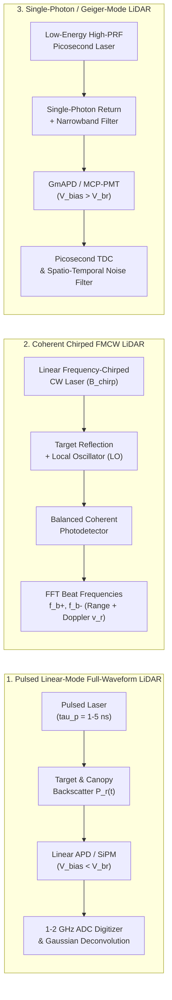

# Chapter 9: Topographic and Bathymetric LiDAR

*Active laser ranging from land, air, and orbit: discrete returns, full waveforms, single-photon counting, and crossing the air-water boundary.*

Whereas passive optical photogrammetry and synthetic aperture radar infer terrain elevation from solar-illuminated parallax or microwave phase interferometry, Light Detection and Ranging (LiDAR)—also termed Airborne Laser Scanning (ALS), Terrestrial Laser Scanning (TLS), or Spaceborne Laser Altimetry—actively illuminates the Earth's surface with directed optical pulses of high spectral, spatial, and temporal coherence. Because each laser shot probes the surface along a tightly collimated line of sight ($0.1\text{–}1.0\text{ mrad}$ divergence) and resolves echoes in time with picosecond-to-nanosecond precision, LiDAR uniquely penetrates small gaps in forest canopies to sample the underlying bare earth and—when operated in the blue-green optical window ($532\text{ nm}$)—crosses the air-water interface to map coastal, estuarine, and riverine bathymetry. This chapter establishes the physical principles, optomechanical scanning geometries, detector architectures, refractive ray-tracing equations, and error budgets governing topographic and bathymetric LiDAR systems across terrestrial, airborne, and orbital platforms.

---

## 9.1 Topographic LiDAR Principles and Architectures

Topographic LiDAR systems determine the three-dimensional coordinates of surface scatterers by combining a precise range measurement $R$ along an instantaneous beam vector $\hat{\mathbf{u}}_{\text{beam}}$ with the position and attitude of the sensor platform (provided by an integrated Global Navigation Satellite System and Inertial Navigation System, GNSS/INS, detailed in Chapter 5 and Section 9.6.3). The fidelity of the resulting point cloud and Digital Terrain Model (DTM) is fundamentally bounded by the physics of the laser ranging architecture, the kinematics of the beam-steering mechanism, and the optoelectronic response of the receiver detector.



---

### 9.1.1 Laser Ranging Physics: Pulsed ToF, Phase-Shift CW, and Coherent FMCW

Three primary modulation and detection schemes govern modern laser ranging: **Pulsed Time-of-Flight (ToF)**, **Continuous-Wave (CW) Phase-Shift**, and **Coherent Frequency-Modulated Continuous-Wave (FMCW)**.

#### Pulsed Time-of-Flight (ToF) and Atmospheric Group Refractivity

In a pulsed ToF architecture, a Q-switched solid-state laser (typically Nd:YAG at $\lambda = 1064\text{ nm}$ or frequency-doubled $532\text{ nm}$) or a master-oscillator power-amplifier (MOPA) fiber laser ($\lambda = 1550\text{ nm}$) emits short optical pulses of duration $\tau_p$ ($0.5\text{–}8\text{ ns}$ full-width at half-maximum, FWHM) at a Pulse Repetition Frequency (PRF) ranging from $10\text{ kHz}$ to over $2\text{ MHz}$. A reference photodiode samples the outgoing pulse at $t_{\text{emit}}$, and a receiving telescope focuses the backscattered photons onto a high-speed photodetector that records the arrival time $t_{\text{recv}}$. The slant range $R$ (in $\text{m}$) is given by the two-way propagation integral:

$$R = \frac{c_0}{2\,\bar{n}_{\text{g,air}}}\,\Delta t, \qquad \Delta t = t_{\text{recv}} - t_{\text{emit}}$$

where:
* $c_0 = 299\,792\,458\text{ m s}^{-1}$ is the speed of light in vacuum (exact by SI definition),
* $\Delta t$ is the round-trip travel time (in $\text{s}$), and
* $\bar{n}_{\text{g,air}}$ is the path-averaged **group refractive index** of the atmosphere along the laser ray path (dimensionless).

Because a short laser pulse is a wave packet comprising a spectrum of frequencies rather than an infinite monochromatic wave, it propagates at the *group velocity* $v_g = c_0 / n_{\text{g,air}}$, where $n_{\text{g,air}} = n_{\text{p,air}} - \lambda_0 \frac{dn_{\text{p,air}}}{d\lambda}$. From the Ciddor (1996) equation for standard dry air at sea level ($T = 15^\circ\text{C}$, $P = 1013.25\text{ hPa}$, $450\text{ ppm}$ $\text{CO}_2$), the group refractivity $(n_{\text{g,air}} - 1) \times 10^6$ is approximately $279.2\text{ ppm}$ at $\lambda = 1064\text{ nm}$ and $287.8\text{ ppm}$ at $\lambda = 532\text{ nm}$. Neglecting $\bar{n}_{\text{g,air}}$ by setting $v_g = c_0$ from an airborne survey altitude of $H = 1\,500\text{ m}$ introduces a systematic long-range (low-elevation) bias of $\Delta R \approx +0.42\text{ m}$. Operational processing pipelines therefore evaluate $\bar{n}_{\text{g,air}}(T, P, e, \lambda)$ along the ray path using meteorological profiles of temperature $T$, pressure $P$, and water vapor partial pressure $e$.

#### Timing Discriminators and Amplitude-Dependent Range Walk

The precision with which $\Delta t$ can be measured depends critically on the timing discriminator circuit or waveform algorithm used to define pulse arrival:

1. **Leading-Edge Threshold Discriminator:** The simplest hardware timing circuit triggers a Time-to-Digital Converter (TDC) at the instant the amplified receiver voltage $V(t)$ crosses a fixed voltage threshold $V_{\text{th}}$ set above the electronic noise floor $V_{\text{noise}}$. Because the transmitted pulse has a finite rise time ($\sim 1\text{–}3\text{ ns}$), a high-reflectance target (e.g., bright concrete or snow, producing a high-amplitude return $V_{\max,\text{bright}}$) has a much steeper rising edge than a low-reflectance target (e.g., wet asphalt or dark soil, $V_{\max,\text{dark}}$) located at the *exact same true geometric range* $R$. Consequently, the bright pulse crosses $V_{\text{th}}$ earlier in time by $\delta t_{\text{walk}}$, creating a systematic **amplitude-dependent range walk** ($\Delta R_{\text{walk}} = -\frac{c}{2}\delta t_{\text{walk}} < 0$). For a Gaussian pulse of RMS width $\sigma_t = \tau_p / \sqrt{8\ln 2}$, a leading-edge threshold at $V_{\text{th}}$ shifts the measured range relative to the pulse peak by:

$$\Delta R_{\text{walk}}(A) = -\frac{c_0\,\sigma_t}{2\,\bar{n}_{\text{g,air}}}\sqrt{2\ln\!\left(\frac{A}{V_{\text{th}}}\right)}$$

where $A$ is the peak return voltage. Across natural reflectance contrasts ($A / V_{\text{th}}$ varying from $1.5$ to $50$), leading-edge range walk can exceed $15\text{–}35\text{ cm}$ for a $\tau_p = 4\text{ ns}$ pulse.
2. **Constant Fraction Discriminator (CFD) and Centroid Detection:** To eliminate amplitude-dependent range walk for symmetric pulses, a Constant Fraction Discriminator splits the incoming electrical pulse into two paths: one path is attenuated by a constant fraction $f_{\text{CFD}} \in (0.2, 0.5)$, while the second path is inverted and delayed by $t_d$ (chosen such that $t_d \approx \sigma_t \sqrt{2\ln(1/f_{\text{CFD}})}$). Summing the two signals produces a bipolar waveform whose zero-crossing time $t_{\text{CFD}}$ depends only on pulse shape and arrival time, remaining invariant to peak amplitude $A$ over a wide dynamic range (until detector saturation occurs).

#### Vertical Two-Target Range Resolution Limit

When a single laser pulse illuminates vertically distributed scatterers—such as tree branches over bare ground, powerlines above a roadway, or low coastal shrub vegetation—the receiver sees a superposition of time-delayed echoes. Two targets separated along the beam path by a radial distance $\Delta R$ produce distinct, non-overlapping peaks in the return waveform only if their round-trip time separation $\Delta t = 2 \bar{n}_{\text{g,air}} \Delta R / c_0$ equals or exceeds the effective system pulse duration $\tau_p$ (FWHM):

$$\Delta R_{\min} = \frac{c_0\,\tau_p}{2\,\bar{n}_{\text{g,air}}} \approx \frac{c\,\tau_p}{2}$$

For a standard airborne topographic LiDAR with $\tau_p = 4.0\text{ ns}$, the fundamental two-target range resolution limit is:

$$\Delta R_{\min} \approx \frac{(3.00 \times 10^8\text{ m s}^{-1})(4.0 \times 10^{-9}\text{ s})}{2} = 0.60\text{ m}$$

> [!WARNING]
> **Why a $4\text{ ns}$ Pulse Cannot Resolve Ground Beneath Low Shrub Cover ($< 60\text{ cm}$):**
> When a $\tau_p = 4\text{ ns}$ laser pulse strikes short vegetation—such as sagebrush, arctic tundra tussocks, salt-marsh *Spartina* grass, or agricultural crops with canopy height $h_{\text{veg}} < 0.60\text{ m}$—the echo from the vegetation top and the echo from the underlying soil arrive separated by less than $4\text{ ns}$. Instead of forming two resolvable peaks, they merge into a single broadened, skewed composite waveform. Discrete-return hardware discriminators (even with CFD) trigger on this composite pulse and record only a **single return** whose range is biased upward toward the vegetation canopy centroid by $10\text{–}40\text{ cm}$ depending on fractional foliage cover and reflectance at $\lambda$. Unless full-waveform deconvolution with generalized Gaussian models or sub-nanosecond pulses ($\tau_p \le 1\text{ ns}$) are employed, this unresolved vegetation bias propagates directly into bare-earth DTMs as a persistent positive elevation error ($\Delta z > 0$).

#### Continuous-Wave (CW) Multi-Frequency Phase-Shift Ranging

In close-range Terrestrial Laser Scanners (TLS, $R < 150\text{–}300\text{ m}$), generating sub-nanosecond pulses with sub-millimeter timing jitter is cost-prohibitive. Instead, CW phase-shift scanners emit a continuous laser beam whose optical intensity is sinusoidally modulated at a sequence of radio frequencies $f_{\text{mod},i}$ (corresponding to modulation wavelengths $\lambda_{\text{mod},i} = \frac{c_0}{\bar{n}_{\text{g,air}} f_{\text{mod},i}}$). By measuring the phase difference $\Delta\phi_i \in [0, 2\pi)$ between the emitted and received modulation envelopes using quadrature mixing, the slant range is obtained as:

$$R = \frac{\lambda_{\text{mod},i}}{4\pi}\,\Delta\phi_i + m_i\,\frac{\lambda_{\text{mod},i}}{2}$$

where $m_i \in \mathbb{Z}_{\ge 0}$ is the unknown integer number of half-wavelength cycles (**ambiguity interval** $R_{\text{unamb},i} = \frac{\lambda_{\text{mod},i}}{2}$). Because phase measurement precision scales inversely with modulation wavelength ($\sigma_R = \frac{\lambda_{\text{mod}}}{4\pi}\sigma_\phi \propto \frac{1}{f_{\text{mod}}\,\sqrt{\text{SNR}}}$), CW scanners simultaneously modulate the beam with 3 to 4 hierarchical frequencies: a coarse frequency (e.g., $f_1 = 1.2\text{ MHz} \Rightarrow R_{\text{unamb},1} = 125\text{ m}$) fixes the integer $m$ without ambiguity, while a fine frequency (e.g., $f_3 = 150\text{ MHz} \Rightarrow R_{\text{unamb},3} = 1.00\text{ m}$) delivers millimeter-level range precision ($\sigma_R < 0.5\text{ mm}$). However, because a CW receiver integrates phase over the entire modulation cycle, any beam that splits across a foreground edge (e.g., a building corner or wire) and a background wall sums two phasors $A_1 e^{i\phi_1} + A_2 e^{i\phi_2}$, yielding a synthetic **mixed-pixel ("veil point")** at a phantom intermediate range that never physically existed.

#### Coherent Frequency-Modulated Continuous-Wave (FMCW) Chirped LiDAR

Coherent FMCW LiDAR sweeps the optical carrier frequency $\nu(t)$ of a narrow-linewidth laser ($\lambda_0 \approx 1550\text{ nm}$) linearly across a wide chirp bandwidth $B_{\text{chirp}}$ (typically $1\text{–}10\text{ GHz}$) over a symmetric triangular up-chirp and down-chirp period $2 T_{\text{chirp}}$. On the receiver, the weak backscattered optical field $E_{\text{rx}}(t) = E_{\text{tx}}(t - \Delta t)$ is mixed coherently with a reference tap of the transmitted Local Oscillator (LO) field $E_{\text{LO}}(t)$ on a balanced PIN photodetector. Optical heterodyne interference produces radio-frequency beat signals $f_b^+$ (during the up-chirp) and $f_b^-$ (during the down-chirp) that simultaneously encode target range $R$ and radial Doppler velocity $v_r$ (in $\text{m s}^{-1}$, positive toward sensor):

$$R = \frac{c_0\,T_{\text{chirp}}}{4\,\bar{n}_{\text{g,air}}\,B_{\text{chirp}}}\left(f_b^+ + f_b^-\right), \qquad v_r = \frac{\lambda_0}{4}\left(f_b^- - f_b^+\right)$$

Unlike pulsed ToF, the two-target range resolution of FMCW LiDAR is independent of chirp duration $T_{\text{chirp}}$ and is governed strictly by the swept optical bandwidth:

$$\Delta R_{\min,\text{FMCW}} = \frac{c_0}{2\,\bar{n}_{\text{g,air}}\,B_{\text{chirp}}}$$

Thus, a $B_{\text{chirp}} = 5\text{ GHz}$ sweep resolves targets separated by $\Delta R_{\min} = 3.0\text{ cm}$ while operating at low peak optical power (eye-safe CW). Moreover, because coherent mixing amplifies the signal field by $|E_{\text{LO}}|$ and only responds to photons matching the polarization and instantaneous frequency ramp of the LO, FMCW sensors achieve shot-noise-limited sensitivity and are virtually immune to solar background glare and cross-talk from other LiDAR sensors.

| Ranging Architecture | Typical Wavelength $\lambda$ | Range Resolution $\Delta R_{\min}$ | Precision $\sigma_R$ ($1\sigma$) | Max Operational Range $R_{\max}$ | Multi-Return / Edge Behavior | Primary Topographic Applications |
| :--- | :--- | :--- | :--- | :--- | :--- | :--- |
| **Pulsed ToF (Linear-Mode)** | $905, 1064, 1550\text{ nm}$ ($532\text{ nm}$ bathy) | $\frac{c\tau_p}{2} \approx 15\text{–}75\text{ cm}$ ($\tau_p = 1\text{–}5\text{ ns}$) | $5\text{–}25\text{ mm}$ | $100\text{ m} \text{ to } >5\text{ km}$ (Airborne) | True multi-return & full-waveform deconvolution | Airborne ALS, UAV LiDAR, mobile mapping, long-range TLS |
| **CW Phase-Shift** | $650\text{–}1550\text{ nm}$ | N/A (single integrated phase per beam) | $0.2\text{–}2.0\text{ mm}$ | $50\text{–}300\text{ m}$ ($R_{\text{unamb}} = \frac{c}{2f_{\min}}$) | Severe mixed-pixel ("veil") artifacts on edges/foliage | High-precision close-range TLS, industrial metrology, tunnels |
| **Coherent FMCW** | $1550\text{ nm}$ | $\frac{c}{2 B_{\text{chirp}}} \approx 1.5\text{–}15\text{ cm}$ ($B = 1\text{–}10\text{ GHz}$) | $0.1\text{–}3.0\text{ mm}$ | $100\text{–}1\,000\text{ m}$ | Multi-peak FFT spectrum + instantaneous Doppler $v_r$ | UAV/automotive navigation, wind/structural vibration TLS |
| **Single-Photon / GmAPD ToF** | $532\text{ nm}$ (SPL), $1064\text{ nm}$ (GmAPD) | $\frac{c\tau_p}{2} \approx 2\text{–}25\text{ cm}$ ($\tau_p = 0.1\text{–}1.6\text{ ns}$) | $15\text{–}50\text{ mm}$ (subject to FPB) | $4\text{–}12\text{ km}$ (Airborne), $500\text{ km}$ (Orbit) | Statistical multi-surface histogramming; dead-time masking | Statewide high-altitude ALS, spaceborne altimetry (ICESat-2) |

---

### 9.1.2 Optomechanical and Solid-State Scanning Mechanisms & Ground Pattern Geometry

To sweep the laser line of sight across a swath width $W = 2 H \tan\theta_{\max}$ beneath a moving platform at altitude $H$ and ground speed $v_{\text{ac}}$, topographic LiDAR systems employ optomechanical or solid-state beam deflectors. The choice of scanner dictates both the spatial uniformity of the point cloud and the angular error budget:

1. **Oscillating Plane Mirrors (Sawtooth / Sinusoidal Zig-Zag Pattern):** A flat mirror mounted on a galvanometer shaft oscillates back and forth across $\pm\theta_{\max}$. As the aircraft advances, the beam traces a bidirectional zig-zag pattern on the ground. Because a physical mirror with moment of inertia $I_m$ cannot reverse direction instantaneously at the swath edges, it must decelerate to $\dot{\theta} = 0$ and re-accelerate. This harmonic velocity profile causes severe **cross-track point density non-uniformity**: laser shots pile up densely at the swath edges while spacing stretches out near nadir. Furthermore, high angular acceleration $\ddot{\theta}$ at reversal points induces mechanical shaft torsion and encoder hysteresis, often requiring operators to discard the outer $5\text{–}10\%$ of the scan swath during strip adjustment.
2. **Rotating Polygonal Mirrors (Unidirectional Parallel Scan Lines):** A multi-faceted polygonal mirror (typically 3 to 6 reflective facets) rotates continuously in one direction at constant angular velocity $\omega$. Every facet sweeps the beam across the swath in the exact same cross-track direction, generating evenly spaced, parallel scan lines on the ground with constant scan speed $\dot{\theta} = 2\omega$ and zero turnaround deceleration torque.
3. **Palmer (Nutating Elliptical / Conical) Scanners:** A mirror tilted at a fixed angle $\alpha_m$ rotates continuously about an axis tilted relative to the laser beam, sweeping out a cone of constant half-angle $\theta_{\text{inc}}$. On flat terrain, the ground intersection forms an ellipse (which translates into overlapping loops as the aircraft moves forward). Palmer scanners offer two decisive advantages: (a) they maintain a **nearly constant incidence angle** $\theta_{\text{inc}}$ across the entire swath (essential in bathymetric LiDAR to stabilize air-water Snell refraction, Section 9.2.3), and (b) every ground location within the swath is sampled twice per pass—once on the forward-looking arc and once on the backward-looking arc—providing built-in multi-angle canopy penetration and boresight self-calibration.
4. **Risley Dual-Wedge Prisms (Non-Repetitive Rosette Patterns):** Two coaxial wedge prisms with small apex angles $\alpha_1, \alpha_2$ rotate independently at angular velocities $\omega_1, \omega_2$. By refracting the transmitted and received beams through both wedges, the net deflection vector traces either a circular/spiral scan or, when $\omega_1 / \omega_2$ is an irrational or non-integer ratio, a **non-repetitive multi-petal rosette pattern** (used in compact UAV LiDARs such as Livox and in sub-aperture scanners like the Leica SPL100). Risley prisms require no reciprocating motion and are mechanically balanced, though point density naturally concentrates near the central optical axis.
5. **MEMS Micro-Mirrors and 2D Focal-Plane Flash LiDAR:** Micro-Electro-Mechanical Systems (MEMS) torsion mirrors oscillate silicon reflectors ($1\text{–}5\text{ mm}$ diameter) at kilohertz resonant frequencies for lightweight UAV payloads, but their tiny aperture $D_r$ limits photon collection ($P_r \propto D_r^2 / R^4$). Conversely, **2D Focal-Plane Flash LiDAR** eliminates beam steering entirely: a diffuser expands each high-energy laser pulse over the full field of view, and a 2D Readout Integrated Circuit (ROIC) detector array (e.g., $128 \times 128$ or $256 \times 256$ PIN/GmAPD pixels) records an entire depth image from a single laser shot, eliminating motion distortion during dynamic maneuvers.

#### Beam Divergence, Footprint Diameter, and Slope-Induced Pulse Stretching

Because of optical diffraction and multimode laser cavity geometry, a laser beam expands with full-angle divergence $\beta_t$ (in $\text{rad}$, typically $0.15\text{–}1.0\text{ mrad}$ for airborne systems). At slant range $R$, the instantaneous circular footprint diameter $D_{\text{fp}}$ (for normal incidence) is:

$$D_{\text{fp}}(R) = D_0 + 2 R \tan\!\left(\frac{\beta_t}{2}\right) \approx D_0 + R\,\beta_t$$

where $D_0$ is the exit beam diameter at the sensor aperture (in $\text{m}$). When this footprint illuminates a planar surface inclined at a local angle $\alpha_{\text{slope}}$ relative to the plane normal to the beam axis (where $\alpha_{\text{slope}} = \theta_{\text{slope}}$ for a nadir shot on terrain slope $\theta_{\text{slope}}$), the projected footprint elongates into an ellipse of major axis $D_{\text{fp}} / \cos\alpha_{\text{slope}}$ and spreads across a radial range interval $\Delta R_{\text{foot}} = R\,\beta_t \tan\alpha_{\text{slope}}$.

Consequently, photons striking the upslope edge of the footprint return earlier than photons striking the downslope edge. Assuming a Gaussian spatial beam profile with $1\sigma$ radial footprint width $\sigma_r = R\,\beta_t / 2$ (where $\beta_t$ is defined at the $2\sigma$ / $1/e^2$ intensity radius) and a Gaussian transmitted pulse of RMS temporal width $\sigma_{t,0} = \tau_p / \sqrt{8\ln 2}$, two-way round-trip convolution ($\Delta t = 2\,\Delta R / c_0$) over the inclined footprint stretches the RMS temporal width of the received echo to $\sigma_{t,\text{stretch}}$ (Gardner, 1992; Baltsavias, 1999):

$$\sigma_{t,\text{stretch}}^2 = \sigma_{t,0}^2 + \left(\frac{2\,\sigma_r\,\tan\alpha_{\text{slope}}}{c_0}\right)^2 = \sigma_{t,0}^2 + \left(\frac{R\,\beta_t\,\tan\alpha_{\text{slope}}}{c_0}\right)^2$$

Because total backscattered pulse energy $E_r \propto A_k\,\sigma_{t,\text{stretch}}$ is conserved across the stretched waveform, temporal stretching reduces the peak voltage amplitude by $A_k = A_0 (\sigma_{t,0} / \sigma_{t,\text{stretch}})$ and flattens the pulse slope. The resulting single-shot range uncertainty $\sigma_R$ degrades according to:

$$\sigma_R = \frac{c_0}{2\,\bar{n}_{\text{g,air}}}\,\frac{\sigma_{t,\text{stretch}}}{\text{SNR}_V} \propto \frac{\sigma_{t,\text{stretch}}^2}{\sigma_{t,0}}$$

On steep cliffs or canyon walls ($\alpha_{\text{slope}} > 60^\circ$) surveyed from high altitude with a wide beam ($\beta_t = 0.5\text{–}1.0\text{ mrad}$), $\sigma_{t,\text{stretch}}$ can exceed $3\text{–}5\times \sigma_{t,0}$, degrading vertical precision from $\pm 2\text{ cm}$ to $\pm 20\text{–}50\text{ cm}$ or causing the stretched peak to drop below the detection threshold entirely (resulting in cliff-face data voids).

---

### 9.1.3 Linear-Mode (Discrete & Full-Waveform) vs. Geiger-Mode and Single-Photon LiDAR (SPL)

Topographic LiDAR receivers are divided into two fundamentally distinct optoelectronic regimes based on how their photodetectors convert backscattered photons into timing events: **Linear-Mode** and **Photon-Counting (Geiger-Mode / SPL)**.

#### Linear-Mode APD / SiPM and Full-Waveform Gaussian Decomposition

In a **Linear-Mode LiDAR**, an Avalanche Photodiode (InGaAs at $1550\text{ nm}$ or Si at $905/1064\text{ nm}$) or Silicon Photomultiplier (SiPM) is biased *below* its reverse breakdown voltage ($V_{\text{bias}} < V_{\text{br}}$), providing a linear internal avalanche gain ($M \approx 20\text{–}200$). The output electrical current $i_{\text{det}}(t)$ is directly proportional to the instantaneous received optical power $P_r(t)$. Overcoming thermal Johnson noise and amplifier dark current in linear mode requires roughly $250\text{ to }1\,000\text{ photoelectrons}$ per return pulse.

* **Discrete Multi-Return Systems:** Analog or digital threshold/CFD comparators detect up to $4\text{–}15$ discrete returns per transmitted pulse (e.g., First, Intermediate, Last). However, after triggering on an echo, analog timing circuits experience an electronic **detector/discriminator dead-time** $\tau_{\text{dead}}$ (typically $2.5\text{–}6\text{ ns}$, or $0.38\text{–}0.90\text{ m}$ in range) during which a subsequent weaker echo is masked.
* **Full-Waveform Digitization and Decomposition:** Full-waveform LiDAR systems sample the entire continuous receiver voltage $P_r(t)$ using a high-speed Analog-to-Digital Converter (ADC) operating at $1\text{–}2\text{ GHz}$ ($0.5\text{–}1.0\text{ ns}$ sample spacing, equivalent to $7.5\text{–}15\text{ cm}$ range bins), storing the digitized waveforms in `LAS 1.3/1.4` Wave Packet Descriptors or the open `PulseWaves` format. Following Wagner et al. (2006), when the transmitted laser pulse and the system impulse response are approximately Gaussian, the recorded waveform $P_r(t)$ from $K$ distinct scattering surfaces within the beam footprint is modeled as a sum of $K$ Gaussian echoes plus a baseline background power $P_{\text{bg}}$:

$$P_r(t) = \sum_{k=1}^{K} A_k \exp\!\left(-\frac{(t - t_k)^2}{2\,s_k^2}\right) + P_{\text{bg}}$$

where:
* $A_k$ is the peak amplitude of the $k$-th return component (in $\text{W}$ or digitized counts),
* $t_k$ is the precise arrival centroid time of the $k$-th echo (in $\text{s}$),
* $s_k$ is the RMS echo width of the $k$-th return (in $\text{s}$, where $s_k = \sigma_{t,\text{stretch},k}$), and
* $P_{\text{bg}}$ is the continuous solar background and detector dark-current offset.

By fitting this parametric model via non-linear least squares (Levenberg-Marquardt) or Richardson-Lucy deconvolution, full-waveform processing resolves closely spaced multi-story canopy layers and extracts weak sub-canopy ground echoes that would otherwise be lost in the trailing edge of a canopy return. Furthermore, the integral of each Gaussian component $\propto A_k s_k$ yields a calibrated backscatter cross-section $\sigma_k$, while the excess pulse broadening $\sqrt{s_k^2 - \sigma_{t,0}^2}$ distinguishes rough vegetation crowns ($s_k \gg \sigma_{t,0}$) from smooth bare ground ($s_k \approx \sigma_{t,0}$), markedly improving ground classification accuracy.

#### Geiger-Mode LiDAR (GmAPD) and Single-Photon LiDAR (SPL)

By biasing an APD pixel *above* its reverse breakdown voltage ($V_{\text{bias}} > V_{\text{br}}$) or utilizing a high-gain Micro-Channel Plate Photomultiplier Tube (MCP-PMT), a **single absorbed photon** triggers a self-sustaining avalanche pulse large enough to clock a digital TDC directly. Requiring only $1\text{–}10\text{ photoelectrons}$ per pulse reduces the required per-beam laser pulse energy by two to three orders of magnitude compared to linear-mode LiDAR, enabling dramatic gains in areal collection efficiency from high airborne altitudes ($4\text{–}10\text{ km}$) or Low Earth Orbit ($500\text{ km}$):

1. **Geiger-Mode LiDAR (GmAPD, e.g., L3Harris IntelliEarth):** Splits a $1064\text{ nm}$ laser pulse across a 2D focal-plane array (e.g., $32 \times 128 = 4\,096$ GmAPD pixels) swept by a Palmer scanner from $6\text{–}10\text{ km}$ altitude. Once a GmAPD pixel fires on a single photon, it is completely blind until actively quenched and reset ($\tau_{\text{dead}} \approx 40\text{–}50\text{ ns}$, or $\sim 6\text{–}7.5\text{ m}$ in range). Thus, each pixel records at most *one* photon event per laser shot, and penetration through forest canopies relies on aggregating thousands of overlapping multi-angle shots across the Palmer scan.
2. **Single-Photon LiDAR (SPL, e.g., Leica SPL100, NASA ICESat-2 ATLAS):** Employs a Diffractive Optical Element (DOE) to split a $532\text{ nm}$ picosecond laser pulse ($\tau_p \approx 0.1\text{–}1.5\text{ ns}$) into an array of beamlets (e.g., a $10 \times 10$ array of $100$ beamlets in the Leica SPL100, or $6$ beams in ICESat-2 ATLAS), each imaged onto a multi-element MCP-PMT or segmented GmAPD receiver with a very short recovery dead time ($\tau_{\text{dead}} \approx 1.6\text{–}3.2\text{ ns}$, corresponding to $24\text{–}48\text{ cm}$ range dead zone). Because the detector resets within nanoseconds, a single SPL beamlet can record multiple photons—from the upper canopy, mid-story, and ground—on a single laser shot.

| System Characteristic | Linear-Mode LiDAR (Discrete / Full-Waveform) | Geiger-Mode LiDAR (GmAPD) | Single-Photon LiDAR (SPL) |
| :--- | :--- | :--- | :--- |
| **Detector Technology** | Pin / Linear APD / SiPM ($V_{\text{bias}} < V_{\text{br}}$) | 2D GmAPD Array ($V_{\text{bias}} > V_{\text{br}}$) | Segmented MCP-PMT / Fast SPAD Array |
| **Sensitivity Threshold** | $\sim 250\text{–}1\,000\text{ photoelectrons}$ | $1\text{ photoelectron}$ | $1\text{–}3\text{ photoelectrons}$ |
| **Typical Wavelength** | $1064\text{ nm}$ or $1550\text{ nm}$ ($532\text{ nm}$ bathy) | $1064\text{ nm}$ | $532\text{ nm}$ (enables dual topo + shallow bathy) |
| **Detector Dead-Time $\tau_{\text{dead}}$** | $0\text{ ns}$ (Full-Waveform ADC); $2.5\text{–}5\text{ ns}$ (Discrete) | $\sim 45\text{–}50\text{ ns}$ ($\sim 6.7\text{–}7.5\text{ m}$ blind zone per shot) | $\sim 1.6\text{–}3.2\text{ ns}$ ($\sim 24\text{–}48\text{ cm}$ blind zone) |
| **Solar Background Noise** | Negligible (below threshold / baseline subtracted) | High (requires narrow filter + 3D voxel filtering) | Moderate-High ($532\text{ nm}$ solar peak; requires etalon filter) |
| **First-Photon Bias (Range Walk)** | None (if CFD or Gaussian centroid fitted) | Present on high-reflectance targets | Present on bright targets ($1\text{–}10\text{ cm}$ upward bias) |

#### Solar Background Noise, First-Photon Bias, and Canopy Filtering Caveats

Single-photon sensitivity introduces three critical physical error sources that do not affect linear-mode full-waveform sensors:

1. **Solar Background Photon Rate ($N_{\text{bg}}$):** During daytime operations, solar radiation reflected by the terrain, clouds, and atmosphere enters the receiver aperture and triggers random false-alarm avalanches distributed uniformly across the range gate. For a diffuse Lambertian surface of hemispherical reflectance $\rho_{\text{surf}}$ (whose bidirectional reflectance distribution function is $\rho_{\text{surf}} / \pi\text{ sr}^{-1}$), the mean solar background photoelectron rate $\lambda_{\text{bg}}$ (in $\text{s}^{-1}$) per detector channel is:

$$\lambda_{\text{bg}} = \frac{\eta_{\text{QE}}\,\lambda}{h\,c_0}\,E_{\odot,\lambda}\,\Delta\lambda_{\text{filt}}\,A_{\text{rx}}\,\Omega_{\text{FOV}}\,\frac{\rho_{\text{surf}}}{\pi}\,\cos\theta_{\odot}\,T_{\text{atm}}^2$$

where $\eta_{\text{QE}}$ is detector quantum efficiency, $h = 6.626 \times 10^{-34}\text{ J s}$ is Planck's constant, $E_{\odot,\lambda}$ is top-of-atmosphere solar spectral irradiance (in $\text{W m}^{-2}\text{ nm}^{-1}$, which peaks near $532\text{ nm}$!), $\Delta\lambda_{\text{filt}}$ is the optical bandpass filter width, $A_{\text{rx}} = \pi D_r^2 / 4$ is the receiver aperture area, and $\Omega_{\text{FOV}} = \pi \beta_{\text{rx}}^2 / 4$ is the receiver solid-angle field of view. To keep $\lambda_{\text{bg}}$ manageable ($< 1\text{–}10\text{ MHz}$), SPL and GmAPD systems must combine ultra-narrow optical filters ($\Delta\lambda_{\text{filt}} \approx 30\text{–}150\text{ pm}$ via thermally stabilized Fabry-Pérot etalons) with tight spatial field stops ($\beta_{\text{rx}}$ closely matched to each beamlet).
2. **First-Photon Bias (Dead-Time Range Walk):** When a single-photon detector or a finite-channel PMT array illuminates a bright surface (e.g., snow, ice, white rooftops, or specular water facets) that returns a mean of $\bar{N}_{\text{pe}} > 1$ photoelectrons per pulse, the detector fires on the *first* arriving photon and immediately enters its dead-time interval $\tau_{\text{dead}}$, censoring later photons in the same pulse. Because the first order statistic of $N_{\text{pe}}$ independent arrivals drawn from a Gaussian pulse $\mathcal{N}(t_0, \sigma_t^2)$ is shifted earlier than the mean $t_0$, the measured range exhibits a systematic short-range (upward elevation) **first-photon bias** $\Delta R_{\text{FPB}} < 0$:

$$\Delta R_{\text{FPB}}(\bar{N}_{\text{pe}}) = \frac{c_0}{2\,\bar{n}_{\text{g,air}}}\,\frac{\int_{-\infty}^{\infty} (t - t_0)\,\lambda_s(t)\,\exp\!\left(-\int_{t - \tau_{\text{dead}}}^{t} \lambda_s(\tau)\,d\tau\right) dt}{\int_{-\infty}^{\infty} \lambda_s(t)\,\exp\!\left(-\int_{t - \tau_{\text{dead}}}^{t} \lambda_s(\tau)\,d\tau\right) dt}$$

where $\lambda_s(t) = \frac{\bar{N}_{\text{pe}}}{\sqrt{2\pi}\sigma_t}\exp\!\left(-\frac{(t-t_0)^2}{2\sigma_t^2}\right)$ is the instantaneous signal photon arrival rate. For $\tau_p = 1.5\text{ ns}$ ($\sigma_t = 0.64\text{ ns}$), increasing return strength from $\bar{N}_{\text{pe}} = 0.2$ (dark soil/canopy gap) to $\bar{N}_{\text{pe}} = 8.0$ (bright snow or concrete) shifts the apparent elevation upward by $+5\text{ to }+12\text{ cm}$ unless a radiometric dead-time correction table (such as the ICESat-2 ATL03/ATL06 first-photon bias correction) is applied.
3. **Spatial/Density Noise Filtering Caveats in Dense Vegetation:** Because raw SPL and GmAPD point clouds contain millions of random solar noise points above and below the terrain, automated 3D spatial density filters (e.g., 3D voxel histogramming, ellipsoidal k-nearest-neighbor density tests, or the ICESat-2 DRAGANN filter) are applied prior to ground classification to retain only statistically dense photon clusters. Under dense forest canopies ($>85\text{–}95\%$ fractional cover), however, two-way canopy transmission $T_{\text{canopy}}^2 = (1 - f_{\text{cover}})^2$ reduces the genuine ground return rate to isolated single photons separated by several meters horizontally. Aggressive noise-removal filters cannot distinguish these sparse, isolated true ground photons from random solar background noise and systematically prune them out, leaving large ground voids that force DTM interpolators to bridge across upper root/understory clusters.

#### Operational Quality Levels: USGS 3DEP (`QL0`–`QL2`) and ASPRS Accuracy Standards

Regardless of whether a topographic point cloud is acquired by a linear-mode, single-photon, or Geiger-mode architecture, national mapping agencies acceptance-test the final calibrated point cloud and bare-earth DEM against technology-agnostic density and vertical accuracy thresholds defined by the **USGS 3D Elevation Program (3DEP) Lidar Base Specification** (USGS, 2024) and the **ASPRS Positional Accuracy Standards for Digital Geospatial Data** (ASPRS, 2023):

| USGS 3DEP Quality Level | Aggregate Nominal Pulse Density ($\text{ANPD}$) | Aggregate Nominal Pulse Spacing ($\text{ANPS}$) | Max Swath-to-Swath Vertical $\text{RMSD}_z$ | Vertical $\text{RMSE}_z$ (Non-Vegetated) | $\text{NVA}_{95\%}$ ($= 1.9600\,\text{RMSE}_z$) | $\text{VVA}_{95\text{th}}$ ($95\text{th}$ Percentile) |
| :--- | :--- | :--- | :--- | :--- | :--- | :--- |
| **`QL0`** (Ultra-High) | $\ge 8.0\text{ pulses m}^{-2}$ | $\le 0.35\text{ m}$ | $\le 0.040\text{ m}$ | $\le 0.050\text{ m}$ ($5.0\text{ cm}$) | $\le 0.098\text{ m}$ | $\le 0.150\text{ m}$ |
| **`QL1`** (High-Res Standard) | $\ge 8.0\text{ pulses m}^{-2}$ | $\le 0.35\text{ m}$ | $\le 0.080\text{ m}$ | $\le 0.100\text{ m}$ ($10.0\text{ cm}$) | $\le 0.196\text{ m}$ | $\le 0.300\text{ m}$ |
| **`QL2`** (National Baseline) | $\ge 2.0\text{ pulses m}^{-2}$ | $\le 0.71\text{ m}$ | $\le 0.080\text{ m}$ | $\le 0.100\text{ m}$ ($10.0\text{ cm}$) | $\le 0.196\text{ m}$ | $\le 0.300\text{ m}$ |

---

### 9.1.4 Worked Numerical Example: Resolution, Slope Stretching, and Range Walk

Consider an airborne linear-mode topographic LiDAR operating at $\lambda = 1064\text{ nm}$ ($\bar{n}_{\text{g,air}} = 1.00028$) from $H = 1\,200\text{ m}$ above ground level (AGL) with exit aperture $D_0 = 0.02\text{ m}$, beam divergence $\beta_t = 0.50\text{ mrad}$, and transmitted pulse FWHM $\tau_p = 4.0\text{ ns}$ ($\sigma_{t,0} = \tau_p / 2.3548 = 1.699\text{ ns}$).

1. **Vertical Two-Target Resolution ($\Delta R_{\min}$):**
   $$\Delta R_{\min} = \frac{299\,792\,458\text{ m s}^{-1} \times 4.0 \times 10^{-9}\text{ s}}{2 \times 1.00028} = 0.5994\text{ m} \approx 60.0\text{ cm}$$
   *Consequence:* Over a coastal marsh covered by $40\text{ cm}$ tall *Spartina* grass, the canopy top and mudflat echoes are separated by only $2.67\text{ ns} < 4.0\text{ ns}$, merging into a single composite waveform peak.
2. **Footprint Diameter & Pulse Stretching on a $60^\circ$ Cliff ($\alpha_{\text{slope}} = 60^\circ$ at nadir $R = 1\,200\text{ m}$):**
   $$D_{\text{fp}} = 0.02\text{ m} + (1\,200\text{ m})(0.50 \times 10^{-3}\text{ rad}) = 0.62\text{ m}$$
   $$\sigma_{t,\text{stretch}} = \sqrt{(1.699\text{ ns})^2 + \left(\frac{1\,200\text{ m} \times 0.50 \times 10^{-3} \times \tan 60^\circ}{0.29979\text{ m ns}^{-1}}\right)^2} = \sqrt{2.887 + 12.012}\text{ ns} = 3.860\text{ ns}$$
   The return pulse stretches by a factor of $3.860 / 1.699 = 2.27\times$, reducing peak SNR by $2.27\times$ and degrading single-shot vertical ranging precision $\sigma_R$ by $(2.27)^2 \approx 5.16\times$ on the cliff face.
3. **Leading-Edge Range Walk:** If a leading-edge comparator is used with threshold $V_{\text{th}}$, a bright concrete pad ($A / V_{\text{th}} = 25$) versus dark wet soil ($A / V_{\text{th}} = 2.0$) at the same flat elevation produces a differential range walk of:
   $$\Delta R_{\text{bright}} - \Delta R_{\text{dark}} = -\frac{0.29971\text{ m ns}^{-1} \times 1.699\text{ ns}}{2}\left(\sqrt{2\ln 25} - \sqrt{2\ln 2.0}\right) = -0.2546 \times (2.537 - 1.177) = -0.346\text{ m}$$
   Without a CFD or Gaussian waveform fitting, the bright pad appears $34.6\text{ cm}$ higher than the adjacent dark soil!

---

### 9.1.5 Computational Implementation: Full-Waveform Gaussian Decomposition

The following Python script simulates a $1\text{ GHz}$ digitized full-waveform LiDAR return from a $45\text{ cm}$ low shrub over bare ground (separated by $\Delta R = 0.45\text{ m} < \Delta R_{\min} = 0.60\text{ m}$), showing why a simple peak/threshold detector fails and how Wagner et al. (2006) two-Gaussian non-linear least-squares deconvolution recovers the true ground range.

```python
import numpy as np
from scipy.optimize import curve_fit

c_air = 299792458.0 / 1.00028  # Group velocity in air (m/s)
tau_p = 4.0e-9                 # 4.0 ns FWHM pulse duration
sigma_t0 = tau_p / np.sqrt(8.0 * np.log(2.0))  # 1.699 ns RMS width

def two_gaussian_waveform(t_ns, A1, t1, s1, A2, t2, s2, P_bg):
    """Wagner et al. (2006) parametric multi-Gaussian full-waveform model."""
    g1 = A1 * np.exp(-0.5 * ((t_ns - t1) / s1) ** 2)
    g2 = A2 * np.exp(-0.5 * ((t_ns - t2) / s2) ** 2)
    return g1 + g2 + P_bg

# True targets: Shrub canopy at R1 = 1000.00 m, Bare ground at R2 = 1000.45 m
R_shrub, R_ground = 1000.00, 1000.45
t_shrub = (2.0 * R_shrub / c_air) * 1e9    # 6673.17 ns
t_ground = (2.0 * R_ground / c_air) * 1e9  # 6676.17 ns (3.00 ns separation < 4.0 ns FWHM)

# 1 GHz digitizer (1.0 ns bins) with 2 GHz upsampling for waveform capture
t_bins = np.linspace(6665.0, 6685.0, 41)
rng = np.random.default_rng(42)
true_params = [85.0, t_shrub, 1.85, 60.0, t_ground, 1.70, 5.0]
P_rx = two_gaussian_waveform(t_bins, *true_params) + rng.normal(0.0, 1.2, size=t_bins.shape)

# 1. Naive single-peak maximum (discrete return failure when Delta_R < c*tau_p/2)
t_single_peak = t_bins[np.argmax(P_rx)]
R_naive = 0.5 * c_air * (t_single_peak * 1e-9)

# 2. Full-Waveform Gaussian Decomposition via bounded Levenberg-Marquardt
p0 = [70.0, t_single_peak - 1.0, 1.7, 50.0, t_single_peak + 2.0, 1.7, 5.0]
bounds = ([10, 6668, 1.2, 10, 6672, 1.2, 0], [150, 6676, 3.5, 150, 6680, 3.5, 20])
popt, _ = curve_fit(two_gaussian_waveform, t_bins, P_rx, p0=p0, bounds=bounds)
R_deconv_ground = 0.5 * c_air * (max(popt[1], popt[4]) * 1e-9)

print(f"True Ground Range:        {R_ground:.3f} m")
print(f"Naive Single-Peak Range:  {R_naive:.3f} m (Elevation Bias: {R_ground - R_naive:+.3f} m)")
print(f"Deconvolved Ground Range: {R_deconv_ground:.3f} m (Elevation Error: {R_ground - R_deconv_ground:+.3f} m)")
```

> [!IMPORTANT]
> **Key Takeaways: Topographic LiDAR Architectures**
> * **Pulse Width Bounds Vertical Resolution:** A pulsed LiDAR with pulse width $\tau_p$ cannot separate two vertical scatterers closer than $\Delta R_{\min} = c\tau_p / 2$ ($60\text{ cm}$ for $\tau_p = 4\text{ ns}$) without full-waveform deconvolution, creating systematic upward DTM biases in low shrub and marsh vegetation.
> * **Slope Stretching Degrades Cliff Accuracy:** Steep terrain slopes ($\alpha_{\text{slope}}$) and wide footprints ($R\beta_t$) stretch the return pulse width according to $\sigma_{t,\text{stretch}}^2 = \sigma_{t,0}^2 + (R\beta_t\tan\alpha_{\text{slope}}/c)^2$, lowering peak SNR and inflating range noise on steep relief.
> * **Linear-Mode vs. Photon-Counting Trade-Offs:** Linear-mode full-waveform LiDAR provides clean, multi-echo radiometric waveforms immune to solar noise and first-photon bias, whereas Single-Photon (SPL) and Geiger-Mode (GmAPD) systems achieve massive high-altitude areal efficiency at the cost of daytime solar noise, dead-time range walk on bright surfaces, and sparse ground-photon pruning under dense forest canopies.

---

### 9.1.6 References

* Baltsavias, E. P. (1999). Airborne laser scanning: Basic relations and formulas. *ISPRS Journal of Photogrammetry and Remote Sensing*, 54(2–3), 199–214. https://doi.org/10.1016/S0924-2716(99)00015-5
* Ciddor, P. E. (1996). Refractive index of air: New equations for the visible and near infrared. *Applied Optics*, 35(9), 1566–1573. https://doi.org/10.1364/AO.35.001566
* Degnan, J. J. (2016). Scanning, multibeam, single photon, airborne lidars for rapid, large scale, high resolution, topographic and bathymetric mapping. *Remote Sensing*, 8(11), 958. https://doi.org/10.3390/rs8110958
* Gardner, C. S. (1992). Ranging performance of satellite laser altimeters. *IEEE Transactions on Geoscience and Remote Sensing*, 30(5), 1061–1072. https://doi.org/10.1109/36.175341
* Neumann, T. A., Martino, A. J., Markus, T., Bae, S., Bock, M. R., Brenner, A. C., et al. (2019). The Ice, Cloud, and land Elevation Satellite – 2 mission: A global geolocated photon product derived from the Advanced Topographic Laser Altimeter System. *Remote Sensing of Environment*, 233, 111325. https://doi.org/10.1016/j.rse.2019.111325
* Shan, J., & Toth, C. K. (Eds.). (2018). *Topographic Laser Ranging and Scanning: Principles and Processing* (2nd ed.). CRC Press. https://doi.org/10.1201/9781315154381
* Ullrich, A., & Pfennigbauer, M. (2011). Echo digitization and waveform analysis in airborne and terrestrial laser scanning. *Photogrammetric Week '11*, 217–228.
* Wagner, W., Ullrich, A., Ducic, V., Melzer, T., & Studnicka, N. (2006). Gaussian decomposition and calibration of a novel small-footprint full-waveform digitising airborne laser scanner. *ISPRS Journal of Photogrammetry and Remote Sensing*, 60(2), 100–112. https://doi.org/10.1016/j.isprsjprs.2005.12.001
* Wehr, A., & Lohr, U. (1999). Airborne laser scanning—An introduction and overview. *ISPRS Journal of Photogrammetry and Remote Sensing*, 54(2–3), 68–82. https://doi.org/10.1016/S0924-2716(99)00011-8
