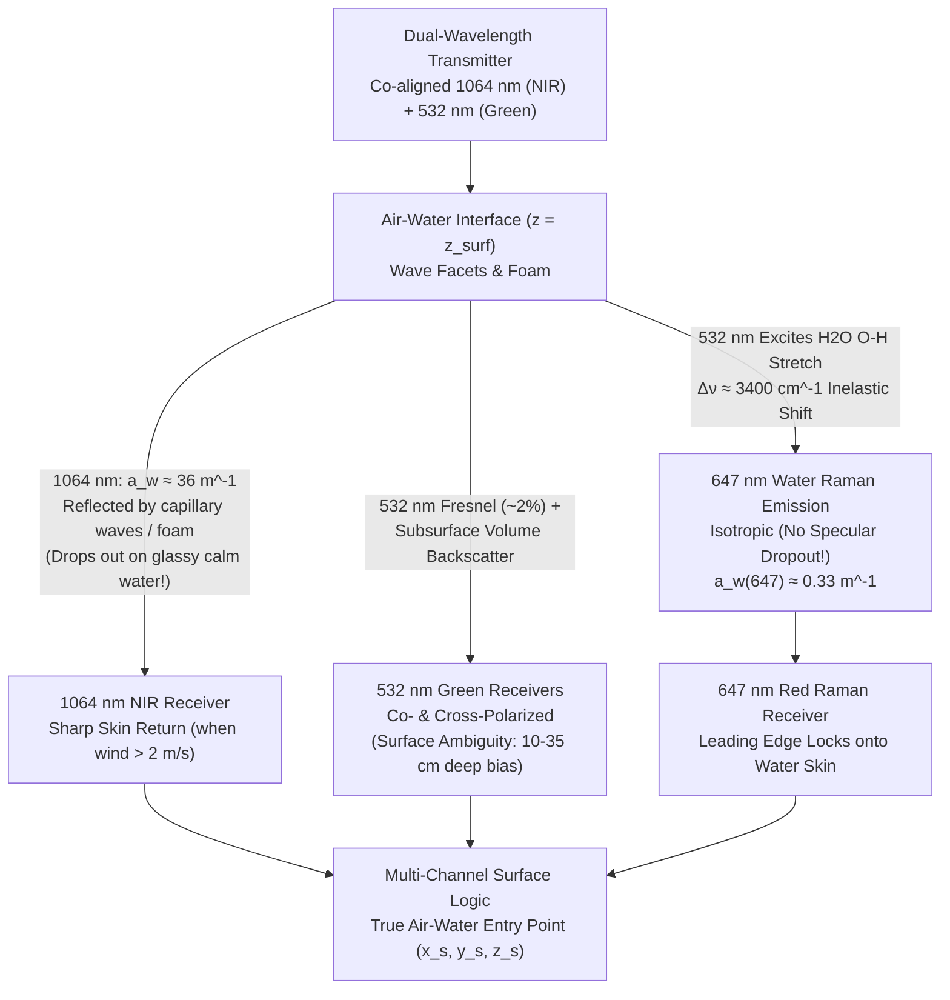

## 9.2 Bathymetric LiDAR (Bathylidar) vs. Topographic LiDAR

While topographic Airborne Laser Scanners (ALS) treat water bodies as opaque or specularly absorbing boundaries that produce data voids, **Airborne Lidar Bathymetry (ALB)**—often termed *bathylidar* or *topobathymetric LiDAR*—is engineered to map the seamless coastal littoral zone from sub-aerial dunes and marshes down through the surf zone to the continental shelf ($d \approx 0.2\text{–}70\text{ m}$). Crossing the air-water interface fundamentally alters the physics of laser ranging. A pulse entering a natural water body undergoes an immediate $\sim 25\%$ reduction in propagation velocity, bends toward the local surface normal via Snell's law across a dynamically tilting wave field, suffers exponential two-way attenuation from molecular absorption and hydrosol scattering, and experiences severe angular beam spreading that enlarges the seafloor footprint to an order of magnitude wider than its sub-aerial counterpart.

---

### 9.2.1 Optical Wavelength Physics Across the Air-Water Interface

The primary engineering divergence between topographic and bathymetric LiDAR lies in the selection of the laser wavelength $\lambda$ relative to the electromagnetic absorption spectrum of liquid water. Following the Beer-Lambert law, a collimated monochromatic beam of spectral irradiance $E_0(\lambda)$ propagating a path length $r$ through pure water is attenuated according to:

$$E(r, \lambda) = E_0(\lambda) \exp\big(-c_{\text{beam}}(\lambda)\, r\big), \quad c_{\text{beam}}(\lambda) = a_w(\lambda) + b_w(\lambda)$$

where $c_{\text{beam}}(\lambda)$ is the beam attenuation coefficient ($\text{m}^{-1}$), $a_w(\lambda)$ is the intrinsic molecular absorption coefficient of pure liquid water ($\text{m}^{-1}$), and $b_w(\lambda)$ is the pure-water Rayleigh molecular scattering coefficient ($\text{m}^{-1}$).

Standard topographic LiDAR systems operate in the Near-Infrared (NIR) or Short-Wave Infrared (SWIR) bands:
* **$1064\text{ nm}$ (Nd:YAG fundamental):** Chosen for topographic mapping because silicon and InGaAs avalanche photodiodes (APDs) exhibit high quantum efficiency, solid-state diode-pumped Nd:YAG lasers achieve high wall-plug efficiency, and terrestrial vegetation (chlorophyll spongy mesophyll) and dry soils exhibit high diffuse reflectance ($\rho \approx 0.35\text{–}0.60$). In liquid water, however, $1064\text{ nm}$ sits on the shoulder of a strong rotational-vibrational O–H stretching overtone band, yielding an intrinsic absorption coefficient of $a_w(1064\text{ nm}) \approx 36.3\text{ m}^{-1}$ (Pope & Fry, 1997; Kou et al., 1993). The one-way $1/e$ folding penetration depth is $L_a = 1 / a_w \approx 27.5\text{ mm}$, and over a two-way round trip ($2 a_w \approx 72.6\text{ m}^{-1}$), $99\%$ of all $1064\text{ nm}$ photons entering the water are thermally absorbed within the top $6.3\text{ cm}$ of the surface skin.
* **$1550\text{ nm}$ (Er:Yb fiber or Raman-shifted lasers):** Widely adopted in high-altitude and automotive topographic scanners because fluids in the human cornea and vitreous humor absorb $1550\text{ nm}$ radiation before it can focus onto the retina, permitting much higher Class 1 eye-safe Maximum Permissible Exposure (MPE) pulse energies. Because the human eye is mostly water, the same physics dictates its fate in the ocean: $1550\text{ nm}$ coincides with the intense first overtone of the O–H stretch vibration, where $a_w(1550\text{ nm}) \approx 960\text{ m}^{-1}$ ($L_a \approx 1.04\text{ mm}$). A $1550\text{ nm}$ pulse is completely extinguished within the top millimeter of the air-water boundary.

```
Intrinsic Pure-Water Absorption Spectrum a_w(λ) vs. Jerlov Coastal Window:
  a_w (m^-1)
  10^3 |                                                        * 1550 nm (SWIR Topo)
       |                                                       /  a_w ≈ 960 m^-1 (L_a ≈ 1.0 mm)
  10^1 |                                           * 1064 nm  /
       |                                          / (NIR Topo) a_w ≈ 36 m^-1 (L_a ≈ 27.5 mm)
  10^0 |                               * 647 nm  /
       |                              / (Raman) a_w ≈ 0.33 m^-1
  10^-1|   \   Jerlov Coastal        /
       |    \  Window (515-540 nm)  /
  10^-2|     \______*______________/
       |          532 nm (2ω Nd:YAG Bathylidar: a_w ≈ 0.045 m^-1, L_a ≈ 22.2 m)
       +--------+-------+---------+---------+----------+------------------> λ (nm)
              400     532       650       800       1064              1550
```

To penetrate the water column, bathymetric LiDAR exploits frequency-doubled **green $532\text{ nm}$ Nd:YAG lasers**, generated by passing the $1064\text{ nm}$ fundamental beam through a nonlinear second-harmonic generation (SHG) crystal such as potassium titanyl phosphate ($\text{KTiOPO}_4$, KTP) or lithium triborate ($\text{LiB}_3\text{O}_5$, LBO). In pure water at $532\text{ nm}$, intrinsic absorption drops by nearly three orders of magnitude relative to $1064\text{ nm}$ to $a_w(532\text{ nm}) \approx 0.0447\text{ m}^{-1}$ ($L_a \approx 22.4\text{ m}$), with molecular scattering $b_w(532\text{ nm}) \approx 0.0019\text{ m}^{-1}$ (Pope & Fry, 1997).

While pure oceanic water (Jerlov Oceanic Type I) exhibits its absolute minimum attenuation in the blue-green around $\lambda \approx 460\text{–}480\text{ nm}$ ($a_w \approx 0.011\text{ m}^{-1}$), coastal, estuarine, and lacustrine waters (Jerlov Coastal Types 1–9) contain high concentrations of **Colored Dissolved Organic Matter (CDOM / *gelbstoff*)** and phytoplankton pigments (chlorophyll-*a* absorption peak at $440\text{ nm}$). CDOM absorption increases exponentially toward shorter wavelengths according to $a_{\text{CDOM}}(\lambda) = a_{\text{CDOM}}(\lambda_0)\exp[-S_{\text{CDOM}}(\lambda - \lambda_0)]$ with spectral slope $S_{\text{CDOM}} \approx 0.014\text{–}0.018\text{ nm}^{-1}$. This strong blue absorption shifts the net optical transmission window—the minimum of the diffuse attenuation coefficient $K_d(\lambda)$—from $470\text{ nm}$ in the open ocean right onto **$515\text{–}540\text{ nm}$** in coastal waters (Jerlov, 1976; Guenther, 1985; Philpot, 2019), making $532\text{ nm}$ the optimal compromise between solid-state laser physics and littoral optical oceanography.

| Wavelength $\lambda$ | Laser Source / Mechanism | Pure-Water Absorption $a_w(\lambda)$ ($\text{m}^{-1}$) | One-Way $1/e$ Scale Depth $L_a = 1/a_w$ | Ocular Hazard & Atmospheric Role | Primary Role in Topobathymetric LiDAR |
| :--- | :--- | :--- | :--- | :--- | :--- |
| **$480\text{–}490\text{ nm}$** (Blue-Green) | Optical Parametric Oscillator (OPO) / Ti:Sapphire | $\approx 0.013\text{–}0.015\text{ m}^{-1}$ | $66\text{–}77\text{ m}$ | Retinal hazard; strong Rayleigh sky/CDOM scatter | Deep oligotrophic oceanic/coral reef sounding (Jerlov Type I) |
| **$532\text{ nm}$** (Green) | Frequency-doubled ($2\omega$) Nd:YAG | $\approx 0.045\text{ m}^{-1}$ | $22.2\text{ m}$ | Retinal focus hazard (requires beam expansion to meet Class 1/3R MPE) | **Primary bathymetric channel** (Jerlov Coastal Window) & shallow/deep dual-FOV benthic ranging |
| **$647\text{ nm}$** (Red) | Inelastic $\text{H}_2\text{O}$ O–H stretch Stokes Raman shift from $532\text{ nm}$ | $\approx 0.33\text{ m}^{-1}$ | $3.03\text{ m}$ | Passive inelastic emission from water molecules | **Specular-independent water-surface detection** (locks onto top decimeters even on glassy calm water) |
| **$1064\text{ nm}$** (NIR) | Fundamental ($1\omega$) Nd:YAG | $\approx 36.3\text{ m}^{-1}$ | $27.5\text{ mm}$ | Retinal hazard ($5\times$ higher MPE than $532\text{ nm}$) | **Primary topographic channel** & capillary/rough water-surface skin reference |
| **$1550\text{ nm}$** (SWIR) | Er:Yb fiber / InGaAs diode | $\approx 960\text{ m}^{-1}$ | $1.04\text{ mm}$ | Corneal/vitreous absorption (highest Class 1 eye-safe MPE) | High-density terrestrial topo; immediate water-skin extinction / land-water classification |

---

### 9.2.2 Dual-Wavelength ($1064\text{ nm} + 532\text{ nm}$) and $647\text{ nm}$ Water Raman Architectures

To compute the true orthometric or ellipsoidal elevation of the seafloor $z_{\text{bottom}} = z_{\text{surf}} - d$, a bathymetric LiDAR must first determine the exact vertical elevation and horizontal coordinates of the air-water interface $(x_{\text{surf}}, y_{\text{surf}}, z_{\text{surf}})$ at the instant the laser pulse enters the water. Relying on a single green $532\text{ nm}$ channel to measure both the water surface and the seafloor introduces a severe systematic error known as **surface return ambiguity** (Guenther, 1985; Pe'eri & Philpot, 2007).

At an off-nadir air incidence angle of $\theta_{\text{air}} = 20^\circ$, the Fresnel power reflectance of a flat air-water interface ($n_p \approx 1.339$) for an unpolarized beam is only $R_F \approx 0.021$ ($2.1\%$), meaning nearly $98\%$ of the $532\text{ nm}$ pulse energy transmits into the water column. Furthermore, a monostatic airborne receiver at $\theta_{\text{air}} = 20^\circ$ only captures specularly reflected surface photons from wave facets whose local slopes happen to tilt by $\approx 20^\circ$ directly toward the aircraft. Meanwhile, the $98\%$ transmitted green energy immediately encounters suspended particulates, phytoplankton, and entrained microbubbles in the upper $0.2\text{–}1.5\text{ m}$ of the water column, generating strong volume backscatter. In the receiver detector, the weak Fresnel surface glint and the strong subsurface volume backscatter convolve into a single composite "surface" peak whose apparent centroid is systematically biased **downward into the water column by $10\text{–}35\text{ cm}$** depending on wind speed and near-surface turbidity.



To eliminate surface return ambiguity across all sea states, classic and modern hydrographic LiDAR architectures—pioneered by NASA AOL, Optech SHOALS/CZMIL, and Leica Hawkeye/Chiroptera—implement **collinear multi-channel detection**:

1. **Co-Aligned $1064\text{ nm}$ NIR Surface Channel:** Because $a_w(1064\text{ nm}) \approx 36.3\text{ m}^{-1}$, the $1064\text{ nm}$ pulse cannot penetrate more than a few centimeters into liquid water; any detected $1064\text{ nm}$ return is guaranteed to originate from the true air-water skin. However, the $1064\text{ nm}$ channel suffers from two operational failure modes at opposite extremes of the Beaufort wind scale:
   * **Specular Dropout over Glassy Calm Water (Beaufort 0–1, $U_{10} < 2\text{ m/s}$):** When capillary waves are absent, the mirror-smooth water surface reflects the off-nadir ($\theta_{\text{air}} = 15^\circ\text{–}20^\circ$) $1064\text{ nm}$ beam forward away from the receiver aperture, causing the NIR channel to drop out completely.
   * **Whitecap and Surf-Zone Foam Bias (Beaufort $\ge 4$ or Breaking Surf):** Entrained air-bubble plumes and elevated sea foam scatter $1064\text{ nm}$ strongly, pulling the NIR return upward onto the crest of the foam layer rather than the hydrostatic water surface.
2. **$647\text{ nm}$ Inelastic Water Raman Backscatter Channel:** When $532\text{ nm}$ photons ($\tilde{\nu}_0 = 1 / 532\text{ nm} = 18,797\text{ cm}^{-1}$) enter liquid water, a small fraction ($\sim 10^{-4}\text{ m}^{-1}\text{ sr}^{-1}$) undergoes inelastic vibrational Raman scattering off the O–H stretch mode of the $\text{H}_2\text{O}$ molecule ($\Delta\tilde{\nu}_{\text{OH}} \approx 3400\text{ cm}^{-1}$), shifting the scattered wavelength into the red band:
   $$\lambda_{\text{Raman}} = \left(\frac{1}{532 \times 10^{-7}\text{ cm}} - 3400\text{ cm}^{-1}\right)^{-1} \approx 649\text{ nm} \quad (\text{broad band } 645\text{–}655\text{ nm, centered near } 647\text{ nm})$$
   The $647\text{ nm}$ Raman return possesses three decisive physical advantages (Guenther et al., 1996; Pe'eri & Philpot, 2007): (a) it is **absent in air** and requires liquid $\text{H}_2\text{O}$, so atmospheric aerosols or dry foam droplets produce minimal false triggers; (b) Raman emission is **isotropic** ($\beta_{\text{Raman}}(\psi) \propto 1 + \cos^2\psi$), meaning it returns a strong signal to an off-nadir receiver even when the water surface is completely flat and glassy ($1064\text{ nm}$ dropout); and (c) red light is strongly absorbed by water ($a_w(647\text{ nm}) \approx 0.33\text{ m}^{-1}$), so the two-way attenuation factor $\exp[-(K_d(532) + K_d(647))z] \approx \exp(-0.8 z)$ restricts the Raman return to the top decimeters, producing a sharp waveform leading edge that pinpoints $z_{\text{surf}}$ to within $\pm 2\text{–}4\text{ cm}$.
3. **Co- and Cross-Polarized $532\text{ nm}$ Channels:** Systems such as Optech CZMIL and Leica Chiroptera transmit linearly polarized $532\text{ nm}$ light and split the green receiver into co-polarized ($532_\parallel$) and cross-polarized ($532_\perp$) paths. Direct Fresnel reflection off the water surface preserves the transmitted polarization state ($532_\parallel$), whereas multiple Mie scattering from subsurface particulates and diffuse reflection from the seabed depolarize the return ($532_\perp$), enabling optical separation of the surface glint from shallow volume/benthic returns even without a Raman channel.

---

### 9.2.3 Refraction, Speed-of-Light Slowdown, and Palmer Conical Scanner Geometry

Once the laser pulse crosses the air-water interface at $(x_{\text{surf}}, y_{\text{surf}}, z_{\text{surf}})$, accurate 3D positioning of the seafloor sounding requires correcting for two distinct refractive phenomena: the slowdown of the pulse envelope velocity and the geometric bending of the ray path. A critical—and frequently misunderstood—physical principle of hydrographic LiDAR is that **ray bending is governed by the phase refractive index $n_p$, whereas time-of-flight range conversion is governed by the group refractive index $n_g$**.

#### Phase vs. Group Refractive Index of Water

In a dispersive dielectric medium such as liquid water, the phase refractive index $n_p(\lambda, T, S, P)$ describes the phase velocity $v_p = c_0 / n_p$ of an infinite monochromatic carrier wave. For natural waters across temperature $T \in [0^\circ\text{C}, 30^\circ\text{C}]$, practical salinity $S \in [0, 35]\text{ PSU}$, and wavelength $\lambda \in [400, 700]\text{ nm}$, the empirical Quan and Fry (1995) polynomial gives the phase index relative to air as:

$$n_p(\lambda, T, S) = n_0 + (n_1 + n_2 T + n_3 T^2)S + n_4 T^2 + \frac{n_5 + n_6 S + n_7 T}{\lambda} + \frac{n_8}{\lambda^2} + \frac{n_9}{\lambda^3}$$

At $\lambda = 532\text{ nm}$ and $T = 20^\circ\text{C}$, the phase index is **$n_p \approx 1.3340$ in freshwater ($S = 0\text{ PSU}$)** and **$n_p \approx 1.3404$ in standard seawater ($S = 35\text{ PSU}, T = 15^\circ\text{C}$)**. Across all coastal and inland survey environments, environmental variations in temperature and salinity shift $n_p$ by at most $\Delta n_p / n_p \approx 0.5\%$.

However, a pulsed bathymetric LiDAR does not measure the phase of a continuous carrier; it measures the travel time $\Delta t_w$ of a modulated wave packet (pulse envelope of duration $\tau_p \approx 1.5\text{–}5\text{ ns}$). The envelope of a wave packet propagates at the **group velocity** $v_g = \frac{\partial \omega}{\partial k} = \frac{c_0}{n_g(\lambda)}$, where the **group refractive index** $n_g(\lambda)$ includes the chromatic dispersion derivative $\frac{\partial n_p}{\partial \lambda}$ (Ciddor, 1996; Quan & Fry, 1995; Philpot, 2019):

$$n_g(\lambda, T, S) = n_p(\lambda, T, S) - \lambda \frac{\partial n_p(\lambda, T, S)}{\partial \lambda}$$

Because liquid water exhibits normal dispersion in the visible spectrum ($\frac{\partial n_p}{\partial \lambda} < 0$, with $\lambda \frac{\partial n_p}{\partial \lambda} \approx -0.008\text{ to }-0.017$ depending on the dispersion parametrization bandwidth at $532\text{ nm}$), the group refractive index is **always larger than the phase index**: in operational bathymetric LiDAR firmware, effective group indices of **$n_g(532\text{ nm}) \approx 1.341\text{–}1.344$** (or up to $1.351\text{–}1.357$ when full ultraviolet resonance dispersion terms are retained) are used for time-of-flight range scaling:

$$R_w = v_g \frac{\Delta t_w}{2} = \frac{c_0 \, \Delta t_w}{2 \, n_g(\lambda, T, S)}$$

> [!WARNING]
> **The $0.6\%\text{–}1.3\%$ Phase-vs-Group Index Systematic Depth Bias:** If a hydrographic processing pipeline mistakenly uses the textbook phase index of freshwater ($n_p = 1.334$) instead of the group index in seawater ($n_g \approx 1.344\text{–}1.352$) to convert two-way travel time $\Delta t_w$ into slant range $R_w$, every sounding is systematically overestimated (biased too deep) by $\frac{\delta d}{d} = \frac{n_g - n_p}{n_g} \approx +0.75\%$ to $+1.3\%$. At $d = 30\text{ m}$ depth, this single software constant error injects a $+22.5\text{ cm}$ to $+39\text{ cm}$ systematic depth bias—consuming the entire allowable Total Vertical Uncertainty (TVU) budget of an IHO S-44 Special Order or Order 1a survey!

#### 3D Snell's Law and the Palmer Conical Scanner

While the pulse speed along the underwater path is governed by $n_g$, the wavefront refraction angle at the air-water boundary is governed by phase-front continuity (**Snell's Law** using $n_p$ and $n_{\text{air}} \approx 1.00028$):

$$n_{\text{air}} \sin\theta_{\text{air}} = n_p \sin\theta_{\text{water}} \implies \theta_{\text{water}} = \arcsin\!\left(\frac{n_{\text{air}}}{n_p}\sin\theta_{\text{air}}\right)$$

Unlike terrestrial topographic scanners that sweep a flat mirror or rotating polygon across nadir ($\theta_{\text{air}} \in [-30^\circ, +30^\circ]$), nearly all dedicated bathymetric LiDAR systems (e.g., Optech CZMIL SuperNova, Leica Chiroptera-5 / Hawkeye-5, Riegl VQ-880-G II) employ a **Palmer nutating conical scanner** (a tilted rotating mirror or dual Risley prism assembly) or capture either the forward $180^\circ$ arc or the full $360^\circ$ elliptical loop at a **strictly constant off-nadir incidence angle $\theta_{\text{air}} \approx 15^\circ\text{–}20^\circ$**:

```
Palmer Conical Scanner & Wave-Tilted Snell's Law Refraction:

       Aircraft Velocity --->                Palmer Elliptical Scan Pattern (Plan View)
             [ALB Sensor]                             _ . - - - . _
                  \  |                             . '   Forward   ' .
                   \ | θ_air = 20.0°              /    _ . - - . _    \
                    \|                           |   /   Flight    \   |
  ~~~~~~~~~~~~~*~~~~~*~~~~~~~~~~~~~ z_surf        \  \   Track ---> /  /
       Wave    :\    :                             ' . ' - - - - ' . '
      Normal   : \   :                                 Aft Scan Arc
      n_wave   :  \  : θ_water ≈ 14.8° (Flat)
               :   \ :   or θ_water + δθ_w (Tilted by Wave Slope η_wave)
               :    \:
  =============*=====*============= Seafloor (z_bottom = z_surf - d)
               |<--->|
                 δx_b ≈ d * (1 - 1/n_p) * η_wave  (Wave-Slope Horizontal Shift)
```

Maintaining a constant $\theta_{\text{air}} \approx 20^\circ$ ($\theta_{\text{water}} \approx 14.81^\circ$ for $n_p = 1.339$) provides four critical advantages over variable-angle flat-mirror scanners:
1. **Elimination of Nadir Specular Receiver Saturation:** At $\theta_{\text{air}} = 0^\circ$, direct specular reflection off flat water returns a massive spike ($10^4\text{–}10^6\times$ stronger than the benthic return) that saturates and blinds high-sensitivity photomultiplier tubes (PMTs) or linear-mode APDs for tens of nanoseconds.
2. **Constant Air-Water Transmittance and Polarization:** Fresnel transmission into the water column remains uniform ($T_F \approx 97.9\%$) across the entire swath width $W = 2 H \tan\theta_{\text{air}} \approx 0.73 H$.
3. **Uniform Slant-Path Geometry and Wave-Slope Error Characteristics:** Because $\theta_{\text{water}}$ is constant across the scan arc, the ratio of underwater slant range $R_w$ to vertical depth $d$ ($d = R_w \cos\theta_{\text{water}} \approx 0.9668 R_w$) is invariant across the swath.
4. **Dual-Look Coverage (Full-Circle Palmer Scan):** Scanning both the forward and aft halves of the cone hits every seafloor patch twice from opposing azimuths seconds apart, filling shadows behind coral heads or boulders and enabling in-flight calibration of mounting roll/pitch boresight angles.

In the presence of wind-driven gravity and capillary waves, the instantaneous local water surface is tilted by a 2D wave-slope vector $\boldsymbol{\eta}_{\text{wave}} = (\eta_x, \eta_y)^T$, defining an upward unit normal $\hat{\mathbf{n}}_{\text{wave}} = (-\eta_x, -\eta_y, 1)^T / \sqrt{1 + \eta_x^2 + \eta_y^2}$. Using the 3D vector form of Snell's law (derived fully in Section 9.5), if the data processor assumes a flat horizontal water surface ($\hat{\mathbf{n}} = \hat{\mathbf{k}}$) while the actual wave facet is tilted by an in-plane angle $\eta_{\text{wave}}$ (in radians), the refracted underwater angle $\theta_{\text{water}}$ is perturbed by:

$$\delta\theta_{\text{water}} \approx \left(\frac{n_p \cos\theta_{\text{water}} - n_{\text{air}}\cos\theta_{\text{air}}}{n_p \cos\theta_{\text{water}}}\right) \eta_{\text{wave}} = \left(1 - \frac{n_{\text{air}}\cos\theta_{\text{air}}}{\sqrt{n_p^2 - n_{\text{air}}^2\sin^2\theta_{\text{air}}}}\right) \eta_{\text{wave}} \approx 0.275 \, \eta_{\text{wave}}$$

Because the airborne receiver measures the fixed two-way in-water slant range $R_w = \frac{c_0\,\Delta t_w}{2\,n_g} = \frac{d}{\cos\theta_{\text{water}}}$ along the refracted ray, differentiating the horizontal coordinate $x_b = R_w \sin\theta_{\text{water}}$ and vertical depth $d_b = R_w \cos\theta_{\text{water}}$ with respect to $\theta_{\text{water}}$ at fixed $R_w$ gives $\delta x_b = R_w \cos\theta_{\text{water}}\,\delta\theta_{\text{water}} = d\,\delta\theta_{\text{water}}$ and $\delta d_b = -R_w \sin\theta_{\text{water}}\,\delta\theta_{\text{water}} = -d\tan\theta_{\text{water}}\,\delta\theta_{\text{water}}$ (Section 9.5.5). At depth $d$, an unmodeled RMS wave slope $\sigma_\eta$ (which follows the Cox & Munk (1954) empirical relation $\sigma_\eta^2 = 0.003 + 0.00512\, U_{12}\text{ rad}^2$ as a function of $12.5\text{ m}$ wind speed $U_{12}$ in $\text{m/s}$) therefore induces a $1\sigma$ horizontal positioning error $\sigma_{x,\text{wave}}$ and a vertical depth error $\sigma_{d,\text{wave}}$:

$$\sigma_{x,\text{wave}} = d \, \delta\theta_{\text{water}}(\sigma_\eta) = d\left(1 - \frac{n_{\text{air}}\cos\theta_{\text{air}}}{n_p\cos\theta_{\text{water}}}\right)\sigma_\eta \approx 0.275 \, d \, \sigma_\eta, \qquad \sigma_{d,\text{wave}} = d \tan\theta_{\text{water}} \, \delta\theta_{\text{water}}(\sigma_\eta) \approx 0.073 \, d \, \sigma_\eta$$

#### Worked Numerical Example: Refraction, Group Delay, and Wave-Slope Error at $d = 20\text{ m}$

Consider an ALB system operating at $\lambda = 532\text{ nm}$ with a Palmer scan angle $\theta_{\text{air}} = 20.0^\circ$ over coastal seawater ($T = 15^\circ\text{C}, S = 35\text{ PSU}$, where $n_p = 1.3404$ and $n_g = 1.3510$ from the Quan & Fry (1995) polynomial; note that at $T = 20^\circ\text{C}, S = 35\text{ PSU}$ with full UV dispersion terms in Section 9.5, $n_p = 1.3411$ and $n_g = 1.3651$). The two-way in-water travel time between the Raman-locked surface return and the seafloor return is measured as $\Delta t_w = 186.20\text{ ns}$ under moderate $U_{12} = 7\text{ m/s}$ winds:
1. **Snell's Law Refraction Angle (using $n_p$):**
   $$\theta_{\text{water}} = \arcsin\!\left(\frac{1.00028}{1.3404}\sin 20.0^\circ\right) = \arcsin(0.25525) = 14.788^\circ$$
2. **Slant Range and True Depth (using $n_g$):**
   $$R_w = \frac{c_0 \, \Delta t_w}{2 \, n_g} = \frac{(2.99792458 \times 10^8\text{ m/s})(186.20 \times 10^{-9}\text{ s})}{2 \times 1.3510} = 20.659\text{ m}$$
   $$d = R_w \cos(14.788^\circ) = 20.659 \times 0.96688 = 19.975\text{ m}$$
   *(Note: Had $n_p = 1.3404$ been erroneously substituted for $n_g$ in the range equation, the computed depth would be $20.133\text{ m}$—a systematic $+15.8\text{ cm}$ deep bias!)*
3. **Unmodeled Wave-Slope Uncertainty ($U_{12} = 7\text{ m/s}$):**
   From Cox & Munk (1954), $\sigma_\eta = \sqrt{0.003 + 0.00512(7)} = 0.197\text{ rad}$ ($11.3^\circ$ RMS facet slope; after averaging over a $1.5\text{ m}$ laser surface footprint, effective macro-facet slope is $\sigma_{\eta,\text{eff}} \approx 5.0^\circ = 0.0873\text{ rad}$). The resulting $1\sigma$ seafloor coordinate errors from wave refraction alone are:
   $$\sigma_{x,\text{wave}} \approx 0.275 \times 19.975\text{ m} \times 0.0873\text{ rad} = 0.479\text{ m}, \qquad \sigma_{d,\text{wave}} \approx 0.073 \times 19.975\text{ m} \times 0.0873\text{ rad} = 0.127\text{ m}$$

---

### 9.2.4 The Bathymetric Waveform, Extinction Limits, the "White Ribbon", and Forward-Scattering Biases

Whereas a topographic LiDAR waveform over bare earth consists of a simple delayed Gaussian replica of the transmitted pulse, the green $532\text{ nm}$ bathymetric waveform $P_r(t)$ is a continuous, multi-component radiometric trace spanning tens to hundreds of nanoseconds:

$$P_r(t) = P_t(t) * \big[ H_{\text{surf}}(t) + H_{\text{vol}}(t) + H_{\text{benthic}}(t) \big] + P_{\text{bg}}$$

```
Anatomy of the Green (532 nm) Bathymetric LiDAR Waveform P_r(t):

  Power P_r(t) (Log / Compressed Scale)
    ^
    |      (1) Surface Return              (3) Benthic Bottom Return
    |      (Fresnel + Bragg)               (Broadened by Mie Forward Scatter & Slope)
    |            /\                                      _.-._
    |           /  \   (2) Volume Backscatter Wedge    .'     '.
    |          /    \  P_vol(t) ~ β(π) exp(-2 K_sys d)/         \
    |         /      ' . _                           /           \
    |        /  Dead Zone  ' . _                    /             \   (4) Noise Floor
    |_______/  ("White Ribbon")  ' . _ _ _ _ _ _ _ /               \_______ P_bg
    +-----------|--------------------------------------|-------------------> Time t (ns)
               t_0                                    t_b = t_0 + 2 n_g d / (c_0 cos θ_w)
            (z = z_surf)                           (z = z_bottom)
```

#### 1. Water-Column Volume Backscatter and Extinction Limits ($K_d$ vs. Secchi Depth $Z_{\text{SD}}$)

Between the air-water entry time $t_0$ and the seafloor arrival $t_b$, the laser pulse continuously scatters off water molecules and suspended hydrosols. Because the underwater laser beam undergoes strong small-angle forward scattering (governed by the Petzold particulate volume scattering phase function, where the asymmetry parameter is $g = \langle\cos\psi\rangle \approx 0.92\text{–}0.96$), photons scattered through small angles remain inside the receiver field of view ($\text{FOV}_{\text{rx}} \approx 15\text{–}50\text{ mrad}$). Consequently, the effective system attenuation coefficient $K_{\text{sys}}$ is much smaller than the collimated beam attenuation coefficient $c_{\text{beam}} = a + b$, bounded by (Guenther, 1985; Gordon, 1982):

$$K_d(\lambda) \le K_{\text{sys}}(\lambda) \le c_{\text{beam}}(\lambda), \quad \text{where } K_d(\lambda) \approx \frac{a(\lambda) + b_b(\lambda)}{\cos\theta_{\text{water}}}$$

For wide-FOV deep-channel receivers ($\text{FOV}_{\text{rx}} > 40\text{ mrad}$, where footprint diameter at depth exceeds $0.5\,d$), almost all forward-scattered photons are retained and $K_{\text{sys}} \to K_d$ (the **diffuse attenuation coefficient**, where $b_b \approx 0.018\,b$ is the backward scattering coefficient). Thus, the volume backscatter wedge decays exponentially as $P_{\text{vol}}(d) \propto \beta(\pi)\exp(-2 K_d d)$, and the linear slope of $\ln P_{\text{vol}}(t)$ provides a direct synoptic inversion of water clarity $K_d(532\text{ nm})$ on every laser shot!

The maximum surveyable depth $d_{\max}$ occurs when the two-way attenuated benthic peak falls to the minimum detectable signal-to-noise ratio above solar background and detector dark current. Expressed in dimensionless **one-way optical depths** $\tau_{\text{opt}} = K_d d_{\max}$ or multiples of the **Secchi disk depth** $Z_{\text{SD}}$ (utilizing the empirical Holmes-Poole relation $K_d Z_{\text{SD}} \approx 1.44\text{–}1.70$):
* **Topobathymetric Systems** (small aperture $D_r \approx 8\text{–}15\text{ cm}$, low pulse energy $0.1\text{–}1.5\text{ mJ}$, high pulse repetition rate $50\text{–}700\text{ kHz}$; e.g., Riegl VQ-880-G II, Leica Chiroptera-5): Achieve an optical depth limit of **$K_d d_{\max} \approx 1.5\text{–}2.5$**, corresponding to **$d_{\max} \approx 1.0\text{–}1.7 \times Z_{\text{SD}}$** (typically $10\text{–}25\text{ m}$ in clear coastal waters).
* **Deep-Water Hydrographic Systems** (large receiver telescope $D_r \approx 20\text{–}40\text{ cm}$, high pulse energy $3\text{–}10\text{ mJ}$ at $10\text{–}35\text{ kHz}$; e.g., Optech CZMIL SuperNova, Leica Hawkeye-5): Achieve **$K_d d_{\max} \approx 4.0\text{–}6.0$** during daytime and up to $6.5$ at night, corresponding to **$d_{\max} \approx 2.5\text{–}3.5 \times Z_{\text{SD}}$** (reaching $50\text{–}75\text{ m}$ in oligotrophic Jerlov Type I waters where $K_d \approx 0.06\text{–}0.08\text{ m}^{-1}$).

#### 2. The Very Shallow Water ("White Ribbon") Dead Zone ($d < 20\text{–}50\text{ cm}$)

At the opposite depth extreme—along the shoreline swash zone, tidal flats, and emergent reef crests—bathymetric LiDAR encounters a fundamental signal-processing blind spot known as the **"white ribbon"** (so named because early hydrographic charts left an unmapped white gap between the $-0.5\text{ m}$ bathymetric contour and the $0\text{ m}$ topographic shoreline).

When the water depth $d$ is so shallow that the two-way in-water travel time $\Delta t_w = \frac{2 n_g d}{c_0 \cos\theta_{\text{water}}}$ is smaller than the effective system pulse width $\tau_p$ (FWHM of the laser pulse convolved with the receiver impulse response), the benthic return peak $H_{\text{benthic}}(t)$ merges completely into the trailing edge of the intense surface return $H_{\text{surf}}(t)$:

$$d_{\min} \approx \frac{c_0 \, \tau_p \, \cos\theta_{\text{water}}}{2 \, n_g}$$

For a classical hydrographic laser with $\tau_p = 4.0\text{ ns}$, $d_{\min} \approx \frac{(3.0 \times 10^8)(4.0 \times 10^{-9})(0.967)}{2 \times 1.351} \approx 0.43\text{ m}$ ($43\text{ cm}$). Even for modern short-pulse topobathymetric lasers ($\tau_p \approx 1.2\text{–}1.5\text{ ns}$), standard peak detectors fail below $d_{\min} \approx 15\text{–}20\text{ cm}$. Modern processing pipelines narrow or eliminate the white ribbon using three techniques:
1. **Iterative Non-Linear Waveform Deconvolution:** Applying Richardson-Lucy or Wiener deconvolution using a calibrated system impulse response $P_t(t)$ to sharpen overlapping peaks down to $\sim 0.5\,\tau_p$ ($8\text{–}12\text{ cm}$).
2. **Parametric Template Subtraction:** Locking the surface time $t_0$ using the $1064\text{ nm}$ NIR or $647\text{ nm}$ Raman channel, subtracting a scaled surface+volume exponential-modified Gaussian (EMG) template from the $532\text{ nm}$ waveform, and detecting the residual benthic impulse.
3. **Bimodal Radiometric / Pulse-Broadening Classification:** Identifying ultra-shallow water ($d \in [2\text{ cm}, 15\text{ cm}]$) where the single merged $532\text{ nm}$ peak exhibits measurable temporal stretching ($\sigma_t > \sigma_{t,\text{sys}}$) accompanied by an attenuated $1064\text{ nm}$ reflectance and a positive $647\text{ nm}$ Raman return.

#### 3. Subsurface Mie Forward-Scattering Beam Spreading: Shoal Bias vs. Deep Bias

A widespread misconception among terrestrial LiDAR practitioners is that a bathymetric LiDAR illuminates the seafloor with a narrow spot matching its in-air beam divergence ($\beta_t \approx 1\text{–}5\text{ mrad}$, or $0.4\text{–}2\text{ m}$ diameter from $400\text{ m}$ altitude). In reality, as the $532\text{ nm}$ beam propagates through natural water with scattering optical depth $\tau_s = b \, d \approx 2\text{–}15$, multiple forward Mie scattering off suspended particles causes the beam to diffuse radially into a wide illumination cone (Guenther & Thomas, 1984; Philpot, 2019). By the time the pulse reaches the seabed at depth $d$, the **effective benthic footprint diameter $D_{\text{benthic}}$ expands to $50\%\text{–}100\%$ of the water depth**:

$$D_{\text{benthic}}(d) \approx \sqrt{D_{\text{air}}^2 + \big(2 \, d \, \tan\phi_{\text{scatter}}\big)^2} \approx 0.5\,d \text{ to } 1.0\,d \quad (\text{e.g., } D_{\text{benthic}} \approx 10\text{–}20\text{ m at } d = 20\text{ m!})$$

```
Subsurface Mie Forward-Scattering Cone: Competing Shoal & Deep Biases

             In-Air Laser Beam (D_air ≈ 0.5 - 1.5 m)
                        \  |
  ~~~~~~~~~~~~~~~~~~~~~~~*~~~~~~~~~~~~~~~~~~~~~~~ Air-Water Interface
                        /:\
                       / : \   Multiple Forward Mie Scattering (g ≈ 0.94)
                      /  :  \  Expands Cone to D_benthic ≈ 0.5d - 1.0d
        Early Edge   /   :   \
        Hit! --->   *    :    \  <--- Zig-Zag Multipath (Longer Path R_w + ΔR)
                   /     :     \
                 .'   Unscattered\
               .'     Central Ray \
             .'          *         \
           .'         Slope β_s     \
         .'__________________________*___________ Flat Seafloor
         |                           |
         |<--- D_benthic ≈ 0.7 d --->|
   (A) Slant-Slope / Pinnacle SHOAL BIAS     (B) Off-Axis Multipath DEEP BIAS
       (Δd_shoal < 0: Early arrival from         (Δd_deep > 0: Geometric path
        upslope rim or coral head crest)          lengthening on flat bottom)
```

This massive underwater footprint expansion induces two competing, physically distinct range biases that must be modeled in every hydrographic error budget (Guenther, 1985):
* **Forward-Scattering Multipath Deep Bias ($\Delta d_{\text{deep}} > 0$ on Flat Bottoms):** Over a flat horizontal seabed, multiply scattered photons travel zig-zag off-axis trajectories whose geometric path lengths exceed the direct refracted ray $R_w = d / \cos\theta_{\text{water}}$. This delays the centroid and stretches the trailing edge of the benthic return, introducing a turbidity- and depth-dependent **deep bias** of $+5\text{ to }+25\text{ cm}$ that is corrected in sensor firmware via Monte Carlo radiative-transfer look-up tables (Guenther's propagation-induced bias correctors) parameterized by $K_{\text{sys}} d$ and $\theta_{\text{water}}$.
* **Wide-Footprint Slant-Slope and Pinnacle Shoal Bias ($\Delta d_{\text{shoal}} < 0$ on Slopes and Rough Features):** Over a sloping seabed with tilt angle $\beta_s$ or near a steep coral pinnacle, boulder, or navigation channel wall, the upslope outer edge of the $0.5\,d$-wide forward-scattered cone strikes the shallow feature several nanoseconds *before* the central refracted ray reaches the nominal beam center:
  $$\Delta d_{\text{shoal}} \approx -\frac{D_{\text{benthic}}}{2} \sin\beta_s \cos(\theta_{\text{water}} - \beta_s)$$
  Because hydrographic safety of navigation prioritizes the earliest leading-edge detection (or first inflection point) of the bottom return, this wide cone systematically shifts soundings **shoalward (shallower)** on slopes while radially blurring micro-topography smaller than $D_{\text{benthic}}$ into broad, flattened domes.

#### 4. Hydrographic & Topobathymetric Uncertainty Standards (`IHO S-44`, `NOAA HSSD`, `ASPRS`)

Because bathymetric LiDAR errors grow with water depth $d$ through wave-slope refraction ($\sigma_{x,\text{wave}}, \sigma_{d,\text{wave}} \propto d$), group-velocity uncertainty ($\sigma_{d,n_g} \propto d$), and forward-scattering beam spreading ($D_{\text{benthic}} \propto d$), hydrographic agencies evaluate ALB surveys against the depth-dependent **IHO S-44 (Edition 6.1)** and **NOAA Hydrographic Surveys Specifications and Deliverables (HSSD)** 95% confidence bounds, alongside **ASPRS Bathymetric Accuracy Classes** (ASPRS, 2023):

$$\text{TVU}_{\max,95\%}(d) = \sqrt{a^2 + (b\,d)^2}, \qquad \text{THU}_{\max,95\%}(d) = c_{\text{THU}} + k_{\text{THU}}\,d$$

| Standard / Survey Order | Fixed Vertical Term $a$ ($\text{m}$) | Depth-Dependent Factor $b$ | Max Allowable $\text{TVU}_{95\%}$ at $d = 20\text{ m}$ | Max Allowable $\text{THU}_{95\%}$ ($95\%$ Circular) | Feature Detection / Bathymetric Coverage Requirement |
| :--- | :--- | :--- | :--- | :--- | :--- |
| **IHO S-44 Exclusive Order** | $0.15\text{ m}$ | $0.0075$ | $\pm 0.212\text{ m}$ | $1.0\text{ m}$ | $200\%$ coverage; cubic features $> 0.5\text{ m}$ (rarely met by ALB alone due to $D_{\text{benthic}}$) |
| **IHO S-44 Special Order** | $0.25\text{ m}$ | $0.0075$ | $\pm 0.292\text{ m}$ | $2.0\text{ m}$ | $100\%$ bathymetric coverage; cubic features $> 1.0\text{ m}$ (requires high-density ALB + object verification) |
| **IHO S-44 Order 1a / NOAA HSSD** | $0.50\text{ m}$ | $0.0130$ | $\pm 0.564\text{ m}$ | $5.0\text{ m} + 0.05\,d$ ($6.0\text{ m}$ at $20\text{ m}$) | $100\%$ feature search; cubic features $> 2.0\text{ m}$ ($d \le 40\text{ m}$) or $> 0.05\,d$ |
| **IHO S-44 Order 1b** | $0.50\text{ m}$ | $0.0130$ | $\pm 0.564\text{ m}$ | $5.0\text{ m} + 0.05\,d$ ($6.0\text{ m}$ at $20\text{ m}$) | Systematic regional bathymetric coverage where under-keel clearance is not critical (standard ALB survey order) |

---

### 9.2.5 Computational Implementation: 3D Refractive Ray-Tracing & Error Propagation

The following Python implementation demonstrates 3D vector Snell's law refraction across a wave-tilted water surface, compares phase- vs. group-index range calculation, and evaluates the compound Total Vertical Uncertainty ($\text{TVU}_{95\%}$) and Total Horizontal Uncertainty ($\text{THU}_{95\%}$) against IHO S-44 (Edition 6.1) Special Order and Order 1a hydrographic standards.

```python
import numpy as np

def quan_fry_index(wavelength_nm: float, temp_c: float = 15.0, sal_psu: float = 35.0):
    """Compute phase index n_p and group index n_g of water (Quan & Fry, 1995)."""
    n0, n1, n2, n3 = 1.31405, 1.779e-4, -1.05e-6, 1.6e-8
    n4, n5, n6, n7 = -2.02e-6, 15.868, 0.01155, -0.00423
    n8, n9 = -4382.0, 1.1455e6
    lam = wavelength_nm
    n_p = (n0 + (n1 + n2 * temp_c + n3 * temp_c**2) * sal_psu + n4 * temp_c**2
           + (n5 + n6 * sal_psu + n7 * temp_c) / lam + n8 / lam**2 + n9 / lam**3)
    # Chromatic dispersion derivative dn_p / d(lam)
    dnp_dlam = (-(n5 + n6 * sal_psu + n7 * temp_c) / lam**2
                - 2.0 * n8 / lam**3 - 3.0 * n9 / lam**4)
    n_g = n_p - lam * dnp_dlam
    return n_p, n_g

def snell_3d_refract(v_air: np.ndarray, n_wave: np.ndarray, n_p: float, n_air: float = 1.00028):
    """Refract unit incident vector v_air (pointing down) across upward wave normal n_wave."""
    v_air = v_air / np.linalg.norm(v_air)
    n_wave = n_wave / np.linalg.norm(n_wave)
    ratio = n_air / n_p
    cos_theta_i = -np.dot(v_air, n_wave)
    sin2_theta_t = ratio**2 * (1.0 - cos_theta_i**2)
    cos_theta_t = np.sqrt(1.0 - sin2_theta_t)
    v_water = ratio * v_air + (ratio * cos_theta_i - cos_theta_t) * n_wave
    return v_water / np.linalg.norm(v_water)

# Example: 532 nm Palmer scanner (theta_air = 20 deg) at d ≈ 20 m in seawater
c0 = 299792458.0  # m/s
n_p, n_g = quan_fry_index(532.0, temp_c=15.0, sal_psu=35.0)
dt_water = 186.20e-9  # s (two-way in-water travel time)

theta_air_rad = np.deg2rad(20.0)
v_air = np.array([np.sin(theta_air_rad), 0.0, -np.cos(theta_air_rad)])

# 1. Flat water surface assumption (n_wave = [0, 0, 1])
v_water_flat = snell_3d_refract(v_air, np.array([0.0, 0.0, 1.0]), n_p)
r_slant_group = (c0 * dt_water) / (2.0 * n_g)
r_slant_phase_err = (c0 * dt_water) / (2.0 * n_p)
p_bottom_flat = r_slant_group * v_water_flat

# 2. Tilted wave facet (5 deg pitch wave slope: eta_x = tan(5 deg))
eta_x = np.tan(np.deg2rad(5.0))
v_water_tilted = snell_3d_refract(v_air, np.array([-eta_x, 0.0, 1.0]), n_p)
p_bottom_tilted = r_slant_group * v_water_tilted

# 3. IHO S-44 (Ed. 6.1) Special Order & Order 1a TVU and THU limits at 95% CI
d_nom = -p_bottom_flat[2]
tvu_iho_special = np.sqrt(0.25**2 + (0.0075 * d_nom)**2)
tvu_iho_order1a = np.sqrt(0.50**2 + (0.0130 * d_nom)**2)
thu_iho_special = 2.00
thu_iho_order1a = 5.00 + 0.05 * d_nom

print(f"532 nm Indices (15C, 35 PSU, Quan & Fry): n_p = {n_p:.4f}, n_g = {n_g:.4f}")
print(f"Computed Depth (correct n_g): {d_nom:.3f} m | Using n_p (ERROR): {-r_slant_phase_err*v_water_flat[2]:.3f} m")
print(f"5-deg Wave Slope Shift -> dX = {p_bottom_tilted[0]-p_bottom_flat[0]:+.3f} m, dZ = {p_bottom_tilted[2]-p_bottom_flat[2]:+.3f} m")
print(f"IHO S-44 Max TVU (95%) at {d_nom:.1f} m: Special = ±{tvu_iho_special:.3f} m, Order 1a = ±{tvu_iho_order1a:.3f} m")
print(f"IHO S-44 Max THU (95%) at {d_nom:.1f} m: Special = {thu_iho_special:.2f} m, Order 1a = {thu_iho_order1a:.2f} m")
```

---

> [!WARNING]
> **Common Pitfalls in Bathymetric vs. Topographic LiDAR Processing**
> * **Substituting Phase Index ($n_p$) for Group Index ($n_g$):** Applying the textbook refractive index $n_p \approx 1.334\text{–}1.341$ to convert in-water pulse travel time $\Delta t_w$ into range introduces a systematic $+0.75\%\text{ to }+1.79\%$ deep bias across the entire survey. Always use $n_p$ for Snell's law angle refraction and $n_g$ for time-of-flight speed scaling.
> * **Misclassifying $532\text{ nm}$ Subsurface Turbidity Layers or Dense Kelp Canopies as the Seafloor:** Nepheloid sediment plumes, pycnocline particle traps, fish schools, and floating *Macrocystis* kelp blades generate strong mid-water $532\text{ nm}$ peaks. Accepting the first strong subsurface peak without full-waveform multi-peak neighborhood validation creates false shoals tens of meters above the true bed.
> * **Relying Solely on $1064\text{ nm}$ Over Glassy Water or Breaking Surf:** Over mirror-calm lagoons or lakes, the off-nadir $1064\text{ nm}$ return drops out completely due to specular reflection away from the receiver; if the processing software falls back to the uncalibrated $532\text{ nm}$ peak without a $647\text{ nm}$ Raman or cross-polarized surface model, the water surface datum shifts downward by $10\text{–}35\text{ cm}$, making the seafloor appear artificially shallow.

> [!IMPORTANT]
> **Key Takeaways**
> 1. **Wavelength Dictates Medium Penetration:** Topographic NIR/SWIR lasers ($1064\text{ nm}$, $1550\text{ nm}$) are absorbed within $1\text{–}60\text{ mm}$ of the water skin ($a_w \approx 36\text{–}960\text{ m}^{-1}$), whereas frequency-doubled green $532\text{ nm}$ lasers penetrate the Jerlov coastal transmission window ($a_w \approx 0.045\text{ m}^{-1}$) to optical depths of $K_d d_{\max} \approx 1.5\text{–}6.0$ ($1\text{–}3\times$ Secchi depth).
> 2. **Multi-Channel Surface Locking is Essential:** Co-aligned $1064\text{ nm}$ (rough water skin), $647\text{ nm}$ inelastic O–H stretch Raman backscatter (isotropic surface lock on glassy water), and polarized $532\text{ nm}$ receivers resolve the $10\text{–}35\text{ cm}$ green surface return ambiguity.
> 3. **Large Benthic Footprint and Competing Biases:** Multiple forward Mie scattering expands the underwater laser beam to a benthic cone diameter of $D_{\text{benthic}} \approx 0.5\text{–}1.0 \times d$. This wide footprint smooths sub-meter seabed roughness, causes an off-axis multipath **deep bias** on flat bottoms, and induces an early-arrival **shoal bias** on steep slopes and coral pinnacles.

---

### 9.2.6 References

* Cox, C., & Munk, W. (1954). Measurement of the roughness of the sea surface from photographs of the sun's glitter. *Journal of the Optical Society of America*, 44(11), 838–850. https://doi.org/10.1364/JOSA.44.000838
* Gordon, H. R. (1982). Interpretation of airborne oceanic lidar: Effects of multiple scattering. *Applied Optics*, 21(16), 2996–3001. https://doi.org/10.1364/AO.21.002996
* Guenther, G. C. (1985). *Airborne Laser Hydrography: System Design and Performance Factors* (NOAA Professional Paper Series, National Ocean Service 1). Rockville, MD: National Oceanic and Atmospheric Administration. https://repository.library.noaa.gov/view/noaa/2812
* Guenther, G. C., & Thomas, R. W. L. (1984). Effects of propagation-induced pulse stretching in airborne laser hydrography. *Proceedings of SPIE*, 489, 287–296. https://doi.org/10.1117/12.943315
* Guenther, G. C., LaRocque, P. E., & Lillycrop, W. J. (1996). Multiple surface channels in SHOALS airborne lidar. *Proceedings of SPIE*, 2964, 42–53. https://doi.org/10.1117/12.258352
* International Hydrographic Organization [IHO]. (2022). *IHO Standards for Hydrographic Surveys* (6th ed., Version 6.1.0, Special Publication No. 44). Monaco: International Hydrographic Organization.
* Jerlov, N. G. (1976). *Marine Optics* (2nd ed.). Amsterdam: Elsevier.
* Kou, L., Labrie, D., & Chylek, P. (1993). Refractive indices of water and ice in the 0.65- to 2.5-$\mu$m spectral range. *Applied Optics*, 32(19), 3531–3540. https://doi.org/10.1364/AO.32.003531
* Pe'eri, S., & Philpot, W. (2007). Increasing the existence of very shallow-water LIDAR measurements using the red-channel waveforms. *IEEE Transactions on Geoscience and Remote Sensing*, 45(5), 1217–1223. https://doi.org/10.1109/TGRS.2007.894584
* Philpot, W. (2019). *Airborne Laser Hydrography II*. Cornell University Library eCommons. https://doi.org/10.7298/jxm9-g971
* Pope, R. M., & Fry, E. S. (1997). Absorption spectrum (380–700 nm) of pure water. II. Integrating cavity measurements. *Applied Optics*, 36(33), 8710–8723. https://doi.org/10.1364/AO.36.008710
* Quan, X., & Fry, E. S. (1995). Empirical equation for the index of refraction of seawater. *Applied Optics*, 34(18), 3477–3480. https://doi.org/10.1364/AO.34.003477
