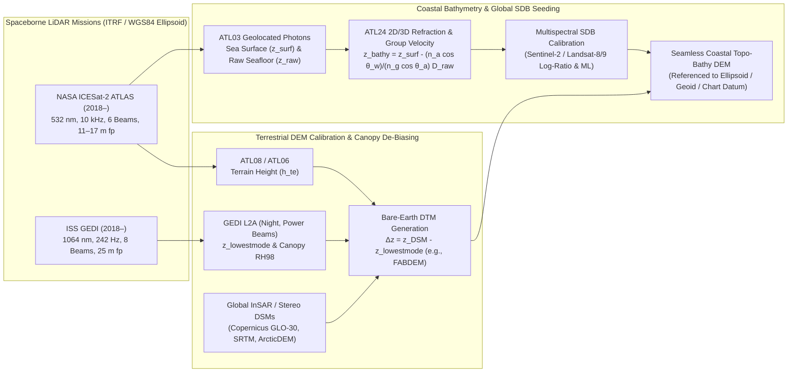

## 9.3 Spaceborne LiDAR Missions

While airborne topographic and bathymetric LiDAR scanners (Sections 9.1 and 9.2) deliver dense, sub-meter point clouds over local to regional survey corridors, their operational cost, aircraft range limits, and sovereign airspace restrictions preclude uniform global acquisition. Conversely, the spaceborne imaging systems that generate contiguous global Digital Elevation Models—Synthetic Aperture Radar interferometers such as SRTM and TanDEM-X/Copernicus DEM (Chapter 10) and optical stereo constellations such as WorldView/ArcticDEM and ASTER (Chapter 8)—suffer from spatially correlated long-wavelength vertical biases, baseline roll tilts, atmospheric phase screens, vegetation canopy scattering biases, and a complete inability to map submerged coastal topography at global scale.

Spaceborne laser altimeters bridge this gap by serving as the **global absolute vertical ground-truth backbone** of modern Earth and planetary geodesy. Operating from Low Earth Orbit (LEO) at altitudes of $H_{\text{orb}} \approx 400\text{–}600\text{ km}$, orbital laser altimeters emit collimated, near-nadir optical pulses whose round-trip time of flight is measured directly relative to the International Terrestrial Reference Frame (ITRF) center of mass. Although orbital power and aperture constraints limit spaceborne LiDARs to profiling tracks rather than contiguous wide-swath grids, their near-zero perspective distortion, centimeter-level radial orbit determination, and ability to penetrate both forest canopies (at $1064\text{ nm}$ and $532\text{ nm}$) and clear coastal waters (at $532\text{ nm}$) make them indispensable for calibrating, de-biasing, and fusing global terrestrial and bathymetric DEMs.

---

### 9.3.1 Evolution of Orbital Laser Altimetry and the Global Vertical Control Backbone

#### From Lunar and Martian Orbiters to Earth Observation (`gis-history` Lineage)

Orbital laser altimetry originated in planetary exploration, where the absence of oceans and GPS ground networks demanded a self-contained, absolute ranging instrument to establish planetary figure and topography:
* **Apollo 15, 16, and 17 Laser Altimeters (1971–1972):** Flashlamp-pumped ruby lasers ($\lambda = 694.3\text{ nm}$, $1\text{ m}$ range resolution) mounted in the Apollo Service Module provided the first orbital laser elevation profiles of the Moon, calibrating the focal length and scale of the Apollo Metric Camera stereo photographs (Chapter 8).
* **Shuttle Laser Altimeter (SLA-01 in 1996, SLA-02 in 1997) and Mars Orbiter Laser Altimeter (MOLA, 1997–2001):** NASA Goddard Space Flight Center (GSFC) demonstrated terrestrial full-waveform laser ranging from orbit aboard the Space Shuttle (`SLA-01/02`, $1064\text{ nm}$, $100\text{ m}$ footprint) and revolutionized planetary cartography with *MOLA* aboard Mars Global Surveyor (Smith et al., 2001), which collected $> 600\text{ million}$ ranges to construct the fundamental global vertical datum of Mars, followed by the five-beam Lunar Orbiter Laser Altimeter (*LOLA*, 2009–present) aboard the Lunar Reconnaissance Orbiter.
* **Operational Earth Observation Era (2003–Present):** Three landmark NASA missions—two free-flying polar/near-polar satellites and one International Space Station (ISS) payload—transformed global terrestrial and coastal DEM science (`schwehr/gis-history` milestones):
  1. **ICESat GLAS (2003–2009):** The first continuous Earth-observing satellite laser altimeter, launched in January 2003 (the same year ASPRS released the LAS 1.0 point-cloud specification).
  2. **ICESat-2 ATLAS (2018–present):** Launched in September 2018, introducing a 6-beam, $532\text{ nm}$ photon-counting micro-pulse architecture capable of resolving cross-track slope, polar ice-sheet mass balance, and coastal bathymetry down to $\sim 40\text{ m}$ depth.
  3. **ISS GEDI (2018–present):** Launched in December 2018 to the ISS, deploying an 8-beam, $1064\text{ nm}$ full-waveform laser profiler specifically optimized for tropical and temperate forest canopy structure and sub-canopy bare-earth topography between $\pm 51.6^\circ$ latitude.

#### Orbital Geolocation Equation and the Total Vertical/Horizontal Uncertainty Budget

Every spaceborne laser altimeter determines the 3D geocentric Cartesian coordinates $\mathbf{X}_{\text{fp}}(t) = [X, Y, Z]^{\mathsf{T}}_{\text{ITRF}}$ ($\text{m}$) of its surface bounce point at bounce epoch $t$ via the direct vector range equation:

$$\mathbf{X}_{\text{fp}}(t) = \mathbf{X}_{\text{orb}}(t) + \mathbf{R}_{\text{body}}^{\text{ITRF}}(t)\,\Delta\mathbf{X}_{\text{lever}} + \left(\frac{c\,\tau(t)}{2} - \Delta R_{\text{atm}}(t) + \Delta R_{\text{inst}}(t)\right)\hat{\mathbf{u}}_{\text{beam}}(t) + \Delta\mathbf{X}_{\text{geophys}}(t) \tag{9.11}$$

where:
* $\mathbf{X}_{\text{orb}}(t) \in \mathbb{R}^3$ is the ITRF position of the spacecraft center of mass ($\text{m}$), determined via Precision Orbit Determination (POD) combining onboard dual-frequency GNSS carrier-phase measurements, Satellite Laser Ranging (SLR) from ground stations, and high-degree gravity field models ($\sigma_{r,\text{orb}} \approx 1.5\text{–}3.0\text{ cm}$ radially for ICESat-2);
* $\mathbf{R}_{\text{body}}^{\text{ITRF}}(t) \in \mathrm{SO}(3)$ is the spacecraft attitude matrix and $\Delta\mathbf{X}_{\text{lever}}$ is the surveyed lever-arm vector ($\text{m}$) from the spacecraft center of mass to the laser optical reference point;
* $c = 299{,}792{,}458\text{ m}\cdot\text{s}^{-1}$ is the speed of light in vacuum, $\tau(t)$ is the measured round-trip time of flight ($\text{s}$), $\Delta R_{\text{atm}}(t) \approx 2.1\text{–}2.4\text{ m}$ is the zenith hydrostatic and wet tropospheric range delay ($\text{m}$, modeled from numerical weather reanalyses at optical wavelengths where ionospheric dispersion is negligible), and $\Delta R_{\text{inst}}(t)$ accounts for internal path delays, first-photon bias, or detector saturation ($\text{m}$);
* $\hat{\mathbf{u}}_{\text{beam}}(t) \in \mathbb{S}^2$ is the unit laser pointing vector in the ITRF frame, measured to arcsecond precision by a co-aligned Laser Reference System (LRS) star-tracker and gyroscope assembly; and
* $\Delta\mathbf{X}_{\text{geophys}}(t)$ applies solid-Earth tide, ocean loading, pole tide, and (over water) dynamic atmospheric loading (inverted barometer) displacements ($\text{m}$).

Converting $\mathbf{X}_{\text{fp}}(t)$ to geodetic latitude, longitude, and ellipsoidal elevation $(\phi, \lambda, z)$ relative to the WGS84/ITRF ellipsoid (with elevation $z$ positive-up in $\text{m}$), let the local terrain have slope angle $\alpha$ ($\text{rad}$). While an orbital altitude of $H_{\text{orb}} = 500\text{ km}$ does not degrade pure nadir range precision, it linearly amplifies angular pointing uncertainty $\sigma_{\theta,\text{point}}$ ($\text{rad}$) into a horizontal footprint geolocation uncertainty (Total Horizontal Uncertainty, $\text{THU}_{1\sigma}$):

$$\sigma_{XY,\text{fp}} \approx \sqrt{\sigma_{XY,\text{orb}}^2 + \left(H_{\text{orb}}\,\sigma_{\theta,\text{point}}\right)^2} \quad (\text{m}) \tag{9.12}$$

On sloped terrain of inclination $\alpha$, this horizontal pointing shift projects directly into the vertical dimension, yielding the single-shot **Total Vertical Uncertainty ($\text{TVU}_{1\sigma}$)** variance budget:

$$\sigma_z^2 = \sigma_{r,\text{orb}}^2 + \sigma_{R,\text{atm}}^2 + \sigma_{R,\text{inst}}^2 + \left(H_{\text{orb}} \tan\alpha \, \sigma_{\theta,\text{point}}\right)^2 + \sigma_{z,\text{rough/slope}}^2 \quad (\text{m}^2) \tag{9.13}$$

Equation (9.13) encapsulates the fundamental engineering trade-off of orbital laser altimetry: achieving decimeter vertical accuracy over sloped terrain from a $500\text{ km}$ orbit requires both **sub-arcsecond laser pointing knowledge** ($\sigma_{\theta,\text{point}} \lesssim 1.5\text{ arcsec} \approx 7.3\,\mu\text{rad} \implies H_{\text{orb}}\sigma_{\theta,\text{point}} \approx 3.6\text{ m}$) and a **small footprint diameter** $D_{\text{fp}}$ to minimize within-footprint slope broadening $\sigma_{z,\text{rough/slope}}$.

---

### 9.3.2 NASA ICESat GLAS (2003–2009): Full-Waveform Altimetry and Slope-Induced Broadening

#### Instrument Architecture and Sampling Geometry

Launched on January 13, 2003 UTC (January 12 local PST at Vandenberg Air Force Base) into a $600\text{ km}$ altitude, $94^\circ$ inclination orbit (covering latitudes $\pm 86^\circ$ with a $91\text{-day}$ repeat cycle), NASA's **Ice, Cloud, and land Elevation Satellite (ICESat)** carried the **Geoscience Laser Altimeter System (GLAS)** (Zwally et al., 2002; Schutz et al., 2005). GLAS housed three redundant diode-pumped, Q-switched Nd:YAG lasers (Lasers 1, 2, and 3) firing $6\text{ ns}$ full-width at half-maximum (FWHM) pulses at a pulse repetition frequency (PRF) of $f_{\text{PRF}} = 40\text{ Hz}$ across two simultaneous wavelengths:
* **$1064\text{ nm}$ (Near-Infrared, $75\text{ mJ}$):** Collected by a $1.0\text{ m}$ diameter beryllium Cassegrain telescope onto a linear-mode Silicon Avalanche Photodiode (Si APD) and digitized at $1\text{ GHz}$ ($1\text{ ns}$ time bins $\equiv 15\text{ cm}$ vertical range resolution across 544 bins [$81.6\text{ m}$ window] over ice and 1000 bins [$150\text{ m}$ window] over land) for surface altimetry.
* **$532\text{ nm}$ (Frequency-Doubled Green, $35\text{ mJ}$):** Routed to photon-counting Geiger-mode APD detectors for vertical profiling of optically thin clouds and planetary boundary-layer aerosols.

Because premature pump-diode array failures shortened laser lifetimes, GLAS was operated in **campaign mode**, firing for 33-day periods two to three times per year across 18 campaigns (`L1A` through `L2F`) until October 2009. At an orbital ground speed of $v_g \approx 6.88\text{ km}\cdot\text{s}^{-1}$ and $40\text{ Hz}$ PRF, GLAS illuminated a single-beam track of circular footprints with nominal $1/e^2$ energy diameter **$D_{\text{fp}} \approx 70\text{ m}$** (laser divergence $\beta_t \approx 110\,\mu\text{rad}$, varying between $52\text{ m}$ and $95\text{ m}$ across laser campaigns) spaced every **$\Delta x_{\text{along}} = v_g / f_{\text{PRF}} \approx 172\text{ m}$** along-track.

#### Gaussian Waveform Decomposition (`GLA14` / `GLAH14`)

In the standard GLAS Land/Canopy Elevation product (`GLA14` / Release 34 `GLAH14`; Brenner et al., 2007), the digitized $1064\text{ nm}$ return power waveform $W(t)$ is modeled as a linear superposition of $N_g \le 6$ Gaussian modes plus a baseline solar/electronic noise floor $\varepsilon_{\text{noise}}$:

$$W(t) = \varepsilon_{\text{noise}} + \sum_{m=1}^{N_g} A_m \exp\!\left(-\frac{(t - t_m)^2}{2\sigma_m^2}\right) \tag{9.14}$$

where $A_m$ is the amplitude ($\text{V}$), $t_m$ is the mode centroid round-trip time ($\text{s}$), and $\sigma_m$ is the temporal standard deviation ($\text{s}$, corresponding to one-way vertical pulse width $\sigma_{z,m} = \frac{1}{2}c\sigma_m$) of mode $m$, fitted via non-linear least squares. Over flat, non-vegetated terrain or ice sheets, $N_g = 1$ and $t_1$ yields the surface elevation to within $\pm 2\text{–}5\text{ cm}$. Over forested terrain, the earliest mode $t_1$ represents the upper canopy while the last significant mode $t_{N_g}$ represents the sub-canopy ground return.

#### Footprint Slope Broadening, Pointing Bias, and Detector Saturation

While GLAS achieved unprecedented centimeter precision over flat polar interiors and calm lakes, its single $70\text{ m}$ footprint suffered three severe physical limitations over sloped, rough, or hyper-reflective surfaces:

1. **Slope-Induced Vertical Pulse Broadening ($\Delta z_{\text{slope}}$):** When a circular footprint of diameter $D_{\text{fp}} = 70\text{ m}$ illuminates a planar terrain slope of angle $\alpha$, the one-sided elevation relief from the footprint center to its upslope/downslope perimeter is:
   $$\Delta z_{\text{slope}} = \frac{1}{2} D_{\text{fp}} \tan\alpha \quad (\text{m}) \tag{9.15}$$
   (corresponding to a full edge-to-edge vertical span of $2\Delta z_{\text{slope}} = D_{\text{fp}}\tan\alpha$). On a modest mountain or glacial margin slope of **$\alpha = 10^\circ$**, Equation (9.15) yields **$\Delta z_{\text{slope}} = \frac{1}{2}(70\text{ m})\tan 10^\circ \approx 6.17\text{ m}$** ($12.34\text{ m}$ total vertical relief across the $70\text{ m}$ spot!). Analytically, convolving a Gaussian transmit pulse of one-way RMS width $\sigma_{z,\text{tx}} = \frac{1}{2}c\sigma_{\text{tx}} \approx 0.38\text{ m}$ ($6\text{ ns}$ FWHM) with a Gaussian spatial beam profile ($1/e^2$ diameter $D_{\text{fp}} = 4\sigma_{xy,\text{fp}}$) over RMS micro-topographic roughness $\sigma_{z,\text{rough}}$ and terrain slope $\alpha$ stretches the received one-way RMS waveform width $\sigma_{z,\text{rx}}$ according to (Gardner, 1992):
   $$\sigma_{z,\text{rx}} = \sqrt{\sigma_{z,\text{tx}}^2 + \sigma_{z,\text{rough}}^2 + \left(\frac{D_{\text{fp}}}{4}\tan\alpha\right)^2} \quad (\text{m}) \tag{9.16}$$
   On sloped forested terrain, this $6.2\text{ m}$ half-footprint relief mixes low-lying ground returns with upslope tree crowns at the exact same round-trip range, making bare-earth separation impossible without an external slope model.
2. **Laser Pointing Bias ($\delta z_{\text{point}}$):** From Equation (9.13), at $H_{\text{orb}} = 600\text{ km}$, an uncompensated pointing error $\delta\theta_{\text{point}}$ induces a systematic vertical elevation error:
   $$\delta z_{\text{point}} = H_{\text{orb}} \tan\alpha \, \delta\theta_{\text{point}} \quad (\text{m}) \tag{9.17}$$
   On a $\alpha = 10^\circ$ slope, a pointing error of just $\delta\theta_{\text{point}} = 2\text{ arcsec} = 9.70 \times 10^{-6}\text{ rad}$ shifts the footprint horizontally by $\delta X = 5.82\text{ m}$ and biases the elevation by **$\delta z_{\text{point}} = (600{,}000\text{ m})\tan 10^\circ (9.70 \times 10^{-6}\text{ rad}) = 1.03\text{ m}$**.
3. **Detector Gain Saturation over Bright Ice Sheets:** When GLAS passed over specular, high-albedo snow surfaces or flat sea ice at low gain thresholds, the peak return power exceeded the linear dynamic range of the Si APD and $1\text{ GHz}$ digitizer, clipping the waveform peak and delaying the falling edge as excess charge cleared the detector circuit. Left uncorrected, this saturation shifts the fitted Gaussian centroid $t_m$ backward in time, introducing a systematic **false low-elevation bias (range walk) of $0.2\text{ to }1.5\text{ m}$** that must be removed using the laboratory-calibrated `d_satElevCorr` correction parameterized by saturated gate width (Fricker et al., 2005; Sun et al., 2017).

---

### 9.3.3 NASA ICESat-2 ATLAS (2018–Present): Multi-Beam Photon-Counting Topo-Bathymetry

#### The 6-Beam (3-Pair) Photon-Counting Architecture

To overcome the low pulse repetition rate, large footprint, and cross-track slope ambiguity of ICESat GLAS, NASA launched **ICESat-2** on September 15, 2018 into a $496\text{ km}$ altitude, $92^\circ$ inclination orbit ($\pm 88^\circ$ latitude coverage, $91\text{-day}$ exact repeat in polar regions and off-nadir pointing over mid-latitude land to densify global vegetation and terrain sampling; Markus et al., 2017; Neumann et al., 2019). Its single instrument, the **Advanced Topographic Laser Altimeter System (ATLAS)**, replaces high-energy, low-PRF linear-mode infrared pulses with a **high-PRF, low-energy, green ($\lambda = 532\text{ nm}$) photon-counting micro-pulse architecture**:

* **High Repetition Rate and Overlapping Small Footprints:** A frequency-doubled Nd:$\text{YVO}_4$ laser emits short ($\sim 1.5\text{ ns}$ FWHM) pulses at $\lambda = 532\text{ nm}$ at **$f_{\text{PRF}} = 10\text{ kHz}$** ($10{,}000\text{ pulses}\cdot\text{s}^{-1}$). At $v_g \approx 7.0\text{ km}\cdot\text{s}^{-1}$, successive footprints along each beam are spaced just **$\Delta x_{\text{along}} = 0.70\text{ m}$** apart—forming a continuous ribbon of overlapping circular footprints with nominal $1/e^2$ diameter **$D_{\text{fp}} \approx 11\text{ m}$** (designed for $\le 17\text{ m}$, measured at $\sim 11\text{ m}$ in orbit). On a $\alpha = 10^\circ$ slope, reducing $D_{\text{fp}}$ from $70\text{ m}$ (GLAS) to $11\text{ m}$ (ATLAS) cuts the half-footprint slope relief $\Delta z_{\text{slope}}$ from $6.17\text{ m}$ to **$0.97\text{ m}$**—a $> 6\times$ reduction in slope-induced pulse broadening.
* **6-Beam (3-Pair) Diffractive Optical Element (DOE) Layout:** A passive diffractive optical element splits each $10\text{ kHz}$ laser pulse into **six simultaneous beams** arranged in **three pairs** (`gt1l`/`gt1r`, `gt2l`/`gt2r`, `gt3l`/`gt3r`) spaced **$3.3\text{ km}$ apart cross-track** across a $6.6\text{ km}$ swath.
* **$90\text{ m}$ Intra-Pair Cross-Track Slope Resolution and $4:1$ Energy Ratio:** Within each pair, a **strong beam** and a **weak beam** have a **$4:1$ transmit energy ratio** (returning $\sim 4\text{–}12$ signal photons per shot over bright ice sheets for the strong beam and $\sim 0.2\text{–}1.5$ signal photons over dark vegetation or water, providing $4\times$ wider dynamic range without detector saturation). By yawing the ATLAS beam geometry by $\sim 2^\circ$, the strong and weak beams within each pair are separated by **$2.5\text{ km}$ along-track** and exactly **$90\text{ m}$ cross-track**. This $90\text{ m}$ intra-pair baseline allows ICESat-2 to directly measure the **cross-track surface slope** $\tan\alpha_y = (z_{\text{strong}} - z_{\text{weak}}) / \Delta y_{\text{pair}}$ ($\Delta y_{\text{pair}} = 90\text{ m}$) on every single orbit pass, cleanly separating true elevation change $\partial z/\partial t$ from cross-track slope on repeat passes.

```
   ICESat-2 ATLAS 6-Beam (3-Pair) Ground Track Geometry
   ====================================================
   Along-Track Flight Direction (v_g = 7.0 km/s, dx = 0.70 m, D_fp ~ 11 m) --->

   Pair 1 (Left, y = +3.3 km)   ==================  Strong Beam (4x energy)
                        90 m |  ------------------  Weak Beam   (1x energy) -- 2.5 km lead/lag
                                        |
                                     3.3 km
                                        |
   Pair 2 (Nadir, y = 0.0 km)   ==================  Strong Beam (4x energy)
                        90 m |  ------------------  Weak Beam   (1x energy)
                                        |
                                     3.3 km
                                        |
   Pair 3 (Right, y = -3.3 km)  ==================  Strong Beam (4x energy)
                        90 m |  ------------------  Weak Beam   (1x energy)
```

#### Hierarchical Data Products (`ATL03`, `ATL06`, `ATL08`)

Because ATLAS photomultiplier tube (PMT) arrays trigger on individual $532\text{ nm}$ photons, the raw telemetry contains both surface-reflected laser photons and continuous ambient solar background photons (modulated by a $38\text{ pm}$ etalon bandpass filter and a $\pm 15\text{–}750\text{ m}$ onboard receiver telemetry window). Standard NASA HDF5 data products progressively filter and aggregate this photon cloud:
1. **`ATL03` (Global Geolocated Photons; Neumann et al., 2019):** Applies Equation (9.11) to assign ITRF2014/WGS84 latitude, longitude, and ellipsoidal elevation (`h_ph`, $\text{m}$) to every detected photon event, alongside geophysical corrections and a Poisson histogram classification (`signal_conf_ph` $\in \{0\text{ [noise]}, 1\text{ [buffer]}, 2\text{ [low]}, 3\text{ [medium]}, 4\text{ [high]}\}$).
2. **`ATL06` (Land Ice Height; Smith et al., 2019):** Aggregates `ATL03` photons over $40\text{ m}$ along-track segments (posted every $20\text{ m}$), iteratively fitting linear along-track surface slopes and applying **first-photon bias (dead-time range walk)** corrections for the $3.2\text{ ns}$ PMT dead time to achieve $< 3\text{ cm}$ vertical precision and $< 10\text{ cm}$ absolute accuracy ($\sigma_{\text{THU}} \approx 2.5\text{–}3.5\text{ m}$).
3. **`ATL08` (Land and Vegetation Height; Neuenschwander & Pitts, 2019):** Applies the **DRAGANN** (Differential, Regressive, and Gaussian Adaptive Nearest Neighbor) algorithm to strip solar background noise and classify ground (`class = 1`), canopy (`class = 2`), and top-of-canopy (`class = 3`) photons over $100\text{ m}$ along-track segments ($20\text{ m}$ sub-segments in recent releases), reporting bare-earth terrain height (`h_te_best_fit`) and 98th-percentile canopy height (`h_canopy`).

#### Spaceborne Bathymetry (`ATL24`, Parrish et al., 2019) and Global SDB Seeding

Unlike the $1064\text{ nm}$ near-infrared lasers of ICESat GLAS and ISS GEDI—which are absorbed within millimeters of the air-water interface (liquid water absorption coefficient $a(1064\text{ nm}) \approx 36\text{ m}^{-1}$)—ICESat-2's green wavelength (**$\lambda = 532\text{ nm}$**, $a(532\text{ nm}) \approx 0.045\text{ m}^{-1}$ in pure water) lies directly inside the Jerlov Type I–II coastal and oceanic optical transmission window (Section 9.2). Consequently, ICESat-2 photons routinely penetrate clear coastal, coral-atoll, and lacustrine waters to reveal continuous benthic profiles down to **$d_{\max} \approx 38\text{–}42\text{ m}$** ($\sim 1.5\text{–}2.0\times$ Secchi depth, or diffuse attenuation optical depth $K_d(532\text{ nm})\,d_{\max} \approx 3.8\text{–}4.5$).

However, the standard `ATL03` geolocation pipeline computes photon coordinates (`lat_ph`, `lon_ph`, `h_ph`) under the assumption that the laser pulse travels entirely through air! Any photon returning from the submerged seafloor at true elevation $z_{\text{bathy}}$ below a water surface at elevation $z_{\text{surf}}$ (so that true water depth positive-down is $d_{\text{true}} = z_{\text{surf}} - z_{\text{bathy}} > 0$) has its raw `ATL03` elevation $z_{\text{raw}}$ (and apparent uncorrected depth $D_{\text{raw}} = z_{\text{surf}} - z_{\text{raw}} > 0$) systematically distorted by two physical effects (Parrish et al., 2019):

1. **Group-Velocity Slowdown in Seawater ($n_g$ vs. $n_p$):** A short laser pulse propagates through a dispersive medium at the **group velocity** $v_g = c / n_g(\lambda)$, where the *group refractive index* $n_g(\lambda)$ is larger than the *phase refractive index* $n_p(\lambda)$ due to normal chromatic dispersion:
   $$n_g(\lambda) = n_p(\lambda) - \lambda \frac{\partial n_p(\lambda)}{\partial \lambda} \tag{9.18}$$
   For standard seawater ($S = 35\text{ PSU}$, $T = 20^\circ\text{C}$) at $\lambda = 532\text{ nm}$, the phase index governing Snell's law ray bending is $n_p(532\text{ nm}) \approx 1.3411$ (or $1.3337$ in freshwater; Quan & Fry, 1995), whereas the group index governing pulse time-of-flight is **$n_g(532\text{ nm}) \approx 1.3651$** when full chromatic dispersion ($\lambda\,\partial n_p/\partial\lambda \approx -0.0240$) is included (Section 9.5), while Parrish et al. (2019) adopted a nominal effective seawater index of $n_w \approx 1.34116$ (and atmospheric index $n_a \approx 1.00029$) in the baseline ICESat-2 bathymetric formulation. Because `ATL03` multiplies the sub-surface transit time by $c / n_a$ instead of $c / n_g$, the raw photon appears ~34%–36% deeper than the true seafloor!
2. **2D Snell's Law Ray Bending at the Air–Water Interface:** For a laser beam incident on a horizontal sea surface at off-nadir incidence angle $\theta_a = \frac{\pi}{2} - \theta_{\text{elev}}$ (where $\theta_{\text{elev}}$ is the `ATL03` parameter `ref_elev`), Snell's law bends the sub-surface ray toward the vertical at angle $\theta_w$:
   $$\theta_w = \arcsin\!\left(\frac{n_a}{n_p(532\text{ nm})}\sin\theta_a\right) \tag{9.19}$$

Let $D_{\text{raw}} = z_{\text{surf}} - z_{\text{raw}} > 0$ be the apparent uncorrected depth below the local sea surface $z_{\text{surf}}$ (estimated as the median height of the specular/capillary sea-surface `ATL03` photon cluster). The apparent slant range in air is $R_{\text{raw}} = D_{\text{raw}} / \cos\theta_a$, whereas the true sub-surface slant path length in water is $R_{\text{true}} = R_{\text{raw}} \left(\frac{n_a}{n_g(532\text{ nm})}\right)$. Projecting $R_{\text{true}}$ along the refracted ray angle $\theta_w$ yields the **exact 2D Parrish et al. (2019) bathymetric refraction corrections** for vertical elevation ($z_{\text{bathy}}$) and horizontal cross-beam planimetric offset ($\Delta r_{\text{horiz}}$):

$$z_{\text{bathy}} = z_{\text{surf}} - D_{\text{raw}} \left(\frac{n_a \cos\theta_w}{n_g(532\text{ nm}) \cos\theta_a}\right) \quad (\text{m}) \tag{9.20a}$$

$$\Delta z_{\text{refrac}} = z_{\text{bathy}} - z_{\text{raw}} = D_{\text{raw}} \left(1 - \frac{n_a \cos\theta_w}{n_g(532\text{ nm}) \cos\theta_a}\right) \quad (\text{m}) \tag{9.20b}$$

$$\Delta r_{\text{horiz}} = -D_{\text{raw}} \left(\frac{n_a \sin(\theta_a - \theta_w)}{n_g(532\text{ nm}) \cos\theta_a}\right) \quad (\text{m, toward nadir}) \tag{9.20c}$$

For near-nadir pointing ($\theta_a \lesssim 2^\circ$, so $\cos\theta_w / \cos\theta_a \approx 1$), Equation (9.20a) simplifies to the fundamental **first-order group-velocity bathymetric equation**:

$$z_{\text{bathy}} \approx z_{\text{surf}} - \frac{n_a}{n_g(532\text{ nm})}\left(z_{\text{surf}} - z_{\text{raw}}\right) \approx \begin{cases} z_{\text{surf}} - 0.7458\left(z_{\text{surf}} - z_{\text{raw}}\right) & (\text{Parrish et al., 2019 nominal } n_w = 1.34116) \\ z_{\text{surf}} - 0.7328\left(z_{\text{surf}} - z_{\text{raw}}\right) & (\text{full group dispersion } n_g = 1.3651;\text{ Section 9.5}) \end{cases} \tag{9.21}$$

Thus, every $10\text{ m}$ of apparent `ATL03` sub-surface depth requires an upward vertical correction of **$\Delta z_{\text{refrac}} \approx +2.542\text{ m}$** under the nominal Parrish et al. (2019) index (bringing a raw photon at $D_{\text{raw}} = 10.00\text{ m}$ up to a true water depth of $d_{\text{true}} = 7.46\text{ m}$, or $\Delta z_{\text{refrac}} \approx +2.672\text{ m}$ and $d_{\text{true}} = 7.33\text{ m}$ when full group-velocity dispersion $n_g = 1.3651$ is applied).

In 2024, NASA and the University of Texas / Oregon State University science team released the official **`ATL24` Global Coastal Bathymetry Product**, which applies an ensemble of Convolutional Neural Networks (CNNs), Kernel Density Estimators (KDEs), and Random Forests to automatically classify sea-surface (`class = 41`) and bathymetric seafloor (`class = 40`) photons inside `ATL03`, applies the full 3D refractive ray-tracing equations (including wind-speed-parameterized wave-facet slope uncertainty; Section 9.5), and references the resulting depths to both the WGS84 ellipsoid and the EGM2008 orthometric geoid ($\sigma_z \approx \sqrt{(0.25\text{ m})^2 + (0.011\,d)^2}$, satisfying IHO S-44 Order 1b vertical accuracy!). By providing millions of globally distributed, calibration-free bathymetric soundings across remote coral atolls, polar fjords, and islands devoid of hydrographic ships, ICESat-2/`ATL24` serves as the universal **training and calibration seed for optical Satellite-Derived Bathymetry (SDB)**—replacing expensive localized boat surveys when fitting band-ratio (Stumpf et al., 2003), radiative-transfer (Lyzenga, 1978), or machine-learning bathymetric inversions to Sentinel-2 and Landsat-8/9 multispectral imagery.

---

### 9.3.4 ISS GEDI (2018–Present): Sub-Canopy Topography and Global DEM De-Biasing

#### 8-Beam Full-Waveform Architecture on the International Space Station

Launched on December 5, 2018 (`gis-history` milestone) and mounted on the Japanese Experiment Module—Exposed Facility (JEM-EF) of the International Space Station ($H_{\text{orb}} \approx 400\text{–}420\text{ km}$, orbital inclination $51.6^\circ$), the **Global Ecosystem Dynamics Investigation (GEDI)** (Dubayah et al., 2020) is a purpose-built, high-resolution spaceborne full-waveform topographic and forest-structure LiDAR:

* **Three $1064\text{ nm}$ Lasers Split and Dithered into 8 Ground Tracks:** GEDI houses three identical linear-mode, Q-switched Nd:YAG lasers ($\lambda = 1064\text{ nm}$, $10\text{ mJ}$ pulse energy, $14\text{ ns}$ FWHM pulse width) firing at $f_{\text{PRF}} = 242\text{ Hz}$ into a $0.80\text{ m}$ beryllium receiver telescope. One laser operates as a "coverage" laser (split by an optical prism into 2 half-power beams of $4.5\text{ mJ}$ each), while the other two operate as "full-power" lasers (each maintained as a single $9\text{ mJ}$ beam). All four resulting optical paths pass through rapid opto-mechanical **Beam Dithering Units (BDUs)** that hop each beam by $\pm 600\text{ m}$ cross-track on alternating pulses ($121\text{ Hz}$ effective per track), creating **8 parallel ground tracks** (4 coverage tracks + 4 full-power tracks) spaced **$600\text{ m}$ apart cross-track** across a **$4.2\text{ km}$ swath** between **$51.6^\circ\text{ N}$ and $51.6^\circ\text{ S}$** (covering virtually all tropical and temperate forests on Earth).
* **Footprint Geometry and Geolocation Accuracy:** Each GEDI pulse illuminates a nominal **$D_{\text{fp}} = 25\text{ m}$** ($1/e^2$) circular footprint spaced every **$\Delta x_{\text{along}} = 60\text{ m}$** along-track along each of the 8 beams. Because the ISS is a large, non-rigid, crewed platform subject to solar-array vibrations, thermal flexing, and thruster attitude control, GEDI's pointing knowledge ($\sigma_{\theta,\text{point}} \approx 5\text{–}7\text{ arcsec}$ in Release 2) yields a horizontal geolocation uncertainty of **$\sigma_{\text{THU}} \approx 8\text{–}10\text{ m}$** ($1\sigma$)—substantially larger than free-flying ICESat-2 ($\sigma_{\text{THU}} \approx 2.5\text{–}3.5\text{ m}$)—though vertical precision over flat bare ground reaches $\sigma_z \approx 0.15\text{–}0.30\text{ m}$.

#### GEDI `L2A` Relative Height Metrics and Sub-Canopy Bare-Earth Elevation ($z_{\text{lowestmode}}$)

In the GEDI Level-1B (`GEDI01_B`) and Level-2A (`GEDI02_A`) Footprint Elevation and Height Metrics products (Hofton et al., 2020; Dubayah et al., 2020), the backscattered $1064\text{ nm}$ waveform $W(z)$ is digitized at $1\text{ GHz}$ ($1\text{ ns} \equiv 15\text{ cm}$ vertical sampling), smoothed with a Gaussian kernel, and thresholded above the mean background noise $\mu_{\text{noise}} + k_{\text{front/back}}\sigma_{\text{noise}}$ across six pre-configured algorithm setting groups (`a1`–`a6`, varying in front/back threshold multipliers to optimize ground detection under dense vs. sparse canopies). The waveform between the lowest return threshold $z_{\text{bot}}$ and the highest canopy return $z_{\text{toploc}}$ is decomposed into Gaussian modes, where the centroid of the **lowest significant mode** defines the sub-canopy bare-earth ground elevation **$z_{\text{lowestmode}}$** (`elev_lowestmode`, $\text{m}$ above the WGS84 ellipsoid). At night (eliminating solar background noise at $1064\text{ nm}$), GEDI's full-power beams reliably penetrate up to **$95\%\text{–}98\%$ fractional canopy cover** in dense tropical rainforests.

From the noise-subtracted cumulative waveform energy distribution between $z_{\text{bot}}$ and $z_{\text{toploc}}$, GEDI computes the **Relative Height ($\text{RH}_p$)** percentiles ($p \in \{0, 1, \dots, 100\}$) relative to the ground return $z_{\text{lowestmode}}$:

$$\text{RH}_p = z(E_p) - z_{\text{lowestmode}} \quad (\text{m}), \qquad \text{where } \frac{\int_{z_{\text{bot}}}^{z(E_p)} \max\!\left(W(z) - \mu_{\text{noise}},\, 0\right) dz}{\int_{z_{\text{bot}}}^{z_{\text{toploc}}} \max\!\left(W(z) - \mu_{\text{noise}},\, 0\right) dz} = \frac{p}{100} \tag{9.22}$$

By definition, $\text{RH0} = z_{\text{bot}} - z_{\text{lowestmode}} < 0$ (reflecting the downward tail of the ground pulse width $\sigma_{z,\text{rx}}$), $\text{RH50}$ represents the height of median energy return (sensitive to vertical foliage profile density and understory structure), and **$\text{RH98}$** (or $\text{RH95}$) is adopted as the standard operational metric for **top-of-canopy height $H_{\text{canopy}}$**, because $\text{RH100} = z_{\text{toploc}} - z_{\text{lowestmode}}$ is sensitive to upper-threshold noise fluctuations.

#### Exposing Canopy-Height Biases in Global Radar DSMs (`SRTM`, `TanDEM-X` / `Copernicus DEM`)

One of the most consequential applications of ISS GEDI (and ICESat-2 `ATL08`) in global terrain modeling is quantifying and removing the **positive vegetation canopy bias** inherent in C-band (`SRTM`, $\lambda = 5.6\text{ cm}$) and X-band (`TanDEM-X` / `Copernicus GLO-30 DEM`, $\lambda = 3.1\text{ cm}$) radar interferometric DSMs (Chapter 10). Because short-wavelength C- and X-band microwaves scatter primarily from upper- and mid-canopy leaves, twigs, and branches rather than penetrating to the forest floor, the elevation $z_{\text{DEM}}$ recorded in SRTM or Copernicus DEM over a forested pixel is displaced upward from GEDI's true sub-canopy ground elevation $z_{\text{lowestmode}}$ by a fraction $f_{\text{pen}} \in [0.45, 0.85]$ of the canopy height $\text{RH98}$:

$$\Delta z_{\text{canopy}} = z_{\text{DEM}} - z_{\text{lowestmode}} = f_{\text{pen}}(\text{CC}, \lambda_{\text{SAR}}) \cdot \text{RH98} + b_0 + \varepsilon \quad (\text{m}) \tag{9.23}$$

where $\text{CC} \in [0, 1]$ is fractional canopy cover and $b_0$ is the regional vertical datum/orbital residual. Across temperate and boreal forests ($\text{RH98} \approx 15\text{–}25\text{ m}$), Equation (9.23) reveals systematic positive DEM biases of **$\Delta z_{\text{canopy}} \approx +5\text{ to }+14\text{ m}$**; across intact tropical rainforests in Amazonia, the Congo Basin, and Borneo ($\text{RH98} \approx 30\text{–}50\text{ m}$), SRTM and Copernicus DEM exhibit **$+15\text{ to }+28\text{ m}$ vertical canopy domes**! When an abrupt deforestation boundary or river channel cuts through such a forest, this $+20\text{ m}$ artificial wall acts as a false levee in hydrodynamic flood models (Chapter 19). Consequently, modern global bare-earth Digital Terrain Models—such as **FABDEM** (Forest And Buildings removed Copernicus DEM; Hawker et al., 2022) and **GEDTM30**—train random-forest and gradient-boosted regression ensembles directly on tens of millions of quality-filtered GEDI `L2A` ($z_{\text{lowestmode}}$, $\text{RH98}$) and ICESat-2 `ATL08` (`h_te_best_fit`) ground control shots to strip vegetation and urban building biases from global InSAR DSMs.

---

### 9.3.5 Mission Comparison, Integration Workflows, and Worked Examples

| Mission & Instrument | Operational Era & Platform | Laser $\lambda$, Mode & PRF | Beam Layout & Footprint Geometry | Geolocation Accuracy ($\text{THU}_{1\sigma}$ / Flat $\text{TVU}_{1\sigma}$) | Primary Standard Products | Core Topographic & Bathymetric DEM Applications |
| :--- | :--- | :--- | :--- | :--- | :--- | :--- |
| **NASA ICESat GLAS** | 2003–2009 ($600\text{ km}$ LEO, $94^\circ$ incl., 18 campaigns) | $1064\text{ nm}$ (surface) + $532\text{ nm}$ (clouds); Full-waveform linear APD; $40\text{ Hz}$ | **1 beam**; $D_{\text{fp}} \approx 70\text{ m}$ footprint every $\Delta x = 172\text{ m}$ along-track | $\text{THU} \approx 2.4\text{–}10\text{ m}$; $\text{TVU} \approx 0.03\text{–}0.15\text{ m}$ (degrades to $> 1\text{–}5\text{ m}$ on slopes) | `GLA01` (Waveforms), `GLA06` (Ice), `GLA14` / `GLAH14` (Land/Canopy) | Historical polar ice-sheet mass balance; first global spaceborne vertical control network for SRTM & ASTER GDEM |
| **NASA ICESat-2 ATLAS** | 2018–present ($496\text{ km}$ LEO, $92^\circ$ incl., continuous) | $532\text{ nm}$ (green); Single-photon-counting PMT micro-pulse; $10\text{ kHz}$ | **6 beams (3 pairs)**: $3.3\text{ km}$ inter-pair, $90\text{ m}$ intra-pair ($4:1$ energy); $D_{\text{fp}} \approx 11\text{–}17\text{ m}$ every $\Delta x = 0.70\text{ m}$ | $\text{THU} \approx 2.5\text{–}3.5\text{ m}$; $\text{TVU} \approx 0.03\text{–}0.10\text{ m}$ (ice/land), $\approx 0.25\text{–}0.50\text{ m}$ (bathy) | `ATL03` (Photons), `ATL06` (Land Ice), `ATL08` (Land/Canopy), `ATL24` (Coastal Bathymetry) | High-precision global DEM vertical control & 3D co-registration; polar cryosphere; **clear-water bathymetry to $\sim 40\text{ m}$ (`ATL24`) & global SDB seeding** |
| **ISS GEDI** | 2018–present ($\sim 415\text{ km}$ ISS, $51.6^\circ$ incl., $\pm 51.6^\circ$ lat) | $1064\text{ nm}$ (NIR); 3 lasers, Full-waveform linear APD ($1\text{ GHz}$); $242\text{ Hz}$ | **8 parallel tracks** (4 full-power, 4 coverage) spaced $600\text{ m}$ cross-track; $D_{\text{fp}} = 25\text{ m}$ every $\Delta x = 60\text{ m}$ | $\text{THU} \approx 8.0\text{–}10.2\text{ m}$ (Rel. 2); $\text{TVU} \approx 0.15\text{–}0.50\text{ m}$ (flat/canopy ground) | `GEDI01_B` (Waveforms), `GEDI02_A` (`elev_lowestmode`, $\text{RH0}$–$\text{RH100}$), `GEDI04_A` (Biomass) | **Sub-canopy bare-earth ground elevation ($z_{\text{lowestmode}}$)**; global forest canopy height ($\text{RH98}$); de-biasing SRTM & Copernicus DEM (`FABDEM`) |



#### Worked Numerical Example: Slope Broadening, `ATL24` Bathymetric Refraction, and GEDI Canopy Bias

**Problem Statement:**
1. **Footprint Slope Broadening & Pointing Bias:** Compare the one-sided within-footprint vertical relief $\Delta z_{\text{slope}}$ and the vertical pointing error $\delta z_{\text{point}}$ on an alpine slope of $\alpha = 10^\circ$ for:
   - **ICESat GLAS:** $H_{\text{orb}} = 600\text{ km}$, $D_{\text{fp}} = 70\text{ m}$, $\delta\theta_{\text{point}} = 2.0\text{ arcsec}$ ($9.696 \times 10^{-6}\text{ rad}$);
   - **ICESat-2 ATLAS:** $H_{\text{orb}} = 496\text{ km}$, $D_{\text{fp}} = 11\text{ m}$ (in-flight energy focus; pre-launch design $17\text{ m}$), $\delta\theta_{\text{point}} = 1.3\text{ arcsec}$ ($6.303 \times 10^{-6}\text{ rad}$).
2. **ICESat-2 `ATL24` Bathymetric Refraction Correction:** Over a coral lagoon in Belize, an ICESat-2 strong beam (`gt2l`) points off-nadir at $\theta_a = 5.0^\circ$ (`ref_elev` $= 85.0^\circ$). The sea-surface `ATL03` photon cluster has median ellipsoidal height $z_{\text{surf}} = -14.20\text{ m}$, and a seafloor photon is recorded in `ATL03` at raw ellipsoidal height $z_{\text{raw}} = -39.20\text{ m}$. Using $n_a = 1.00029$, seawater phase index $n_p(532\text{ nm}) = 1.3411$, and seawater group index $n_g(532\text{ nm}) = 1.3651$ (Section 9.5), compute the apparent depth $D_{\text{raw}}$, refracted underwater angle $\theta_w$, true bathymetric elevation $z_{\text{bathy}}$, true depth $d_{\text{true}}$, vertical correction $\Delta z_{\text{refrac}}$, and horizontal shift $\Delta r_{\text{horiz}}$—and quantify the error incurred if one mistakenly uses the phase index $n_p = 1.3411$ instead of the group index $n_g = 1.3651$.
3. **ISS GEDI `L2A` Canopy Bias in Copernicus DEM:** In a lowland Amazonian rainforest pixel, Copernicus GLO-30 DEM reports orthometric elevation $H_{\text{CopDEM}} = 142.8\text{ m}$. A nocturnal, full-power GEDI `L2A` shot (`sensitivity` $= 0.98$, `quality_flag` $= 1$) at the same location reports orthometric ground elevation $H_{\text{lowestmode}} = 118.4\text{ m}$ and $\text{RH98} = 34.0\text{ m}$. Compute the absolute DEM canopy bias $\Delta z_{\text{canopy}}$ and the effective X-band canopy height fraction $f_{\text{pen}}$.

**Step-by-Step Solution:**
* **Part 1 (GLAS vs. ATLAS on a $10^\circ$ Slope, $\tan 10^\circ = 0.176327$):**
  - *ICESat GLAS:* From Equations (9.15) and (9.17):
    $$\Delta z_{\text{slope, GLAS}} = \frac{1}{2}(70\text{ m})(0.176327) = \mathbf{6.17\text{ m}}, \qquad \delta z_{\text{point, GLAS}} = (600{,}000\text{ m})(0.176327)(9.696 \times 10^{-6}\text{ rad}) = \mathbf{1.03\text{ m}}$$
  - *ICESat-2 ATLAS:*
    $$\Delta z_{\text{slope, ATLAS}} = \frac{1}{2}(11\text{ m})(0.176327) = \mathbf{0.97\text{ m}}, \qquad \delta z_{\text{point, ATLAS}} = (496{,}000\text{ m})(0.176327)(6.303 \times 10^{-6}\text{ rad}) = \mathbf{0.55\text{ m}}$$
    ATLAS reduces within-footprint vertical slope relief by **$84\%$** and pointing-induced vertical error by **$47\%$**, while its $90\text{ m}$ beam pair directly measures the cross-track component of $\tan\alpha$.

* **Part 2 (ICESat-2 `ATL24` Bathymetric Refraction at $D_{\text{raw}} = 25.00\text{ m}$):**
  - Apparent uncorrected depth: $D_{\text{raw}} = z_{\text{surf}} - z_{\text{raw}} = -14.20 - (-39.20) = \mathbf{25.00\text{ m}}$.
  - Underwater refracted angle $\theta_w$ via Snell's law (Equation 9.19) using the **phase** index $n_p = 1.3411$:
    $$\theta_w = \arcsin\!\left(\frac{1.00029}{1.3411}\sin 5.0^\circ\right) = \arcsin(0.065006) = \mathbf{3.727^\circ}$$
  - True depth $d_{\text{true}}$ and seafloor elevation $z_{\text{bathy}}$ via Equation (9.20a) using the **group** index $n_g = 1.3651$:
    $$d_{\text{true}} = D_{\text{raw}}\left(\frac{n_a \cos\theta_w}{n_g \cos\theta_a}\right) = (25.00\text{ m})\left(\frac{1.00029 \times \cos 3.727^\circ}{1.3651 \times \cos 5.0^\circ}\right) = (25.00\text{ m})(0.73401) = \mathbf{18.35\text{ m}}$$
    $$z_{\text{bathy}} = z_{\text{surf}} - d_{\text{true}} = -14.20 - 18.35 = \mathbf{-32.55\text{ m}}, \qquad \Delta z_{\text{refrac}} = z_{\text{bathy}} - z_{\text{raw}} = \mathbf{+6.65\text{ m}}$$
  - Horizontal refraction shift toward nadir via Equation (9.20c):
    $$\Delta r_{\text{horiz}} = -(25.00\text{ m})\left(\frac{1.00029 \times \sin(5.0^\circ - 3.727^\circ)}{1.3651 \times \cos 5.0^\circ}\right) = \mathbf{-0.41\text{ m}}$$
  - *Phase- vs. Group-Index Error:* Had the analyst mistakenly divided by $n_p = 1.3411$ instead of $n_g = 1.3651$ in Equation (9.20a) (as in simplified single-index formulations), the computed depth would be $18.68\text{ m}$—introducing a systematic **$-32.8\text{ cm}$ deep bias** ($1.79\%$ of water depth).

* **Part 3 (GEDI Canopy Bias in Copernicus DEM):**
  $$\Delta z_{\text{canopy}} = H_{\text{CopDEM}} - H_{\text{lowestmode}} = 142.8\text{ m} - 118.4\text{ m} = \mathbf{+24.4\text{ m}}, \qquad f_{\text{pen}} \approx \frac{\Delta z_{\text{canopy}}}{\text{RH98}} = \frac{24.4\text{ m}}{34.0\text{ m}} = \mathbf{0.718\text{ (71.8\% of canopy height)}}$$

#### Python Implementation: ICESat-2 Bathymetric Refraction and GEDI Canopy Filtering

```python
import numpy as np

def correct_icesat2_bathymetry(
    z_raw: np.ndarray,
    z_surf: float,
    ref_elev_rad: np.ndarray,
    ref_az_rad: np.ndarray,
    n_air: float = 1.00029,
    n_phase: float = 1.3411,
    n_group: float = 1.3651,
) -> dict[str, np.ndarray]:
    """
    Apply the exact 2D Parrish et al. (2019) / ATL24 Snell's law and group-velocity
    bathymetric refraction correction to ICESat-2 ATL03 submerged seafloor photons.
    """
    d_raw = z_surf - z_raw  # Apparent uncorrected depth (m, positive-down)
    theta_a = (np.pi / 2.0) - ref_elev_rad  # Off-nadir incidence angle in air (rad)
    theta_w = np.arcsin((n_air / n_phase) * np.sin(theta_a))  # Snell's law (phase index)

    scale = (n_air * np.cos(theta_w)) / (n_group * np.cos(theta_a))
    d_true = d_raw * scale
    z_bathy = z_surf - d_true
    dr_horiz = -d_raw * (n_air * np.sin(theta_a - theta_w)) / (n_group * np.cos(theta_a))

    return {
        "z_bathy_m": z_bathy,
        "d_true_m": d_true,
        "dz_refrac_m": z_bathy - z_raw,
        "dx_east_m": dr_horiz * np.sin(ref_az_rad),
        "dy_north_m": dr_horiz * np.cos(ref_az_rad),
    }

def filter_gedi_l2a_ground_control(
    elev_lowestmode: np.ndarray,
    rh98: np.ndarray,
    quality_flag: np.ndarray,
    degrade_flag: np.ndarray,
    sensitivity: np.ndarray,
    solar_elevation_deg: np.ndarray,
    beam_type_is_power: np.ndarray,
) -> np.ndarray:
    """Boolean mask for high-reliability GEDI L2A bare-earth DEM control points."""
    return (
        (quality_flag == 1)
        & (degrade_flag == 0)
        & (sensitivity >= 0.95)
        & (solar_elevation_deg < 0.0)  # Nighttime shots avoid 1064 nm solar background
        & beam_type_is_power            # Full-power beams (BEAM0101, 0110, 1000, 1011)
        & np.isfinite(elev_lowestmode)
        & np.isfinite(rh98)
    )
```

> [!WARNING]
> **Common Pitfall: Using Unfiltered Daytime Coverage-Beam GEDI Shots or Neglecting Horizontal Geolocation Uncertainty ($\sigma_{\text{THU}} \approx 10\text{ m}$) on Steep Slopes**
> Two recurring errors corrupt global DEM calibration studies that ingest ISS GEDI `L2A` data:
> 1. **Canopy Triggering on Daytime Coverage Beams:** Under dense forest canopies ($\text{CC} > 90\%$) during daylight hours, GEDI's half-power coverage beams (`BEAM0000`, `0001`, `0010`, `0011`) frequently lack sufficient signal-to-noise ratio at the forest floor, causing `elev_lowestmode` to lock onto a mid-canopy branch mode $10\text{–}20\text{ m}$ above the true ground. Always restrict dense-forest bare-earth calibration to **nocturnal (`solar_elevation < 0`), full-power beams with `sensitivity >= 0.95` and `quality_flag == 1`**.
> 2. **Horizontal-to-Vertical Aliasing on Steep Slopes:** Because GEDI Release 2 has a horizontal geolocation uncertainty of $\sigma_{\text{THU}} \approx 10\text{ m}$, a $10\text{ m}$ horizontal shift on a $\alpha = 25^\circ$ mountain slope induces a random vertical difference of $\sigma_z = 10\text{ m} \times \tan 25^\circ = 4.66\text{ m}$ even when comparing against a perfect DEM, while the $25\text{ m}$ footprint broadens the ground mode (`RH0` becomes strongly negative). Always filter out slopes $\alpha > 15^\circ\text{–}20^\circ$ (or co-register GEDI waveforms horizontally against the reference DEM along the ISS orbit trajectory) before training bare-earth DEM correction models.

> [!TIP]
> **Cloud-Native Processing with `SlideRule` Instead of Downloading Terabytes of Raw `ATL03` HDF5 Granules**
> A single global pass of ICESat-2 `ATL03` photon clouds comprises tens of terabytes of complex hierarchical HDF5 files. Rather than downloading raw `ATL03` granules to extract local DEM control points or coastal bathymetry, practitioners should use the open-source **SlideRule Earth** server-side processing framework (`sliderule-python`; Section 9.6), which reads NASA Earthdata Cloud S3 buckets directly in parallel and returns pre-filtered `ATL06`, `ATL08`, or custom-windowed `ATL03`/`ATL24` GeoDataFrames in seconds.

> [!IMPORTANT]
> **Key Takeaways**
> 1. **Spaceborne LiDAR Is the Global Absolute Vertical Reference Frame:** By combining centimeter-level radial POD with sub-arcsecond star-tracker pointing in a near-nadir time-of-flight geometry, orbital laser altimeters provide the global vertical control network used to remove orbital tilts, phase-unwrapping jumps, and datum offsets from SRTM, Copernicus DEM, and ArcticDEM.
> 2. **Small Footprints and Beam Pairs Solved the Classical Slope Problem:** Replacing ICESat GLAS's single $70\text{ m}$ footprint ($40\text{ Hz}$) with ICESat-2 ATLAS's $11\text{–}17\text{ m}$ footprint ($10\text{ kHz}$, $0.70\text{ m}$ spacing) and $90\text{ m}$ strong/weak beam pairs reduced within-footprint slope broadening by $> 80\%$ and enabled direct single-pass measurement of cross-track surface slope.
> 3. **ICESat-2 `ATL24` Unlocked Global Spaceborne Bathymetry to $\sim 40\text{ m}$ Depth:** Operating at $\lambda = 532\text{ nm}$, ATLAS penetrates clear coastal waters down to $K_d d_{\max} \approx 4$. Applying the 2D/3D Snell's law ($n_p \approx 1.3411$) and **group-velocity** ($n_g(532\text{ nm}) \approx 1.3651$, or $n_w \approx 1.34116$ in nominal first-order models) refraction correction ($\Delta z_{\text{refrac}} \approx +0.254\text{ to }+0.267\,D_{\text{raw}}$) yields decimeter-accurate bathymetric profiles that seed global multispectral Satellite-Derived Bathymetry (SDB).
> 4. **ISS GEDI `L2A` Exposes $+5\text{ to }+28\text{ m}$ Canopy Biases in Global InSAR DSMs:** GEDI's 8-beam, $1064\text{ nm}$ full-waveform profiler penetrates up to $95\%\text{–}98\%$ canopy cover at night to recover true sub-canopy ground elevation ($z_{\text{lowestmode}}$) and canopy height ($\text{RH98}$), providing the foundational training data for bare-earth global DTMs (`FABDEM`, `GEDTM30`).

---

### References

- Brenner, A. C., Zwally, H. J., Bentley, C. R., Csatho, B. M., Harding, D. J., Hofton, M. A., Minster, J.-B., Roberts, L. A., Saba, J. L., Thomas, R. H., & Yi, D. (2007). *Derivation of Range and Range Distributions from Laser Pulse Waveform Analysis for Surface Elevations, Roughness, Slope, and Vegetation Heights* (GLAS Algorithm Theoretical Basis Document Version 4.1). Greenbelt, MD: NASA Goddard Space Flight Center.
- Dubayah, R., Blair, J. B., Goetz, S., Fatoyinbo, L., Hansen, M., Healey, S., Hofton, M., Hurtt, G., Kellner, J., Luthcke, S., Armston, J., Tang, H., Duncanson, L., Hancock, S., Jantz, P., Marselis, S., Patterson, P. L., Qi, W., & Silva, C. (2020). The Global Ecosystem Dynamics Investigation: High-resolution laser ranging of the Earth's forests and topography. *Science of Remote Sensing*, 1, 100002. https://doi.org/10.1016/j.srs.2020.100002
- Fricker, H. A., Borsa, A., Minster, B., Carabajal, C., Quinn, K., & Bills, B. (2005). Assessment of ICESat performance at the salar de Uyuni, Bolivia. *Geophysical Research Letters*, 32(21), L21S06. https://doi.org/10.1029/2005GL023423
- Gardner, C. S. (1992). Ranging performance of satellite laser altimeters. *IEEE Transactions on Geoscience and Remote Sensing*, 30(5), 1061–1072. https://doi.org/10.1109/36.175341
- Hawker, L., Uhe, P., Paulo, L., Sosa, J., Savage, J., Sampson, C., & Neal, J. (2022). A 30 m global map of elevation with forests and buildings removed. *Environmental Research Letters*, 17(2), 024016. https://doi.org/10.1088/1748-9326/ac4d4f
- Hofton, M., Blair, J. B., Story, S., & Yi, D. (2020). *Algorithm Theoretical Basis Document (ATBD) for GEDI Transmit and Receive Waveform Processing for L1 and L2 Products* (Version 1.0). Greenbelt, MD: NASA Goddard Space Flight Center. https://doi.org/10.5067/DOC/GEDI/GEDI_WF_ATBD.001
- Lyzenga, D. R. (1978). Passive remote sensing techniques for mapping water depth and bottom features. *Applied Optics*, 17(3), 379–383. https://doi.org/10.1364/AO.17.000379
- Markus, T., Neumann, T., Martino, A., Abdalati, W., Brunt, K., Csatho, B., Farrell, S., Fricker, H., Gardner, A., Harding, D., Jasinski, M., Kwok, R., Magruder, L., Lubin, D., Luthcke, S., Morison, J., Nelson, R., Neuenschwander, A., Palm, S., Popescu, S., Shum, C. K., Schutz, B. E., Smith, B., Yang, Y., & Zwally, J. (2017). The Ice, Cloud, and land Elevation Satellite-2 (ICESat-2): Science requirements, concept, and implementation. *Remote Sensing of Environment*, 190, 260–273. https://doi.org/10.1016/j.rse.2016.12.029
- Mobley, C. D. (1994). *Light and Water: Radiative Transfer in Natural Waters*. San Diego, CA: Academic Press.
- Neuenschwander, A., & Pitts, K. (2019). The ATL08 land and vegetation product for the ICESat-2 mission. *Remote Sensing of Environment*, 221, 247–259. https://doi.org/10.1016/j.rse.2018.11.005
- Neumann, T. A., Martino, A. J., Markus, T., Bae, S., Bock, M. R., Brenner, A. C., Brunt, K. M., Cavanaugh, J., Fernandes, S. T., Hancock, D. W., Harbeck, K., Lee, J., Kurtz, N. T., Luers, P. J., Luthcke, S. B., Magruder, L., Pennington, T. A., Ramos-Izquierdo, L., Rebold, T., Skoog, J., & Thomas, T. C. (2019). The Ice, Cloud, and Land Elevation Satellite – 2 mission: A global geolocated photon product derived from the Advanced Topographic Laser Altimeter System. *Remote Sensing of Environment*, 233, 111325. https://doi.org/10.1016/j.rse.2019.111325
- Parrish, C. E., Magruder, L. A., Neuenschwander, A. L., Forfinski-Sarkozi, N., Alonzo, M., & Jasinski, M. (2019). Validation of ICESat-2 ATLAS bathymetry and analysis of ATLAS's bathymetric mapping performance. *Remote Sensing*, 11(14), 1634. https://doi.org/10.3390/rs11141634
- Quan, X., & Fry, E. S. (1995). Empirical equation for the index of refraction of seawater. *Applied Optics*, 34(18), 3477–3480. https://doi.org/10.1364/AO.34.003477
- Schutz, B. E., Zwally, H. J., Shuman, C. A., Hancock, D., & DiMarzio, J. P. (2005). Overview of the ICESat mission. *Geophysical Research Letters*, 32(21), L21S01. https://doi.org/10.1029/2005GL024009
- Smith, B., Fricker, H. A., Holschuh, N., Gardner, A. S., Adusumilli, S., Brunt, K. M., Csatho, B., Harbeck, K., Huth, A., Neumann, T., Nilsson, J., & Siegfried, M. R. (2019). Land ice height-retrieval algorithm for NASA's ICESat-2 photon-counting laser altimeter. *Remote Sensing of Environment*, 233, 111352. https://doi.org/10.1016/j.rse.2019.111352
- Smith, D. E., Zuber, M. T., Frey, H. V., Garvin, J. B., Head, J. W., Muhleman, D. O., Pettengill, G. H., Phillips, R. J., Solomon, S. C., Zwally, H. J., Banerdt, W. B., Duxbury, T. C., Golombek, M. P., Lemoine, F. G., Neumann, G. A., Rowlands, D. D., Aharonson, O., Ford, P. G., Ivanov, A. B., Johnson, C. L., McGovern, P. J., Abshire, J. B., Afzal, R. S., & Sun, X. (2001). Mars Orbiter Laser Altimeter: Experiment summary after the first year of global mapping of Mars. *Journal of Geophysical Research: Planets*, 106(E10), 23689–23722. https://doi.org/10.1029/2000JE001364
- Stumpf, R. P., Holderied, K., & Sinclair, M. (2003). Determination of water depth with high-resolution satellite imagery over variable bottom types. *Limnology and Oceanography*, 48(1, part 2), 547–556. https://doi.org/10.4319/lo.2003.48.1_part_2.0547
- Sun, X., Abshire, J. B., Borsa, A. A., Fricker, H. A., Yi, D., DiMarzio, J. P., Paolo, F. S., Brunt, K. M., Harding, D. J., & Neumann, T. A. (2017). ICESat/GLAS altimetry measurements: Received signal dynamic range and saturation correction. *IEEE Transactions on Geoscience and Remote Sensing*, 55(10), 5440–5454. https://doi.org/10.1109/TGRS.2017.2702126
- Zwally, H. J., Schutz, B., Abdalati, W., Abshire, J., Bentley, C., Brenner, A., Bufton, J., Dezio, J., Hancock, D., Harding, D., Herring, T., Minster, B., Quinn, K., Palm, S., Spinhirne, J., & Thomas, R. (2002). ICESat's laser measurements of polar ice, atmosphere, ocean, and land. *Journal of Geodynamics*, 34(3–4), 405–445. https://doi.org/10.1016/S0264-3707(02)00042-X
