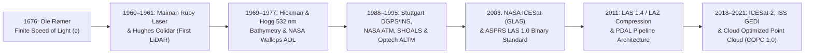

## 9.4 Historical Evolution (`gis-history` Context)

The evolution of Light Detection and Ranging (LiDAR) from a seventeenth-century astronomical timing anomaly into the primary high-resolution 3D measurement technology for both terrestrial elevation ($z$, positive upward) and shallow coastal bathymetry ($d$, positive downward) spans more than three centuries of optical physics, inertial navigation, and open geospatial data engineering. Every modern airborne, spaceborne, and Unmanned Aircraft System (UAS) laser altimeter rests on two foundational physical breakthroughs—the constancy and finiteness of the speed of light and the invention of stimulated optical emission—paired with late-twentieth-century advances in carrier-phase Global Navigation Satellite System (GNSS) trajectories and early-twenty-first-century binary point-cloud standardization.



---

### 9.4.1 1676: Ole Rømer and the Finite Speed of Light (`gis-history`)

Every time-of-flight ranging sensor converts a measured round-trip propagation delay $\Delta t$ into a slant range $R$ via the fundamental speed of electromagnetic waves in a medium of group refractive index $n_g$:

$$R = \frac{c}{2 n_g} \, \Delta t$$

where:
- $R$ is the one-way geometric slant range ($\text{m}$),
- $c = 299{,}792{,}458\text{ m/s}$ is the exact speed of light in vacuum (defined as an exact SI constant by the 17th Conférence Générale des Poids et Mesures in 1983),
- $n_g$ is the dimensionless group refractive index of the propagation medium ($n_g \approx 1.00029$ in standard dry troposphere; $n_g \approx 1.3651$ for $\lambda = 532\text{ nm}$ green laser pulse envelopes in standard seawater [$S = 35\text{ PSU}$, $T = 20^\circ\text{C}$], which exceeds the phase refractive index $n_p \approx 1.3411$ due to normal chromatic dispersion; see Section 9.5.4), and
- $\Delta t$ is the two-way elapsed travel time ($\text{s}$).

Before 1676, natural philosophers following Aristotle and René Descartes largely assumed that light propagated instantaneously across space ($c \to \infty$). Working at the Paris Observatory under Jean-Dominique Cassini, the Danish astronomer **Ole Christensen Rømer** (`gis-history`, 1676) analyzed more than eight years of eclipse timings of Jupiter's innermost Galilean moon, Io ($P_{\text{Io}} \approx 42.46\text{ h}$). Rømer demonstrated that the observed intervals between successive immersions or emersions of Io into Jupiter's shadow systematically lengthened when Earth was receding from Jupiter (moving toward conjunction) and shortened when Earth was approaching Jupiter (moving toward opposition). Over the full baseline of Earth's orbital diameter ($2\text{ AU} \approx 2.992 \times 10^{11}\text{ m}$), the cumulative timing residual reached approximately $22\text{ minutes}$ (modern value $16\text{ min } 38\text{ s}$, or $998\text{ s}$), proving unequivocally that light travels at a finite velocity.

Differentiating the fundamental range equation with respect to $\Delta t$ and $n_g$ exposes the unforgiving timing sensitivity that governs all laser altimetry error budgets:

$$\sigma_R^2 = \left(\frac{c}{2 n_g}\right)^2 \sigma_{\Delta t}^2 + \left(\frac{c \, \Delta t}{2 n_g^2}\right)^2 \sigma_{n_g}^2 = \left(\frac{c}{2 n_g}\right)^2 \sigma_{\Delta t}^2 + \left(\frac{R}{n_g}\right)^2 \sigma_{n_g}^2$$

In air ($n_g \approx 1$), a two-way timing uncertainty of $\sigma_{\Delta t} = 1\text{ ns}$ ($10^{-9}\text{ s}$) translates directly to a one-way range uncertainty of $\sigma_R \approx 14.99\text{ cm}$ ($0.15\text{ m}$). Achieving centimeter-level vertical uncertainty ($\sigma_z \le 1.5\text{ cm}$) therefore demands picosecond-class timing discrimination ($\sigma_{\Delta t} \le 100\text{ ps}$) alongside parts-per-million atmospheric refractivity modeling in terrestrial surveys and parts-per-thousand hydrographic sound- and light-speed profiling in bathymetric surveys.

---

### 9.4.2 1960–1971: The Ruby Laser, Colidar, Underwater Blue-Green Propagation, and Apollo (`gis-history`)

For nearly three centuries after Rømer, optical distance measurement remained limited to phase-modulated incoherent light beams (such as Erik Bergstrand's 1947–1950 *Geodimeter* for terrestrial baseline geodesy), because thermal and arc lamps could not produce the megawatt peak powers, nanosecond pulse widths, or milliradian spatial coherence required for non-cooperative terrain or seafloor ranging.

1. **1960 — First Working Laser (Theodore H. Maiman, `gis-history`):** On May 16, 1960, physicist **Theodore H. Maiman** at Hughes Research Laboratories in Malibu, California, achieved the first stimulated optical emission using a flashlamp-pumped synthetic pink ruby crystal ($\text{Cr}^{3+}:\text{Al}_2\text{O}_3$) emitting deep-red coherent pulses at $\lambda = 694.3\text{ nm}$. Within two years, R. W. Hellwarth and F. J. McClung at Hughes invented **Q-switching** (1961–1962), compressing ruby and neodymium-doped glass laser emissions into giant pulses of $5\text{–}30\text{ ns}$ Full Width at Half Maximum (FWHM).
2. **1961 — First Laser Rangefinder / LiDAR (*Colidar*, `gis-history`):** In early 1961, Malcolm L. Stitch and colleagues at **Hughes Aircraft Company** integrated a Q-switched ruby laser with a photomultiplier tube (PMT) receiver and high-speed crystal oscillator counter to build the **Colidar** (*Coherent Light Detecting and Ranging*) mark I rangefinder—the first operational LiDAR system, capable of ranging non-cooperative terrestrial targets over several kilometers. In 1963, **Giorgio Fiocco and Louis D. Smullin** at the Massachusetts Institute of Technology (MIT) directed a pulsed ruby laser into the upper atmosphere, establishing atmospheric backscatter LiDAR.
3. **1969 — First Bathymetric Laser Experiment (Hickman & Hogg):** Because water exhibits extreme electromagnetic absorption in the red and near-infrared spectrum ($\alpha > 0.5\text{ m}^{-1}$ at $694\text{ nm}$ and $\alpha > 15\text{ m}^{-1}$ at $1064\text{ nm}$), ruby and fundamental Nd:YAG lasers could not penetrate water bodies. Taking advantage of Jerlov's coastal optical transmission window ($470\text{–}550\text{ nm}$), **G. Daniel Hickman and John E. Hogg** at Syracuse University Research Corporation (1969) demonstrated the first pulsed blue-green ($\lambda = 532\text{ nm}$, frequency-doubled $\text{Nd:YAG}$ and neon gas laser) underwater bathymetric time-of-flight measurements in a laboratory tank and across the nearshore waters of Lake Ontario, proving that a single optical waveform records both a specular surface return and a delayed benthic bottom echo.
4. **1971–1972 — First Spaceborne Planetary Laser Altimeters (*Apollo 15, 16, and 17*):** The first orbital laser altimeters were flown not around Earth, but in lunar orbit aboard the Scientific Instrument Module (SIM) bays of **Apollo 15 (1971), Apollo 16 (1972), and Apollo 17 (1972)**. These flashlamp-pumped Q-switched ruby laser altimeters ($694.3\text{ nm}$, $200\text{ mJ}$ per pulse, $10\text{ ns}$ pulse width, $1\text{ m}$ range resolution) operated at $0.05\text{ Hz}$ (one shot every $20\text{ s}$) synchronized with the Apollo Metric Mapping Camera to constrain the lunar figure and calibrate photogrammetric block adjustments.

---

### 9.4.3 1970s–1990s: Kinematic GNSS/INS Integration and Airborne Topographic & Bathymetric Scanners

Throughout the 1970s and early 1980s, experimental airborne laser profilers—including the **NASA Wallops Flight Facility Airborne Oceanographic Lidar (AOL)** developed by Frank E. Hoge and R. N. Swift in 1977 (Hoge et al., 1980) and early Australian (*WRELADS*) and Swedish (*FLASH*) hydrographic systems—proved that airborne lasers could penetrate forest canopies and clear coastal waters up to $30\text{–}40\text{ m}$ deep. However, their utility for Digital Elevation Model (DEM) generation was crippled by aircraft positioning uncertainty: barometric altimeters, microwave transponders, and standalone C/A-code GPS left $2\text{–}10\text{ m}$ vertical and horizontal trajectory biases, restricting early profilers to relative wave-height or canopy-height profiling rather than absolute geodetic mapping.

The transformation of airborne LiDAR into an operational geodetic mapping instrument occurred between 1988 and 1995 through three converging innovations:

- **1988–1993 Stuttgart University DGPS/INS Trials:** Under **Friedrich Ackermann** and **Joachim Lindenberger** at the Institute of Photogrammetry, University of Stuttgart (Lindenberger, 1993; Ackermann, 1999), researchers coupled a kinematic Differential GPS (DGPS) carrier-phase solution with an Inertial Navigation System (INS) via Kalman filtering to resolve the 6-degree-of-freedom aircraft trajectory $(\mathbf{r}_{\text{IMU}}(t), \phi(t), \theta(t), \psi(t))$ to decimeter precision ($\sigma_z \approx 10\text{–}15\text{ cm}$), publishing the first true bare-earth laser DEMs filtered via autoregressive morphological profiling. Formally, their work operationalized the **Airborne LiDAR Direct Georeferencing Equation**, which maps a laser pulse with measured slant range $R(t)$ and instantaneous scanner mirror angle $\alpha(t)$ into the Earth-centered or local mapping frame:

$$\mathbf{p}_{\text{ground}}(t) = \mathbf{r}_{\text{IMU}}(t) + \mathbf{R}_{\text{nav}}^{\text{map}}\!\left(\phi(t), \theta(t), \psi(t)\right) \left[ \Delta \mathbf{l}_{\text{IMU}\to\text{laser}} + \mathbf{R}_{\text{boresight}}\!\left(\Delta\omega, \Delta\phi, \Delta\kappa\right) \, \mathbf{R}_{\text{scan}}\!\left(\alpha(t)\right) \begin{bmatrix} 0 \\ 0 \\ -R(t) \end{bmatrix} \right]$$

where:
  - $\mathbf{r}_{\text{IMU}}(t) = \mathbf{r}_{\text{GNSS}}(t) - \mathbf{R}_{\text{nav}}^{\text{map}}(t)\,\Delta\mathbf{l}_{\text{IMU}\to\text{GNSS}}$ is the Kalman-filtered 3D position vector of the IMU navigation center at pulse emission time $t$ ($\text{m}$, reduced from the GNSS antenna phase center $\mathbf{r}_{\text{GNSS}}(t)$ via the surveyed IMU-to-GNSS lever arm $\Delta\mathbf{l}_{\text{IMU}\to\text{GNSS}}$),
  - $\mathbf{R}_{\text{nav}}^{\text{map}}(\phi, \theta, \psi) \in \text{SO}(3)$ is the IMU-derived roll ($\phi$), pitch ($\theta$), and heading ($\psi$) rotation matrix from the aircraft body/navigation frame to the mapping frame,
  - $\Delta \mathbf{l}_{\text{IMU}\to\text{laser}}$ is the surveyed 3D lever-arm offset vector in the body frame from the IMU origin to the laser scanner optical reference center ($\text{m}$), and
  - $\mathbf{R}_{\text{boresight}}(\Delta\omega, \Delta\phi, \Delta\kappa)$ is the angular boresight misalignment matrix between the IMU axes and the laser scanner frame, calibrated over overlapping cross-strips.
- **1991–1995 NASA Airborne Topographic Mapper (ATM) & Commercialization:** At NASA Wallops, **William B. Krabill** and colleagues built the **Airborne Topographic Mapper (ATM)** using a conical nutating-mirror scanner ($532\text{ nm}$, $5\text{ kHz}$) to monitor Greenland ice-sheet mass balance (Krabill et al., 1995). Simultaneously, Canadian manufacturer **Optech Inc.** (founded by Allan Carswell in 1974) delivered the **ALTM 1020** (Airborne Laser Terrain Mapper, $1064\text{ nm}$, $1\text{–}5\text{ kHz}$) in 1993–1995, soon joined by **Riegl**, **TopEye**, and **Azimuth/Leica**, initiating commercial terrestrial LiDAR mapping.
- **1994 USACE/Optech SHOALS (Scanning Hydrographic Operational Airborne Lidar Survey):** Developed jointly by the U.S. Army Corps of Engineers, the Canadian Hydrographic Service, and Optech, **SHOALS** deployed a collinear dual-wavelength laser transmitter ($1064\text{ nm}$ infrared for exact air-water interface detection and $532\text{ nm}$ green for seafloor penetration) at $200\text{ Hz}$ (later upgraded to $400\text{ Hz}$ and $1\text{–}3\text{ kHz}$) with a constant $20^\circ$ off-nadir conical scan to stabilize air-water Snell refraction and eliminate nadir sunglint, establishing modern Airborne Lidar Bathymetry (ALB; Guenther et al., 2000).

---

### 9.4.4 2003: NASA *ICESat* Launch and the ASPRS `LAS 1.0` Standard (`gis-history`)

The year **2003** marked a watershed for both spaceborne global elevation science and terrestrial/marine point-cloud interoperability (`gis-history`):

1. **January 13, 2003 UTC (January 12 Local PST) — NASA *ICESat* (GLAS) Launch (`gis-history`):** NASA launched the **Ice, Cloud, and land Elevation Satellite (*ICESat*)** carrying the **Geoscience Laser Altimeter System (GLAS)**, designed by Jay Zwally, Bob Schutz, James Abshire, and colleagues (Zwally et al., 2002). Operating at $40\text{ Hz}$ with dual $1064\text{ nm}$ (surface altimetry) and $532\text{ nm}$ (atmospheric cloud/aerosol) Nd:YAG lasers producing $\sim 70\text{ m}$ footprints spaced every $172\text{ m}$ along track, *ICESat* (2003–2009) digitized full-waveform echoes to measure polar ice-sheet elevation change with $< 2\text{ cm/yr}$ regional bias and provided the first global spaceborne reference control network for calibrating SRTM, ASTER GDEM, and Copernicus DEM tiles.
2. **May 2003 — ASPRS `LAS 1.0` Binary Point Cloud Format (`gis-history`):** Prior to 2003, airborne LiDAR vendors delivered point clouds in either proprietary binary dumps locked to vendor workstations or massive, schema-less ASCII text files (`X, Y, Z, Intensity`) that discarded return numbers, scan angles, GPS timestamps, and classification flags while ballooning to tens of gigabytes per flight line. Spearheaded by the **American Society for Photogrammetry and Remote Sensing (ASPRS)** LiDAR Committee (with foundational architectural contributions from Optech, Leica, TerraSolid's Arttu Soininen, and industry partners), the **`LAS 1.0` specification** introduced a compact, public binary format with a standardized Public Header Block, Variable Length Records (VLRs) for georeferencing metadata, and fixed-point 32-bit integer coordinates:

$$X_{\text{world}} = X_{\text{int}} \cdot S_x + O_x, \qquad Y_{\text{world}} = Y_{\text{int}} \cdot S_y + O_y, \qquad Z_{\text{world}} = Z_{\text{int}} \cdot S_z + O_z$$

where $(X_{\text{int}}, Y_{\text{int}}, Z_{\text{int}}) \in [-2^{31}, 2^{31}-1]$ are signed 32-bit integers, $(S_x, S_y, S_z)$ are double-precision scale factors (typically $0.001\text{ m}$ or $0.01\text{ m}$), and $(O_x, O_y, O_z)$ are double-precision coordinate offsets. Subsequent revisions expanded the ecosystem:
- **`LAS 1.1` (2005) & `LAS 1.2` (2008):** Standardized ASPRS classification codes (e.g., Class `2` = Bare-Earth Ground, Class `9` = Water), added RGB color channels, and introduced the `Global Encoding` bit flag distinguishing **GPS Week Seconds** ($0 \le t_{\text{week}} < 604{,}800\text{ s}$, which rolls over every Sunday at `00:00:00 GPST`) from **Adjusted Standard GPS Time**:

$$t_{\text{adj}} = t_{\text{GPS}} - 1.0 \times 10^9\text{ s}$$

  where subtracting $10^9\text{ s}$ (corresponding to September 14, 2001 `01:46:40 GPST`) preserves sub-microsecond IEEE-754 `float64` mantissa precision across multi-day campaigns without week-rollover ambiguity.
- **`LAS 1.3` (2009):** Added digitized full-waveform packet descriptors (Point Data Record Formats 4 and 5) to support bathymetric and forestry waveform processing.
- **`LAS 1.4` (2011):** Expanded point counts beyond $2^{32}-1$ ($4.29\text{ billion}$ points) via 64-bit counters, expanded return numbers from 3 bits ($7$ returns) to 4 bits ($15$ returns), mandated OGC Well-Known Text (WKT) Coordinate Reference System (CRS) definitions, and codified **ASPRS Bathymetric Point Classes** (`Class 40` = Bathymetric Bottom / Submerged Topography, `Class 41` = Water Surface, `Class 42` = Derived Water Surface, `Class 43` = Submerged Object, `Class 45` = Water Column / No-Bottom-Found).
- **`LAZ` Compression (Martin Isenburg, 2008–2011; Isenburg, 2013):** Computer scientist **Martin Isenburg** (`libLAS` / `LAStools`) created **`LAZ`**, an open-source, 100% lossless streaming compressor that exploits spatial and temporal coherence between sequential laser pulses using predictive coding and arithmetic entropy encoding, shrinking `LAS` files to $10\text{–}18\%$ of their uncompressed size without losing a single bit of precision.

> [!WARNING]
> **Common Pitfall — `LAS 1.2` vs. `LAS 1.4` Point Data Record Format (PDRF) Bit-Field Truncation and GPS Time Rollover:**
> 1. **Bit-Field Truncation:** Legacy `LAS 1.0–1.3` Point Data Record Formats (`PDRF 0–5`) allocate only **5 bits** (`0–31`) to the `Classification` field (preserving the upper 3 bits for `Synthetic`, `Key-point`, and `Withheld` flags) and only **3 bits** (`1–5` or `1–7`) to `Return Number`. Attempting to write standard ASPRS Bathymetric classes (`Class 40` Submerged Bottom, `Class 41` Water Surface) or high-density forestry returns ($\ge 8$ returns per pulse) into `PDRF 0–5` silently truncates or overflows the bit fields. Always use **`LAS 1.4` Extended Point Data Record Formats (`PDRF 6–10`)**, which provide a full 8-bit (`0–255`) classification byte and 4-bit (`0–15`) return counters.
> 2. **GPS Week Seconds vs. Adjusted Standard GPS Time:** Merging flight lines delivered in GPS Week Seconds (`Global Encoding` bit 0 = `0`) across a Saturday-to-Sunday midnight UTC/GPST boundary or across multiple weeks without converting to Adjusted Standard GPS Time (`Global Encoding` bit 0 = `1`) corrupts dynamic strip adjustment (`TerraMatch`, `BayesMap`) and tidal time-series interpolation in bathymetric surveys.

---

### 9.4.5 2011–2021: `PDAL`, Spaceborne Photon-Counting (*ICESat-2* & *GEDI*), and Cloud-Native `COPC 1.0` (`gis-history`)

As national mapping programs—such as the **U.S. Geological Survey (USGS) 3D Elevation Program (3DEP)**, the **NOAA/USACE Joint Airborne Lidar Bathymetry Technical Center of Expertise (JALBTCX)**, and the Netherlands **AHN**—scaled from millions to trillions of points, file-by-file desktop processing collapsed under I/O bottlenecks.

1. **2011 — `PDAL` (Point Data Abstraction Library) Initial Release (`gis-history`):** Initiated by **Howard Butler (Hobu Inc.)**, Michael Rosen, and Brad Chambers in 2011 (Butler et al., 2021), **`PDAL`** brought the modular format-abstraction philosophy of `GDAL` to 3D point clouds. Instead of imperative scripts, `PDAL` introduced declarative JSON pipelines chaining readers (`readers.las`, `readers.copc`), geometric and statistical filters (`filters.smrf` for Simple Morphological ground filtering, `filters.outlier`, `filters.projpipeline`), and rasterizing writers (`writers.gdal`) capable of streaming multi-billion-point surveys into geodetically rigorous DEMs.
2. **2018 — NASA *ICESat-2* (`ATLAS`) and *ISS GEDI* Launches (`gis-history`):**
   - On September 15, 2018, NASA launched ***ICESat-2*** carrying the **Advanced Topographic Laser Altimeter System (ATLAS)** (Markus et al., 2017), a $\lambda = 532\text{ nm}$ green micro-pulse, single-photon-sensitive LiDAR operating at $10\text{ kHz}$ across 6 beams (3 pairs of strong/weak beams with a $4:1$ transmit energy ratio, $\sim 11\text{–}17\text{ m}$ footprint diameter, and $0.70\text{ m}$ [$70\text{ cm}$] along-track spacing). Because $532\text{ nm}$ light penetrates clear coastal water, *ICESat-2* revolutionized global spaceborne bathymetry (Parrish et al., 2019), resolving coral reefs and nearshore seabeds down to $d \approx 40\text{ m}$ ($K_d \, d_{\max} \approx 4.5$) with decimeter vertical precision, enabling direct validation of global coastal DEMs and empirical optical Satellite-Derived Bathymetry (SDB) models.
   - On December 5, 2018, NASA launched the **Global Ecosystem Dynamics Investigation (*GEDI*)** to the International Space Station (Dubayah et al., 2020)—a $1064\text{ nm}$ full-waveform laser altimeter using 3 lasers split and dithered into 8 parallel beams ($25\text{ m}$ footprint, $60\text{ m}$ along-track spacing, $600\text{ m}$ cross-track spacing) dedicated to mapping tropical and temperate forest vertical canopy structure and sub-canopy ground elevation between $51.6^\circ\text{ N}$ and $51.6^\circ\text{ S}$.
3. **2021 — `COPC 1.0` (Cloud Optimized Point Cloud) Specification (`gis-history`):** While Cloud Optimized GeoTIFF (`COG`) enabled random HTTP `Range` access to 2D raster DEMs, compressed `.laz` files remained sequential streams that had to be downloaded in full or unpacked into millions of tiny Entwine Point Tile (`EPT`) files. Released in late 2021 by Howard Butler, Connor Manning, Norman Barker, Martin Isenburg (posthumously), and the open geospatial community, **`COPC 1.0` (`.copc.laz`)** embeds a clustered **octree spatial index** inside a standard, fully backward-compatible `LAS 1.4` (`PDRF 6–8`) `.laz` file:
   - A 160-byte **COPC Info VLR** (`user_id = "copc"`, `record_id = 1`) stores the root octree bounding cube $[X_{\min}, Y_{\min}, Z_{\min}, \text{size}]$ and root point spacing.
   - A **COPC Hierarchy EVLR** (`user_id = "copc"`, `record_id = 1000`) maps 3D octree voxel keys $(D, X_i, Y_i, Z_i)$ at octree depth $D$ to exact byte offsets and point counts of independently decompressible `LAZ` chunks.
   - Because each octree node at depth $D$ stores a uniform Poisson-disk or grid-thinned subsample with nominal spacing $\Delta s_D = \Delta s_0 / 2^D$, a client requesting a $2\text{ m}$ DEM over a $1\text{ km}^2$ coastal tile fetches only the top octree levels ($D = 0\text{–}3$) via HTTP `Range` requests, reducing network I/O by $85\text{–}98\%$ compared to reading raw `.laz` strips.

---

### 9.4.6 Chronological Synthesis and Worked Timing/Accuracy Evolution

Table 9.1 summarizes the progression of laser altimetry across hardware physics, trajectory georeferencing, vertical/horizontal uncertainty budgets (Total Vertical Uncertainty $\text{TVU}$ and Total Horizontal Uncertainty $\text{THU}$ at $95\%$ confidence, $k = 1.96$), and open data formats.

| Era & Milestone (`gis-history`) | Wavelength $\lambda$ & Pulse Rate | Trajectory & Georeferencing | Typical Point Density (pts/$\text{m}^2$) | $\text{THU}_{95\%}$ (m) | $\text{TVU}_{95\%}$ (m) | Primary Data Representation |
| :--- | :--- | :--- | :--- | :--- | :--- | :--- |
| **1676 Rømer Io Eclipse Timing** | Broadband solar reflection | Astronomical ephemerides ($2\text{ AU}$ baseline) | N/A | N/A | $\sim 26\%$ error in $c$ | Manuscript eclipse tables |
| **1960–1961 Maiman Ruby Laser & Hughes Colidar** | $694.3\text{ nm}$, $0.1\text{–}1\text{ Hz}$ | Tripod / optical theodolite mount | Single-target line of sight | $\sim 5.0$ | $\sim 1.5\text{–}3.0$ (range) | Oscilloscope trace / counter |
| **1969 Hickman & Hogg / 1977 NASA AOL** | $532\text{ nm}$, $100\text{–}400\text{ Hz}$ | Barometric / Loran-C / early radar altimeter | $< 0.01$ (profile) | $10\text{–}50$ | $0.30\text{–}0.50$ (relative depth) | 7-track magnetic tape |
| **1971 Apollo 15–17 Lunar Laser Altimeter** | $694.3\text{ nm}$, $0.05\text{ Hz}$ | Deep Space Network Doppler + stellar camera | Along-track every $30\text{ km}$ | $500\text{–}1000$ | $\sim 2.0\text{–}10.0$ | NASA PDS tabular records |
| **1988–1995 Stuttgart DGPS/INS, Optech ALTM & SHOALS** | $1064\text{ nm}$ (topo) / $532\text{ nm}$ (bathy), $0.2\text{–}5\text{ kHz}$ | Carrier-phase DGPS + tactical/nav-grade INS | $0.1\text{–}1.0$ | $0.50\text{–}1.50$ | $0.15\text{–}0.30$ | Vendor binary / ASCII `XYZ` |
| **2003 NASA *ICESat* (GLAS) & ASPRS `LAS 1.0`** | $1064\text{ nm}$ & $532\text{ nm}$, $40\text{ Hz}$ (space); $50\text{ kHz}$ (air) | Precision Orbit Determination (POD) + star trackers | $70\text{ m}$ spots (space); $1\text{–}4$ (air) | $10.0$ (space); $0.30$ (air) | $0.14$ (space); $0.10\text{–}0.15$ (air) | HDF5 (GLAS) / Binary `LAS 1.0` |
| **2011 `LAS 1.4`, `LAZ`, and `PDAL`** | $1064 / 1550 / 532\text{ nm}$, $200\text{–}500\text{ kHz}$ (MTA) | PPP / Multi-constellation GNSS + fiber-optic IMU | $4\text{–}20$ (topo); $1\text{–}5$ (bathy) | $0.15\text{–}0.30$ | $0.05\text{–}0.10$ (topo); $\sqrt{a^2+(bd)^2}$ (bathy) | `LAS 1.4` (`PDRF 6–10`), `.laz` |
| **2018–2021 *ICESat-2*, *GEDI*, & `COPC 1.0`** | $532\text{ nm}$ ($10\text{ kHz}$ photon) / $1\text{–}4\text{ MHz}$ airborne | Tightly coupled GNSS/IMU + strip adjustment | $10\text{–}100+$ (airborne/UAS) | $3.5\text{–}6.5$ (space); $0.05\text{–}0.15$ (air) | $<0.10$ (space); $0.02\text{–}0.05$ (topo); IHO Exclusive Order (bathy) | HDF5 (`ATL03/08`), `.copc.laz` |

#### Worked Numerical Comparison: Range Precision Across Three Generations of Altimetry

Consider how two-way timing uncertainty $\sigma_{\Delta t}$ and refractive index uncertainty $\sigma_{n_g}$ govern the one-way slant range error $\sigma_R$ across three milestone systems:

1. **1971 Apollo 15 Ruby Laser Altimeter ($n_g = 1.00000$ in lunar vacuum):**
   The Apollo counter clock operated at $150\text{ MHz}$ ($\Delta t_{\text{bin}} = 6.67\text{ ns}$), yielding a uniform quantization standard deviation $\sigma_{\Delta t} = \Delta t_{\text{bin}} / \sqrt{12} \approx 1.92\text{ ns}$ and total detector timing jitter $\sigma_{\Delta t,\text{tot}} \approx 6.7\text{ ns}$:
   $$\sigma_R = \frac{2.99792 \times 10^8\text{ m/s}}{2 \times 1.00000} \left(6.7 \times 10^{-9}\text{ s}\right) = 1.00\text{ m}$$
2. **1995 Early Commercial Airborne Topographic Scanner ($R = 1000\text{ m}$ in air, $n_g = 1.00028$, $\sigma_{n_g} = 10^{-5}$):**
   With constant-fraction discriminator timing jitter $\sigma_{\Delta t} = 0.50\text{ ns}$:
   $$\sigma_R = \sqrt{\left(\frac{2.99792 \times 10^8}{2 \times 1.00028} \times 5.0 \times 10^{-10}\right)^2 + \left(\frac{1000}{1.00028} \times 10^{-5}\right)^2} = \sqrt{(0.0749\text{ m})^2 + (0.0100\text{ m})^2} \approx 0.0756\text{ m}\text{ ($7.6\text{ cm}$)}$$
3. **2021 Modern Airborne Bathymetric LiDAR in Coastal Water ($d = 20.0\text{ m}$ sub-surface path at $\theta_w = 14.8^\circ$, $R_w = 20.69\text{ m}$, $n_g = 1.3651$, $\sigma_{\Delta t} = 0.15\text{ ns}$, $\sigma_{n_g} = 0.0015$ from unmodeled thermocline/halocline):**
   $$\sigma_{R_w} = \sqrt{\left(\frac{2.99792 \times 10^8}{2 \times 1.3651} \times 1.5 \times 10^{-10}\right)^2 + \left(\frac{20.69}{1.3651} \times 0.0015\right)^2} = \sqrt{(0.0165\text{ m})^2 + (0.0227\text{ m})^2} \approx 0.0281\text{ m}\text{ ($2.8\text{ cm}$)}$$
   Note that even when timing electronics reach $150\text{ ps}$ precision ($1.7\text{ cm}$ range component), in-water slant-range error is supplemented by wave-slope refraction uncertainty and seafloor pulse-stretching, which dominate the depth-dependent term $b \cdot d$ in the IHO S-44 Total Vertical Uncertainty model $\text{TVU}_{95\%}(d) = \sqrt{a^2 + (b \, d)^2}$.

```bash
# Modern Cloud-Native Workflow (2011 PDAL + 2021 COPC 1.0 Milestone):
# Stream only bare-earth ground (Class 2) and submerged bathymetric bottom (Class 40)
# points inside a coastal bounding box from a remote .copc.laz archive into a 1 m GeoTIFF DEM
pdal pipeline --stdin << 'EOF'
{
  "pipeline": [
    {
      "type": "readers.copc",
      "filename": "https://s3.amazonaws.com/usgs-lidar-public/FL_Peninsular_TB_2018/ept.copc.laz",
      "bounds": "([452000, 453000], [3064000, 3065000])",
      "resolution": 1.0
    },
    {
      "type": "filters.range",
      "limits": "Classification[2:2], Classification[40:40]"
    },
    {
      "type": "writers.gdal",
      "filename": "topobathy_1m_idw.tif",
      "resolution": 1.0,
      "output_type": "idw",
      "nodata": -9999.0
    }
  ]
}
EOF
```

> [!IMPORTANT]
> **Key Takeaways — Historical Evolution of LiDAR and Point Cloud Architecture:**
> 1. **Physics First, Trajectories Second, Standards Third:** While Maiman's ruby laser (1960) and Hughes's *Colidar* (1961) established pulsed optical ranging based on Rømer's finite speed of light (1676), operational topographic and bathymetric DEM production became possible only in the early 1990s when carrier-phase kinematic GNSS and inertial measurement units (IMUs) reduced mobile platform trajectory errors below $10\text{–}15\text{ cm}$.
> 2. **Binary Standardization Enabled Industrial Scale:** The 2003 ASPRS `LAS 1.0` standard (`gis-history`) and subsequent `LAS 1.4` (2011) and `LAZ` compression eliminated proprietary vendor lock-in and preserved pulse-level metadata (return topology, scan angle, GPS time, and standardized topographic/bathymetric classifications).
> 3. **Cloud-Native Point Clouds (`PDAL` + `COPC`):** The combination of `PDAL` pipelines (2011) and octree-indexed `COPC 1.0` archives (2021) paired with global spaceborne control from *ICESat* (2003), *ICESat-2* (2018), and *GEDI* (2018) allows continental-scale topobathymetric point clouds to be queried, reprojected, and gridded on demand without local file duplication.

---

### References

- Ackermann, F. (1999). Airborne laser scanning—present status and future expectations. *ISPRS Journal of Photogrammetry and Remote Sensing*, 54(2–3), 64–67. https://doi.org/10.1016/S0924-2716(99)00009-X
- American Society for Photogrammetry and Remote Sensing (ASPRS). (2003). *LAS Specification Version 1.0*. Bethesda, MD: ASPRS. (Updated to *LAS Specification 1.4 – R15*, 2019).
- Butler, H., Chambers, B., Hartzell, P., & Glennie, C. (2021). PDAL: An open source library for the processing and analysis of point clouds. *Computers & Geosciences*, 148, 104680. https://doi.org/10.1016/j.cageo.2020.104680
- Dubayah, R., Blair, J. B., Goetz, S., Fatoyinbo, L., Hansen, M., Healey, S., Hofton, M., Hurtt, G., Kellner, J., Luthcke, S., Armston, J., Tang, H., Duncanson, L., Hancock, S., Jantz, P., Marselis, S., Patterson, P. L., Qi, W., & Silva, C. (2020). The Global Ecosystem Dynamics Investigation: High-resolution laser ranging of the Earth's forests and topography. *Science of Remote Sensing*, 1, 100002. https://doi.org/10.1016/j.srs.2020.100002
- Fiocco, G., & Smullin, L. D. (1963). Detection of scattering layers in the upper atmosphere (60–140 km) by optical radar. *Nature*, 199(4900), 1275–1276. https://doi.org/10.1038/1991275a0
- Guenther, G. C., Cunningham, A. G., LaRocque, P. E., & Reid, D. J. (2000). Meeting the accuracy challenge in airborne lidar bathymetry. *Proceedings of EARSeL-SIG-Workshop LIDAR*, Dresden, Germany, 1, 1–27.
- Hickman, G. D., & Hogg, J. E. (1969). Application of an airborne pulsed laser for near shore bathymetric measurements. *Remote Sensing of Environment*, 1(1), 47–58. https://doi.org/10.1016/S0034-4257(69)90088-1
- Hoge, F. E., Swift, R. N., & Frederick, E. B. (1980). Water depth measurement using an airborne pulsed neon laser system. *Applied Optics*, 19(6), 871–883. https://doi.org/10.1364/AO.19.000871
- Isenburg, M. (2013). LASzip: Lossless compression of LiDAR data. *Photogrammetric Engineering & Remote Sensing*, 79(2), 209–217. https://doi.org/10.14358/PERS.79.2.209
- Krabill, W. B., Thomas, R. H., Martin, C. F., Swift, R. N., & Frederick, E. B. (1995). Accuracy of airborne laser altimetry over the Greenland ice sheet. *International Journal of Remote Sensing*, 16(7), 1211–1222. https://doi.org/10.1080/01431169508954472
- Lindenberger, J. (1993). *Laser-Profilmessungen zur topographischen Geländeaufnahme*. Deutsche Geodätische Kommission, Series C, No. 400, Munich.
- Maiman, T. H. (1960). Stimulated optical radiation in ruby. *Nature*, 187(4736), 493–494. https://doi.org/10.1038/187493a0
- Markus, T., Neumann, T., Martino, A., Abdalati, W., Brunt, K., Csatho, B., Farrell, S., Fricker, H., Gardner, A., Harding, D., Jasinski, M., Kwok, R., Magruder, L., Lubin, D., Luthcke, S., Morison, J., Nelson, R., Neuenschwander, A., Palm, S., Popescu, S., Shum, C. K., Schutz, B. E., Smith, B., Yang, Y., & Zwally, J. (2017). The Ice, Cloud, and land Elevation Satellite-2 (ICESat-2): Science requirements, concept, and implementation. *Remote Sensing of Environment*, 190, 260–273. https://doi.org/10.1016/j.rse.2016.12.029
- Parrish, C. E., Magruder, L. A., Neuenschwander, A. L., Forfinski-Sarkozi, N., Alonzo, M., & Jasinski, M. (2019). Validation of ICESat-2 ATLAS bathymetry and analysis of ATLAS's bathymetric mapping performance. *Remote Sensing*, 11(14), 1634. https://doi.org/10.3390/rs11141634
- Rømer, O. (1676). Démonstration touchant le mouvement de la lumière trouvé par M. Römer de l'Académie Royale des Sciences. *Journal des Sçavans*, 7 Décembre 1676, 233–236.
- Zwally, H. J., Schutz, B., Abdalati, W., Abshire, J., Bentley, C., Brenner, A., Bufton, J., Dezio, J., Hancock, D., Harding, D., Herring, T., Minster, B., Quinn, K., Palm, S., Spinhirne, J., & Thomas, R. (2002). ICESat's laser measurements of polar ice, atmosphere, ocean, and land. *Journal of Geodynamics*, 34(3–4), 405–445. https://doi.org/10.1016/S0264-3707(02)00042-X
