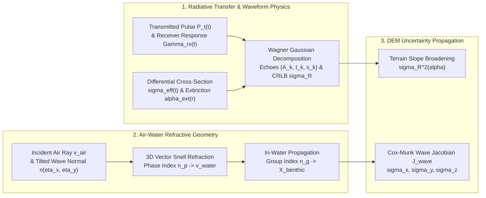

## 9.5 Mathematical Foundations

Transforming raw laser time-of-flight measurements and digitized return waveforms into a metrologically rigorous Digital Elevation Model (DEM) or bathymetric surface requires coupling **electromagnetic radiative transfer** with **three-dimensional vector ray optics** and **stochastic error propagation**. Unlike passive photogrammetry (Chapter 8), where vertical precision is governed by multi-ray triangulation geometry ($B/H$), active laser altimetry directly resolves slant range $R$ from the round-trip propagation time of a short optical pulse. However, the physical interaction of a finite-duration, diverging laser beam with vertically distributed canopy elements, steeply sloping terrain facets, or a wind-roughened, dispersive air–water interface introduces systematic range biases, pulse broadening, and refractive ray bending that must be modeled explicitly.

This section establishes the complete mathematical framework governing topographic and bathymetric LiDAR elevation modeling:
1. The **LiDAR laser range equation** and **full-waveform linear convolution model** linking transmitted optical power $P_t(t)$, system impulse response $\Gamma_{\text{rx}}(t)$, and target differential scattering cross-section $\sigma_{\text{eff}}(t)$ to received power $P_r(t)$.
2. **Gaussian waveform decomposition** (Wagner et al., 2006) and range-independent **radiometric backscatter cross-section calibration** ($\sigma_k \propto A_k s_k R_k^4$).
3. The **Cramér-Rao Lower Bound (CRLB)** on time-of-flight range precision and the analytical derivation of **slope- and footprint-induced pulse-broadening variance** $\sigma_R^2(\alpha)$.
4. Exact **3D vector Snell's law refractive ray-tracing** across a tilted gravity/capillary wave facet, the critical physical distinction between **phase refractive index** ($n_p$, governing ray bending) and **group refractive index** ($n_g$, governing pulse propagation speed), and **first-order Jacobian uncertainty propagation** of Cox-Munk sea-surface wave slopes into seafloor horizontal and vertical coordinates $(\sigma_{x,\text{wave}}, \sigma_{y,\text{wave}}, \sigma_{z,\text{wave}})$.



---

### 9.5.1 The LiDAR Laser Range Equation and Full-Waveform Convolution Model

Consider a pulsed laser transmitter emitting an optical pulse with instantaneous power $P_t(t)$ (in $\text{W}$) into a beam of full-angle divergence $\beta_t$ (in $\text{rad}$, defined at the $1/e^2$ irradiance contour). At slant range $R$ (in $\text{m}$) from the sensor, the circular cross-sectional area of the illuminated laser footprint is $A_{\text{beam}}(R) = \frac{\pi (R \beta_t)^2}{4}$ (in $\text{m}^2$). Along the propagation path $r \in [0, R]$, atmospheric aerosols, molecular Rayleigh scattering, or—in bathymetric LiDAR—water-column absorption and particulate scattering attenuate the beam according to the **Beer-Lambert-Bouguer law**, yielding a one-way transmittance $T(R) = \exp\!\left(-\int_0^R \alpha_{\text{ext}}(r)\,dr\right)$, where $\alpha_{\text{ext}}(r)$ is the linear extinction coefficient (in $\text{m}^{-1}$).

An elemental scatterer at range $R$ is characterized by its **effective differential scattering cross-section** $\sigma_{\text{eff}}$ (in $\text{m}^2$), defined as the area of an isotropic lossless reflector that would return the same optical power toward the receiver aperture as the actual target facet. For a Lambertian surface of bidirectional hemispherical reflectance $\rho_{\text{target}} \in [0, 1]$ inclined at local incidence angle $\theta_{\text{inc}}$ with physical surface area $dA_s$ (and beam-orthogonal projected area $dA_\perp = \cos\theta_{\text{inc}}\,dA_s$), the differential cross-section is $d\sigma_{\text{eff}} = 4 \rho_{\text{target}} \cos\theta_{\text{inc}} \, dA_\perp = 4 \rho_{\text{target}} \cos^2\theta_{\text{inc}} \, dA_s$ (where the factor of $4$ arises because a Lambertian hemisphere subtends $\pi\text{ sr}$ in cosine-weighted projection compared to $4\pi\text{ sr}$ for an isotropic sphere; for an extended plane filling the beam, $\int dA_\perp = A_{\text{beam}}$ gives $\sigma_{\text{eff}} = 4\rho_{\text{target}}\cos\theta_{\text{inc}}\,A_{\text{beam}}$). A coaxial circular receiver telescope of aperture diameter $D_r$ (in $\text{m}$, collecting area $A_r = \frac{\pi D_r^2}{4}$ in $\text{m}^2$) subtends a solid angle $\Omega_r = \frac{A_r}{R^2} = \frac{\pi D_r^2}{4 R^2}$ (in $\text{sr}$). Multiplying the incident irradiance at the target by the scattering cross-section $\sigma_{\text{eff}}$ (in $\text{m}^2$), the isotropic receiver solid-angle fraction $\frac{A_r}{4\pi R^2}$, the two-way transmittance $T(R)^2$, and the dimensionless optical/detector system efficiency $\eta_{\text{sys}} \in (0, 1)$ yields the instantaneous backscattered power from a discrete scatterer at range $R(t) = \frac{c \, t}{2}$:

$$
P_{\text{inst}}(t) = \frac{P_t(t)}{A_{\text{beam}}(R)} \, \sigma_{\text{eff}} \, \frac{A_r}{4\pi R^2} \, \eta_{\text{sys}} \, T(R)^2 = P_t(t) \left[ \frac{D_r^2}{4\pi R(t)^4 \beta_t^2} \eta_{\text{sys}} \sigma_{\text{eff}} \exp\!\left(-2\int_0^{R(t)} \alpha_{\text{ext}}(r)\,dr\right) \right]
$$

In a real full-waveform digitizing LiDAR, the finite temporal shape of the transmitted laser pulse $P_t(t)$ and the electrical/optical **receiver impulse response** $\Gamma_{\text{rx}}(t)$ (in $\text{s}^{-1}$, normalized such that $\int_{-\infty}^{\infty} \Gamma_{\text{rx}}(t)\,dt = 1$) smear the instantaneous target interaction across time. Modeling the distributed 3D target structure along the ray path by the temporal differential cross-section density $\tilde{\sigma}_{\text{eff}}(t) = \frac{d\sigma_{\text{eff}}}{dt} = \frac{c}{2}\frac{d\sigma_{\text{eff}}}{dR}$ (in $\text{m}^2\,\text{s}^{-1}$, such that $\int_{\text{echo } k} \tilde{\sigma}_{\text{eff}}(t)\,dt = \sigma_k$ in $\text{m}^2$) and adding continuous solar background and detector dark-current power $P_{\text{bg}}$ (in $\text{W}$) yields the **full-waveform LiDAR convolution equation**:

$$
P_r(t) = P_t(t) * \Gamma_{\text{rx}}(t) * \left[ \frac{D_r^2}{4\pi R(t)^4 \beta_t^2} \eta_{\text{sys}} \tilde{\sigma}_{\text{eff}}(t) \exp\!\left(-2\int_0^{R(t)} \alpha_{\text{ext}}(r)\,dr\right) \right] + P_{\text{bg}}
$$

where $*$ denotes continuous-time linear convolution $(f * g)(t) = \int_{-\infty}^{\infty} f(\tau)g(t-\tau)\,d\tau$. When the receiver impulse response $\Gamma_{\text{rx}}(t)$ and system efficiency $\eta_{\text{sys}}$ are absorbed into an effective calibrated system transmit waveform $P_{t,\text{eff}}(t) = \eta_{\text{sys}}(P_t * \Gamma_{\text{rx}})(t)$, this reduces directly to the compact range-convolution form:

$$
P_r(t) = P_{t,\text{eff}}(t) * \left[ \frac{D_r^2}{4\pi R(t)^4 \beta_t^2} \tilde{\sigma}_{\text{eff}}(t) \exp\!\left(-2\int_0^{R(t)} \alpha_{\text{ext}}(r)\,dr\right) \right] + P_{\text{bg}}
$$

---

### 9.5.2 Gaussian Waveform Decomposition and Radiometric Calibration (Wagner et al., 2006)

Following **Wagner et al. (2006)**, the composite system waveform $S(t) = (P_t * \Gamma_{\text{rx}})(t)$ of most solid-state $\text{Nd:YAG}$ ($1064\text{ nm}$ / $532\text{ nm}$) and fiber laser altimeters is well approximated by a zero-mean Gaussian kernel of standard deviation $s_t$ (in $\text{s}$, related to the Full Width at Half Maximum by $\text{FWHM}_t = 2\sqrt{2\ln 2}\,s_t \approx 2.3548\,s_t$). When the laser footprint illuminates $N_{\text{echo}}$ distinct vertical scattering horizons (e.g., upper canopy, understory, and bare ground in topographic LiDAR, or water surface and benthic floor in bathymetric LiDAR), each horizon $k \in \{1, \dots, N_{\text{echo}}\}$ centered at two-way travel time $t_k = \frac{2 R_k}{c}$ can be modeled as a local Gaussian differential cross-section distribution of temporal spread $s_{\text{target},k}$.

Because the convolution of two Gaussians with variances $s_t^2$ and $s_{\text{target},k}^2$ is strictly another Gaussian with variance $s_k^2 = s_t^2 + s_{\text{target},k}^2$, the digitized return waveform $P_r(t)$ decomposes into a parametric sum of $N_{\text{echo}}$ Gaussian components:

$$
P_r(t) = P_{\text{bg}} + \sum_{k=1}^{N_{\text{echo}}} A_k \exp\!\left( -\frac{(t - t_k)^2}{2 s_k^2} \right)
$$

where the three physical observables solved per echo via non-linear least squares (Levenberg-Marquardt) are:
* $t_k$ (in $\text{s}$): the **echo arrival time** (centroid), which determines the slant range $R_k = \frac{c \, t_k}{2}$.
* $s_k = \sqrt{s_t^2 + s_{\text{target},k}^2}$ (in $\text{s}$): the **echo pulse width**, which quantifies vertical target roughness, canopy thickness, or local terrain slope within the footprint.
* $A_k$ (in $\text{W}$ or digitizer $\text{DN}$): the **peak echo amplitude**.

Crucially, raw peak amplitude $A_k$ is *not* an invariant measure of surface reflectance: a tilted or rough surface stretches the return pulse ($s_k > s_t$), reducing the peak amplitude $A_k$ even when total backscattered energy is conserved. Integrating the $k$-th background-subtracted echo over time yields the total pulse energy $E_k = \int_{-\infty}^{\infty} A_k \exp\!\left(-\frac{(t-t_k)^2}{2s_k^2}\right) dt = \sqrt{2\pi} \, A_k s_k$. Equating $E_k$ to the time-integrated LiDAR range equation at range $R_k$ yields the **Wagner et al. (2006) calibrated backscatter cross-section** $\sigma_k$ (in $\text{m}^2$):

$$
\sigma_k = C_{\text{cal}} \, A_k \, s_k \, R_k^4 \exp\!\left(2\int_0^{R_k} \alpha_{\text{ext}}(r)\,dr\right) \propto A_k \, s_k \, R_k^4
$$

where $C_{\text{cal}} = \frac{(4\pi)^{3/2} \beta_t^2}{\sqrt{2} \, D_r^2 \, \eta_{\text{sys}} \, E_t}$ (in $\text{m}^{-2}\,\text{W}^{-1}\,\text{s}^{-1}$) is a single instrument calibration constant determined over a reference target (e.g., an asphalt apron or calibrated Spectralon panel of known reflectance), and $E_t = \int P_t(t)\,dt$ is the transmitted pulse energy (in $\text{J}$). Dividing $\sigma_k$ by the illuminated footprint area $A_{\text{beam}}(R_k) = \frac{\pi R_k^2 \beta_t^2}{4}$ further yields the dimensionless **backscatter coefficient** $\gamma_k = \frac{\sigma_k}{A_{\text{beam}}(R_k)} \propto A_k s_k R_k^2$, eliminating both flying-height ($R_k$) and pulse-stretching ($s_k$) biases from LiDAR intensity maps.

---

### 9.5.3 Cramér-Rao Lower Bound (CRLB) and Slope/Footprint Pulse-Broadening Variance

Even with an ideal Gaussian estimator, photon shot noise, background solar radiation, and receiver thermal noise impose a fundamental information-theoretic limit on how precisely the arrival time $t_k$ (and hence range $R_k$) can be estimated. Consider a Gaussian return pulse $s(t; t_0) = A \exp\!\left(-\frac{(t - t_0)^2}{2\sigma_{\tau}^2}\right)$ of RMS temporal width $\sigma_{\tau}$ sampled at interval $\Delta t \ll \sigma_{\tau}$ in additive white Gaussian noise of variance $\sigma_n^2$. The Fisher information $\mathcal{I}(t_0)$ for the arrival time parameter $t_0$ is:

$$
\mathcal{I}(t_0) = \frac{1}{\sigma_n^2 \Delta t} \int_{-\infty}^{\infty} \left( \frac{\partial s(t; t_0)}{\partial t_0} \right)^2 dt = \frac{A^2}{\sigma_n^2 \Delta t \, \sigma_{\tau}^4} \int_{-\infty}^{\infty} (t - t_0)^2 \exp\!\left(-\frac{(t - t_0)^2}{\sigma_{\tau}^2}\right) dt = \frac{\sqrt{\pi} \, A^2}{2 \, \sigma_n^2 \Delta t \, \sigma_{\tau}}
$$

Defining the integrated energy Signal-to-Noise Ratio as $\text{SNR} = \frac{1}{\sigma_n^2 \Delta t} \int_{-\infty}^{\infty} \sigma_{\tau}^2 \left(\frac{\partial s}{\partial t_0}\right)^2 dt = \frac{\sqrt{\pi}\,A^2 \sigma_{\tau}}{2\,\sigma_n^2 \Delta t}$ (which reduces to peak power SNR when matched-filtered), the **Cramér-Rao Lower Bound (CRLB)** on timing variance is $\text{Var}(\hat{t}_0) \ge \mathcal{I}(t_0)^{-1} = \frac{\sigma_{\tau}^2}{\text{SNR}}$. Converting timing uncertainty $\sigma_{\hat{t}}$ to one-way slant range uncertainty via $R = \frac{c \, t_0}{2}$ yields the fundamental **LiDAR range precision bound**:

$$
\sigma_R \ge \frac{c \, \sigma_{\tau}}{2\sqrt{\text{SNR}}}
$$

When a laser beam of divergence $\beta_t$ strikes a planar terrain facet inclined by angle $\alpha$ relative to the plane orthogonal to the beam axis (i.e., terrain slope $\alpha$ for a nadir beam), the circular footprint of diameter $D_f = R \beta_t$ spans a vertical/slant-range relief of $\Delta R_{\text{slope}} = R \beta_t \tan\alpha$ across the beam width. Convolving the intrinsic spatial pulse width $c \tau_p$ (where $\tau_p$ is the effective RMS pulse duration) with the transverse spatial energy profile across the sloped footprint adds the temporal and geometric variances in quadrature: $(c \sigma_{\tau,\text{eff}})^2 = c^2 \tau_p^2 + R^2 \beta_t^2 \tan^2\alpha$. Substituting $\sigma_{\tau,\text{eff}}$ into the CRLB gives the **slope- and footprint-broadened range variance**:

$$
\sigma_R^2(\alpha) = \frac{c^2 \tau_p^2 + R^2 \beta_t^2 \tan^2\alpha}{4 \, \text{SNR}}
$$

> [!IMPORTANT]
> **Physical Consequences of Slope Broadening in Topographic vs. Bathymetric LiDAR**
> 1. **Airborne vs. Spaceborne Topographic LiDAR:** For a small-footprint airborne scanner ($R = 1000\text{ m}$, $\beta_t = 0.25\text{ mrad} \implies D_f = 0.25\text{ m}$, $\tau_p = 0.6\text{ ns} \implies c\tau_p = 0.18\text{ m}$), the intrinsic pulse term $c\tau_p$ and geometric slope term $R\beta_t\tan\alpha$ are equal at $\alpha \approx 36^\circ$. Conversely, for a large-footprint spaceborne full-waveform altimeter such as **GEDI** ($D_f = R\beta_t = 25\text{ m}$) or **ICESat GLAS** ($D_f = 70\text{ m}$), even a modest $10^\circ$ terrain slope produces $R\beta_t\tan 10^\circ = 4.41\text{ m}$ of geometric pulse stretching—completely dominating the $0.45\text{ m}$ intrinsic laser pulse width and mingling ground returns with low vegetation!
> 2. **Bathymetric LiDAR Forward Scattering:** In turbid coastal water, multiple forward scattering by suspended hydrosols expands the underwater green ($532\text{ nm}$) beam into a diffuse cone of effective half-angle $\beta_{\text{eff}} \approx 5^\circ\text{–}15^\circ$ ($\sim 100\text{–}250\text{ mrad}$), creating a seafloor footprint of diameter $D_{\text{benthic}} \approx 0.3\,d\text{ to }1.0\,d$ at water depth $d$. On steep coral reef walls or dredged navigation channel side slopes ($\tan\alpha > 0.5$), the $R^2 \beta_{\text{eff}}^2 \tan^2\alpha$ term dramatically broadens the benthic return while the earlier arrival of photons from the upslope edge of the footprint induces a systematic **shoal (shallow) range bias**.

---

### 9.5.4 3D Vector Snell's Law Refractive Ray-Tracing Across a Tilted Wave Facet

In airborne and spaceborne bathymetric LiDAR (e.g., Leica Chiroptera/HawkEye, Riegl VQ-880-G, Optech CZMIL, ICESat-2 ATLAS), the green ($532\text{ nm}$) laser beam transitions from air into water across a dynamically undulating sea surface. Accurate 3D geolocation of the benthic return requires tracing the refracted ray in three dimensions across an arbitrarily tilted wave facet and propagating the pulse at the correct in-water speed of light.

#### Exact 3D Vector Snell's Law Derivation
Let $\hat{\mathbf{v}}_{\text{air}} \in \mathbb{S}^2$ ($\|\hat{\mathbf{v}}_{\text{air}}\|_2 = 1$) denote the unit propagation direction vector of the incident laser ray in air (pointing downward from the sensor toward the water surface in a local East-North-Up coordinate frame where $+Z$ is positive-up), and let $\mathbf{X}_{\text{surface}} = [X_s, Y_s, Z_s]^{\top}$ (in $\text{m}$) be the 3D pierce point where the ray intersects the water surface. Let the local water surface facet at $\mathbf{X}_{\text{surface}}$ be characterized by the **upward-pointing unit normal vector** $\hat{\mathbf{n}} \in \mathbb{S}^2$ ($\|\hat{\mathbf{n}}\|_2 = 1$, $n_z > 0$). Because $\hat{\mathbf{v}}_{\text{air}}$ points downward and $\hat{\mathbf{n}}$ points upward into the air medium, the local incidence angle $\theta_i \in [0, \pi/2)$ is defined by:

$$
\cos\theta_i = -\hat{\mathbf{v}}_{\text{air}} \cdot \hat{\mathbf{n}} > 0, \qquad \sin\theta_i = \sqrt{1 - \cos^2\theta_i}
$$

By the first law of refraction, the incident ray $\hat{\mathbf{v}}_{\text{air}}$, the normal $\hat{\mathbf{n}}$, and the refracted underwater unit vector $\hat{\mathbf{v}}_{\text{water}} \in \mathbb{S}^2$ lie in a single plane (the **plane of incidence**). We construct an orthonormal basis $(\hat{\mathbf{t}}, \hat{\mathbf{n}})$ within this plane by decomposing $\hat{\mathbf{v}}_{\text{air}}$ into its normal component $-\cos\theta_i\,\hat{\mathbf{n}}$ and its tangential component along the wave facet:

$$
\hat{\mathbf{v}}_{\text{air}} = -(\cos\theta_i)\hat{\mathbf{n}} + (\sin\theta_i)\hat{\mathbf{t}} \implies \hat{\mathbf{t}} = \frac{\hat{\mathbf{v}}_{\text{air}} + (\cos\theta_i)\hat{\mathbf{n}}}{\sin\theta_i}
$$

where $\hat{\mathbf{t}} \cdot \hat{\mathbf{n}} = 0$ and $\|\hat{\mathbf{t}}\|_2 = 1$. In the plane of incidence, the refracted unit ray $\hat{\mathbf{v}}_{\text{water}}$ makes angle $\theta_r \in [0, \pi/2)$ with $-\hat{\mathbf{n}}$, so:

$$
\hat{\mathbf{v}}_{\text{water}} = -(\cos\theta_r)\hat{\mathbf{n}} + (\sin\theta_r)\hat{\mathbf{t}}
$$

By **Snell's law**, phase continuity of the electromagnetic wavefront across the boundary requires $n_a \sin\theta_i = n_p \sin\theta_r$, where $n_a \approx 1.00029$ is the phase refractive index of air and $n_p$ is the **phase refractive index** of water. Substituting $\frac{\sin\theta_r}{\sin\theta_i} = \frac{n_a}{n_p}$ and $\cos\theta_r = \sqrt{1 - \sin^2\theta_r} = \sqrt{1 - \left(\frac{n_a}{n_p}\right)^2 (1 - \cos^2\theta_i)}$ into the expression for $\hat{\mathbf{v}}_{\text{water}}$ eliminates $\hat{\mathbf{t}}$ and $\sin\theta_i$ (removing any $0/0$ singularity at normal incidence $\theta_i \to 0$) to yield the exact **3D vector Snell's law**:

$$
\hat{\mathbf{v}}_{\text{water}} = \frac{n_a}{n_p}\hat{\mathbf{v}}_{\text{air}} + \left(\frac{n_a}{n_p}\cos\theta_i - \sqrt{1 - \left(\frac{n_a}{n_p}\right)^2\left(1 - \cos^2\theta_i\right)}\right)\hat{\mathbf{n}}
$$

Defining the relative air-to-water refractive index $n_w = \frac{n_p}{n_a}$ gives the equivalent normalized form:

$$
\hat{\mathbf{v}}_{\text{water}} = \frac{1}{n_w}\hat{\mathbf{v}}_{\text{air}} + \left(\frac{1}{n_w}\cos\theta_i - \sqrt{1 - \frac{1}{n_w^2}\left(1 - \cos^2\theta_i\right)}\right)\hat{\mathbf{n}}
$$

#### Sub-Surface Benthic 3D Coordinates: Phase Index ($n_p$) vs. Group Index ($n_g$)
Once the pulse enters the water at $\mathbf{X}_{\text{surface}}$ and travels for a round-trip in-water transit time $\Delta t_{\text{water}} = t_{\text{bottom}} - t_{\text{surface}}$ (in $\text{s}$) along $\hat{\mathbf{v}}_{\text{water}}$, the 3D benthic seafloor coordinate $\mathbf{X}_{\text{benthic}} = [X_b, Y_b, Z_b]^{\top}$ (in $\text{m}$, with elevation $Z_b$ positive-up and true water depth $d = Z_s - Z_b > 0$ positive-down) is given by:

$$
\mathbf{X}_{\text{benthic}} = \mathbf{X}_{\text{surface}} + \frac{c_0 \, \Delta t_{\text{water}}}{2 \, n_g} \, \hat{\mathbf{v}}_{\text{water}}
$$

where $c_0 = 299{,}792{,}458\text{ m/s}$ is the vacuum speed of light and $n_g$ is the **group refractive index** of water.

> [!WARNING]
> **The Phase vs. Group Refractive Index Pitfall ($n_p$ vs. $n_g$) in Bathymetric LiDAR**
> A classic metrological blunder in custom bathymetric LiDAR and ICESat-2 photon-refraction scripts is using the same refractive index for both ray bending ($\hat{\mathbf{v}}_{\text{water}}$) and in-water distance ranging ($\frac{c_0 \Delta t_{\text{water}}}{2 n_g}$). Because water is a **dispersive optical medium** ($\frac{dn_p}{d\lambda} < 0$ in the visible spectrum), two distinct velocities govern laser propagation:
> 1. **Wavefront Refraction ($\hat{\mathbf{v}}_{\text{water}}$) Uses the Phase Refractive Index $n_p(\lambda)$:** Boundary phase matching ($\mathbf{k}_{\text{air}} \times \hat{\mathbf{n}} = \mathbf{k}_{\text{water}} \times \hat{\mathbf{n}}$, where $|\mathbf{k}| = \frac{2\pi n_p}{\lambda_0}$) depends on the monochromatic carrier **phase velocity** $v_p = \frac{\omega}{k} = \frac{c_0}{n_p}$.
> 2. **Pulse Time-of-Flight Ranging ($L_w$) Uses the Group Refractive Index $n_g(\lambda)$:** The centroid $t_k$ of a finite-duration laser pulse envelope (a wave packet spanning a narrow bandwidth $\Delta \lambda$) propagates at the **group velocity** $v_g = \frac{\partial \omega}{\partial k} = \frac{c_0}{n_g}$, where the **Rayleigh dispersion relation** defines:
>    $$n_g(\lambda) = n_p(\lambda) - \lambda \frac{d n_p(\lambda)}{d\lambda}$$
> At $\lambda = 532\text{ nm}$ in standard coastal seawater ($T = 20^\circ\text{C}$, salinity $S = 35\text{ PSU}$), the phase refractive index is **$n_p = 1.3411\text{–}1.3415$** (Austin & Halikas, 1976; Quan & Fry, 1995), whereas normal chromatic dispersion ($\frac{dn_p}{d\lambda} \approx -4.19 \times 10^{-5}\text{ to }-4.51 \times 10^{-5}\text{ nm}^{-1}$) yields a group refractive index of **$n_g = 1.3638\text{–}1.3651$**—up to a **$1.79\%$ difference**! (Note that while early spaceborne photon-counting formulations such as Parrish et al., 2019 adopted a single effective index $n_w \approx 1.34116$ for first-order refraction, high-accuracy airborne and orbital bathymetry must separate $n_p$ and $n_g$.) Mistakenly dividing $c_0 \Delta t_{\text{water}}$ by $n_p = 1.3411$ instead of $n_g = 1.3651$ overestimates water depth by $+18\text{ cm}$ at $10\text{ m}$ depth and **$+54\text{ cm}$ at $30\text{ m}$ depth**, violating IHO S-44 Special Order TVU limits before any other error source is even considered.

| Optical Quantity in Seawater ($\lambda = 532\text{ nm}$, $20^\circ\text{C}$, $35\text{ PSU}$) | Symbol & Formula | Numerical Value | Role in 3D Bathymetric Geolocation |
| :--- | :--- | :--- | :--- |
| **Phase Refractive Index** | $n_p(\lambda) = \frac{c_0}{v_p}$ | $1.3411$ | Governs 3D Snell refraction direction $\hat{\mathbf{v}}_{\text{water}}$ |
| **Chromatic Dispersion Slope** | $\frac{dn_p}{d\lambda}$ | $-4.51 \times 10^{-5}\text{ nm}^{-1}$ | Causes group packet envelope to lag carrier phase |
| **Group Refractive Index** | $n_g(\lambda) = n_p - \lambda\frac{dn_p}{d\lambda}$ | $1.3651$ | Governs in-water slant range $L_w = \frac{c_0 \Delta t_{\text{water}}}{2 n_g}$ |

---

### 9.5.5 First-Order Jacobian Propagation of Cox-Munk Wave Slopes into Benthic Uncertainty

In operational bathymetric processing, a wave-surface model reconstructs a smoothed mean water elevation $Z_s$, leaving unresolved capillary and short-gravity wave slopes across the surface. Let the instantaneous water surface elevation be $z = \eta(x, y)$ with horizontal slope vector $\boldsymbol{\eta}_{\nabla} = [\eta_x, \eta_y]^{\top} = \left[\frac{\partial \eta}{\partial x}, \frac{\partial \eta}{\partial y}\right]^{\top}$ (dimensionless radians). The exact upward-pointing surface unit normal is:

$$
\hat{\mathbf{n}}(\eta_x, \eta_y) = \frac{1}{\sqrt{1 + \eta_x^2 + \eta_y^2}} \begin{bmatrix} -\eta_x \\ -\eta_y \\ 1 \end{bmatrix} = \begin{bmatrix} -\eta_x \\ -\eta_y \\ 1 \end{bmatrix} + \mathcal{O}\!\left(\|\boldsymbol{\eta}_{\nabla}\|_2^2\right)
$$

According to the classic **Cox and Munk (1954)** wind-roughened sea-surface slope model, $\eta_x$ and $\eta_y$ follow a near-Gaussian distribution with zero mean and total mean-square slope variance scaling linearly with wind speed $U_{10}$ (in $\text{m/s}$, originally parameterized at $12.5\text{ m}$ mast height $U_{12.5}$ in Cox & Munk, 1954):

$$
\sigma_{\eta}^2 = \sigma_{\eta_x}^2 + \sigma_{\eta_y}^2 \approx 0.003 + 0.00512 \, U_{10}
$$

To propagate unresolved wave-slope covariance $\boldsymbol{\Sigma}_{\eta} = \text{diag}(\sigma_{\eta_x}^2, \sigma_{\eta_y}^2)$ into 3D benthic coordinate covariance $\boldsymbol{\Sigma}_{XYZ,\text{wave}}$, align the local $+x$ axis with the horizontal projection of the incident air ray so that $\hat{\mathbf{v}}_{\text{air}} = [\sin\theta_i, \, 0, \, -\cos\theta_i]^{\top}$. Around a mean horizontal water surface $\boldsymbol{\eta}_{\nabla} = \mathbf{0}$ ($\hat{\mathbf{n}}_0 = [0, 0, 1]^{\top}$), the perturbed incidence cosine is $c_i(\eta_x, \eta_y) = -\hat{\mathbf{v}}_{\text{air}} \cdot \hat{\mathbf{n}} \approx \cos\theta_i + \eta_x \sin\theta_i$. Differentiating $\hat{\mathbf{v}}_{\text{water}}(\eta_x, \eta_y) = \mu \hat{\mathbf{v}}_{\text{air}} + \gamma(c_i)\hat{\mathbf{n}}$ (where $\mu = \frac{n_a}{n_p}$ and $\gamma(c_i) = \mu c_i - \sqrt{1 - \mu^2(1 - c_i^2)}$) with respect to $(\eta_x, \eta_y)$ at $\boldsymbol{\eta}_{\nabla} = \mathbf{0}$ for a measured in-water slant path $L_w = \frac{c_0 \Delta t_{\text{water}}}{2 n_g} = \frac{d}{\cos\theta_r}$ (where $d = Z_s - Z_b$ is the nominal water depth) yields the exact $3 \times 2$ **wave-slope Jacobian matrix**:

$$
\mathbf{J}_{\text{wave}} = \frac{\partial \mathbf{X}_{\text{benthic}}}{\partial (\eta_x, \eta_y)}\Bigg|_{\boldsymbol{\eta}_{\nabla}=\mathbf{0}} = L_w \begin{bmatrix} \cos\theta_r - \mu\cos\theta_i & 0 \\ 0 & \cos\theta_r - \mu\cos\theta_i \\ \sin\theta_r\left(1 - \frac{\mu\cos\theta_i}{\cos\theta_r}\right) & 0 \end{bmatrix} = d \begin{bmatrix} 1 - \frac{\mu\cos\theta_i}{\cos\theta_r} & 0 \\ 0 & 1 - \frac{\mu\cos\theta_i}{\cos\theta_r} \\ \tan\theta_r\left(1 - \frac{\mu\cos\theta_i}{\cos\theta_r}\right) & 0 \end{bmatrix}
$$

Applying the first-order law of propagation of variances $\boldsymbol{\Sigma}_{XYZ,\text{wave}} = \mathbf{J}_{\text{wave}} \boldsymbol{\Sigma}_{\eta} \mathbf{J}_{\text{wave}}^{\top}$ yields the closed-form **wave-induced horizontal and vertical seafloor standard deviations**:

$$
\sigma_{x,\text{wave}} = d \left(1 - \frac{\mu\cos\theta_i}{\cos\theta_r}\right) \sigma_{\eta_x}, \qquad \sigma_{y,\text{wave}} = d \left(1 - \frac{\mu\cos\theta_i}{\cos\theta_r}\right) \sigma_{\eta_y}, \qquad \sigma_{z,\text{wave}} = d \tan\theta_r \left(1 - \frac{\mu\cos\theta_i}{\cos\theta_r}\right) \sigma_{\eta_x}
$$

Notice that for an isotropic Palmer conical scanner ($\theta_i = 20^\circ$, $\mu \approx 1.0003/1.3411 \approx 0.7459$, $\theta_r \approx 14.78^\circ$), the sensitivity factor is $1 - \frac{\mu\cos\theta_i}{\cos\theta_r} \approx 0.2751$ horizontally and $\tan\theta_r\left(1 - \frac{\mu\cos\theta_i}{\cos\theta_r}\right) \approx 0.0726$ vertically: every $1\text{ m}$ of water depth converts a $0.10\text{ rad}$ ($5.7^\circ$) unmodeled wave slope into $2.75\text{ cm}$ of horizontal displacement and $0.73\text{ cm}$ of vertical depth error. Because both $\sigma_{z,\text{wave}} \propto d$ and group-velocity thermocline/salinity uncertainty $\sigma_{z,n_g} = (d / n_g)\sigma_{n_g} \propto d$ scale linearly with depth $d$, their quadrature sum with depth-independent trajectory and water-surface errors ($\sigma_{z,0}^2 = \sigma_{z,\text{GNSS/IMU}}^2 + \sigma_{z,\text{surf}}^2 + \sigma_R^2$) physically produces the **IHO S-44** two-parameter Total Vertical Uncertainty model $\text{TVU}_{95\%}(d) = 1.96\,\sigma_{z,\text{total}}(d) = \sqrt{a^2 + (b\,d)^2}$.

---

### 9.5.6 Worked Numerical Examples and Self-Contained Verification Script

**Problem:**
1. **Topographic Waveform Ranging & Slope Broadening:** An airborne topographic LiDAR operates at slant range $R = 1000\text{ m}$ with RMS pulse width $\tau_p = 0.637\text{ ns}$ ($\text{FWHM} = 1.50\text{ ns}$), beam divergence $\beta_t = 0.50\text{ mrad}$, and $\text{SNR} = 100$ ($20\text{ dB}$). Compute the CRLB range precision $\sigma_R(\alpha)$ over flat ground ($\alpha = 0^\circ$) versus a steep alpine gorge wall ($\alpha = 45^\circ$).
2. **Bathymetric 3D Snell Refraction & Group/Phase Index Bias:** A Palmer conical scanner ($\theta_i = 20^\circ$, $\hat{\mathbf{v}}_{\text{air}} = [\sin 20^\circ, 0, -\cos 20^\circ]^{\top}$) strikes a tilted wave facet ($\eta_x = 0.08$, $\eta_y = -0.05$) at $\mathbf{X}_{\text{surface}} = [0, 0, 0]^{\top}$ over coastal seawater ($n_a = 1.0003$, $n_p = 1.3411$, $n_g = 1.3651$). Given an in-water round-trip travel time $\Delta t_{\text{water}} = 100.0\text{ ns}$, compute the exact 3D benthic coordinate $\mathbf{X}_{\text{benthic}}$ and the vertical depth bias incurred if $n_p$ is mistakenly used instead of $n_g$.
3. **Cox-Munk Wave-Slope Error Budget:** At wind speed $U_{10} = 7.0\text{ m/s}$ (isotropic $\sigma_{\eta_x} = \sigma_{\eta_y} = \sqrt{(0.003 + 0.00512 \times 7.0)/2} = 0.1393\text{ rad}$) and nominal depth $d = 10.60\text{ m}$, compute $(\sigma_{x,\text{wave}}, \sigma_{y,\text{wave}}, \sigma_{z,\text{wave}})$.

**Analytical Solution:**
1. **Slope-Broadened Range Precision:** At $\alpha = 0^\circ$, $\sigma_R(0^\circ) = \frac{c_0 \tau_p}{2\sqrt{\text{SNR}}} = \frac{0.1910\text{ m}}{20} = \mathbf{0.95\text{ cm}}$. At $\alpha = 45^\circ$, $R\beta_t\tan 45^\circ = 0.500\text{ m}$, so $\sigma_R(45^\circ) = \frac{\sqrt{0.1910^2 + 0.500^2}}{20} = \mathbf{2.68\text{ cm}}$ (a $2.8\times$ precision degradation).
2. **3D Refracted Benthic Point & Dispersion Bias:** With $\hat{\mathbf{n}} = [-0.07965, 0.04978, 0.99558]^{\top}$, $\cos\theta_i = 0.96278$, and $\mu = 0.74588$, 3D Snell refraction yields $\hat{\mathbf{v}}_{\text{water}} = [0.27592, -0.01301, -0.96109]^{\top}$. Using $n_g = 1.3651$, the in-water slant path is $L_w = \frac{c_0 \Delta t_{\text{water}}}{2 n_g} = 10.9806\text{ m}$, giving $\mathbf{X}_{\text{benthic}} = \mathbf{[3.030\text{ m}, \, -0.143\text{ m}, \, -10.553\text{ m}]^{\top}}$. Using $n_p = 1.3411$ instead of $n_g$ yields $Z_b = -10.742\text{ m}$—a systematic deep bias of **$-18.9\text{ cm}$**.
3. **Cox-Munk Wave-Slope Uncertainty ($d = 10.60\text{ m}$, $U_{10} = 7\text{ m/s}$):** Evaluating $\mathbf{J}_{\text{wave}}$ gives $\sigma_{x,\text{wave}} = \sigma_{y,\text{wave}} = \mathbf{40.6\text{ cm}}$ and $\sigma_{z,\text{wave}} = \mathbf{10.7\text{ cm}}$.

```python
import numpy as np

C0 = 299_792_458.0  # Vacuum speed of light (m/s)

def lidar_range_sigma(R, tau_p, beta_t, alpha_rad, snr):
    """CRLB range standard deviation (m) including slope & footprint broadening."""
    return np.sqrt((C0 * tau_p)**2 + (R * beta_t * np.tan(alpha_rad))**2) / (2.0 * np.sqrt(snr))

def snell_refract_3d(v_air, n_up, n_a=1.0003, n_p=1.3411):
    """Exact 3D vector Snell's law across a tilted wave facet with upward unit normal n_up."""
    mu = n_a / n_p
    cos_ti = -np.dot(v_air, n_up)
    if cos_ti <= 0.0:
        raise ValueError("Ray strikes back-facing/overturning wave facet (cos_theta_i <= 0).")
    cos_tr = np.sqrt(1.0 - (mu**2) * (1.0 - cos_ti**2))
    return mu * v_air + (mu * cos_ti - cos_tr) * n_up

def benthic_position(X_surf, v_air, eta_xy, dt_water, n_a=1.0003, n_p=1.3411, n_g=1.3651):
    """Compute 3D seafloor coordinate X_benthic (m) from tilted wave slopes eta_xy = [eta_x, eta_y]."""
    eta_x, eta_y = eta_xy
    n_up = np.array([-eta_x, -eta_y, 1.0]) / np.linalg.norm([-eta_x, -eta_y, 1.0])
    v_water = snell_refract_3d(v_air, n_up, n_a=n_a, n_p=n_p)
    L_w = (C0 * dt_water) / (2.0 * n_g)
    return X_surf + L_w * v_water

def cox_munk_wave_jacobian(theta_i_rad, d_depth, n_a=1.0003, n_p=1.3411):
    """Analytical 3x2 Jacobian dX_benthic / d(eta_x, eta_y) around a mean flat sea surface."""
    mu = n_a / n_p
    cos_ti, sin_ti = np.cos(theta_i_rad), np.sin(theta_i_rad)
    cos_tr = np.sqrt(1.0 - (mu * sin_ti)**2)
    tan_tr = (mu * sin_ti) / cos_tr
    k_fac = 1.0 - (mu * cos_ti) / cos_tr
    return d_depth * np.array([[k_fac, 0.0], [0.0, k_fac], [tan_tr * k_fac, 0.0]])

if __name__ == "__main__":
    sig_r0 = lidar_range_sigma(1000.0, 0.637e-9, 0.5e-3, 0.0, 100.0)
    sig_r45 = lidar_range_sigma(1000.0, 0.637e-9, 0.5e-3, np.deg2rad(45.0), 100.0)
    ti = np.deg2rad(20.0)
    v_air = np.array([np.sin(ti), 0.0, -np.cos(ti)])
    X_b = benthic_position(np.zeros(3), v_air, [0.08, -0.05], 100.0e-9)
    X_b_wrong = benthic_position(np.zeros(3), v_air, [0.08, -0.05], 100.0e-9, n_g=1.3411)
    J_ana = cox_munk_wave_jacobian(ti, d_depth=10.60)
    sig_eta = np.sqrt((0.003 + 0.00512 * 7.0) / 2.0)
    sig_xyz = np.sqrt(np.diag(J_ana @ np.diag([sig_eta**2, sig_eta**2]) @ J_ana.T))
    print(f"sigma_R(0)={sig_r0*100:.2f}cm | sigma_R(45)={sig_r45*100:.2f}cm")
    print(f"X_benthic={ np.round(X_b, 3) }m | n_p vs n_g depth bias={(X_b_wrong[2]-X_b[2])*100:.1f}cm")
    print(f"Cox-Munk Wave Sigma_XYZ (U10=7m/s, d=10.6m): {np.round(sig_xyz*100, 1)} cm")
```

> [!TIP]
> **Key Takeaway on Mathematical Conditioning of Topographic and Bathymetric LiDAR**
> Unlike photogrammetry—where vertical uncertainty grows quadratically with altitude ($H^2/B$)—the intrinsic time-of-flight range precision of a LiDAR altimeter ($\sigma_R \ge \frac{c\tau_p}{2\sqrt{\text{SNR}}}$) is independent of altitude on flat surfaces once SNR is maintained. Instead, LiDAR elevation errors at large ranges are governed by **angular and footprint coupling**: on land, beam divergence $\beta_t$ couples with terrain slope $\tan\alpha$ to stretch the waveform ($\sigma_R \propto R\beta_t\tan\alpha$); in water, refractive ray bending couples with unresolved capillary/gravity wave slopes ($\sigma_{z,\text{wave}} \propto d\tan\theta_r\,\sigma_{\eta_x}$) and water-column forward scattering to dominate the seafloor error budget.
