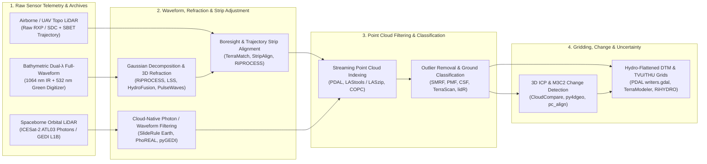

## 9.6 Software Ecosystem

Unlike passive photogrammetric pipelines that reconstruct 3D geometry by intersecting 2D projective ray bundles across overlapping images (Section 8.5), the LiDAR software ecosystem ingests direct, active time-of-flight range measurements coupled with high-rate inertial and satellite navigation trajectories. Yet transforming raw laser telemetry into a metrologically rigorous Digital Elevation Model (DEM) requires domain-specific processing architectures tailored to three distinct physical regimes:
1. **Topographic Discrete-Return & Continuous-Wave Point Clouds:** Filtering billions of irregular 3D points (`LAS`/`LAZ`/`COPC`), correcting inter-swath GNSS/IMU trajectory and boresight misalignments, separating bare-earth ground returns from dense vegetation canopy, and gridding elevation alongside sub-grid vertical dispersion.
2. **Airborne Laser Bathymetry (ALB) Full-Waveform Processing:** Deconvolving overlapping digitized $532\text{ nm}$ green waveforms (Section 9.5), modeling the dynamic, wave-roughened water surface $z_{\text{ws}}(x,y,t)$, executing 3D Snell refraction ray-tracing across tilted wave facets, and propagating depth-dependent Total Vertical Uncertainty (TVU) and Total Horizontal Uncertainty (THU) to International Hydrographic Organization (**IHO S-44 / S-102**) standards.
3. **Spaceborne Photon-Counting & Large-Footprint Waveform Processing:** Extracting signal photons from high solar-background noise rates in **ICESat-2 ATLAS** (`ATL03`) or deconvolving $25\text{ m}$ full waveforms in **ISS GEDI** (`L1B`/`L2A`) via server-side cloud-native engines to provide global vertical control and sub-canopy/shallow-water elevation transects.



---

### 9.6.1 Open-Source Point Cloud, Full-Waveform, and Orbital LiDAR Suites

#### `PDAL` (Point Data Abstraction Library, `gis-history` 2011)
Initiated in 2011 by Howard Butler and colleagues (`gis-history` 2011) as the 3D point-cloud analog to `GDAL` (`gis-history` 2000; development begun 1998), the **Point Data Abstraction Library (`PDAL`)** (Butler et al., 2021) is the foundational open-source C++ and Python framework for declarative point-cloud translation, filtering, classification, and rasterization. Rather than requiring imperative scripting for each processing step, `PDAL` composes workflows as declarative **JSON pipelines** chaining modular stages (`readers.*`, `filters.*`, `writers.*`), many of which support fixed-memory **streaming execution** (`pdal pipeline --stream`) over billion-point archives:
* **Cloud-Native and Format Readers (`readers.las`, `readers.copc`, `readers.rxp`, `readers.ept`):** Reads ASPRS `LAS` 1.0–1.4 (`gis-history` 2003), compressed `LAZ`, Entwine Point Tiles (`EPT`), and **Cloud-Optimized Point Clouds (`COPC` 1.0, `gis-history` 2021)**. Because a `.copc.laz` file embeds a clustered octree inside a standard `LAZ 1.4` Variable Length Record (VLR), `readers.copc` executes HTTP `Range` requests against object storage (AWS S3, GCS, USGS 3DEP buckets), fetching only the spatial bounds (`bounds`) and octree resolution (`resolution`) required for a target DEM without downloading multi-gigabyte regional archives.
* **Noise Rejection (`filters.outlier`, `filters.elm`, `filters.reciprocity`):** Suppresses atmospheric aerosol multipathing, bird strikes, and sub-surface multipath returns ("low points" that pull TIN or minimum-gridded DTMs meters below the true ground) using Statistical Outlier Removal (`method: "statistical"`, flagging points whose mean distance to $k$ nearest neighbors exceeds $\mu_d + m\,\sigma_d$), radius counts, or Extended Local Minimum (`elm`) morphological checks.
* **Bare-Earth Ground Classification (`filters.smrf`, `filters.pmf`, `filters.csf`, `filters.skewnessbalancing`):** Implements **Simple Morphological Filter (`SMRF`)** (Pingel et al., 2013), Zhang's **Progressive Morphological Filter (`PMF`)** (Zhang et al., 2003), and Zhang's **Cloth Simulation Filter (`CSF`)** (Zhang et al., 2016) to assign ASPRS Class `2` (Ground). `SMRF` constructs a minimum-elevation surface at cell size `cell` (in $\text{m}$), applies linearly increasing morphological opening windows up to `window` radius modulated by terrain `slope`, and classifies points within vertical `threshold` of the opened surface as bare earth.
* **Height Above Ground & Canopy Normalization (`filters.hag_nn`, `filters.hag_delaunay`):** Computes a `HeightAboveGround` (`HAG`, in $\text{m}$) dimension for every point by interpolating the underlying Class `2` ground points via Delaunay triangulation or $k$-nearest-neighbor inverse-distance weighting, enabling direct extraction of normalized Canopy Height Models (CHMs).
* **Multi-Band Rasterization & Uncertainty Output (`writers.gdal`, `writers.copc`):** Grids filtered point clouds directly to GeoTIFF or Cloud-Optimized GeoTIFF (`COG`) rasters while simultaneously emitting up to six statistical bands per cell via `output_type: "all"` (emitted in fixed band order: Band 1 `"min"`, Band 2 `"max"`, Band 3 `"mean"`, Band 4 `"idw"` Inverse Distance Weighting, Band 5 `"count"` point density $N$ per cell, and Band 6 `"stdev"` within-cell vertical standard deviation $s_z$), alongside re-indexed `.copc.laz` point clouds (`writers.copc`).

#### `LAStools`, `LASzip` (`gis-history` 2008, 2011), and `PulseWaves` (Martin Isenburg)
Pioneered by Martin Isenburg beginning in 2007 (building on the 2003 ASPRS `LAS 1.0` standard and 2008 `libLAS`/`LAZ` compression, `gis-history` 2003, 2008), **`LAStools`** revolutionized airborne LiDAR processing through streaming spatial indexing and lossless arithmetic compression. The ecosystem is strictly partitioned between an **open-source LGPL core** (`LASlib` and **`LASzip`**, `gis-history` 2008, 2011; Isenburg, 2013) and **proprietary/licensed production modules**:
* **Open-Source Core (`laszip`, `lasinfo`, `las2las`, `lasmerge`, `lasindex`, `lasprecision`):** `LASzip` decomposes correlated point record attributes (GPS time, $(X,Y,Z)$ integer coordinates, intensity, return numbers, and scan angles) into context-adaptive arithmetic coding streams, achieving **7:1 to 10:1 lossless compression** (`LAZ`) with sequential and chunked random-access decoding speeds exceeding disk I/O bottlenecks. `lasinfo` audits header bounding boxes, scale/offset quantization, and CRS VLRs; `las2las` performs coordinate reprojection, scan-angle clipping (e.g., `-keep_scan_angle -20 20`), and return filtering; and `lasindex` builds sidecar `.lax` spatial quadtrees.
* **Licensed Production Modules (`lasground`, `lasheight`, `lasclassify`, `las2dem`, `lasgrid`, `lasoverlap`, `lastile`):** Implement streaming Delaunay TIN refinement (Axelsson, 2000), buffered tile management (`lastile -buffer 30` to eliminate tile-edge boundary artifacts during ground classification and TIN interpolation), and inter-swath elevation difference auditing (`lasoverlap`, flagging vertical strip mismatches $|\Delta z| > 5\text{–}10\text{ cm}$ and horizontal roof-edge shifts). Also note that bridge decks (`ASPRS` Class `17`) must be separated from bare-earth ground (`Class 2`) during TIN/morphological filtering or enforced with hydro-breaklines so elevated bridge spans do not form artificial dams across river channels.
* **`PulseWaves` Open Full-Waveform Format (Isenburg, 2014):** To overcome the complexity and vendor lock-in of ASPRS `LAS 1.3/1.4` Wave Packet Descriptors (`WDP`), Isenburg and Riegl introduced **`PulseWaves`** (`.pls` pulse geometry and `.wvs` compressed digitized waveform samples; Isenburg, 2014). Unlike discrete-return formats that store 3D coordinates directly, `PulseWaves` archives each emitted laser shot as an **anchor point** $\mathbf{X}_0 \in \mathbb{R}^3$ (at the sensor origin or reference range) and an **optical ray direction vector** $\mathbf{d}_{\text{ray}} \in \mathbb{R}^3$ (scaled by the group velocity of light in air), accompanied by multi-channel digitized temporal intensity arrays $I(t_k)$. This ray-based abstraction is physically essential for **Airborne Laser Bathymetry (ALB)**: raw $532\text{ nm}$ waveforms can be archived prior to water-surface detection and re-traced later as refractive ray-tracing models or water-surface meshes improve.

#### Orbital LiDAR Toolkits: `SlideRule Earth`, `PhoREAL`, `icepyx`, and `pyGEDI` / `rGEDI`
Spaceborne LiDAR missions—**ICESat-2 ATLAS** (`gis-history` 2018; $532\text{ nm}$ single-photon counting, 6 beams, $10\text{ kHz}$ PRF, $0.7\text{ m}$ along-track spacing) and **ISS GEDI** (`gis-history` 2018; $1064\text{ nm}$ full-waveform, 8 beams, $25\text{ m}$ footprint)—generate multi-terabyte HDF5 granules (`ATL03` global geolocated photons, `L1B`/`L2A` waveforms) that are cumbersome to download and parse locally. Four open-source toolkits streamline orbital elevation extraction:
* **`SlideRule Earth` (University of Washington & NASA Goddard):** A cloud-native, server-side C++/Lua/Python framework (`sliderule` Python client) deployed in AWS `us-west-2` directly adjacent to the NASA NSIDC and LP DAAC cloud archives. Instead of downloading multi-gigabyte `ATL03` or `GEDI` HDF5 files, users submit a polygon region of interest and custom processing parameters—such as along-track segment length $L$, photon confidence thresholds, iterative surface-finding windows (`atl06p` land-ice algorithm, `atl08p` land/canopy algorithm, or `atl24x` coastal bathymetric refraction and seafloor photon classifier)—and `SlideRule` returns a ready-to-use `GeoDataFrame` of elevations, slopes, canopy heights, and propagated vertical uncertainties $\sigma_z$ in seconds.
* **`PhoREAL` (Applied Research Laboratories, University of Texas at Austin):** The official open-source Python/GUI toolkit engineered by the ICESat-2 `ATL08` Land and Vegetation Science Team (Neuenschwander & Pitts, 2019). `PhoREAL` links raw `ATL03` photon clouds with `ATL08` segment classifications (`ground`, `canopy`, `top of canopy`), runs customizable DRAGANN (Differential, Regressive, and Gaussian Adaptive Nearest Neighbor) noise filtering, generates $1\text{–}30\text{ m}$ custom along-track terrain profiles, and supports shallow-water refractive correction ($d_{\text{corr}} \approx d_{\text{app}} / n_w$) for clear coastal lagoons and lakes.
* **`icepyx`:** A community Python library that unifies spatial/temporal discovery, NASA Earthdata cloud authentication (`earthaccess`), variable subsetting, and xarray/GeoPandas ingestion across all ICESat-2 data products (`ATL03`, `ATL06`, `ATL08`, `ATL12`, `ATL13`, `ATL24`).
* **`pyGEDI` and `rGEDI` (Silva et al., 2020):** Python and R packages designed for **ISS GEDI** `L1B` (geolocated full waveforms), `L2A` (ground elevation, top-of-canopy height, and Relative Height percentiles $\text{RH}_{10}$ through $\text{RH}_{100}$ derived from Wagner's Gaussian decomposition; Section 9.5), `L2B` (Plant Area Index $\text{PAI}$ and Foliage Height Diversity $\text{FHD}$), and `L4A` (footprint aboveground biomass density). Both packages filter degraded orbits, solar background contamination (`degrade_flag == 0`, `quality_flag == 1`, beam sensitivity $> 0.95$), and steep-slope waveform broadening to isolate high-accuracy sub-canopy ground control points.

#### `CloudCompare`, `lidR` (Roussel et al., 2020), and `WhiteboxTools`
For interactive 3D metrology, multi-temporal geomorphic change detection, and forestry/hydrologic DEM conditioning, three open-source suites complement `PDAL`:
* **`CloudCompare` (Girardeau-Montaut, open-source GPL):** The premier interactive and CLI (`CloudCompare -SILENT`) 3D point-cloud inspection and registration workbench. Beyond Cloth Simulation Filtering (`CSF`), CANUPO multiscale classification, and Poisson surface reconstruction, `CloudCompare` implements fine **3D Iterative Closest Point (`ICP`)** registration and Lague et al.'s (2013) **Multiscale Model-to-Model Cloud Comparison (`M3C2`)** plugin (also available in high-performance C++/Python via **`py4dgeo`**). Unlike 2.5D DEM of Difference ($\text{DoD} = z_{t_2} - z_{t_1}$), which conflates horizontal shift with large vertical errors on steep cliffs ($\Delta z_{\text{slope}} = \Delta x \tan\beta$), `M3C2` measures true 3D surface displacement along local surface normals and computes a spatially variable **95% Level of Detection ($\text{LoD}_{95\%}$)** directly from local point-cloud roughness and registration uncertainty (Section 9.6.3).
* **`lidR` (Roussel et al., 2020):** The definitive R package for airborne forestry and ecological LiDAR analysis. Built around a tiled out-of-core processing engine (`LAScatalog`), `lidR` provides unified APIs for ground classification (`classify_ground` with `pmf()`, `csf()`, or Evans & Hudak's `mcc()` Multiscale Curvature Classification), terrain gridding (`rasterize_terrain` using `tin()`, `knnidw()`, or `kriging()`), pit-free Canopy Height Models (`rasterize_canopy` with Khosravipour et al.'s `pitfree()` algorithm), and individual tree segmentation (`locate_trees`, `segment_trees`).
* **`WhiteboxTools` (John Lindsay, Open-Source MIT):** A high-performance Rust geospatial engine offering stand-alone LiDAR tools (`LidarGroundPointFilter`, `LidarTinGridding`, `LidarIdwInterpolation`, `LidarRansacPlanes`, `LidarRooftopAnalysis`) tightly integrated with advanced hydrological DEM conditioning (`BreachDepressionsLeastCost`, `FillDepressionsWangAndLiu`), making it ideal for converting raw LiDAR point clouds directly into hydrologically connected overland flow networks.

---

### 9.6.2 Closed-Source and Commercial LiDAR & Bathy-LiDAR Production Suites

#### Terrasolid (`TerraScan`, `TerraMatch`, `TerraModeler`, `TerraPhoto`)
Running either inside Bentley `MicroStation` or as standalone `Spatix` workstations, the **Terrasolid** suite (developed in Finland by Arttu Soininen and colleagues) is the global commercial standard for national mapping programs—including the **USGS 3D Elevation Program (3DEP)**, NOAA Coastal Mapping, and European national LiDAR baselines:
* **`TerraMatch` (Rigorous Boresight & Trajectory Strip Adjustment):** Solves for systematic geometric offsets between overlapping flight lines and cross-strips. Using planar surface patches, tie lines (roof ridges, road markings, flat runways), and ground control points, `TerraMatch` estimates static sensor mounting **boresight angles** (roll $\Delta\omega$, pitch $\Delta\phi$, heading $\Delta\kappa$), laser rangefinder zero-offset $\Delta\rho_0$, mirror scan-angle scale error $s_\theta$, and **time-varying GNSS/INS trajectory fluctuations** ($\Delta X(t), \Delta Y(t), \Delta Z(t), \Delta\omega(t), \Delta\phi(t), \Delta\kappa(t)$ modeled via cubic splines along the post-processed Applanix `POSPac` or NovAtel `Inertial Explorer` SBET trajectory), reducing inter-swath vertical Root Mean Square Error ($\text{RMSE}_z$) from $8\text{–}20\text{ cm}$ down to $1\text{–}3\text{ cm}$.
* **`TerraScan` & `TerraModeler` (Classification Macros & Hydro-Flattened Breaklines):** `TerraScan` executes deterministic, auditable classification macros combining Axelsson's iterative TIN densification (starting from low seed points and iteratively inserting points whose angle $\alpha$ and vertical distance $d_\perp$ to the existing TIN facets fall below user tolerances), intensity/echo-width filtering, and powerline/building extraction. `TerraModeler` and `TerraScan` further support stereoscopic 3D compilation of **USGS 3DEP hydro-flattening breaklines**: enforcing monotonic downstream elevation gradients along single-line and double-line river banks ($>30\text{ m}$ nominal width) and flat elevations across standing lakes/reservoirs (`ASPRS` Class `9` Water and Class `20` Ignored Ground along breakline buffers).

#### Commercial Full-Waveform, Bathymetric, and Strip-Alignment Suites
Because Airborne Laser Bathymetry (ALB) sensors operate dual-wavelength transmitters ($1064\text{ nm}$ NIR for the air–water interface and $532\text{ nm}$ green for water-column penetration) with complex scanner geometries, specialized vendor and independent suites govern waveform deconvolution and hydrographic refraction:
* **Riegl `RiPROCESS`, `RiANALYZE`, `RiWORLD`, and `RiHYDRO`:** Engineered for Riegl's topographic (`VQ-780II`, `VQ-1560II`) and topo-bathymetric (`VQ-840-G`, `VQ-880-GII`) scanners. `RiANALYZE` performs online and offline **full-waveform Gaussian/exponential decomposition** (Wagner et al., 2006), extracting per-echo amplitude, pulse width (essential for distinguishing broadenings caused by low marsh vegetation or turbid bottom nepheloid layers), and calibrated reflectance (in $\text{dB}$ relative to a diffuse Lambertian target). `RiHYDRO` builds a continuous triangulated **water-surface model** from $1064\text{ nm}$ surface returns and $532\text{ nm}$ interface peaks, executes 3D Snell refraction ray-tracing (Section 9.5.4) across tilted water facets using temperature/salinity-derived phase and group refractive indices, and propagates full range, angular, trajectory, and wave-slope variances into per-sounding **IHO S-44 TVU and THU** attributes.
* **Leica `LiDAR Survey Studio (LSS)` (for `Chiroptera-5` and `Hawkeye-5`):** Processes data from Leica's dual-channel Palmer-scanner ALB systems, which maintain a constant $\sim 20^\circ$ off-nadir incidence angle via an elliptical nutating mirror. `LSS` fits a dual-channel wave-corrected water surface, models the exponential **volume backscatter wedge** in turbid water to resolve very shallow bottom peaks ($d < 0.30\text{ m}$), and exports classified LAS 1.4 point clouds containing per-point bathymetric confidence and benthic reflectance metrics.
* **Teledyne Optech `CZMIL HydroFusion` (for `CZMIL SuperNova`):** Designed for Optech's circular-scanning Coastal Zone Mapping and Imaging Lidar (featuring a central deep-water channel plus 7 segmented shallow-water array detectors). `HydroFusion` applies **Turbid Water Sighting** waveform deconvolution and empirical **depth-bias corrections** to compensate for pulse stretching and forward-scattering multipath delay in optically deep/turbid coastal waters ($K_d d \approx 4\text{–}6$), fusing hyperspectral imagery and bathymetric LiDAR into IHO S-102 Bathymetric Surface products.
* **`BayesMap StripAlign` (André Jalobeanu):** A sensor-agnostic, physics-based Bayesian strip-adjustment engine (paired with `WavEx` for full-waveform extraction) capable of aligning massive topographic and bathymetric LiDAR blocks without requiring manual tie planes or ground control points. `StripAlign` jointly estimates 6-DOF sensor boresight, scanner internal optical distortions (mirror facet variations, polygonal/Palmer wobble), and high-frequency GNSS/INS trajectory errors at $0.2\text{–}5\text{ s}$ intervals by maximizing the probabilistic overlap consistency of local surface normals and curvatures across all intersecting swaths, outputting per-point vertical and horizontal residual uncertainty maps.

---

### 9.6.3 Mathematical Formulations in Software: Strip Adjustment & M3C2 Change Detection

Two mathematical operations inside the LiDAR software stack govern whether a finished DEM achieves centimeter-level metrology or suffers from decimeter-scale swath steps and false change detections: **swath-to-swath boresight/trajectory strip adjustment** (`TerraMatch`, `StripAlign`, `RiPROCESS`) and **3D normal-projected change detection with spatially variable confidence intervals (`M3C2`)** (`CloudCompare`, `py4dgeo`).

#### 1. Swath-to-Swath Boresight and Trajectory Strip Adjustment
Recall from the direct georeferencing equation (Section 9.1 and Section 9.5) that the 3D position $\mathbf{X}_i = [X_i, Y_i, Z_i]^{\top}$ (in an ECEF or local East-North-Up map frame, in $\text{m}$, with elevation $Z$ positive-up) of laser return $i$ recorded at epoch $t_i$ is:
$$\mathbf{X}_i(\mathbf{p}) = \mathbf{X}_{\text{GNSS}}(t_i) + \Delta\mathbf{X}_{\text{traj}}(t_i) + \mathbf{R}_{\text{IMU}}(t_i)\,\mathbf{R}_{\text{delta}}(t_i)\left[ \mathbf{R}_{\text{bore}}(\Delta\omega, \Delta\phi, \Delta\kappa)\,\mathbf{r}_{\text{scan}}(\theta_i + s_\theta\theta_i, \rho_i + \Delta\rho_0) + \mathbf{l}_{\text{arm}} \right]$$
where:
* $\mathbf{X}_{\text{GNSS}}(t_i) \in \mathbb{R}^3$ and $\mathbf{R}_{\text{IMU}}(t_i) \in \text{SO}(3)$ are the nominal SBET position (in $\text{m}$) and body-to-map attitude rotation matrix at epoch $t_i$, and $\mathbf{R}_{\text{delta}}(t_i) = \mathbf{R}(\Delta\boldsymbol{\theta}_{\text{traj}}(t_i)) \in \text{SO}(3)$ is the time-varying attitude drift correction matrix,
* $\mathbf{r}_{\text{scan}}(\theta_i, \rho_i) = [\rho_i\sin\theta_i, \, 0, \, -\rho_i\cos\theta_i]^{\top}$ is the laser vector in a right-handed scanner frame aligned with cross-track $+X$ (starboard), along-track $+Y$ (flight direction), and vertical $+Z$ (up) at mirror scan angle $\theta_i$ (in $\text{rad}$) and measured slant range $\rho_i$ (in $\text{m}$),
* $\mathbf{l}_{\text{arm}} \in \mathbb{R}^3$ is the IMU-to-scanner lever-arm offset vector (in $\text{m}$), and
* $\mathbf{p} = [\Delta\omega, \Delta\phi, \Delta\kappa, \Delta\rho_0, s_\theta, \Delta\mathbf{X}_{\text{traj}}(t), \Delta\boldsymbol{\theta}_{\text{traj}}(t)]^{\top}$ is the vector of unknown calibration and trajectory drift parameters.

For flat terrain flown at altitude $H = \rho\cos\theta$ (in $\text{m}$) along the $+Y$-axis, the rangefinder measures the true slant range $\rho = H\sec\theta$. Differentiating $\mathbf{X}_i(\mathbf{p})$ with respect to small uncompensated **boresight roll** ($\Delta\omega$ about $+Y$, in $\text{rad}$), **boresight pitch** ($\Delta\phi$ about $+X$, in $\text{rad}$), **boresight heading** ($\Delta\kappa$ about $+Z$, in $\text{rad}$), **range zero-offset** ($\Delta\rho_0$, in $\text{m}$), and **scanner mirror scale** ($s_\theta$, dimensionless) at fixed measured range $\rho$ perturbs the cross-track coordinate $X$, along-track coordinate $Y$, and vertical elevation $Z$ as a function of scan angle $\theta$:
$$\Delta X(\theta) \approx H\,\Delta\omega + H\,\theta\,s_\theta + \sin\theta\,\Delta\rho_0, \qquad \Delta Y(\theta) \approx H\,\Delta\phi - H\tan\theta\,\Delta\kappa, \qquad \Delta Z(\theta) \approx -\cos\theta\,\Delta\rho_0 - H\tan\theta\,\Delta\omega - H\,\theta\tan\theta\,s_\theta$$
*(Note that in active LiDAR, because $\rho = H\sec\theta$ is directly measured, a roll error $\Delta\omega$ shifts $X$ by $\rho\cos\theta\,\Delta\omega = H\,\Delta\omega$, whereas an un-ranged passive camera ray intersected with $Z = -H$ shifts horizontally by $H\sec^2\theta\,\Delta\omega$.)* Notice how a boresight roll error $\Delta\omega$ induces an **antisymmetric cross-track vertical tilt** $\Delta Z(\theta) = -H\tan\theta\,\Delta\omega$: when two adjacent strips are flown in **opposite directions** (antiparallel), their overlapping outer swath edges ($\theta_A$ and $\theta_B$ with opposite flight headings) tilt in *opposite* vertical directions, creating a vertical step discontinuity across the overlap seam of:
$$\Delta Z_{\text{seam}} = Z_A(\theta) - Z_B(-\theta) = -2\,H\tan\theta\,\Delta\omega$$
`TerraMatch` and `StripAlign` eliminate $\mathbf{p}$ by extracting conjugate planar patches $k = 1, \dots, M$ with unit surface normals $\hat{\mathbf{n}}_k \in \mathbb{S}^2$ across overlapping strips $(A, B)$ and minimizing the weighted sum of squared **point-to-plane normal distances** via Gauss–Markov nonlinear least squares:
$$\min_{\mathbf{p}} \sum_{k=1}^{M} w_k \left[ \hat{\mathbf{n}}_k^{\top} \left( \mathbf{X}_k^{(A)}(\mathbf{p}) - \mathbf{X}_k^{(B)}(\mathbf{p}) \right) \right]^2 + (\mathbf{p} - \mathbf{p}_0)^{\top}\boldsymbol{\Sigma}_{\mathbf{p}_0}^{-1}(\mathbf{p} - \mathbf{p}_0)$$
where $w_k = (\sigma_{\perp,A}^2 + \sigma_{\perp,B}^2)^{-1}$ weights each tie patch by its local normal variance and slope orientation (flat roofs/roads constrain $\Delta\rho_0, \Delta\omega, s_\theta, \Delta Z(t)$; pitched roofs and hillslopes oriented across/along track constrain $\Delta\phi, \Delta\kappa, \Delta X(t), \Delta Y(t)$).

#### 2. Multiscale Model-to-Model Cloud Comparison (`M3C2`, Lague et al., 2013)
When comparing two multi-temporal point clouds $\mathcal{P}_1$ (epoch $t_1$) and $\mathcal{P}_2$ (epoch $t_2$) in `CloudCompare` or `py4dgeo`, **M3C2** avoids gridding artifacts by operating directly in $\mathbb{R}^3$ on a set of core points $\mathbf{x}_c \in \mathcal{P}_1$:
1. **Normal Scale ($D$):** Within a sphere of diameter $D$ (in $\text{m}$) centered at $\mathbf{x}_c$, a local plane is fitted by principal component analysis (PCA) to estimate the 3D unit surface normal $\hat{\mathbf{N}}_c \in \mathbb{S}^2$ (choosing $D \ge 20\text{–}25\times$ the local surface roughness so $\hat{\mathbf{N}}_c$ is unaffected by boulder/cobble micro-topography).
2. **Projection Scale ($d$) and Distance ($L_{\text{M3C2}}$):** A cylinder of diameter $d$ (in $\text{m}$) with axis parallel to $\hat{\mathbf{N}}_c$ is intersected with $\mathcal{P}_1$ and $\mathcal{P}_2$, isolating sub-clouds of $n_1$ and $n_2$ points. Projecting both sub-clouds onto the cylinder axis yields mean positions $\bar{i}_1, \bar{i}_2$ and sample standard deviations (local roughnesses) $\sigma_1(d), \sigma_2(d)$ (in $\text{m}$). The signed 3D displacement is $L_{\text{M3C2}} = \bar{i}_2 - \bar{i}_1$, and the spatially variable **95% Level of Detection ($\text{LoD}_{95\%}$)** (in $\text{m}$) is:
$$\text{LoD}_{95\%}(d) = \pm 1.96 \left( \sqrt{ \frac{\sigma_1(d)^2}{n_1} + \frac{\sigma_2(d)^2}{n_2} } + \text{reg} \right)$$
where $\text{reg}$ (in $\text{m}$) is the isotropic residual co-registration uncertainty between epochs $t_1$ and $t_2$ determined over stable bedrock via ICP (`TerraMatch` / `CloudCompare` / `pc_align`). Any displacement satisfying $|L_{\text{M3C2}}| > |\text{LoD}_{95\%}(d)|$ represents statistically significant geomorphic change at the 95% confidence level.

*Worked Numerical Example (Boresight Seam Step vs. M3C2 $\text{LoD}_{95\%}$):* An airborne LiDAR sensor flies antiparallel strips at $H = 1{,}000\text{ m}$ above ground level with half-swath scan angle $\theta = \pm 25^\circ$ ($\tan 25^\circ = 0.4663$, $\sec^2 25^\circ = 1.2174$). Before running `TerraMatch` or `StripAlign`, the IMU-to-scanner mounting has an uncalibrated roll boresight bias of $\Delta\omega = 0.015^\circ = 2.618 \times 10^{-4}\text{ rad}$ ($54''$). At the outer swath edge ($\theta = +25^\circ$), the single-strip vertical error is $\Delta Z(+25^\circ) = -1{,}000 \times 0.4663 \times 2.618 \times 10^{-4} = -0.122\text{ m}$, and the cross-track horizontal shift is $\Delta X(+25^\circ) = H\,\Delta\omega = 1{,}000 \times 2.618 \times 10^{-4} = +0.262\text{ m}$ (or $+0.319\text{ m}$ for an un-ranged passive ray $H\sec^2 25^\circ\,\Delta\omega$). Between two antiparallel strips overlapping at $\theta = 25^\circ$, this creates an artificial **vertical seam step of $|\Delta Z_{\text{seam}}| = 2 \times 0.122 = 0.244\text{ m}$ ($24.4\text{ cm}$)**! After `TerraMatch` strip adjustment reduces the residual registration error to $\text{reg} = 0.015\text{ m}$, we run `M3C2` with projection cylinder diameter $d = 1.0\text{ m}$ across a gravel riverbed where epoch 1 has $n_1 = 16\text{ pts}$ with roughness $\sigma_1(d) = 0.060\text{ m}$ and epoch 2 has $n_2 = 25\text{ pts}$ with roughness $\sigma_2(d) = 0.050\text{ m}$. The 95% Level of Detection is:
$$\text{LoD}_{95\%}(1.0\text{ m}) = \pm 1.96 \left( \sqrt{\frac{0.060^2}{16} + \frac{0.050^2}{25}} + 0.015 \right) = \pm 1.96 \left( \sqrt{0.000225 + 0.000100} + 0.015 \right) = \pm 1.96(0.0180 + 0.015) = \mathbf{\pm 0.065\text{ m}}$$
Without strip adjustment ($\text{reg} \approx 0.122\text{ m}$), the $24.4\text{ cm}$ swath seam would exceed $\text{LoD}_{95\%}$ by nearly $4\times$, masquerading as false riverbed erosion or aggradation.

---

### 9.6.4 Comprehensive Software Comparison Matrix

| Software Package | License | Primary Sensor Domain | Core Capabilities & Algorithms | Waveform & Bathymetric Support | Uncertainty & Error Diagnostics | Primary Use Cases |
| :--- | :--- | :--- | :--- | :--- | :--- | :--- |
| **`PDAL`** | Open-Source (BSD-3) | Airborne, UAV, mobile, terrestrial (`LAS`/`LAZ`/`COPC`) | Declarative JSON pipelines, streaming filters (`smrf`, `pmf`, `csf`, `outlier`, `hag_nn`), `writers.gdal` | Reads `LAS 1.3/1.4` wave packets & Riegl `rxp` | Per-cell `stdev`, `count`, and `idw` bands; ICP transformation residuals | Automated cloud-native `COPC`-to-DTM pipelines, server-side processing |
| **`LAStools`** & **`LASzip`** | Mixed (LGPL core / Commercial) | Billion-point airborne & UAV `LAS`/`LAZ` archives | Lossless `LAZ` compression, streaming TIN ground classification (`lasground`), buffered tiling | Associated **`PulseWaves`** (`.pls`/`.wvs`) open waveform library | `lasoverlap` inter-swath vertical difference & alignment grids; `lascontrol` RMSE | High-throughput `LAZ` compression, QA/QC overlap auditing, rapid TIN gridding |
| **`SlideRule Earth`** | Open-Source (BSD-3) | Spaceborne **ICESat-2** (`ATL03/06/08/24`) & **GEDI** | Server-side cloud-native C++/Python on-demand photon/waveform processing (`atl06p`, `atl08p`, `atl24x`) | `atl24x` coastal bathymetric photon classification & Snell refraction | Per-segment vertical uncertainty `h_sigma`, photon confidence, slope error | Instantaneous satellite laser altimetry control points, cryosphere & coastal bathy |
| **`PhoREAL`** | Open-Source (MIT / UT ARL) | Spaceborne **ICESat-2** (`ATL03` + `ATL08`) | DRAGANN noise filtering, custom along-track binning, canopy/ground percentile extraction | Built-in index-of-refraction shallow bathymetry depth correction | Photon classification confidence histograms, ground/canopy height std. dev. | Vegetation structure validation, custom ICESat-2 terrain/bathy profiles |
| **`pyGEDI` / `rGEDI`** | Open-Source (GPL-3) | Spaceborne **ISS GEDI** (`L1B`, `L2A`, `L2B`, `L4A`) | Full-waveform Gaussian decomposition visualization, RH metrics, PAI/FHD, biomass modeling | Full $1064\text{ nm}$ land/canopy waveform analysis (non-bathymetric) | Beam sensitivity, degrade flags, waveform SNR, `L4A` biomass standard error | Tropical/temperate forest canopy height, sub-canopy bare-earth reference |
| **`CloudCompare`** & **`py4dgeo`** | Open-Source (GPL / MIT) | Terrestrial (TLS), UAV, mobile, and airborne 3D clouds | 3D `ICP` registration, **`M3C2`** multiscale 3D change detection, `CSF`, `CANUPO` classification | Imports processed bathy/topo point clouds & waveform attributes | Spatially variable **`M3C2` $\text{LoD}_{95\%}$**, local normal roughness $\sigma_1, \sigma_2$, ICP RMS | Landslide/cliff rockfall monitoring, geomorphic 3D change detection |
| **`lidR`** (R package) | Open-Source (GPL-3) | Airborne forestry & ecological LiDAR (`LAScatalog`) | Out-of-core tiled processing, `pmf`/`csf`/`mcc` ground filtering, `pitfree` CHM, tree segmentation | Supports discrete & full-waveform extra-byte attributes | Cross-validation kriging variance, point density & pulse penetration ratios | Forest inventory, pit-free Canopy Height Models, ecological terrain modeling |
| **`WhiteboxTools`** | Open-Source (MIT) | Airborne & UAV LiDAR + hydrological DEMs | Rust-based `LidarGroundPointFilter`, `LidarTinGridding`, least-cost depression breaching | Topographic point clouds & hydro-conditioned DEMs | Interpolation residuals, planar RANSAC fit statistics | Hydrological DEM conditioning, watershed delineation, urban rooftop analysis |
| **Terrasolid** (`TerraScan` / `Match`) | Commercial (Proprietary) | National/enterprise airborne & mobile LiDAR | Boresight & trajectory spline adjustment (`TerraMatch`), TIN macros, 3D breakline hydro-flattening | Ingests refracted bathy point clouds & amplitude/width extra bytes | Per-strip boresight/trajectory residual reports, ASPRS NVA/VVA check-point tables | **USGS 3DEP** production, corridor mapping, hydro-flattened bare-earth DTMs |
| **Riegl `RiPROCESS` / `RiHYDRO`** | Commercial (Proprietary) | Riegl airborne/UAV topo (`VQ-1560`) & bathy (`VQ-880-G`) | Full-waveform Gaussian decomposition (`RiANALYZE`), global strip adjustment, 3D Snell refraction | Dynamic water-surface mesh + 3D wave-facet refractive ray-tracing | Rigorous covariance propagation to per-point **IHO S-44 THU & TVU** | Combined topo-bathymetric coastal mapping, full-waveform radiometry |
| **Leica `LiDAR Survey Studio`** | Commercial (Proprietary) | Leica `Chiroptera-5` & `Hawkeye-5` ALB systems | Palmer-scanner waveform processing, turbid-water volume backscatter suppression, wave correction | Dual-channel ($1064\text{ nm} + 532\text{ nm}$) shallow & deep bathymetry | Per-sounding confidence metrics, water-surface residual statistics | Hydrographic charting, coral reef & estuarine topo-bathymetric surveys |
| **Optech `CZMIL HydroFusion`** & **`StripAlign`** | Commercial (Proprietary) | Optech `CZMIL SuperNova` (`HydroFusion`) / Any sensor (`StripAlign`) | Turbid-water waveform deconvolution & bias correction (`HydroFusion`); Bayesian 6-DOF trajectory alignment (`StripAlign`) | Multi-channel circular-scanner ALB + hyperspectral fusion | Per-post IHO S-102 uncertainty (`HydroFusion`); per-swath 3D precision maps (`StripAlign`) | Turbid coastal charting (IHO Order 1a/Special), control-free block strip alignment |

---

### 9.6.5 Reproducible CLI and Python Workflows

#### 1. Cloud-Native `PDAL` Pipeline: Streaming `COPC` Ground Classification, HAG, and Multi-Band Uncertainty Gridding
The following declarative `PDAL` JSON pipeline (`copc_to_dtm_pipeline.json`) streams a Cloud-Optimized Point Cloud (`.copc.laz`) over a target bounding box (using 8 reader threads for parallel HTTP `Range` chunk decompression), clips wide scan angles via `filters.range` (note that `PDAL` maps both legacy `LAS 1.2` `ScanAngleRank` and `LAS 1.4`/`COPC` extended `ScanAngle` to the `ScanAngleRank` dimension in degrees), removes statistical multipath outliers, classifies bare-earth ground via `SMRF`, computes Height Above Ground (`HAG`), writes a classified `.copc.laz` archive, and exports a 6-band $1.0\text{ m}$ GeoTIFF containing `"output_type": "all"` (which `writers.gdal` emits in its fixed band order: Band 1 = `min`, Band 2 = `max`, Band 3 = `mean`, Band 4 = `idw`, Band 5 = `count`, Band 6 = `stdev`):

```json
[
  {
    "type": "readers.copc",
    "filename": "https://data.source.coop/usgs/lidar/WA_MountBaker_2019.copc.laz",
    "bounds": "([585000, 586000], [5402000, 5403000])",
    "resolution": 0.5,
    "threads": 8
  },
  {
    "type": "filters.range",
    "limits": "ScanAngleRank[-20:20]"
  },
  {
    "type": "filters.outlier",
    "method": "statistical",
    "mean_k": 12,
    "multiplier": 2.5
  },
  {
    "type": "filters.smrf",
    "ignore": "Classification[7:7]",
    "cell": 1.0,
    "slope": 0.15,
    "threshold": 0.45,
    "window": 16.0
  },
  {
    "type": "filters.hag_nn",
    "count": 4
  },
  {
    "type": "writers.copc",
    "filename": "mount_baker_classified_hag.copc.laz",
    "extra_dims": "HeightAboveGround=float"
  },
  {
    "type": "filters.range",
    "limits": "Classification[2:2]"
  },
  {
    "type": "writers.gdal",
    "filename": "mount_baker_dtm_1m_multiband.tif",
    "resolution": 1.0,
    "radius": 1.414,
    "output_type": "all",
    "gdaldriver": "GTiff",
    "gdalopts": "COMPRESS=DEFLATE,TILED=YES,PREDICTOR=3",
    "nodata": -9999.0
  }
]
```

Execute the pipeline from the command line and convert the multi-band `writers.gdal` output into a 95% confidence Total Vertical Uncertainty ($\text{TVU}_{95\%}$) raster in Python:

```bash
# Run the PDAL pipeline (parallel octree decompression is configured via "threads": 8 in readers.copc)
pdal pipeline copc_to_dtm_pipeline.json
```

```python
import numpy as np
import rasterio

def compute_lidar_dtm_tvu95(
    multiband_tif: str,
    sigma_traj_z: float = 0.035,
) -> tuple[np.ndarray, np.ndarray]:
    """Derive 95% TVU from PDAL writers.gdal 'all' bands (1:min, 2:max, 3:mean, 4:idw, 5:count, 6:stdev)."""
    with rasterio.open(multiband_tif) as src:
        z_idw = src.read(4)    # Band 4: IDW bare-earth elevation z (m, positive-up)
        n_pts = src.read(5)    # Band 5: Ground point count N per 1 m cell
        s_z = src.read(6)      # Band 6: Within-cell vertical standard deviation s_z (m)
        nodata = src.nodata

    valid = (z_idw != nodata) & (n_pts >= 1)
    sigma_total = np.full_like(z_idw, np.nan, dtype=np.float32)

    # Combine standard error of the cell mean (s_z / sqrt(N)) with trajectory/boresight uncertainty
    sem_cell = np.where(n_pts[valid] > 1, s_z[valid] / np.sqrt(n_pts[valid]), 0.10)
    sigma_total[valid] = np.sqrt(sem_cell**2 + sigma_traj_z**2)
    tvu_95 = 1.96 * sigma_total
    return z_idw, tvu_95
```

#### 2. Cloud-Native Spaceborne LiDAR Querying with `SlideRule Earth` (ICESat-2 `ATL03` / `ATL06` / `ATL24`)
The following Python workflow queries NASA's cloud-hosted **ICESat-2 `ATL03`** photon archive on-demand via **`SlideRule Earth`**, executing both server-side terrestrial surface fitting (`icesat2.atl06p`) and coastal bathymetric refraction (`icesat2.atl24x`) without downloading raw HDF5 granules:

```python
from sliderule import sliderule, icesat2
import geopandas as gpd
import numpy as np

def fetch_icesat2_topo_and_bathy(bbox_lonlat: list[dict]) -> tuple[gpd.GeoDataFrame, gpd.GeoDataFrame]:
    """Query ICESat-2 land control points (atl06p) and refracted bathymetric photons (atl24x)."""
    sliderule.init("slideruleearth.io", verbose=False)

    # 1. Server-side ATL06-SR processing on 20 m along-track land segments (10 m step)
    topo_parms = {
        "poly": bbox_lonlat,
        "srt": icesat2.SRT_LAND,
        "cnf": icesat2.CNF_SURFACE_HIGH,  # High-confidence signal photons (cnf == 4)
        "ats": 10.0,                      # Minimum along-track spread (m)
        "cnt": 10,                        # Minimum photon count per segment
        "len": 20.0,                      # Segment length L (m)
        "res": 10.0,                      # Along-track step resolution (m)
        "maxi": 6,                        # Maximum robust iterative fit iterations
        "H_min_win": 3.0,                 # Minimum vertical window height (m)
    }
    gdf_topo = icesat2.atl06p(topo_parms)
    gdf_topo_qc = gdf_topo[(gdf_topo["h_sigma"] < 0.10) & (np.abs(gdf_topo["dh_fit_dx"]) < 0.35)].copy()
    gdf_topo_qc["tvu_95_m"] = 1.96 * gdf_topo_qc["h_sigma"]

    # 2. Server-side ATL24 coastal bathymetric photon classification & Snell refraction
    bathy_parms = {
        "poly": bbox_lonlat,
        "atl24": {"class_ph": ["bathymetry"], "confidence_threshold": 0.6},
    }
    gdf_bathy = icesat2.atl24x(bathy_parms)
    gdf_bathy["tvu_95_m"] = 1.96 * gdf_bathy["sigma_tvu"]
    return gdf_topo_qc, gdf_bathy
```

> [!WARNING]
> **Scan-Angle Edge Degradation and Unbuffered Tile Seams**
> Never grid airborne LiDAR swaths out to their extreme off-nadir scan limits ($|\theta| > 22^\circ\text{–}25^\circ$) without clipping (`filters.range` on `ScanAngleRank`) or running rigorous strip adjustment (`TerraMatch`, `StripAlign`). At wide scan angles, the laser footprint elongates elliptically by $\sec^2\theta$, canopy path length increases by $\sec\theta$ (dramatically reducing bare-earth penetration), and any residual roll boresight error $\Delta\omega$ or mirror scale error $s_\theta$ amplifies vertical bias as $\tan\theta$ and $\theta\tan\theta$. Similarly, when processing multi-tile archives in `PDAL`, `LAStools`, or `lidR`, always include a **$25\text{–}50\text{ m}$ spatial collar buffer** around each tile during morphological/TIN ground classification; classifying tiles without buffers creates artificial vertical steps and canopy-leakage rims along every tile boundary.

> [!TIP]
> **Using `writers.gdal` Multi-Band Statistics (`stdev` and `count`) as a Free Quality Layer**
> When rasterizing a ground-classified point cloud with `PDAL`'s `writers.gdal`, always set `"output_type": "all"` (emitting `min`, `max`, `mean`, `idw`, `count`, and `stdev`) rather than exporting a single elevation band. Inspecting the `count` band (Band 5) immediately reveals sub-canopy or water-absorption **data voids** where the gridded DTM relies on long-distance interpolation rather than actual laser returns, while spikes in the within-cell `stdev` band (Band 6, $s_z > 0.25\text{ m}$ on flat ground) instantly flag unremoved low vegetation, building-wall multipath, or unaligned overlapping flight strips.
