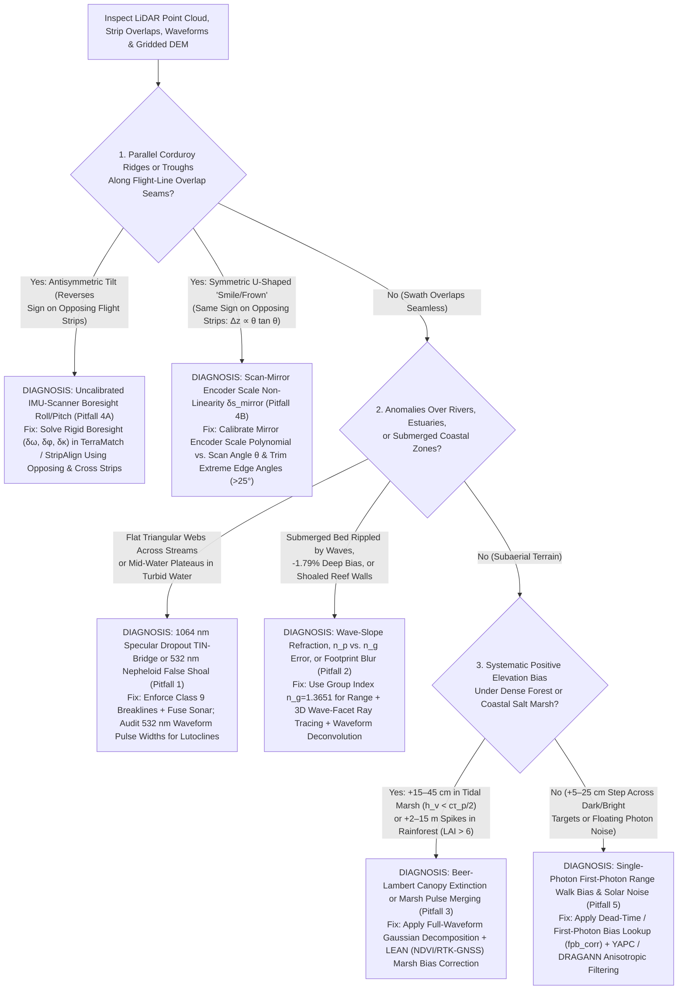

## 9.7 Common Pitfalls & Key Takeaways

Airborne topographic, topo-bathymetric, and spaceborne LiDAR systems (`Riegl VQ-1560 II-S`, `VQ-880-G II`, `Leica TerrainMapper-2`, `Chiroptera-5`, `Teledyne Optech CZMIL SuperNova`, `NASA GEDI`, `ICESat-2 ATLAS`) are routinely treated in geospatial workflows as "ground-truth" elevation reference instruments. Yet a LiDAR point cloud is not a direct geometric sample of the solid Earth or seabed: it is a set of **time-tagged, radiometrically thresholded, multi-medium optical range measurements** reconstructed through a multi-frame kinematic direct-georeferencing chain (Section 9.1 and Section 9.6). Whenever the laser pulse interacts with water surfaces, suspended sediment layers, dense vegetation canopies, non-linear scan-mirror encoders, or saturating single-photon avalanche detectors, unmodeled physical and instrumental effects can inject decimeter-to-meter systematic biases into the resulting Digital Elevation Model (DEM) while internal strip-overlap precision appears nominal.

This section examines the five most consequential failure modes in topographic, bathymetric, and photon-counting LiDAR DEM production—complete with governing physical equations and worked numerical examples—followed by a diagnostic summary matrix, a quality-assurance decision tree, and an operational practitioner audit checklist.

---

### 9.7.1 Detailed Case Studies of Topographic, Bathymetric, and Spaceborne LiDAR Failure Modes

#### Pitfall 1: Treating $1064\text{ nm}$ Water-Surface Specular Dropouts or $532\text{ nm}$ Sub-Surface Turbidity / Nepheloid Layers as Bathymetry

* **Physical & Radiometric Mechanism:** A pervasive error in fluvial, estuarine, and coastal DEM compilation is assuming that standard near-infrared ($1064\text{ nm}$) topographic LiDAR can map shallow submerged stream channels, or conversely that the deepest green ($532\text{ nm}$) return in a bathymetric LiDAR waveform always represents the consolidated mineral riverbed or seafloor. Two distinct optical regimes govern these failures:
  1. **Near-Infrared ($1064\text{ nm}$) Specular Dropouts & "TIN Bridging":** At $\lambda = 1064\text{ nm}$, liquid water exhibits a strong rotational–vibrational O–H stretching overtone absorption band with bulk absorption coefficient $\alpha_w(1064\text{ nm}) \approx 12.5\text{–}36.3\text{ m}^{-1}$ (depending on temperature and near-surface scattering; Section 9.2), yielding a two-way $1/e$ irradiance penetration depth of only $z_{\text{pen}} = 1/(2\alpha_w) \approx 1.4\text{–}4.0\text{ cm}$ ($99\%$ attenuation within $6.3\text{–}9.2\text{ cm}$). Furthermore, over calm water at off-nadir scan angles ($\theta > 5^\circ\text{–}8^\circ$), Fresnel specular reflection deflects the transmitted laser pulse away from the receiver aperture, creating complete data voids (**hydro-dropouts**). Conversely, near exact nadir ($\theta < 2^\circ$), specular reflection saturates the receiver on the water surface itself. If an automated pipeline triangulates across hydro-dropout voids using Delaunay Triangulated Irregular Network (TIN) interpolation—or classifies nadir specular water-surface returns as "bare earth" (`ASPRS Class 2`)—the resulting DEM replaces the submerged channel thalweg with a flat bank-to-bank **"TIN bridge"** or an elevated water-surface terrace.
  2. **Green ($532\text{ nm}$) Benthic Nepheloid, Fluid-Mud Lutocline, and Mucilage False Shoals:** In green topo-bathymetric LiDAR ($\lambda = 532\text{ nm}$, where Jerlov coastal diffuse attenuation is $K_d \in [0.15, 0.80]\text{ m}^{-1}$), the bottom-return peak power $P_{\text{bed}}(d)$ decays exponentially with depth $d$ as $\exp(-2\,K_d\,d)$ while water-column volume backscatter scales with the local particulate backscattering coefficient $\beta_\pi(z)$. When a dense **benthic nepheloid layer**, estuarine **fluid-mud lutocline** ($\text{SSC} > 100\text{–}300\text{ mg L}^{-1}$), or pycnocline **mucilage/algal layer** hovers at depth $d_{\text{layer}} < d_{\text{bed}}$, strong Mie backscatter from the suspended layer coupled with severe two-way attenuation below $d_{\text{layer}}$ extinguishes the true seabed echo. Waveform detectors (`Gaussian decomposition`, `constant fraction discriminator`) lock onto the nepheloid peak, generating **phantom shoals** meters above the true bed (Philpot, 2019).
* **Governing Equations:** From the bathymetric LiDAR equation (Section 9.5), the ratio of the peak power returned from a suspended turbidity/lutocline layer at depth $d_{\text{layer}}$ (with effective volumetric reflectance $\rho_{\text{layer}} = \pi\,\beta_\pi(d_{\text{layer}})\,\frac{c\,\tau_p}{2\,n_g}$) to the true seabed return at depth $d_{\text{bed}}$ (with bottom hemispherical reflectance $\rho_{\text{bed}}$ and sub-layer attenuation $K_{d,\text{sub}}$) is:
  $$
  \frac{P_{\text{layer}}(d_{\text{layer}})}{P_{\text{bed}}(d_{\text{bed}})} = \left(\frac{\rho_{\text{layer}}}{\rho_{\text{bed}}}\right) \left(\frac{n_g\,H + d_{\text{bed}}}{n_g\,H + d_{\text{layer}}}\right)^2 \exp\!\Bigl(2\,K_{d,\text{sub}}\,(d_{\text{bed}} - d_{\text{layer}})\Bigr)
  $$
  Whenever $2\,K_{d,\text{sub}}(d_{\text{bed}} - d_{\text{layer}}) > \ln(\rho_{\text{bed}}/\rho_{\text{layer}})$ and $P_{\text{bed}}(d_{\text{bed}})$ drops below the receiver noise-equivalent power $\text{NEP}$, the waveform processor reports a false shoal elevation bias of $\Delta z_{\text{turb}} = d_{\text{bed}} - d_{\text{layer}} > 0$. Meanwhile, across a $1064\text{ nm}$ river hydro-dropout of bankfull width $W_c$ and parabolic channel thalweg depth $d_{\text{thalweg}}$ below bank height $\Delta h_{\text{bank}}$, linear TIN bridging across bank returns induces a maximum thalweg elevation bias of:
  $$
  \Delta z_{\text{TIN-bridge}} = z_{\text{TIN}}(0) - z_{\text{bed}}(0) = \Delta h_{\text{bank}} + d_{\text{thalweg}}
  $$
* **Worked Numerical Case:**
  * **Case 1A ($1064\text{ nm}$ TIN Bridge Across a Gravel-Bed River):** A $1064\text{ nm}$ topographic LiDAR surveys a $W_c = 40.0\text{ m}$ wide river channel where the water surface lies $\Delta h_{\text{bank}} = 0.45\text{ m}$ below the vegetated floodplain banks ($z_{\text{bank}} = 12.45\text{ m}$, $z_{\text{wl}} = 12.00\text{ m}$) and the true channel thalweg is $d_{\text{thalweg}} = 2.85\text{ m}$ deep ($z_{\text{bed}} = 9.15\text{ m}$). Off-nadir specular dropouts leave zero channel returns; Delaunay TIN interpolation bridges directly from left bank to right bank at $z_{\text{TIN}} = 12.45\text{ m}$, creating a vertical thalweg error of:
    $$
    \Delta z_{\text{TIN-bridge}} = 0.45\text{ m} + 2.85\text{ m} = \mathbf{+3.30\text{ m}}
    $$
    and erasing $\frac{2}{3}W_c\,d_{\text{thalweg}} = \mathbf{76.0\text{ m}^2}$ of hydraulic conveyance cross-section, causing 2D hydrodynamic models (`HEC-RAS 2D`) to predict catastrophic false overbank flooding during moderate discharges!
  * **Case 1B ($532\text{ nm}$ Estuarine Nepheloid / Lutocline False Shoal):** A $532\text{ nm}$ bathymetric LiDAR surveys an navigation channel of true consolidated bed depth $d_{\text{bed}} = 8.50\text{ m}$ ($\rho_{\text{bed}} = 0.08$) beneath an upper water column ($K_{d,1} = 0.30\text{ m}^{-1}$) and a dense estuarine lutocline / nepheloid layer beginning at $d_{\text{layer}} = 5.20\text{ m}$ ($\rho_{\text{layer}} = 0.025$, $K_{d,\text{sub}} = 1.10\text{ m}^{-1}$). The sub-layer two-way optical thickness is $2(1.10)(8.50 - 5.20) = 7.26$, attenuating the true bed echo by $e^{-7.26} = 7.03 \times 10^{-4}$ ($P_{\text{layer}}/P_{\text{bed}} = 444$). The waveform digitizer locks onto the lutocline top at $d_{\text{layer}} = 5.20\text{ m}$, producing a **false shoal bias of $\Delta z_{\text{turb}} = 8.50 - 5.20 = \mathbf{+3.30\text{ m}}$** (`ASPRS Class 40` misassignment).
* **Remediation & Operational Verification:** (1) Enforce **hydro-breaklines** (`ASPRS Class 9` water polygons) on all $1064\text{ nm}$ LiDAR DEMs and fuse acoustic single-beam/multibeam sonar (`MBES`) or green bathymetric LiDAR across submerged channels rather than TIN-interpolating across water voids; (2) in $532\text{ nm}$ surveys, inspect full-waveform backscatter profiles (`RiHYDRO`, `CZMIL HydroFusion`) for stretched pulse widths ($\Delta\tau_{\text{echo}} > 1.5\,\tau_p$, diagnostic of volume scattering from turbidity layers vs. sharp benthic reflection) and cross-check against acoustic dual-frequency echosounders ($200/33\text{ kHz}$).

---

#### Pitfall 2: Ignoring Water-Surface Wave-Slope Refraction Errors, Using Phase Instead of Group Refractive Index, and Overlooking Forward-Scattering Footprint Expansion in Bathymetric LiDAR

* **Physical & Optical Mechanism:** Accurate $532\text{ nm}$ bathymetric LiDAR geolocation requires tracing each laser pulse across a dynamic, wave-roughened air–water interface and through a dispersive, particulate-scattering water column (Section 9.5). Three coupled physical approximations routinely corrupt operational bathymetric LiDAR DEMs:
  1. **Capillary & Gravity Wave-Slope Refraction Deflection:** Standard bathymetric processing intersects the laser ray with a smoothed mean water-surface model $\bar{z}_{\text{wl}}(x,y)$ assuming a flat horizontal unit normal $\hat{\mathbf{n}}_0 = [0, 0, 1]^{\mathsf{T}}$. In reality, wind-driven gravity and capillary waves tilt the instantaneous local water facet by slope angle $\alpha_{\text{wave}} = \pm 5^\circ\text{ to }\pm 15^\circ$. Even when a coaxial $1064\text{ nm}$ or Raman channel measures the exact wave-crest height at the beam entry point, an unmodeled facet tilt $\alpha_{\text{wave}}$ alters the local incidence angle $\theta_{i,\text{local}} = \theta_a + \alpha_{\text{wave}}$ in Snell's law, steering the refracted underwater beam off course by $\Delta\theta_w$ and inducing large horizontal and vertical seabed errors that grow linearly with depth $d$ (Philpot, 2019).
  2. **Phase ($n_p$) vs. Group ($n_g$) Refractive Index Confusion:** While the **direction** of ray refraction across the air–water boundary is governed by the optical **phase refractive index** $n_p(\lambda, T, S) = 1.3411$ (at $\lambda = 532\text{ nm}$, $T = 20^\circ\text{C}$, $S = 35\text{ PSU}$; Section 9.5.4), the **propagation speed of a short laser pulse envelope** ($\tau_p \sim 1\text{–}5\text{ ns}$) through dispersive water is governed by the **group refractive index** $n_g = n_p - \lambda\,\frac{\partial n_p}{\partial\lambda} = 1.3651$ ($v_g = c/n_g$, where $\frac{\partial n_p}{\partial\lambda} = -4.51 \times 10^{-5}\text{ nm}^{-1}$). Dividing the in-water time-of-flight $\Delta t_w$ by $n_p$ instead of $n_g$ overestimates in-water slant range $R_w$ by $+1.79\%$ at every depth.
  3. **Particulate Forward-Scattering Benthic Footprint Expansion:** Unlike topographic LiDAR (where the ground footprint diameter is simply $D_{\text{land}} = H\,\beta_{\text{div}} \approx 0.2\text{–}0.5\text{ m}$), small-angle Mie forward scattering off suspended marine particulates spreads the underwater green beam into a wide diffusive cone of effective half-angle $\theta_{\text{scat}} \approx 6^\circ\text{–}10^\circ$. By $d = 20\text{ m}$ depth, the seafloor footprint expands to $D_{\text{benthic}} \approx 4\text{–}7\text{ m}$ in diameter—smoothing coral heads and boulders while causing the leading edge of the wide footprint to strike the upslope side of steep terrain first (**slope-induced shoal bias**).
* **Governing Equations:** Let a bathymetric LiDAR scan at nominal air off-nadir angle $\theta_a$ (typically $\theta_a = 15^\circ\text{–}20^\circ$ for circular Palmer scanners). Across a flat water surface, Snell's law gives $\theta_{w,0} = \sin^{-1}(\sin\theta_a / n_p)$. When the beam strikes a wave facet tilted by angle $\alpha_{\text{wave}}$ in the scan plane, the true global nadir angle of the refracted underwater ray becomes:
  $$
  \theta_{w,\text{true}}(\alpha_{\text{wave}}) = \sin^{-1}\!\left(\frac{\sin(\theta_a + \alpha_{\text{wave}})}{n_p}\right) - \alpha_{\text{wave}}
  $$
  At true depth $d$ (nominal in-water slant range $R_w = d / \cos\theta_{w,0} = \frac{c\,\Delta t_w}{2\,n_g}$), neglecting the wave slope $\alpha_{\text{wave}}$ and/or substituting $n_p$ for $n_g$ produces the horizontal planimetric error $\Delta x_{\text{wave}}$, vertical wave-refraction error $\Delta z_{\text{wave}}$, and group-index depth bias $\Delta z_{\text{group}}$:
  $$
  \Delta x_{\text{wave}} = R_w\bigl(\sin\theta_{w,\text{true}} - \sin\theta_{w,0}\bigr), \qquad \Delta z_{\text{wave}} = R_w\bigl(\cos\theta_{w,0} - \cos\theta_{w,\text{true}}\bigr), \qquad \Delta z_{\text{group}} = -d\,\left(\frac{n_g - n_p}{n_p}\right)
  $$
  Simultaneously, the forward-scattered benthic footprint diameter $D_{\text{benthic}}(d)$ and its resulting upslope shoal bias $\Delta z_{\text{slope}}$ on a seabed of slope angle $\beta_{\text{bed}}$ are given by:
  $$
  D_{\text{benthic}}(d) = \sqrt{\bigl(H\,\beta_{\text{div}}\bigr)^2 + \bigl(2\,d\tan\theta_{\text{scat}}\bigr)^2}, \qquad \Delta z_{\text{slope}} \approx +\frac{1}{2}\,D_{\text{benthic}}(d)\,\tan\beta_{\text{bed}}
  $$
* **Worked Numerical Case:** An airborne circular-scanning bathymetric LiDAR ($\theta_a = 20.0^\circ$, $H = 400\text{ m}$, $\beta_{\text{div}} = 1.0\text{ mrad}$) maps a shelf of true depth $d = 20.00\text{ m}$ in coastal seawater ($n_p = 1.3411$, $n_g = 1.3651$, nominal $\theta_{w,0} = \sin^{-1}(\sin 20.0^\circ / 1.3411) = 14.776^\circ$, $R_w = 20.00 / \cos 14.776^\circ = 20.684\text{ m}$):
  * **Wave-Slope Refraction Error for a $\alpha_{\text{wave}} = -10.0^\circ$ Wave Facet:** The local incidence angle is $\theta_{i,\text{local}} = 20.0^\circ - 10.0^\circ = 10.0^\circ$, yielding a true underwater nadir angle of $\theta_{w,\text{true}} = \sin^{-1}(\sin 10.0^\circ / 1.3411) - (-10.0^\circ) = 7.439^\circ + 10.0^\circ = \mathbf{17.439^\circ}$. The resulting single-pulse geolocation errors are:
    $$
    \Delta x_{\text{wave}} = 20.684\text{ m}\times(\sin 17.439^\circ - \sin 14.776^\circ) = \mathbf{+0.922\text{ m}}, \qquad \Delta z_{\text{wave}} = 20.684\text{ m}\times(\cos 14.776^\circ - \cos 17.439^\circ) = \mathbf{+0.266\text{ m}}
    $$
  * **Phase vs. Group Index Bias at $d = 20.00\text{ m}$:** Using $n_p = 1.3411$ in place of $n_g = 1.3651$ biases the reconstructed seabed **too deep** by:
    $$
    \Delta z_{\text{group}} = -20.00\text{ m} \times \left(\frac{1.3651 - 1.3411}{1.3411}\right) = -20.00\text{ m} \times 0.017896 = \mathbf{-0.358\text{ m}} \quad (\mathbf{-35.8\text{ cm}})
    $$
  * **Benthic Footprint Expansion ($\theta_{\text{scat}} = 8.0^\circ$) on a $\beta_{\text{bed}} = 15^\circ$ Reef Drop-Off:** While the surface spot is only $D_{\text{surf}} = 0.40\text{ m}$ wide, the seafloor footprint expands to $D_{\text{benthic}}(20\text{ m}) = \sqrt{0.40^2 + (40.0\tan 8.0^\circ)^2} = \mathbf{5.64\text{ m}}$, inducing a leading-edge upslope shoal bias of $\Delta z_{\text{slope}} \approx 0.5 \times 5.64\text{ m} \times \tan 15^\circ = \mathbf{+0.755\text{ m}}$!
* **Remediation & Operational Verification:** (1) Enforce $n_g(\lambda, T, S) = 1.3651$ (never $n_p = 1.3411$) for all in-water time-of-flight range scaling while retaining $n_p$ in Snell's vector refraction equation; (2) reconstruct local wave-facet normals $\hat{\mathbf{n}}(x,y,t)$ from dense $1064\text{ nm}$/Raman surface-channel triangles (3D refractive ray tracing, Section 9.5) and restrict hydrographic acquisitions to sea states with significant wave height $H_s < 1.0\text{ m}$ and wind $< 10\text{–}15\text{ kt}$; and (3) apply waveform deconvolution (`Richardson-Lucy` or Gaussian system-response deconvolution) to mitigate slope-induced footprint stretching.

---

#### Pitfall 3: Assuming "Last Return" in Dense Tropical Rainforest, Closed-Canopy Conifers, or Coastal Salt Marsh (`Spartina`) Reaches Bare Mineral Soil

* **Physical & Radiometric Mechanism:** A widespread misconception among DEM users is that selecting `ReturnNumber == NumberOfReturns` ("last return") and running an automated ground classifier (`PDAL filters.smrf` or `TerraScan`) guarantees a true bare-earth Digital Terrain Model (DTM). In reality, whether a laser pulse yields a detectable ground echo is governed by two physical limits: (1) **two-way Beer–Lambert canopy occlusion**, which exponentially extinguishes laser energy in high-biomass forests, and (2) **finite pulse-width / dead-time range resolution**, which merges low-stature vegetation returns with the underlying soil return in coastal salt marshes, tundra sedge, and grasslands.
* **Governing Equations:**
  1. **Beer–Lambert Two-Way Canopy Transmission ($T_{\text{2-way}}$):** For a canopy of one-sided Leaf Area Index $\text{LAI}$ ($\text{m}^2\,\text{m}^{-2}$), Ross–Nilson foliage projection factor $G(\theta) \approx 0.5$, and clumping index $\Omega \in (0, 1]$, a laser pulse at off-nadir scan angle $\theta$ must penetrate downward through canopy gaps *and* the scattered ground return must escape upward along the same path, yielding a two-way gap transmission probability of:
     $$
     T_{\text{2-way}}(\theta) = \exp\!\left(-\frac{2\,\Omega\,G(\theta)\,\text{LAI}}{\cos\theta}\right)
     $$
     When $T_{\text{2-way}}(\theta)$ falls below the sensor's dynamic detection threshold $T_{\min} = \text{NEP} / (P_{\text{rx,0}}\,\rho_{\text{soil}})$, the ground echo is lost in receiver noise, and the recorded "last return" is actually an interior canopy branch or understory fern meters above the ground.
  2. **Pulse-Width Range Resolution & Salt-Marsh Waveform Merging ($\Delta R_{\min}$):** A linear-mode LiDAR transmitting a pulse of full-width at half-maximum duration $\tau_p$ cannot resolve two targets separated vertically by less than the half-pulse range resolution limit:
     $$
     \Delta z_{\min}(\theta) = \Delta R_{\min}\cos\theta = \left(\frac{c\,\tau_p}{2}\right)\cos\theta
     $$
     In coastal salt marshes (`Spartina alterniflora`, `Juncus roemerianus`) or dense grasslands where vegetation height $h_{\text{veg}} < \Delta z_{\min}$ (e.g., $h_{\text{veg}} = 0.25\text{–}0.60\text{ m}$ vs. $\Delta R_{\min} = 0.60\text{ m}$ for $\tau_p = 4.0\text{ ns}$), the vegetation and mudflat echoes merge into a **single composite return** whose centroid is biased upward above the true mineral soil by:
     $$
     \Delta z_{\text{marsh}} = \frac{\bigl(1 - T_{\text{2-way}}\bigr)\,\rho_{\text{veg}}\,\bar{h}_{\text{veg}}}{\bigl(1 - T_{\text{2-way}}\bigr)\,\rho_{\text{veg}} + T_{\text{2-way}}\,\rho_{\text{soil}}}
     $$
* **Worked Numerical Case:**
  * **Case 3A (Closed-Canopy Tropical Rainforest, $\text{LAI} = 6.5$, $G = 0.50$, $\Omega = 0.90$, $\theta = 15^\circ$):**
    $$
    T_{\text{2-way}}(15^\circ) = \exp\!\left(-\frac{2 \times 0.90 \times 0.50 \times 6.5}{\cos 15^\circ}\right) = \exp(-6.056) = \mathbf{0.234\%} \quad (2.34 \times 10^{-3})
    $$
    At an airborne pulse density of $15\text{ pulses m}^{-2}$, only $0.035\text{ pulses m}^{-2}$ (one true ground return every $28.5\text{ m}^2$) reach the forest floor and return above threshold; $99.77\%$ of "last returns" reflect off mid-canopy branches or palm understory $2\text{–}15\text{ m}$ above the soil!
  * **Case 3B (Intertidal `Spartina alterniflora` Salt Marsh, $h_{\text{veg}} = 0.50\text{ m}$, $\bar{h}_{\text{veg}} = 0.32\text{ m}$, $\text{LAI} = 3.5$, $G = 0.65$, $\Omega = 1.0$, $\theta = 0^\circ$):** For a standard $\tau_p = 4.0\text{ ns}$ pulse, $\Delta z_{\min} = (2.9979 \times 10^8 \times 4.0 \times 10^{-9})/2 = \mathbf{0.600\text{ m}} > h_{\text{veg}}$, so no double return can occur. With $T_{\text{2-way}} = \exp(-2 \times 0.65 \times 3.5) = 0.0106$ ($1.06\%$), high NIR leaf reflectance $\rho_{\text{veg}}(1064\text{ nm}) = 0.45$, and wet organic mud reflectance $\rho_{\text{soil}} = 0.12$, the composite single return suffers a systematic positive elevation bias of:
    $$
    \Delta z_{\text{marsh}} = \frac{(1 - 0.0106)(0.45)(0.32\text{ m})}{(1 - 0.0106)(0.45) + (0.0106)(0.12)} = \mathbf{+0.319\text{ m}} \quad (\mathbf{+31.9\text{ cm}})
    $$
    In micro-tidal and meso-tidal estuaries where the entire intertidal marsh platform spans only $0.40\text{–}0.80\text{ m}$ of vertical relief around Mean High Water, a $+0.32\text{ m}$ (`+15 to +45 cm`) positive DTM bias shifts the apparent marsh surface above spring-tide inundation levels—causing sea-level-rise (`SLAMM`) and storm-surge (`ADCIRC`) models to underestimate marsh flooding area by $40\%\text{–}75\%$ (Hladik & Alber, 2012; Buffington et al., 2016).
* **Remediation & Operational Verification:** (1) In dense forests, fly with narrow scan angles ($|\theta| \le 15^\circ$), high pulse densities ($\ge 25\text{–}50\text{ pulses m}^{-2}$), and full-waveform Gaussian decomposition (Wagner et al., 2006) to extract weak last echoes; (2) in coastal marshes, apply **species- or NDVI-stratified elevation bias corrections** (`LEAN`—Lidar Elevation Adjustment using NDVI; Buffington et al., 2016) calibrated against RTK-GNSS ground control points, and report ASPRS **Vegetated Vertical Accuracy ($\text{VVA}_{95\text{th}}$)** separately from $\text{NVA}_{95\%}$.

---

#### Pitfall 4: Uncalibrated Oscillating Mirror Scan-Angle Encoder Scale Error ("Swath Smile / Frown") vs. Boresight Roll/Pitch Misalignment

* **Physical & Geometric Mechanism:** In the LiDAR direct-georeferencing chain (Section 9.1), the lever-arm and boresight rotation matrix $\mathbf{R}_s^b(\delta\omega, \delta\phi, \delta\kappa)$ aligns the laser scanner frame to the IMU body frame, while the instant scan angle $\theta(t)$ is read from an optical rotary or torsional encoder attached to an oscillating or rotating scan mirror. A common calibration pitfall is attempting to absorb all cross-strip vertical discrepancies in overlapping flight lines using only rigid 3-angle boresight corrections $(\delta\omega, \delta\phi, \delta\kappa)$ while ignoring **scan-angle encoder scale error** $\delta s_{\text{mirror}}$ (caused by high-frequency mechanical mirror torsion at turnaround points or thermal encoder drift, where $\Delta\theta(\theta) = \delta s_{\text{mirror}}\,\theta$). Whereas a constant roll boresight error $\delta\omega_0$ tilts one swath edge up and the opposite swath edge down (**antisymmetric/odd** in $\theta$, reversing sign on opposing flight lines), a scan-mirror scale error bends **both** swath edges symmetrically upward or downward into a parabolic **"swath smile" or "swath frown"** (**symmetric/even** in $\theta$, invariant to flight direction!).
* **Governing Equations:** For an aircraft at flying height $H$ above flat ground ($R = H / \cos\theta$, cross-track coordinate $x = H\tan\theta$, vertical elevation $z = Z_{\text{IMU}} - R\cos\theta$), differentiating $z$ and $x$ with respect to a general scan-angle error $\Delta\theta(\theta) = \delta\omega_0 + \delta s_{\text{mirror}}\,\theta$ yields the vertical elevation error $\Delta z(\theta)$ and horizontal cross-track error $\Delta x(\theta)$:
  $$
  \Delta z(\theta) = \frac{\partial z}{\partial\theta}\Delta\theta(\theta) = \underbrace{H\,\delta\omega_0\tan\theta}_{\text{Roll Tilt (Odd in }\theta\text{)}} + \underbrace{H\,\delta s_{\text{mirror}}\,\theta\tan\theta}_{\text{Mirror Scale 'Smile/Frown' (Even in }\theta\text{)}} \approx H\,\delta\omega_0\tan\theta + H\,\delta s_{\text{mirror}}\tan^2\theta
  $$
  $$
  \Delta x(\theta) = \frac{\partial x}{\partial\theta}\Delta\theta(\theta) = \frac{H}{\cos^2\theta}\bigl(\delta\omega_0 + \delta s_{\text{mirror}}\,\theta\bigr)
  $$
  On two opposing parallel flight strips (Strip 1 flown North, Strip 2 flown South) overlapping at their swath edges $\theta = \pm\theta_{\max}$, the roll error $\Delta z_{\text{roll}}$ produces an elevation step between overlapping strips over flat ground (or a horizontal shift on pitched roofs), whereas the even mirror-scale error $\Delta z_{\text{smile}}(\pm\theta_{\max}) = H\,\delta s_{\text{mirror}}\,\theta_{\max}\tan\theta_{\max}$ depresses or elevates **both overlapping swath edges equally** relative to the nadir center of each strip—creating persistent U-shaped troughs or ridges along every flight-line seam in the gridded DEM!
* **Worked Numerical Case:** An airborne topographic LiDAR flies at $H = 1{,}500.0\text{ m}$ AGL with a $\pm 30.0^\circ$ half-scan angle ($\theta_{\max} = 30.0^\circ = 0.52360\text{ rad}$, $\tan 30.0^\circ = 0.57735$, total swath width $W = 2H\tan 30^\circ = 1{,}732.1\text{ m}$). Suppose the oscillating mirror exhibits an uncalibrated dynamic scale error of $\delta s_{\text{mirror}} = -8.0 \times 10^{-4}$ ($-800\text{ ppm}$, or $\Delta\theta(\pm 30^\circ) = \mp 0.0240^\circ = \mp 86.4''$) alongside a residual roll boresight error of $\delta\omega_0 = +0.012^\circ = +2.094 \times 10^{-4}\text{ rad}$:
  * **Antisymmetric Roll Error at Swath Edges ($\theta = \pm 30.0^\circ$):**
    $$
    \Delta z_{\text{roll}}(\pm 30^\circ) = (1{,}500.0\text{ m})(2.094 \times 10^{-4}\text{ rad})(\pm 0.57735) = \mathbf{\pm 0.181\text{ m}}
    $$
  * **Symmetric Mirror-Scale "Frown" Error at Both Swath Edges ($\theta = \pm 30.0^\circ$ vs. $\theta = 0^\circ$):**
    $$
    \Delta z_{\text{smile}}(\pm 30^\circ) = (1{,}500.0\text{ m})(-8.0 \times 10^{-4})(\pm 0.52360\text{ rad})(\pm 0.57735) = \mathbf{-0.363\text{ m}}, \qquad \Delta x_{\text{smile}}(\pm 30^\circ) = \mathbf{\mp 0.838\text{ m}}
    $$
    Even after the operator removes the $\pm 0.181\text{ m}$ roll tilt, both swath edges remain bowed downward by $-\mathbf{0.363\text{ m}}$ relative to the strip center ($3.6\times$ the USGS 3DEP QL1/QL2 vertical RMSE limit of $0.10\text{ m}$!), imprinting $0.36\text{ m}$ deep corduroy channels every $866\text{ m}$ across the entire DEM!
* **Remediation & Operational Verification:** (1) Calibrate both rigid boresight angles $(\delta\omega, \delta\phi, \delta\kappa)$ **and** continuous scan-angle encoder polynomial/scale parameters ($\delta s_{\text{mirror}}, \delta s_2$) simultaneously in `TerraMatch`, `RiPROCESS`, or `BayesMap StripAlign` using $50\%$ side-lap strips plus orthogonal cross-tie strips over pitched buildings and flat runways; and (2) compute a **cross-track residual profile** $\overline{\Delta z}(\theta)$ binned by scan angle $\theta \in [-\theta_{\max}, +\theta_{\max}]$ to verify flatness within $\pm 2\text{ cm}$ out to $\pm 30^\circ$.

---

#### Pitfall 5: Single-Photon / Geiger-Mode LiDAR First-Photon Range-Walk Bias and Solar Background Noise Artifacts

* **Physical & Statistical Mechanism:** Photon-counting LiDARs (`ICESat-2 ATLAS` $532\text{ nm}$ photomultiplier arrays, `Leica SPL100`) and Geiger-mode Avalanche Photodiode (`GmAPD`) arrays achieve high spatial resolution from orbital or high-altitude airborne platforms by biasing individual detector elements above breakdown voltage so that a **single absorbed photon** triggers a macroscopic avalanche pulse. However, after firing, each detector element is blinded for a hardware recovery **dead time** $\tau_d$ ($3.2\text{ ns}$ on `ICESat-2 ATLAS`; $1.6\text{–}50\text{ ns}$ on airborne SPAD/GmAPD arrays). When a laser pulse reflects off a bright, flat surface (snow, carbonate beach sand, concrete, or specular water glint) returning $N_{\text{pe}} > 1$ mean photoelectrons per pulse across the detector channels, the **first photon to arrive** on the rising leading edge of the laser pulse triggers the detector and blocks later photons arriving near the pulse centroid! This asymmetric Poisson censoring shifts the measured range systematically upward (**first-photon range-walk bias**), creating artificial elevation steps across dark-to-bright reflectance boundaries (Smith et al., 2019). Simultaneously, ambient solar background photons at $532\text{ nm}$ ($R_{\text{bg}} \sim 1\text{–}15\text{ MHz}$) fill the range gate with random noise hits; overly aggressive spatial density clustering filters strip away sparse true ground photons under forest canopy, while permissive filters leave solar noise clusters suspended above or below the terrain.
* **Governing Equations:** Consider a transmitted Gaussian laser pulse with temporal intensity profile $f(t) = \frac{1}{\sqrt{2\pi}\sigma_t}\exp\!\left(-\frac{t^2}{2\sigma_t^2}\right)$ (where $\sigma_t = \frac{\tau_{\text{FWHM}}}{2\sqrt{2\ln 2}}$) and cumulative distribution $F(t) = \int_{-\infty}^t f(u)\,du = \frac{1}{2}\bigl[1 + \operatorname{erf}(t / (\sqrt{2}\sigma_t))\bigr]$. If a surface reflection yields $N_{\text{pe}}$ expected photoelectrons on a single-photon detector channel with dead time $\tau_d \gg \sigma_t$, the probability of detecting at least one photon is $P_{\text{det}}(N_{\text{pe}}) = 1 - e^{-N_{\text{pe}}}$, and the conditional probability density of the **first-photon arrival time** $t_1$ is:
  $$
  p_1(t \mid N_{\text{pe}}) = \frac{N_{\text{pe}}\,f(t)\,\exp\!\bigl(-N_{\text{pe}}\,F(t)\bigr)}{1 - \exp(-N_{\text{pe}})}
  $$
  Taking the expectation $\Delta t_{\text{walk}}(N_{\text{pe}}) = \int_{-\infty}^{\infty} t\,p_1(t \mid N_{\text{pe}})\,dt < 0$ converts directly into a systematic **upward vertical elevation bias (or shallow bathymetric shoal bias)** $\Delta z_{\text{walk}}(N_{\text{pe}})$:
  $$
  \Delta z_{\text{walk}}(N_{\text{pe}}) = -\frac{v_{\text{med}}}{2}\,\Delta t_{\text{walk}}(N_{\text{pe}}) > 0 \qquad \left(\text{where } v_{\text{med}} = c \text{ in air, } \frac{c}{n_g} \text{ in water}\right)
  $$
  In the weak-signal linear regime ($N_{\text{pe}} \to 0$), $\Delta t_{\text{walk}} \approx -\frac{N_{\text{pe}}}{2\sqrt{\pi}}\sigma_t \to 0$; in the multi-photon saturated regime ($N_{\text{pe}} \gg 1$), $\Delta t_{\text{walk}}$ shifts by $-1.4\,\sigma_t$ to $-2.2\,\sigma_t$ toward the leading edge of the pulse!
* **Worked Numerical Case:** A photon-counting $532\text{ nm}$ laser altimeter with pulse width $\tau_{\text{FWHM}} = 1.60\text{ ns}$ ($\sigma_t = 0.680\text{ ns}$, one-way air pulse width $\frac{c\,\sigma_t}{2} = 10.19\text{ cm}$) passes across a coastal contact between dark wet basalt rock ($N_{\text{pe,dark}} = 0.25\text{ photoelectrons/pulse}$) and bright dry carbonate sand ($N_{\text{pe,bright}} = 8.0\text{ photoelectrons/pulse}$), followed by a calm specular tide pool ($N_{\text{pe,glint}} = 25.0\text{ photoelectrons/pulse}$):
  * **Dark Basalt ($N_{\text{pe}} = 0.25$):** Numerical integration of $p_1(t \mid 0.25)$ gives $\Delta t_{\text{walk}}(0.25) = -0.070\,\sigma_t = -0.048\text{ ns}$, yielding a negligible upward bias of $\Delta z_{\text{walk}}(0.25) = \mathbf{+0.71\text{ cm}}$.
  * **Bright Carbonate Sand ($N_{\text{pe}} = 8.0$):** $\Delta t_{\text{walk}}(8.0) = -1.424\,\sigma_t = -0.968\text{ ns}$, yielding an upward elevation bias of:
    $$
    \Delta z_{\text{walk}}(8.0) = -\frac{2.9979 \times 10^8\text{ m/s}}{2}\bigl(-0.968 \times 10^{-9}\text{ s}\bigr) = \mathbf{+0.145\text{ m}} \quad (\mathbf{+14.5\text{ cm}})
    $$
  * **Specular Water Glint ($N_{\text{pe}} = 25.0$):** $\Delta t_{\text{walk}}(25.0) = -1.868\,\sigma_t = -1.270\text{ ns}$, yielding $\Delta z_{\text{walk}}(25.0) = \mathbf{+0.190\text{ m}}$ ($+19.0\text{ cm}$)! Across a level basalt–sand or dark-reef–bright-sand boundary, uncorrected first-photon bias creates a false **$13.8\text{–}18.3\text{ cm}$ topographic step**!
* **Remediation & Operational Verification:** (1) Apply radiometric **first-photon / dead-time range-walk corrections** (`ICESat-2 ATL06/ATL08` `fpb_corr` lookup tables parameterized by apparent photon rate $N_{\text{pe}}$ and pulse spread $\sigma_t$; Smith et al., 2019); (2) schedule airborne GmAPD/SPAD surveys at night or low solar angles to minimize $532\text{ nm}$ solar background noise; and (3) use anisotropic along-track elliptic density filters (`YAPC`, `DRAGANN`, `PhoREAL` / `SlideRule`) rather than isotropic 3D radius outlier filters to preserve sub-canopy ground photons.

---

### 9.7.2 Summary Matrix of Topographic, Bathymetric, and Spaceborne LiDAR Failure Modes

| Failure Mode | Root Physical / Mathematical Cause | Typical Error Magnitude | Primary Symptom in DEM / DoD | Definitive Remediation |
| :--- | :--- | :--- | :--- | :--- |
| **1. $1064\text{ nm}$ Water Dropouts & $532\text{ nm}$ Turbidity Shoals** | High NIR water absorption ($\alpha_w \approx 12.5\text{–}36\text{ m}^{-1}$) + specular loss; or $532\text{ nm}$ Mie backscatter off lutocline/nepheloid layer ($P_{\text{layer}} \gg P_{\text{bed}}$) | $+0.5\text{ to }+5.0\text{ m}$ TIN bridge across streams; $+1.0\text{ to }+4.0\text{ m}$ false shoals in turbid estuaries | Flat triangular facets bridging river banks; phantom mid-water plateaus above acoustic bed | Enforce `Class 9` hydro-breaklines + fuse sonar/bathy LiDAR; inspect $532\text{ nm}$ waveform echo width ($\Delta\tau_{\text{echo}}$) |
| **2. Wave-Slope Refraction, $n_p$ vs. $n_g$, & Footprint Blur** | Unmodeled wave facet tilt $\alpha_{\text{wave}}$ in Snell's law; phase index $n_p$ used instead of group $n_g$; Mie forward scattering ($\theta_{\text{scat}} \approx 8^\circ$) | $\pm 0.92\text{ m}$ horiz / $\pm 0.27\text{ m}$ vert at $20\text{ m}$ ($\pm 10^\circ$ wave); $-35.8\text{ cm}$ deep bias ($n_p$); $+0.5\text{–}1.0\text{ m}$ upslope bias | Wave-periodic seabed ripples; $-1.79\%\,d$ depth bias; smoothed coral heads & shoaled reef walls | Use $n_g \approx 1.3651$ for range & $n_p \approx 1.3411$ for Snell angle; trace 3D wave facets; deconvolve waveforms |
| **3. Canopy Occlusion & Salt-Marsh Pulse Merging** | Beer–Lambert attenuation ($T_{\text{2-way}} = e^{-2\Omega G\cdot\text{LAI}/\cos\theta}$) or pulse merging when $h_{\text{veg}} < \frac{c\tau_p}{2} \approx 0.60\text{ m}$ | $+2\text{ to }+15\text{ m}$ in dense rainforest ($\text{LAI}>6$); $+0.15\text{ to }+0.45\text{ m}$ in `Spartina` tidal marsh | Forested ridges spiked with canopy artifacts; tidal marshes artificially elevated above MHHW | Full-waveform Gaussian decomposition + narrow FOV ($\le 15^\circ$); apply `LEAN` NDVI marsh bias correction |
| **4. Scan-Mirror Scale ("Smile/Frown") vs. Roll Error** | Mirror encoder scale non-linearity ($\Delta z = H\delta s_{\text{mirror}}\theta\tan\theta$, even in $\theta$) vs. rigid roll ($\Delta z = H\delta\omega_0\tan\theta$, odd in $\theta$) | $-0.15\text{ to }-0.50\text{ m}$ symmetric bow at $\pm 30^\circ$ swath edges ($H = 1.5\text{ km}$) | Persistent U-shaped troughs or ridges along every strip-overlap seam that do not cancel on opposing strips | Solve mirror encoder scale $\delta s_{\text{mirror}}$ + boresight $(\delta\omega,\delta\phi,\delta\kappa)$ in `TerraMatch`/`StripAlign` |
| **5. Single-Photon Range Walk & Solar Noise** | First-photon avalanche censoring + dead time $\tau_d$ shifts arrival to pulse leading edge ($\Delta z_{\text{walk}} = -\frac{v}{2}\Delta t_{\text{walk}}(N_{\text{pe}})$) | $+5\text{ to }+25\text{ cm}$ upward jump on bright sand/snow/glint; canopy ground stripping | Artificial elevation steps across albedo boundaries; missing ground or floating noise clusters | Apply dead-time / first-photon bias correction (`fpb_corr`); use `YAPC`/`DRAGANN` anisotropic filtering |

---

### 9.7.3 Synthesis of Key Takeaways & LiDAR QA/QC Diagnostic Workflow

> [!IMPORTANT]
> **Key Takeaways—The Four Laws of Topographic and Bathymetric LiDAR DEM Fidelity:**
> 1. **Bathymetric LiDAR Footprints Expand Dramatically with Depth via Forward Scattering:** Unlike topographic LiDAR ($D_{\text{land}} = H\beta_{\text{div}} \approx 0.2\text{–}0.5\text{ m}$), small-angle particulate forward scattering in the water column expands a $532\text{ nm}$ bathymetric LiDAR beam into a diffusive cone of diameter $D_{\text{benthic}}(d) \approx \sqrt{(H\beta_{\text{div}})^2 + (2\,d\tan\theta_{\text{scat}})^2} \approx 0.25\,d\text{ to }1.0\,d$ ($5\text{–}20\text{ m}$ at $d = 20\text{ m}$ depending on water turbidity). This large footprint smooths sub-meter benthic micro-topography and introduces systematic **upslope shoal biases** ($\Delta z_{\text{slope}} \approx +\frac{1}{2}D_{\text{benthic}}\tan\beta_{\text{bed}}$) on steep reef walls and channel banks.
> 2. **Separate Phase Refraction ($n_p$) from Group Velocity ($n_g$) and Account for Wave Facets:** Snell's law ray bending across a tilted 3D wave facet ($\hat{\mathbf{n}}$) is governed by the phase index $n_p \approx 1.3411$, whereas pulse time-of-flight ranging is governed by the group index $n_g = n_p - \lambda(\partial n_p/\partial\lambda) \approx 1.3651$; conflating the two injects a $-1.79\%\,d$ deep bias, while ignoring $\pm 10^\circ$ wave slopes injects $\sim 0.92\text{ m}$ horizontal and $\sim 0.27\text{ m}$ vertical errors at $20\text{ m}$ depth.
> 3. **"Last Return" Does Not Equal Bare Mineral Earth When $T_{\text{2-way}} \to 0$ or $h_{\text{veg}} < c\tau_p/2$:** In closed tropical canopies ($\text{LAI} > 6$), $>99.5\%$ of pulses extinguish before reaching the soil; in low-stature coastal salt marshes (`Spartina`, $h_{\text{veg}} < 0.60\text{ m}$), vegetation and soil echoes merge within a single $4\text{ ns}$ pulse width, biasing tidal marsh DTMs upward by $+15\text{ to }+45\text{ cm}$ unless corrected via full-waveform deconvolution or `LEAN` NDVI regression.
> 4. **Distinguish Odd Boresight Errors from Even Scan-Mirror Scale Errors and Radiometric Range Walk:** Antisymmetric cross-track tilts ($\propto \tan\theta$) indicate roll misalignment $\delta\omega_0$, whereas symmetric edge bows ($\propto \theta\tan\theta$) that persist on opposing flight lines indicate scan-mirror encoder scale error $\delta s_{\text{mirror}}$; elevation jumps across dark-to-bright reflectance boundaries indicate single-photon range walk or linear-mode detector saturation.



---

### 9.7.4 Practitioner Pre-Survey & Post-Processing LiDAR Audit Checklist

Before accepting any airborne topographic, topo-bathymetric, or spaceborne LiDAR deliverable against **USGS 3DEP Quality Levels (`QL0`/`QL1`/`QL2`)**, **ASPRS Positional Accuracy Standards**, or **IHO S-44 Special/Exclusive Order**, execute the following six engineering verification gates:

1. **Cross-Track Scan-Angle Residual Audit ($\overline{\Delta z}(\theta)$):** Have overlapping opposing and orthogonal cross-tie strips been processed to verify that both rigid boresight angles $(\delta\omega, \delta\phi, \delta\kappa)$ and symmetric scan-mirror scale errors ($\delta s_{\text{mirror}}$) yield a flat cross-track residual profile ($|\overline{\Delta z}(\theta)| \le 2\text{ cm}$ across $[-\theta_{\max}, +\theta_{\max}]$)?
2. **Hydro-Breakline Enforcement & Turbidity Waveform Screening:** Are all water bodies wider than $2\text{ m}$ constrained by 3D hydro-breaklines (`Class 9`) in $1064\text{ nm}$ DEMs to prevent TIN-bridging across channels, and have $532\text{ nm}$ bathymetric returns in turbid estuaries ($K_d > 0.3\text{ m}^{-1}$) been audited against acoustic check lines to reject nepheloid/lutocline false shoals?
3. **Bathymetric Group Refractive Index ($n_g$) & Sea-State Compliance:** Does the bathymetric ray-tracer explicitly apply the **group refractive index** $n_g(\lambda, T, S) \approx 1.3651$ for in-water range computation, the **phase index** $n_p \approx 1.3411$ for 3D wave-facet Snell refraction, and enforce IHO S-44 depth-dependent $\text{TVU}(d) = \sqrt{a^2 + (b\,d)^2}$ limits including forward-scattering footprint slope bias?
4. **Canopy Transmission & Salt-Marsh Pulse-Merging Verification:** In high-biomass forests ($\text{LAI} > 5$) and intertidal wetlands (`Spartina`), has local ground-return point density been mapped to flag interpolation voids ($< 0.5\text{ ground pts m}^{-2}$), and has the $+15\text{ to }+45\text{ cm}$ marsh pulse-merging bias been removed via full-waveform decomposition or `LEAN` regression?
5. **Radiometric Range-Walk Correction (Single-Photon & Linear-Mode Saturation):** For photon-counting (`ICESat-2`, `SPL100`) and high-gain linear-mode systems, have first-photon range-walk corrections ($\Delta z_{\text{walk}}(N_{\text{pe}})$) been verified across high-contrast dark-to-bright reflectance transitions (asphalt-to-snow, basalt-to-carbonate sand, specular water)?
6. **Independent Withheld Checkpoints (`NVA` vs. `VVA` vs. Submerged `TVU`):** Have at least $20\text{–}30$ independent RTK-GNSS/total-station/acoustic checkpoints been withheld per land-cover class to report separate **Non-Vegetated Vertical Accuracy ($\text{NVA}_{95\%} = 1.96\,\text{RMSE}_z$)**, **Vegetated Vertical Accuracy ($\text{VVA}_{95\text{th}}\text{ percentile}$)**, and **Submerged Bathymetric $\text{TVU}_{95\%}$**?

```python
# Automated Python LiDAR DEM error-budget audit: Turbidity, Wave/Group Refraction, Canopy/Marsh, Mirror Smile & Range Walk
import numpy as np
from scipy.stats import norm

def audit_lidar_dem_error_budget(
    d_bed_m: float = 20.0, theta_air_deg: float = 20.0, wave_slope_deg: float = -10.0,
    n_phase: float = 1.3411, n_group: float = 1.3651, scat_half_angle_deg: float = 8.0, bed_slope_deg: float = 15.0,
    lai_forest: float = 6.5, lai_marsh: float = 3.5, h_marsh_centroid_m: float = 0.32,
    fly_height_m: float = 1500.0, max_scan_deg: float = 30.0, mirror_scale_err: float = -8.0e-4,
    pulse_fwhm_ns: float = 1.60, n_pe_bright: float = 8.0
) -> dict:
    c_m_ns = 0.299792458
    # 1. Pitfall 2: Bathymetric wave-slope refraction, phase-vs-group bias & benthic footprint upslope bias
    th_a = np.deg2rad(theta_air_deg)
    alpha_w = np.deg2rad(wave_slope_deg)
    th_w0 = np.arcsin(np.sin(th_a) / n_phase)
    th_w_true = np.arcsin(np.sin(th_a + alpha_w) / n_phase) - alpha_w
    r_w = d_bed_m / np.cos(th_w0)
    dx_wave_m = r_w * (np.sin(th_w_true) - np.sin(th_w0))
    dz_wave_m = r_w * (np.cos(th_w0) - np.cos(th_w_true))
    dz_group_m = -d_bed_m * ((n_group - n_phase) / n_phase)
    d_benthic_m = np.sqrt((0.40)**2 + (2.0 * d_bed_m * np.tan(np.deg2rad(scat_half_angle_deg)))**2)
    dz_benthic_slope_m = 0.5 * d_benthic_m * np.tan(np.deg2rad(bed_slope_deg))
    # 2. Pitfall 3: Two-way Beer-Lambert transmission in rainforest & pulse-merging bias in salt marsh
    t2_forest = np.exp(-2.0 * 0.90 * 0.50 * lai_forest / np.cos(np.deg2rad(15.0)))
    t2_marsh = np.exp(-2.0 * 0.65 * lai_marsh)
    dz_marsh_m = ((1.0 - t2_marsh) * 0.45 * h_marsh_centroid_m) / ((1.0 - t2_marsh) * 0.45 + t2_marsh * 0.12)
    # 3. Pitfall 4: Scan-mirror encoder scale "frown/smile" at swath edge
    th_max = np.deg2rad(max_scan_deg)
    dz_smile_m = fly_height_m * mirror_scale_err * th_max * np.tan(th_max)
    # 4. Pitfall 5: Single-photon first-photon range-walk bias (numerical expectation over Gaussian pulse)
    sigma_t_ns = pulse_fwhm_ns / (2.0 * np.sqrt(2.0 * np.log(2.0)))
    t_grid = np.linspace(-5.0 * sigma_t_ns, 5.0 * sigma_t_ns, 2001)
    p1 = n_pe_bright * norm.pdf(t_grid, 0, sigma_t_ns) * np.exp(-n_pe_bright * norm.cdf(t_grid, 0, sigma_t_ns)) / (1.0 - np.exp(-n_pe_bright))
    dt_walk_ns = np.trapezoid(t_grid * p1, t_grid)
    dz_walk_m = -(c_m_ns * dt_walk_ns) / 2.0
    return {
        "wave_dx_m": round(float(dx_wave_m), 3),
        "wave_dz_m": round(float(dz_wave_m), 3),
        "group_index_dz_m": round(float(dz_group_m), 3),
        "benthic_footprint_m": round(float(d_benthic_m), 2),
        "benthic_slope_shoal_m": round(float(dz_benthic_slope_m), 3),
        "rainforest_t2_pct": round(float(100.0 * t2_forest), 3),
        "marsh_bias_m": round(float(dz_marsh_m), 3),
        "mirror_smile_edge_dz_m": round(float(dz_smile_m), 3),
        "first_photon_walk_dz_m": round(float(dz_walk_m), 3),
    }

if __name__ == "__main__":
    print(audit_lidar_dem_error_budget())
```
