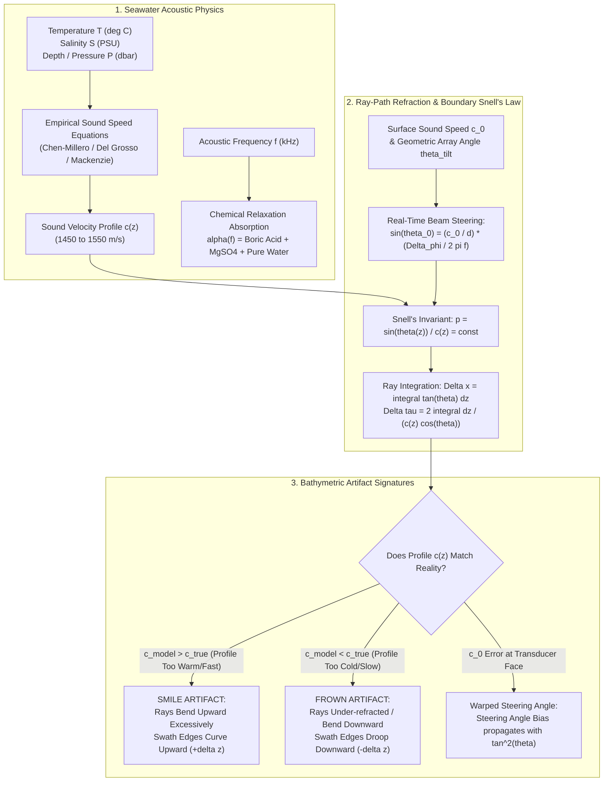
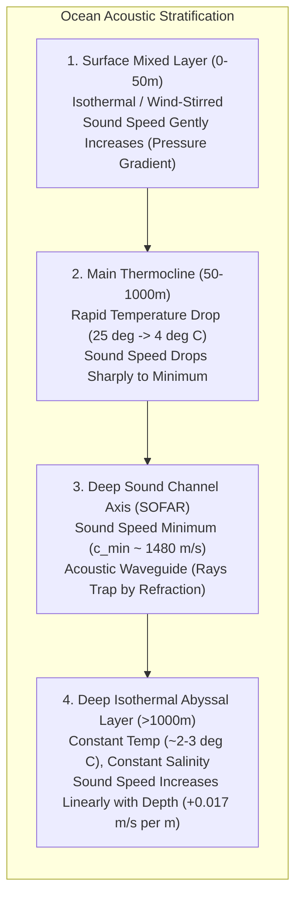
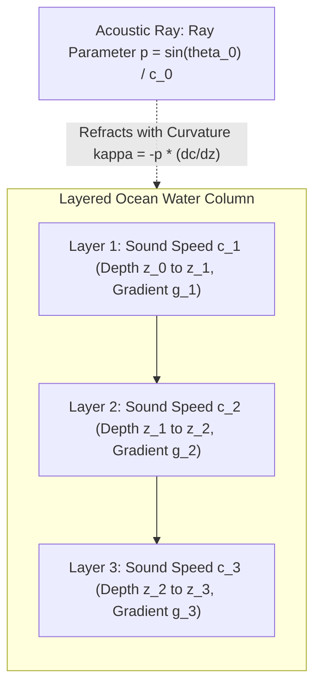
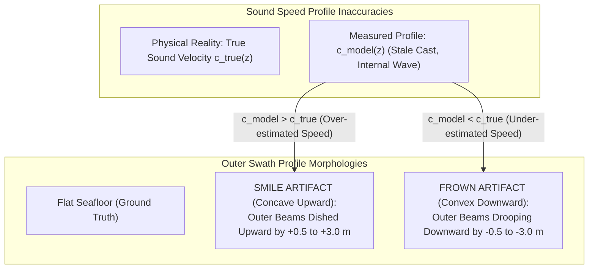
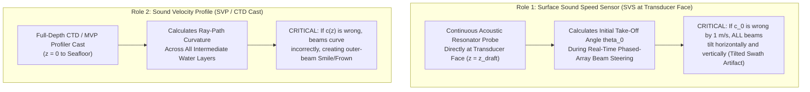

# Chapter 10: Sonar Systems and Underwater Acoustics

*Mapping the 71% of Earth's surface covered by water—where electromagnetic waves fail and acoustic wave propagation reigns.*

Because seawater is an electrical conductor ($\sigma \approx 3\text{–}5\text{ S/m}$), optical and radar electromagnetic radiation undergoes severe exponential attenuation via skin-depth absorption, extinguishing within centimeters (for microwaves) to tens of meters (for blue-green light in the clearest oligotrophic waters). Consequently, more than $99\%$ of the global ocean seafloor can only be mapped using mechanical compressional waves: underwater acoustics. Sound waves propagate through water with an average speed of $c \approx 1500\text{ m/s}$—approximately five orders of magnitude slower than light—undergoing complex spatial refraction, boundary reflection, volume reverberation, and frequency-dependent attenuation. This chapter establishes the fundamental acoustic physics, ray-tracing mechanics, transducer and sonar array architectures, error budgets, and software processing workflows governing acoustic bathymetry from shallow estuaries to the deepest oceanic trenches.

---

## 10.1 Underwater Acoustic Physics and Sound Speed Refraction

Modern acoustic bathymetry relies on measuring the two-way travel time $\tau$ and arrival angle $\theta$ of an acoustic pulse transmitted into the water column and backscattered from the benthic boundary. Converting these observations into accurate three-dimensional seafloor coordinates $(x, y, z)$ requires modeling the acoustic wave equation, frequency-dependent absorption, and ray-path refraction through a dynamic, vertically stratified ocean.

### 10.1.1 Acoustic Frequency, Attenuation, and Transducer Directivity

The choice of operational acoustic frequency $f$ represents the foremost trade-off in sonar system design, balancing spatial resolution and transducer physical dimensions against maximum achievable slant range $R_{\max}$.

#### Attenuation and Absorption in Seawater
As an acoustic wave of sound pressure level $p(r)$ propagates through seawater, its intensity attenuates due to geometric spherical/cylindrical spreading and frequency-dependent absorption:

$$p(R) = \frac{p_0}{R} \exp\left(-\frac{\alpha(f) R}{20 \log_{10}(e)}\right) = \frac{p_0}{R} 10^{-\alpha(f) R / 20}$$

where $R$ is slant range in meters, $p_0$ is source sound pressure at $1\text{ m}$, and $\alpha(f)$ is the seawater absorption coefficient in decibels per kilometer ($\text{dB/km}$). 

Unlike electromagnetic propagation in air, seawater acoustic absorption is dominated by molecular chemical relaxation processes rather than sheer viscous friction. Below $100\text{ kHz}$, absorption is driven by the pressure-dependent dissociation and reassociation of boric acid $\text{B(OH)}_3$ and magnesium sulfate $\text{MgSO}_4$. Under the standard Francois and Garrison (1982) formulation, total acoustic absorption is partitioned into three distinct additive physical regimes:

$$\alpha(f) = \underbrace{A_1 P_1 \frac{f_1 f^2}{f_1^2 + f^2}}_{\text{Boric Acid Relaxation}} + \underbrace{A_2 P_2 \frac{f_2 f^2}{f_2^2 + f^2}}_{\text{Magnesium Sulfate Relaxation}} + \underbrace{A_3 P_3 f^2}_{\text{Pure Water Shear Viscosity}} \quad [\text{dB/km}]$$

where:
* $f_1 \approx 0.78 (S/35)^{1/2} e^{T/26}\text{ kHz}$ is the boric acid relaxation frequency ($\sim 1\text{ kHz}$ at $20^\circ\text{C}$).
* $f_2 \approx 42 e^{T/17}\text{ kHz}$ is the magnesium sulfate relaxation frequency ($\sim 70\text{–}100\text{ kHz}$ at $20^\circ\text{C}$).
* $P_1, P_2, P_3$ are non-dimensional hydrostatic pressure correction factors accounting for depth $z$.
* $T$ is temperature in $^\circ\text{C}$, $S$ is salinity in Practical Salinity Units ($\text{PSU}$ or $\text{g/kg}$), and $f$ is frequency in $\text{kHz}$.

| Frequency ($f$) | Primary Domain & Application | Typical $\alpha(f)$ ($T=10^\circ\text{C}, S=35\text{ PSU}$) | Max Practical Depth / Range | Typical Transducer Array Dimension ($L$) |
| :--- | :--- | :--- | :--- | :--- |
| **$12\text{ kHz}$** | Deep Ocean Trenches ($0\text{–}11{,}000\text{ m}$) | $\approx 1.0\text{–}1.5\text{ dB/km}$ | $11{,}000\text{ m}$ (Full Ocean Depth) | $4.0\text{–}8.0\text{ m}$ along-track |
| **$30\text{ kHz}$** | Continental Slope & Abyssal Plain | $\approx 6.5\text{ dB/km}$ | $3{,}000\text{–}5{,}000\text{ m}$ | $2.0\text{–}4.0\text{ m}$ |
| **$70\text{–}100\text{ kHz}$** | Continental Shelf ($50\text{–}1{,}000\text{ m}$) | $\approx 25\text{–}35\text{ dB/km}$ | $800\text{–}1{,}200\text{ m}$ | $1.0\text{–}1.5\text{ m}$ |
| **$200\text{–}400\text{ kHz}$** | Coastal, Harbor, & Hydrographic Charting | $\approx 60\text{–}120\text{ dB/km}$ | $150\text{–}250\text{ m}$ | $0.2\text{–}0.5\text{ m}$ |
| **$700\text{–}1000\text{ kHz}$**| Micro-bathymetry, AUV, & Marine Archaeology | $\approx 250\text{–}450\text{ dB/km}$ | $20\text{–}50\text{ m}$ | $0.1\text{–}0.2\text{ m}$ |

#### Beam Directivity and Transducer Diffraction Limits
To resolve fine bathymetric features and localize soundings in three dimensions, acoustic energy must be focused into directional beams. For a linear transducer array of continuous physical length $L$ or a piston of diameter $D$ transmitting sound of wavelength $\lambda = c / f$, diffraction imposes an angular beamwidth $\theta_{\text{beam}}$:

$$\theta_{\text{3dB, linear}} \approx 0.886 \frac{\lambda}{L} = 0.886 \frac{c}{f L} \quad [\text{rad}], \qquad \theta_{\text{3dB, circular}} \approx 1.22 \frac{\lambda}{D} = 1.22 \frac{c}{f D} \quad [\text{rad}]$$

This fundamental relationship creates an unyielding physical constraint: achieving a high-resolution $0.5^\circ$ beamwidth at deep-ocean frequencies ($12\text{ kHz}$, $\lambda \approx 12.5\text{ cm}$) requires a massive shipboard hull-mounted array of length $L \ge 12.5\text{ m}$, whereas the same $0.5^\circ$ resolution at shallow-water frequencies ($400\text{ kHz}$, $\lambda \approx 3.75\text{ mm}$) requires an array of only $L \approx 37.5\text{ cm}$.

---

### 10.1.2 The Physics of Sound Speed in Seawater

Sound speed in seawater is not a universal physical constant; it varies continuously from $1440\text{ m/s}$ in freezing polar seas to over $1550\text{ m/s}$ in warm, high-salinity surface waters and deep ocean abysses. Thermodynamically, acoustic sound speed $c$ in a fluid is governed by the Newton–Laplace equation relating adiabatic compressibility $\beta_S$ and mass density $\rho$:

$$c = \sqrt{\frac{K_S}{\rho}} = \sqrt{\frac{1}{\rho \beta_S}}$$

Because density and compressibility depend on molecular thermal agitation, dissolved salt ions, and intermolecular packing under hydrostatic pressure, sound speed is fundamentally a function of three physical state variables: **Temperature ($T$)**, **Salinity ($S$)**, and **Pressure ($P$)** (or Depth $z$):

$$c = c(T, S, P)$$

Empirical derivatives demonstrate the relative sensitivity of sound speed to environmental perturbations under nominal oceanographic conditions ($T = 10^\circ\text{C}, S = 35\text{ PSU}, z = 0\text{ m}$):
* **Temperature Sensitivity:** $\frac{\partial c}{\partial T} \approx +4.0\text{ to }+4.5\text{ m/(s}\cdot^\circ\text{C)}$ (warm water increases sound speed by increasing molecular kinetic energy).
* **Salinity Sensitivity:** $\frac{\partial c}{\partial S} \approx +1.3\text{ to }+1.4\text{ m/(s}\cdot\text{PSU)}$ (dissolved salts disrupt water hydrogen-bonding networks, reducing compressibility).
* **Pressure / Depth Sensitivity:** $\frac{\partial c}{\partial P} \approx +0.016\text{ m/(s}\cdot\text{dbar)} \approx +0.017\text{ m/(s}\cdot\text{m)}$ (hydrostatic compression packs water molecules closer together, stiffening the fluid bulk modulus).

#### Empirical Sound Velocity Formulations
Because measuring fluid compressibility $\beta_S$ at sea is impractical, hydrographers and oceanographers rely on high-precision empirical polynomials fitted to laboratory acoustic resonator measurements:

1. **Mackenzie (1981) Nine-Term Equation:** Widely used in naval systems and embedded real-time sonars for computational efficiency across $T \in [2, 30]^\circ\text{C}, S \in [25, 40]\text{ PSU}, z \in [0, 8000]\text{ m}$:
   $$c(T, S, z) = 1448.96 + 4.591 T - 5.304 \times 10^{-2} T^2 + 2.374 \times 10^{-4} T^3 + 1.340 (S - 35) + 1.630 \times 10^{-2} z + 1.675 \times 10^{-7} z^2 - 1.025 \times 10^{-2} T (S - 35) - 7.139 \times 10^{-13} T z^3$$

2. **Del Grosso (1974) Formulation:** Considered by the international hydrographic and naval community to be the most accurate formulation for deep ocean acoustics, valid across $T \in [0, 30]^\circ\text{C}, S \in [30, 40]\text{ PSU}, P \in [0, 1000]\text{ kg/cm}^2$. Del Grosso's NRL measurements consistently match deep-ocean tomographic travel-time observations with an absolute accuracy of $\pm 0.05\text{ m/s}$.

3. **Chen and Millero (1977) / UNESCO (1983) Algorithm:** Recommended by the Intergovernmental Oceanographic Commission (IOC) and adopted as the international standard for general oceanographic profiling. It expresses sound speed as a function of the International Practical Temperature Scale ($T_{68}$ or $T_{90}$), Practical Salinity ($S$), and hydrostatic gauge pressure ($P$ in $\text{bar}$).

4. **TEOS-10 Thermodynamic Equation of Seawater (2010):** The modern thermodynamic standard adopted by the IUGG and IAPSO. Instead of arbitrary polynomials, TEOS-10 computes sound speed directly from the partial derivatives of the Gibbs free energy function of seawater $g(S_A, \Theta, P)$ as a function of **Absolute Salinity ($S_A$)** and **Conservative Temperature ($\Theta$)**:
   $$c(S_A, \Theta, P) = \left[-g_{PP}(S_A, \Theta, P) + \frac{g_{P\Theta}^2(S_A, \Theta, P)}{g_{\Theta\Theta}(S_A, \Theta, P)}\right]^{-1/2}$$

---

### 10.1.3 The Ocean Sound Velocity Profile (SVP) and Environmental Stratification

In natural water bodies, solar radiative heating at the surface, wind-driven wave mixing, fresh water river discharges, and geothermal seafloor heating create pronounced vertical stratification in temperature and salinity, establishing a dynamic **Sound Velocity Profile ($c(z)$)**.

#### Key Environmental Acoustic Phenomena
1. **The Surface Mixed Layer and Acoustic Surface Duct:** Wind stress mixes the upper $10\text{–}100\text{ m}$ into an isothermal, isohaline layer. Because temperature is uniform, the positive pressure gradient ($\frac{\partial c}{\partial z} \approx +0.017\text{ s}^{-1}$) causes sound speed to increase slightly with depth. Acoustic rays transmitted within this layer refract continuously upward toward the sea surface, reflecting specularly and becoming trapped in a **surface duct**.
2. **The Seasonal and Main Thermoclines:** Below the mixed layer, solar heating wanes, and temperature drops precipitously (e.g., from $22^\circ\text{C}$ at $30\text{ m}$ to $5^\circ\text{C}$ at $600\text{ m}$). The thermal gradient ($\frac{\partial c}{\partial T} \approx 4.5\text{ m/(s}\cdot^\circ\text{C)}$) completely overwhelms the pressure gradient, driving sound speed down by $30\text{–}60\text{ m/s}$ in a steep negative gradient ($\frac{\partial c}{\partial z} < 0$). Rays entering the thermocline refract sharply downward away from the surface.
3. **The SOFAR Channel Axis:** At depths between $800\text{ and }1200\text{ m}$ (depending on latitude), the temperature stabilizes near $2\text{–}4^\circ\text{C}$. Below this depth, temperature can drop no further; the relentless hydrostatic pressure gradient ($\frac{\partial c}{\partial z} \approx +0.017\text{ s}^{-1}$) takes over, forcing sound speed to increase monotonically down to the ocean floor. The inflection point between the cooling-dominated decrease and the pressure-dominated increase forms a global **Sound Speed Minimum ($c_{\min}$)** known as the **SOFAR (Sound Fixing and Ranging) channel axis**. Acoustic energy trapped in this duct refracts back and forth across the axis without striking either the surface or seafloor, propagating over thousands of kilometers.
4. **The "Afternoon Effect" and Diurnal Thermoclines:** On calm, sunny days, intense solar insolation heats the upper $1\text{–}5\text{ m}$ of the sea surface by $1\text{–}3^\circ\text{C}$. This micro-stratification creates a localized, sharply negative sound speed gradient right at the transducer face ($\frac{\partial c}{\partial z} \ll 0$), bending horizontal acoustic rays downward into the seabed and creating an acoustic "shadow zone" near the surface where targets or shallow features are completely masked.
5. **Estuarine Salt Wedges and Haloclines:** In coastal bays, fjords, and river mouths, light fresh river water ($\rho \approx 1000\text{ kg/m}^3, S \approx 0\text{ PSU}, c \approx 1450\text{ m/s}$) floats over dense oceanic salt water ($\rho \approx 1025\text{ kg/m}^3, S \approx 34\text{ PSU}, c \approx 1500\text{ m/s}$). The resulting **halocline** produces a sudden step change of $\Delta c \approx 20\text{–}50\text{ m/s}$ over a vertical distance of less than half a meter, causing extreme ray bending, catastrophic beam refraction, and acoustic interface scattering.

---

### 10.1.4 Acoustic Ray-Tracing and Snell's Law in Stratified Media

Sound waves propagate along rays perpendicular to local acoustic wavefronts. In a continuously stratified medium where sound speed varies only with depth ($c = c(z)$), acoustic refraction is governed by **Snell's Law of Refraction**:

$$\frac{\sin\theta(z)}{c(z)} = p = \text{constant}$$

where:
* $z$ is depth (positive downward).
* $\theta(z)$ is the ray angle relative to the local vertical (nadir angle).
* $c(z)$ is the local sound speed at depth $z$.
* $p$ is the invariant **Snell's ray parameter** (equivalent to horizontal slowness $s_x = 1/c_x$).

Differentiating Snell's law along the ray path arc length $s$ yields the acoustic ray curvature $\kappa$:

$$\kappa = \frac{d\theta}{ds} = -p \frac{dc}{dz} = -\frac{\sin\theta(z)}{c(z)} \frac{dc}{dz}$$

The geometric consequences are fundamental to bathymetry:
* When sound speed increases with depth ($\frac{dc}{dz} > 0$), ray curvature $\kappa < 0$: rays curve **upward** toward slower water.
* When sound speed decreases with depth ($\frac{dc}{dz} < 0$), ray curvature $\kappa > 0$: rays curve **downward** toward slower water.
* Sound rays are always refracted toward the region of **lower sound speed**.

#### Constant-Gradient Circular-Arc Ray Tracing
In operational hydrographic processing suites (such as `MB-System`, `Kluster`, and `CARIS`), the water column profile is discretized into $N$ discrete depth layers $[z_{k-1}, z_k]$. Within each layer $k$, sound speed is assumed to vary linearly with depth:

$$c(z) = c_{k-1} + g_k (z - z_{k-1}), \qquad g_k = \frac{c_k - c_{k-1}}{z_k - z_{k-1}}$$

where $g_k$ is the constant sound speed gradient ($\text{s}^{-1}$). Substituting this linear profile into the ray curvature equation reveals that inside any constant-gradient layer, the ray path is an exact **circular arc** with radius of curvature $R_k$:

$$R_k = \frac{1}{|p \, g_k|}$$

The horizontal across-track displacement $\Delta x_k$ and vertical one-way transit time $\Delta t_k$ across layer $k$ have exact analytical closed-form solutions:

$$\Delta x_k = \int_{z_{k-1}}^{z_k} \tan\theta(z) \, dz = \frac{1}{p \, g_k} \left(\cos\theta_{k-1} - \cos\theta_k\right)$$

$$\Delta t_k = \int_{z_{k-1}}^{z_k} \frac{dz}{c(z) \cos\theta(z)} = \frac{1}{|g_k|} \ln\left(\frac{c_k}{c_{k-1}} \frac{1 + \cos\theta_{k-1}}{1 + \cos\theta_k}\right) = \frac{1}{|g_k|} \ln\left(\frac{\tan(\theta_k / 2)}{\tan(\theta_{k-1} / 2)}\right)$$

Summing across all penetrated layers from the transducer draft $z_{\text{trans}}$ to the seafloor impact depth $z_{\text{bottom}}$ yields the total across-track distance $X$ and total two-way travel time $\tau$:

$$X = \sum_{k=1}^{M} \Delta x_k, \qquad \tau = 2 \sum_{k=1}^{M} \Delta t_k$$

---

### 10.1.5 Ray-Tracing Artifacts: Outer-Beam "Smile" and "Frown"

Because acoustic rays in wide-swath multibeam echosounders travel through the water column at oblique angles reaching $\theta = 65^\circ\text{–}75^\circ$ off nadir, slight discrepancies between the modeled sound speed profile $c_{\text{model}}(z)$ and the true physical water column $c_{\text{true}}(z)$ propagate into severe vertical depth errors that amplify rapidly toward the outer swath edges.

#### The Mathematical Anatomy of Refraction Errors
Consider a multibeam sounding at true depth $z$ and nadir angle $\theta$. The vertical depth error $\delta z = z_{\text{calc}} - z_{\text{true}}$ caused by a depth-averaged profile error $\Delta c = c_{\text{model}} - c_{\text{true}}$ scales quadratically with the tangent of the off-nadir angle:

$$\frac{\delta z}{z} \approx \frac{\Delta c}{c} \tan^2\theta$$

Notice the extreme non-linear growth with swath angle $\theta$:
* At nadir ($\theta = 0^\circ$): $\tan(0^\circ) = 0$. Profile refraction error causes zero bending; the vertical error is purely a linear two-way travel time scaling ($\delta z / z = \Delta c / c$). For a $10\text{ m/s}$ sound speed error ($0.67\%$) in $100\text{ m}$ of water, the nadir depth error is only $0.67\text{ m}$.
* At $\theta = 45^\circ$: $\tan(45^\circ) = 1.0 \implies \tan^2(45^\circ) = 1.0$.
* At $\theta = 65^\circ$: $\tan(65^\circ) \approx 2.14 \implies \tan^2(65^\circ) \approx 4.60$. The refraction error is **$4.6\times$ larger** than at $45^\circ$!
* At $\theta = 75^\circ$: $\tan(75^\circ) \approx 3.73 \implies \tan^2(75^\circ) \approx 13.9$. The refraction error is **$14\times$ larger**!

#### Systematic Failure Modes
1. **The "Smile" Artifact (Concave Upward / Dished Edges):**
   * *Physical Cause:* Occurs when the applied sound speed profile is **faster/warmer than reality** in the upper water column ($\overline{c}_{\text{model}} > \overline{c}_{\text{true}}$).
   * *Mechanism:* The ray-tracing algorithm assumes the rays refract upward more sharply than they actually do in the ocean, projecting the soundings along paths that curl upward toward the surface.
   * *Topographic Signature:* Across a flat, planar seafloor, the outer swath soundings bend upward into a distinct bowl or "smile." When overlapping swaths are gridded into a DEM, the edges of adjacent survey lines form artificial raised parallel ridges ("railroad tracks").
2. **The "Frown" Artifact (Convex Downward / Drooping Edges):**
   * *Physical Cause:* Occurs when the applied sound speed profile is **slower/colder than reality** ($\overline{c}_{\text{model}} < \overline{c}_{\text{true}}$). This commonly happens when a morning SVP cast is reused during a sunny afternoon after the surface mixed layer has warmed up.
   * *Mechanism:* The ray-tracing algorithm under-refracts the rays, projecting soundings deeper and wider than their true benthic positions.
   * *Topographic Signature:* Across a flat seafloor, the outer swath soundings droop downward into a convex dome or "frown," carving artificial troughs and valleys along the swath overlap seams in the final DEM.

---

### 10.1.6 Surface Sound Speed ($c_0$) vs. Profile Sound Speed ($c(z)$)

A critical distinction in multibeam bathymetry that routinely confuses non-specialists is the operational difference between the **Surface Sound Speed ($c_0$)** and the **Water-Column Sound Velocity Profile ($c(z)$)**.

#### Electronic Beam Steering at the Transducer Face
Modern flat-faced multibeam arrays (such as the Kongsberg EM2040, Reson SeaBat T50, or Norbit iWBMSh) transmit and receive beams across a wide sector (up to $150^\circ$) by applying precise electronic time delays or phase shifts $\Delta\phi$ across an array of discrete transducer elements spaced at distance $d$. The physical direction of constructive wavefront interference—the **take-off angle $\theta_0$** relative to array normal—depends directly on the sound speed of the water in immediate contact with the transducer face ($c_0$):

$$\sin\theta_0 = \frac{c_0 \, \Delta\phi}{2\pi f d}$$

If the surface sound speed sensor (SVS) mounted at the hull is uncalibrated, fouled by biofouling, or malfunctioning by an error $\delta c_0$, the sonar computes an incorrect launch angle $\theta_0 + \delta\theta_0$:

$$\delta\theta_0 = \tan\theta_0 \frac{\delta c_0}{c_0}$$

This launch error occurs at the very root of the ray trace. Combining the launch angle bias $\delta\theta_0$ with the profile refraction error $\overline{\Delta c}$ reveals the governing coupled error equation for flat arrays:

$$\frac{\delta z}{z} \approx \frac{\overline{\Delta c}}{c} - \tan^2\theta \left(\frac{\overline{\Delta c}}{c} - \frac{\delta c_0}{c_0}\right)$$

Notice that if $\delta c_0 = \overline{\Delta c}$ (i.e., the surface sound speed error perfectly matches the water-column profile error), the $\tan^2\theta$ term vanishes, leaving only the uniform scale error $\Delta c / c$! But if $c_0$ is measured with an accurate real-time sensor while the water-column profile $c(z)$ becomes outdated, the two errors decouple, driving severe second-order bathymetric warping across the outer beams.

---

### 10.1.7 Total Propagated Uncertainty (TPU) and Hydrographic Standards

Hydrographic survey specifications—principally **IHO S-44 (Standards for Hydrographic Surveys, 6th Edition)** and the **NOAA Hydrographic Surveys Specifications and Deliverables (HSSD)**—do not evaluate bathymetric data on resolution alone. They enforce rigorous statistical bounds on **Total Horizontal Uncertainty (THU)** and **Total Vertical Uncertainty (TVU)** at the $95\%$ confidence level ($1.96\sigma$).

Under IHO S-44, maximum allowable TVU as a function of water depth $d$ is formulated as:

$$\text{TVU}_{\max}(d) = \sqrt{a^2 + (b \cdot d)^2}$$

where $a$ represents depth-independent vertical errors (instrument draft, settlement/squat, heave sensor noise, tidal datum reduction, vertical geoid model) and $b$ represents depth-dependent vertical errors (sound speed profile refraction, roll gyro error, pitch tilt, beam angle estimation noise).

| IHO S-44 Survey Order | Maximum Allowable THU ($95\%$) | Maximum Allowable TVU ($a, b$) | Typical Application & Vessel Clearance |
| :--- | :--- | :--- | :--- |
| **Exclusive Order** | $1.0\text{ m}$ | $a = 0.15\text{ m}, \; b = 0.0075$ | Harbors, berthing slips, and critical channels with minimum Under-Keel Clearance (UKC $< 1\text{ m}$). |
| **Special Order** | $2.0\text{ m}$ | $a = 0.25\text{ m}, \; b = 0.0075$ | Navigational channels, port approaches, and harbors with UKC $< 2\text{ m}$. |
| **Order 1a** | $5.0\text{ m} + 5\% \text{ depth}$ | $a = 0.50\text{ m}, \; b = 0.0130$ | Coastal waters and shallow banks $< 100\text{ m}$ where natural or manmade seafloor hazards exist. |
| **Order 1b** | $5.0\text{ m} + 5\% \text{ depth}$ | $a = 0.50\text{ m}, \; b = 0.0130$ | Depths $< 100\text{ m}$ where under-keel clearance is not critical to commercial navigation. |
| **Order 2** | $20.0\text{ m} + 10\% \text{ depth}$ | $a = 1.00\text{ m}, \; b = 0.0230$ | Offshore and deep-ocean waters $> 100\text{ m}$ where general ocean seafloor morphology is surveyed. |

Achieving Special Order or Exclusive Order accuracy requires continuous sound speed profiling via **Moving Vessel Profilers (MVP)**, real-time SVS monitoring at the transducer face, kinematic GNSS Real-Time Kinematic (RTK) or Post-Processed Kinematic (PPK) ellipsoid referencing (canceling heave, settlement, and tidal model errors), and automated beam-by-beam TPU covariance propagation inside the hydrographic processing engine.
