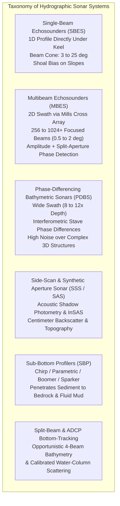
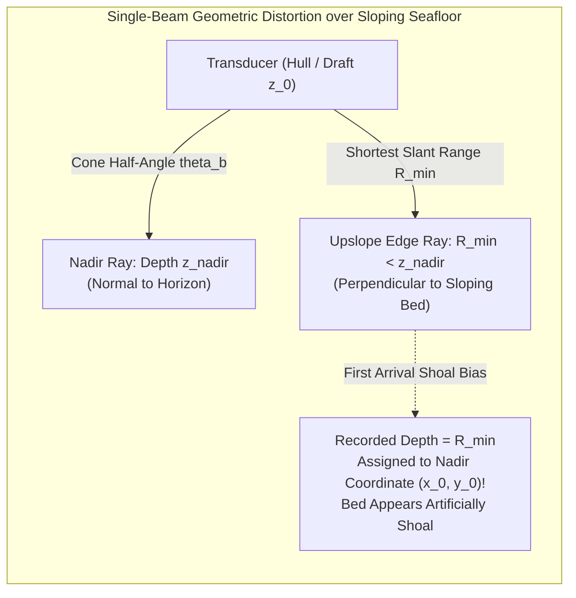
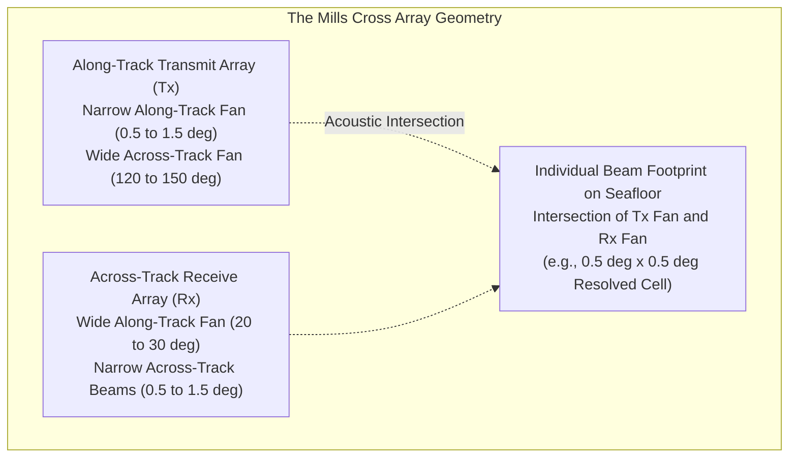
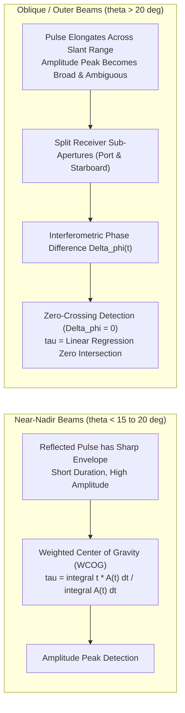
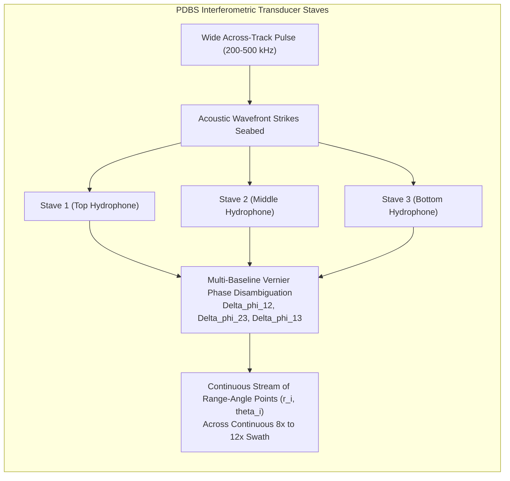
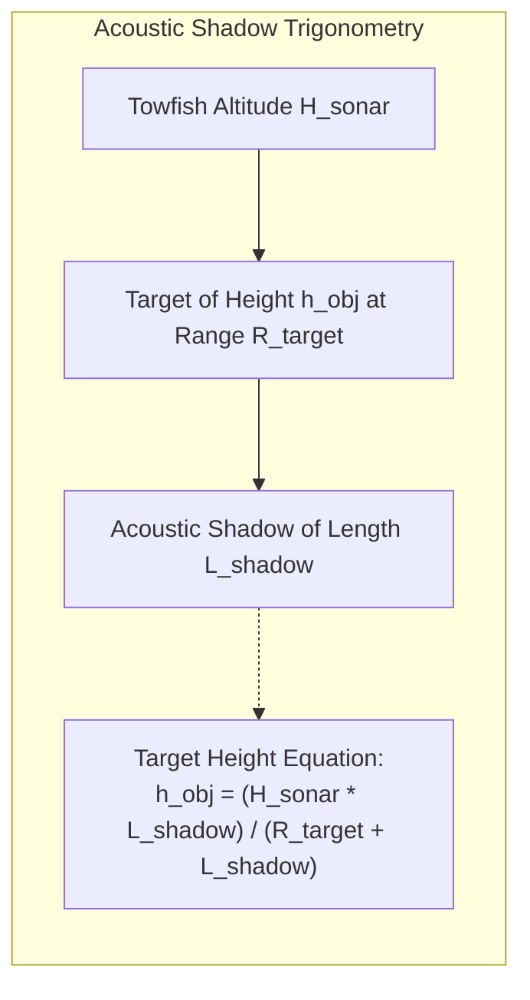
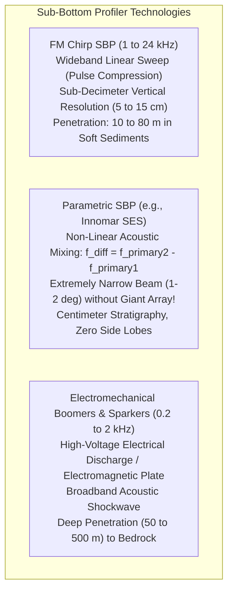

## 10.2 The Many Types of Sonar

Acoustic seafloor mapping encompasses a broad spectrum of sonar architectures, each engineered to address specific physical trade-offs among operating frequency, beamforming geometry, angular resolution, swath coverage, penetration depth, and sensitivity to water-column multipath. Understanding the physical principles and failure modes of each sonar class is essential for designing hydrographic surveys, interpreting point clouds, and identifying artifacts in derived Digital Elevation Models (DEMs).

---

### 10.2.1 Single-Beam Echosounders (SBES)

The Single-Beam Echosounder (SBES)—developed in the early twentieth century to replace physical lead lines—transmits a single, vertically directed acoustic pulse and records the round-trip travel time $\tau$ of the backscattered echo directly beneath the transducer. While technologically straightforward, SBES point clouds suffer from severe geometric limitations that must be modeled when compiling regional bathymetric grids.

#### First-Arrival Detection and Slope-Induced Shoal Bias
A typical single-beam transducer features a circular piston aperture with a relatively wide $-3\text{ dB}$ conical beamwidth of $\theta_{\text{beam}} \approx 8^\circ\text{ to }25^\circ$. The echosounder digitizes the received pressure signal and triggers a bottom-detection threshold upon the **first returning acoustic wavefront** whose amplitude exceeds the ambient noise floor.

Over a flat, horizontal seabed, the first arrival corresponds to the true nadir depth ($z = c \tau / 2$). However, when surveying across a sloping seabed of inclination angle $\alpha$, the point on the seafloor closest to the transducer is not the nadir point directly below the vessel, but rather the point where an off-nadir ray strikes the slope orthogonally (at angle $\theta = \alpha$):

$$R_{\min} = z_{\text{nadir}} \cos\alpha$$

Because standard SBES software logs only the travel time $\tau_{\min} = 2 R_{\min} / c$ and assumes the echo originated from the vessel's nadir position $(x_{\text{vessel}}, y_{\text{vessel}})$, two major geometric errors occur:
1. **Vertical Shoal Bias ($\Delta z$):** The recorded depth is systematically shallower than the true nadir depth:
   $$\Delta z = z_{\text{rec}} - z_{\text{nadir}} = -z_{\text{nadir}} (1 - \cos\alpha) \approx -z_{\text{nadir}} \frac{\alpha^2}{2}$$
2. **Horizontal Positioning Error ($\Delta x$):** The echo actually backscattered from an upslope position displaced horizontally by:
   $$\Delta x = z_{\text{nadir}} \sin\alpha \cos\alpha \approx z_{\text{nadir}} \alpha$$

On a $20^\circ$ slope in $100\text{ m}$ of water, a wide-beam SBES reports a depth of $94.0\text{ m}$ ($6.0\text{ m}$ shoal bias) and mislocalizes the sounding horizontally by $32.1\text{ m}$ upslope.

#### Hyperbolic Echo Traces over Discrete Point Obstacles
When a vessel navigates over an isolated submerged pinnacle, shipwreck mast, or boulder of height $h_0$ located at $(x_0, z_0)$, the slant range $R(x)$ measured along the ship's track $x$ forms a hyperbola:

$$R(x) = \sqrt{(x - x_0)^2 + (z_0 - h_0)^2}$$

Because the wide beam illuminates the pinnacle long before the vessel arrives directly overhead, the echogram displays a characteristic upward-curving hyperbolic arch. Without post-survey migration or manual beam-cone deconvolution, gridding raw SBES tracks produces artificial elongated ridges extending along the survey direction.

---

### 10.2.2 Multibeam Echosounders (MBES)

Multibeam Echosounders (MBES) represent the premier tool for modern hydrographic charting and submarine geomorphology, acquiring continuous, high-density swath bathymetry across swaths spanning $3\times\text{ to }7\times$ water depth.

#### The Mills Cross Array Architecture
Generating hundreds of individually resolved, narrow ($0.5^\circ\text{ to }1.0^\circ$) acoustic beams simultaneously in both along-track and across-track dimensions would physically require a massive, two-dimensional rectangular planar array consisting of tens of thousands of active ceramic elements—prohibitive in cost, weight, and signal processing bandwidth. 

To overcome this, multibeam systems adopt the **Mills Cross** (or "T-array") geometry (Mills & Little, 1953; Renard & Allenou, 1987):
1. **Transmitter (Tx) Array:** Arranged longitudinally along the vessel keel. It has a long physical dimension along-track ($L_{\text{along}}$) and a narrow physical width across-track ($W_{\text{across}}$). When energized, it transmits an acoustic pulse that is focused tightly along-track ($\theta_{\text{along}} \approx 0.886 \lambda / L_{\text{along}} \sim 0.5^\circ\text{–}1.5^\circ$) but fans out broadly across-track ($\sim 120^\circ\text{–}150^\circ$).
2. **Receiver (Rx) Array:** Arranged transversely across the vessel hull, perpendicular to the transmit array. It has a long physical dimension across-track ($L_{\text{across}}$) and a narrow width along-track. Electronic beamforming across the receiver elements synthesizes hundreds of receive beams focused tightly across-track ($\theta_{\text{across}} \approx 0.886 \lambda / L_{\text{across}} \sim 0.5^\circ\text{–}1.5^\circ$).
3. **The Resolved Footprint:** By spatial multiplication, the two-way acoustic sensitivity is the geometric product of the transmit and receive directivity patterns:
   $$B_{2\text{-way}}(\theta_{\text{across}}, \phi_{\text{along}}) = B_{\text{Tx}}(\phi_{\text{along}}) \times B_{\text{Rx}}(\theta_{\text{across}})$$
   The resolved measurement area on the seabed is the narrow spatial intersection patch of the two orthogonal fans.

#### Bottom-Detection Algorithms: Amplitude vs. Split-Aperture Phase Detection
Within each formed receive beam, the multibeam processor must determine the exact two-way travel time $\tau_i$ corresponding to the instant the acoustic wavefront struck the center of that beam's footprint. MBES systems employ two fundamentally different mathematical detection algorithms depending on beam incidence angle:

1. **Amplitude Detection (Weighted Center of Gravity):**
   * *Domain:* Applied to near-nadir beams ($\theta \lesssim 15^\circ\text{–}20^\circ$) where the acoustic wavefront strikes the seabed nearly normal to the surface.
   * *Mechanism:* The backscattered acoustic envelope exhibits a sharp, high-amplitude, specular peak. The precise bottom arrival time is extracted using the **Weighted Center of Gravity (WCOG)** of the backscatter power envelope $P(t)$:
     $$\tau_{\text{amp}} = \frac{\int_{t_1}^{t_2} t \cdot P(t) \, dt}{\int_{t_1}^{t_2} P(t) \, dt}$$
2. **Split-Aperture Phase Detection (Zero-Crossing):**
   * *Domain:* Applied to oblique outer beams ($\theta \gtrsim 20^\circ\text{ to }75^\circ$) where the transmitted pulse grazes the seabed at shallow angles.
   * *Failure of Amplitude:* As the wavefront sweeps across the elongated beam footprint, the returning amplitude profile smears out into an extended plateau lasting tens of milliseconds, rendering amplitude peak detection highly noisy and inaccurate.
   * *Mechanism:* The receiver array for that beam is partitioned into two half-apertures (sub-arrays $A$ and $B$) separated by baseline distance $d_{\text{sub}}$. Signals received by the two sub-arrays exhibit an interferometric phase difference $\Delta\phi(t)$:
     $$\Delta\phi(t) = \phi_A(t) - \phi_B(t) = \frac{2\pi}{\lambda} d_{\text{sub}} \sin(\delta\theta(t))$$
     where $\delta\theta(t)$ is the instantaneous angular deviation from the nominal beam pointing axis. When the backscattered wavefront passes exactly through the acoustic optical axis of the beam, $\delta\theta = 0$, causing the phase difference to cross zero ($\Delta\phi = 0$). By fitting a robust linear regression line through the phase ramp $\Delta\phi(t)$ within the footprint window, the exact zero-crossing time $\tau_{\text{phase}}$ is extracted with sub-sample, microsecond precision.

#### Multi-Sector, Dual-Swath, and Water-Column Imaging
Modern high-performance multibeam systems incorporate advanced transmission modalities:
* **Multi-Sector Frequency Modulation (FM Chirp):** To overcome vessel pitch and yaw during transit, the transmitter divides the across-track swath into 3 to 8 independent angular sectors, each transmitting at a distinct center frequency using linear frequency-modulated (chirp) pulses. Each sector dynamically steers in real time to counteract vessel roll, pitch, and yaw, maintaining uniform along-track sounding density without "swath smiling" or along-track gaps.
* **Dual-Swath Mode:** Systems transmit two along-track fans per ping cycle (steered slightly forward and aft), doubling survey speed while satisfying stringent IHO sounding density standards.
* **Water-Column Imaging (WCI):** Modern systems record continuous acoustic time-series data throughout the entire water column from transducer to seafloor. WCI processing enables direct 3D volumetric detection and mapping of methane gas seeps, hydrothermal vent plumes, suspended sediment clouds, fish schools, and submerged kelp forest canopies.

---

### 10.2.3 Interferometric / Phase-Differencing Bathymetric Sonars (PDBS)

Phase-Differencing Bathymetric Sonars (PDBS)—also termed Interferometric Bathymetric Sonars—provide an alternative swath bathymetry architecture particularly favored in very shallow waters ($< 15\text{ m}$).

#### Principles of Phase-Differencing Bathymetry
Unlike multibeam echosounders that form hundreds of discrete angular receive beams and search for the travel time inside each beam, a PDBS forms a single, broad across-track fan and measures the returning electrical phase difference $\Delta\phi$ across multiple vertically spaced receiver staves (typically 3 to 10 parallel rows of transducer elements) as a continuous function of time $t$:

$$\sin\theta(t) = \frac{\lambda \, \Delta\phi(t)}{2\pi d_{\text{stave}}}$$

Knowing slant range $R(t) = c t / 2$ and instantaneous receive angle $\theta(t)$ allows the sonar to solve the polar coordinate equation for thousands of soundings per ping.

#### Operational Advantages and Structural Failure Modes
* **Swath Width Superiority in Shallow Water:** In depths of $2\text{–}10\text{ m}$, beam-steered multibeams are geometrically limited by array aperture physics to swaths of $3\times\text{–}4\times$ water depth ($6\text{–}40\text{ m}$ total swath). A PDBS routinely achieves swath widths of **$8\times\text{ to }12\times$ water depth** ($16\text{–}120\text{ m}$ swath), vastly accelerating nearshore, riverine, and coastal marsh mapping.
* **High Density and True Co-Registered Backscatter:** Soundings are produced as an ungridded continuous stream, perfectly co-registered with high-resolution side-scan sonar amplitude imagery.
* **Multipath Vulnerability over Complex 3D Topography:** The Achilles' heel of interferometry is its assumption that only one acoustic echo arrives at the receiver staves at any given instant $t$. When surveying near vertical quay walls, bridge pilings, shipwrecks, or rugged underwater boulders, multipath reflections from the surface and structure arrive simultaneously with the bottom echo. The overlapping acoustic wavefronts interfere, causing the electrical phase difference to decorrelate and collapse into chaotic random noise ("phase wrapping blunders" and artificial vertical point clouds).

---

### 10.2.4 Side-Scan Sonar (SSS) and Synthetic Aperture Sonar (SAS)

Side-Scan Sonar (SSS) and Synthetic Aperture Sonar (SAS) focus primarily on generating high-resolution acoustic images of seafloor texture, sediment composition, and small manmade or geologic targets (wrecks, mines, boulders, fault scarps).

#### Side-Scan Sonar and Shadow Height Photometry
A side-scan sonar transmits wide across-track, narrow along-track fan beams from port and starboard transducers (typically deployed inside a stable hydrodynamic towfish or AUV). It digitizes acoustic backscatter intensity as a function of slant range, displaying hard, reflective substrates (rock, gravel, steel) as bright pixels, low-reflectance mud and silt as muted gray, and topographic depressions or blocked areas as dark **acoustic shadows**.

While conventional SSS does not directly record 3D point coordinates, the vertical height $h_{\text{obj}}$ of an upstanding target can be derived from the length of its acoustic shadow:

$$h_{\text{obj}} = \frac{H_{\text{sonar}} \cdot L_{\text{shadow}}}{R_{\text{target}} + L_{\text{shadow}}} = \frac{H_{\text{sonar}} \cdot L_{\text{shadow}}}{R_{\text{tip}}}$$

where $H_{\text{sonar}}$ is the altitude of the sonar above the seafloor, $L_{\text{shadow}}$ is the across-track length of the acoustic shadow on the seabed, $R_{\text{target}}$ is the slant range to the base of the object, and $R_{\text{tip}} = R_{\text{target}} + L_{\text{shadow}}$ is the slant range to the far tip of the shadow.

#### Synthetic Aperture Sonar (SAS) and InSAS Bathymetry
In conventional real-aperture side-scan sonar, the along-track spatial resolution $\delta x$ degrades linearly with slant range $R$:

$$\delta x_{\text{real}}(R) = R \cdot \theta_{\text{beam}} = R \frac{\lambda}{L_{\text{array}}}$$

At a range of $150\text{ m}$ with a $1\text{ m}$ array at $100\text{ kHz}$ ($\lambda = 1.5\text{ cm}$), the along-track footprint smears out to $\delta x = 2.25\text{ m}$.

**Synthetic Aperture Sonar (SAS)** overcomes this diffraction limit by coherently recording both the amplitude and carrier phase of successive acoustic pings as the platform travels along a linear track. By synthesizing an acoustic aperture of length $L_{\text{syn}} \approx R \lambda / L_{\text{array}}$ matching the beam footprint, SAS achieves an along-track resolution that is **completely independent of range and acoustic wavelength**:

$$\delta x_{\text{SAS}} = \frac{L_{\text{physical}}}{2}$$

A $1\text{ m}$ SAS array achieves an along-track resolution of **$5\text{ cm}$ at all ranges**, whether at $10\text{ m}$ or $300\text{ m}$! 

Furthermore, **Interferometric Synthetic Aperture Sonar (InSAS)** incorporates two vertically separated receiver arrays. By measuring the interferometric phase difference between the synthetic aperture images reconstructed by the two arrays, InSAS generates co-registered, centimeter-scale 3D bathymetric Digital Elevation Models alongside ultra-high-resolution imagery, revolutionizing underwater mine countermeasures, pipeline inspection, and deep-sea benthic habitat mapping.

---

### 10.2.5 Sub-Bottom Profilers (SBP)

Digital Elevation Models of the seafloor often represent only the modern sediment-water interface, masking buried paleochannels, fault splays, landslides, bedrock foundations, and fluid mud layers that govern coastal engineering, dredging, and marine geology. Sub-Bottom Profilers (SBP) utilize low acoustic frequencies to penetrate beneath the seafloor.

#### Acoustic Impedance and Sub-Surface Reflectivity
When an acoustic wave propagating through a sediment layer of acoustic impedance $Z_1 = \rho_1 c_1$ encounters a boundary with a second layer of impedance $Z_2 = \rho_2 c_2$, the normal-incidence acoustic pressure reflection coefficient $\mathcal{R}$ is governed by:

$$\mathcal{R} = \frac{Z_2 - Z_1}{Z_2 + Z_1} = \frac{\rho_2 c_2 - \rho_1 c_1}{\rho_2 c_2 + \rho_1 c_1}$$

* **Water to Soft Mud Interface:** Silt-clay suspensions have densities ($\rho \approx 1100\text{–}1200\text{ kg/m}^3$) and sound speeds ($c \approx 1460\text{ m/s}$) nearly identical to bottom seawater, yielding a weak reflection ($\mathcal{R} \approx 0.05\text{–}0.10$). Sound easily penetrates the layer.
* **Sediment to Sand/Gravel Interface:** Packed coarse quartz sand has higher density ($\rho \approx 1900\text{ kg/m}^3$) and sound speed ($c \approx 1750\text{ m/s}$), producing a strong reflection ($\mathcal{R} \approx 0.35$).
* **Sediment to Bedrock or Basalt Interface:** Solid crystalline rock ($\rho \approx 2600\text{ kg/m}^3, c \approx 4500\text{ m/s}$) creates a massive impedance contrast ($\mathcal{R} \approx 0.75$), reflecting nearly all acoustic energy and blocking deeper penetration.
* **Biogenic Methane Gas in Sediments:** Free gas bubbles within pore water cause fluid compressibility $\beta_S$ to skyrocket, causing sound speed to collapse ($c < 500\text{ m/s}$) and producing an enormous negative impedance mismatch. This creates a brilliant, phase-inverted "acoustic wipeout" or "bright spot" that completely masks all underlying geology.

#### Fluid Mud and the Concept of "Nautical Depth"
In major worldwide ports and estuaries (e.g., Rotterdam, Zeebrugge, Maracaibo, Mississippi River Delta), navigation channels are blanketed by thick layers ($0.5\text{ to }3.0\text{ m}$) of **fluid mud**—a high-concentration cohesive suspension of clay minerals, organic matter, and water. 

This creates a critical operational conundrum for hydrographic DEMs:
* A high-frequency multibeam ($200\text{–}400\text{ kHz}$) reflects off the very top of the fluid mud suspension (the lutocline, where $\rho \approx 1050\text{ kg/m}^3$), reporting a shallow depth that would theoretically bar deep-draft container ships.
* A low-frequency sub-bottom profiler ($3\text{–}12\text{ kHz}$) penetrates through the mud to the underlying consolidated bed ($\rho > 1400\text{ kg/m}^3$).
* In reality, a ship's keel can safely navigate through the upper fluid mud without structural damage or dangerous loss of maneuverability. 

Under PIANC (World Association for Waterborne Transport Infrastructure) standards, international hydrographic agencies define the true navigable seafloor not by an acoustic return, but by **Nautical Depth**: the physical depth at which fluid mud mass density reaches a critical threshold of **$\rho = 1200\text{ kg/m}^3$** (or yield stress $\tau_y \approx 100\text{ Pa}$). Operational surveys in these ports combine parametric sub-bottom profiling with in-situ towed gamma-ray densimeters or tuning-fork rheometers to map the true $1200\text{ kg/m}^3$ nautical bottom surface.

---

### 10.2.6 Split-Beam Sonar & Acoustic Doppler Current Profilers (ADCP)

Beyond dedicated hydrographic sonars, valuable opportunistic bathymetric soundings are routinely extracted from scientific acoustic instruments:
1. **Split-Beam Echosounders (Fisheries Sonar):** Systems such as the Simrad EK60/EK80 partition a circular transducer into four symmetric quadrants. By comparing the electrical phase differences between quadrants in both along-track and across-track axes, the sonar localizes individual biological targets in 3D within the beam cone, measuring calibrated **Target Strength (TS in dB)** to estimate fish biomass while simultaneously logging highly accurate bare-seabed depths.
2. **Acoustic Doppler Current Profilers (ADCP):** ADCPs deployed on research vessels, autonomous surface craft, and mooring buoys use 4-beam Janus configurations (directed $20^\circ\text{–}30^\circ$ off-nadir in opposing cardinal directions) operating at $75\text{ to }1200\text{ kHz}$. While designed to measure current velocity profiles via water-column Doppler shifts, the sonar simultaneously executes **bottom-tracking algorithms**, computing precise range along all four beams to measure vessel velocity over ground. In remote, unmapped rivers, estuaries, and polar shelves, these 4-beam bottom-track ranges provide an invaluable secondary source of opportunistic bathymetric data that can be ingested into regional DEM compilation workflows.

---

### 10.2.7 Master Comparative Matrix of Sonar Technologies

| Sonar Category | Operating Frequency | Typical Beamwidth / Along-Track Res | Swath Coverage / Geometry | Max Penetration Depth | Vertical Accuracy ($95\%$) | Primary Failure Modes & Artifacts |
| :--- | :--- | :--- | :--- | :--- | :--- | :--- |
| **Single-Beam (SBES)** | $24\text{–}200\text{ kHz}$ | $8^\circ\text{–}25^\circ$ cone | 1D single sounding under keel | $0\text{ m}$ (Seafloor only) | $\pm 0.1\text{ m}$ (flat) to $\pm 5\text{ m}$ (slopes) | First-arrival slope shoal bias; hyperbolic point-target smear; zero across-track coverage. |
| **Multibeam (MBES)** | $12\text{–}700\text{ kHz}$ | $0.5^\circ\text{–}2.0^\circ$ focused cells | $3\times\text{ to }7\times$ water depth ($120^\circ\text{–}150^\circ$) | $0\text{ m}$ (Seafloor only) | $\pm 0.05\text{ m}$ to $\pm 0.2\%$ depth | Sound speed profile smile/frown; SVS beam-steering tilt; bubble sweepdown attenuation. |
| **Phase-Diff (PDBS)** | $100\text{–}500\text{ kHz}$ | $0.2^\circ\text{–}1.0^\circ$ (continuous stream) | $8\times\text{ to }12\times$ water depth ($160^\circ$) | $0\text{ m}$ (Seafloor only) | $\pm 0.1\text{–}0.3\text{ m}$ | Severe phase-wrapping noise near vertical structures; multipath blunders; nadir data gap. |
| **Side-Scan (SSS)** | $100\text{–}900\text{ kHz}$ | $\sim 0.5^\circ\text{–}1.0^\circ$ (degrades with $R$) | $5\times\text{ to }15\times$ towfish altitude | $0\text{ m}$ (Seafloor only) | Qualitative (2D backscatter imagery) | Slant-range distortion; towfish layback uncertainty; lack of direct 3D elevation coordinates. |
| **Synthetic Aperture (SAS)** | $100\text{–}300\text{ kHz}$ | $2\text{–}5\text{ cm}$ (constant at all ranges!) | $10\text{–}20\times$ altitude ($200\text{–}600\text{ m}$) | $0\text{ m}$ (Seafloor only) | $\pm 0.02\text{–}0.05\text{ m}$ (InSAS) | Navigation micron-drift phase decorrelation; platform yaw instability; motion compensation errors. |
| **Chirp SBP** | $1\text{–}24\text{ kHz}$ | $15^\circ\text{–}30^\circ$ cone | 1D vertical stratigraphic profile | $10\text{–}80\text{ m}$ in soft mud | $\pm 0.05\text{–}0.15\text{ m}$ | Multiple-bounce surface reverberation; acoustic wipeout by biogenic gas; gravel scattering. |
| **Parametric SBP** | $0.5\text{–}10\text{ kHz}$ (diff) | $1.0^\circ\text{–}2.5^\circ$ (narrow beam!) | 1D vertical profile (zero side lobes) | $5\text{–}50\text{ m}$ | $\pm 0.02\text{–}0.05\text{ m}$ | Low acoustic efficiency ($<1\%$); vessel pitch/roll misalignment; high acquisition cost. |
| **ADCP Bottom-Track** | $75\text{–}1200\text{ kHz}$ | $2^\circ\text{–}4^\circ$ per beam (4 beams) | 4 discrete soundings ($20^\circ$ off-nadir) | $0\text{ m}$ | $\pm 0.2\text{–}0.5\text{ m}$ | Wide sounding spacing; pitch/roll coordinate rotation errors; false bottom locks on kelp/fish. |
