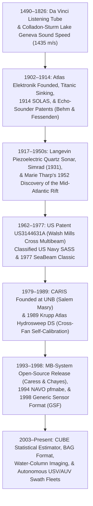
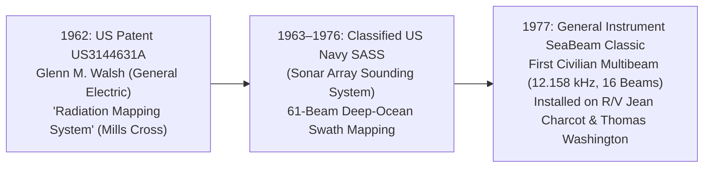

## 10.3 Historical Evolution (`gis-history` Context)

The transformation of hydrographic mapping from physical hemp lead lines into gigapixel acoustic point clouds spans more than five centuries of physical inquiry, naval warfare, mechanical engineering, and digital signal processing. Anchored to milestones documented in [`schwehr/gis-history`](https://github.com/schwehr/gis-history), the history of underwater acoustics reveals how humanitarian disasters, transoceanic telegraph cables, submarine warfare, and open-source scientific software shaped the bathymetric foundations of modern Digital Elevation Models.

---

### 10.3.1 1490–1872: From Passive Listening and Lake Geneva to Piano-Wire Soundings (`gis-history`)

#### 1490: Leonardo da Vinci's Underwater Acoustic Tube
The earliest written recognition that mechanical pressure waves propagate through water over great distances appears in the notebooks of **Leonardo da Vinci** (1490, *Manuscript B*, Institut de France):

> *"If you cause your ship to stop and place the head of a long tube in the water and place the outer extremity to your ear, you will hear ships at a great distance from you."*

Da Vinci's acoustic stethoscope exploited two fundamental physical properties of liquid water: its high bulk modulus ($K \approx 2.2 \times 10^9\text{ Pa}$), which yields a characteristic acoustic impedance $Z_w = \rho c \approx 1.5 \times 10^6\text{ Pa}\cdot\text{s}\,\text{m}^{-1}$ roughly $3{,}600\times$ greater than that of air ($Z_a \approx 415\text{ Pa}\cdot\text{s}\,\text{m}^{-1}$), and its remarkably low viscous absorption at audible frequencies.

#### 1826: Colladon and Sturm Measure the Speed of Sound in Water
Before acoustic travel time could be converted into metric water depth, physicists had to determine the propagation velocity $c = \sqrt{K / \rho}$ in natural waters. In 1826, Swiss physicist **Jean-Daniel Colladon** and French mathematician **Charles-François Sturm** conducted a landmark experiment across Lake Geneva over a surveyed horizontal baseline of $L = 13{,}487\text{ m}$ between Rolle and Thonon. One boat struck a submerged $65\text{ kg}$ church bell while simultaneously igniting a flash of gunpowder above the water; across the lake, Colladon observed the optical flash and timed the arrival of the underwater bell strike through a tin hydrophone trumpet immersed in the water. At a lake temperature of $T = 8.1^\circ\text{C}$, they measured a transit time of $9.4\text{ s}$, yielding $c = 1435\text{ m/s}$—within $0.3\%$ of the modern Chen-Millero freshwater value ($1439.2\text{ m/s}$).

#### 19th-Century Mechanical Wire Sounding
Despite Colladon and Sturm's triumph, nineteenth-century hydrography remained bound to mechanical sounding lines because electronics and microsecond chronographs did not yet exist:
* **Hemp Lead Lines and Maury's 1854 Chart:** Traditional hand leads (used to $40\text{ m}$) and deep-sea leads ($>100\text{ kg}$ iron weights lowered on hemp rope) suffered from severe catenary drag in ocean currents; sailors often could not feel the weight strike bottom as rope continued paying out under its own weight. Even so, U.S. Navy Lieutenant **Matthew Fontaine Maury** compiled roughly $200$ deep-sea hemp soundings in 1854 to publish the first *Bathymetric Map of the North Atlantic Basin*, identifying the broad "Telegraphic Plateau" suitable for laying the first transatlantic telegraph cables.
* **Lord Kelvin's Piano-Wire Machine and HMS *Challenger* (1872–1876):** Sir William Thomson (Lord Kelvin) replaced thick hemp rope with low-drag steel piano wire and detachable sinker weights (Baillie sounding rods). During the global circumnavigation of **HMS *Challenger*** (1872–1876), scientists collected $492$ deep-sea wire soundings, including the first detection of the Mariana Trench (**Challenger Deep**, sounded at $4{,}475\text{ fathoms}$ or $8{,}184\text{ m}$ on March 23, 1875). Yet each deep wire cast required stopping the ship for $3\text{ to }6\text{ hours}$ to obtain a single point measurement $(x_i, y_i, z_i)$.

---

### 10.3.2 1902–1927: Industrialization, the *Titanic*, and the First Echo Sounders (`gis-history`)

The transition from mechanical wire casting to continuous acoustic pulse-echo profiling was driven by maritime safety emergencies and anti-submarine warfare in the early twentieth century.

#### 1902: Atlas Elektronik Founded
In 1902, the *Norddeutsche Signalgesellschaft* (later **Atlas-Werke** and **Atlas Elektronik**) was founded in Bremen, Germany, to build underwater acoustic signaling bells and carbon-granule hydrophones for lightships and fog-bound shipping lanes. By proving that acoustic waves could reliably communicate range and bearing across kilometers of turbid North Sea water, Atlas established the industrial transducer engineering base that later produced both single-beam *Echolot* sounders and the *Hydrosweep* multibeam family.

#### 1912: Sinking of RMS *Titanic* and the 1914 SOLAS Convention
On the night of April 14–15, 1912, the White Star liner **RMS *Titanic*** collided with an iceberg south of the Grand Banks of Newfoundland and sank with the loss of over $1{,}500$ lives. The disaster catalyzed the first **International Convention for the Safety of Life at Sea (SOLAS)** in London in January 1914, establishing the International Ice Patrol and creating an urgent commercial and regulatory demand for active forward- and downward-looking acoustic ranging instruments.

#### 1913–1914: The First Active Echo-Sounder Patents (Behm and Fessenden)
Within months of the *Titanic* sinking, active underwater pulse-echo ranging was patented independently in Germany and the United States:
1. **Alexander Behm (German Patent DE283144C, filed July 21, 1913):** German physicist Alexander Behm invented the *Behm-Echolot*, firing a small submerged explosive cartridge on one side of the hull and measuring the round-trip travel time $\tau = 2z/c$ of the seabed reflection on the opposite side (shielded from the direct blast by the ship's keel) using a high-speed optical-photographic micro-chronograph capable of resolving $\pm 0.25\text{ m}$ in shallow water.
2. **Reginald Fessenden (US Patents US1108895A & US1217585A, 1913–1914):** Working with the Submarine Signal Company in Boston, Canadian-born physicist Reginald Fessenden invented the **Fessenden Oscillator**—a $250\text{ kg}$ moving-coil electrodynamic transducer driven by a $500\text{–}1000\text{ Hz}$ alternating current generator. On April 27, 1914, aboard the U.S. Revenue Cutter *Miami* on the Grand Banks, Fessenden detected horizontal acoustic echoes off an iceberg at $3.2\text{ km}$ range and vertical echoes from the continental shelf at $40\text{ fathoms}$ ($73\text{ m}$), performing the first continuous electromechanical echo-sounding profile in history.

#### 1917–1927: Langevin's Piezoelectric Transducer and the *Meteor* Expedition
Low-frequency moving-coil oscillators ($f \sim 1\text{ kHz}$, $\lambda \approx 1.5\text{ m}$) radiated sound almost omnidirectionally. During World War I (1917), French physicist **Paul Langevin** and Russian engineer **Constantin Chilowsky** bonded a mosaic of thin quartz crystal slices ($\text{SiO}_2$, utilizing the piezoelectric effect discovered by Jacques and Pierre Curie in 1880) between two resonant steel plates of half-wavelength thickness ($d = \lambda/2$). Operating at ultrasonic frequencies ($f \approx 38\text{–}50\text{ kHz}$, $\lambda \approx 3\text{–}4\text{ cm}$), Langevin's transducer generated a tightly collimated acoustic beam ($\theta_{\text{beam}} \approx \lambda / D$) that detected submerged U-boats and yielded sharp, vertical seafloor returns.

By 1922, the U.S. Navy destroyer **USS *Stewart*** used a Harvey HayesSonic Depth Finder to record the first continuous trans-Atlantic acoustic profile ($900$ soundings between Newport and Gibraltar). Between 1925 and 1927, the German research vessel **R/V *Meteor*** crisscrossed the South Atlantic 13 times using Behm and Atlas acoustic sounders, logging over **$67{,}400$ acoustic depth soundings**—more deep-ocean measurements in two years than humanity had collected with hemp and wire in all prior history—and revealing the rugged volcanic topography of the Mid-Atlantic Ridge.

---

### 10.3.3 1931–1977: Simrad, Precision Depth Recorders, and Marie Tharp's Tectonic Revolution (`gis-history`)

#### 1931: Simrad (Kongsberg Maritime) Founded in Norway
In 1931, Willy Simonsen founded Simonsen Radio (**Simrad**) in Oslo, Norway (later integrated into **Kongsberg Maritime**). Transitioning from marine radio telephones to magnetostrictive and lead-zirconate-titanate (PZT) piezoceramic echo sounders in the late 1940s, Simrad pioneered calibrated scientific split-beam fish finders (`EK` series) and deep-to-shallow multibeam architectures (`EM12`, `EM1000`, `EM120`, `EM302`, `EM710`, `EM2040`, `EM124`).

#### 1952–1977: Precision Depth Recorders (PDR) and Marie Tharp's Discovery of the Mid-Atlantic Rift
In 1953, Bernard Luskin and Maurice Ewing at Columbia University's Lamont Geological Observatory coupled a $12\text{ kHz}$ Edo echo sounder to a tuning-fork-synchronized facsimile drum recorder, creating the **Precision Depth Recorder (PDR)** with a timing resolution of $1\text{ ms}$ ($\sim 0.75\text{ m}$ relative depth precision). As Lamont vessels (*Vema*, *Conrad*, *Atlantis*) steamed across the world's oceans, **Marie Tharp** (beginning in 1952) painstakingly digitized, tide- and sound-speed-corrected (using Matthews' 1939 tables), and hand-drafted six trans-Atlantic profiles with a $40:1$ vertical exaggeration.

Comparing the profiles side by side, Tharp discovered a continuous, V-shaped axial rift valley ($1.5\text{–}3\text{ km}$ deep and $15\text{–}30\text{ km}$ wide) bisecting the crest of the Mid-Atlantic Ridge. When Bruce Heezen overlaid Howard Foster's catalog of oceanic earthquake epicenters onto Tharp's drafted rift axis, the seismic belt aligned almost perfectly with the unmapped segments of her rift valley—proving that the global mid-ocean ridge system is an active extensional plate boundary where new oceanic crust is created. Their 1957 *Physiographic Diagram of the North Atlantic* and 1977 *World Ocean Floor* panorama (painted by Austrian landscape artist Heinrich Berann) demonstrated that high-resolution bathymetric DEMs are foundational to solid-Earth geophysics.

---

### 10.3.4 1962–1977: The Invention of Multibeam Swath Mapping (`gis-history`)

While PDR single-beam sounders achieved sub-meter vertical precision directly along the ship's track, their wide $30^\circ\text{–}60^\circ$ conical beams blurred steep slopes into overlapping hyperbolic diffraction arcs and left $99\%$ of the seafloor between ship tracks unmapped.

#### 1962: US Patent US3144631A (Glenn M. Walsh and the Mills Cross Architecture)
On May 7, 1962, engineer **Glenn M. Walsh** (General Electric Company) filed **US Patent US3144631A** (*"Radiation Mapping System"*, granted August 18, 1964). Adapting Australian radio astronomer Bernard Mills's 1953 orthogonal cross-antenna concept ("Mills Cross") to underwater acoustics, Walsh formulated the complete architecture of the modern **Multibeam Echosounder (MBES)**:
1. **Along-Track Transmit Array:** A linear projector array mounted parallel to the ship's keel transmits a fan-shaped acoustic pulse that is narrow along-track ($\Delta\theta_{\text{tx}} \approx 1^\circ\text{–}2.7^\circ$) and wide across-track ($\ge 45^\circ\text{–}150^\circ$).
2. **Across-Track Receive Array:** An orthogonal hydrophone stave array mounted athwartships applies delay-and-sum or phase-shift beamforming across $N_b$ steering angles $\theta_m$ to synthesize $N_b$ independent receive fan beams that are narrow across-track ($\Delta\theta_{\text{rx}} \approx 1^\circ\text{–}2.7^\circ$) and wide along-track.
3. **Two-Way Product Beam Pattern:** Because the two-way directional sensitivity $D_{\text{2-way}}(\theta_{\text{along}}, \theta_{\text{across}}) = D_{\text{tx}}(\theta_{\text{along}}, \theta_{\text{across}}) \cdot D_{\text{rx}}(\theta_{\text{along}}, \theta_{\text{across}})$ is the product of two orthogonal fans, each receive channel isolates a compact $\Delta\theta_{\text{tx}} \times \Delta\theta_{\text{rx}}$ pencil footprint on the seafloor without requiring a prohibitively heavy 2D planar array of $N_{\text{along}} \times N_{\text{across}}$ elements!

Under Walsh's patent and contracts with General Instrument Corporation (Harris ASW), the U.S. Navy deployed the classified **Sonar Array Sounding System (SASS)** in 1963 aboard USNS *Compass Island*, *Bowditch*, *Dutton*, and *Michelson*, mapping $61$-beam deep-ocean swaths for submarine inertial-gravity navigation and SOSUS hydrophone placement.

#### 1977: SeaBeam Classic—The First Civilian Deep-Sea Multibeam
In 1977, General Instrument declassified a 16-beam derivative of SASS as the **SeaBeam Classic** ($12.158\text{ kHz}$, sixteen $2.67^\circ \times 2.67^\circ$ beams spanning a $42.7^\circ$ swath, or $W \approx 0.78\,z$). Installed first aboard CNEXO's French research vessel **N/O *Jean Charcot*** in 1977 (Renard & Allenou, 1979) and Scripps Institution of Oceanography's **R/V *Thomas Washington*** in 1978, SeaBeam revolutionized marine geology—revealing overlapping spreading centers, abyssal hill fault fabric, and submarine canyon meanders as continuous 2D contour maps in real time.

---

### 10.3.5 1979–1989: Digital Hydrographic Processing and Second-Generation Swath Sonars (`gis-history`)

#### 1979: CARIS Founded at the University of New Brunswick (UNB)
To process the digital flood of multibeam and automated launch data, **Dr. Salem Masry** of the Department of Surveying Engineering at the University of New Brunswick (UNB) founded **Universal Systems Ltd. (CARIS)** in Fredericton, Canada, in 1979. In partnership with the Canadian Hydrographic Service (CHS) and the UNB Ocean Mapping Group (Larry Mayer, David Wells, John Hughes Clarke), CARIS developed **HIPS (Hydrographic Information Processing System)**, pioneering interactive 3D swath editing, attitude/tide time-series integration, and digital S-57 Electronic Navigational Chart (ENC) compilation.

#### 1989: Krupp Atlas Hydrosweep DS and Cross-Fan Sound Speed Self-Calibration
In 1989, Krupp Atlas Elektronik introduced the second-generation **Hydrosweep DS** ($15.5\text{ kHz}$, $59$ beams), expanding swath coverage to $90^\circ$ ($W = 2.0\,z$) aboard the German icebreaker R/V *Polarstern* and Lamont-Doherty's R/V *Maurice Ewing*. Because extending the maximum beam angle from $21^\circ$ (SeaBeam) to $45^\circ$ (Hydrosweep) multiplied outer-beam refraction errors $\left(\propto \tan^2\theta\right)$ by more than $5\times$, Krupp Atlas engineered an active **cross-fan calibration mode** (Grant & Schreiber, 1990): by alternating pings between standard across-track transmission and an orthogonal along-track multibeam fan, Hydrosweep compared the vertical depth $z_{\text{nadir}}$ measured at nadir with the oblique slant ranges measured seconds later over the exact same seafloor points, inverting Snell's law in real time to estimate the effective mean water-column sound velocity $\overline{c}$ without stopping the ship for a CTD cast.

---

### 10.3.6 1993–Present: Open-Source Software, Standard Formats, and Autonomous Swath Fleets (`gis-history`)

#### 1993: MB-System First Commit (David Caress and Dale Chayes)
By the early 1990s, oceanographic institutions operated an incompatible patchwork of SeaBeam, Hydrosweep, Simrad, and Hollming sonars, each with undocumented binary tape formats and severe outer-beam artifacts. In 1993, **David W. Caress** and **Dale N. Chayes** at Lamont-Doherty Earth Observatory released **MB-System** (Caress & Chayes, 1996) as free, open-source software. Built around the modular `mbio` C library and coupled directly to Wessel and Smith's **Generic Mapping Tools (GMT, 1988)**, MB-System empowered researchers worldwide to inspect, re-raytrace, de-spike (`mbedit`, `mbclean`), and grid multibeam bathymetry and side-scan backscatter into publication-grade DEMs.

#### 1994: NAVO `pfmabe` (Pure File Magic Area-Based Editor)
In 1994, engineers at the U.S. Naval Oceanographic Office (NAVO) and SAIC developed **`pfmabe`**, introducing the **Pure File Magic (PFM)** 3D spatial indexing database. Prior to `pfmabe`, hydrographers cleaned multibeam data sequentially along individual survey lines ("line-based editing"), making it nearly impossible to spot subtle $20\text{ cm}$ datum or refraction mismatches between adjacent lines. `pfmabe` loaded tens of millions of soundings from all overlapping lines and cross-lines into a single geographic bounding box ("area-based editing"), enabling simultaneous 3D multi-swath outlier rejection.

#### 1998–Present: GSF (1998), CUBE (2003), BAG (2006), and Autonomous Mapping
* **1998 Generic Sensor Format (GSF):** Developed by SAIC for the U.S. Navy, GSF standardized an extensible, open-source C library and binary stream format that stores raw travel times, beam angles, ray-traced coordinates, split-aperture phase detection quality flags, and per-beam Total Propagated Uncertainty (TPU) attributes across all sonar manufacturers.
* **2003 CUBE & 2006 BAG:** In 2003, **Brian Calder** and **Larry Mayer** at UNH CCOM introduced the **Combined Uncertainty and Bathymetric Estimator (CUBE)**, replacing manual point editing with a Bayesian Kalman filter that weights every sounding by its horizontal and vertical TPU to estimate nodal depth and uncertainty surfaces—standardized in 2006 as the HDF5-based **Bathymetric Attributed Grid (BAG)** and today's **IHO S-102** Bathymetric Surface Product Specification.

---

### 10.3.7 Chronological Summary of Underwater Acoustic Milestones

| Year | Milestone & Event | Domain & Entity | Key Innovation & DEM Impact |
| :--- | :--- | :--- | :--- |
| **1490** | Da Vinci Acoustic Listening Tube | Physics / Naval | First recorded recognition that water transmits mechanical sound waves over long distances. |
| **1826** | Colladon & Sturm Lake Geneva Test | Physics (Switzerland) | First accurate measurement of underwater sound speed ($1435\text{ m/s}$ at $8.1^\circ\text{C}$ over a $13.5\text{ km}$ baseline). |
| **1854** | Maury's North Atlantic Chart | US Navy Hydrography | First basin-scale bathymetric contour map compiled from $\sim 200$ deep-sea hemp soundings. |
| **1875** | HMS *Challenger* Sounds Mariana Trench | Royal Navy / Science | Piano-wire sounding machine measures $8{,}184\text{ m}$ at Challenger Deep. |
| **1902** | Atlas Elektronik Founded | Industry (Germany) | Commercialization of underwater electroacoustic transducers and submarine signaling devices. |
| **1912** | RMS *Titanic* Sinking & 1914 SOLAS | Safety of Navigation | Catalyzed international mandates and research into active acoustic hazard and depth ranging. |
| **1913** | Behm & Fessenden Echo Sounders | Patents (DE / US) | First active pulse-echo travel-time instruments (*Behm-Echolot* & $540\text{ Hz}$ Fessenden Oscillator). |
| **1917** | Langevin Piezoelectric Quartz Sonar | Military / Acoustics | Resonant steel-quartz-steel ultrasonic transducer ($38\text{–}50\text{ kHz}$), enabling narrow directional beams. |
| **1925** | German *Meteor* South Atlantic Survey | Oceanography | First ocean-basin acoustic survey ($67{,}400$ soundings), proving ruggedness of the Mid-Atlantic Ridge. |
| **1931** | Simrad (Kongsberg) Founded | Industry (Norway) | PZT ceramics, split-beam scientific echosounders, and the modern Kongsberg `EM` multibeam series. |
| **1952** | Marie Tharp Discovers Mid-Atlantic Rift | Lamont / Geophysics | Synthesis of PDR single-beam profiles reveals the axial rift valley, proving seafloor spreading. |
| **1962** | US Patent US3144631A (Glenn Walsh) | Defense / General Electric | Invention of the orthogonal Mills Cross multibeam swath sonar architecture (classified US Navy SASS). |
| **1977** | General Instrument SeaBeam Classic | Academic / Oceanography | First civilian deep-sea multibeam ($12.158\text{ kHz}$, 16 beams, $42.7^\circ$ swath) on *Jean Charcot* & *Thomas Washington*. |
| **1979** | CARIS Founded at UNB (Salem Masry) | Software / Hydrography | First commercial digital hydrographic processing and electronic charting suite (`CARIS HIPS`). |
| **1989** | Krupp Atlas Hydrosweep DS | Industry / Geophysics | Second-generation $90^\circ$ swath multibeam ($59$ beams) with real-time cross-fan SVP self-calibration. |
| **1993** | MB-System First Release | Open-Source / LDEO & MBARI | Caress & Chayes release open-source C/GMT software (`mbio`, `mbprocess`, `mbedit`, `mbgrid`) for swath mapping. |
| **1994** | NAVO `pfmabe` Area-Based Editor | Defense / US Navy | Pure File Magic (PFM) 3D spatial database enabling multi-line area-based sounding cleaning. |
| **1998** | Generic Sensor Format (GSF) | Standardization / SAIC | Open vendor-neutral binary stream storing multibeam soundings, ray-tracing metadata, and per-beam TPU. |
| **2003** | CUBE & Open Navigation Surface BAG | UNH CCOM / NOAA / IHO | Calder & Mayer Bayesian uncertainty-weighted gridding and dual-band (elevation + uncertainty) HDF5 BAG format. |
