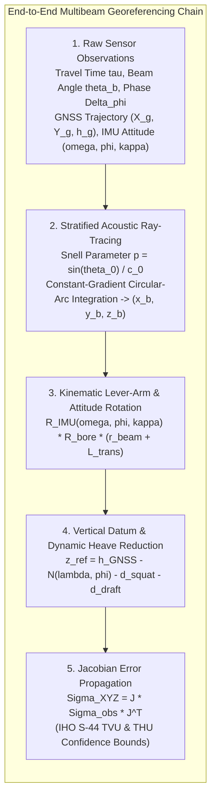
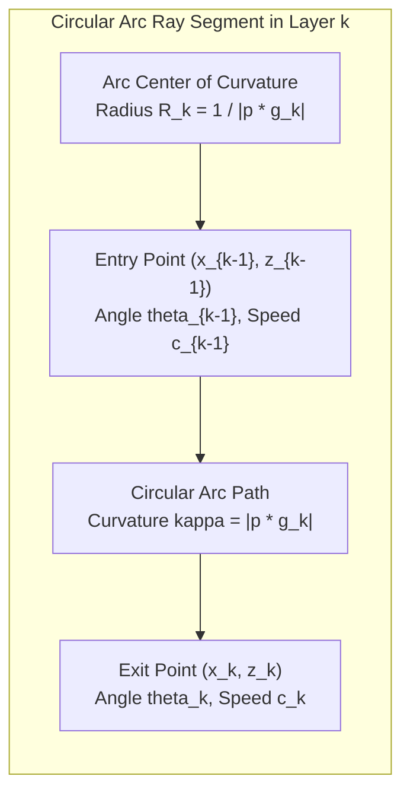
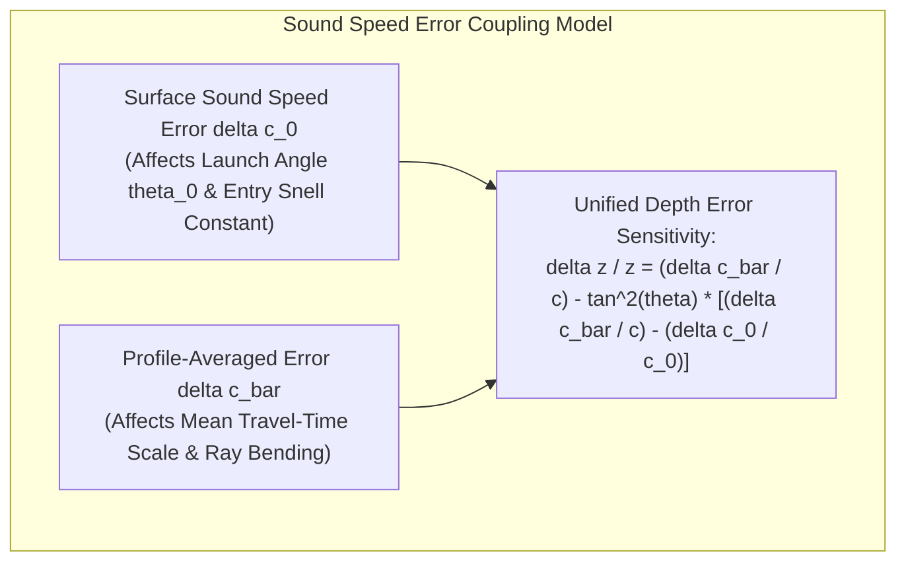
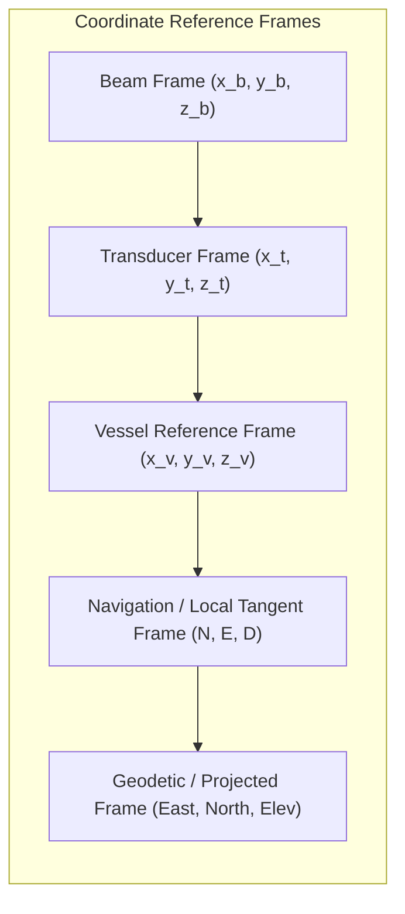

## 10.4 Mathematical Foundations

The transformation of raw multibeam observations—acoustic travel times, electrical phase differences, and beam steering angles—into three-dimensional geodetic coordinates $(E, N, Z)$ requires a mathematically rigorous chain of ray tracing, coordinate frame transformations, and uncertainty propagation. This section derives the exact closed-form equations for circular-arc acoustic ray tracing, outer-beam refraction sensitivity, the complete 3D direct georeferencing matrix model, and the Total Propagated Uncertainty (TPU) covariance framework.



---

### 10.4.1 Constant-Gradient Layered Acoustic Ray Tracing

Consider an ocean water column stratified into $M$ horizontal layers bounded by depths $z_0 < z_1 < \dots < z_M$, where $z$ is depth positive downward. Let $c_k = c(z_k)$ denote the sound speed at the boundary interfaces. Within any layer $k \in \{1, \dots, M\}$ bounded by $[z_{k-1}, z_k]$, the vertical sound speed profile is modeled as a linear function of depth:

$$c(z) = c_{k-1} + g_k (z - z_{k-1}) \quad \text{for } z \in [z_{k-1}, z_k]$$

where $g_k$ is the vertical sound velocity gradient ($\text{s}^{-1}$):

$$g_k = \frac{dc}{dz} = \frac{c_k - c_{k-1}}{z_k - z_{k-1}}$$

#### Proof that Ray Paths Are Exact Circular Arcs
By Snell's Law in a horizontally stratified medium, the ray parameter $p$ is invariant along the entire trajectory:

$$p = \frac{\sin\theta(z)}{c(z)} = \text{constant}$$

where $\theta(z)$ is the local ray angle relative to the downward vertical. Differentiating Snell's law with respect to the ray path arc length $s$ yields:

$$\frac{d}{ds}\left(\frac{\sin\theta}{c}\right) = 0 \implies \frac{\cos\theta}{c} \frac{d\theta}{ds} - \frac{\sin\theta}{c^2} \frac{dc}{ds} = 0$$

Because $ds = dz / \cos\theta$ and $dc / ds = (dc/dz)(dz/ds) = g_k \cos\theta$, we substitute:

$$\frac{\cos\theta}{c} \frac{d\theta}{ds} - \frac{\sin\theta}{c^2} (g_k \cos\theta) = 0 \implies \frac{d\theta}{ds} = \frac{g_k \sin\theta}{c} = g_k p$$

The curvature of the ray trajectory $\kappa$ is defined as the rate of change of ray angle with respect to arc length:

$$\kappa = \left|\frac{d\theta}{ds}\right| = |p \, g_k| = \text{constant}$$

In differential geometry, a planar curve with constant, non-zero curvature is an **exact circle**. Therefore, within any layer of constant sound speed gradient $g_k \neq 0$, the acoustic ray path is a circular arc of radius $R_k$:

$$R_k = \frac{1}{|p \, g_k|} = \frac{c(z)}{|g_k| \sin\theta(z)}$$



#### Analytical Derivation of Across-Track Displacement ($\Delta x_k$)
The horizontal across-track displacement $\Delta x_k = x_k - x_{k-1}$ accumulated as the ray traverses layer $k$ is given by the integral:

$$\Delta x_k = \int_{z_{k-1}}^{z_k} \tan\theta(z) \, dz$$

Using the substitution $c = c(z)$, we have $dz = dc / g_k$. By Snell's law, $\sin\theta = p c$, which implies $\cos\theta = \sqrt{1 - p^2 c^2}$. Therefore:

$$\tan\theta = \frac{\sin\theta}{\cos\theta} = \frac{p c}{\sqrt{1 - p^2 c^2}}$$

Substituting into the integral:

$$\Delta x_k = \int_{c_{k-1}}^{c_k} \frac{p c}{\sqrt{1 - p^2 c^2}} \frac{dc}{g_k} = \frac{1}{g_k} \int_{c_{k-1}}^{c_k} \frac{p c}{\sqrt{1 - p^2 c^2}} \, dc$$

Let $u = 1 - p^2 c^2$, so $du = -2 p^2 c \, dc$, or $p c \, dc = -du / (2p)$:

$$\Delta x_k = \frac{1}{g_k} \int_{u_{k-1}}^{u_k} \frac{-du}{2p \sqrt{u}} = -\frac{1}{p g_k} \left[\sqrt{u}\right]_{u_{k-1}}^{u_k} = -\frac{1}{p g_k} \left[\sqrt{1 - p^2 c^2}\right]_{c_{k-1}}^{c_k}$$

Recognizing that $\sqrt{1 - p^2 c_k^2} = \cos\theta_k$ and $\sqrt{1 - p^2 c_{k-1}^2} = \cos\theta_{k-1}$, we obtain the closed-form analytical expression:

$$\Delta x_k = \frac{\cos\theta_{k-1} - \cos\theta_k}{p \, g_k}$$

#### Analytical Derivation of One-Way Travel Time ($\Delta t_k$)
The one-way acoustic transit time $\Delta t_k$ across layer $k$ is given by:

$$\Delta t_k = \int_{z_{k-1}}^{z_k} \frac{ds}{c(z)} = \int_{z_{k-1}}^{z_k} \frac{dz}{c(z) \cos\theta(z)}$$

Substituting $dz = dc / g_k$ (preserving the algebraic sign of $g_k$) and $\cos\theta = \sqrt{1 - p^2 c^2}$:

$$\Delta t_k = \frac{1}{g_k} \int_{c_{k-1}}^{c_k} \frac{dc}{c \sqrt{1 - p^2 c^2}}$$

Using the standard integral identity $\int \frac{dx}{x \sqrt{1 - a^2 x^2}} = -\ln\left(\frac{1 + \sqrt{1 - a^2 x^2}}{a x}\right) = \ln\left(\frac{a x}{1 + \sqrt{1 - a^2 x^2}}\right)$:

$$\Delta t_k = \frac{1}{g_k} \left[ -\ln\left(\frac{1 + \cos\theta}{p c}\right) \right]_{c_{k-1}}^{c_k} = \frac{1}{g_k} \ln\left(\frac{c_k}{c_{k-1}} \frac{1 + \cos\theta_{k-1}}{1 + \cos\theta_k}\right)$$

Using the half-angle trigonometric identity $\frac{\sin\theta}{1 + \cos\theta} = \tan(\theta/2)$ (where $\sin\theta_k / \sin\theta_{k-1} = c_k / c_{k-1}$ by Snell's law), this simplifies to the classical formulation implemented in `MB-System` and operational hydrographic ray tracers:

$$\Delta t_k = \frac{1}{g_k} \ln\left(\frac{\tan(\theta_k / 2)}{\tan(\theta_{k-1} / 2)}\right)$$

> [!CAUTION]
> **Sign Convention Pitfall ($1/g_k$ vs. $1/|g_k|$) in Negative-Gradient Thermoclines**
> The prefactor in $\Delta t_k$ must be the **signed** reciprocal $\frac{1}{g_k}$, never $\frac{1}{|g_k|}$. In a negative-gradient thermocline ($g_k < 0$, so $c_k < c_{k-1}$), Snell's law refracts the downward-propagating ray toward the nadir normal ($\theta_k < \theta_{k-1}$), making $\ln\!\left(\frac{\tan(\theta_k/2)}{\tan(\theta_{k-1}/2)}\right) < 0$. Dividing by the signed gradient $g_k < 0$ yields a strictly positive travel time $\Delta t_k > 0$. Replacing $g_k$ with $|g_k|$ in software causes thermocline layers to subtract travel time, producing the unphysical result that oblique rays arrive faster than the vertical nadir ray!

#### Degenerate Cases: Nadir Ray ($p = 0$) and Iso-Velocity Layer ($g_k = 0$)
1. **Nadir Vertical Ray ($p \to 0$, $\theta_{k-1}, \theta_k \to 0$):** As $\theta_0 \to 0$, the half-angle tangent ratio approaches $\frac{\tan(\theta_k/2)}{\tan(\theta_{k-1}/2)} \to \frac{\sin\theta_k}{\sin\theta_{k-1}} = \frac{c_k}{c_{k-1}}$. Taking the continuous limit avoids a $0/0$ division by zero at nadir:
   $$\Delta x_k = 0, \qquad \Delta t_k = \int_{z_{k-1}}^{z_k} \frac{dz}{c_{k-1} + g_k(z - z_{k-1})} = \frac{1}{g_k} \ln\left(\frac{c_k}{c_{k-1}}\right)$$
2. **Iso-Velocity Layer ($g_k \to 0$, $c_k = c_{k-1} = c_0$):** Ray curvature vanishes ($\kappa = 0$), and L'Hôpital's rule reduces the circular arc to a straight line at constant angle $\theta_{k-1}$:
   $$\Delta x_k = \Delta z_k \tan\theta_{k-1}, \qquad \Delta t_k = \frac{\Delta z_k}{c_{k-1} \cos\theta_{k-1}}$$

---

### 10.4.2 Mathematical Derivation of Outer-Beam Refraction Error Sensitivity

Outer-beam sounding errors are governed by the interplay between the depth-averaged sound speed error in the water column $\overline{\delta c}$ and the surface sound speed error $\delta c_0$ at the transducer face (Hare et al., 1995; Lurton, 2010).



#### Perturbation of the Vertical Depth Equation
Consider the vertical depth $z$ computed from two-way travel time $\tau$, depth-averaged sound speed $\overline{c}$, and effective ray angle $\theta$:

$$z = \frac{1}{2} \overline{c} \, \tau \cos\theta$$

Taking the total differential at a fixed measured two-way travel time ($\delta\tau = 0$) and dividing by $z$:

$$\delta z = \left(\frac{1}{2} \tau \cos\theta\right) \delta\overline{c} - \left(\frac{1}{2} \overline{c} \, \tau \sin\theta\right) \delta\theta \implies \frac{\delta z}{z} = \frac{\delta\overline{c}}{\overline{c}} - \tan\theta \, \delta\theta$$

#### Form 1: Two-Parameter Surface vs. Profile Sensitivity (Mechanically Aimed Arrays & General SVP Errors)
When a ray is traced from a fixed launch angle $\theta_0$ at the transducer (such as a mechanically curved/barrel array or broadside-steered sector) into a water column with surface sound speed $c_0$ and profile-averaged sound speed $\overline{c}$, Snell's law gives $\sin\theta = \frac{\overline{c}}{c_0} \sin\theta_0$. Taking the logarithmic differential with $\delta\theta_0 = 0$ yields the ray-angle error:

$$\cot\theta \, \delta\theta = \frac{\delta\overline{c}}{\overline{c}} - \frac{\delta c_0}{c_0} \implies \delta\theta = \tan\theta \left(\frac{\delta\overline{c}}{\overline{c}} - \frac{\delta c_0}{c_0}\right)$$

Substituting $\delta\theta$ into the relative depth error equation yields the **two-parameter multibeam refraction sensitivity equation**:

$$\frac{\delta z}{z} \approx \frac{\delta\overline{c}}{\overline{c}} - \tan^2\theta \left(\frac{\delta\overline{c}}{\overline{c}} - \frac{\delta c_0}{c_0}\right)$$

#### Form 2: Electronically Steered Flat Phased Arrays & Continuous Linear Gradients
For a flat phased array tilted at mechanical angle $\beta$ from the horizontal (with $\beta = 0$ for a flush hull mount), beams are steered electronically by applying time/phase delays across stave elements spaced by $d$:

$$\sin(\theta_0 - \beta) = \frac{c_0 \, \Delta\phi}{2\pi f d} \implies \delta\theta_0 = \tan(\theta_0 - \beta) \frac{\delta c_0}{c_0}$$

For a horizontal flat array ($\beta = 0$), the steering angle error $\delta\theta_0 = \tan\theta_0 \frac{\delta c_0}{c_0}$ exactly cancels the $-\tan\theta \frac{\delta c_0}{c_0}$ surface entry term in Snell's law ($\frac{\sin\theta_0}{c_0} = \frac{\Delta\phi}{2\pi f d}$ is fixed by the hardware time delay!). Furthermore, when a water-column error arises from an unmodeled linear sound speed gradient $\delta g$ so that $\delta c(z) = \delta g \cdot z$ (with bottom speed error $\Delta c_{\text{bot}} = \delta g \cdot z$ and depth-mean error $\delta\overline{c} = \frac{1}{2}\Delta c_{\text{bot}}$), integrating the circular-arc ray curvature over $[0, z]$ yields a chord angle error equal to half the terminal ray angle error ($\delta\theta_{\text{chord}} = \frac{1}{2}\tan\theta \frac{\Delta c_{\text{bot}}}{c} = \tan\theta \frac{\delta\overline{c}}{c}$). Expressing the sensitivity in terms of the layer speed perturbation $\overline{\delta c}$ (defined as $\Delta c_{\text{bot}}$ in Lurton, 2010) gives:

$$\frac{\delta z}{z} \approx \left(1 - \frac{1}{2}\tan^2\theta\right)\frac{\overline{\delta c}}{c}$$

#### Case Analysis of the Sensitivity Formulas
1. **Case 1: Accurate Surface Sensor, Stale Water-Column Profile ($\delta c_0 = 0, \; \delta\overline{c} \neq 0$):**
   $$\frac{\delta z}{z} = \frac{\delta\overline{c}}{\overline{c}} (1 - \tan^2\theta)$$
   * At nadir ($\theta = 0^\circ$): $\delta z / z = +\delta\overline{c} / \overline{c}$ (pure vertical range-scale error).
   * At $\theta = 45^\circ$: $\tan(45^\circ) = 1 \implies \delta z / z = 0$ (the inflection node where scale error and refraction error cancel).
   * At $\theta = 65^\circ$: $\tan^2(65^\circ) \approx 4.60 \implies 1 - \tan^2(65^\circ) \approx -3.60$. At $\theta = 70^\circ$: $\tan^2(70^\circ) \approx 7.55 \implies 1 - \tan^2(70^\circ) \approx -6.55$. The error reverses sign and magnifies by $360\%\text{–}655\%$ at the swath edges, curling the outer beams into a symmetric **"smile"** or **"frown."**
2. **Case 2: Uniform Profiler Bias ($\delta c_0 = \delta\overline{c}$):**
   If an uncalibrated CTD introduces a uniform $+5\text{ m/s}$ bias across both the surface and the entire depth profile, the bracketed difference vanishes ($(\delta\overline{c}/\overline{c}) - (\delta c_0/c_0) = 0$):
   $$\frac{\delta z}{z} = \frac{\delta\overline{c}}{\overline{c}} = \text{constant}$$
   The swath does not bend into a smile or frown; it undergoes a uniform scale shift ($\delta z / z = +0.33\%$), which is invisible to visual swath-flatness inspection and can only be caught by bar checks, lead-line/smart-ball checks, or Ellipsoidally Referenced Surveying (ERS) cross-validation.
3. **Case 3: Tilted Dual-Head Arrays ($\beta \neq 0$):**
   When dual multibeam heads are mounted in a V-configuration ($\beta = \pm 30^\circ\text{ to }40^\circ$), a surface sound speed error $\delta c_0$ produces an asymmetric steering error $\delta\theta_0 = \tan(\theta_0 - \beta)\frac{\delta c_0}{c_0}$ that tilts each swath like a gull wing ("seagull" artifact) even at nadir!

---

### 10.4.3 Complete 3D Direct Georeferencing Kinematic Model

Georeferencing converts an acoustic sounding measured at slant range $R_b$ and beam angle $\theta_b$ into an Earth-Centered, Earth-Fixed (ECEF) or projected map coordinate $(E, N, Z)$ relative to a recognized horizontal and vertical geodetic datum.



#### Coordinate Frame Definitions
1. **Beam Frame ($b$):** The acoustic vector formed by ray tracing through the sound speed profile:
   $$\mathbf{r}_b = \begin{bmatrix} 0 \\ \Delta x_{\text{across}} \\ \Delta z_{\text{vertical}} \end{bmatrix}_b$$
2. **Transducer Frame ($t$):** Centered at the acoustic transmission center. Misalignments between the transducer and the motion sensor are defined by the boresight rotation matrix $\mathbf{R}_t^v = \mathbf{R}_x(\Delta\omega) \mathbf{R}_y(\Delta\phi) \mathbf{R}_z(\Delta\kappa)$.
3. **Vessel Reference Frame ($v$):** Origin at the vessel Center of Motion (or Granite Block / Reference Point $RP$). $+x_v$ points forward (bow), $+y_v$ points starboard, and $+z_v$ points downward through the keel.
4. **Local Tangent Navigation Frame ($n$):** North-East-Down (NED) geodetic horizon.
5. **Mapping / Geodetic Datum Frame ($m$):** WGS84 / ITRF Cartesian coordinates transformed to a projected CRS (e.g., UTM or State Plane) with orthometric elevation $Z$ referenced to a vertical datum (e.g., NAVD88, LAT, or MLLW).

#### The Master Kinematic Transformation Equation
The vector position of the seafloor sounding $\mathbf{P}_{\text{sounding}}^n$ in the local navigation frame is:

$$\mathbf{P}_{\text{sounding}}^n = \mathbf{P}_{\text{GNSS}}^n(t) + \mathbf{R}_v^n(t) \left[ \mathbf{L}_{\text{trans}}^v - \mathbf{L}_{\text{GNSS}}^v + \mathbf{R}_t^v \, \mathbf{r}_b(t) \right] + \mathbf{\Delta}_{\text{dynamic}}(t)$$

where:
* $\mathbf{P}_{\text{GNSS}}^n(t) = [N_{\text{ant}}, E_{\text{ant}}, h_{\text{ant}}]^T$ is the kinematic GNSS antenna position at ping transmit epoch $t$.
* $\mathbf{L}_{\text{GNSS}}^v$ is the rigid lever-arm offset vector from the vessel Reference Point to the GNSS antenna phase center in the vessel frame.
* $\mathbf{L}_{\text{trans}}^v$ is the rigid lever-arm offset vector from the Reference Point to the transducer acoustic center.
* $\mathbf{R}_t^v$ is the static boresight rotation matrix accounting for mechanical installation misalignment angles (roll $\Delta\omega$, pitch $\Delta\phi$, yaw $\Delta\kappa$):
  $$\mathbf{R}_t^v = \mathbf{R}_z(\Delta\kappa) \, \mathbf{R}_y(\Delta\phi) \, \mathbf{R}_x(\Delta\omega)$$
* $\mathbf{R}_v^n(t)$ is the instantaneous dynamic attitude rotation matrix from vessel frame to navigation frame, parameterized by IMU roll $\omega(t)$, pitch $\phi(t)$, and heading $\psi(t)$:
  $$\mathbf{R}_v^n(t) = \begin{bmatrix} 
  \cos\psi\cos\phi & \cos\psi\sin\phi\sin\omega - \sin\psi\cos\omega & \cos\psi\sin\phi\cos\omega + \sin\psi\sin\omega \\
  \sin\psi\cos\phi & \sin\psi\sin\phi\sin\omega + \cos\psi\cos\omega & \sin\psi\sin\phi\cos\omega - \cos\psi\sin\omega \\
  -\sin\phi & \cos\phi\sin\omega & \cos\phi\cos\omega
  \end{bmatrix}$$
* $\mathbf{\Delta}_{\text{dynamic}}(t) = [0, 0, d_{\text{draft}}(t) + d_{\text{squat}}(v) + h_{\text{heave}}(t)]^T$ accounts for slow fuel consumption vessel draft changes, speed-dependent hydrodynamic vessel settlement/squat $d_{\text{squat}}(v)$, and wave-induced heave $h_{\text{heave}}(t)$ (when operating in non-ellipsoid-referenced mode).

#### Ellipsoid-Referenced Surveying (ERS) Mode
In modern high-precision surveys adhering to NOAA HSSD, bathymetry is processed in **Ellipsoid-Referenced Surveying (ERS)** mode using post-processed kinematic (PPK) GNSS trajectories. In ERS mode, the instantaneous ellipsoidal height of the antenna $h_{\text{GNSS}}(t)$ is derived directly from dual-frequency carrier-phase GNSS. 

The orthometric or chart depth $Z_{\text{chart}}$ is computed directly without requiring a separate wave-heave filter or physical tide gauge:

$$Z_{\text{chart}} = h_{\text{GNSS}}(t) - N_{\text{geoid}}(\phi, \lambda) - \text{SEP}_{\text{datum}}(\phi, \lambda) - z_{\text{sounding}}(t)$$

where $N_{\text{geoid}}$ is the local geoid-ellipsoid separation (e.g., GEOID18) and $\text{SEP}_{\text{datum}}$ is the sea-surface-to-chart-datum separation model (e.g., NOAA VDatum or UKHO VORF).

---

### 10.4.4 Total Propagated Uncertainty (TPU) Covariance Framework

Under the ISO/IEC Guide 98-3 (GUM) and IHO S-44 standards, every bathymetric point in a hydrographic DEM must carry an explicit estimate of its Total Horizontal Uncertainty ($\text{THU}$) and Total Vertical Uncertainty ($\text{TVU}$) at the $95\%$ confidence level.

Let $\mathbf{Y} = [E, N, Z]^T = \mathbf{f}(\mathbf{X})$ denote the 3D geodetic position of a sounding as a non-linear vector function of the observation parameters:

$$\mathbf{X} = \left[ X_{\text{GNSS}}, Y_{\text{GNSS}}, Z_{\text{GNSS}}, \omega, \phi, \psi, \tau, \theta_b, c_0, \overline{c}, \Delta\omega, \Delta\phi, \Delta\kappa, L_x, L_y, L_z \right]^T$$

Under first-order Gauss-Helmert error propagation, the posterior $3 \times 3$ coordinate covariance matrix $\boldsymbol{\Sigma}_{XYZ}$ is given by:

$$\boldsymbol{\Sigma}_{XYZ} = \mathbf{J} \, \boldsymbol{\Sigma}_{\mathbf{X}} \, \mathbf{J}^T$$

where $\boldsymbol{\Sigma}_{\mathbf{X}}$ is the block-diagonal covariance matrix of the measurement errors and $\mathbf{J}$ is the $3 \times 16$ Jacobian matrix of partial derivatives:

$$\mathbf{J} = \frac{\partial \mathbf{f}}{\partial \mathbf{X}} = \begin{bmatrix} 
\frac{\partial E}{\partial X_1} & \frac{\partial E}{\partial X_2} & \cdots & \frac{\partial E}{\partial X_{16}} \\
\frac{\partial N}{\partial X_1} & \frac{\partial N}{\partial X_2} & \cdots & \frac{\partial N}{\partial X_{16}} \\
\frac{\partial Z}{\partial X_1} & \frac{\partial Z}{\partial X_2} & \cdots & \frac{\partial Z}{\partial X_{16}}
\end{bmatrix}$$

#### Analytical Components of Total Vertical Uncertainty (TVU)
Expanding the vertical variance $\sigma_Z^2 = (\boldsymbol{\Sigma}_{XYZ})_{33}$ isolates the individual contributing physical error terms:

$$\sigma_Z^2 = \sigma_{\text{GNSS},z}^2 + \sigma_{\text{heave}}^2 + \sigma_{\text{tide}}^2 + \underbrace{\left(R \sin\theta \cos\phi\right)^2 \sigma_{\omega}^2}_{\text{Roll Gyro Error}} + \underbrace{\left(R \cos\theta \sin\phi\right)^2 \sigma_{\phi}^2}_{\text{Pitch Gyro Error}} + \underbrace{\left(\frac{1}{2} c \cos\theta\right)^2 \sigma_{\tau}^2}_{\text{Timing Detection Noise}} + \underbrace{\left(z \tan^2\theta\right)^2 \left(\frac{\sigma_{\Delta c}}{c}\right)^2}_{\text{Refraction Uncertainty}}$$

The $95\%$ confidence Total Vertical Uncertainty is computed as:

$$\text{TVU}_{95\%} = 1.96 \, \sigma_Z$$

Notice how the roll gyro uncertainty $\sigma_\omega^2$ and the refraction uncertainty $(\sigma_{\Delta c}/c)^2$ scale directly with the square of across-track distance $X^2 = (R\sin\theta)^2$ and $z^2 \tan^4\theta$, proving mathematically why outer-beam soundings dominate the survey error budget.

---

### 10.4.5 Worked Numerical Examples and Self-Contained Verification Script

**Problem:**
1. **Constant-Gradient Circular-Arc Ray Tracing:** A hull-mounted multibeam transducer at draft $z_0 = 5.0\text{ m}$ ($c_0 = 1525.0\text{ m/s}$) sounds a $500.0\text{ m}$ deep ocean basin through three stratified layers:
   * Layer 1 (Surface Mixed Layer, $5.0\text{–}50.0\text{ m}$): $c$ increases from $1525.0\text{ m/s}$ to $1528.0\text{ m/s}$ ($g_1 = +0.0667\text{ s}^{-1}$).
   * Layer 2 (Seasonal Thermocline, $50.0\text{–}150.0\text{ m}$): $c$ drops from $1528.0\text{ m/s}$ to $1490.0\text{ m/s}$ ($g_2 = -0.3800\text{ s}^{-1}$).
   * Layer 3 (Deep Isothermal Water, $150.0\text{–}500.0\text{ m}$): $c$ increases via hydrostatic pressure from $1490.0\text{ m/s}$ to $1496.0\text{ m/s}$ ($g_3 = +0.0171\text{ s}^{-1}$).
   Compute the across-track distance $X$ and two-way travel time $\tau$ for launch angles $\theta_0 \in \{0.0^\circ, 30.0^\circ, 60.0^\circ, 70.0^\circ\}$.
2. **Outer-Beam Refraction Sensitivity:** Given a stale water-column profile error $\delta\overline{c} = +5.0\text{ m/s}$ ($c_{\text{mean}} = 1500.0\text{ m/s}$) and an accurate hull SVS ($\delta c_0 = 0.0\text{ m/s}$), compute the relative depth error $\delta z / z$ across the swath for both the two-parameter step model and the continuous linear-gradient steerable-array model.

**Analytical Solution:**
1. **Circular-Arc Ray Trace:**
   * At $\theta_0 = 0.0^\circ$ (nadir): $X = 0.00\text{ m}$ and $\tau = \mathbf{0.6604\text{ s}}$.
   * At $\theta_0 = 30.0^\circ$: Refracting slightly inward across the thermocline reduces the mean angle below $30^\circ$, yielding $X = \mathbf{279.43\text{ m}}$ and $\tau = \mathbf{0.7583\text{ s}}$ ($>\tau_{\text{nadir}}$).
   * At $\theta_0 = 60.0^\circ$: $X = \mathbf{804.32\text{ m}}$ and $\tau = \mathbf{1.2598\text{ s}}$.
   * At $\theta_0 = 70.0^\circ$: $X = \mathbf{1199.84\text{ m}}$ and $\tau = \mathbf{1.7312\text{ s}}$.
2. **Refraction Sensitivity ($\delta\overline{c} = +5.0\text{ m/s}, \; \delta c_0 = 0$):**
   * At $\theta = 0.0^\circ$: $\delta z / z = +0.333\%$ ($+1.67\text{ m}$ at $500\text{ m}$ depth).
   * At $\theta = 45.0^\circ$: $\tan^2(45^\circ) = 1.00 \implies \delta z / z = \mathbf{0.000\%}$ in the two-parameter step model (and $+0.167\%$ in the linear-gradient model).
   * At $\theta = 60.0^\circ$: $\tan^2(60^\circ) = 3.00 \implies \delta z / z = \mathbf{-0.667\%}$ ($-3.33\text{ m}$ at $500\text{ m}$ depth; $-0.167\%$ in the linear-gradient model).
   * At $\theta = 70.0^\circ$: $\tan^2(70^\circ) = 7.55 \implies \delta z / z = \mathbf{-2.183\%}$ ($-10.92\text{ m}$ outer-beam smile artifact at $500\text{ m}$ depth; $-0.925\%$ in the linear-gradient model).

```python
"""
standalone_acoustic_raytrace.py
Implements constant-gradient layered acoustic ray-tracing and multibeam
refraction sensitivity analysis for hydrographic DEM error modeling.
"""

import math
import numpy as np


def circular_arc_raytrace(
    layers_z: list[float], layers_c: list[float], theta_0_deg: float
) -> tuple[float, float]:
  """Traces an acoustic ray through multi-layered constant-gradient water column.

  Args:
      layers_z: Interface depths [z_0, z_1, ..., z_M] (meters, positive down)
      layers_c: Sound speeds at interfaces [c_0, c_1, ..., c_M] (m/s)
      theta_0_deg: Take-off angle relative to downward vertical (degrees)

  Returns:
      (total_across_track_m, total_two_way_travel_time_s)
  """
  theta_0 = math.radians(theta_0_deg)
  c_0 = layers_c[0]
  p = math.sin(theta_0) / c_0  # Snell's constant ray parameter

  total_x = 0.0
  total_tau = 0.0

  current_theta = theta_0

  for i in range(len(layers_z) - 1):
    z_top, z_bot = layers_z[i], layers_z[i + 1]
    c_top, c_bot = layers_c[i], layers_c[i + 1]
    dz = z_bot - z_top

    # Check for total internal reflection (ray turning horizontal)
    if abs(p * c_bot) >= 1.0:
      raise ValueError(f"Ray turned horizontally at layer {i}!")

    next_theta = math.asin(p * c_bot)
    g = (c_bot - c_top) / dz  # Signed sound speed gradient (s^-1)

    if abs(p) < 1e-9:  # Nadir vertical ray (p = 0)
      dx = 0.0
      if abs(g) < 1e-7:
        dt = dz / c_top
      else:
        dt = (1.0 / g) * math.log(c_bot / c_top)
    elif abs(g) < 1e-7:  # Iso-velocity layer (g = 0)
      dx = dz * math.tan(current_theta)
      dt = dz / (c_top * math.cos(current_theta))
    else:  # Constant-gradient circular arc (p != 0, g != 0)
      dx = (math.cos(current_theta) - math.cos(next_theta)) / (p * g)
      # Signed 1/g ensures dt > 0 for both positive and negative gradients
      dt = (1.0 / g) * math.log(
          math.tan(next_theta / 2.0) / math.tan(current_theta / 2.0)
      )

    total_x += dx
    total_tau += 2.0 * dt  # Two-way travel time
    current_theta = next_theta

  return total_x, total_tau


def multibeam_refraction_sensitivity(
    theta_deg: float, delta_c_bar: float, delta_c_0: float, c_mean: float = 1500.0
) -> tuple[float, float]:
  """Calculates relative vertical depth error (delta_z / z) for multibeam sonar.

  Returns:
      (rel_err_two_param, rel_err_linear_grad)
  """
  theta = math.radians(theta_deg)
  tan_sq = math.tan(theta) ** 2

  rel_c_bar = delta_c_bar / c_mean
  rel_c_0 = delta_c_0 / c_mean

  rel_err_two_param = rel_c_bar - tan_sq * (rel_c_bar - rel_c_0)
  rel_err_linear_grad = (1.0 - 0.5 * tan_sq) * rel_c_bar
  return rel_err_two_param, rel_err_linear_grad


if __name__ == "__main__":
  # Realistic 3-layer ocean profile: Mixed Layer -> Thermocline -> Deep Water
  depths = [5.0, 50.0, 150.0, 500.0]  # Draft = 5m
  speeds = [1525.0, 1528.0, 1490.0, 1496.0]  # Sound speeds (m/s)

  print("=== Constant-Gradient Circular-Arc Ray Trace ===")
  for angle in [0.0, 30.0, 60.0, 70.0]:
    x_across, tau_2way = circular_arc_raytrace(depths, speeds, angle)
    print(
        f"Angle: {angle:4.1f}° | Across-Track: {x_across:8.2f} m | 2-Way Time:"
        f" {tau_2way:6.4f} s"
    )

  print("\n=== Outer-Beam Refraction Sensitivity (Stale Profile: delta_c_bar ="
        " +5 m/s, delta_c_0 = 0) ===")
  for angle in [0.0, 30.0, 45.0, 60.0, 70.0]:
    err_step, err_grad = multibeam_refraction_sensitivity(
        angle, delta_c_bar=5.0, delta_c_0=0.0
    )
    print(
        f"Angle: {angle:4.1f}° | tan^2(theta): {math.tan(math.radians(angle))**2:6.2f} |"
        f" Step-Model dz/z: {err_step * 100:+.3f}% | Linear-Grad dz/z:"
        f" {err_grad * 100:+.3f}%"
    )
```
