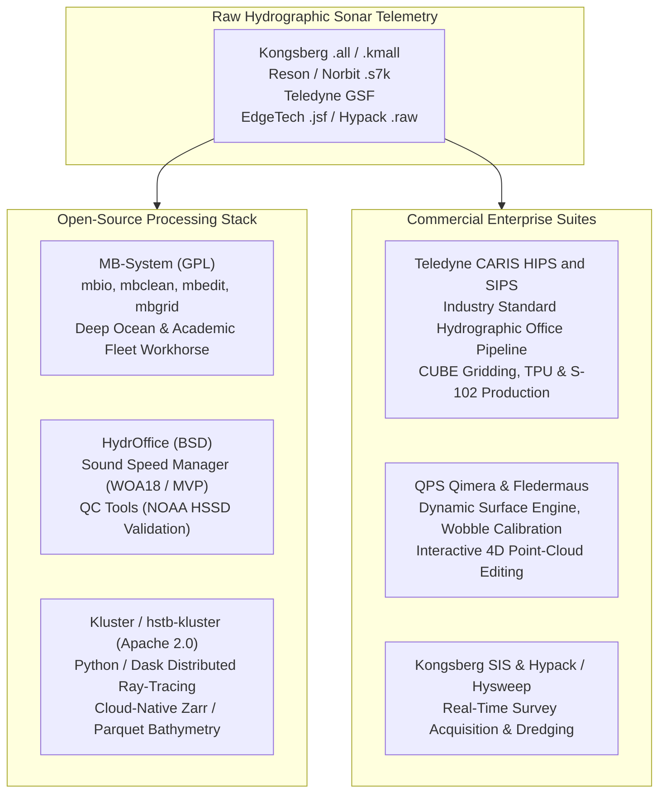

## 10.5 Software Ecosystem

Hydrographic data processing bridges the raw telemetry of real-time marine electronics and the static, gridded Digital Elevation Models required for navigational charting, coastal hydrodynamic modeling, and marine geomorphology. This section evaluates both the open-source software stack and the commercial enterprise platforms that govern multibeam, interferometric, and single-beam processing pipelines.



---

### 10.5.1 Open-Source Hydrographic Software Stack

Open-source tools dominate the academic oceanographic research fleet, scientific deep-sea exploration (e.g., Ocean Exploration Trust, Schmidt Ocean Institute, MBARI), and government innovation labs.

#### 1. MB-System (Caress & Chayes, MBARI / Lamont-Doherty)
Distributed under the GNU General Public License (GPLv3), **MB-System** is the foundational UNIX/Linux processing suite for marine swath bathymetry and acoustic backscatter:
* **The `mbio` Multibeam I/O Architecture:** Implements a universal C-library abstraction layer supporting over 170 distinct raw and processed sonar file formats (including Kongsberg `.all`/`.kmall`, Reson `.s7k`, GSF, SeaBeam, Hydrosweep, Simrad, and Elac). Users execute identical command-line tools regardless of the underlying sonar hardware.
* **Point-Cloud Cleaning Engines (`mbedit`, `mbeditviz`, `mbclean`):** Provides both interactive graphical editors (`mbedit` for ping-by-ping profile cleaning; `mbeditviz` for 3D spatial box selection) and batch automated statistical filters (`mbclean`). `mbclean` flags bathymetric flyers and side-lobe reflections by evaluating median deviations and local slope thresholds across along-track and across-track sounding neighborhoods.
* **Acoustic Ray-Tracing Correction (`mbprocess`):** Recalculates ray paths and sound speed refraction using new or revised CTD/XBT sound velocity profiles via constant-gradient circular-arc integration.
* **Grid Synthesis (`mbgrid`):** Integrates natively with the Generic Mapping Tools (GMT). `mbgrid` projects irregularly distributed swath soundings into regular 2D netCDF (`.grd`) grids using Gaussian-weighted running averages, minimum-curvature splines (`surface`), or footprint-area median binning.

```bash
# Example MB-System operational workflow:
# 1. Inspect raw multibeam file format and bounding metadata
mbinfo -I raw_survey.all -F59

# 2. Batch filter acoustic fliers using a 5-ping median window
mbclean -I raw_survey.all -F59 -N5 -M1/3.0 -O clean_survey.mb59

# 3. Apply post-survey CTD sound speed profile and re-raytrace
mbprocess -I clean_survey.mb59 -F59 -Snew_cast.svp

# 4. Interpolate soundings into a 5-meter UTM bathymetric grid (netCDF)
mbgrid -I clean_survey.mb59 -F59 -R-122.5/-122.0/36.5/37.0 -E5.0/5.0/m \
       -A1 -G3 -O monterey_canyon_5m.grd
```

#### 2. HydrOffice Suite (UNH CCOM/JHC and NOAA OCS)
Developed jointly by the Center for Coastal and Ocean Mapping at the University of New Brunswick and the NOAA Office of Coast Survey, **HydrOffice** is a modular Python open-source framework designed to automate quality assurance:
* **Sound Speed Manager (SSM):** The international hydrographic reference tool for managing, formatting, and synthesizing sound speed profiles. SSM ingests raw probe casts (CastAway, AML, Sea-Bird, MVP, XBT), automatically extends shallow profiles to the seafloor using the NOAA World Ocean Atlas (WOA18) or the Navy Generalized Digital Environmental Model (GDEM), computes salinity/temperature/depth sound speed polynomials, and transmits formatted profiles via UDP directly into real-time acquisition systems (Kongsberg SIS, Hypack).
* **QC Tools:** Enforces automated compliance against NOAA HSSD and IHO S-44 survey specifications. It scans bathymetric grids to detect:
  * **Fliers:** Identifies single-cell elevation spikes or troughs using localized Laplace curvature and Gaussian elevation residual testing.
  * **Holidays:** Automatically flags data coverage gaps exceeding allowable along-track or across-track sounding thresholds.
  * **Uncertainty Standards:** Evaluates per-node TVU layers against IHO Order 1a, Special Order, and Exclusive Order limits.

#### 3. Kluster (`hstb-kluster`, Eric Younkin / NOAA HSTB)
Developed by the NOAA Hydrographic Systems and Technology Branch (HSTB), **Kluster** is a cloud-native, distributed multibeam processing engine written entirely in modern Python:
* **Distributed Architecture:** Leverages `Dask` and `Xarray` to parallelize data decoding, motion lever-arm coordinate transformations, and acoustic ray-tracing across multi-core workstations or cloud compute clusters (AWS/GCP).
* **Direct Telemetry Ingestion:** Natively parses raw Kongsberg `.all` and `.kmall` datagrams directly without proprietary vendor intermediate files.
* **Modern Cloud-Native Storage:** Writes processed soundings and spatial metadata to Parquet tables and chunked Zarr arrays, integrating directly with modern geospatial data science environments (Pandas, GeoPandas, Cloud-Optimized GeoTIFF).

---

### 10.5.2 Commercial Hydrographic Enterprise Platforms

Commercial software platforms dominate international naval hydrographic offices, commercial offshore survey contractors, and port authorities where audited ISO-compliant certification and integration with nautical cartography are legally mandated.

#### 1. Teledyne CARIS HIPS and SIPS
CARIS HIPS (Hydrographic Information Processing System) is the global benchmark commercial software suite for multibeam, single-beam, and side-scan sonar processing:
* **CUBE (Combined Uncertainty and Bathymetric Estimator):** Invented by Dr. Brian Calder at UNH CCOM and implemented in CARIS, **CUBE** revolutionized hydrographic data cleaning. Rather than forcing human operators to hand-edit billions of individual soundings, CUBE models each sounding as a probability distribution function based on its Total Propagated Uncertainty (TPU). At every grid node, CUBE's recursive Kalman filter assimilates incoming soundings to estimate the most statistically probable true seafloor depth while identifying and isolating alternate hypotheses (e.g., fish schools or multipath reflections).
* **Variable Resolution (VR) Surfaces:** Implements hierarchical quadtree surface structures that dynamically adjust grid cell sizes based on depth and sounding density (e.g., $0.5\text{ m}$ cells in shallow water transitioning seamlessly to $8\text{ m}$ cells in deep water within a single continuous surface).
* **Electronic Navigational Chart (ENC) Integration:** Interfaces directly with CARIS BASE Editor and S-57 / S-102 production pipelines, enabling direct automated contouring and sounding selection for official navigational paper and electronic vector charts.

#### 2. QPS Qimera
Engineered by Quality Positioning Services (QPS), **Qimera** is a modern, 64-bit multi-threaded processing platform built on a core philosophy of guided automation:
* **Dynamic Surface Workflow:** Automatically tracks dependencies between raw data, sensor offsets, sound velocity profiles, and gridded surfaces. If an operator adjusts a lever-arm offset or updates an SVP cast, Qimera automatically recalculates only the affected soundings and dynamically refreshes the overlying 3D surface.
* **The Wobble Tool:** A dedicated diagnostic utility that analyzes dynamic pitch, roll, and latency errors across overlapping multibeam swaths. By fitting multi-parameter sinusoidal error models across the point cloud, the Wobble Tool isolates whether swath distortions originate from IMU timing latency, acoustic refraction, or dynamic platform squat.
* **Fledermaus Integration:** Seamlessly exports surfaces and multi-attribute point clouds to QPS Fledermaus for immersive 4D spatial analysis and movie rendering.

#### 3. Kongsberg SIS and Hypack/Hysweep
* **Kongsberg SIS (Seafloor Information System):** The proprietary real-time acquisition and control software embedded on Kongsberg multibeam systems (EM2040, EM712, EM304, EM124). Controls multi-sector phased-array beam steering, pitch/yaw stabilization, runtime sound speed profile refraction, and raw `.kmall` datagram streaming.
* **Hypack / Hysweep:** The dominant commercial survey software for dredging contractors, port hydrographers, and shallow-water construction engineering. Hysweep provides real-time 3D terrain rendering in the wheelhouse, displaying immediate dredge cut/fill volumes against engineering design templates as the vessel operates.

---

### 10.5.3 Master Comparison Matrix of Hydrographic Software Suites

| Software Suite | License & Cost | Core Architecture & Languages | Supported Formats | Surface Gridding & Cleaning Engines | Key Strengths | Limitations |
| :--- | :--- | :--- | :--- | :--- | :--- | :--- |
| **MB-System** | Free & Open-Source (GPLv3) | UNIX/Linux CLI & C, Motif GUI, GMT integration | $>170$ formats via `mbio` (GSF, `.all`, `.kmall`, `.s7k`, SeaBeam) | Footprint-median binning, Gaussian weighting, GMT splines, `mbclean` | High performance on massive regional ocean surveys; fully scriptable; format-agnostic. | Steeper learning curve; UNIX command-line oriented; limited real-time interactive 3D rendering. |
| **HydrOffice (SSM / QC Tools)** | Free & Open-Source (BSD 3-Clause) | Cross-platform Python, PyQt, NumPy/SciPy | CTD/XBT probe formats, WOA18, BAG, CSAR, GSF | Flier Finder, Holiday Finder, IHO S-44 TVU grid audit | International standard for sound speed profile management and NOAA HSSD compliance validation. | Dedicated to QA/QC and sound speed management; not a complete raw multibeam point-cloud editor. |
| **Kluster** | Free & Open-Source (Apache 2.0) | Pure Python, `Dask`, `Xarray`, Qt GUI | Kongsberg `.all` and `.kmall` (direct native parsing) | Dask-distributed ray tracing, CUBE / median gridding, Parquet / Zarr storage | Distributed cloud-native computing; modern Python data science stack integration; zero license cost. | Focused primarily on Kongsberg hardware formats; younger ecosystem than CARIS/MB-System. |
| **CARIS HIPS and SIPS** | Commercial Enterprise (Proprietary) | Windows 64-bit multi-threaded C++ | All major commercial & naval formats (`.all`, `.s7k`, GSF, Hypack) | CUBE statistical Kalman hypothesis surface, Variable Resolution (VR) quadtrees | Gold standard for international hydrographic offices; end-to-end auditability to S-102 ENC charts. | High software license and annual maintenance costs; resource-intensive hardware requirements. |
| **QPS Qimera** | Commercial (Proprietary) | Windows/macOS 64-bit C++ | All major multibeam and bathy-lidar formats | Dynamic Surface engine, automated outlier rejection, CUBE | Highly intuitive guided UI; rapid calibration (Wobble Tool); exceptional Fledermaus 4D visualization. | Commercial licensing fees; closed-source processing algorithms. |
| **Hypack / Hysweep** | Commercial (Proprietary) | Windows 64-bit C++ | Wide hardware driver support (multibeam, single-beam, lidar) | Real-time matrix binning, TIN models, cross-section volume cuts | Unrivaled standard for dredging, barge positioning, and real-time civil hydrographic operations. | Primarily optimized for operational surveying and dredging rather than deep-sea scientific synthesis. |
