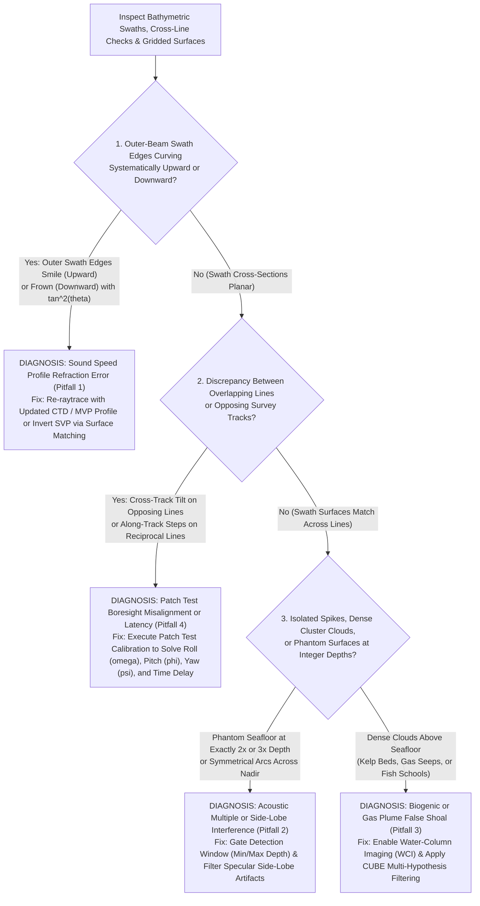

## 10.6 Common Pitfalls & Key Takeaways

Marine acoustic bathymetry operates in an optically opaque, acoustically dynamic, and physically moving environment. Converting raw acoustic travel times into a dependable Digital Elevation Model (DEM) is susceptible to systematic failure modes that can render nautical charts hazardous, compromise coastal engineering models, or create phantom submarine topography. This section details the five foremost failure modes encountered in sonar bathymetry, provides a visual diagnostic troubleshooting flowchart, and summarizes actionable key takeaways for hydrographic practitioners.

---

### 10.6.1 Five Critical Pitfalls in Acoustic Seafloor Mapping

#### Pitfall 1: Confusing Surface Sound Speed ($c_0$) with the Water-Column Sound Velocity Profile ($c(z)$)
* **The Physical Mechanism:** The surface sound speed sensor (SVS) installed at the transducer face and the water-column sound velocity profile (SVP) obtained from a CTD cast govern entirely different acoustic physical processes:
  * **SVS ($c_0$):** Used in real time by the beamformer to calculate the initial steering launch angle ($\theta_0 = \arcsin[(c_0 \Delta\phi)/(2\pi f d)]$). If $c_0$ is inaccurate by $1.0\text{ m/s}$ (a $0.067\%$ error), the entire swath tilts, and the launch angle of an outer beam at $65^\circ$ is shifted by $\delta\theta_0 \approx 0.08^\circ$, displacing the sounding both horizontally and vertically.
  * **SVP ($c(z)$):** Used by the ray-tracing engine to calculate the curved trajectory of the acoustic wave through the underlying water layers down to the seabed.
* **The Operational Error:** Survey operators frequently assume that because they have an active SVS sensor logging at the hull, they do not need to take frequent vertical sound velocity profile casts. In estuaries, coastal zones, or areas subject to internal waves, solar surface heating, or tidal mixing, the water-column profile changes rapidly.
* **Resulting DEM Artifact:** Reusing an outdated morning SVP during a sunny afternoon produces massive **"smile"** (dished upward) or **"frown"** (drooping downward) artifacts across the outer beams ($\propto \tan^2\theta$). When compiled into a regional DEM, overlapping flight lines create prominent, artificial corrugations and parallel linear ridges.
* **Mitigation Protocol:** 
  1. Continuously verify that the real-time SVS reading matches the surface value of the active SVP profile within $\pm 0.5\text{ m/s}$. A divergence indicates either sensor fouling or water-mass stratification changes requiring an immediate new cast.
  2. In highly dynamic coastal waters, deploy a **Moving Vessel Profiler (MVP)** to collect vertical profiles automatically every $15\text{–}30\text{ minutes}$ without slowing the vessel.

#### Pitfall 2: Second-Bounce Multiples and Receiver Side-Lobe Ringing
* **The Physical Mechanism:** Seawater has an acoustic reflection coefficient of $\mathcal{R} \approx -1.0$ at the air-water interface (acting as a near-perfect acoustic mirror). Over hard, reflective bottoms (gravel, rock, or shallow sand), acoustic pulse energy reflects off the seafloor, travels up to the air-water interface, bounces back down to the seafloor, and returns a second time to the transducer.
* **Resulting DEM Artifact:**
  * **The Double-Echo Multiple:** The second-bounce echo arrives at exactly twice the true two-way travel time ($\tau_2 = 2\tau_1$), creating a phantom, duplicated seafloor surface at **exactly $2\times$ the true water depth**. In shallow water ($< 20\text{ m}$), a third multiple can appear at $3\times$ depth. Automated gridding engines that lack depth-range gating ingest these soundings, creating false deep pits or duplicate surfaces.
  * **Nadir Side-Lobe Interference:** Transducer arrays possess side lobes (typically attenuated by $25\text{–}35\text{ dB}$ relative to the main acoustic axis). When the vessel is over a hard, flat seabed, the specular acoustic reflection from the nadir seafloor directly beneath the keel is exceptionally strong. This intense nadir echo leaks into the side lobes of oblique outer receive beams, causing the phase detector to trigger prematurely and producing an artificial, symmetric semi-circular arc of false soundings across the swath.
* **Mitigation Protocol:**
  1. Configure tight real-time depth gates in the acquisition software (e.g., restricting valid bottom detections to $[0.7 \cdot z_{\text{expected}}, 1.5 \cdot z_{\text{expected}}]$).
  2. In post-processing, run multi-swath automated filters (`mbclean` or CARIS CUBE) to identify and delete soundings clustered at exact integer multiples of the primary seafloor horizon.

#### Pitfall 3: False Shoal Detections from Biogenic Scatterers, Macroalgae, and Gas Plumes
* **The Physical Mechanism:** Multibeam bottom-detection algorithms (amplitude WCOG and split-aperture phase zero-crossing) are designed to identify backscattering interfaces. When acoustic energy encounters dense suspended biological or gaseous features within the water column, it triggers valid bottom detections before reaching the true mineral seabed:
  * **Giant Kelp Forests (*Macrocystis pyrifera*):** Pneumatocyst gas bladders in kelp fronds create enormous acoustic impedance contrasts, reflecting sound from $1\text{ to }15\text{ m}$ above the true rocky substrate.
  * **The Deep Scattering Layer (DSL):** Nocturnal vertical migration of myctophids (lanternfish) and euphausiids (krill) creates an acoustic scattering layer that can reflect $30\text{–}100\text{ kHz}$ multibeam pulses at depths of $200\text{–}400\text{ m}$.
  * **Methane Gas Seeps:** Bubbles venting from cold seeps or decaying organic matter generate brilliant acoustic reflections.
* **Resulting DEM Artifact:** The resulting DEM displays jagged, irregular topographic mounds, spires, and plateaus that mimic real underwater rock pinnacles or shoals.
* **Mitigation Protocol:**
  1. Inspect synchronized **Water-Column Imaging (WCI)** data. Mineral rock features remain spatially continuous and stationary across pings, whereas gas plumes and fish schools exhibit acoustic transparency, vertical rise, and water-current drift.
  2. In kelp-covered coastal zones, deploy low-frequency sonars ($12\text{–}30\text{ kHz}$) or sub-bottom profilers that penetrate the macroalgae canopy to resolve the bare bedrock underneath, and apply morphological minimum-surface filtering (similar to LiDAR bare-earth filtering).

#### Pitfall 4: Boresight Misalignment and Motion Sensor Latency
* **The Physical Mechanism:** The physical orientation of the multibeam transducer array rarely aligns perfectly with the optical axes of the Inertial Measurement Unit (IMU). Even when machined to high tolerances, mechanical mounting deflections introduce angular boresight misalignments: roll ($\Delta\omega$), pitch ($\Delta\phi$), and yaw ($\Delta\kappa$), alongside potential timing latency ($\Delta t$) between the GNSS/IMU time stamps and the acoustic transceiver clock.
* **Resulting DEM Artifact:**
  * **Roll Misalignment ($\Delta\omega$):** Induces a cross-track tilt. When surveying reciprocal (opposing) survey tracks over a flat seafloor, roll error creates an antisymmetric vertical offset: the seafloor appears tilted to starboard on Line 1, and tilted to port on Line 2, creating massive step discontinuities along swath overlaps.
  * **Pitch Misalignment ($\Delta\phi$):** Displaces soundings along-track by $\Delta x \approx z \tan\Delta\phi$. Over sloping terrain, reciprocal survey lines exhibit severe along-track contour displacement.
  * **Yaw Misalignment ($\Delta\kappa$):** Rotates the outer swath soundings horizontally. Over complex terrain (sand dunes or rock ridges), features surveyed on opposing tracks appear sheared and duplicated.
  * **Timing Latency ($\Delta t$):** Displaces soundings along the direction of travel proportionally to vessel speed ($v \cdot \Delta t$). When vessel speed varies or turns occur, latency manifests as artificial sawtooth rippling in the terrain.
* **Mitigation Protocol:** Execute a rigorous **Patch Test Calibration** immediately following mobilization and drydock:
  1. **Latency Test:** Run coincident survey lines over a steep, well-defined slope or submerged feature at two distinctly different speeds ($4\text{ knots}$ vs. $10\text{ knots}$).
  2. **Pitch Test:** Run reciprocal (opposing heading) lines over the same steep feature at the same speed.
  3. **Roll Test:** Run reciprocal lines over a broad, flat, featureless seabed; calculate the angular roll correction that collapses the cross-track tilt difference to zero.
  4. **Yaw Test:** Run adjacent, parallel overlapping lines in the same direction over a distinct feature, comparing the outer beams of one line with the inner beams of the adjacent line.

#### Pitfall 5: Antimeridian Crossing and Coordinate Projection Distortions
* **The Physical Mechanism:** Global oceanographic cruises frequently navigate across the $180^\circ$ meridian (the Antimeridian) in the central Pacific, Aleutian Islands, or Fiji, or span multiple Universal Transverse Mercator (UTM) zones.
* **Resulting DEM Artifact:**
  * **The $180^\circ$ Seam Tear:** Software engines that store longitude in standard $[-180^\circ, +180^\circ]$ notation experience coordinate wrap-around blunders when a multibeam swath straddles $180^\circ$ ($+179.99^\circ \to -179.99^\circ$), causing the gridding engine to project triangles or raster cells across the entire globe.
  * **Grid Convergence Distortion:** Projecting wide acoustic swaths into a single UTM zone hundreds of kilometers away from its central meridian introduces severe scale factor distortions ($k > 1.001$) and grid convergence rotations ($\gamma \neq 0$). If raw shipboard heading (relative to True North) is applied without correcting for grid convergence, the swath rotates on the projected mapping plane, introducing artificial cross-track slopes and navigation mismatch.
* **Mitigation Protocol:**
  1. In the vicinity of the Antimeridian, re-index longitudes to $[0^\circ, 360^\circ)$ or project coordinates directly into a localized polar stereographic or regional equal-area CRS.
  2. Always ensure the georeferencing engine rigorously applies the meridian grid convergence angle ($\gamma = \Delta\lambda \sin\phi$) when converting vessel gyro heading to grid azimuth:
     $$\alpha_{\text{grid}} = \psi_{\text{gyro}} - \gamma$$

---

### 10.6.2 Key Takeaways for Hydrographic Practitioners

> [!IMPORTANT]
> **The Five Golden Rules of Acoustic Bathymetric DEM Integrity:**
> 1. **Outer Beams Are Non-Linear Error Amplifiers:** Because sound speed refraction errors and roll errors scale with $\tan^2\theta$ and $\tan\theta$ respectively, soundings beyond $60^\circ$ off-nadir account for $>80\%$ of the total survey error budget. Never accept outer-beam data without cross-line statistical validation.
> 2. **SVS Measures the Present; SVP Measures the Past:** The surface sound speed probe measures the instantaneous water skin at the hull, but it cannot see the thermoclines, haloclines, and internal waves lurking $50\text{ m}$ below. Take vertical sound velocity casts whenever surface sound speed drifts by more than $0.5\text{ m/s}$ or water temperature shifts by $>0.5^\circ\text{C}$.
> 3. **Never Grid Raw Multi-Source Bathymetry Without Quality Layer Attribution:** A bathymetric DEM that merges multibeam, single-beam, and lead-line soundings into a single elevation layer without propagating per-cell Total Propagated Uncertainty (TPU) and source metadata creates a dangerous false sense of security for nautical charting and coastal engineering.
> 4. **Patch Tests Must Be Audited in 3D:** Do not rely on automated single-line calibration wizards without inspecting the 3D difference surfaces between reciprocal swaths. Unresolved roll errors of just $0.1^\circ$ create a $0.35\text{ m}$ vertical error at the edge of a $100\text{ m}$ deep swath ($X = 200\text{ m}$).
> 5. **Nautical Depth Overrules Acoustic Topography in Cohesive Mud:** In dredged channels and turbid estuaries, high-frequency acoustic reflections do not represent the physical obstacle to deep-draft navigation. Always distinguish the acoustic lutocline from the $1200\text{ kg/m}^3$ physical nautical depth bed.
