## 10.7 Curated Key References

The scientific and engineering literature governing underwater acoustics, multibeam swath bathymetry, and hydrographic point-cloud processing spans physical oceanography, array signal processing, stochastic surface estimation, and international maritime law. The curated, annotated works below are organized into five thematic categories matching the progression of Chapter 10, concluding with a quick-reference practitioner matrix linking operational challenges to foundational literature.

```mermaid
flowchart LR
    subgraph AcouPhys["1. Underwater Acoustics & Sound Speed"]
        Lurton["Lurton (2010)\nIntro to Underwater Acoustics"]
        DelGrosso["Del Grosso (1974) & Chen-Millero (1977)\nSound Speed Formulations"]
        Francois["Francois & Garrison (1982)\nSeawater Sound Absorption"]
    end

    subgraph SwathSys["2. Swath Sonar Principles & Geomorphology"]
        HughesClarke["Hughes Clarke (2018)\nMultibeam Echosounders"]
        deMoustier["de Moustier (1988)\nSwath Bathymetry Systems"]
        Renard["Renard & Allenou (1987)\nSeaBeam Classic Architecture"]
    end

    subgraph Processing["3. Hydrographic Processing & CUBE Gridding"]
        Calder["Calder & Mayer (2003)\nCUBE Statistical Gridding"]
        Caress["Caress & Chayes (1996)\nMB-System Architecture"]
        Hare["Hare et al. (1995)\nTotal Propagated Uncertainty (TPU)"]
    end

    subgraph Standards["4. Hydrographic Standards & Specifications"]
        IHO["IHO S-44 (2020)\nStandards for Hydrographic Surveys"]
        NOAA["NOAA HSSD (2024)\nHydrographic Specifications & Deliverables"]
    end

    AcouPhys --> SwathSys --> Processing --> Standards
```

---

### 10.7.1 Foundational Physical Acoustics and Sound Speed Formulations

* **Lurton, X. (2010).** *An Introduction to Underwater Acoustics: Principles and Applications* (2nd ed.). Berlin, Heidelberg: Springer-Verlag. (680 pp.). https://doi.org/10.1007/978-3-642-13835-5
  * *Core Physical Contribution:* Serves as the definitive modern graduate-level textbook on hydrographic and naval acoustics. Provides complete derivations of acoustic wave propagation in heterogeneous fluids, array beamforming directivity patterns, bottom scattering physics (Kirchhoff approximation and small-roughness perturbation models), and the statistical mechanics of multibeam phase and amplitude detection.
  * *Engineering & DEM Relevance:* Chapter 7 ("Swath Bathymetry Systems") derives the fundamental relationship between beamwidth, split-aperture phase baseline separation, signal-to-noise ratio, and resulting depth measurement variance, providing the exact theoretical foundation for modern multibeam TPU models.

* **Del Grosso, V. A. (1974).** New equation for the speed of sound in natural waters (with comparisons to other equations). *Journal of the Acoustical Society of America*, 56(4), 1084–1091. https://doi.org/10.1121/1.1903388
  * *Core Mathematical Contribution:* Formulates a 19-term empirical polynomial for the speed of sound in seawater derived from high-precision laboratory acoustic interferometer measurements across $T \in [0, 30]^\circ\text{C}, S \in [30, 40]\text{ PSU}, P \in [0, 1000]\text{ kg/cm}^2$.
  * *Engineering & DEM Relevance:* Del Grosso's formulation is widely recognized by naval and deep-sea oceanographic institutions as the most accurate model for deep-water ray tracing, eliminating the $+0.3\text{ to }+0.5\text{ m/s}$ high-pressure bias inherent in older Wilson (1960) algorithms that previously induced kilometer-scale vertical offsets in abyssal trench soundings.

* **Chen, C.-T., & Millero, F. J. (1977).** Speed of sound in seawater at high pressures. *Journal of the Acoustical Society of America*, 62(5), 1129–1135. https://doi.org/10.1121/1.381646
  * *Core Mathematical Contribution:* Establishes the standard UNESCO (1983) sound speed polynomial based on precision speed-of-sound measurements in standard seawater relative to pure water, linking sound speed directly to the practical salinity scale ($S$) and hydrostatic gauge pressure ($P$).
  * *Engineering & DEM Relevance:* Remains the default sound speed calculation engine implemented in CTD profiler firmware (Sea-Bird, AML, SonTek) and hydrographic sound speed managers.

* **Francois, R. E., & Garrison, G. R. (1982).** Sound absorption based on ocean measurements. Part I: Pure water and magnesium sulfate contributions; Part II: Boric acid contribution and new equation. *Journal of the Acoustical Society of America*, 72(3), 896–907; 72(6), 1879–1890. https://doi.org/10.1121/1.388170
  * *Core Physical Contribution:* Resolves the chemical relaxation mechanisms governing acoustic attenuation in natural seawater, proving that boric acid relaxation dominates between $0.1\text{–}3\text{ kHz}$ and magnesium sulfate dominates between $10\text{–}100\text{ kHz}$.
  * *Engineering & DEM Relevance:* Provides the closed-form analytical equations used by sonar systems and hydrographic software (`MB-System`, `CARIS`, `Qimera`) to compute transmission loss (TL) and calibrate acoustic backscatter intensity for seafloor sediment classification.

---

### 10.7.2 Swath Sonar Architecture, Beamforming, and Submarine Geomorphology

* **Hughes Clarke, J. E. (2018).** Multibeam echosounders. In C. W. Finkl & C. Makowski (Eds.), *Submarine Geomorphology* (pp. 25–41). Cham: Springer Nature. https://doi.org/10.1007/978-3-319-57852-1_3
  * *Core Methodological Contribution:* Provides an authoritative synthesis of modern multibeam system design written specifically for geomorphologists and hydrographers. Details the operational evolution from single-frequency CW systems to multi-sector FM chirp arrays, motion-stabilized beam steering, and real-time seafloor backscatter extraction.
  * *Engineering & DEM Relevance:* Dissects how platform dynamics (dynamic draft, vessel settlement, roll/pitch/yaw misalignments) and water-column oceanography interact to create non-geological artifacts in high-resolution digital elevation models.

* **de Moustier, C. (1988).** State of the art in swath bathymetry survey systems. *International Hydrographic Review*, 65(2), 25–54.
  * *Core Historical & Technical Contribution:* Documents the technological transition from single-beam echo sounders to first- and second-generation swath systems (SeaBeam, Bathymetric Swath Survey System, EDO Western, Krupp Atlas Hydrosweep), establishing standard terminology for Mills Cross geometries, angular beamforming, and interferometric phase differences.
  * *Engineering & DEM Relevance:* Benchmarks the horizontal and vertical resolution capabilities of early civilian swath mapping systems, providing essential historical context for interpreting legacy bathymetric archives.

* **Renard, V., & Allenou, J. P. (1987).** SeaBeam, multi-beam echo-sounding in "Jean Charcot": Description, evaluation and first results. *International Hydrographic Review*, 64(1), 35–67.
  * *Core Engineering Contribution:* Details the technical installation, acoustic performance, and operational results of the first commercial deep-sea multibeam system installed aboard a civilian oceanographic vessel.
  * *Engineering & DEM Relevance:* Demonstrates the transformative power of continuous swath bathymetry in resolving deep-sea fracture zones, seamount volcanism, and plate tectonic boundaries.

---

### 10.7.3 Hydrographic Processing Algorithms, CUBE Gridding, and Error Budgets

* **Calder, B. R., & Mayer, L. A. (2003).** Automatic processing of high-rate, high-density multibeam echosounder data. *Geochemistry, Geophysics, Geosystems*, 4(6), 1048. https://doi.org/10.1029/2002GC000486
  * *Core Algorithmic Contribution:* Formulates the **Combined Uncertainty and Bathymetric Estimator (CUBE)** algorithm. By modeling each acoustic sounding as an uncertain spatial observation with full Total Propagated Uncertainty (TPU) covariances, CUBE applies recursive Kalman filtering at each grid node to track multiple depth hypotheses, dynamically isolating acoustic flyers, fish schools, and multipath reflections from the true benthic surface.
  * *Engineering & DEM Relevance:* CUBE fundamentally transformed hydrographic workflow productivity, eliminating the need for manual ping-by-ping editing and establishing the algorithmic engine adopted by NOAA, the UK Hydrographic Office, and international navies in `CARIS HIPS`, `QPS Qimera`, and `HydrOffice`.

* **Caress, D. W., & Chayes, D. N. (1996).** Improved processing of Hydrosweep DS multibeam data on the R/V *Maurice Ewing*. *Marine Geophysical Researches*, 18(6), 631–650. https://doi.org/10.1007/BF00313878
  * *Core Software & Scientific Contribution:* Documents the design and open-source release of **MB-System**. Details the mathematical algorithms behind `mbprocess`, including automated cross-fan sound speed calibration, roll/pitch/heading kinematic georeferencing, and the format-independent `mbio` software architecture.
  * *Engineering & DEM Relevance:* Established the global computational benchmark for reproducible, open-source oceanographic multibeam processing, underpinning continental-margin and deep-sea DEM compilations worldwide (e.g., GMRT and GEBCO).

* **Hare, R., Godin, A., & Mayer, L. (1995).** *Accuracy Estimation of Canadian Swath (Multibeam) and Sweep (Multi-Transducer) Sounding Systems* (Canadian Hydrographic Service Research Report). Ottawa: Fisheries and Oceans Canada. (112 pp.).
  * *Core Error Propagation Contribution:* Provides the definitive mathematical derivation of the multibeam Total Propagated Uncertainty (TPU) Jacobian matrix, systematically expanding the partial derivatives of vessel position, motion sensor roll/pitch/heave, gyro heading, transducer alignment angles, acoustic travel times, and sound speed profiles.
  * *Engineering & DEM Relevance:* Forms the foundational mathematical error model embedded in hydrographic processing engines to compute $95\%$ confidence bounds and certify survey compliance against international standards.

---

### 10.7.4 International Hydrographic Standards and Specifications

* **International Hydrographic Organization [IHO]. (2020).** *IHO Standards for Hydrographic Surveys* (Special Publication No. 44, 6th ed.). Monaco: International Hydrographic Bureau. (48 pp.). https://iho.int/en/s-44-standards-for-hydrographic-surveys
  * *Core Specification Contribution:* Defines the binding global standards governing nautical charting and safety of navigation bathymetry. Establishes the survey classification hierarchy (Exclusive Order, Special Order, Order 1a, Order 1b, Order 2) in terms of maximum allowable Total Horizontal Uncertainty (THU), Total Vertical Uncertainty (TVU), and minimum feature detection size.
  * *Engineering & DEM Relevance:* Formalizes the mathematical equation $\text{TVU}_{\max}(d) = \sqrt{a^2 + (b \cdot d)^2}$ and enforces bathymetric grid attribute standards, including mandatory layers for sounding density, depth uncertainty, and feature detection confidence.

* **National Oceanic and Atmospheric Administration [NOAA]. (2024).** *Hydrographic Surveys Specifications and Deliverables (HSSD)*. Silver Spring, MD: National Ocean Service, Office of Coast Survey. (214 pp.). https://nauticalcharts.noaa.gov/publications/standards-and-requirements.html
  * *Core Operational Contribution:* The definitive operational handbook for conducting hydrographic surveys in United States waters. Enforces modern protocols for Ellipsoid-Referenced Surveying (ERS), patch test calibration tolerances, variable-resolution CUBE gridding, cross-line check statistics, and Bathymetric Attributed Grid (BAG) / S-102 deliverable formats.
  * *Engineering & DEM Relevance:* Provides step-by-step verification gates, flier-detection thresholds, and junction analysis standards that guarantee bathymetric DEMs meet legal and safety-of-life criteria.

---

### 10.7.5 Quick-Reference Practitioner Matrix: Sonar Tasks, Error Modes, References, and Tools

| Hydrographic Survey Challenge / Error Mode | Underlying Physical / Mathematical Mechanism | Primary Literature Reference(s) | Recommended Software / Module |
| :--- | :--- | :--- | :--- |
| **Sound Speed Profile Smile/Frown Artifacts** | Snell's law ray-bending error ($\delta z/z \propto \tan^2\theta$) caused by stale water-column profile | Lurton (2010); Del Grosso (1974); Caress & Chayes (1996) | `HydrOffice Sound Speed Manager`, `MB-System` (`mbprocess`), `Qimera` |
| **Surface Sound Speed ($c_0$) Beam-Steering Tilt** | Transducer face launch angle error ($\delta\theta_0 = \tan\theta_0 \delta c_0 / c_0$) in phased-array beamforming | Hughes Clarke (2018); Hare et al. (1995) | Real-time SVS probe monitoring, `Kongsberg SIS`, `Qimera` Wobble Tool |
| **Acoustic Multiples & Side-Lobe Artifacts** | Specular air-water / bottom reverberation ($2\times\text{ depth}$) & nadir specular leakage into outer beams | de Moustier (1988); Lurton (2010) | Depth-range gating in acquisition; `mbclean`, CARIS CUBE filter |
| **Biogenic Scattering & False Kelp/Gas Shoals** | Impedance contrast from fish swim bladders, gas seeps, or kelp pneumatocysts triggering bottom detection | Lurton (2010); Calder & Mayer (2003) | Water-Column Imaging (WCI) analysis, CARIS CUBE hypothesis editor |
| **Transducer Boresight Misalignment (Roll/Pitch/Yaw)** | Mechanical deflection between transducer array and IMU axes causing angular sounding displacement | Hughes Clarke (2018); NOAA HSSD (2024) | Patch test calibration lines; `Qimera` Calibration Tool, `CARIS` Patch Test |
| **Automated Point-Cloud Cleaning & Hypothesis Gridding** | High-density sounding uncertainty modeling and Kalman filter surface extraction | Calder & Mayer (2003) | `CARIS HIPS` (CUBE engine), `QPS Qimera`, `Kluster` |
| **Large-Scale Bathymetric Data Science & Cloud Pipelines** | High-throughput distributed decoding, ray-tracing, and cloud-native rasterization | Younkin / NOAA HSTB; Butler et al. (2021) | `Kluster` (`hstb-kluster`), `Dask`, `Zarr`, `Parquet` |
| **Nautical Chart Compliance & TVU/THU Certification** | Statistical compliance validation against IHO S-44 survey orders and NOAA specifications | IHO S-44 (2020); NOAA HSSD (2024) | `HydrOffice QC Tools` (Flier Finder, Holiday Finder), `CARIS BASE Editor` |

> [!TIP]
> **Diagnosing Swath Artifacts in Post-Processing:** When reviewing a bathymetric surface for quality assurance:
> * **If the swath cross-section is concave upward ("smile") or convex downward ("frown") symmetrically on both sides:** The issue is sound speed profile refraction. Re-raytrace using an updated or interpolated CTD/MVP profile.
> * **If the swath cross-section is tilted linearly across-track and reverses slope on reciprocal lines:** The issue is uncalibrated roll boresight ($\Delta\omega$). Re-run patch test calibration.
> * **If bathymetric contours on a steep slope are displaced along-track on reciprocal lines:** The issue is uncalibrated pitch boresight ($\Delta\phi$) or navigation latency ($\Delta t$).
> * **If the surface is populated by isolated high spikes or linear corrugations along nadir:** The issue is false bottom detection on fish, kelp, or nadir specular side-lobe ringing. Apply automated CUBE hypothesis cleaning.
