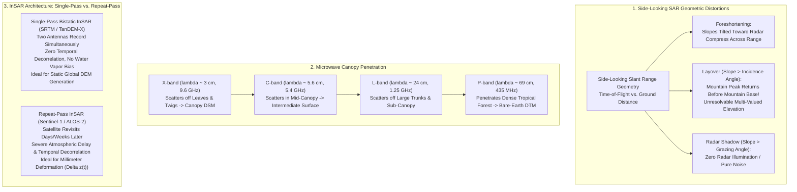
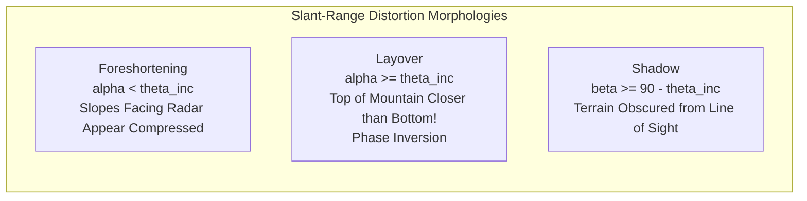
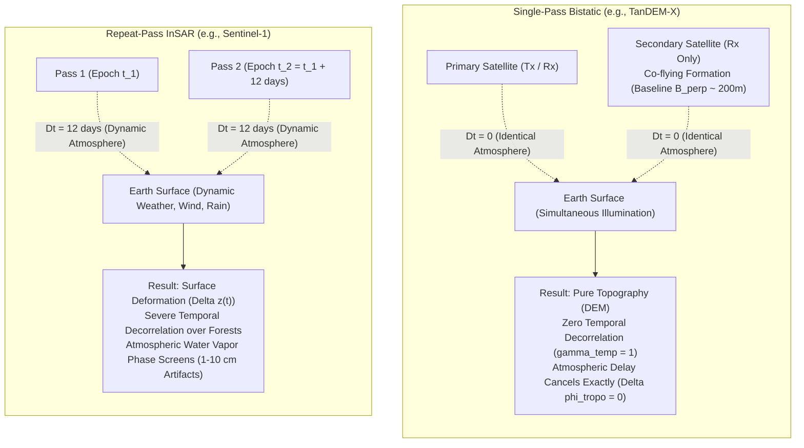

# Chapter 11: Radar, SAR, Satellite Altimetry, Satellite-Derived Bathymetry (SDB), and Auxiliary Geophysics

*Mapping from microwave wavelengths, optical water radiance, and potential fields (gravity and magnetics).*

Across planetary surfaces, neither subaerial optical cameras nor vessel-mounted sonars can provide continuous, all-weather, global elevation models. Cloud cover, polar night, atmospheric haze, and vast expanses of uncharted, remote waters create massive coverage voids. To bridge these terrestrial and marine divides, geoscientists harness the broader electromagnetic and geophysical spectrum: active microwave Synthetic Aperture Radar (SAR) that pierces cloud decks and polar darkness; spaceborne radar altimetry that charts ice sheets and maps deep-sea marine gravity; multi-spectral optical radiative transfer that inverts shallow coastal water radiance into bathymetry; and planetary potential fields (gravimetry and magnetics) that reveal the unseeable bedrock topography hidden beneath oceanic water columns and continental ice sheets. This chapter establishes the physical principles, sensor models, inversion mathematics, and processing software that govern these indispensable remote-sensing methodologies.

---

## 11.1 Synthetic Aperture Radar (SAR) and Interferometric SAR (InSAR)

Synthetic Aperture Radar (SAR) is an active coherent microwave imaging system. By transmitting frequency-modulated chirps and coherently synthesizing an antenna aperture hundreds of meters to kilometers long via platform orbital motion, spaceborne SAR systems achieve high spatial resolution ($1\text{–}10\text{ m}$) that is completely independent of sensor altitude. When two SAR images observe the Earth's surface from slightly separated cross-track vantage points, the phase difference between their complex backscatter signals encodes topography: a technique known as **Interferometric Synthetic Aperture Radar (InSAR)**.

---

### 11.1.1 Radar Side-Looking Geometry and Severe Topographic Distortions

Unlike nadir-pointing optical cameras or altimeters, SAR antennas must look sideways at an off-nadir look angle $\theta_{\text{look}} \in [20^\circ, 55^\circ]$ to break the left-right range degeneracy. While essential for 2D imaging, this side-looking slant-range projection induces three severe geometric distortions over rugged terrain:

1. **Foreshortening:** When a mountain slope tilts toward the radar with local terrain slope angle $\alpha < \theta_{\text{inc}}$ (where $\theta_{\text{inc}}$ is the local incidence angle relative to the reference ellipsoid normal), the slant-range distance between the base and the crest is compressed relative to flat ground:
   $$\Delta R_{\text{slope}} = \Delta x_{\text{ground}} \sin\theta_{\text{inc}} - \Delta z \cos\theta_{\text{inc}}$$
   On the radar image, the fore-slope appears brightened and geometrically compressed into a narrow strip of pixels.
2. **Layover:** When the terrain slope is steeper than the incidence angle ($\alpha \ge \theta_{\text{inc}}$), the top of the mountain is physically closer in slant range to the radar than its base. Consequently, the radar wavefront strikes the summit **before** it strikes the base! In the resulting SAR image, the mountain crest is mapped on top of or in front of the base, causing a complete inversion of topographic geometry. Because multiple physical terrain patches map to the exact same slant-range pixel, standard phase unwrapping is mathematically non-invertible in layover zones.
3. **Radar Shadow:** When the back-slope of a ridge drops away from the radar at an angle steeper than the radar grazing angle ($\beta \ge 90^\circ - \theta_{\text{inc}}$), the surface is physically shielded from the radar beam. No microwave energy illuminates this region; the corresponding pixels contain zero signal and consist purely of receiver thermal noise.

---

### 11.1.2 Microwave Wavelengths, Canopy Penetration, and PolInSAR

The interaction between microwave radiation and natural terrain is governed by the radar carrier frequency $f_0$ and wavelength $\lambda = c / f_0$. The penetration depth into vegetative canopies scales directly with wavelength:

| Radar Band | Nominal Frequency ($f$) | Wavelength ($\lambda$) | Primary Scattering Elements in Forest | Elevation Surface Measured | Exemplar Spaceborne Missions |
| :--- | :--- | :--- | :--- | :--- | :--- |
| **X-band** | $9.6\text{ GHz}$ | $\approx 3.1\text{ cm}$ | Leaves, needles, twigs, top-of-canopy | **Digital Surface Model (DSM)** | TanDEM-X, TerraSAR-X, COSMO-SkyMed |
| **C-band** | $5.4\text{ GHz}$ | $\approx 5.6\text{ cm}$ | Small branches, dense foliage | **Intermediate Surface** (biased toward DSM) | SRTM C-band, Sentinel-1, RADARSAT-2 |
| **L-band** | $1.25\text{ GHz}$ | $\approx 24.0\text{ cm}$ | Primary tree limbs, trunks, dry soil surface | **Sub-Canopy / Partial DTM** | ALOS-2 PALSAR-2, NISAR (NASA-ISRO) |
| **P-band** | $435\text{ MHz}$ | $\approx 69.0\text{ cm}$ | Tree trunks, ground-trunk double bounce, bare soil | **Bare-Earth DTM** | ESA Biomass (2025) |

#### Polarimetric SAR Interferometry (PolInSAR)
In dense forests, single-polarization InSAR cannot decouple scattering from the canopy crown from scattering at the forest floor. **Polarimetric InSAR (PolInSAR)** solves this by acquiring full polarimetric quad-pol channels (HH, VV, HV, VH) along interferometric baselines (Cloude & Papathanassiou, 1998). 

Using the Random Volume over Ground (RVoG) model, PolInSAR parameterizes complex interferometric coherence $\gamma(\mathbf{w})$ as a function of unitary polarization projection vector $\mathbf{w}$:

$$\gamma(\mathbf{w}) = e^{j \phi_0} \frac{\mu(\mathbf{w}) + \gamma_v}{\mu(\mathbf{w}) + 1}$$

where $\phi_0 = \frac{4\pi}{\lambda} \frac{B_\perp z_{\text{ground}}}{R \sin\theta}$ is the true **bare-ground interferometric phase**, $\gamma_v$ is the complex volume coherence of the vegetative canopy, and $\mu(\mathbf{w})$ is the ground-to-volume power ratio. By projecting coherences across multiple polarizations along a straight line in the complex plane, PolInSAR extracts the true bare-earth ground elevation $z_{\text{ground}}$ and canopy height $h_v$ simultaneously from space.

---

### 11.1.3 Single-Pass Bistatic InSAR vs. Repeat-Pass InSAR

The operational deployment of InSAR splits into two fundamentally distinct paradigms with radically different error characteristics:

#### 1. Single-Pass Bistatic InSAR (The Gold Standard for Static DEMs)
Exemplified by the **Shuttle Radar Topography Mission (SRTM, 2000)** and the **TanDEM-X Mission (2010–present)**, single-pass bistatic systems operate two radar antennas separated by a physical baseline ($B = 60\text{ m}$ mast on SRTM; close-formation flying satellite helix for TanDEM-X). One antenna transmits, and both antennas receive simultaneously:
* **Zero Temporal Decorrelation:** Because both images are recorded at the exact same instant ($\Delta t = 0$), wind-blown vegetation, rainfall, and ocean waves cannot decorrelate the interferometric phase ($\gamma_{\text{temp}} = 1.0$).
* **Atmospheric Cancellation:** Because the radar pulses travel through the identical atmospheric water-vapor column at the same millisecond, atmospheric phase delays cancel out completely in the interferometric phase difference ($\Delta\phi_{\text{tropo}} = 0$).
* **Outcome:** Single-pass systems produce pristine, globally consistent Digital Elevation Models (e.g., the global TanDEM-X $12\text{ m}$ DEM with absolute vertical accuracy $< 1.0\text{ m}$).

#### 2. Repeat-Pass InSAR (The Deformation Engine)
Exemplified by the European Space Agency's **Copernicus Sentinel-1A/1B**, repeat-pass systems utilize a single satellite that revisits the same orbital track days or weeks later ($\Delta t = 6\text{ to }12\text{ days}$):
* **Temporal Decorrelation:** Any change in surface geometry or dielectric permittivity (leaf rustling, soil moisture shifts, snow accumulation) between passes destroys phase coherence ($\gamma_{\text{temp}} \to 0$), rendering phase unwrapping impossible over vegetated surfaces.
* **Atmospheric Phase Screens (APS):** Turbulent tropospheric water vapor variations between Pass 1 and Pass 2 introduce differential phase shifts that mimic topographic variations. A $10\%$ shift in relative humidity along the line of sight creates an apparent elevation error of **$\Delta z \approx 10\text{–}30\text{ m}$** in repeat-pass DEMs!
* **Outcome:** Repeat-pass InSAR is poorly suited for initial static DEM creation, but serves as the world's primary sensor for measuring sub-centimeter **surface deformation rates ($\Delta z(t)$)** caused by earthquakes, volcanic inflation, aquifer overdraft subsidence, and glacial ice stream flow.

---

### 11.1.4 Interferometric Phase, Height of Ambiguity, and Phase Unwrapping

In an interferometric pair with perpendicular spatial baseline $B_\perp$ and slant range $R$, the geometric interferometric phase difference $\Delta\phi$ is proportional to the difference in optical path length:

$$\Delta\phi = -\frac{2\pi p}{\lambda} \Delta R \approx -\frac{2\pi p}{\lambda} \frac{B_\perp}{R \sin\theta_{\text{inc}}} z$$

where $p = 1$ for single-pass bistatic InSAR, $p = 2$ for repeat-pass InSAR, and $z$ is the elevation above the reference ellipsoid.

#### The Height of Ambiguity ($h_a$)
Because radar phase is measured modulo $2\pi$ (wrapped within the interval $[-\pi, +\pi)$), the elevation change required to induce a full $2\pi$ phase cycle is termed the **Height of Ambiguity ($h_a$)**:

$$h_a = \frac{\lambda R \sin\theta_{\text{inc}}}{p \, B_\perp}$$

The Height of Ambiguity represents the fundamental sensitivity trade-off of InSAR:
* **Large Baseline ($B_\perp \gg 0 \implies h_a \text{ small}$):** Highly sensitive to subtle elevation changes (e.g., $h_a = 15\text{ m}$). However, fringes are tightly packed, spatial decorrelation increases, and phase unwrapping over steep terrain is exceptionally difficult.
* **Small Baseline ($B_\perp \to 0 \implies h_a \text{ large}$):** Fringes are widely spaced (e.g., $h_a = 250\text{ m}$), making phase unwrapping trivial, but vertical height precision degrades proportionally.

#### Phase Unwrapping Algorithms
Recovering absolute elevation $z$ requires solving the non-linear inverse problem of adding the correct integer number of phase cycles $2\pi k$ to each pixel: $\phi_{\text{unwrapped}} = \phi_{\text{wrapped}} + 2\pi k$. 
Modern processing suites rely on:
1. **Goldstein's Branch-Cut Algorithm:** Identifies phase singularities (residues where $\oint \nabla\phi \ne 0$) caused by noise or layover, connecting residues of opposite sign with "branch cuts" across which integration is forbidden.
2. **Statistical-Cost Network Flow (SNAPHU, Chen & Zebker, 2002):** Poses phase unwrapping as a maximum a posteriori (MAP) network flow optimization problem on a directed graph. SNAPHU incorporates intensity gradients and spatial coherence $\gamma$ to route integer cycle steps through low-coherence shadow and layover zones with minimum probability of error.

---

### 11.1.5 Radargrammetry (Stereo SAR)

Where extreme alpine topography (e.g., the Himalayas, Southern Alps, or Andes) induces total InSAR phase coherence collapse due to severe layover and shadow, **Radargrammetry (Stereo SAR)** provides a robust alternative.

Radargrammetry discards the fragile optical carrier phase, operating purely on SAR backscatter **amplitude imagery**. By imaging the terrain from two distinct orbits with different incidence angles ($\theta_1 \ne \theta_2$, typically $\Delta\theta \approx 15^\circ\text{–}25^\circ$), parallax displacement in the range direction is measured via normalized cross-correlation (identical to optical stereo photogrammetry; Chapter 8). The parallax equation yields elevation:

$$z = \frac{\Delta p_r}{\cot\theta_1 - \cot\theta_2}$$

While vertical accuracy ($\sigma_z \approx 2\text{–}5\text{ m}$) is lower than bistatic InSAR, radargrammetry is completely immune to phase decorrelation, atmospheric water-vapor fringes, and phase-unwrapping blunders over rugged glaciers and steep rock faces.
