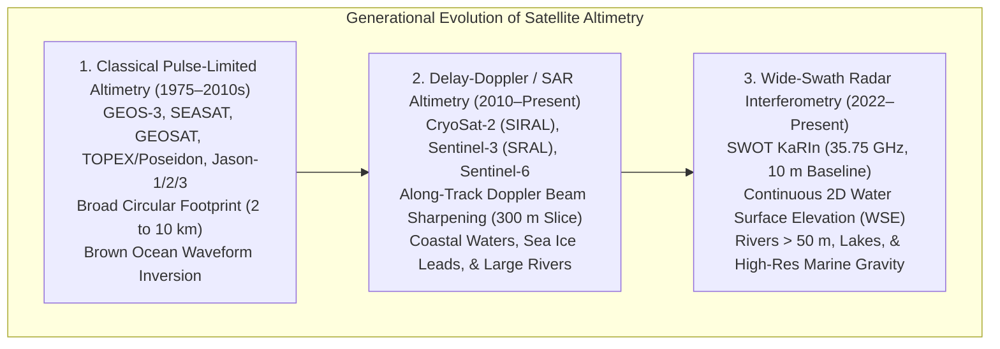
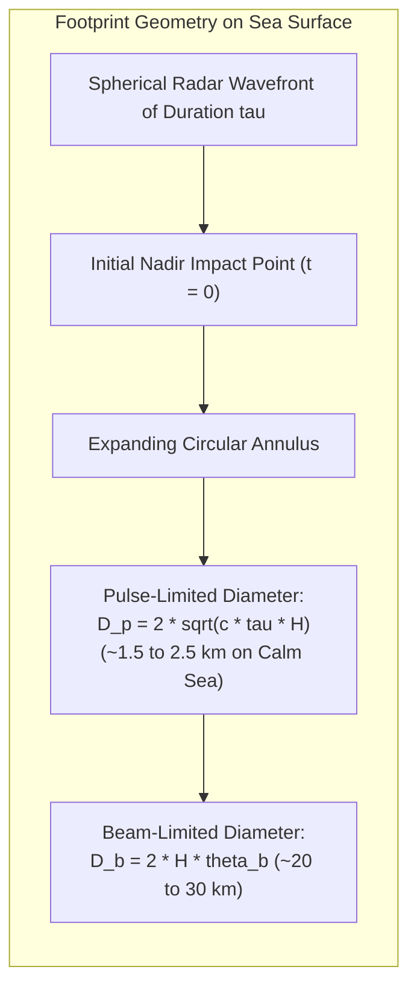
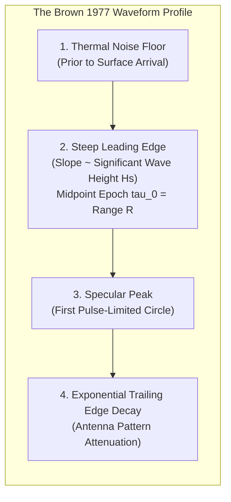
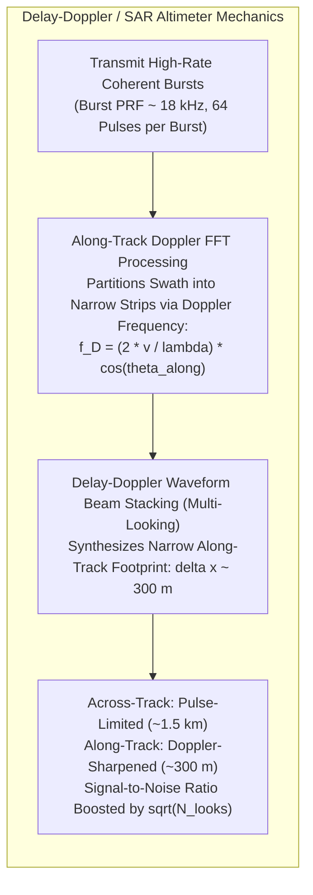
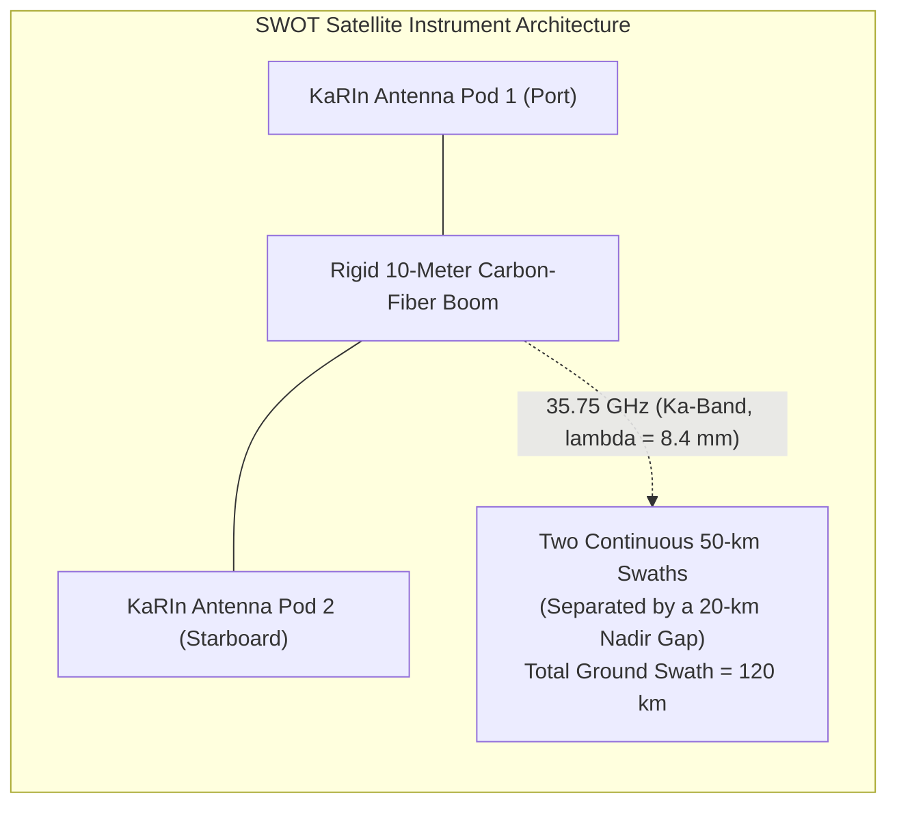

## 11.2 Satellite Radar Altimetry and Swath Interferometric Altimetry

While vessel-mounted echosounders and airborne systems map local swaths, spaceborne satellite radar altimeters provide the global vertical reference frame that unifies Earth's oceans, ice sheets, and continental water bodies. Over the past five decades, satellite altimetry has evolved from coarse, circular-footprint pulse-limited sounders into high-rate delay-Doppler (SAR) altimeters and wide-swath radar interferometers.

---

### 11.2.1 Classical Pulse-Limited Altimetry and the Brown Waveform Model

Classical satellite radar altimeters—pioneered by NASA's **GEOS-3 (1975)**, **SEASAT (1978)**, the U.S. Navy's **GEOSAT (1985)**, and the joint NASA/CNES **TOPEX/Poseidon (1992)** and **Jason-1/2/3** series—transmit brief microwave chirps ($13.6\text{ GHz}$ Ku-band, pulse duration $\tau \approx 3.125\text{ ns}$, pulse bandwidth $B \approx 320\text{ MHz}$) directed strictly toward nadir.

#### Pulse-Limited vs. Beam-Limited Geometry
A satellite radar antenna in low Earth orbit ($H \approx 800\text{–}1336\text{ km}$) has an antenna beamwidth of $\theta_{\text{beam}} \approx 1.0^\circ\text{–}1.5^\circ$, which projects a wide **beam-limited footprint** of diameter $D_{\text{beam}} = 2 H \tan(\theta_{\text{beam}} / 2) \approx 20\text{–}35\text{ km}$ onto the Earth's surface. 

However, because the radar pulse is exceptionally short ($\tau \approx 3.125\text{ ns}$), the spatial resolution is governed not by the beamwidth, but by the duration of the pulse itself. The spherical shell of microwave energy illuminates an expanding circle on the sea surface. The maximum area illuminated before the trailing edge of the pulse shell leaves the surface defines the **pulse-limited footprint radius ($r_p$)**:

$$r_p = \sqrt{c \, \tau \, H}$$

$$D_{\text{pulse}} = 2 \sqrt{c \, \tau \, H}$$

For $H = 1336\text{ km}$ (TOPEX/Jason orbit) and $\tau = 3.125\text{ ns}$, the pulse-limited footprint diameter is only $D_{\text{pulse}} \approx 2.2\text{ km}$—vastly smaller than the $30\text{ km}$ beam footprint! Over a wave-roughened sea of significant wave height $H_{1/3} = H_s$, the effective pulse duration stretches to $\tau_{\text{eff}} = \sqrt{\tau^2 + (2 H_s / c)^2}$, expanding the pulse-limited footprint up to $5\text{–}8\text{ km}$.

#### The Brown Analytical Ocean Waveform Model
The power reflected back to the satellite detector as a function of time forms a distinctive echo profile known as the **Brown Ocean Waveform** (Brown, 1977):

The analytical return power $P(t)$ is formulated as the convolution of the radar point target response $S(t)$, the flat-surface impulse response $I(t)$, and the sea-surface elevation probability density function $q(z)$:

$$P(t) = S(t) * I(t) * q(t)$$

Under the Gaussian surface elevation assumption ($q(z) \sim \mathcal{N}(0, \sigma_s^2)$):

$$P(t) = \frac{P_0}{2} \exp\left[-\frac{4}{\gamma}\left(\frac{c(t - \tau_0)}{2H}\right)\right] \left[1 + \text{erf}\left(\frac{t - \tau_0}{\sqrt{2}\sigma_c}\right)\right]$$

where:
* $\tau_0$ is the exact epoch of the leading-edge midpoint, providing the true two-way travel time range $R = c \tau_0 / 2$.
* $\sigma_c = \sqrt{\sigma_p^2 + (2\sigma_s / c)^2}$ is the composite rise-time parameter, directly encoding Significant Wave Height ($H_s = 4\sigma_s$).
* $P_0$ is the backscatter amplitude, proportional to the radar cross-section $\sigma^0$ and surface wind speed $U_{10}$.
* $\gamma$ is an antenna beamwidth parameter governing the exponential decay of the trailing edge.

#### Waveform Retracking Over Continental Ice Sheets and Inland Water
Over open oceans, the Brown model matches physical observations with sub-centimeter fidelity. However, when the radar pulse illuminates complex non-homogeneous terrain—such as sloping polar ice sheets, sea ice leads, coastal zones, or narrow inland rivers—the returning waveform distorts into multi-peaked, chaotic profiles where the Brown model fails catastrophically.

To extract valid elevations, hydrographers apply specialized **waveform retrackers**:
1. **Offset Center of Gravity (OCOG / Ice-1):** Computes the center of gravity and total area of the waveform box, setting the threshold at a fixed percentage ($50\%$) of the box amplitude. Highly robust over rugged glacial topography.
2. **Threshold Retracker:** Positions the range epoch at a fixed fraction (e.g., $10\%, 20\%, \text{or } 50\%$) of the first peak amplitude. The $10\%\text{–}20\%$ threshold is optimal over inland lakes and rivers because it locks onto the first specular water glint while rejecting delayed reflections from surrounding tree canopies or riverbanks.
3. **Beta-Parameter / Functional Retrackers:** Fits flexible 5-to-9-parameter mathematical functions (Martin et al., 1983) that model multiple distinct reflection peaks originating from heterogeneous terrain within the footprint.

---

### 11.2.2 Delay-Doppler (SAR-Mode) Altimetry

The fundamental physical constraint of classical altimetry is its isotropic circular footprint ($2\text{–}5\text{ km}$), which smears together land and water returns within $10\text{ km}$ of any coastline.

In 1999, Keith Raney conceived **Delay-Doppler Altimetry** (also termed **SAR-Mode Altimetry**), first launched on ESA's **CryoSat-2 (2010)** and operationalized on **Sentinel-3 (2016)** and **Sentinel-6 Michael Freilich (2020)**.

By maintaining phase coherence across a burst of 64 pulses transmitted at an ultra-high pulse repetition frequency ($\text{PRF} \approx 18\text{ kHz}$), the processor applies an along-track Doppler Fast Fourier Transform (FFT). Because the satellite's forward velocity ($v \approx 7.5\text{ km/s}$) induces a Doppler shift $f_D = (2v/\lambda)\cos\theta_{\text{along}}$, each Doppler bin isolates a narrow strip of terrain on the ground.

* **Along-Track Footprint Reduction:** The along-track footprint collapses from $5{,}000\text{ m}$ down to **$\approx 300\text{ m}$**.
* **Coherence & Noise Reduction:** Energy from consecutive bursts illuminating the same $300\text{ m}$ ground patch is accumulated into a "multi-looked" delay-Doppler stack, boosting the signal-to-noise ratio by $\sqrt{N_{\text{looks}}}$ and cutting range noise in half ($\sigma_R < 1.0\text{ cm}$).
* **Hydrologic Revolution:** SAR altimeters can track water surface elevations (WSE) along narrow rivers ($> 100\text{–}200\text{ m}$ wide), reservoir levels, and fracture leads through Arctic sea ice that were previously invisible to conventional radar.

---

### 11.2.3 Wide-Swath Radar Interferometry: The SWOT Mission

On December 16, 2022, the **Surface Water and Ocean Topography (SWOT)** satellite—a joint partnership between NASA, CNES (the French Space Agency), the Canadian Space Agency (CSA), and the UK Space Agency—was launched into an $890\text{ km}$ orbit ($77.6^\circ$ inclination). SWOT inaugurates a new paradigm in satellite geodesy: **Wide-Swath Radar Interferometry**.

#### The Ka-Band Radar Interferometer (KaRIn)
SWOT's primary payload is **KaRIn (Ka-band Radar Interferometer)**, which operates at $f = 35.75\text{ GHz}$ ($\lambda \approx 8.4\text{ mm}$):
* **Baseline Geometry:** Two synthetic aperture radar antennas are mounted on the ends of an ultra-rigid $10.0\text{ m}$ carbon-fiber mast, looking sideways at incidence angles between $\theta = 0.5^\circ\text{ and }4.5^\circ$.
* **Two-Dimensional Surface Elevation:** Unlike 1D nadir altimeter tracks, KaRIn maps two continuous $50\text{ km}$ wide swaths simultaneously, resolving a $120\text{ km}$ wide corridor with a $20\text{ km}$ gap directly beneath the spacecraft (profiled by a traditional nadir dual-frequency altimeter).
* **Millimetric Wavelength Physics:** Operating at Ka-band reduces the ionospheric phase delay to near-zero and provides extreme interferometric phase sensitivity ($\Delta\phi / \Delta z \propto 1/\lambda$), enabling water surface elevation measurements with a vertical precision of **$\pm 1\text{–}3\text{ cm}$ over ocean averages** and sub-decimeter accuracy over continental water bodies.

#### Global Hydrology and Ocean Topography Deliverables
1. **Continental Terrestrial Hydrology:** SWOT measures the Water Surface Elevation (WSE), width ($W$), and longitudinal slope ($S = \partial z / \partial x$) of all rivers wider than $50\text{–}100\text{ m}$ globally, and maps storage variations in over $6\text{ million}$ lakes and reservoirs larger than $250\text{ m} \times 250\text{ m}$ ($6.25\text{ hectares}$). By observing $W, z,$ and $S$ simultaneously, hydrologists solve Manning's equation to invert river discharge ($Q\text{ in m}^3/\text{s}$) globally from space without requiring local river gauges.
2. **Mesoscale and Submesoscale Ocean Eddies:** SWOT resolves ocean surface circulation down to spatial wavelengths of $15\text{ km}$ ($10\times$ finer than conventional altimeter constellations), mapping the submesoscale kinetic energy dissipation, heat transport, and ocean carbon uptake driven by swirling oceanic eddies.
3. **Marine Geophysics and Bathymetry:** The ultra-dense, two-dimensional sea-surface slope grids provided by SWOT are fundamentally revolutionizing satellite-derived marine gravity models, resolving uncharted submarine seamounts, fracture zone offsets, and abyssal hill fabric with unprecedented clarity.

---

### 11.2.4 Master Comparison Matrix of Satellite Altimetry Missions

| Mission | Agency & Era | Frequency Band | Sensor Architecture | Nominal Footprint | Vertical Precision ($1\sigma$) | Primary Scientific Products |
| :--- | :--- | :--- | :--- | :--- | :--- | :--- |
| **GEOSAT** | US Navy (1985–1990) | Ku-band ($13.5\text{ GHz}$) | Classical Pulse-Limited | Circular ($2\text{–}7\text{ km}$) | $\approx 3.5\text{ cm}$ | Global marine gravity field, geoid modeling, naval oceanography. |
| **TOPEX/Poseidon** | NASA / CNES (1992–2005)| Dual Ku/C ($13.6/5.3\text{ GHz}$)| Dual-Freq Pulse-Limited | Circular ($2\text{–}5\text{ km}$) | $\approx 2.0\text{ cm}$ | Global sea level rise ($3.3\text{ mm/yr}$), ocean circulation, tide models. |
| **Jason-1/2/3** | NASA / CNES / NOAA / EUM | Dual Ku/C ($13.6/5.3\text{ GHz}$)| Dual-Freq Pulse-Limited | Circular ($2\text{–}5\text{ km}$) | $\approx 1.5\text{ cm}$ | Unbroken climate sea-level record, operational wave/wind forecasting. |
| **CryoSat-2** | ESA (2010–Present) | Ku-band ($13.575\text{ GHz}$) | SIRAL (SAR & SARIn Mode) | $300\text{ m}$ along $\times 1.5\text{ km}$ | $\approx 1.0\text{ cm}$ | Polar ice sheet elevation, sea ice freeboard/thickness, coastal fringes. |
| **Sentinel-3 SRAL** | ESA / Copernicus (2016–) | Dual Ku/C ($13.6/5.4\text{ GHz}$)| SAR-Mode Delay-Doppler | $300\text{ m}$ along $\times 1.5\text{ km}$ | $\approx 1.0\text{ cm}$ | Operational ocean topography, inland river/lake water surface elevation. |
| **Sentinel-6 MF** | ESA / NASA / NOAA (2020–) | Dual Ku/C ($13.6/5.4\text{ GHz}$)| Interleaved SAR / P-L | $300\text{ m}$ along $\times 1.5\text{ km}$ | $< 0.8\text{ cm}$ | Reference climate altimetry standard, seamlessly bridging P-L and SAR modes. |
| **SWOT** | NASA / CNES (2022–) | Ka-band ($35.75\text{ GHz}$) | KaRIn Wide-Swath InSAR | $10\text{–}50\text{ m}$ resolved pixels | $\approx 1.5\text{ cm}$ (ocean avg) | 2D river discharge, lake water storage, ocean submesoscale eddies, marine gravity. |
