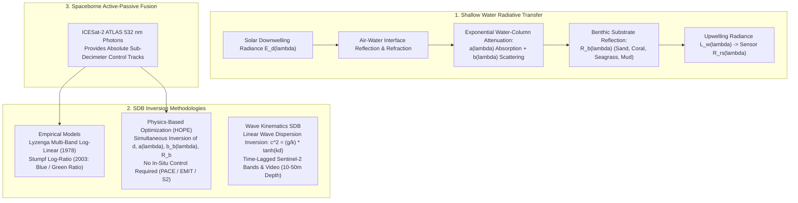
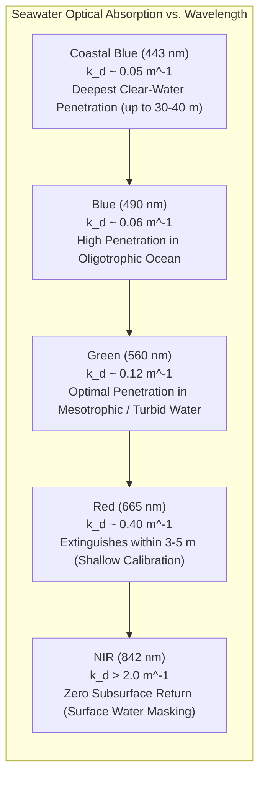
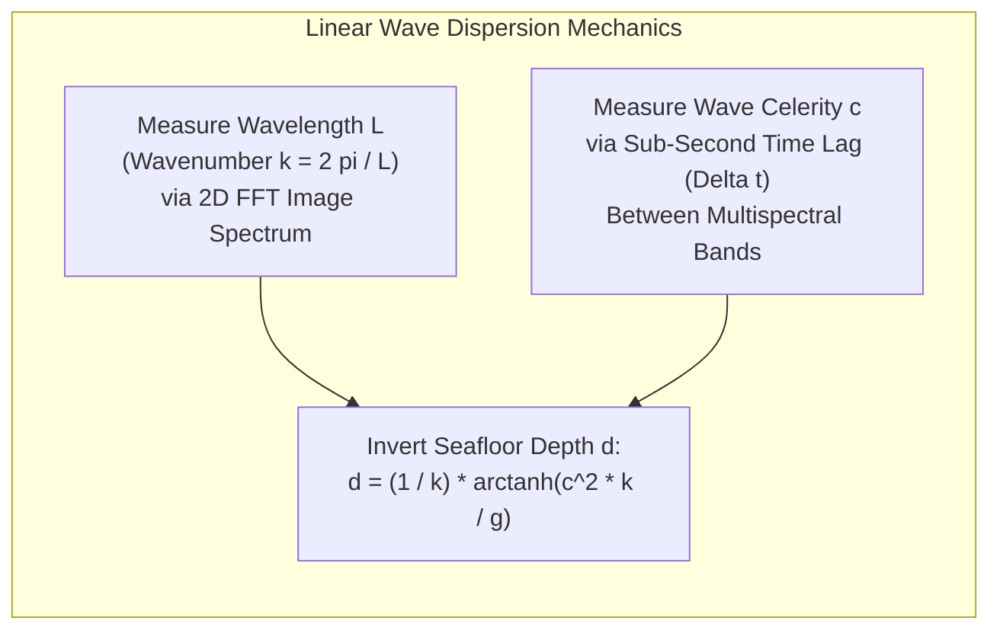
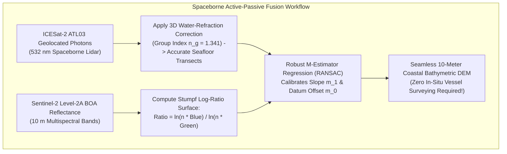

## 11.3 Satellite-Derived Bathymetry (SDB) from Optical Imagery

In shallow coastal waters, coral reefs, and remote archipelagos, shipboard acoustic surveys are severely constrained by navigation hazards, breaking surf, and prohibitive operational costs. Satellite-Derived Bathymetry (SDB) overcomes these barriers by inverting multi-spectral and hyperspectral satellite imagery into high-resolution, three-dimensional bathymetric Digital Elevation Models across depths from $0\text{ to }30\text{ m}$.

---

### 11.3.1 Optical Radiative Transfer Physics in Shallow Water

The spectral radiance reaching an orbital optical sensor looking at a clear water body is governed by radiative transfer through the atmosphere, air-water boundary, water column, and benthic substrate. 

After removing atmospheric Rayleigh scattering and aerosol radiance via atmospheric correction (deriving the remote-sensing reflectance $R_{rs}(\lambda)$ just above the water surface), the shallow-water radiative transfer equation is formulated as:

$$R_{rs}(\lambda) \approx R_\infty(\lambda) + \left[R_b(\lambda) - R_\infty(\lambda)\right] \exp\left[-2 K_d(\lambda) d\right]$$

where:
* $\lambda$ is optical wavelength.
* $d$ is water depth (positive downward).
* $R_{rs}(\lambda)$ is the observed remote-sensing reflectance ($\text{sr}^{-1}$).
* $R_\infty(\lambda)$ is the reflectance of optically deep water (where the seafloor is too deep to contribute to surface radiance, $d \to \infty$).
* $R_b(\lambda)$ is the intrinsic albedo (reflectance) of the benthic substrate (e.g., bright carbonate sand vs. dark coral or seagrass).
* $K_d(\lambda)$ is the diffuse attenuation coefficient ($\text{m}^{-1}$) of downwelling and upwelling irradiance. The factor of 2 accounts for the two-way optical path down to the seabed and back to the surface.

Because pure water absorbs red and near-infrared (NIR) wavelengths orders of magnitude more strongly than blue and green light ($a_w(842\text{ nm}) \approx 4.0\text{ m}^{-1}$ vs. $a_w(490\text{ nm}) \approx 0.015\text{ m}^{-1}$), the ratio of returning blue-to-green energy shifts predictably as water depth increases.

---

### 11.3.2 Empirical Inversion Models: Lyzenga and Stumpf

Empirical models parameterize the relationship between log-transformed spectral reflectances and water depth, calibrating regression coefficients against sparse in-situ depth soundings (e.g., electronic charts, acoustic cross-lines, or spaceborne LiDAR).

#### 1. The Lyzenga Multi-Band Log-Linear Model (1978, 1985)
Lyzenga established that subtracting the deep-water radiance $R_\infty(\lambda)$ linearizes the exponential attenuation equation:

$$X_i = \ln\left[R_{rs}(\lambda_i) - R_\infty(\lambda_i)\right] = \ln\left[R_b(\lambda_i) - R_\infty(\lambda_i)\right] - 2 K_d(\lambda_i) d$$

By combining $N$ optical bands (typically Coastal Blue, Blue, Green, and Red) into a multilinear regression, the Lyzenga model accounts for bottom albedo variations across multi-colored substrates:

$$d = a_0 + \sum_{i=1}^{N} a_i X_i = a_0 + a_1 X_{\text{blue}} + a_2 X_{\text{green}} + a_3 X_{\text{red}}$$

where $a_0, a_1, \dots, a_N$ are empirically fitted regression coefficients.

#### 2. The Stumpf Log-Ratio Model (2003)
While the Lyzenga model is robust, it fails when the observed radiance approaches or drops below the deep-water threshold ($R_{rs} \le R_\infty$), producing undefined logarithms. Furthermore, negative coefficients can cause severe instability over dark seagrass beds.

To solve this, Stumpf et al. (2003) formulated the **Log-Ratio Model**:

$$d = m_1 \frac{\ln\left[n \, R_{rs}(\lambda_1)\right]}{\ln\left[n \, R_{rs}(\lambda_2)\right]} - m_0$$

where:
* $\lambda_1$ is a low-attenuation band (typically Blue $\sim 490\text{ nm}$ or Coastal Blue $\sim 443\text{ nm}$).
* $\lambda_2$ is a higher-attenuation band (typically Green $\sim 560\text{ nm}$).
* $n$ is a constant scaling parameter (typically $n = 500\text{ or }1000$) chosen to ensure the argument of the logarithm remains strictly positive ($n R_{rs} > 1$) across all pixels.
* $m_1$ is an empirical scaling slope, and $m_0$ is a vertical datum offset.

**Why the Log-Ratio Cancels Bottom Albedo:** As water depth increases, reflectance in the higher-attenuation green band drops much faster than reflectance in the blue band. Because both bands observe the identical physical patch of seabed, changes in benthic albedo (e.g., transitioning from bright sand to dark seagrass) affect both bands proportionally in the numerator and denominator, canceling out substrate color variations and preventing dark vegetation patches from appearing as artificial submarine abysses!

---

### 11.3.3 Physics-Based Optimization (Hyperspectral Radiative Transfer Inversion)

Empirical models suffer from a fundamental vulnerability: they require in-situ bathymetric calibration data. In remote, inaccessible, or militarily denied coastlines, empirical control is unavailable.

**Physics-Based Radiative Transfer Inversion** (exemplified by the **HOPE** model; Lee et al., 1999) eliminates the need for ground truth. Utilizing the full continuous spectrum of hyperspectral (or high-dimensional multispectral) imagery (e.g., Sentinel-2, PlanetScope, NASA EMIT, NASA PACE), the algorithm inverts the forward optical radiative transfer model simultaneously across all bands via non-linear Levenberg-Marquardt optimization:

$$\min_{d, P, G, B} \sum_{\lambda} \left[ R_{rs}^{\text{measured}}(\lambda) - R_{rs}^{\text{model}}(\lambda; d, P, G, B) \right]^2$$

where the optimization simultaneously solves for:
1. **Water Depth ($d$):** True bathymetric elevation.
2. **Phytoplankton Chlorophyll ($P$):** Water-column absorption by phytoplankton pigments.
3. **Colored Dissolved Organic Matter and Detritus ($G$):** CDOM absorption ($a_g(\lambda) = G \exp[-S_g(\lambda - 440)]$).
4. **Benthic Bottom Albedo ($B$):** A linear mixture of pure endmember spectra (e.g., $100\%$ carbonate sand, $100\%$ healthy coral, $100\%$ green seagrass).

---

### 11.3.4 Wave-Kinematics SDB: Inverting Ocean Wave Dispersion

In turbid waters where high suspended sediment concentrations extinguish optical penetration beyond $2\text{–}3\text{ m}$, radiative transfer models fail. However, ocean surface gravity waves remain visible on high-resolution satellite imagery.

By the **linear surface gravity wave dispersion relation** (Airy wave theory):

$$\omega^2 = g k \tanh(k d)$$

where $\omega = 2\pi f = 2\pi c / L$ is wave angular frequency, $k = 2\pi / L$ is wavenumber, $c = L / T$ is wave phase celerity, and $g = 9.80665\text{ m/s}^2$ is gravitational acceleration. Solving explicitly for water depth $d$:

$$d = \frac{1}{k} \text{arctanh}\left(\frac{c^2 k}{g}\right) = \frac{L}{2\pi} \text{arctanh}\left(\frac{2\pi c^2}{g L}\right)$$

In shallow coastal waters ($d < L/2$), wave speed is directly modulated by seafloor depth: as waves enter shallow water, their celerity slows down ($c \approx \sqrt{g d}$) and their wavelength compresses. By measuring wave crest positions across time-lagged multispectral bands (e.g., the $0.5\text{–}2.0\text{ second}$ inter-detector band delay in Sentinel-2 or WorldView-2), wave-kinematics algorithms (`cBathy`, `S2-WaveBathy`) invert continuous bathymetry across depths of **$5\text{ to }50\text{ m}$ in turbid waters** completely independently of optical water clarity!

---

### 11.3.5 Spaceborne Active-Passive Fusion: ICESat-2 + SDB

The foremost modern breakthrough in operational SDB is the fusion of spaceborne green ($532\text{ nm}$) photon-counting LiDAR from **ICESat-2 (ATLAS)** with multi-spectral optical imagery (Sentinel-2 and PlanetScope; Parrish et al., 2019; Forfinski-Sarkozi & Parrish, 2020).

1. **Active Photon Control:** As ICESat-2 orbits over clear coastal waters, its $532\text{ nm}$ laser penetrates the water column, recording millions of geolocated photon returns from both the sea surface and the seafloor down to $30\text{–}40\text{ m}$. After applying 3D Snell refraction corrections, these photons provide millimeter-precision vertical depth benchmarks along narrow 1D ground tracks.
2. **Passive Multi-Spectral Extrapolation:** The Stumpf log-ratio or Lyzenga multi-band model is applied across the 2D spatial extent of a cloud-free Sentinel-2 or WorldView image.
3. **Automated Dynamic Calibration:** The algorithm automatically matches the ICESat-2 photon depths with the overlying optical log-ratio pixel values, solving the regression parameters ($m_1, m_0$) via RANSAC.
4. **Global Impact:** This active-passive synergy enables the automated generation of validated, decimeter-accurate coastal bathymetric DEMs across millions of square kilometers of previously uncharted island groups, coral atolls, and shallow navigation straits worldwide.

---

### 11.3.6 Catastrophic SDB Failure Modes and Quality Filters

| Failure Mode | Physical Mechanism | Resulting DEM Artifact | Detection & Mitigation Strategy |
| :--- | :--- | :--- | :--- |
| **Optical Extinction Depth ($d > 1.5 Z_{\text{secchi}}$)** | Attenuation absorbs all benthic photons; signal drops to deep-water noise $R_\infty$. | False flat plateaus or noise spikes at the optical limit ($15\text{–}30\text{ m}$). | Mask pixels where $R_{rs}(\lambda) \le R_\infty(\lambda) + 3\sigma_{\text{deep}}$; assign `NoData` beyond extinction depth. |
| **Turbidity & Sediment Plumes** | Suspended silt/clay particles scatter green/red light, mimicking a shallow bottom. | Turbidity plumes appear as false shallow shoals or phantom islands in deep water. | Audit water-column diffuse attenuation ($K_d(490)$); mask river mouths using turbidity indices. |
| **Subsurface Benthic Albedo Shifts** | Isolated dark kelp beds or deep mud patches absorb all light in single-band models. | Dark patches appear as deep holes or bathymetric depressions. | Use Stumpf band-ratio models; apply physics-based spectral unmixing (HOPE) to isolate bottom type. |
| **Sun Glint & Wave Facets** | Specular reflection of solar disk from surface capillary waves saturates detectors. | Striped artifacts or massive depth over-estimation. | Apply NIR-based sunglint deglinting algorithms (Hedley et al., 2005) prior to SDB processing. |
| **Cloud & Ship Shadows** | Clouds cast shadows on sea surface, reducing downwelling radiance $E_d(\lambda)$. | Shadows appear as narrow, steep submarine chasms and trenches. | Mask cloud shadows using morphological cloud-projection buffers; fuse multi-temporal imagery. |
