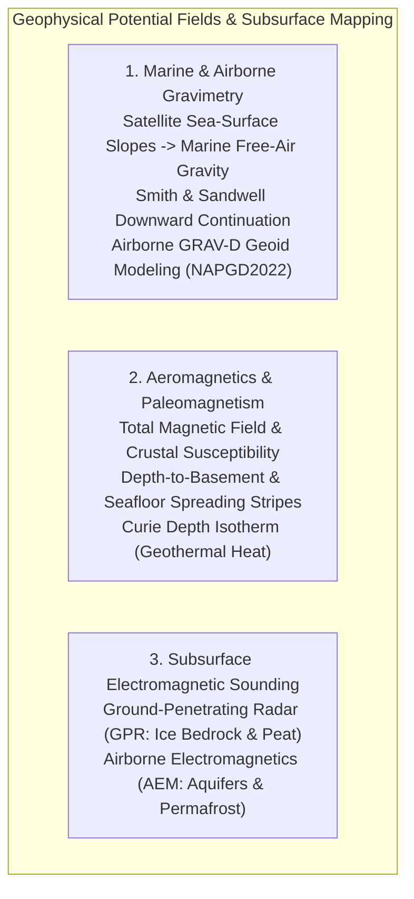
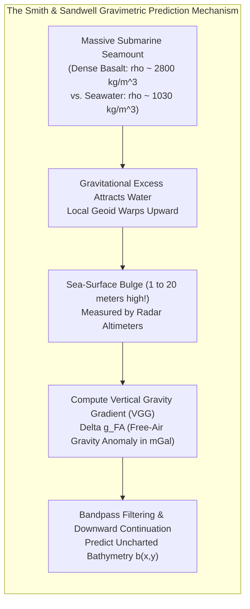
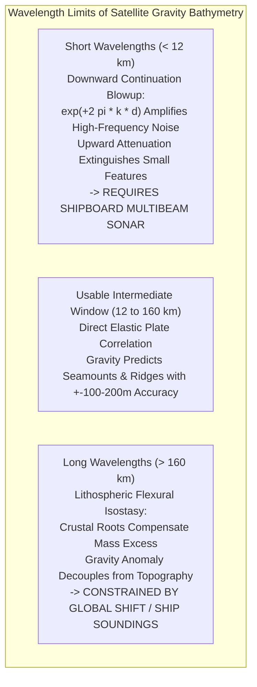
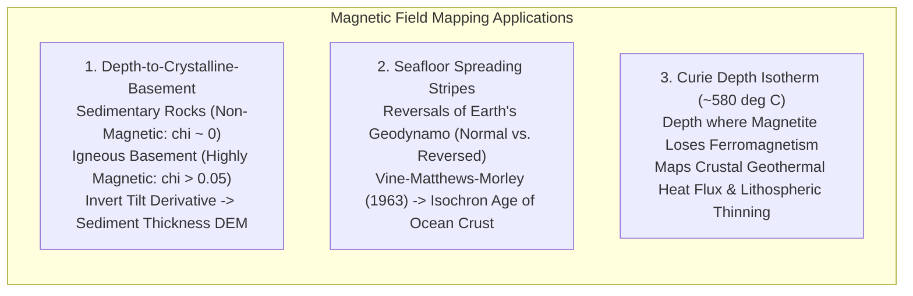

## 11.4 Using Other Data to Help Mapping: Gravity, Magnetics, and Seismic

Direct acoustic and optical remote sensing can only observe interfaces that actively reflect sound or light. However, the true three-dimensional structure of the Earth—from the bedrock hidden beneath deep marine sediments and polar ice sheets to the global marine geoid—can be illuminated by integrating auxiliary geophysical potential fields: planetary gravity, crustal magnetism, and electromagnetic sounding.

---

### 11.4.1 Marine Bathymetry from Satellite Altimetry Gravity: The Smith & Sandwell Method

Less than $25\%$ of the global ocean seafloor has been sounded by shipboard multibeam echosounders. The remaining $75\%$ of global bathymetric Digital Elevation Models (such as GEBCO, SRTM15+, and ETOPO) is predicted from **satellite radar altimetry marine gravity**, formulated by Walter H. F. Smith and David T. Sandwell (1994, 1997).

#### The Physical Mechanism: Gravitational Sea-Surface Mounds
A massive submarine topographic feature—such as an undersea seamount, volcanic ridge, or oceanic trench—represents a large lateral mass excess or deficit relative to surrounding seawater ($\Delta\rho = \rho_{\text{rock}} - \rho_{\text{water}} \approx 2800 - 1030 = 1770\text{ kg/m}^3$). 

By Newton's law of universal gravitation, this excess rock mass exerts an extra lateral gravitational pull on the surrounding ocean. Water is an incompressible fluid that responds to gravity by flowing laterally until it achieves hydrostatic equilibrium along an equipotential surface of the Earth's gravity field (the **marine geoid**). Consequently, every submarine seamount pulls ocean water toward it, creating a permanent **sea-surface mound or "bump"** directly above the summit!
* A $2000\text{ m}$ tall seamount resting on the abyssal plain creates a subtle, broad sea-surface bulge measuring **$1\text{ to }5\text{ m}$ in height** spanning $20\text{–}50\text{ km}$ across.
* An oceanic trench (a mass deficit) causes the sea surface to dip into an elongated trough.

Spaceborne radar altimeters (GEOSAT, ERS-1, CryoSat-2, SARAL, Sentinel-6, and SWOT) measure these minute sea-surface undulations with sub-centimeter precision along global orbital ground tracks.

#### Mathematical Inversion: Downward Continuation and Isostatic Filtering
Converting the observed sea-surface slopes into seafloor topography requires inverting the gravitational potential field from the ocean surface down to the seabed. Under Parker's (1973) potential field equation, the Fourier transform of the free-air gravity anomaly $\Delta g(\mathbf{k})$ over topography $b(\mathbf{x})$ of average depth $d$ is:

$$\mathcal{F}[\Delta g](\mathbf{k}) = 2\pi G \, \Delta\rho \, e^{-2\pi |\mathbf{k}| d} \, \mathcal{F}[b](\mathbf{k})$$

where $G = 6.674 \times 10^{-11}\text{ m}^3\text{ kg}^{-1}\text{s}^{-2}$ is the gravitational constant, $\mathbf{k} = (k_x, k_y)$ is the 2D spatial wavenumber vector ($|\mathbf{k}| = 1 / \lambda$), and $\Delta\rho \approx 1770\text{ kg/m}^3$.

Solving directly for the topography yields the **downward continuation relation**:

$$\mathcal{F}[b](\mathbf{k}) = \frac{e^{2\pi |\mathbf{k}| d}}{2\pi G \, \Delta\rho} \, \mathcal{F}[\Delta g](\mathbf{k})$$

#### The Fundamental Wavelength Window ($12\text{ to }160\text{ km}$)
The downward continuation equation reveals two physical barriers that strictly limit gravity-predicted bathymetry to an intermediate bandpass window ($\lambda \in [12, 160]\text{ km}$):

1. **Short-Wavelength Attenuation ($\lambda < 12\text{ km}$):** The term $e^{-2\pi |\mathbf{k}| d}$ represents upward attenuation through the water column. In an ocean $d = 4000\text{ m}$ deep, topographic variations with wavelengths shorter than $12\text{ km}$ attenuate by $>90\%$ before reaching the surface. Inverting this requires multiplying by $e^{+2\pi |\mathbf{k}| d}$, which catastrophically amplifies altimeter measurement noise. Consequently, **gravity cannot resolve features smaller than $\approx 12\text{ km}$**; fine abyssal hills, fault scarps, and navigational hazards can only be mapped by shipboard multibeam sonars.
2. **Long-Wavelength Isostatic Compensation ($\lambda > 160\text{ km}$):** Large, broad topographic structures (oceanic plateaus, mid-ocean ridge flanks) are supported by regional **lithospheric flexural isostasy** (buoyant crustal roots penetrating downward into the mantle). The negative mass of the deep crustal root gravimetrically cancels the positive mass of the surface ridge, causing the regional free-air gravity anomaly to approach zero. Therefore, regional ocean depths must be constrained by sparse, direct shipboard acoustic soundings.

#### Operational Global Compilation (SRTM15+ and GEBCO)
Modern global marine elevation models (e.g., SRTM15+; Tozer et al., 2019) fuse both domains:
* Direct, calibrated multibeam and single-beam soundings provide high-resolution "truth" along survey tracks.
* The satellite altimetry gravity grid is used as a smooth, continuous predictive surface to interpolate across the vast uncharted gaps between ship tracks.

---

### 11.4.2 Airborne Gravimetry and the Gravimetric Geoid (NOAA GRAV-D)

On land, high-precision GNSS positioning measures ellipsoidal height ($h$). However, water flows according to gravity (orthometric height $H$). Bridging the two requires an ultra-precise model of the geoid undulation $N$:

$$H = h - N$$

To eliminate the legacy meter-level errors of the leveling-based North American Vertical Datum of 1988 (NAVD88), NOAA's National Geodetic Survey (NGS) executed the **Gravity for the Redefinition of the American Vertical Datum (GRAV-D)** project.

Operating high-precision marine/airborne relative gravimeters and strapdown inertial sensors aboard survey aircraft flown at $20{,}000\text{ ft}$ along $10\text{ km}$ grid lines across the United States and its coastal territories, GRAV-D measured the Earth's gravity field to $1.5\text{ mGal}$ accuracy. Ingested into spherical harmonic boundary-value models, GRAV-D yields the **North American-Pacific Geopotential Datum of 2022 (NAPGD2022)**, establishing a zero-elevation geoid reference surface accurate to **$\pm 1\text{ cm}$**, allowing hydrologists to convert GNSS drone and aircraft elevations directly into flood-routing orthometric DEMs.

---

### 11.4.3 Aeromagnetics, Paleomagnetism, and Crustal Basement Depth

Magnetic surveys measure spatial anomalies in the Earth's total magnetic field ($\mathbf{B}$) caused by variations in the magnetic susceptibility ($\chi$) and remanent magnetization ($\mathbf{M}_r$) of crustal rocks.

#### Depth-to-Basement Inversion
In sedimentary basins and coastal margins, sedimentary strata (sandstone, limestone, shale) are virtually non-magnetic ($\chi \approx 0$). In contrast, underlying crystalline igneous and metamorphic basement rocks contain significant concentrations of magnetite ($\text{Fe}_3\text{O}_4$), exhibiting high magnetic susceptibility ($\chi \approx 0.01\text{–}0.10\text{ SI}$).

By computing the **horizontal tilt angle derivative** or applying Euler deconvolution to high-resolution aeromagnetic grids:

$$\theta_{\text{tilt}} = \arctan\left(\frac{\partial T / \partial z}{\sqrt{(\partial T / \partial x)^2 + (\partial T / \partial y)^2}}\right)$$

geophysicists map the 3D depth to the crystalline basement ($z_{\text{basement}}$). Subtracting the basement surface from the modern topographic DEM yields the **total sedimentary thickness**, which is vital for earthquake ground-motion amplification models, groundwater basin hydrogeology, and carbon sequestration reservoirs.

---

### 11.4.4 Ground-Penetrating Radar (GPR) and Airborne Electromagnetics (AEM)

Where DEMs must resolve boundaries beneath solid ground or ice, electromagnetic sounding provides non-invasive subsurface imaging:

1. **Ground-Penetrating Radar (GPR):** Transmits high-frequency pulsed electromagnetic waves ($10\text{ MHz to }2.5\text{ GHz}$) into the ground, recording reflections caused by sharp discontinuities in relative dielectric permittivity ($\epsilon_r$).
   * *Glaciology & Ice Sheets:* Because clean meteoric ice has low conductivity ($\sigma \approx 10^{-5}\text{ S/m}, \epsilon_r \approx 3.15$), radar waves penetrate thousands of meters through ice sheets (e.g., NASA Operation IceBridge, CReSIS airborne radar depth sounders). Inverting travel times yields the **subglacial bedrock topography DEM** (e.g., BedMachine Antarctica / Greenland; Morlighem et al., 2020), which governs global ice sheet collapse and sea level rise projections.
   * *Peatland & Permafrost:* GPR maps the active thaw layer depth above permafrost and the true mineral substrate beneath compressible peat bogs.
2. **Airborne Electromagnetic (AEM) Sounding:** Helicopter-slung or fixed-wing transmitter loops broadcast low-frequency electromagnetic fields ($25\text{ Hz to }100\text{ kHz}$), inducing eddy currents in the conductive subsurface that are detected by receiver coils.
   * *Hydrogeologic Architecture:* Resolves electrical resistivity profiles ($\rho_{\text{res}} \in [1, 1000]\,\Omega\cdot\text{m}$) down to $300\text{–}500\text{ m}$ depth, mapping freshwater-saltwater interfaces in coastal aquifers, clay confining aquitards, and buried paleochannels that control subterranean groundwater routing.
