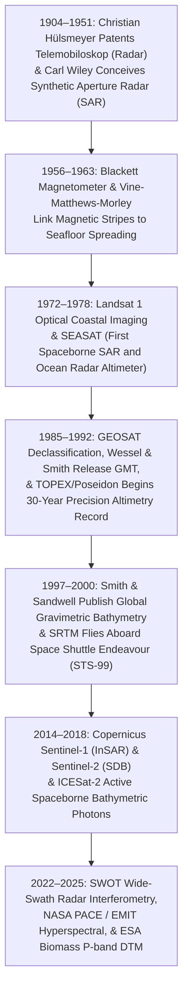

## 11.5 Historical Evolution (`gis-history` Context)

The capability to map Earth's surface through microwaves, optical radiance, and planetary potential fields represents one of the crowning scientific achievements of the twentieth and twenty-first centuries. Grounded in milestones curated in [`schwehr/gis-history`](https://github.com/schwehr/gis-history), the history of radar, spaceborne altimetry, potential fields, and satellite-derived bathymetry illustrates the transition from military reconnaissance sensors into free, open, global Earth observation infrastructure.

---

### 11.5.1 1904–1951: The Genesis of Radar and Synthetic Aperture Processing (`gis-history`)

#### 1904: Christian Hülsmeyer and the *Telemobiloskop*
On April 30, 1904, German inventor Christian Hülsmeyer was granted patent DE 165546 for the **Telemobiloskop**—the world's first operational radar device. Designed to prevent ship collisions in dense river fog, Hülsmeyer bounced spark-gap electromagnetic radio waves off ship hulls and detected the returning echo with a coherer. While early military radar (developed intensively during World War II) relied on physical dish antennas to focus microwave energy, spatial resolution was strictly limited by antenna beamwidth ($\theta \propto \lambda / D$).

#### 1951: Carl Wiley and Synthetic Aperture Radar (SAR)
In June 1951, mathematician **Carl A. Wiley** of Goodyear Aircraft Corporation conceived a revolutionary mathematical insight: that forward motion of an aircraft creates a distinct Doppler frequency shift across the illuminated ground footprint ($f_D = 2v/\lambda \cos\theta$). By applying narrow Doppler bandpass filtering to the returned radar echoes, an imaging system could synthesize an effective antenna aperture hundreds of times longer than the physical antenna. Wiley termed this **Doppler Beam Sharpening**, patented in 1954 as the foundation of modern **Synthetic Aperture Radar (SAR)**.

---

### 11.5.2 1956–1963: Paleomagnetism and Seafloor Spreading Stripes (`gis-history`)

#### 1956: Patrick Blackett and the Astatic Magnetometer
In 1956, British physicist **Patrick Blackett** perfected the high-sensitivity **astatic magnetometer**, capable of detecting extremely weak remanent magnetization locked in ancient basaltic lava flows and marine sediments. Blackett's instruments established the discipline of paleomagnetism, demonstrating that rocks preserved the orientation of Earth's magnetic field at their time of cooling.

#### 1963: The Vine-Matthews-Morley Hypothesis
In 1963, Cambridge geophysicists **Fred Vine** and **Drummond Matthews** (and independently Canadian geophysicist **Lawrence Morley**) synthesized Marie Tharp's seafloor topography with geomagnetic reversals. They realized that as new magma erupts along mid-ocean ridge axial rifts and cools below the Curie temperature ($580^\circ\text{C}$ for magnetite), it permanently records the contemporary polarity of the Earth's magnetic field. 

As the seafloor spreads outward like a conveyor belt, periodic geomagnetic field reversals produce alternating bands of normal and reversed total magnetic intensity (TMI)—creating symmetric **"magnetic stripes"** flanking mid-ocean ridges. These magnetic stripes provided the definitive chronological tape recorder that calibrated global plate tectonic drift rates and mapped the age of the ocean crust.

---

### 11.5.3 1972–1978: Landsat 1 and the Golden Age of Spaceborne Sensors (`gis-history`)

#### 1972: Landsat 1 (ERTS-1) and Early Satellite-Derived Bathymetry
Launched on July 23, 1972, NASA's **Earth Resources Technology Satellite (ERTS-1 / Landsat 1)** carried the 4-band Multispectral Scanner System (MSS). In 1975, Fabian Polcyn at the Environmental Research Institute of Michigan (ERIM) demonstrated that Landsat MSS Band 4 (Green, $500\text{–}600\text{ nm}$) and Band 5 (Red, $600\text{–}700\text{ nm}$) penetrated clear tropical waters, deriving the first satellite-derived bathymetry over the Bahama Banks. This work culminated in David Lyzenga's landmark 1978 paper establishing the multi-band radiative transfer equations that remain central to coastal SDB today.

#### 1978: SEASAT—The Pioneer of Ocean Remote Sensing
Launched by NASA on June 27, 1978, **SEASAT** was the first civilian satellite dedicated to oceanographic remote sensing. Although a catastrophic electrical short ended the mission after only 106 days, SEASAT carried three revolutionary microwave sensors that transformed geodesy:
1. The first spaceborne civilian **L-band Synthetic Aperture Radar (SAR)**, proving that SAR could image surface topography, ocean waves, and sea ice from low Earth orbit.
2. A precision **Ku-band nadir radar altimeter**, which detected the gravitational sea-surface bulge over submarine seamounts, proving that spaceborne altimetry could map ocean floor geophysics.
3. A microwave scatterometer for ocean surface wind vectors.

---

### 11.5.4 1985–1992: GEOSAT Declassification, GMT, and TOPEX/Poseidon (`gis-history`)

#### 1985: The US Navy GEOSAT Mission
In March 1985, the U.S. Navy launched **GEOSAT** into an 800-km orbit to map the global marine geoid for submarine ballistic missile inertial guidance. In 1990 and 1995, following the collapse of the Soviet Union, the U.S. Department of Defense declassified the entire high-density GEOSAT Geodetic Mission dataset (featuring track line spacing $< 4\text{ km}$ at the equator). This declassification provided the raw global sea-surface slope observations that unlocked the deep ocean floor.

#### 1988: Generic Mapping Tools (GMT) Released
In 1988, PhD students **Paul Wessel** and **Walter H. F. Smith** at Lamont-Doherty Earth Observatory released the first public version of the **Generic Mapping Tools (GMT)**. Engineered in modular C, GMT introduced algorithms for continuous surface splines under tension (`surface`), 2D Fourier filtering, and postscript cartography. GMT became the universal computational engine used by marine geophysicists to process altimeter tracks, compute vertical gravity gradients, and interpolate global bathymetric grids.

#### 1992: TOPEX/Poseidon Begins the Climate Record
Launched on August 10, 1992, the joint NASA/CNES **TOPEX/Poseidon** mission established the gold-standard precision orbit ($1336\text{ km}$, $66^\circ$ inclination) and dual-frequency (Ku/C-band) ionosphere-corrected radar altimeter architecture. TOPEX/Poseidon measured sea surface heights with an absolute precision of $\pm 2\text{–}3\text{ cm}$, initiating an unbroken 30-year climate record (continued seamlessly by Jason-1, Jason-2, Jason-3, and Sentinel-6) that proved global mean sea level is rising at $\approx 3.3\text{ mm/year}$.

---

### 11.5.5 1997–2000: Smith & Sandwell and the SRTM Global DEM (`gis-history`)

#### 1997: Smith and Sandwell Global Bathymetric Map
In September 1997, Walter H. F. Smith and David T. Sandwell published *"Global Sea Floor Topography from Satellite Altimetry and Ship Depth Soundings"* in *Science*. By combining declassified GEOSAT altimetry with ESA ERS-1 geodetic tracks, Smith and Sandwell inverted the downward-continuation Poisson equation to predict bathymetry across every uncharted ocean basin between $72^\circ\text{N}$ and $72^\circ\text{S}$. The map revealed over 20,000 previously unknown volcanic seamounts, fracture zone offsets, and abyssal spreading fabrics, serving as the base topography for global ocean circulation and tsunami propagation models worldwide.

#### 2000: Shuttle Radar Topography Mission (SRTM)
On February 11, 2000, Space Shuttle *Endeavour* launched on mission **STS-99**, carrying the **Shuttle Radar Topography Mission (SRTM)** payload. Utilizing a 60-meter deployable mast extending from the shuttle cargo bay, SRTM deployed the world's first spaceborne single-pass bistatic InSAR system (operating both C-band and X-band antennas). Over 11 days of continuous radar mapping, SRTM surveyed $80\%$ of Earth's landmass ($60^\circ\text{N}$ to $56^\circ\text{S}$), producing the first globally consistent high-resolution Digital Elevation Model at $1\text{ arc-second}$ ($30\text{ m}$) and $3\text{ arc-seconds}$ ($90\text{ m}$) resolution, revolutionizing digital terrain analysis, hydrology, and commercial GIS.

---

### 11.5.6 2014–Present: The Free-and-Open Copernicus Constellation and SWOT (`gis-history`)

The modern era is defined by the transition from expensive proprietary imagery to free, open-access orbital constellations and wide-swath interferometry:
* **2014–2015: Copernicus Sentinel-1 and Sentinel-2:** The European Commission and ESA launched **Sentinel-1A (2014)**, providing global, systematic C-band InSAR with a 6-to-12 day repeat cycle under a completely free and open data policy, sparking an explosion in continental-scale ground subsidence and seismic deformation modeling. In 2015, **Sentinel-2A** followed, providing $10\text{-meter}$ multispectral imagery (featuring coastal blue, blue, green, and red bands) that serves as the global workhorse for coastal Satellite-Derived Bathymetry.
* **2018: ICESat-2 (ATLAS):** NASA's micro-pulse photon-counting LiDAR revolutionized spaceborne coastal control, providing calibrated along-track seafloor elevations down to $35\text{ m}$ depth to automatically train optical SDB models.
* **2022: SWOT and the New Frontier:** The launch of the **Surface Water and Ocean Topography (SWOT)** mission in December 2022 introduced wide-swath Ka-band radar interferometry (KaRIn), transitioning altimetry from 1D profile tracks into continuous 2D water-surface elevation grids across the world's rivers, lakes, and oceans.
* **2024–2025: Hyperspectral and P-band Forestry:** NASA's **PACE (2024)** and **EMIT (2022)** missions deployed continuous hyperspectral imagers to advance physics-based optical bathymetry inversion, while ESA's **Biomass (2025)** mission deployed the first spaceborne P-band ($435\text{ MHz}$) polarimetric InSAR system to penetrate dense tropical rainforests and map the Earth's true sub-canopy bare-earth topography.

---

### 11.5.7 Chronological Summary of Radar, Altimetry, and Potential Field Milestones

| Year | Milestone & Mission | Lead Entity | Core Innovation & DEM Impact |
| :--- | :--- | :--- | :--- |
| **1904** | Telemobiloskop Patent | Hülsmeyer (DE) | First patent for active radio-wave obstacle detection (primitive radar). |
| **1951** | Synthetic Aperture Radar (SAR) | Carl Wiley (Goodyear) | Doppler beam sharpening principle; enables high-resolution imaging from orbit. |
| **1956** | Astatic Magnetometer | Patrick Blackett (UK) | High-precision paleomagnetic measurement of remanent rock magnetization. |
| **1963** | Vine-Matthews-Morley Hypothesis | Cambridge / GSC | Proves seafloor spreading by linking magnetic reversal stripes to mid-ocean ridges. |
| **1972** | Landsat 1 (ERTS-1) | NASA / USGS | First spaceborne multispectral imaging; enables satellite-derived coastal bathymetry. |
| **1978** | SEASAT Mission | NASA | First spaceborne civilian L-band SAR, radar altimeter, and scatterometer. |
| **1985** | GEOSAT Geodetic Mission | US Navy | High-density global ocean surface slope mapping for marine gravity field. |
| **1988** | Generic Mapping Tools (GMT) | Wessel & Smith | Open-source software for potential field inversion and spline surface gridding. |
| **1992** | TOPEX/Poseidon | NASA / CNES | Sub-centimeter dual-frequency radar altimetry; begins 30-year sea-level record. |
| **1997** | Smith & Sandwell Bathymetry | Scripps / NOAA | Global marine bathymetry predicted from satellite altimetry gravity anomalies. |
| **2000** | SRTM (STS-99 Endeavour) | NASA / NGA / DLR | Single-pass bistatic InSAR creates first global $30\text{ m}$ digital elevation model. |
| **2010** | CryoSat-2 (SIRAL) | ESA | First spaceborne delay-Doppler / SAR altimeter for ice sheets and sea ice leads. |
| **2014** | Copernicus Sentinel-1 | ESA / EC | Systematic free-and-open C-band repeat-pass InSAR for global surface deformation. |
| **2015** | Copernicus Sentinel-2 | ESA / EC | $10\text{-meter}$ multi-spectral optical imagery; global standard for coastal SDB. |
| **2018** | ICESat-2 (ATLAS) | NASA | Spaceborne green photon counting provides active vertical control for optical SDB. |
| **2022** | SWOT Mission | NASA / CNES / CSA | Wide-swath Ka-band InSAR (KaRIn) maps 2D river, lake, and ocean topography. |
| **2024** | NASA PACE | NASA | Hyperspectral ocean color enables physics-based shallow-water bathymetry inversion. |
| **2025** | ESA Biomass | ESA | P-band ($435\text{ MHz}$) polarimetric InSAR penetrates dense forest for bare-earth DTMs. |
