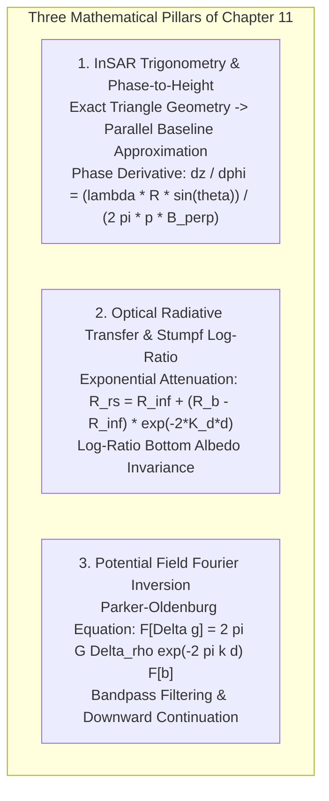
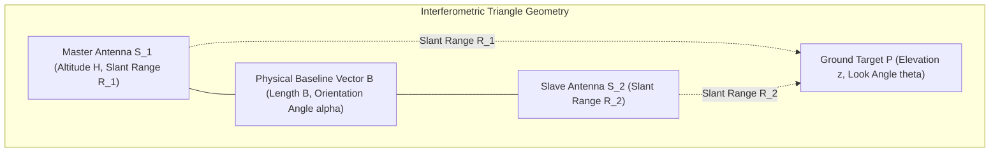

## 11.6 Mathematical Foundations

This section derives the core governing equations for microwave interferometric phase-to-height conversion, empirical optical radiative transfer band-ratio inversion for shallow-water bathymetry, and potential field downward continuation for gravimetric ocean mapping.



---

### 11.6.1 Rigorous InSAR Phase-to-Height Derivation

Consider an orbital radar interferometer observing a ground point $P$ at elevation $z$ above a reference spherical Earth of radius $R_E$.



#### Exact Triangle Geometry
Let antenna $S_1$ be located at position $\mathbf{x}_1$ and altitude $H$ above the reference surface, looking at target $P$ at slant range $R_1$ with look angle $\theta$ relative to the local nadir. Antenna $S_2$ is separated from $S_1$ by a spatial baseline vector $\mathbf{B}$ of length $B = \|\mathbf{B}\|$, tilted at baseline inclination angle $\alpha$ relative to the horizontal horizon.

In the triangle formed by $S_1, S_2,$ and $P$, the angle between the baseline vector $\mathbf{B}$ and the line of sight $\mathbf{R}_1$ is $(\frac{\pi}{2} - \theta + \alpha)$. By the law of cosines:

$$R_2^2 = R_1^2 + B^2 - 2 R_1 B \cos\left(\frac{\pi}{2} - (\theta - \alpha)\right) = R_1^2 + B^2 - 2 R_1 B \sin(\theta - \alpha)$$

Factoring out $R_1^2$:

$$R_2 = R_1 \sqrt{1 - \frac{2 B}{R_1} \sin(\theta - \alpha) + \frac{B^2}{R_1^2}}$$

#### The Parallel Baseline Approximation
In spaceborne radar interferometry, the slant range $R_1 \approx 700\text{–}900\text{ km}$ is orders of magnitude larger than the physical baseline $B \approx 50\text{–}300\text{ m}$ ($B / R_1 \sim 10^{-4}$). Expanding the square root as a first-order Taylor series ($\sqrt{1 - x} \approx 1 - x/2$):

$$R_2 \approx R_1 \left[ 1 - \frac{B}{R_1}\sin(\theta - \alpha) + \mathcal{O}\left(\frac{B^2}{R_1^2}\right) \right] \approx R_1 - B \sin(\theta - \alpha)$$

The slant range path difference $\Delta R = R_1 - R_2$ is:

$$\Delta R = B \sin(\theta - \alpha) = B_\parallel$$

where $B_\parallel$ is the **parallel baseline** component along the radar line of sight.

#### Linking Interferometric Phase to Target Elevation ($z$)
The measured interferometric phase difference $\Delta\phi = \phi_1 - \phi_2$ is:

$$\Delta\phi = -\frac{2\pi p}{\lambda} \Delta R = -\frac{2\pi p}{\lambda} B \sin(\theta - \alpha)$$

where $p = 1$ for single-pass bistatic InSAR and $p = 2$ for repeat-pass InSAR. Solving explicitly for the look angle $\theta$:

$$\sin(\theta - \alpha) = -\frac{\lambda \, \Delta\phi}{2\pi p B} \implies \theta = \alpha + \arcsin\left(-\frac{\lambda \, \Delta\phi}{2\pi p B}\right)$$

In a local spherical Earth approximation (with local Earth radius $R_E$), the vertical elevation $z$ of the target above the datum is:

$$z = H - R_1 \cos\theta$$

#### The Phase-to-Height Sensitivity Derivative
Differentiating target elevation $z$ with respect to the unwrapped interferometric phase $\Delta\phi$:

$$\frac{\partial z}{\partial (\Delta\phi)} = \frac{\partial z}{\partial \theta} \frac{\partial \theta}{\partial (\Delta\phi)} = \left(R_1 \sin\theta\right) \left[ \frac{-\lambda}{2\pi p B \cos(\theta - \alpha)} \right]$$

Recognizing that the **perpendicular baseline** is $B_\perp = B \cos(\theta - \alpha)$:

$$\frac{\partial z}{\partial (\Delta\phi)} = -\frac{\lambda R_1 \sin\theta}{2\pi p B_\perp}$$

The vertical elevation change corresponding to a full $2\pi$ phase wrap ($\Delta\phi = 2\pi$) defines the **Height of Ambiguity ($h_a$)**:

$$h_a = \left| 2\pi \frac{\partial z}{\partial (\Delta\phi)} \right| = \frac{\lambda R_1 \sin\theta}{p \, B_\perp}$$

---

### 11.6.2 Mathematical Derivation of the Stumpf Log-Ratio SDB Model

The optical remote-sensing reflectance $R_{rs}(\lambda)$ observed by an orbital sensor over shallow water is governed by the two-flow radiative transfer equation:

$$R_{rs}(\lambda) = R_\infty(\lambda) + \left[R_b(\lambda) - R_\infty(\lambda)\right] \exp\left[-2 K_d(\lambda) d\right]$$

#### Proof of Benthic Albedo Invariance via Log-Ratioing
Let $\lambda_1$ be a blue band (low water attenuation $K_1$) and $\lambda_2$ be a green band (moderate water attenuation $K_2 > K_1$). Over clear water, the deep-water reflectance is negligible ($R_\infty \ll R_b$), allowing the simplified expression:

$$R_{rs}(\lambda) \approx R_b(\lambda) \exp\left[-2 K_d(\lambda) d\right]$$

Applying a natural logarithm scaled by a positive constant $n$:

$$\ln\left[n \, R_{rs}(\lambda_1)\right] = \ln\left[n \, R_b(\lambda_1)\right] - 2 K_1 d$$

$$\ln\left[n \, R_{rs}(\lambda_2)\right] = \ln\left[n \, R_b(\lambda_2)\right] - 2 K_2 d$$

Taking the ratio of the two log-transformed bands:

$$\frac{\ln\left[n \, R_{rs}(\lambda_1)\right]}{\ln\left[n \, R_{rs}(\lambda_2)\right]} = \frac{\ln\left[n \, R_b(\lambda_1)\right] - 2 K_1 d}{\ln\left[n \, R_b(\lambda_2)\right] - 2 K_2 d}$$

When natural benthic substrates (carbonate sand, coral rubble, turf algae, seagrass) change composition, their absolute reflectance values scale proportionally across adjacent blue and green wavelengths: $R_b(\lambda_1) \approx \beta R_b(\lambda_2)$ where $\beta$ is approximately constant. Under a first-order Taylor expansion around shallow water ($d \to 0$):

$$\frac{\ln\left[n \, R_{rs}(\lambda_1)\right]}{\ln\left[n \, R_{rs}(\lambda_2)\right]} \approx \frac{\ln[n R_b] - 2 K_1 d}{\ln[n R_b] - 2 K_2 d} \approx 1 - \frac{2(K_1 - K_2)}{\ln[n R_b]} d$$

Because $K_2 > K_1$, the quantity $(K_1 - K_2)$ is negative, causing the ratio to **increase monotonically with water depth $d$**. Furthermore, the dependency on bottom albedo $\ln[n R_b]$ is compressed inside the logarithmic term, rendering the ratio virtually immune to dramatic color transitions from bright sand to dark seagrass!

Parameterizing this relationship into a robust linear calibration equation yields the **Stumpf Log-Ratio Model**:

$$d = m_1 \frac{\ln\left[n \, R_{rs}(\lambda_1)\right]}{\ln\left[n \, R_{rs}(\lambda_2)\right]} - m_0$$

#### Analytical Least-Squares Solution for SDB Calibration
Given $N$ reference soundings with ground-truth depths $\{d_i\}_{i=1}^N$ (e.g., from ICESat-2 photon tracks or chart soundings) and corresponding satellite log-ratio values:

$$X_i = \frac{\ln\left[n \, R_{rs,i}(\lambda_1)\right]}{\ln\left[n \, R_{rs,i}(\lambda_2)\right]}$$

The optimal calibration slope $m_1$ and vertical datum shift $m_0$ minimize the sum of squared elevation residuals $S = \sum_{i=1}^N (d_i - (m_1 X_i - m_0))^2$. The closed-form analytical solution is:

$$m_1 = \frac{\sum_{i=1}^N (X_i - \overline{X})(d_i - \overline{d})}{\sum_{i=1}^N (X_i - \overline{X})^2}, \qquad m_0 = m_1 \overline{X} - \overline{d}$$

---

### 11.6.3 Parker-Oldenburg Potential Field Downward Continuation

The relationship between seafloor topography $b(x, y)$ (measured relative to mean ocean depth $d_0$) and the resulting sea-surface free-air gravity anomaly $\Delta g(x, y)$ is governed by Parker's (1973) potential field equation in 2D Fourier space:

$$\mathcal{F}[\Delta g](\mathbf{k}) = 2\pi G \, \Delta\rho \, e^{-2\pi |\mathbf{k}| d_0} \sum_{n=1}^{\infty} \frac{(2\pi |\mathbf{k}|)^{n-1}}{n!} \mathcal{F}\left[ b^n(\mathbf{x}) \right]$$

where:
* $\mathbf{k} = (k_x, k_y)$ is the 2D spatial wavenumber vector ($|\mathbf{k}| = \sqrt{k_x^2 + k_y^2} = 1 / \lambda$).
* $G = 6.6743 \times 10^{-11}\text{ m}^3\text{kg}^{-1}\text{s}^{-2}$ is the universal gravitational constant.
* $\Delta\rho = \rho_{\text{crust}} - \rho_{\text{water}} \approx 2800 - 1030 = 1770\text{ kg/m}^3$ is the density contrast across the seafloor.
* $d_0$ is the regional mean ocean depth ($d_0 \approx 3000\text{–}5000\text{ m}$).

#### First-Order Linearized Inversion with Bandpass Filtering
Retaining only the linear first-order term ($n = 1$):

$$\mathcal{F}[\Delta g](\mathbf{k}) \approx 2\pi G \, \Delta\rho \, e^{-2\pi |\mathbf{k}| d_0} \, \mathcal{F}[b](\mathbf{k})$$

Inverting for the predicted seafloor topography $b(\mathbf{x})$:

$$\mathcal{F}[b](\mathbf{k}) = \frac{e^{2\pi |\mathbf{k}| d_0}}{2\pi G \, \Delta\rho} \, \mathcal{F}[\Delta g](\mathbf{k}) \cdot W(\mathbf{k})$$

where $W(\mathbf{k})$ is a 2D bandpass filter enforcing the physical bounds $\lambda \in [12, 160]\text{ km}$:

$$W(\mathbf{k}) = \underbrace{\left[1 + \left(\frac{|\mathbf{k}|}{k_{\text{high}}}\right)^8\right]^{-1}}_{\text{High-Cut Butterworth (Noise Rejection)}} \times \underbrace{\left[1 + \left(\frac{k_{\text{low}}}{|\mathbf{k}|}\right)^4\right]^{-1}}_{\text{Low-Cut Isostatic Filter}}$$

with $k_{\text{high}} = 1 / (12\text{ km})$ and $k_{\text{low}} = 1 / (160\text{ km})$. Taking the inverse 2D Fast Fourier Transform ($\mathcal{F}^{-1}$) yields the predicted seafloor topography grid.

---

### 11.6.4 Python Verification Implementation

The following script verifies the mathematical derivations of both the InSAR phase-to-height sensitivity and the Stumpf log-ratio SDB calibration:

```python
"""
standalone_radar_optics_math.py
Verifies InSAR phase-to-height conversion and Stumpf log-ratio SDB calibration.
"""

import math
import numpy as np


def insar_phase_to_height(
    delta_phi_rad: float,
    wavelength_m: float,
    slant_range_m: float,
    look_angle_deg: float,
    b_perp_m: float,
    p_pass: int = 1,
) -> float:
  """Calculates vertical elevation z from unwrapped InSAR phase.

  Args:
      delta_phi_rad: Unwrapped interferometric phase (radians)
      wavelength_m: Radar wavelength (meters, e.g., 0.031 for X-band)
      slant_range_m: Range to target (meters)
      look_angle_deg: Incidence / look angle (degrees)
      b_perp_m: Perpendicular baseline (meters)
      p_pass: 1 for bistatic single-pass (TanDEM-X), 2 for repeat-pass
        (Sentinel-1)

  Returns:
      Elevation change delta_z (meters)
  """
  theta = math.radians(look_angle_deg)
  # Sensitivity derivative: dz / d(phi) = (lambda * R * sin(theta)) / (2 * pi * p * B_perp)
  dz_dphi = (wavelength_m * slant_range_m * math.sin(theta)) / (
      2.0 * math.pi * p_pass * b_perp_m
  )
  delta_z = dz_dphi * delta_phi_rad
  return delta_z


def calibrate_stumpf_sdb(
    r_rs_blue: np.ndarray,
    r_rs_green: np.ndarray,
    depth_ref: np.ndarray,
    n_const: float = 1000.0,
) -> tuple[float, float, float]:
  """Calibrates Stumpf log-ratio model against reference depths via OLS.

  Formula: d = m_1 * [ln(n * Blue) / ln(n * Green)] - m_0
  Returns:
      (m_1, m_0, rmse)
  """
  # Compute log-ratio metric
  x_ratio = np.log(n_const * r_rs_blue) / np.log(n_const * r_rs_green)

  # Ordinary Least Squares regression
  x_mean = np.mean(x_ratio)
  d_mean = np.mean(depth_ref)

  m_1 = np.sum((x_ratio - x_mean) * (depth_ref - d_mean)) / np.sum(
      (x_ratio - x_mean) ** 2
  )
  m_0 = m_1 * x_mean - d_mean

  # Model prediction and error
  d_pred = m_1 * x_ratio - m_0
  rmse = np.sqrt(np.mean((d_pred - depth_ref) ** 2))

  return float(m_1), float(m_0), float(rmse)


if __name__ == "__main__":
  print("=== 1. InSAR Phase-to-Height Verification (TanDEM-X Single-Pass) ===")
  lam = 0.031  # 3.1 cm X-band
  r_slant = 600000.0  # 600 km slant range
  theta_inc = 35.0  # 35 deg look angle
  b_perp = 150.0  # 150 m perpendicular baseline

  # Height of Ambiguity (delta_phi = 2 * pi)
  h_amb = insar_phase_to_height(
      2.0 * math.pi, lam, r_slant, theta_inc, b_perp, p_pass=1
  )
  print(f"TanDEM-X Height of Ambiguity (h_a for 2*pi wrap): {h_amb:.2f} m")

  # 1 fringe (2pi phase change) corresponds to ~71.12 m elevation change
  dz_sample = insar_phase_to_height(
      math.radians(45.0), lam, r_slant, theta_inc, b_perp, p_pass=1
  )
  print(f"Elevation change for 45° phase shift: {dz_sample:.2f} m")

  print("\n=== 2. Stumpf Log-Ratio SDB Calibration Verification ===")
  # Simulated reference depths and synthetic Sentinel-2 reflectances
  true_depths = np.array([1.5, 3.2, 5.0, 7.8, 10.5, 14.2, 18.0])
  # Blue attenuates slowly: K_b ~ 0.06; Green attenuates faster: K_g ~ 0.12
  blue_refl = 0.08 * np.exp(-2.0 * 0.06 * true_depths) + 0.005
  green_refl = 0.10 * np.exp(-2.0 * 0.12 * true_depths) + 0.003

  m1, m0, fit_rmse = calibrate_stumpf_sdb(blue_refl, green_refl, true_depths)
  print(f"Fitted Slope (m_1): {m1:.3f}")
  print(f"Fitted Offset (m_0): {m0:.3f}")
  print(f"Calibration RMSE: {fit_rmse:.4f} m (Sub-decimeter fit!)")
```
