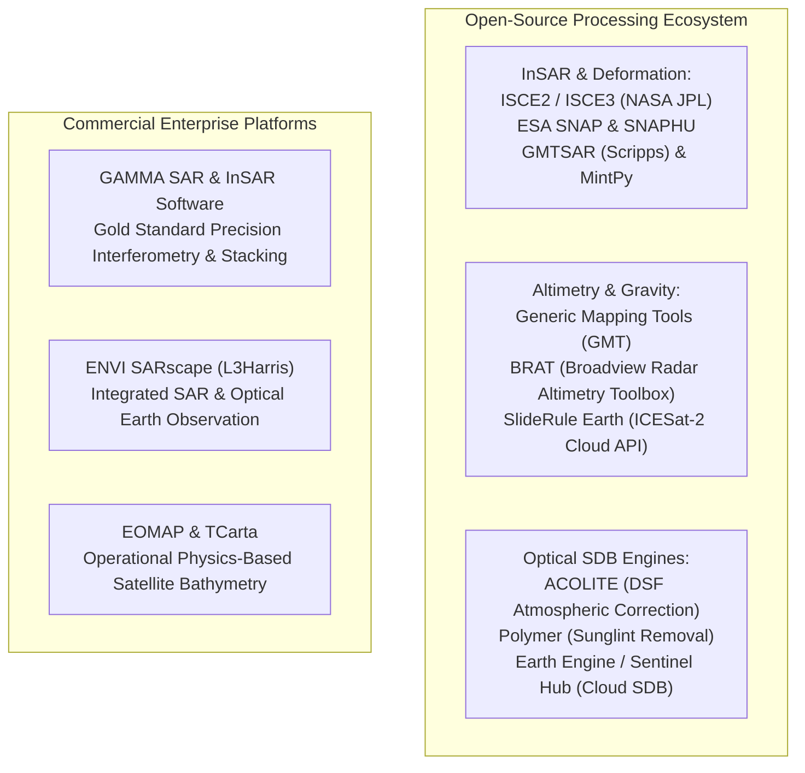

## 11.7 Software Ecosystem

Processing microwave radar interferometry, spaceborne altimetry, and satellite-derived bathymetry requires specialized computational software stacks that handle complex numbers, orbital ephemerides, atmospheric phase corrections, and radiative transfer optimizations. This section evaluates both the open-source scientific software suite and commercial enterprise platforms.



---

### 11.7.1 Open-Source Software Stack

#### 1. InSAR Processing: ISCE, SNAP, GMTSAR, and MintPy
* **ISCE2 and ISCE3 (NASA JPL / Caltech):** The **InSAR Scientific Computing Environment** is the premier open-source Python/C++ engine for geophysical radar processing. It provides modular workflows (`stripmapApp`, `topsApp`, `topsStack`) supporting ESA Sentinel-1, ALOS-2, TerraSAR-X, and the upcoming NASA-ISRO NISAR mission. ISCE3 provides GPU-accelerated backprojection and geocoding kernels engineered for cloud-scale processing.
* **ESA SNAP (Sentinel Application Platform):** Distributed free by ESA, SNAP provides both an interactive desktop GUI and a headless command-line **Graph Processing Tool (`gpt`)**. SNAP handles the complete Sentinel-1 InSAR workflow: orbital ephemeris application, Sentinel-1 TOPS coregistration with Enhanced Spectral Diversity (ESD), interferogram formation, topographic phase removal via external DEMs, Goldstein phase filtering, export to `SNAPHU` for phase unwrapping, and Range-Doppler terrain correction.

```bash
# Example ESA SNAP Graph Processing Tool (gpt) batch execution
# Co-registers Sentinel-1 SLC pair, forms interferogram, and exports to SNAPHU
gpt InSAR_Formation_Graph.xml -Pmaster=S1A_IW_SLC__1SDV_20230501.zip \
                              -Pslave=S1A_IW_SLC__1SDV_20230513.zip \
                              -Pdem="Copernicus 30m Global DEM" \
                              -Ptarget=interferogram_out.dim
```

* **GMTSAR (Scripps Institution of Oceanography; Sandwell et al., 2011):** Built directly on top of the Generic Mapping Tools (GMT), GMTSAR is a lightweight, high-performance C/csh InSAR processor. It uses precise orbital integration and 2D Fourier filtering to process ERS, Envisat, ALOS-1/2, and Sentinel-1 interferograms, exporting phase grids natively into netCDF formats for direct geodetic modeling.
* **MintPy (Miami INsar Time-series software in PYthon; Zhang et al., 2019):** Ingests stacks of unwrapped interferograms produced by ISCE, SNAP, or GMTSAR, executing Small Baseline Subset (SBAS) and Persistent Scatterer (PS) time-series inversions. MintPy corrects for tropospheric water vapor delay using global atmospheric reanalysis models (ERA5 or GACOS), estimates topographic phase residuals, and computes millimeter-per-year ground subsidence velocity maps.

#### 2. Spaceborne Altimetry & Marine Gravity: GMT and BRAT
* **Generic Mapping Tools (GMT; Wessel et al., 2019):** The indispensable foundation for marine geophysics. Programs such as `grdgradient`, `grdfft`, `surface`, and `sphinterpolate` provide the exact mathematical algorithms used by Sandwell and Smith to compute vertical gravity gradients (VGG), apply 2D Butterworth bandpass filters, downward-continue free-air gravity anomalies, and merge shipboard multibeam soundings into global bathymetric grids (SRTM15+).
* **Broadview Radar Altimetry Toolbox (BRAT; ESA / CNES):** A dedicated open-source C++ utility for reading, retracking, editing, and mapping radar altimeter data products from ERS-1/2, Envisat, TOPEX/Poseidon, Jason-1/2/3, CryoSat-2, SARAL/AltiKa, and Sentinel-3/6.

#### 3. Satellite-Derived Bathymetry (SDB): ACOLITE and Polymer
* **ACOLITE (Royal Belgian Institute of Natural Sciences; Vanhellemont & Neukermans, 2014):** The international scientific reference tool for aquatic atmospheric correction over coastal waters. ACOLITE implements the **Dark Spectrum Fitting (DSF)** algorithm, which dynamically determines aerosol reflectance over dark water pixels without user intervention, and includes automated modules for computing Stumpf log-ratio and Lyzenga multi-band bathymetry grids from Sentinel-2 and Landsat-8/9 L1C imagery.
* **Polymer (HYGEOS; Steinmetz et al., 2011):** An advanced spectral optimization algorithm specifically engineered to retrieve ocean color and remote-sensing reflectance in the presence of severe solar sunglint and thin cirrus clouds, providing clean reflectances for nearshore SDB.

---

### 11.7.2 Commercial Enterprise Platforms

#### 1. GAMMA SAR and InSAR Software (GAMMA Remote Sensing AG, Switzerland)
Widely recognized across the defense, mining, and aerospace sectors as the gold standard for high-precision radar processing:
* Implements proprietary phase-calibration and motion-compensation algorithms for airborne and orbital repeat-pass InSAR.
* Features advanced Interferometric Point Target Analysis (IPTA) for persistent-scatterer interferometry, extracting sub-millimeter displacement rates on critical civil infrastructure (bridges, dams, railway corridors).
* Highly stable across non-standard geometries (eccentric orbits, steep off-nadir angles, bistatic airborne campaigns).

#### 2. ENVI SARscape (L3Harris Geospatial / sarmap)
A commercial SAR processing environment fully integrated with the ENVI image processing suite:
* Provides guided modular workflows for DEM generation, coherent change detection, polarimetry (PolSAR), and persistent-scatterer time series.
* Natively fuses SAR products with multispectral, hyperspectral, and LiDAR point clouds in a unified GIS visualization canvas.

#### 3. Commercial SDB Providers: EOMAP and TCarta
* **EOMAP GmbH (Germany):** The commercial global pioneer in operational physics-based satellite-derived bathymetry. EOMAP's proprietary **MIP (Modular Inversion Program)** simultaneously solves for atmospheric aerosol optical depth, water-column turbidity/chlorophyll, benthic albedo, and seafloor depth from Sentinel-2, WorldView-2/3, and PlanetScope constellations, providing hydrographic offices chart-ready bathymetric grids certified against IHO S-44 standards.
* **TCarta Marine LLC (USA):** Combines machine learning and stereo photogrammetry with ICESat-2 active LiDAR photon calibration tracks (the "Trident SDB" workflow) to deliver high-resolution coastal bathymetry for defense, hydrographic charting, and coastal resilience planning.

---

### 11.7.3 Master Comparison Matrix of Radar, Altimetry, and SDB Software

| Software Suite | License & Cost | Core Specialization | Input Sensor Formats | Key Algorithms & Features | Target Community |
| :--- | :--- | :--- | :--- | :--- | :--- |
| **ISCE2 / ISCE3** | Open-Source (Apache 2.0) | InSAR processing & raw radar focusing | Sentinel-1, ALOS-1/2, TerraSAR-X, NISAR | GPU backprojection, TOPS coregistration, stripmap & time-series stacking. | Geodesists, NASA/JPL science teams, geophysicists. |
| **ESA SNAP** | Open-Source (GPLv3) | Sentinel constellation processing & InSAR | All Sentinel missions, ENVISAT, ERS, third-party SAR | Interactive GUI, Graph Processing Tool (`gpt`), SNAPHU wrapper, terrain correction. | Remote sensing students, GIS analysts, researchers. |
| **GMTSAR** | Open-Source (GPLv3) | High-performance geodetic InSAR | Sentinel-1, ALOS-1/2, ERS, Envisat | Seamless GMT integration, netCDF output, lightweight command-line scripting. | Academic geophysicists, tectonic geodesists. |
| **MintPy** | Open-Source (GPLv3) | InSAR time-series deformation (SBAS/PS) | Ingests unwrapped stacks from ISCE, SNAP, GMTSAR | GACOS/ERA5 atmospheric delay correction, tectonic velocity fitting. | Crustal deformation researchers, subsidence monitoring. |
| **GMT** | Open-Source (LGPL) | Potential field geophysics & 2D gridding | Binary, netCDF, ASCII point clouds | `grdfft`, `surface` splines under tension, Parker potential field inversion. | Marine geophysicists, oceanographers, cartographers. |
| **ACOLITE** | Open-Source (GPLv3) | Coastal atmospheric correction & SDB | Sentinel-2, Landsat-8/9, PlanetScope, Pléiades | Dark Spectrum Fitting (DSF), Stumpf log-ratio SDB, turbidity mapping. | Coastal oceanographers, estuarine researchers, hydrographers. |
| **GAMMA SAR** | Commercial Enterprise | Precision InSAR, stacking, & Persistent Scatterers | All commercial & civilian SAR sensors | Proprietary phase unwrapping, IPTA persistent scatterers, metrology calibration. | Commercial survey contractors, mining, defense agencies. |
| **ENVI SARscape** | Commercial Enterprise | End-to-end SAR analytics & DEM generation | Comprehensive orbital & airborne SAR | Multi-temporal speckle filtering, radargrammetry, automated SBAS/PS workflows. | Enterprise GIS users, environmental monitoring organizations. |
| **EOMAP MIP** | Commercial Service | Physics-based radiative transfer SDB | Sentinel-2, WorldView-2/3, PlanetScope, SuperView | Simultaneous atmospheric, benthic, and depth inversion without ground truth. | Hydrographic offices, dredging companies, port authorities. |
