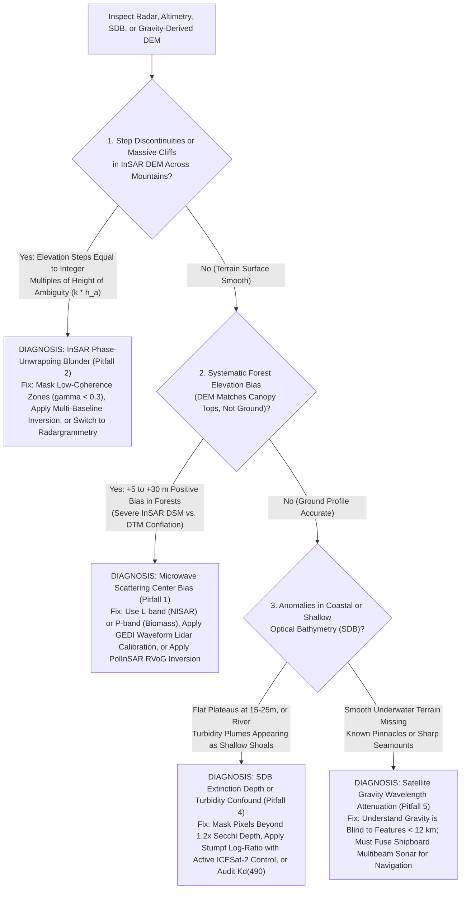

## 11.8 Common Pitfalls & Key Takeaways

Spaceborne radar interferometry, satellite radar altimetry, and satellite-derived bathymetry observe planetary terrain through complex electromagnetic and geophysical transformations. Misinterpreting microwave penetration, phase unwrapping limits, atmospheric water-vapor delays, or optical extinction depths introduces severe systematic errors into Digital Elevation Models. This section catalogs the five foremost failure modes across these disciplines, provides a visual diagnostic flowchart, and establishes practical rules of engagement for geospatial engineers.

---

### 11.8.1 Five Critical Pitfalls in Radar, Altimetry, and Auxiliary Geophysics

#### Pitfall 1: Conflating Microwave Surface Models (DSM) with Bare-Earth Terrain (DTM)
* **The Physical Mechanism:** Unlike blue-green LiDAR pulses that pass through millimeter-sized canopy gaps to strike the soil, microwave scattering in radar is governed by volume scattering from leaves, twigs, and branches:
  * **X-band ($\lambda \approx 3.1\text{ cm}$):** Scatters off outer leaves and twigs, placing the interferometric phase center at the very top of the vegetation canopy.
  * **C-band ($\lambda \approx 5.6\text{ cm}$):** Scatters within the upper third of the canopy volume.
* **The Operational Error:** Hydrodynamic modelers frequently download global SRTM (C-band) or Copernicus/TanDEM-X (X-band) elevation datasets and ingest them directly as "bare-earth" boundary conditions for river flooding, storm surge, or sea-level rise simulations.
* **Resulting DEM Artifact:** In forested floodplains (e.g., the Amazon, Congo, or southeastern US pine flatwoods), the InSAR DEM sits **$+10\text{ to }+35\text{ m}$ above the true bare ground**. Hydraulic models treat these forested tracts as impenetrable elevated dikes, diverting simulated floodwaters unnaturally into adjacent open agricultural fields and producing completely fictitious inundation maps!
* **Mitigation Protocol:** 
  1. Never treat X-band or C-band InSAR products as Digital Terrain Models (DTMs).
  2. In vegetated terrain, apply spaceborne full-waveform LiDAR calibration tracks (NASA GEDI or ICESat-2) to compute the Canopy Height Model ($\text{CHM} = \text{RH98}$) and subtract the vegetation offset: $\text{DTM} \approx \text{DSM} - f_{\text{canopy}} \cdot \text{CHM}$.
  3. For true bare-earth microwave mapping in dense forests, deploy long-wavelength systems: L-band (NISAR) with PolInSAR decomposition, or P-band (ESA Biomass).

#### Pitfall 2: InSAR Phase-Unwrapping Blunders and Integer Cycle Jumps ($2\pi k$)
* **The Physical Mechanism:** Radar interferometry measures phase modulo $2\pi$. The unwrapping algorithm must determine the exact integer cycle count $k \in \mathbb{Z}$ for every pixel. In rugged mountainous terrain, four physical factors destroy phase coherence ($\gamma \to 0$):
  1. Radar shadow (zero signal).
  2. Severe layover (multiple topographic elevations mapped to the same slant range).
  3. Baseline geometric decorrelation.
  4. Dense, moving vegetation.
* **Resulting DEM Artifact:** When an unwrapping algorithm (such as SNAPHU or branch-cut) routes an integration path across a low-coherence layover zone or deep river canyon, it frequently gains or drops an integer phase cycle. In the reconstructed DEM, this error manifests as a **catastrophic, vertical step cliff or "tear"** whose magnitude is an exact multiple of the Height of Ambiguity ($z_{\text{err}} = k \cdot h_a$, typically $50\text{ to }200\text{ m}$).
* **Mitigation Protocol:**
  1. Inspect the spatial interferometric coherence map ($\gamma$). Mask all pixels where $\gamma < 0.30$ prior to unwrap integration.
  2. Use multi-baseline or multi-frequency InSAR pairs: combine a small-baseline pair (large $h_a$, easy unwrapping) to guide the unwrapping of a large-baseline pair (small $h_a$, high precision).
  3. Over extreme alpine terrain, bypass phase unwrapping entirely and deploy **Radargrammetry (Stereo SAR)**.

#### Pitfall 3: Tropospheric Water Vapor Artifacts in Repeat-Pass InSAR
* **The Physical Mechanism:** In repeat-pass InSAR (e.g., Sentinel-1), the radar pulses pass through the atmosphere at two different dates separated by days or weeks. Atmospheric water vapor is highly dynamic. A localized, turbulent convective water-vapor plume on Day 2 slows down the radar wave relative to Day 1, introducing a differential phase delay ($\Delta\phi_{\text{tropo}}$).
* **Resulting DEM Artifact:** An increase in relative humidity of just $15\%$ along the radar path induces an apparent elevation change of **$\Delta z \approx 15\text{–}40\text{ m}$**. If a repeat-pass interferogram is inverted for topography without atmospheric correction, these turbulent moisture cells manifest as smooth, circular artificial hills or depressions across flat plains.
* **Mitigation Protocol:**
  1. For static DEM generation, exclusively use **Single-Pass Bistatic InSAR** (TanDEM-X or SRTM), where atmospheric phase delay is identical for both antennas and cancels out completely ($\Delta\phi_{\text{tropo}} = 0$).
  2. If using repeat-pass data, correct interferograms using numerical weather reanalysis models (ERA5 or GACOS) and stack large multi-temporal time series (using MintPy) to average out zero-mean turbulent tropospheric noise.

#### Pitfall 4: Turbidity Plumes and Extinction Depth Limits in Satellite-Derived Bathymetry (SDB)
* **The Physical Mechanism:** Optical SDB relies on measuring light that has traveled through the water column, reflected off the seabed, and returned to space. 
  1. **Turbidity:** Suspended clay, silt, or phytoplankton blooms scatter green and red light upward before it reaches the seabed.
  2. **Optical Extinction:** Beyond approximately $1.2\text{–}1.5$ Secchi disk depths ($15\text{–}30\text{ m}$ in clear water, $< 2\text{ m}$ in turbid estuaries), $99.9\%$ of downwelling light is absorbed; returning benthic radiance drops below the sensor's digital noise floor.
* **Resulting DEM Artifact:**
  * River sediment plumes drifting into coastal waters are misinterpreted by empirical SDB models as **false shallow shoals, sandbanks, or uncharted islands** in the middle of deep shipping channels!
  * In waters deeper than the optical extinction limit, SDB models fail to detect further depth changes, flattening out into a **false horizontal plateau** at $z \approx -18\text{ m}$.
* **Mitigation Protocol:**
  1. Concurrently calculate and audit the diffuse attenuation coefficient at $490\text{ nm}$ ($K_d(490)$). Automatically flag and mask areas where turbidity exceeds $K_d > 0.5\text{ m}^{-1}$.
  2. Enforce a strict **Optical Depth Cutoff**: identify the deep-water asymptotic radiance $R_\infty(\lambda)$ and assign all pixels where $R_{rs}(\lambda) \le R_\infty(\lambda) + 3\sigma_{\text{noise}}$ to `NoData`.
  3. Calibrate SDB exclusively using active spaceborne LiDAR (ICESat-2) or surveyed acoustic cross-lines collected during the same seasonal hydrographic window.

#### Pitfall 5: Over-interpreting Satellite Gravity-Predicted Bathymetry
* **The Physical Mechanism:** The Smith & Sandwell methodology predicts deep-ocean bathymetry from the gravitational sea-surface bulge measured by satellite radar altimeters. However, upward continuation through $4000\text{ m}$ of seawater naturally filters out high-frequency gravitational signals ($e^{-2\pi |\mathbf{k}| d}$).
* **Resulting DEM Artifact:** Satellite gravity bathymetry is physically **blind to topographic wavelengths shorter than $\approx 12\text{ km}$**. A sharp, isolated volcanic pinnacle rising $1000\text{ m}$ from the abyssal plain with a base diameter of $3\text{ km}$ produces almost no measurable sea-surface bulge. In global grids (e.g., GEBCO or SRTM15+), un-surveyed ocean basins appear as smooth, rolling hills.
* **Real-World Catastrophe:** In 2005, the nuclear submarine *USS San Francisco* (SSN-711) struck an uncharted submarine seamount at full speed in the central Pacific, killing one crewman and causing catastrophic hull damage. The seamount rose $1500\text{ m}$ above the seafloor, but was completely absent from global satellite-gravity bathymetric charts because it fell below the $12\text{ km}$ gravimetric wavelength resolution limit.
* **Mitigation Protocol:** Never use satellite gravity-derived bathymetry for safety of navigation, submarine routing, or pipeline engineering. Always distinguish between actual shipboard acoustic soundings (which have real high-frequency resolution) and gravimetrically predicted seafloor interpolation.

---

### 11.8.2 Key Takeaways for Geospatial Engineers

> [!IMPORTANT]
> **Summary Principles for Radar, Altimetry, and Auxiliary Geophysics:**
> 1. **Match Microwave Wavelength to Target Surface:** Use X-band ($3\text{ cm}$) or C-band ($5.6\text{ cm}$) for canopy Digital Surface Models (DSMs) and urban infrastructure; use L-band ($24\text{ cm}$) or P-band ($69\text{ cm}$) with PolInSAR for sub-canopy Digital Terrain Models (DTMs).
> 2. **Single-Pass for Topography; Repeat-Pass for Motion:** Static topographic DEM generation requires single-pass bistatic InSAR (TanDEM-X) to eliminate temporal decorrelation and atmospheric delay. Repeat-pass InSAR (Sentinel-1) is a precision deformation engine ($\Delta z(t)$), not an optimal static DEM generator.
> 3. **The SWOT Paradigm Shift:** Satellite altimetry is no longer restricted to 1D ocean profiles. SWOT's wide-swath KaRIn interferometer maps continuous 2D water-surface elevations and slopes across global rivers ($>50\text{ m}$) and lakes, enabling global discharge inversion without gauges.
> 4. **Optical SDB Requires Active-Passive Fusion:** Empirical optical bathymetry is only as reliable as its calibration data. Fusing multi-spectral Sentinel-2 imagery with spaceborne ICESat-2 $532\text{ nm}$ photon tracks provides an automated, vessel-free calibration pipeline for coastal DEMs.
> 5. **Satellite Gravity Maps Plate Tectonics, Not Navigational Hazards:** Satellite altimetry marine gravity reveals seamounts and ocean ridges between $12\text{ and }160\text{ km}$ wavelength, but cannot resolve features $< 12\text{ km}$. Shipboard multibeam acoustic sounding remains irreplaceable for hydrographic safety.
