## 11.9 Curated Key References

The scientific foundations of Synthetic Aperture Radar interferometry, spaceborne altimetry, optical radiative transfer bathymetry, and potential field geophysics are documented in seminal peer-reviewed monographs and papers. The curated references below are organized into four thematic domains, concluding with a practitioner matrix mapping operational challenges to foundational literature.

```mermaid
flowchart LR
    subgraph InSAR_Lit["1. InSAR Principles & Missions"]
        Rosen["Rosen et al. (2000)\nInSAR Foundation Monograph"]
        Farr["Farr et al. (2007) SRTM\n& Krieger et al. (2007) TanDEM-X"]
        Chen["Chen & Zebker (2002)\nSNAPHU Network-Flow Unwrapping"]
    end

    subgraph Alt_Lit["2. Radar Altimetry & SWOT"]
        Brown["Brown (1977)\nOcean Waveform Model"]
        Raney["Raney (1998)\nDelay-Doppler SAR Altimetry"]
        Bianca["Biancamaria et al. (2016)\nSWOT Surface Water Mission"]
    end

    subgraph SDB_Lit["3. Satellite-Derived Bathymetry"]
        Lyzenga["Lyzenga (1978, 1985)\nMulti-Band Log-Linear Model"]
        Stumpf["Stumpf et al. (2003)\nLog-Ratio SDB Model"]
        Lee["Lee et al. (1999) HOPE\nPhysics Hyperspectral Inversion"]
    end

    subgraph Grav_Lit["4. Marine Gravity & Potential Fields"]
        Smith["Smith & Sandwell (1997)\nGlobal Marine Bathymetry"]
        Tozer["Tozer et al. (2019)\nSRTM15+ Global Topo/Bathy"]
    end

    InSAR_Lit --> Alt_Lit --> SDB_Lit --> Grav_Lit
```

---

### 11.9.1 Synthetic Aperture Radar Interferometry (InSAR) and Global DEMs

* **Rosen, P. A., Hensley, S., Joughin, I. R., Li, F. K., Madsen, S. N., Rodriguez, E., & Goldstein, R. M. (2000).** Synthetic aperture radar interferometry. *Proceedings of the IEEE*, 88(3), 333–382. https://doi.org/10.1109/5.838084
  * *Core Physical & Mathematical Contribution:* The definitive tutorial and reference monograph on InSAR. Derives the complete electromagnetic scattering physics, interferometric phase statistics (Wishart distribution), coherence estimation, baseline geometry, phase-to-height sensitivity, and motion compensation.
  * *Engineering & DEM Relevance:* Provides the core mathematical equations implemented across modern InSAR processors (`ISCE`, `SNAP`, `GAMMA`) for topographic reconstruction and differential deformation mapping.

* **Farr, T. G., Rosen, P. A., Caro, E., Crippen, R., Duren, R., Hensley, S., Kobrick, M., Paller, M., Rodriguez, E., Roth, L., Seal, D., Shaffer, S., Shimada, J., Umland, J., Werner, M., Oskin, M., Burbank, D., & Alsdorf, D. (2007).** The Shuttle Radar Topography Mission. *Reviews of Geophysics*, 45(2), RG2004. https://doi.org/10.1029/2005RG000183
  * *Core Engineering Contribution:* Comprehensive mission documentation of the Shuttle Radar Topography Mission (SRTM) flown on STS-99 in 2000. Documents the 60-meter deployable mast dynamics, C-band and X-band bistatic instrumentation, swath reconstruction, and calibration against continental kinematic GPS tracks.
  * *Engineering & DEM Relevance:* Details the absolute vertical accuracy ($\text{RMSE}_z \approx 4\text{–}6\text{ m}$) and systematic landcover biases of the world's first near-global $30\text{-meter}$ DEM.

* **Krieger, G., Moreira, A., Fiedler, H., Hajnsek, I., Werner, M., Younis, M., & Zink, M. (2007).** TanDEM-X: A satellite formation for high-resolution SAR interferometry. *IEEE Transactions on Geoscience and Remote Sensing*, 45(11), 3317–3341. https://doi.org/10.1109/TGRS.2007.900693
  * *Core Mission & Geodetic Contribution:* Documents the design, close-formation helix flight dynamics, and bistatic X-band synchronization of the TanDEM-X and TerraSAR-X constellation.
  * *Engineering & DEM Relevance:* Explains how single-pass bistatic orbital formation eliminates temporal decorrelation and atmospheric water vapor delays, yielding the global TanDEM-X $12\text{-meter}$ DEM with absolute vertical accuracy exceeding $1.0\text{ m}$.

* **Chen, C. W., & Zebker, H. A. (2002).** Phase unwrapping for large SAR interferograms: Statistical approaches and network flow formulation. *IEEE Transactions on Geoscience and Remote Sensing*, 40(3), 571–581. https://doi.org/10.1109/TGRS.2002.1000318
  * *Core Algorithmic Contribution:* Formulates the **SNAPHU** (Statistical-Cost Network-Flow Algorithm for Phase Unwrapping) framework, converting non-linear 2D phase unwrapping into a Minimum Cost Flow (MCF) network problem.
  * *Engineering & DEM Relevance:* SNAPHU remains the global open-source standard for InSAR phase unwrapping, incorporating spatial coherence and intensity derivatives to bridge low-coherence layover and shadow zones with minimum phase blunders.

* **Cloude, S. R., & Papathanassiou, K. P. (1998).** Polarimetric SAR interferometry. *IEEE Transactions on Geoscience and Remote Sensing*, 36(5), 1551–1565. https://doi.org/10.1109/36.718859
  * *Core Electromagnetic Contribution:* Synthesizes radar polarimetry and interferometry into **PolInSAR**, formulating the Random Volume over Ground (RVoG) model to separate canopy volume scattering from bare-ground surface scattering.
  * *Engineering & DEM Relevance:* Underpins the sub-canopy bare-earth DTM extraction algorithms of NASA-ISRO NISAR (L-band) and ESA Biomass (P-band).

---

### 11.9.2 Satellite Radar Altimetry, Delay-Doppler, and Wide-Swath Interferometry

* **Brown, G. S. (1977).** The average impulse response of a rough surface and its applications. *IEEE Transactions on Antennas and Propagation*, 25(1), 67–74. https://doi.org/10.1109/TAP.1977.1141536
  * *Core Mathematical Contribution:* Derives the analytical convolution model for radar echo power reflected from a Gaussian distributed rough sea surface, establishing the **Brown Waveform Model**.
  * *Engineering & DEM Relevance:* Serves as the mathematical foundation for retracking satellite radar altimeter waveforms across SEASAT, GEOSAT, ERS, TOPEX/Poseidon, and Jason-1/2/3 to measure sea surface elevation and Significant Wave Height.

* **Raney, R. K. (1998).** The delay Doppler radar altimeter. *IEEE Transactions on Geoscience and Remote Sensing*, 36(5), 1578–1588. https://doi.org/10.1109/36.718861
  * *Core Invention Contribution:* Conceptualizes the **Delay-Doppler (SAR) Altimeter**, proving that coherent pulse burst transmission and along-track Doppler beam sharpening collapses the along-track footprint by a factor of 10 while boosting signal-to-noise ratio.
  * *Engineering & DEM Relevance:* Led directly to the design of ESA CryoSat-2 (SIRAL), Sentinel-3 (SRAL), and Sentinel-6 Michael Freilich, enabling precision altimetry over coastal waters, sea ice leads, and narrow continental rivers.

* **Biancamaria, S., Lettenmaier, D. P., & Pavelsky, T. M. (2016).** The SWOT Mission and its capabilities for terrestrial surface water. *Surveys in Geophysics*, 37(2), 307–337. https://doi.org/10.1007/s10712-015-9346-y
  * *Core Hydrologic & Geodetic Contribution:* Defines the scientific requirements, KaRIn instrument parameters ($35.75\text{ GHz}$, $10\text{-meter}$ mast), and global hydrology deliverables for the **Surface Water and Ocean Topography (SWOT)** mission.
  * *Engineering & DEM Relevance:* Explains how wide-swath radar interferometry simultaneously resolves river water surface elevation (WSE), width ($W$), and slope ($S$) globally to invert river discharge without stream gauges.

---

### 11.9.3 Satellite-Derived Bathymetry (SDB) from Optical Imagery

* **Lyzenga, D. R. (1978).** Passive remote sensing techniques for mapping water depth and bottom features. *Applied Optics*, 17(3), 379–383. https://doi.org/10.1364/AO.17.000379
  * *Core Radiative Transfer Contribution:* Derives the multi-spectral radiative transfer equations linearizing two-way water-column absorption via deep-water radiance subtraction ($X_i = \ln[R_i - R_{\infty,i}]$), establishing multi-band linear regression for shallow bathymetry.
  * *Engineering & DEM Relevance:* The classical benchmark model for coastal satellite bathymetry from Landsat, SPOT, and airborne multispectral scanners.

* **Stumpf, R. P., Holderied, K., & Sinclair, M. (2003).** Determination of water depth with high-resolution satellite imagery over variable bottom types. *Limnology and Oceanography*, 48(1, part 2), 547–556. https://doi.org/10.4319/lo.2003.48.1_part_2.0547
  * *Core Inversion Contribution:* Formulates the **Stumpf Log-Ratio Model** ($d = m_1 \ln[n R_1] / \ln[n R_2] - m_0$), proving mathematically that ratioing a low-attenuation blue band with a higher-attenuation green band cancels benthic albedo variations (sand vs. seagrass).
  * *Engineering & DEM Relevance:* Remains the primary empirical SDB algorithm implemented across open-source (`ACOLITE`) and commercial geospatial workflows for Sentinel-2, PlanetScope, and WorldView imagery.

* **Lee, Z., Carder, K. L., Mobley, C. D., Steward, R. G., & Patch, J. S. (1999).** Hyperspectral remote sensing for shallow waters: 2. Deriving bottom depths and water properties by optimization. *Applied Optics*, 38(18), 3831–3843. https://doi.org/10.1364/AO.38.003831
  * *Core Physics-Based Contribution:* Introduces the **HOPE** (Hyperspectral Optimization Process Exemplar) model, inverting the full radiative transfer equation simultaneously for water depth, phytoplankton chlorophyll, CDOM, and benthic albedo without requiring in-situ training soundings.
  * *Engineering & DEM Relevance:* Defines the theoretical architecture behind modern physics-based commercial SDB engines (e.g., EOMAP MIP) and hyperspectral missions (NASA PACE / EMIT).

---

### 11.9.4 Marine Gravity, Gravimetric Geoids, and Global Bathymetric Synthesis

* **Smith, W. H. F., & Sandwell, D. T. (1997).** Global sea floor topography from satellite altimetry and ship depth soundings. *Science*, 277(5334), 1956–1962. https://doi.org/10.1126/science.277.5334.1956
  * *Core Geophysical Contribution:* Demonstrates that spaceborne radar altimeter measurements of the marine geoid can be bandpass-filtered ($12\text{–}160\text{ km}$) and downward-continued through the ocean water column to predict deep seafloor bathymetry globally.
  * *Engineering & DEM Relevance:* Mapped tens of thousands of uncharted submarine seamounts and tectonic structures, providing the foundational bathymetric grid for global ocean circulation, tsunami hazard forecasting, and UNCLOS maritime law.

* **Tozer, B., Sandwell, D. T., Smith, W. H. F., Olson, C., Beale, J. R., & Wessel, P. (2019).** Global bathymetry and topography at 15 arcsec: SRTM15+. *Earth and Space Science*, 6(10), 1847–1864. https://doi.org/10.1029/2019EA000658
  * *Core Compilation Contribution:* Documents the creation of **SRTM15+**, fusing multi-mission satellite altimetry gravity anomalies (CryoSat-2, SARAL/AltiKa, Envisat, Jason-1/2) with calibrated multibeam and single-beam acoustic soundings into a global 15-arc-second ($\approx 500\text{ m}$) bathymetric DEM.
  * *Engineering & DEM Relevance:* Serves as the primary bathymetric base model for Google Earth, the Nippon Foundation-GEBCO Seabed 2030 project, and global hydrodynamic modeling suites.

---

### 11.9.5 Quick-Reference Practitioner Matrix: Methods, Error Signatures, References, and Tools

| Application / Failure Signature | Underlying Physical / Mathematical Mechanism | Primary Literature Reference(s) | Recommended Software / Tool |
| :--- | :--- | :--- | :--- |
| **Global Land DSM Generation (Cloud-Free)** | Single-pass bistatic X-band InSAR; zero temporal decorrelation & atmosphere cancellation | Farr et al. (2007); Krieger et al. (2007) | TanDEM-X DEM, Copernicus 30m Global DEM |
| **Crustal Deformation & Subsidence ($\Delta z(t)$)** | Repeat-pass C-band InSAR stacking with tropospheric phase screen (GACOS/ERA5) removal | Rosen et al. (2000); Zhang et al. (2019) | `ISCE2/3`, `ESA SNAP`, `MintPy` |
| **InSAR Phase-Unwrapping Blunders (Step Cliffs)** | Module $2\pi$ cycle jumps ($k \cdot h_a$) across low-coherence layover/shadow zones | Chen & Zebker (2002) | `SNAPHU` statistical-cost network flow |
| **Sub-Canopy Bare-Earth DTM in Dense Forests** | Long-wavelength L/P-band penetration & PolInSAR RVoG ground-phase separation | Cloude & Papathanassiou (1998) | ESA Biomass (2025), NASA-ISRO NISAR, `ISCE3` |
| **2D River Discharge & Lake Water Storage** | Wide-swath Ka-band radar interferometry (KaRIn) measuring simultaneous WSE and slope $S$ | Biancamaria et al. (2016) | SWOT River & Lake Products, `CNES/NASA SWOT Hydro` |
| **Coastal Satellite-Derived Bathymetry (0–20m)** | Multi-spectral blue/green radiative transfer log-ratioing canceling bottom albedo | Stumpf et al. (2003); Lyzenga (1978) | `ACOLITE`, `Polymer`, Sentinel-2, PlanetScope |
| **Active-Passive Coastal Bathymetric Control** | Spaceborne $532\text{ nm}$ photon-counting laser altimetry calibrating optical log-ratios | Parrish et al. (2019); Forfinski & Parrish (2020) | `SlideRule Earth`, ICESat-2 ATL03 + Sentinel-2 |
| **Global Deep-Ocean Seafloor Topography** | Downward-continuation Poisson inversion of altimeter-derived marine gravity | Smith & Sandwell (1997); Tozer et al. (2019) | `GMT` (`grdfft`), SRTM15+, GEBCO 2023 |
| **Gravimetric Geoid for GNSS Orthometric Heights** | High-precision airborne relative gravimetry defining the $1\text{-cm}$ zero-elevation geoid | NOAA NGS GRAV-D; Parker (1973) | NGS NAPGD2022, `GEOID18` |
