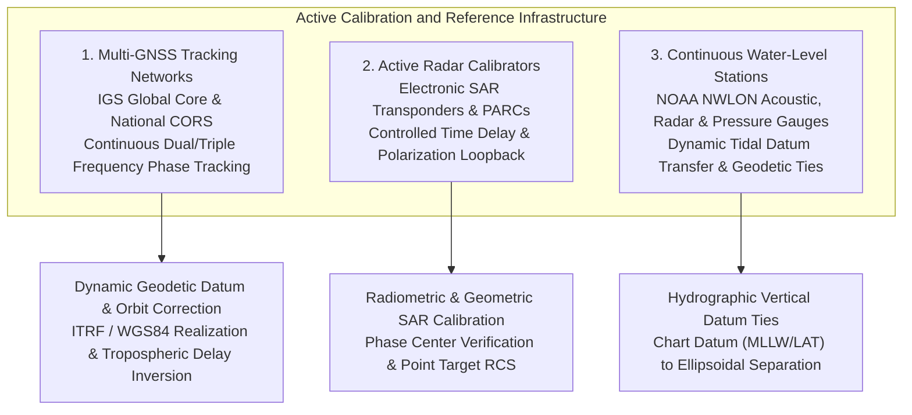
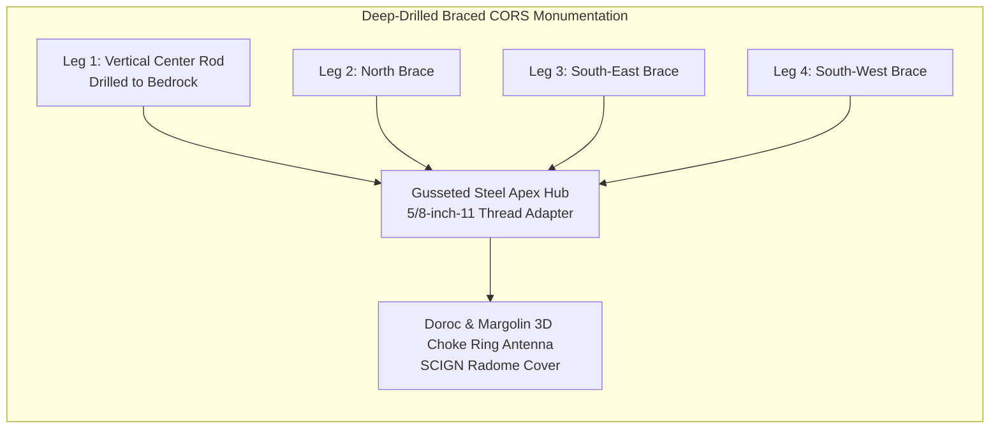
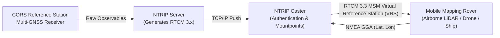
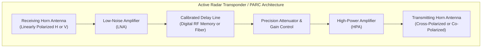
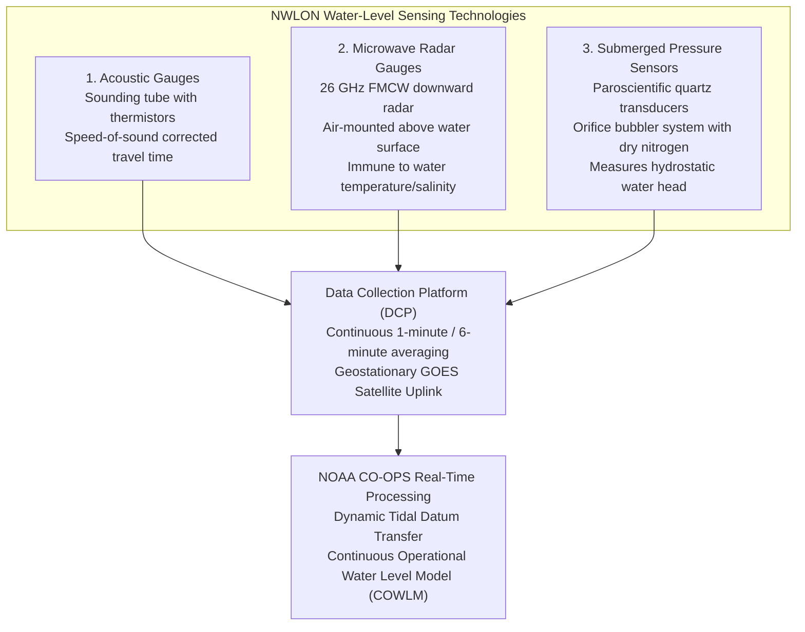
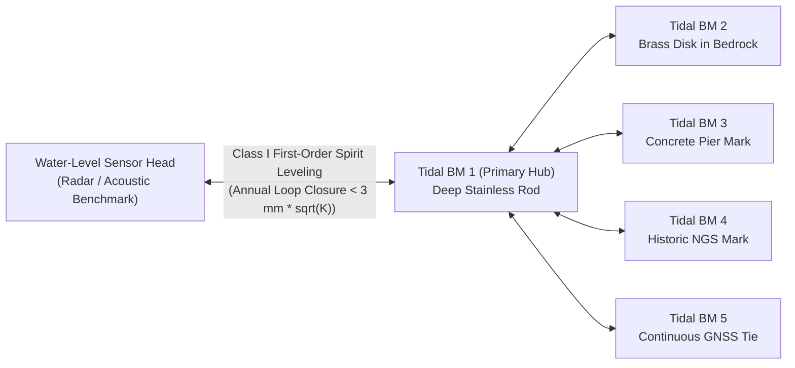

# Chapter 12: Calibration Targets, Reference Stations, and Ground Control Points (GCPs)

*Anchoring sensors to physical reality through active networks, static monuments, and engineered targets.*

High-precision digital elevation and bathymetric models cannot be produced in a geometric vacuum. Every remote sensor—whether an orbital SAR satellite, an airborne LiDAR scanner, an uncrewed aerial vehicle (UAV) photogrammetric camera, or a hull-mounted multibeam echosounder—relies on an unbroken chain of calibration and terrestrial reference frames to tie raw electromagnetic and acoustic observations to true geodetic coordinates. Without rigorously maintained ground and water-level reference infrastructure, systematic sensor biases, orbital drift, atmospheric variations, and unmodeled lever-arm offsets corrupt the resulting digital elevation models (DEMs). This chapter explores the engineered physical and electromagnetic interfaces that anchor mapping systems to the planet: active continuously operating networks, permanent physical monuments, engineered photogrammetric and radar calibration targets, ground control networks, and the vital operational separation between calibration and independent validation.

---

## 12.1 Active Calibration and Reference Infrastructure

Active reference infrastructure encompasses permanently powered, telemetrically monitored geodetic, electromagnetic, and hydrographic facilities that provide continuous observations of reference frames, platform trajectories, atmospheric delays, and dynamic water levels. Unlike passive marks, active infrastructure resolves the time-varying nature of the Earth's surface—such as plate tectonics, post-glacial rebound, tidal loading, and tropospheric water vapor variability.

---

### 12.1.1 Continuously Operating Reference Stations (CORS) and the IGS Network

At the foundation of all space-geodetic positioning for elevation mapping lies the global and regional tracking networks of the International GNSS Service (IGS) and national Continuously Operating Reference Station (CORS) networks, such as the NOAA National Geodetic Survey (NGS) CORS network.

#### Station Monumentation and Stability
A geodetic CORS station is designed to isolate the antenna from non-tectonic surface displacements (e.g., frost heave, seasonal soil moisture swelling, thermal expansion of buildings). High-grade CORS sites employ deep-drilled braced monuments: four or five stainless-steel legs drilled $5\text{–}15\text{ m}$ into solid bedrock or stable subsoil and welded into a rigid tetrahedral frame. Rooftop mounts on reinforced concrete structures are common in urban environments, but require continuous modeling of thermal building sway.

#### Antenna Calibration: ANTEX, Phase Center Offsets (PCO), and Phase Center Variations (PCV)
A GNSS antenna does not measure ranges to an idealized physical point; it measures carrier phase relative to an electromagnetic reception point known as the **Phase Center**. The apparent phase center varies as a function of the signal frequency $f$, satellite elevation angle $\theta$, and azimuth $\alpha$. 

The true vector from the Antenna Reference Point (ARP)—typically the physical center of the antenna mounting base—to the instantaneous phase center is decomposed into two distinct components:

$$\mathbf{r}_{\text{APC}}(f, \theta, \alpha) = \mathbf{r}_{\text{PCO}}(f) + \Delta \mathbf{r}_{\text{PCV}}(f, \theta, \alpha)$$

1. **Phase Center Offset ($\mathbf{r}_{\text{PCO}}$):** A constant 3D offset vector $[ \Delta N_0, \Delta E_0, \Delta U_0 ]^T$ defined in the antenna-fixed coordinate frame (North, East, Up) for each carrier frequency (e.g., GPS $L_1$, $L_2$, $L_5$; Galileo $E_1$, $E_{5a}$).
2. **Phase Center Variations ($\Delta \mathbf{r}_{\text{PCV}}$):** Residual phase variations (typically $0\text{–}20\text{ mm}$) that vary continuously across the antenna hemisphere as a function of incidence geometry $(\theta, \alpha)$:
   $$\Delta \mathbf{r}_{\text{PCV}}(f, \theta, \alpha) = \delta r(\theta, \alpha) \, \hat{\mathbf{e}}_{\text{los}}(\theta, \alpha)$$
   where $\hat{\mathbf{e}}_{\text{los}}$ is the unit line-of-sight vector toward the satellite.

Prior to 2006, geodetic positioning relied on **relative antenna calibrations** (referenced to an assumed "zero-error" reference antenna). In November 2006, the IGS adopted **absolute antenna calibrations** determined via automated robotic positioning in anechoic chambers. Absolute calibrations are standardized and published in **ANTEX** format (ASCII Antenna Exchange, current version 1.4). Failing to apply ANTEX corrections, or mixing relative and absolute antenna calibrations, induces vertical datum errors of $5\text{–}10\text{ cm}$ across airborne and satellite DEM trajectory solutions.

| Calibration Attribute | Relative Calibration (Pre-2006) | Absolute Robotic Calibration (ANTEX Modern) | Impact on Elevation ($Z$) |
| :--- | :--- | :--- | :--- |
| **Reference Standard** | Assumed reference antenna (AOAD/M_T) | Automated robot calibration in anechoic room | Eliminates baseline-length-dependent vertical scale errors |
| **Azimuthal Variation** | Often ignored ($\Delta r = \Delta r(\theta)$ only) | Full $360^\circ$ azimuth-dependent grid ($1^\circ \times 5^\circ$) | Suppresses asymmetric multipath and antenna asymmetry |
| **Radome Handling** | Bare antenna calibration used for radomes | Calibration performed with specific radome model attached | Radome-induced phase delays cause up to $20\text{ mm}$ vertical bias |
| **Multi-GNSS** | GPS only ($L_1, L_2$) | GPS, GLONASS, Galileo, BeiDou, QZSS ($L_1, L_2, L_5, E_1, E_5, B_1, B_2, B_3$) | Prevents inter-frequency vertical offsets in multi-constellation solutions |

#### Real-Time Network Transport: NTRIP and RTCM Protocols
For mobile mapping sensors (airborne LiDAR, UAVs, and hydrographic survey vessels) operating in real time, active CORS stations stream carrier phase and pseudorange observables over the Internet via the **Networked Transport of RTCM via Internet Protocol (NTRIP)**:

The NTRIP pipeline comprises:
* **NTRIP Source:** The GNSS receiver generating raw observations.
* **NTRIP Server:** The software daemon converting raw observations into standardized RTCM (Radio Technical Commission for Maritime Services) messages (e.g., RTCM 3.3 Multiple Signal Messages, MSM).
* **NTRIP Caster:** An HTTP-based broadcasting server that manages client authentication, mountpoints, and dynamic spatial routing.
* **NTRIP Client:** The mobile mapping rover. In Virtual Reference Station (VRS) or Master-Auxiliary Concept (MAC) networks, the rover sends its approximate position via NMEA-0183 `$GPGGA` strings, and the caster computes a customized, geometrically optimized correction stream that cancels ionospheric and tropospheric gradients across the local mapping area.

#### Daily Coordinate Time Series and Geodynamic Velocity Fields
Active reference stations provide daily coordinate time series (processed via Precise Point Positioning [PPP] or double-difference network solutions). Over decades of operation, these time series quantify secular tectonic plate velocities, seasonal hydrological loading, post-glacial rebound (Glacial Isostatic Adjustment, GIA), and co-seismic / post-seismic slip:

$$\mathbf{x}(t) = \mathbf{x}_0 + \mathbf{v} (t - t_0) + \sum_{k=1}^P \mathbf{A}_k \sin\left(\frac{2\pi t}{T_k} + \phi_k\right) + \sum_{j=1}^Q \Delta \mathbf{x}_j \mathcal{H}(t - t_j)$$

where $\mathbf{v}$ is the secular geodetic velocity vector, $\mathbf{A}_k$ are annual and semi-annual hydrological and atmospheric loading amplitudes, and $\Delta \mathbf{x}_j \mathcal{H}(t - t_j)$ represents instantaneous step discontinuities caused by earthquakes or antenna replacements (using the Heaviside step function $\mathcal{H}$). In active tectonic margins (e.g., California, Cascadia, New Zealand, Japan), failing to tie airborne LiDAR or UAV flights to the station epoch $\mathbf{x}(t)$ introduces multi-decimeter horizontal and vertical discrepancies when comparing DEMs collected only a few years apart.

---

### 12.1.2 Active Radar Targets: SAR Transponders and PARCs

Spaceborne Synthetic Aperture Radar (SAR) systems, such as ESA's Sentinel-1, the German TanDEM-X/TerraSAR-X constellation, and the NASA-ISRO SAR (NISAR), require high-precision geometric, radiometric, and polarimetric calibration. While passive corner reflectors (discussed in Section 12.3) are effective, their physical size becomes prohibitive at longer radar wavelengths (e.g., L-band $\lambda \approx 24\text{ cm}$ requires trihedral reflectors $>3\text{–}5\text{ m}$ across). To overcome these physical constraints, active electronic radar targets are deployed.

#### Electronic SAR Transponders
An electronic radar transponder receives the incoming microwave chirp transmitted by an orbital SAR platform, amplifies the signal with a stable, calibrated gain $G$, introduces an exact internal electronic delay $\tau_{\text{delay}}$, and re-radiates the signal back toward the satellite:

1. **Radar Cross Section (RCS) Synthesis:** An active transponder with small physical antennas (aperture $<0.5\text{ m}$) can electronically synthesize an effective radar cross section exceeding $\sigma = 60\text{ dBm}^2$ ($1,000,000\text{ m}^2$), appearing as a brilliant, distinct point target in the focused SAR image without the massive weight and wind load of a passive metallic reflector.
2. **Internal Delay Calibration:** The internal time delay $\tau_{\text{delay}}$ is known to sub-nanosecond accuracy ($<0.1\text{ ns}$, corresponding to $<1.5\text{ cm}$ in two-way range). By subtracting $\tau_{\text{delay}}$, SAR processing facilities calculate the exact electronic phase center of the transponder, enabling absolute slant-range geolocation calibration down to centimeter precision.

#### Polarimetric Active Radar Calibrators (PARCs)
In polarimetric SAR (PolInSAR) calibration, system cross-talk (leakage between horizontal and vertical polarization channels) and channel imbalance (amplitude and phase discrepancies between H and V transmit/receive paths) distort the complex scattering matrix. A **Polarimetric Active Radar Calibrator (PARC)** decouples these errors by receiving on one polarization (e.g., $H$) and re-transmitting on the orthogonal polarization (e.g., $V$):

$$\mathbf{S}_{\text{PARC}} = \begin{bmatrix} 0 & 0 \\ G_{vh} e^{j \phi_{vh}} & 0 \end{bmatrix}$$

Because a standard trihedral corner reflector produces purely co-polarized backscatter ($S_{hh} = S_{vv}$, $S_{hv} = S_{vh} = 0$), it cannot isolate cross-polarization channel imbalances. PARCs provide the explicit non-zero cross-polar term needed to calibrate spaceborne PolInSAR baselines for bare-earth sub-canopy DTM extraction.

---

### 12.1.3 Continuous Water-Level Stations and the National Water Level Observation Network (NWLON)

In coastal, estuarine, and hydrographic mapping, dynamic water levels represent the single largest time-varying vertical error source. Hull-mounted multibeam sonars measure water depth relative to the instantaneous sea surface. Converting these depths into a static vertical datum (e.g., Mean Lower Low Water [MLLW] for navigation safety, or NAVD88 / NAPGD2022 for coastal flood resilience) requires active water-level monitoring.

#### The NOAA NWLON Network
The NOAA National Ocean Service (NOS) Center for Operational Oceanographic Products and Services (CO-OPS) maintains the National Water Level Observation Network (NWLON), a suite of approximately 210 long-term, continuously operating water-level stations across the coastal United States, Great Lakes, and Pacific/Caribbean territories. NWLON stations establish the physical basis of the National Tidal Datum Epoch (NTDE)—a specific 19-year metonic cycle (currently 1983–2001) that averages out astronomical tidal variations, including the 18.61-year regression of the lunar nodes.

#### Sensor Modalities: Acoustic vs. Microwave Radar vs. Pressure
Modern water-level monitoring has transitioned across three primary sensing regimes:
1. **Acoustic Water-Level Sensors (e.g., Aquatrak):** A sound pulse travels down a vertical protective "sounding tube" to the water surface. Calibration relies on an internal reference pin located at a known physical distance within the tube to dynamically measure sound speed in air, compensating for ambient temperature gradients.
2. **Microwave Radar Sensors (e.g., Miros, Design Analysis H-3611):** Non-contact, high-frequency ($26\text{ GHz}$ or $80\text{ GHz}$) frequency-modulated continuous-wave (FMCW) radar units mounted directly on piers or bridge spans overlooking the water. Because electromagnetic propagation through air is virtually immune to temperature, humidity, and salinity gradients compared to acoustic pulses, radar gauges have become the modern standard, eliminating the biofouling and maintenance issues associated with submerged acoustic sounding tubes.
3. **Submerged Quartz Pressure Transducers & Bubbler Systems:** Deployed in high-energy or freezing environments where surface structures cannot survive. A constant flow of dry nitrogen gas is forced through a submerged copper orifice (bubbler line). The pressure required to push bubbles out of the orifice equals the hydrostatic pressure head $\rho_w g h$. Precise barometric pressure compensation is applied using co-located surface barometers.

#### Spirit-Leveling Ties to Tidal Benchmark Arrays
The most technologically advanced water-level sensor is useless if the station itself settles, tilts, or undergoes structural deflection. NOAA NOS policy mandates that every NWLON station be physically anchored to an array of **at least 5 to 10 permanent geodetic tidal benchmarks** distributed across stable geology onshore.

1. **First-Order Class I Differential Spirit Leveling:** Annually, hydrographic field teams run double-run differential spirit leveling loops connecting the sensor's reference mark to all benchmarks in the array. The maximum allowable loop misclosure is:
   $$\Delta h_{\text{closure}} \le 3.0\text{ mm} \sqrt{K}$$
   where $K$ is the leveling loop distance in kilometers.
2. **Benchmark Network Redundancy:** If the pier housing the radar gauge settles by $12\text{ mm}$ due to pile driving or seasonal sediment consolidation, leveling ties to the onshore bedrock marks immediately detect and isolate the motion, preventing an erroneous vertical datum shift from corrupting coastal DEMs and bathymetric charts.
3. **Colocated GNSS Ties:** Modern NWLON stations feature a permanent GNSS receiver atop the gauge structure or on the primary tidal benchmark. This directly ties the local tidal datums (MLLW, MHW) to the global geodetic ellipsoid ($h_{\text{ITRF}}$), providing the empirical calibration ties that underpin tools like NOAA's **VDatum** and vertical datum separation models globally.
