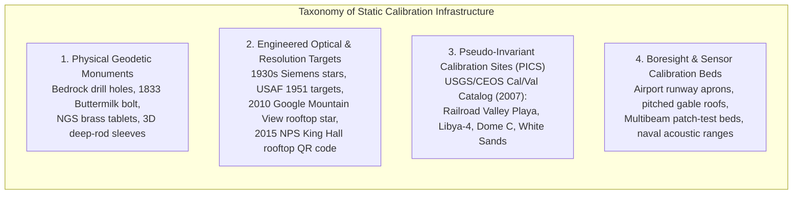
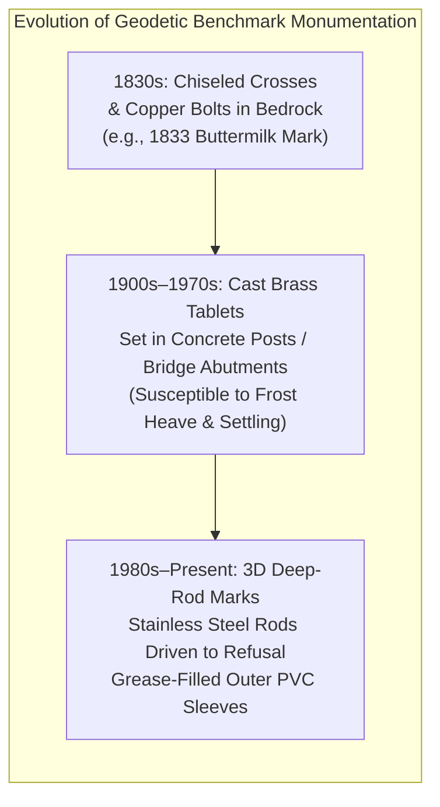
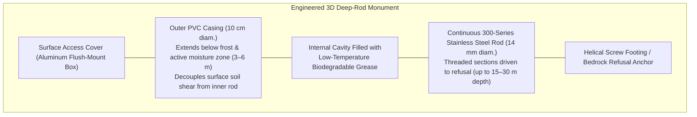
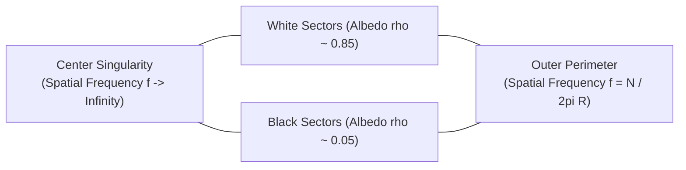
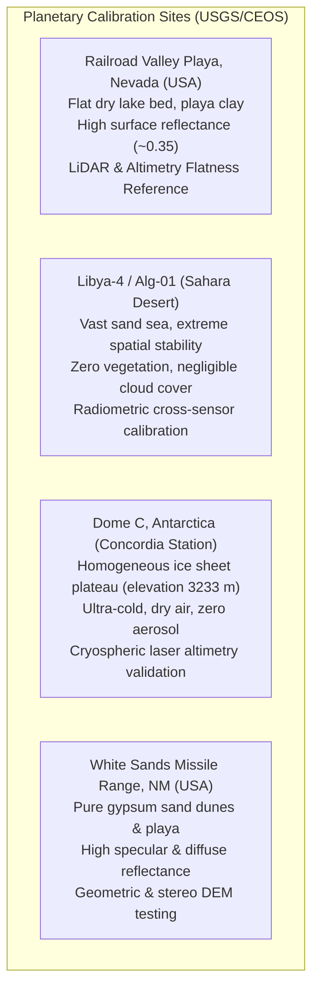

# Chapter 12: Calibration Targets, Reference Stations, and Ground Control Points (GCPs)

*Anchoring sensors to physical reality through active networks, static monuments, and engineered targets.*

---

## 12.2 Static Calibration Locations and Monuments on the Planet

While active electronic networks track dynamic, time-dependent reference frames, the fundamental physical reality of the Earth's surface is anchored by static monuments, permanent geometric targets, and designated planetary calibration sites. From 19th-century geodetic drill holes in granite to engineered resolution targets painted on commercial rooftops and vast desert playas observed by orbital satellites, static calibration infrastructure provides the enduring ground truth against which sensor optics, lasers, radars, and sonars are calibrated.

---

### 12.2.1 Geodetic Benchmarks and Physical Monumentation

The elevation assigned to any digital elevation model (DEM) is ultimately referenced to a physical network of surveyed benchmarks. The physical construction of these marks dictates their long-term vertical and horizontal stability over decades and centuries.

#### The 1833 "Buttermilk" Bolt
The oldest surviving geodetic survey mark in the United States is the **Buttermilk** station, established in 1833 by Ferdinand Rudolph Hassler, the first Superintendent of the United States Coast Survey. Located on a high ridge in Westchester County, New York, Hassler anchored the primary triangulation network by drilling into crystalline bedrock and driving an iron cone and copper bolt into the rock. Re-surveyed repeatedly across nearly two centuries (using classical theodolites, EDM baseline measurements, and modern high-precision GPS/GNSS), the Buttermilk mark demonstrates that when a geodetic monument is anchored directly into unweathered crystalline bedrock, its secular local displacement relative to regional tectonic motion is essentially zero.

#### NGS Brass Tablets vs. Infrastructure Subsidence Pitfalls
Throughout the 20th century, the U.S. Coast and Geodetic Survey (now NGS) installed hundreds of thousands of standard $3.5\text{-inch}$ ($9\text{ cm}$) diameter bronze disks set into pre-cast concrete posts, boulder outcrops, and civil engineering structures (bridge abutments, municipal buildings, railway culverts). 

While durable, mounting benchmarks in civil infrastructure introduces severe vertical stability risks:
* **Bridge Abutment Settlement:** Highway overpasses and bridge abutments frequently settle by $5\text{–}30\text{ cm}$ over multiple decades as heavy vehicular loads consolidate underlying alluvial sediments.
* **Frost Heave:** Concrete surface posts whose footings do not extend below the local frost penetration depth ($1\text{–}2\text{ m}$ in northern latitudes) are physically ratcheted upward during winter freeze-thaw cycles.
* **Structural Thermal Expansion:** Massive concrete structures experience diurnal and seasonal thermal swelling and contraction ($1\text{–}5\text{ mm}$), polluting high-precision vertical networks.

#### 3D Deep-Rod Geodetic Monuments
To eliminate near-surface soil motion, modern geodetic agencies install **3D deep-rod stainless steel monuments**:

* **Inner Stainless Steel Rod:** Successive $1.2\text{-m}$ sections of threaded 316 stainless steel rod are driven into the ground using a pneumatic or gasoline hammer until reaching refusal (typically $10\text{–}30\text{ m}$ deep, defined as less than $1\text{ mm}$ penetration per 100 blows).
* **Outer PVC Sleeve and Annular Grease:** The upper $3\text{–}6\text{ m}$ of the rod (spanning the active zone of soil moisture expansion, seasonal drought shrinkage, and winter frost heave) is shielded inside a larger PVC pipe. The annular space between the rod and sleeve is packed with low-temperature grease. Any seasonal soil shearing, swelling, or frost jacking acts solely on the outer sleeve, allowing the inner rod to remain vertically motionless relative to the deep stratum.
* **Datum Cap:** The top of the rod is capped with a machined spherical-tip brass or stainless benchmark datum point, providing a repeatability of $<1\text{ mm}$ for differential spirit leveling and GNSS antenna tripod setups.

---

### 12.2.2 Optical, Photogrammetric, and Coded Targets

Passive optical targets engineered on the Earth's surface provide the spatial resolution, contrast, and mathematical sharpness needed to evaluate the airborne and spaceborne optical imaging systems that generate stereo and Structure-from-Motion (SfM) DEMs.

#### The Siemens Star (Spoke Target)
Invented by the German firm Siemens in the 1930s for calibrating optical lens systems, the **Siemens star** (or spoke target) consists of alternating high-contrast black and white radial sectors converging at a central singularity:

As the radius $r$ approaches the center, the angular spatial frequency $f(r) = \frac{N}{2\pi r}$ increases continuously toward infinity, where $N$ is the total number of spoke pairs. When an airborne or orbital sensor observes a ground-painted Siemens star:
1. **Blur Circle and MTF Cutoff:** Optical diffraction, sensor aberration, detector pixel aperture, and atmospheric turbulence blur the high frequencies. At a specific critical radius $r_{\text{blur}}$, the contrast between the black and white spokes drops to zero (the Rayleigh resolution limit).
2. **Radial Asymmetry and Astigmatism:** If the optical system exhibits asymmetric blur, camera motion smear along the flight track, or optical astigmatism, the circular blur boundary deforms into an ellipse. The major and minor axes of the ellipse quantify the along-track vs. across-track Point Spread Function (PSF).

#### The 2010 Google Mountain View Rooftop Siemens Star
In 2010, Google painted a giant 36-spoke Siemens star target on the rooftop of its Building 43 headquarters in Mountain View, California ($37^\circ 25' 19''\text{ N}, 122^\circ 05' 03''\text{ W}$). Measuring approximately $20\text{ m}$ in diameter, this ground target was specifically engineered to calibrate the Point Spread Function (PSF), Modulation Transfer Function (MTF), and effective ground sample distance (GSD) of high-resolution commercial Earth observation satellites (e.g., GeoEye-1, WorldView-1/2) and high-altitude aerial photography aircraft providing orthorectified imagery for Google Earth and Google Maps.

#### The USAF 1951 Three-Bar Target
The MIL-STD-150A target (developed by the U.S. Air Force in 1951) consists of groups of three horizontal and three vertical rectangular bars with a 5:1 aspect ratio. The bar widths and spacings decrease in geometric progression by a factor of $2^{1/6}$ across groups and elements:

$$\text{Spatial Frequency } f = 2^{\text{Group} + \frac{\text{Element}-1}{6}} \quad [\text{line pairs per unit length}]$$

Permanent concrete USAF 1951 targets are maintained at military flight test ranges (e.g., Edwards Air Force Base, California; Fort Huachuca, Arizona) for testing aerial reconnaissance cameras and high-altitude mapping sensors.

#### Rooftop Coded Targets: The 2015 NPS King Hall QR Code
In 2015, researchers and students at the Naval Postgraduate School (NPS) in Monterey, California, painted an enormous, high-contrast Quick Response (QR) code onto the rooftop of King Hall. Spanning approximately $10\text{ m} \times 10\text{ m}$, the coded target encoded a URL and geographic coordinates readable from low-Earth-orbit satellites and drones. 

Beyond demonstrating machine-readable optical decoding from space, this installation highlighted the operational utility of **coded rooftop fiducials** (such as large-format AprilTags, ChArUco checkerboards, and circular ring targets). Because coded targets possess unambiguous topological symmetry and encoded digital bit patterns:
* Image processing software detects and extracts sub-pixel corner coordinates automatically without human intervention.
* In automated UAV mapping pipelines, coded rooftop targets eliminate false matches, providing millimeter-accurate tie-points for Structure-from-Motion bundle adjustments.

---

### 12.2.3 The USGS/CEOS Cal/Val Test Sites Catalog and Planetary PICS

For spaceborne sensors (Landsat, Sentinel-2, ASTER, ICESat-2, GEDI, TanDEM-X), deploying artificial physical targets across the globe is logistically impossible. Instead, calibration scientists rely on large, natural, spatially homogeneous terrestrial regions termed **Pseudo-Invariant Calibration Sites (PICS)**.

In 2007, the Committee on Earth Observation Satellites (CEOS) Working Group on Calibration and Validation (WGCV), in collaboration with the USGS, established the **USGS/CEOS Cal/Val Test Sites Catalog**, formalizing standard reference sites:

| Site Name | Location | Elevation | Surface Type | Primary Mapping Cal/Val Role |
| :--- | :--- | :--- | :--- | :--- |
| **Railroad Valley Playa** | Nevada, USA ($38.5^\circ\text{ N}, 115.7^\circ\text{ W}$) | $1435\text{ m}$ | Dry salt lake bed (clay/silt) | Absolute radiometric & geometric calibration; flat elevation reference for airborne/satellite LiDAR (ICESat-2). |
| **Libya-4** | Libyan Desert ($28.5^\circ\text{ N}, 23.4^\circ\text{ E}$) | $118\text{ m}$ | Uniform sand sea | Global benchmark for multi-satellite optical sensor intercalibration over decades. |
| **Dome C (Concordia)** | Antarctic Plateau ($75.1^\circ\text{ S}, 123.3^\circ\text{ E}$) | $3233\text{ m}$ | High-elevation perennial snow | Stable ice elevation benchmark for spaceborne radar altimeters (CryoSat-2) and laser altimeters (ICESat/ICESat-2). |
| **White Sands** | New Mexico, USA ($32.9^\circ\text{ N}, 106.3^\circ\text{ W}$) | $1218\text{ m}$ | Pure gypsum sand dunes/flats | High-contrast geometric calibration, sensor MTF validation, and UAV DEM slope testing. |

---

### 12.2.4 Dedicated LiDAR and Hydrographic Calibration Sites

#### Airborne and UAV LiDAR Calibration Beds
Airborne laser scanning systems require routine boresight calibration to eliminate mechanical and optical angular misalignments ($\Delta \omega, \Delta \phi, \Delta \kappa$) between the laser scanner head and the Inertial Measurement Unit (IMU):
* **Airport Runways:** Long, planar, smooth asphalt or concrete surfaces with known slopes ($<0.5\%$) surveyed by mobile terrestrial laser scanners or geodetic leveling. Flying reciprocal (opposite-direction) flight lines over a flat runway directly isolates **roll misalignment** ($\Delta \phi$).
* **Pitched Gable Roofs:** Industrial warehouses or residential buildings with steeply pitched ($30^\circ\text{–}45^\circ$), clean gabled roofs oriented perpendicular and parallel to the flight tracks. The opposing planar facets provide strong 3D intersection lines that decouple **pitch** ($\Delta \omega$) and **heading/yaw** ($\Delta \kappa$) boresight angles.

#### Hydrographic Patch-Test Beds and Acoustic Ranges
Multibeam echosounders (MBES) require periodic "patch tests" to calibrate roll, pitch, yaw, and positioning latency. Dedicated hydrographic patch-test sites must satisfy three bathymetric criteria:
1. **Flat Seafloor Bed:** An extensive, flat, horizontal seafloor patch ($<0.5^\circ$ slope) in deep water for reciprocal roll lines.
2. **Steep Bathymetric Slope / Scarp:** A steep submarine ridge, continental slope terrace, or dredged channel edge ($>15^\circ\text{–}30^\circ$ slope) for pitch calibration (reciprocal lines at identical speed) and latency calibration (same direction at two different speeds, e.g., $4\text{ knots}$ vs. $10\text{ knots}$).
3. **Isolated 3D Seafloor Feature:** A discrete rocky pinnacle, large isolated boulder, or prominent shipwreck (e.g., naval target hulk) on a flat seafloor, surveyed along offset parallel lines to isolate heading/yaw misalignment ($\Delta \psi$).
4. **Naval Acoustic Tracking Ranges:** Permanent underwater acoustic ranges (e.g., AUTEC in the Bahamas, Nanoose Bay in British Columbia) equipped with calibrated bottom-mounted acoustic hydrophone arrays and transponder fields, providing sub-decimeter ground truth trajectories for submarine and AUV bathymetric mapping systems.
