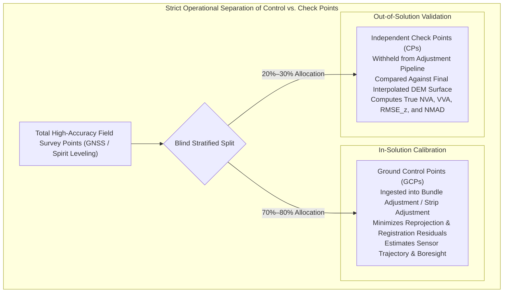
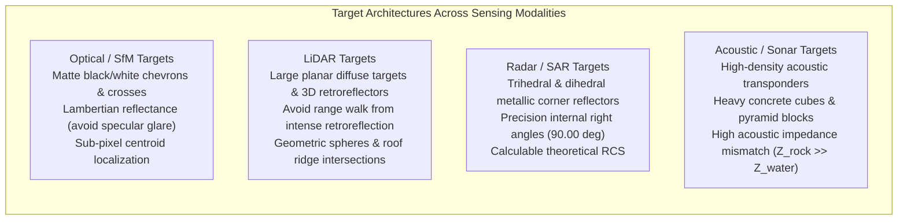
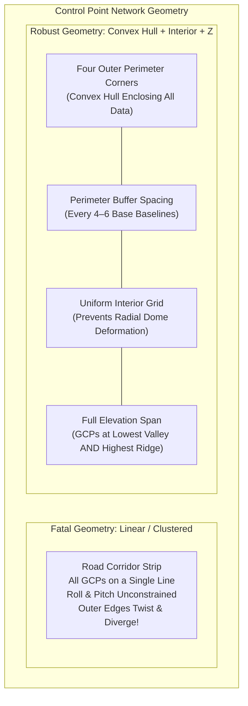

# Chapter 12: Calibration Targets, Reference Stations, and Ground Control Points (GCPs)

*Anchoring sensors to physical reality through active networks, static monuments, and engineered targets.*

---

## 12.3 Ground Control Points (GCPs) vs. Independent Check Points (CPs)

In digital elevation modeling, spatial control points serve two fundamentally conflicting purposes: adjusting the mathematical sensor model to eliminate systematic orientation errors, and objectively assessing the residual accuracy of the final surface model. Conflating these two roles is one of the most widespread methodological errors in modern photogrammetry, LiDAR, and bathymetric mapping.

---

### 12.3.1 The Cardinal Rule of Validation

The **Cardinal Rule of Geospatial Accuracy Assessment** states:
> *No point utilized in the estimation of sensor exterior orientation, camera interior orientation, LiDAR strip matching, or surface gridding may ever be used to calculate reported positional accuracy.*

When a Ground Control Point (GCP) is introduced into a photogrammetric bundle adjustment or LiDAR strip adjustment, the least-squares optimization minimizes the residual error at that exact spatial coordinate:

$$\min_{\mathbf{x}_{\text{ext}}, \mathbf{x}_{\text{int}}} \sum_{i \in \text{GCP}} \mathbf{v}_i^T \mathbf{P}_i \mathbf{v}_i$$

where $\mathbf{v}_i$ is the residual vector and $\mathbf{P}_i$ is the weight matrix. The residual $\mathbf{v}_i$ at a GCP reflects only the **goodness-of-fit** of the mathematical model to the observations, not the actual accuracy of the reconstructed surface away from the control points. 

If an operator calculates Root Mean Square Error ($\text{RMSE}_z$) using GCP residuals, the reported error is artificially depressed (often by a factor of $3\times\text{–}10\times$), creating an illusion of millimeter precision while catastrophic doming, twisting, or edge-flaring errors remain undetected across the wider terrain model. True positional accuracy can only be quantified by comparing the finished DEM against **Independent Check Points (CPs)** that were strictly withheld from every stage of the geometric processing pipeline.

| Metric Attribute | Ground Control Point (GCP) | Independent Check Point (CP) |
| :--- | :--- | :--- |
| **Pipeline Role** | Calibration / Constrained Optimization | Independent Accuracy Verification |
| **Inclusion in Adjustment** | Ingested into Bundle Adjustment / Strip Alignment | **Strictly Withheld** (Out-of-Solution) |
| **Residual Meaning** | Internal model adjustment residual | True absolute surface error ($z_{\text{DEM}} - z_{\text{true}}$) |
| **Susceptibility to Overfitting** | High (can overfit lens distortions or strip shifts) | Zero (unbiased statistical validation) |
| **Standard Minimum Count** | 5–15 points (depending on project geometry) | Minimum 20–30 points per land-cover class (ASPRS/USGS) |

---

### 12.3.2 Multi-Modal Target Design

A target that provides perfect optical contrast can be invisible or catastrophic to an airborne LiDAR or spaceborne radar. Target design must conform directly to the physical measurement mechanism of the interrogating sensor.

#### Optical and Photogrammetric Targets
* **Pattern Geometry:** Standard targets employ diagonal quadrant checkerboards, black-and-white "Maltese crosses," or corner chevrons. The central intersection provides an unambiguous, scale-invariant point feature.
* **Surface Radiometry:** Targets must be fabricated from ultra-matte materials (non-glossy paint, heavy canvas, or textured polymer). Glossy vinyl or shiny metal exhibits specular reflection, which saturates camera CMOS sensors at high sun angles, blooming nearby pixels and shifting the computed centroid by several pixels.
* **Target Sizing Rule of Thumb:** The physical dimensions of the target must span at least **$8\text{–}12 \times \text{GSD}$** (Ground Sample Distance) in the aerial imagery to ensure reliable sub-pixel edge detection and centroid estimation.

#### LiDAR Targets: Retroreflective vs. Geometric Targets
* **The "Range Walk" Trap of Retroreflectors:** Highly retroreflective glass-bead tapes (e.g., 3M Scotchlite) reflect orders of magnitude more photon energy than natural soil. In full-waveform and constant-fraction discriminator (CFD) LiDAR detectors, the saturated electrical pulse triggers timing thresholds prematurely—an optical-electronic phenomenon known as **range walk**—causing the target to appear elevated by several centimeters above its true physical surface.
* **Diffuse Planar Targets:** For airborne and mobile LiDAR, targets must consist of large flat panels ($1.0\text{–}2.0\text{ m}$ square) with known, moderate diffuse reflectivity ($\rho \approx 50\%$).
* **3D Geometric Targets:** In terrestrial laser scanning (TLS) and mobile mapping, target centers are defined using 3D geometric shapes: precision-machined matte white spheres (where least-squares sphere-fitting determines the center with sub-millimeter precision regardless of incidence angle) or 3D dihedral/trihedral roof facets.

#### Radar and InSAR Targets: Trihedral Corner Reflectors
For radar satellites, passive control points rely on **trihedral corner reflectors**: three mutually orthogonal triangular or square conductive metal plates (aluminum or steel mesh).
* **Triple-Bounce Invariance:** Any radar wave entering the aperture undergoes three successive specular reflections off the orthogonal planes and is redirected back along the exact incident vector, creating an intense, point-like radar echo with a precisely known phase center at the inner apex.
* **Alignment:** The boresight axis of the corner reflector must be mechanically oriented in azimuth and elevation to align with the satellite's line-of-sight (LOS) within $\pm 1^\circ\text{–}2^\circ$.

#### Marine and Hydrographic Control Targets
Underwater control targets operate under acoustic propagation physics:
* **Seafloor Acoustic Transponders:** Long Baseline (LBL) acoustic beacons mounted on concrete seabed tripods with precise calibrated turnaround delays.
* **High-Impedance Structural Blocks:** Heavy pre-cast concrete pyramidal blocks or steel frames placed on soft silty seafloors. The massive acoustic impedance contrast between seawater ($Z \approx 1.5 \times 10^6\text{ kg}/(\text{m}^2\cdot\text{s})$) and solid concrete ($Z \approx 8.0 \times 10^6\text{ kg}/(\text{m}^2\cdot\text{s})$) produces sharp acoustic backscatter targets in high-frequency multibeam and sidescan sonars.

---

### 12.3.3 Spatial Distribution and Elevation Network Geometry

The mathematical stability of a photogrammetric block or LiDAR strip adjustment is governed by the spatial and vertical network geometry of its control points. Poorly distributed control points leave the mathematical system ill-conditioned, leading to severe geometric distortion away from the points.

#### The Convex Hull Principle
Control points must enclose the entire project area within their **convex hull**. Any mapping data collected outside the perimeter of the control network relies on **extrapolation** rather than interpolation:
* In photogrammetry, extrapolating beyond control points causes unconstrained bundle blocks to tilt, curl upward, or twist like a diving board.
* The outer perimeter of the mapping block must have GCPs placed at intervals no greater than 4 to 6 image baselines along the border.

#### Interior Grid and Prevention of "Domes"
A perimeter-only network of GCPs can restrain tilt and scale at the borders, but cannot prevent non-linear interior deformation. In UAV photogrammetry using consumer-grade rolling-shutter or non-metric radial lenses, uncalibrated radial lens distortion parameters ($k_1, k_2$) correlate directly with camera elevation ($Z$). Without interior control points, the bundle adjustment produces a classic **bowl or dome deformation**—where the center of a perfectly flat terrain is artificially warped upward or downward by tens of centimeters. Placing regular interior control points breaks this mathematical parameter correlation.

#### Vertical (Z) Span: The Danger of Elevation Extrapolation
In mountainous or hilly terrain, placing control points solely along easily accessible valley roads introduces a catastrophic vertical geometry flaw:
* If the surveyed terrain spans elevations from $200\text{ m}$ to $1200\text{ m}$, but all GCPs are located between $200\text{ m}$ and $350\text{ m}$, any vertical datum tilt or focal length error is multiplied across the higher terrain.
* Control and check points must be stratified across the **entire vertical range** of the project, including high ridges, mid-slopes, and valley bottoms.
