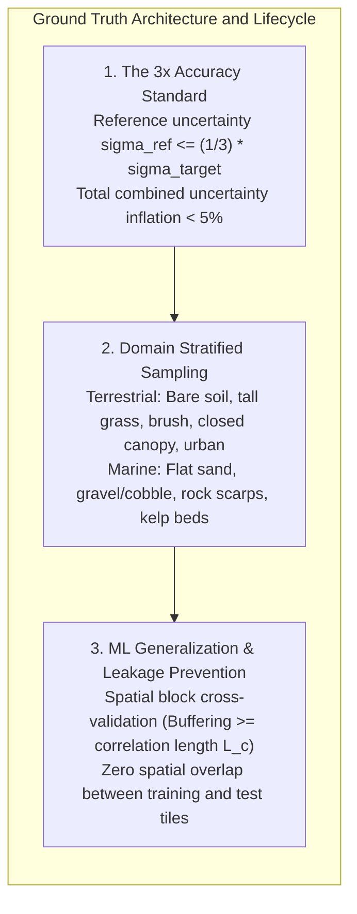
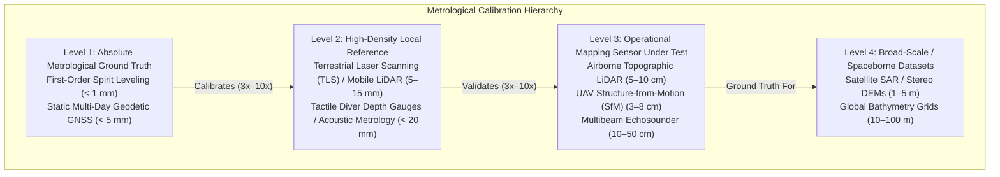
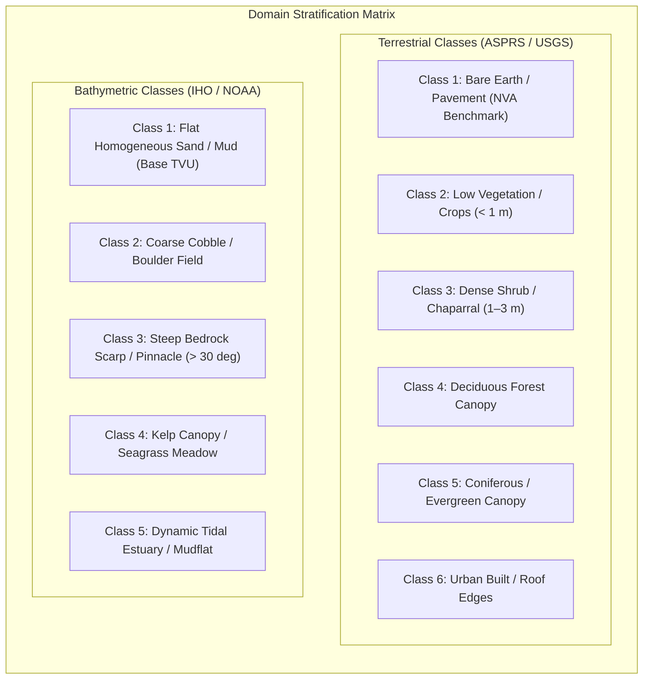
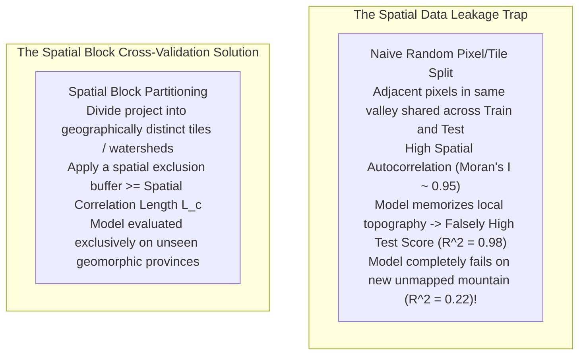

# Chapter 12: Calibration Targets, Reference Stations, and Ground Control Points (GCPs)

*Anchoring sensors to physical reality through active networks, static monuments, and engineered targets.*

---

## 12.4 Ground Truth and Calibration Datasets: Creation, Validation, and Use

In remote sensing and elevation modeling, "ground truth" represents the reference dataset against which newly acquired sensor models and algorithms are calibrated and evaluated. However, ground truth is never absolute perfection; it is simply another physical measurement with an uncertainty budget that is sufficiently smaller than the system under test to be treated as negligible. Establishing, stratifying, and preserving the statistical integrity of reference elevation data requires strict adherence to metrological standards, ecological stratification, and machine learning spatial partitioning.

---

### 12.4.1 The $3\times$ Accuracy Rule and Reference Hierarchy

Both the Federal Geographic Data Committee (FGDC) National Standard for Spatial Data Accuracy (NSSDA) and the American Society for Photogrammetry and Remote Sensing (ASPRS) Positional Accuracy Standards mandate the **$3\times$ Accuracy Rule**:
> *The independent reference dataset used to evaluate the vertical and horizontal accuracy of a geospatial product must be at least three times ($3\times$) more accurate than the target accuracy specification of the product being evaluated.*

#### Mathematical Justification of the $3\times$ Rule
When a check survey measurement $z_{\text{ref}}$ is compared against an interpolated DEM surface elevation $z_{\text{DEM}}$, the observed elevation difference $\Delta z = z_{\text{DEM}} - z_{\text{ref}}$ incorporates the variances of both the product under test and the reference survey:

$$\sigma_{\Delta z}^2 = \sigma_{\text{DEM}}^2 + \sigma_{\text{ref}}^2$$

If the reference dataset is collected such that $\sigma_{\text{ref}} \le \frac{1}{3} \sigma_{\text{DEM}}$, then substituting into the variance equation yields:

$$\sigma_{\Delta z} = \sqrt{\sigma_{\text{DEM}}^2 + \left(\frac{1}{3} \sigma_{\text{DEM}}\right)^2} = \sqrt{\sigma_{\text{DEM}}^2 \left(1 + \frac{1}{9}\right)} = \sigma_{\text{DEM}} \sqrt{\frac{10}{9}} \approx 1.054 \, \sigma_{\text{DEM}}$$

The observed test statistic inflates the true DEM uncertainty by only **$5.4\%$**. If an operator violates this rule and evaluates a $10\text{-cm}$ LiDAR dataset using a $10\text{-cm}$ RTK GNSS survey ($\sigma_{\text{ref}} = \sigma_{\text{DEM}}$), the observed discrepancy inflates to $\sqrt{2} \approx 1.414 \, \sigma_{\text{DEM}}$—a **$41.4\%$ error inflation** that falsely attributes surveying errors in the check points to flaws in the elevation model.

---

### 12.4.2 Stratified Sampling Across Land-Cover and Benthic Regimes

Terrain roughness, vegetative canopy penetration, and benthic bottom scattering drastically alter elevation measurement errors. An elevation model that achieves $\text{RMSE}_z = 4\text{ cm}$ over flat asphalt may degrade to $\text{RMSE}_z = 45\text{ cm}$ beneath dense coniferous forest or over macroalgae-covered reefs. Consequently, ground truth evaluation cannot rely on simple random sampling across an entire map sheet.

#### Terrestrial Land-Cover Stratification (ASPRS Guidelines)
Under modern ASPRS and USGS 3DEP specifications, validation check points are strictly stratified into two primary statistical categories:
1. **Non-Vegetated Vertical Accuracy (NVA):** Evaluated exclusively on flat or uniformly sloping open ground where laser or optical sightlines are unobstructed:
   * Flat paved surfaces (concrete highway slabs, asphalt runways).
   * Bare plowed agricultural soil or compacted dirt.
   * Short, mowed turfgrass ($<5\text{ cm}$ height).
   Because the error distribution in non-vegetated terrain closely approximates a Gaussian normal distribution, accuracy is evaluated using parametric Root Mean Square Error ($\text{RMSE}_z$) and reported at the $95\%$ confidence level:
   $$\text{NVA}_{95\%} = 1.9600 \cdot \text{RMSE}_z$$
2. **Vegetated Vertical Accuracy (VVA):** Evaluated across diverse vegetative canopies where laser pulses or optical rays suffer partial obscuration, multipath, and clipping:
   * Tall weeds, crops, and dense brush ($0.5\text{–}2\text{ m}$).
   * Deciduous forest (both leaf-on and leaf-off conditions).
   * Evergreen / coniferous forest (dense multi-layer needle canopy).
   * Steep vegetated slopes ($>20^\circ$).
   Vegetation errors exhibit heavy, positive, non-Gaussian skewness (because near-ground returns are frequently misclassified understory returns). VVA must never be evaluated using standard deviation or Gaussian $\text{RMSE}_z$; it must be computed non-parametrically using the **95th percentile absolute error**:
   $$\text{VVA}_{95\%} = \text{Percentile}_{95}(|z_{\text{DEM}} - z_{\text{ref}}|)$$

#### Bathymetric and Benthic Stratification
Hydrographic error budgets exhibit analogous physical dependencies:
* **Acoustic Impedance & Penetration:** On soft fluid mud, high-frequency ($300\text{–}400\text{ kHz}$) acoustic soundings reflect off the flocculent suspension interface, whereas low-frequency ($12\text{–}38\text{ kHz}$) soundings penetrate meters deeper to consolidate clay. Ground truth lead-line or diver plate measurements must specify the exact acoustic frequency being validated.
* **Benthic Flora Obscuration:** Dense canopy-forming kelp (*Macrocystis pyrifera*) and submerged aquatic vegetation (SAV / seagrass) reflect acoustic echoes $1\text{–}10\text{ m}$ above the seabed, mimicking false shoals. Validating bathymetry in vegetated marine environments requires diver-verified seabed probes or calibrated drop-cameras.
* **Morphological Slope Regimes:** Across steep submarine canyon walls and coral pinnacles, acoustic ray bending and footprint expansion dominate the error budget. Validation data must separate flat shelf areas ($<1^\circ$) from steep continental slopes ($>15^\circ$).

---

### 12.4.3 Preventing Spatial Data Leakage in Machine Learning Elevation Pipelines

With the rapid emergence of deep learning models for DEM super-resolution, optical-to-elevation monocular depth estimation, InSAR phase unwrapping, and automated bare-earth ground filtering, ground truth datasets are routinely split into **training**, **validation**, and **testing** subsets. 

However, standard machine learning random train/test splitting routines (e.g., scikit-learn's `train_test_split`) are fundamentally flawed when applied to geospatial elevation data, causing severe **spatial data leakage**.

#### The Mechanism of Spatial Autocorrelation (Tobler's First Law)
Elevation surfaces exhibit high **spatial autocorrelation**: nearby points have strongly correlated elevations, slopes, and sensor noise characteristics:

$$\text{Cov}(z(\mathbf{x}), z(\mathbf{x} + \mathbf{h})) = C(\|\mathbf{h}\|)$$

When pixels or small image patches are randomly assigned to train and test sets, a test pixel at coordinate $(x, y)$ is separated from a training pixel at $(x + 1, y)$ by mere meters. The neural network does not learn the general physical relationship between sensor radiance and topography; instead, it simply interpolates or memorizes the local elevation values. The reported evaluation metrics are overly optimistic, masking the model's inability to generalize to unseen geographic terrain.

#### Best Practices for ML Ground Truth Integrity
1. **Spatial Block Cross-Validation (Spatial-K-Fold):** Group ground truth data into large contiguous spatial blocks (e.g., $5\text{ km} \times 5\text{ km}$ tiles or distinct hydrologic watersheds). Ensure that entire blocks are held out exclusively for testing.
2. **Buffer Exclusion Zones (Deadbands):** Enforce an exclusion buffer between training blocks and testing blocks. The width of this deadband buffer must be equal to or greater than the **spatial correlation length** $L_c$ determined from the empirical variogram of the terrain:
   $$W_{\text{buffer}} \ge L_c$$
3. **Geomorphic Province Stratification:** When training global or regional models, ensure test folds evaluate geomorphic provinces completely absent from the training set (e.g., train on glaciated granite terrain and test on karst limestone or volcanic basalt).
