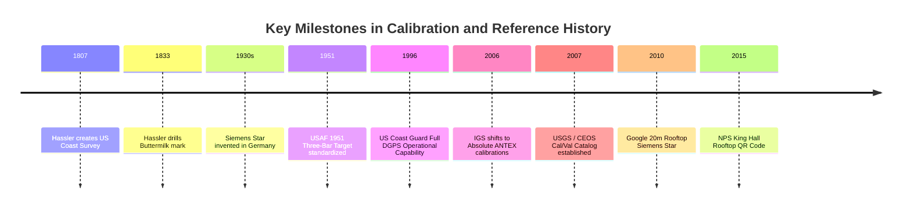

# Chapter 12: Calibration Targets, Reference Stations, and Ground Control Points (GCPs)

*Anchoring sensors to physical reality through active networks, static monuments, and engineered targets.*

---

## 12.5 Historical Evolution of Calibration, Ground Control, and Reference Standards

The methods by which humans anchor maps and elevation surfaces to the Earth reflect a two-century transition: from physical iron rods drilled into bedrock to active radio networks and engineered rooftop fiducials designed for orbital computer-vision algorithms. Tracing these milestones illuminates how contemporary best practices developed.

---

### 12.5.1 The Dawn of Systematic Geodetic Control (1807–1833)

#### 1807: Ferdinand Rudolph Hassler and the US Coast Survey
In 1807, President Thomas Jefferson signed the act authorizing the "Survey of the Coast," creating the first scientific agency in the United States government. Its first Superintendent, the Swiss-born geodesist Ferdinand Rudolph Hassler, recognized that accurate nautical charts and coastal elevations were impossible without an overarching, mathematically unified triangulation network. 

Hassler rejected the contemporary European practice of stitching together uncalibrated local surveys. Instead, he had Edward Troughton in London construct the custom "Great Theodolite" ($24\text{-inch}$ circle) and built two-meter baseline measuring bars calibrated against the French meter. Hassler established the principle that **the accuracy of the measuring apparatus must be strictly quantified against an absolute standard before any field data is collected**.

#### 1833: The "Buttermilk" Station
In 1833, while establishing the primary triangulation framework across the New York metropolitan region, Hassler set a primary triangulation station on a high granite ridge in Greenburgh (Westchester County), New York, naming it **Buttermilk**. 

Hassler drilled a deep hole into crystalline bedrock, driving an iron cone into the base and securing a copper bolt flush with the rock surface. Surrounded by subsurface witness marks, the Buttermilk mark survived nearly two centuries of intensive urbanization. When the National Geodetic Survey (NGS) occupied the mark in the GPS and CORS eras, its horizontal and vertical stability relative to the North American tectonic plate was confirmed down to millimeter tolerances. Buttermilk proved that long-term vertical stability requires physical coupling to unweathered bedrock.

---

### 12.5.2 Optical Resolution Targets and Modulation Transfer (1930s–1951)

#### 1930s: Invention of the Siemens Star
In the 1930s, engineers at Siemens & Halske in Berlin developed the **Siemens star** (Siemensstern) as a rapid, unambiguous optical test pattern for cinema and aerial camera lenses. Prior to the Siemens star, resolution testing relied on discrete, parallel ruled lines that tested only a single spatial frequency and direction at a time. The continuous radial geometry of the Siemens star allowed optical engineers to immediately detect astigmatism, spherical aberration, coma, and the exact spatial frequency cutoff from a single visual inspection.

#### 1951: The USAF 1951 Three-Bar Target
With the advent of high-altitude aerial reconnaissance during the Cold War, the U.S. Air Force formalized **MIL-STD-150A** in 1951, standardizing the USAF 1951 Three-Bar Target. Painted across tarmac surfaces at test bases, these geometric arrays allowed aerial mapping cameras to verify operational line-pair resolution and focus across flight speeds, establishing the first standardized ground resolution benchmarks for photogrammetric mapping.

---

### 12.5.3 Differential Positioning and Global Networks (1996–2006)

#### 1996: US Coast Guard Differential GPS (DGPS)
Throughout the early 1990s, the civilian utility of the Global Positioning System was deliberately degraded by the Department of Defense through **Selective Availability (SA)**, which introduced artificial clock dithering that caused horizontal errors of $50\text{–}100\text{ m}$ and vertical errors exceeding $150\text{ m}$. 

To support safe harbor navigation and hydrographic surveying, the U.S. Coast Guard established the marine **Differential GPS (DGPS)** network, achieving Full Operational Capability in 1996. By installing reference receivers on surveyed benchmarks and broadcasting pseudorange corrections over marine medium-frequency (MF) radiobeacons ($285\text{–}325\text{ kHz}$), DGPS provided sub-meter real-time positioning to hydrographic survey vessels, laying the groundwork for automated multibeam bathymetric mapping.

#### 2006: The IGS Absolute Antenna Calibration Transition
Prior to November 2006, global GNSS data processing relied on "relative" antenna phase center models that assumed an idealized zero-error reference antenna. As orbital tracking networks expanded, subtle unmodeled phase center variations in ground and satellite antennas accumulated into multi-centimeter vertical scale biases. In GPS Week 1400 (November 5, 2006), the International GNSS Service officially switched the entire global processing pipeline to **absolute robotic calibrations** standardized in the ANTEX format. This shift instantly eliminated systematic vertical biases across global geodetic networks and spaceborne elevation missions.

---

### 12.5.4 Modern Planetary Calibration Infrastructure (2007–2015)

#### 2007: The USGS/CEOS Cal/Val Test Sites Catalog
With the proliferation of multi-spectral, hyperspectral, and orbital elevation sensors from space agencies worldwide (NASA, ESA, JAXA, CNES), the Committee on Earth Observation Satellites (CEOS) Working Group on Calibration and Validation (WGCV), in partnership with the USGS, established the **Cal/Val Test Sites Catalog** in 2007. The catalog established international consensus on standard Pseudo-Invariant Calibration Sites (PICS)—such as Railroad Valley, Libya-4, and Dome C—ensuring that elevation, laser altimetry, and optical radiance datasets from different nations can be cross-calibrated on an identical metrological scale.

#### 2010: The Google Mountain View Rooftop Siemens Star
As commercial high-resolution Earth imaging satellites (such as DigitalGlobe's WorldView and GeoEye constellations) began providing sub-meter orthorectified imagery for planetary mapping platforms, commercial entities began engineering their own permanent calibration infrastructure. In 2010, Google painted a giant 36-spoke, $20\text{-meter}$ diameter Siemens star onto the roof of Building 43 at its Mountain View headquarters. This installation symbolized the privatization of high-precision calibration: commercial mapping platforms required their own on-orbit MTF and point-spread function verification targets to audit the spatial fidelity of third-party satellite and aerial imagery.

#### 2015: The NPS King Hall Rooftop QR Code
In 2015, researchers at the Naval Postgraduate School (NPS) in Monterey, California, marked the transition to automated computer vision by painting a $10\text{-meter}$ square Quick Response (QR) code onto the roof of King Hall. Unlike classical geometric targets that require manual operator identification, the NPS rooftop code proved that orbital and airborne sensors could autonomously detect, decode, and georeference coded fiducials from flight altitudes. This paved the way for automated AprilTag and ChArUco ground control networks in modern drone and airborne mapping pipelines.
