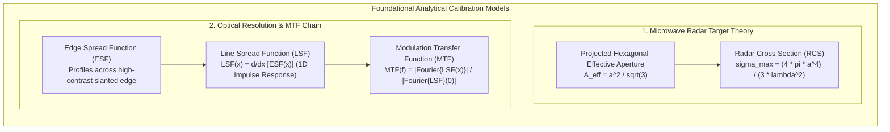
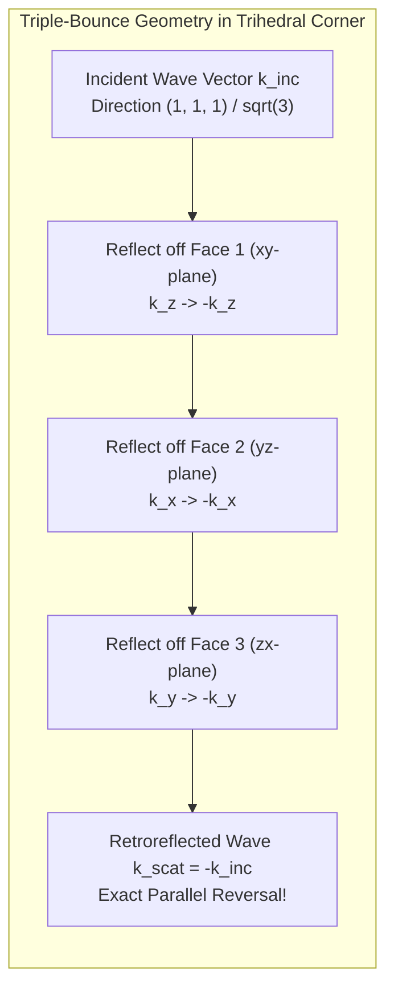
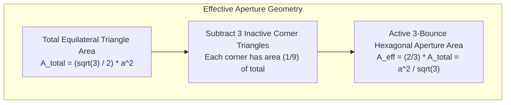
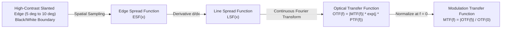

# Chapter 12: Calibration Targets, Reference Stations, and Ground Control Points (GCPs)

*Anchoring sensors to physical reality through active networks, static monuments, and engineered targets.*

---

## 12.6 Mathematical Foundations of Calibration and Resolution Assessment

Establishing ground control and sensor calibration requires rigorous mathematical formulations across both electromagnetic backscattering and optical image formation. This section provides complete derivations for the two foundational analytical models in calibration target theory: the maximum radar cross section of a trihedral corner reflector, and the continuous Fourier chain connecting edge transitions to the spatial Modulation Transfer Function (MTF).

---

### 12.6.1 Analytical Derivation of Trihedral Corner Reflector Radar Cross Section (RCS)

A standard triangular trihedral corner reflector consists of three mutually perpendicular, right-angled isosceles triangular metal plates joined along their legs of length $a$. The radar cross section (RCS, denoted $\sigma$) characterizes the hypothetical area that would intercept that amount of incident power which, if scattered isotropically in all directions, would produce the same power density at the receiver as the actual target:

$$\sigma = \lim_{R \to \infty} 4\pi R^2 \frac{|\mathbf{E}_{\text{scat}}|^2}{|\mathbf{E}_{\text{inc}}|^2}$$

#### Step 1: Physical Optics Aperture Formulation
Under physical optics (PO) approximations (valid when the plate dimension $a \gg \lambda$), a planar aperture of area $A$ reflecting perpendicularly back toward the radar has a maximum backscatter RCS given by the antenna aperture gain formula:

$$\sigma = \frac{4\pi}{\lambda^2} A_{\text{eff}}^2$$

where $\lambda$ is the radar wavelength and $A_{\text{eff}}$ is the effective projected aperture area perpendicular to the radar line of sight.

#### Step 2: Determining the Symmetry Axis
Let the three orthogonal plates lie in the positive coordinate planes:
* Plate 1: $x = 0, \quad 0 \le y \le a, \quad 0 \le z \le a - y$
* Plate 2: $y = 0, \quad 0 \le x \le a, \quad 0 \le z \le a - x$
* Plate 3: $z = 0, \quad 0 \le x \le a, \quad 0 \le y \le a - x$

The geometric symmetry axis (boresight vector $\hat{\mathbf{n}}$) of the corner reflector is oriented symmetrically with respect to the three coordinate axes:

$$\hat{\mathbf{n}} = \frac{1}{\sqrt{3}} \begin{bmatrix} 1 \\ 1 \\ 1 \end{bmatrix}$$

The angle between the boresight axis and each coordinate plane normal is:

$$\cos\theta_{\text{axis}} = \frac{1}{\sqrt{3}} \implies \theta_{\text{axis}} \approx 54.7356^\circ$$

#### Step 3: Projected Effective Aperture Area ($A_{\text{eff}}$)
When illuminated along the boresight vector $\hat{\mathbf{n}}$, only rays that undergo three internal bounces and exit without clipping contribute to the coherent retroreflected beam. 

Viewed along the symmetry axis $\hat{\mathbf{n}}$, the base perimeter of the three triangular plates forms an equilateral triangle with vertices at $(a, 0, 0)$, $(0, a, 0)$, and $(0, 0, a)$. The side length $s$ of this outer triangle is:

$$s = \sqrt{a^2 + a^2} = a\sqrt{2}$$

The total geometric area of this outer equilateral triangle is:

$$A_{\text{triangle}} = \frac{\sqrt{3}}{4} s^2 = \frac{\sqrt{3}}{4} (2a^2) = \frac{\sqrt{3}}{2} a^2$$

However, rays striking near the outer tips undergo only one or two reflections and are scattered away from the radar. The active three-bounce aperture forms a regular **hexagon** inscribed within the outer equilateral triangle, created by clipping the three triangular corners at half-altitude:

The ratio of the active hexagonal aperture to the outer triangle area is exactly $\frac{2}{3}$:

$$A_{\text{eff}} = \frac{2}{3} A_{\text{triangle}} = \frac{2}{3} \left(\frac{\sqrt{3}}{2} a^2\right) = \frac{a^2}{\sqrt{3}}$$

#### Step 4: Computing Maximum Radar Cross Section ($\sigma_{\max}$)
Substituting the effective projected aperture area $A_{\text{eff}} = \frac{a^2}{\sqrt{3}}$ into the physical optics RCS equation yields:

$$\sigma_{\max} = \frac{4\pi}{\lambda^2} \left(\frac{a^2}{\sqrt{3}}\right)^2 = \frac{4\pi a^4}{3\lambda^2}$$

In decibels relative to one square meter ($\text{dBm}^2$ or $\text{dBsm}$):

$$\sigma_{\max,\text{dB}} = 10 \log_{10}\left(\frac{4\pi a^4}{3\lambda^2}\right)$$

#### Angular Dependence Off-Boresight
When the incident radar beam deviates from the boresight vector by spherical angles $(\theta, \phi)$, the projected overlap of the three-bounce domain decreases. The angular response is parameterized by:

$$\sigma(\theta, \phi) = \sigma_{\max} \cdot \left[ \cos\theta + \sin\theta (\cos\phi + \sin\phi) - 2 \left( \cos\theta + \sin\theta(\cos\phi + \sin\phi) \right)^{-1} \right]^2$$

The $3\text{-dB}$ half-power beamwidth of a triangular trihedral corner reflector is approximately $\pm 18^\circ$ to $\pm 20^\circ$, requiring accurate mechanical leveling and orientation during field deployment.

---

### 12.6.2 The Optical Fourier Chain: ESF $\to$ LSF $\to$ MTF

In photogrammetry, satellite imaging, and digital elevation modeling, spatial resolution is not simply the pixel dimension (Ground Sample Distance, GSD). Spatial resolution is governed by the system's spatial frequency response, characterized by the **Modulation Transfer Function (MTF)**. 

The standard empirical technique for measuring on-orbit or airborne MTF uses the **Slanted-Edge Method** (ISO 12233 standard), which transforms a spatial edge into the system's modulation transfer function via an unbroken mathematical pipeline.

#### Step 1: The Edge Spread Function (ESF)
Consider an ideal spatial step edge transitioning abruptly from dark reflectance $I_{\text{dark}}$ to bright reflectance $I_{\text{bright}}$ at spatial position $x = 0$:

$$I_{\text{ideal}}(x) = I_{\text{dark}} + (I_{\text{bright}} - I_{\text{dark}}) \, \mathcal{H}(x)$$

where $\mathcal{H}(x)$ is the Heaviside step function. When imaged by a real optical sensor, diffraction, lens aberrations, atmospheric optical turbulence, and detector pixel integration blur this step into a continuous **Edge Spread Function**, $\text{ESF}(x)$:

$$\text{ESF}(x) = I_{\text{ideal}}(x) * \text{PSF}(x) = \int_{-\infty}^\infty I_{\text{ideal}}(x') \, \text{PSF}(x - x') \, dx'$$

where $\text{PSF}(x)$ is the one-dimensional Point Spread Function of the imaging system.

In practice, a parametric model such as the **Fermi-Dirac step model** is fit to the oversampled pixel data:

$$\text{ESF}_{\text{model}}(x) = \frac{A}{1 + \exp\left(-\frac{x - x_0}{\tau}\right)} + B$$

where $\tau$ characterizes the transition width and $x_0$ is the sub-pixel edge location.

#### Step 2: The Line Spread Function (LSF)
The **Line Spread Function** $\text{LSF}(x)$ is the one-dimensional impulse response of the optical system. By the fundamental theorem of calculus, the derivative of the convolution of a step function with an impulse response is the impulse response itself:

$$\text{LSF}(x) = \frac{d}{dx} \text{ESF}(x)$$

$$\frac{d}{dx} \text{ESF}(x) = \frac{d}{dx} \left[ \int_{-\infty}^x \text{PSF}(x') \, dx' \right] = \text{PSF}(x)$$

Thus, differentiating the empirical edge profile directly recovers the 1D system Point Spread Function without needing an infinitely narrow, sub-pixel physical line target on the ground.

#### Step 3: Optical Transfer Function (OTF) and Modulation Transfer Function (MTF)
The **Optical Transfer Function (OTF)** is defined as the continuous 1D Fourier transform of the Line Spread Function:

$$\mathcal{H}_{\text{opt}}(f) = \mathcal{F}\{\text{LSF}(x)\}(f) = \int_{-\infty}^\infty \text{LSF}(x) \, e^{-i 2\pi f x} \, dx$$

Because the OTF is complex-valued, it decomposes into magnitude and phase:

$$\mathcal{H}_{\text{opt}}(f) = \text{MTF}(f) \cdot e^{i \, \text{PTF}(f)}$$

1. **Modulation Transfer Function ($\text{MTF}(f)$):** The magnitude $|\mathcal{H}_{\text{opt}}(f)|$, normalized to unity at zero spatial frequency ($f = 0$):
   $$\text{MTF}(f) = \frac{|\mathcal{F}\{\text{LSF}(x)\}(f)|}{\int_{-\infty}^\infty \text{LSF}(x) \, dx} = \frac{\left| \int_{-\infty}^\infty \text{LSF}(x) e^{-i 2\pi f x} dx \right|}{\int_{-\infty}^\infty \text{LSF}(x) dx}$$
2. **Phase Transfer Function ($\text{PTF}(f)$):** The phase argument $\arg(\mathcal{H}_{\text{opt}}(f))$, which quantifies spatial phase distortion and asymmetric optical aberrations.

#### Effective Ground Resolution: MTF at the Nyquist Frequency
In digital imaging systems with pixel pitch $p$, the **Nyquist spatial frequency** is:

$$f_{\text{Nyquist}} = \frac{1}{2p} \quad [\text{cycles / pixel}]$$

For elevation modeling and photogrammetry:
* An ideal optical system exhibits $\text{MTF}(f_{\text{Nyquist}}) \ge 0.15\text{–}0.25$.
* If $\text{MTF}(f_{\text{Nyquist}}) < 0.05$, the imagery is severely over-blurred (diffraction-limited or out-of-focus), reducing effective spatial resolution and degrading fine topographic ridge extraction in DEMs.
* If $\text{MTF}(f_{\text{Nyquist}}) > 0.40$, the optical system is under-sampled, resulting in severe **aliasing** (Moiré fringes on agricultural furrows, roof shingles, and repetitive terrain features) that induces false elevation spikes during stereo image correlation.
