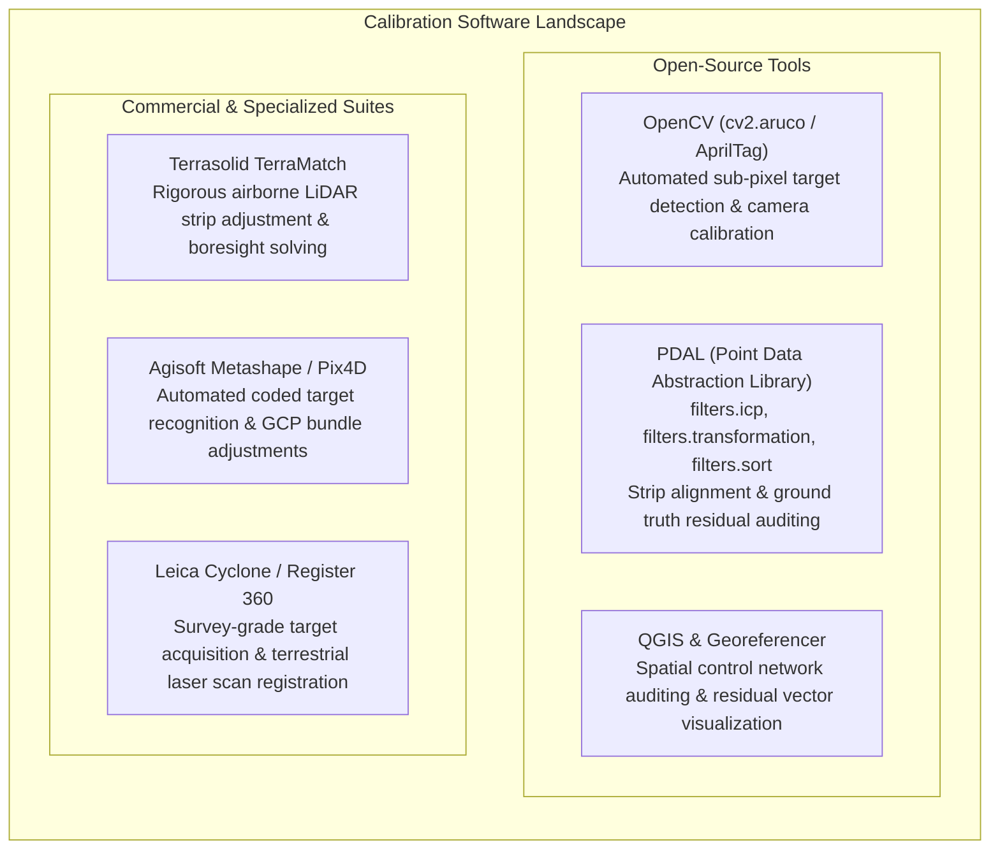
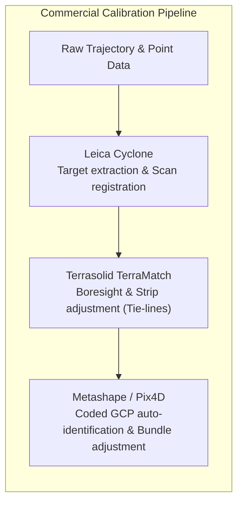

# Chapter 12: Calibration Targets, Reference Stations, and Ground Control Points (GCPs)

*Anchoring sensors to physical reality through active networks, static monuments, and engineered targets.*

---

## 12.7 Software Ecosystem for Calibration, Target Detection, and Control Management

Ground control management and target calibration span a sophisticated ecosystem of open-source computer vision libraries, point cloud processing engines, and proprietary photogrammetric and laser scanning software suites. This section examines the core computational workflows used to detect targets, register control networks, and validate surface models.



---

### 12.7.1 Open-Source Tools: Computer Vision and Point Cloud Registration

#### Automated Target Detection with OpenCV (AprilTag and ChArUco)
Manual picking of ground control points in hundreds of drone images is slow and introduces operator fatigue errors ($1\text{–}3\text{ pixels}$ jitter). Modern automated photogrammetric pipelines utilize **ChArUco** (Checkerboard + ArUco) or **AprilTag** planar fiducials. 

A ChArUco board combines the occlusion resilience and unique ID coding of ArUco markers with the sub-pixel corner precision of classical checkerboard patterns:

```python
"""Automated ChArUco Ground Control Point Detection Pipeline."""

import cv2
from cv2 import aruco
import numpy as np


def detect_charuco_gcp(image_path: str, camera_matrix: np.ndarray, dist_coeffs: np.ndarray):
  # 1. Load image and convert to 8-bit grayscale
  image = cv2.imread(image_path)
  gray = cv2.cvtColor(image, cv2.COLOR_BGR2GRAY)

  # 2. Define ChArUco board geometry (e.g., 5x7 squares, 0.10m square, 0.07m marker)
  dictionary = aruco.getPredefinedDictionary(aruco.DICT_5X5_100)
  board = aruco.CharucoBoard((5, 7), 0.10, 0.07, dictionary)
  detector_params = aruco.DetectorParameters()

  # 3. Detect raw ArUco marker corners and IDs
  detector = aruco.ArucoDetector(dictionary, detector_params)
  marker_corners, marker_ids, rejected = detector.detectMarkers(gray)

  if marker_ids is not None and len(marker_ids) > 4:
    # 4. Interpolate sub-pixel accurate checkerboard corner positions
    charuco_detector = aruco.CharucoDetector(board)
    charuco_corners, charuco_ids, _, _ = charuco_detector.detectBoard(gray)

    if charuco_corners is not None and len(charuco_corners) >= 4:
      # 5. Estimate 6-DOF camera pose relative to the target frame (PnP RANSAC)
      valid, rvec, tvec = aruco.estimatePoseCharucoBoard(
          charuco_corners, charuco_ids, board, camera_matrix, dist_coeffs
      )
      return {
          "status": "DETECTED",
          "num_corners": len(charuco_corners),
          "corners_px": charuco_corners,
          "rvec": rvec,
          "tvec": tvec,
      }

  return {"status": "FAILED", "reason": "Insufficient visible markers"}
```

#### Point Cloud Control Auditing with PDAL
The Point Data Abstraction Library (PDAL) provides powerful pipeline stages for registering point cloud strips against independent ground truth check surveys using the Iterative Closest Point (`filters.icp`) algorithm or computing residual statistics against surveyed GCP coordinates:

```json
{
  "pipeline": [
    {
      "type": "readers.las",
      "filename": "flight_strip_04_uncalibrated.laz"
    },
    {
      "type": "readers.las",
      "filename": "ground_truth_tls_bed.laz",
      "tag": "reference"
    },
    {
      "type": "filters.icp",
      "candidate": "flight_strip_04_uncalibrated",
      "reference": "reference",
      "max_distance": 0.5,
      "max_iterations": 50
    },
    {
      "type": "writers.las",
      "filename": "flight_strip_04_calibrated.laz",
      "forward": "all"
    }
  ]
}
```

---

### 12.7.2 Commercial and Industrial Suites



#### Terrasolid TerraMatch
In commercial airborne LiDAR production, **TerraMatch** (running on Bentley MicroStation) is the industry standard for strip adjustment and boresight self-calibration:
* **Tie-Line Extraction:** TerraMatch automatically extracts surface tie-lines (planar roof facets, road profiles, and linear curb lines) across overlapping flight strips.
* **Rigorous Rigidity Optimization:** It solves for sensor boresight misalignments (roll $\Delta \phi$, pitch $\Delta \omega$, heading $\Delta \kappa$) and positional lever arms by minimizing the spatial mismatch between overlapping strips and surveyed ground control profiles.

#### Agisoft Metashape and Pix4D
These Structure-from-Motion (SfM) photogrammetry packages feature native support for circular 12-bit and 16-bit coded targets and cross-marks:
* Automatically identifies target IDs and calculates sub-pixel center coordinates across thousands of images simultaneously.
* Allows operators to assign points as either **Control** (used in bundle adjustment) or **Check** (strictly out-of-solution).
* Generates detailed vector residual plots showing directional horizontal $(\Delta X, \Delta Y)$ and vertical $(\Delta Z)$ error ellipses across the project bounding box.

#### Leica Cyclone and Register 360
In terrestrial laser scanning (TLS) and mobile mapping:
* Automatically recognizes precision planar black/white tilt-and-turn targets and 3D retroreflective spheres.
* Employs least-squares best-fit geometry to extract sphere centers with sub-millimeter precision, achieving network registration loop closures of $<2\text{ mm}$ over multi-station industrial plant and bridge surveys.

---

### 12.7.3 Feature Comparison Matrix

| Software / Tool | License Model | Primary Target Modalities | Mathematical Core | Key Mapping Role |
| :--- | :--- | :--- | :--- | :--- |
| **OpenCV** | Open-Source (Apache 2.0) | AprilTag, ArUco, ChArUco, Checkerboards | Sub-pixel corner detection, PnP RANSAC | UAV automated fiducial detection; lens distortion calibration. |
| **PDAL** | Open-Source (BSD) | 3D Point Clouds, Planar surfaces | ICP registration, transformation matrices | Batch point cloud verification against reference check surveys. |
| **QGIS** | Open-Source (GPLv2) | Vector points, Raster DEMs | Affine / Thin-Plate Spline transformations | Spatial distribution auditing, residual vector visualization. |
| **TerraMatch** | Commercial (Terrasolid) | Planar roof facets, road profiles, tie lines | Rigorous multi-strip least-squares adjustment | Airborne LiDAR boresight calibration and swath strip leveling. |
| **Agisoft Metashape** | Commercial (Agisoft) | Coded circular targets, Crosses, Chessboards | Multi-view Structure-from-Motion bundle adjustment | Automated GCP detection; separate GCP vs. CP accuracy reporting. |
| **Pix4Dmapper** | Commercial (Pix4D) | Diagonal quadrants, Coded circles | Bundle adjustment with auto-marker extraction | UAV survey-grade orthomosaic and DSM generation. |
| **Leica Cyclone** | Commercial (Hexagon) | Spheres ($100\text{–}200\text{ mm}$), B/W planar targets | Best-fit sphere/planar centroid extraction | Survey-grade terrestrial laser scanning georeferencing. |
