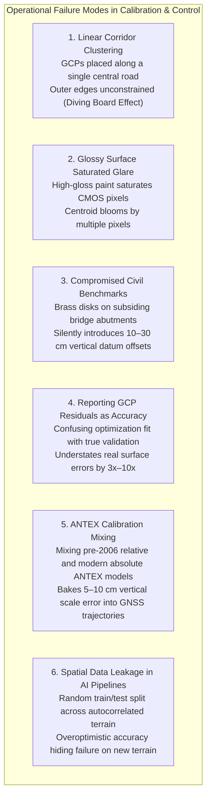

# Chapter 12: Calibration Targets, Reference Stations, and Ground Control Points (GCPs)

*Anchoring sensors to physical reality through active networks, static monuments, and engineered targets.*

---

## 12.8 Common Pitfalls and Key Takeaways

Field calibration, reference networks, and ground control points establish the physical truth of digital elevation models. When executed properly, they transform disconnected sensor streams into millimeter-accurate spatial models. When executed poorly, they embed invisible, mathematically uncorrectable distortions across entire regions.

---

### 12.8.1 Common Pitfalls in Ground Control and Calibration

#### 1. The "Diving Board" Effect (Linear Corridor Clustering)
Placing ground control points exclusively along an easily accessible road or central river corridor leaves the lateral margins of the project completely unconstrained. In photogrammetric bundle adjustments and LiDAR strip matching, small rotational uncertainties ($\Delta \text{roll}$) pivot around the central line of control points, causing the outer edges of the elevation model to flare wildly upward or downward—just like a flexible diving board anchored only at its base. Control networks must always establish a convex hull that encloses all mapping swaths.

#### 2. Specular Blooming and LiDAR Range Walk from Over-Reflective Targets
Painting targets with glossy white enamel or utilizing ultra-bright glass-bead retroreflective sheeting introduces severe optical and electronic distortions:
* **Optical Blooming:** Under direct sunlight, specular highlights saturate camera pixels to the maximum digital number ($DN = 255$ in 8-bit imagery), bleeding charge into adjacent sensor wells and shifting the sub-pixel centroid by several pixels.
* **LiDAR Range Walk:** Highly retroreflective targets return intense photon spikes that trigger timing discriminators prematurely, making ground targets appear artificially elevated by $3\text{–}8\text{ cm}$. All ground control targets must be fabricated from ultra-matte, non-specular materials with diffuse reflectivity $\le 50\text{–}60\%$.

#### 3. Trusting Compromised Civil Engineering Benchmarks
Relying blindly on historic NGS brass tablets set into highway bridge abutments, municipal retaining walls, or railroad culverts without verifying their stability is a pervasive trap. Civil engineering structures are subject to long-term foundation settlement, pile deflection, and seasonal freeze-thaw jacking, often accumulating $10\text{–}30\text{ cm}$ of vertical displacement over decades. Surveyors must never tie high-precision DEMs to a single isolated mark; they must verify relative stability across an array of independent geodetic marks tied to unweathered bedrock or deep-rod monuments.

#### 4. The Self-Deception of GCP Residual Accuracy Reporting
Reporting the Root Mean Square Error ($\text{RMSE}_z$) computed on the Ground Control Points used in the bundle adjustment or strip adjustment as the "accuracy" of the DEM is a fundamental breach of metrological standards. GCP residuals merely measure how closely the optimization algorithm bent the surface to fit the input control. In regions between or beyond the GCPs, severe non-linear doming or strip separation can exist completely undetected. Reported accuracy must be calculated exclusively against **Independent Check Points (CPs)** withheld from all processing steps.

#### 5. Mixing Relative and Absolute GNSS Antenna Models
Processing airborne or rover GNSS trajectories with modern absolute robotic ANTEX calibration files while the base station or CORS network was processed using legacy relative models (or vice versa) introduces an immediate, systematic vertical shift of $5\text{–}10\text{ cm}$ across the entire dataset. The entire processing chain must use identical, absolute ANTEX (v1.4) antenna models.

#### 6. Naive Random Splitting in Machine Learning DEM Models
Applying standard random cross-validation to raster elevation datasets ignores Tobler's First Law of Geography. Because adjacent pixels in digital elevation models exhibit high spatial autocorrelation, random splitting guarantees that the training set and testing set share virtually identical geomorphic patterns. The model memorizes local topographic shapes, yielding deceptive validation scores ($R^2 > 0.98$), only to fail catastrophically when deployed over unseen terrain. Spatial block partitioning with buffer deadbands $\ge L_c$ is mandatory.

---

### 12.8.2 Key Takeaways for Practitioners

1. **A Target Is Only as Good as Its Independence:** Strictly segregate your survey points before processing begins. A minimum of $20\text{–}30$ independent check points per land-cover class must remain untouched by the adjustment algorithms to guarantee unbiased accuracy reporting.
2. **Obey the $3\times$ Accuracy Rule:** Never evaluate an elevation dataset with a check survey of comparable uncertainty. Your validation survey must be at least $3\times$ more accurate than the target specification to avoid inflating the reported uncertainty.
3. **Geometry Trumps Quantity:** Ten control points distributed across the four outer corners, the interior, and the full elevation range of a mountain will produce a vastly superior DEM compared to one hundred points clustered along a single valley highway.
4. **Anchor to Deep Geology:** Surface soils move dynamically with seasons, moisture, and frost. High-precision geodetic and hydrographic datums require physical coupling to unweathered crystalline bedrock or sleeved stainless-steel rods driven to deep refusal.
5. **Multi-Modal Awareness:** Understand the physics of the interrogating sensor. Design targets that respect the wavelength, dynamic range, and detector physics of the specific sensor—whether optical photons, infrared laser pulses, microwave chirps, or acoustic wavefronts.
