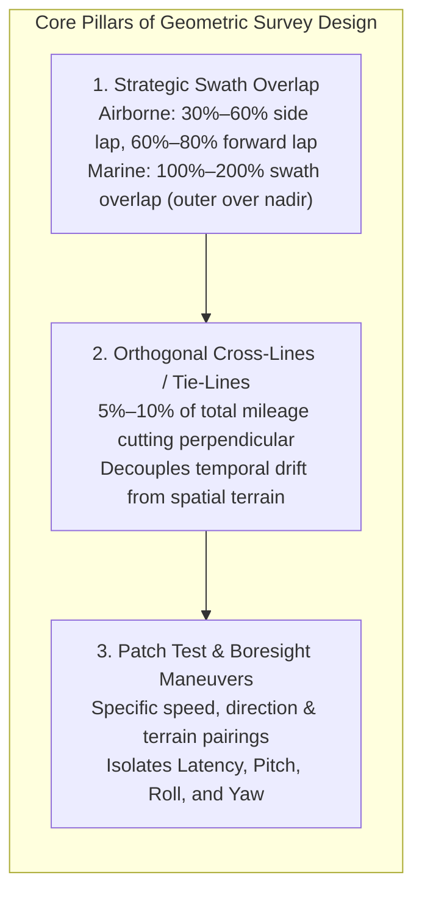
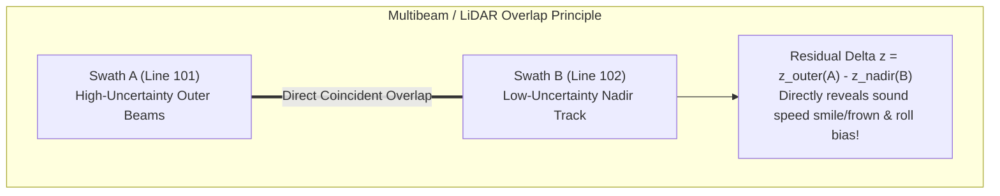
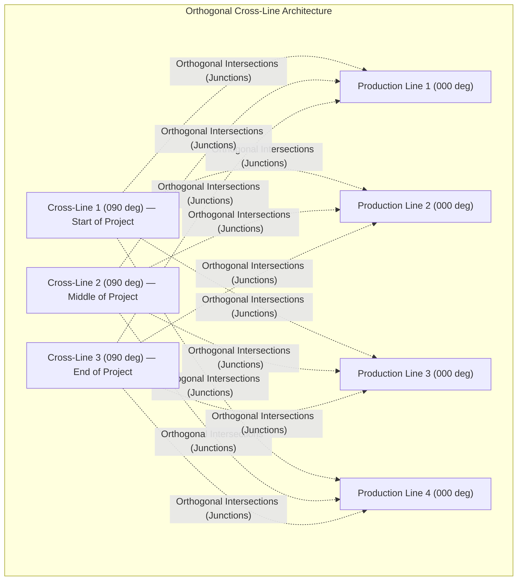
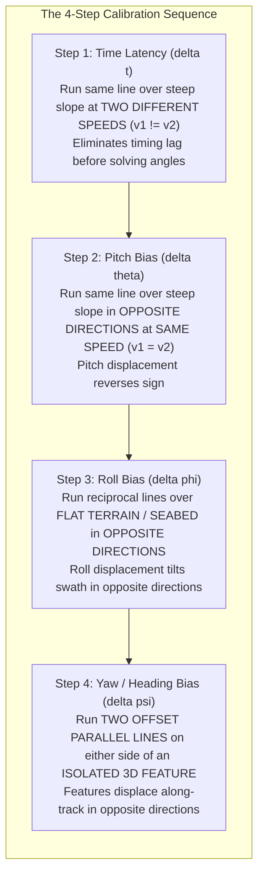

# Chapter 13: Survey Planning for Calibration, Error Reduction, and Monitoring

*How to design data acquisition in the field so systematic biases become mathematically observable, separable, and self-correcting.*

No processing algorithm—no matter how advanced its machine learning filters or least-squares adjustments—can extract true topography from data collected under a geometrically degenerate survey plan. If survey flight lines or vessel swaths are arranged so that sensor misalignments correlate perfectly with terrain slope or platform trajectory, systematic errors become permanently baked into the elevation surface. Rigorous survey planning designs field data acquisition such that systematic physical biases (angular boresight misalignments, positioning latencies, refractive ray bending, and dynamic water level drift) are transformed into symmetric, observable residuals that can be decoupled, solved, and eliminated.

---

## 13.1 Geometric Survey Design: Overlap, Cross-Lines, and Boresight Patterns

Geometric survey design defines the spatial trajectory, overlap geometry, and calibration maneuvers executed by airborne, uncrewed, and vessel-mounted mapping platforms. The primary objective is to guarantee geometric redundancy and maximize parameter observability.

---

### 13.1.1 Swath Overlap Strategy and Outer-to-Inner Redundancy

A mapping swath is not uniformly accurate across its width. In both airborne laser scanning and acoustic multibeam sonars, measurement uncertainty increases non-linearly from the nadir track toward the outer swath limits:
* **Airborne LiDAR:** Outer scan angles ($\theta > 20^\circ$) experience increased slant range, beam divergence footprint expansion, oblique ground penetration, and heightened sensitivity to platform roll errors ($\Delta z \approx y \tan \Delta \phi$).
* **Multibeam Sonar:** Outer beams ($\theta > 60^\circ$) suffer severe ray curvature due to water-column sound speed refraction, longer two-way acoustic travel times, lower signal-to-noise ratios (SNR), and stretched bottom footprints.

#### The Nadir-to-Outer Overlap Rule
To monitor and compensate for these edge degradations, modern survey standards mandate strategic swath overlap:
1. **Marine Hydrography ($100\text{–}200\%$ Overlap):** Running adjacent survey lines at line spacings equal to or less than the water depth ($S \le 1.0\text{–}1.5 \times D$) ensures that the outer beams of Swath $A$ directly overlap the inner, near-nadir beams of Swath $B$. Because nadir beams are essentially immune to sound speed refraction and platform roll, the nadir soundings act as an in-situ benchmark. Any continuous vertical difference $\Delta z = z_{\text{outer}} - z_{\text{nadir}}$ immediately exposes refraction "smiles" (under-corrected surface sound speed) or "frowns" (over-corrected sound speed).
2. **Airborne LiDAR and SfM Photogrammetry:** Airborne LiDAR requires a minimum of **$30\text{–}50\%$ side lap** between adjacent flight swaths to eliminate shadow voids on steep slopes and enable automated strip adjustment (e.g., in TerraMatch). In UAV Structure-from-Motion (SfM) photogrammetry, where camera calibration parameters are solved simultaneously with terrain geometry, flights require **$75\text{–}85\%$ forward overlap** and **$60\text{–}70\%$ side overlap** to prevent non-linear dome deformation.

---

### 13.1.2 Orthogonal Cross-Lines (Tie-Lines / Check-Lines)

Cross-lines (or tie-lines) are independent survey swaths flown or sailed perpendicular (at $90^\circ \pm 10^\circ$) to the primary production lines across the entire survey bounding box:

#### The Operational Mandate: $5\text{–}10\%$ of Total Linear Mileage
Under NOAA Office of Coast Survey (HSSD/FPM) and USGS 3DEP specifications, cross-lines must constitute **at least $5\%$ (for multibeam bathymetry) to $8\text{–}10\%$ (for airborne LiDAR/bathymetry)** of the total linear mileage.

#### Decoupling Temporal Drift from Spatial Features
Without orthogonal cross-lines, parallel production lines share common temporal drifts that can mimic physical terrain slopes:
* **Tidal and Water-Level Drift:** A vessel surveying parallel lines over a 12-hour tidal cycle may experience unmodeled dynamic tide shifts, creating artificial steps between adjacent lines.
* **Thermal IMU Drift:** Inertial measurement units undergo subtle gyro and accelerometer bias drift as internal temperatures equilibrate over hours of flight.
* **Constellation Shifts:** Changes in satellite geometry (PDOP spikes or constellation transitions) create slow, ramp-like vertical errors along the flight lines.

Because cross-lines cut across all production lines within a short, discrete time interval, they establish hundreds of instantaneous **spatial junctions**. By calculating the junction residuals $\Delta z = z_{\text{production}} - z_{\text{cross}}$ across flat and sloping terrain, automated quality-control software decouples time-dependent operational drift from true seafloor or land topography.

---

### 13.1.3 The Hydrographic Patch Test and LiDAR Boresight Calibration

Mechanical and optical tolerances make it impossible to bolt a laser scanner head, camera, or sonar transducer to an aircraft frame or ship hull with perfect physical alignment to the Inertial Measurement Unit (IMU). Even microscopic machining errors of $0.05^\circ$ induce multi-decimeter positioning errors at operational ranges ($H = 1000\text{ m} \implies \Delta x \approx 87\text{ cm}$).

The **Patch Test** (for multibeam sonars) and **Boresight Flight Pattern** (for airborne LiDAR) are specialized geometric flight and vessel maneuvers designed to decouple and solve for four fundamental mounting biases:
1. **Time Latency ($\delta t$)**
2. **Pitch Misalignment ($\delta \theta$ or $\Delta \omega$)**
3. **Roll Misalignment ($\delta \phi$)**
4. **Yaw / Heading Misalignment ($\delta \psi$ or $\Delta \kappa$)**

| Parameter | Required Terrain / Seafloor | Trajectory Configuration | Speed ($v$) | Mathematical Decoupling Mechanism |
| :--- | :--- | :--- | :--- | :--- |
| **1. Latency ($\delta t$)** | Steep, uniform slope ($>15^\circ$) or sharp trench | Same line, **same direction** | **Two different speeds** ($v_1 \ll v_2$, e.g., $4\text{ kn}$ vs. $10\text{ kn}$) | Slope displacement $\Delta x = (v_2 - v_1)\delta t$. Because flight/heading direction is identical, angular biases cancel out. |
| **2. Pitch ($\delta \theta$)** | Steep, uniform slope ($>15^\circ$) or scarp | Same line, **opposite reciprocal directions** ($180^\circ$ apart) | **Same speed** ($v_1 = v_2$) | Latency displacement cancels; pitch misalignment shifts the apparent slope forward along the vessel track, doubling the observed horizontal scarp offset ($\Delta x = 2 H \tan \delta \theta$). |
| **3. Roll ($\delta \phi$)** | Extremely flat, horizontal surface ($<0.5^\circ$) | Same line, **opposite reciprocal directions** ($180^\circ$ apart) | Same speed | Roll tilts the swath across-track. Running in opposite directions creates a cross-track scissor effect: the port beam of Line 1 overlaps the starboard beam of Line 2, producing a vertical discrepancy $\Delta z = 2 y \tan \delta \phi$. |
| **4. Yaw ($\delta \psi$)** | Prominent 3D feature (rocky pinnacle, wreck, gable roof) | **Two offset parallel lines**, same direction, feature positioned in outer swath | Same speed | A yaw error rotates the swath around the vertical axis. Running on opposite sides of an isolated feature displaces its apparent position along-track in opposite directions ($\Delta x = 2 y \sin \delta \psi$). |

#### Why Sequence Matters
The patch test must be solved in strict order: **Latency $\to$ Pitch $\to$ Roll $\to$ Yaw**:
1. If latency is unsolved, running reciprocal lines at slightly different speeds corrupts the pitch calculation.
2. If pitch is unsolved, residual along-track errors contaminate the yaw solution.
3. If roll is solved over a sloping seabed, cross-track slope couples with roll, making it impossible to separate seafloor grade from sensor tilt.
