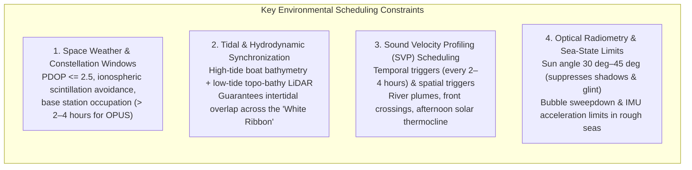
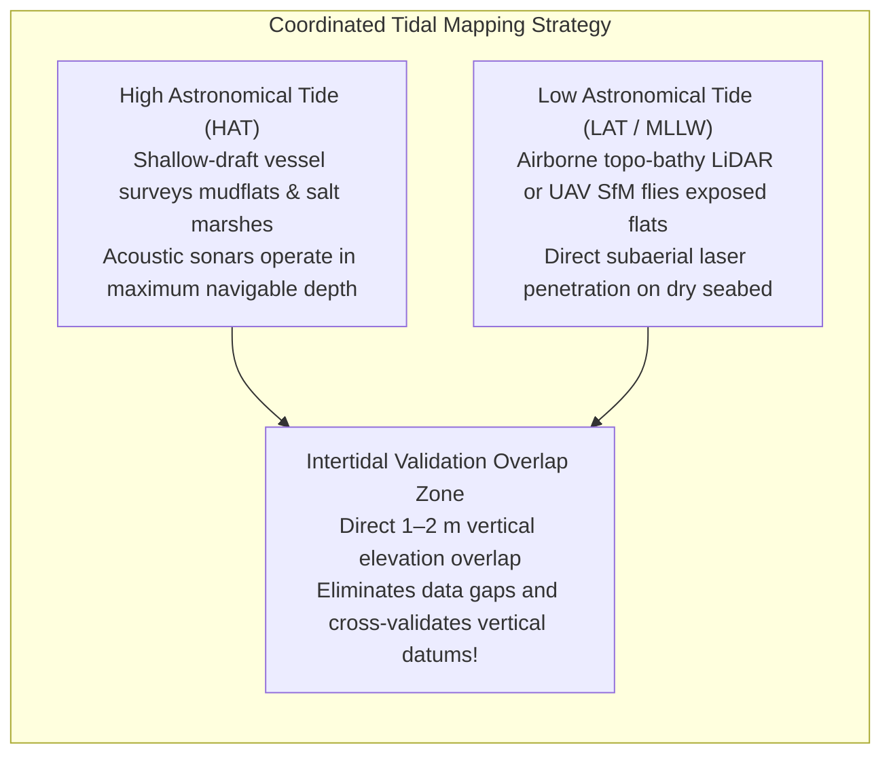
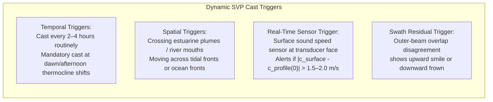

# Chapter 13: Survey Planning for Calibration, Error Reduction, and Monitoring

*How to design data acquisition in the field so systematic biases become mathematically observable, separable, and self-correcting.*

---

## 13.2 Environmental and Temporal Survey Scheduling

Physical environments are not static backdrops; they are dynamic media that distort, refract, and attenuate electromagnetic and acoustic signals. Scheduling a survey requires aligning data acquisition with environmental windows where signal propagation physics remain within the linear operating range of the instrumentation.

---

### 13.2.1 GNSS Constellation Geometry and Ionospheric Planning

High-accuracy trajectory determination—whether post-processed kinematic (PPK) or real-time kinematic (RTK)—requires an open satellite sky view and a calm ionosphere.

#### Dilution of Precision (PDOP) and Satellite Masking
* **PDOP Thresholds:** Field missions must be scheduled using satellite visibility prediction tools. Acquisition must halt if the Position Dilution of Precision exceeds $\text{PDOP} > 2.5\text{–}3.0$, or if the number of tracked multi-GNSS satellites drops below 6–8 satellites.
* **Elevation Masking:** Setting a receiver elevation cutoff angle of $10^\circ\text{–}15^\circ$ filters out noisy, multipath-corrupted low-elevation signals that traverse massive atmospheric air masses.

#### Space Weather, Scintillation, and Ionospheric Gradients
In the ionosphere ($60\text{–}1000\text{ km}$ altitude), solar ultraviolet and X-ray radiation ionize gas molecules into free electrons. 
* **Equatorial and Auroral Scintillation:** In equatorial regions ($\pm 20^\circ$ of the geomagnetic equator) during post-sunset hours, and in polar regions during geomagnetic storms, plasma bubbles form in the F-layer. These bubbles cause severe amplitude fading and phase scintillation, inducing frequent **GNSS cycle slips** and total loss of carrier phase lock.
* **Baseline Length Constraints:** Differential GNSS assumes that atmospheric delays at the rover match those at the base station. The ionospheric differential delay grows at approximately $1\text{–}2\text{ mm}$ per kilometer of baseline length. Standard single-base RTK operations must be restricted to baselines **$<10\text{–}15\text{ km}$**. For baselines beyond this distance, surveyors must utilize network RTK (VRS/MAC) or dual-frequency PPP with precise satellite orbit and clock products.
* **Base Station Occupation Times:** To establish geodetic control via automated services like NGS OPUS (Online Positioning User Service), a base station must record continuous dual-frequency data for **at least 2 hours (OPUS-RS)** or **$>4\text{ hours}$ (standard static OPUS)** to resolve carrier ambiguities to millimeter precision.

---

### 13.2.2 Tidal and Hydrodynamic Synchronization: Bridging the "White Ribbon"

The coastal zone where land meets water—often called the "white ribbon"—is notoriously difficult to survey. Breaking waves, shallow reefs, and turbid surf prevent survey vessels from entering, while water absorption extinguishes near-infrared airborne topographic lasers.

To eliminate the coastal white ribbon, field planners execute **synchronized tidal operations**:
1. **High-Tide Vessel Bathymetry:** Shallow-draft survey launches are deployed at the peak of spring high tides, allowing multibeam or interferometric sonars to survey shallow mudflats, estuarine channels, and fringing marshes that are completely dry at low water.
2. **Low-Tide Topo-Bathy LiDAR and Drone Flights:** Airborne bathymetric green LiDAR ($532\text{ nm}$) and UAV photogrammetry flights are scheduled at low astronomical tide (LAT / MLLW). The receding tide exposes intertidal sandbars and mudflats, allowing standard topographic sensors to map the substrate directly through air.
3. **The Resulting Overlap Zone:** By overlapping the low-water terrestrial scan with the high-water acoustic sounding, hydrographers create a continuous, redundant data belt ($100\text{–}500\text{ m}$ wide) across the shoreline. This overlap enables direct empirical cross-validation between acoustic sounding datums and terrestrial ellipsoidal datums.

---

### 13.2.3 Sound Velocity Profiling (SVP) Scheduling and Triggers

In acoustic bathymetry, water column refraction is the single largest operational source of depth error. Acoustic sound speed $c$ varies continuously as a function of temperature $T$, salinity $S$, and hydrostatic pressure (depth) $z$, modeled by the Chen-Millero-Li or Del Grosso equations:

$$c(T, S, z) \approx 1449.2 + 4.6 T - 0.055 T^2 + 0.00029 T^3 + (1.34 - 0.010 T)(S - 35) + 0.016 z$$

A temperature change of just $1^\circ\text{C}$ alters sound speed by approximately $4.5\text{ m/s}$; a salinity change of $1\text{ PSU}$ changes sound speed by $1.3\text{ m/s}$.

#### Operational SVP Triggers
Hydrographic survey plans must mandate explicit triggers for deploying conductivity-temperature-depth (CTD) probes or Moving Vessel Profilers (MVP):
1. **Routine Interval:** Minimum of one full-depth cast every **$2\text{–}4\text{ hours}$**.
2. **Diurnal Thermocline Shifts:** An immediate cast in mid-afternoon when intense solar radiation warms the upper $2\text{–}5\text{ m}$ of the water column, creating a steep negative sound speed gradient that severely bends acoustic rays downward.
3. **Surface Sound Speed Deviation:** Modern multibeam sonars use a real-time sound velocity sensor mounted directly at the transducer face to steer electronic beams. If the surface sound speed deviates from the top of the currently active water-column profile by **more than $1.5\text{–}2.0\text{ m/s}$**, an immediate cast is triggered.
4. **Frontal and Estuarine Boundaries:** When crossing from ocean water into an estuarine brackish lens (or crossing strong tidal convergence zones), spatial gradients overwhelm temporal casts, requiring continuous underway MVP profiling.

---

### 13.2.4 Solar Radiometry, Weather, and Sea-State Constraints

#### Solar Angle Windows for Optical and Topo-Bathy Mapping
In aerial photogrammetry and airborne bathymetric green LiDAR, solar geometry dictates data quality:
* **Low Sun Angles ($<30^\circ$ Solar Elevation):** Low sun creates long, dense cast shadows across mountainous terrain, urban buildings, and forest margins. In shaded pixels, optical sensors suffer low signal-to-noise ratios, causing Structure-from-Motion point clouds to fail completely or produce noisy, unconstrained surfaces.
* **Excessive Sun Angles ($>45^\circ\text{–}50^\circ$ in Water Mapping):** When mapping shallow coastal water or coral reefs, high sun angles produce intense **specular sun glint** off surface waves. Specular reflections saturate photogrammetric sensors and blind green LiDAR detectors, destroying bathymetric bottom returns.
* **The Optimal Window:** Coastal topo-bathy mapping is typically restricted to a strict solar elevation window between **$30^\circ$ and $45^\circ$**, balancing shadow suppression against specular water-surface glare.

#### Sea-State and Ship Motion Limitations
Multibeam sonars and vessel-based scanners operate in dynamic marine environments where waves, wind, and currents disrupt data acquisition:
* **Bubble Sweepdown:** In sea states exceeding Beaufort Scale 4–5 (wave heights $>1.5\text{–}2.0\text{ m}$), breaking bow waves force aerated bubble plumes beneath the ship hull. Microscopic air bubbles attenuate acoustic energy completely, resulting in missing pings and stripped swaths.
* **IMU Dynamic Range and Heave Acceleration:** Severe vessel roll ($>10^\circ$) and violent vertical heave accelerations can exceed the linear filtering range of motion reference units (MRUs). Survey operations must shut down when vessel motion exceeds calibrated gyro/accelerometer thresholds.
