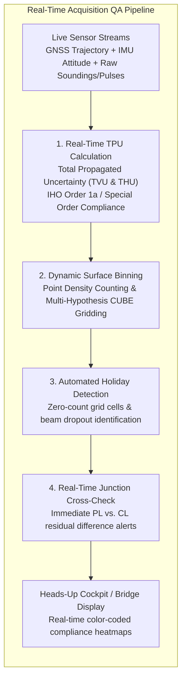
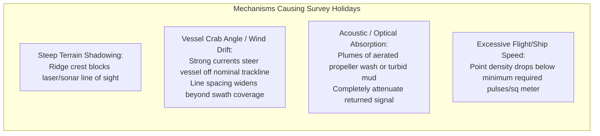
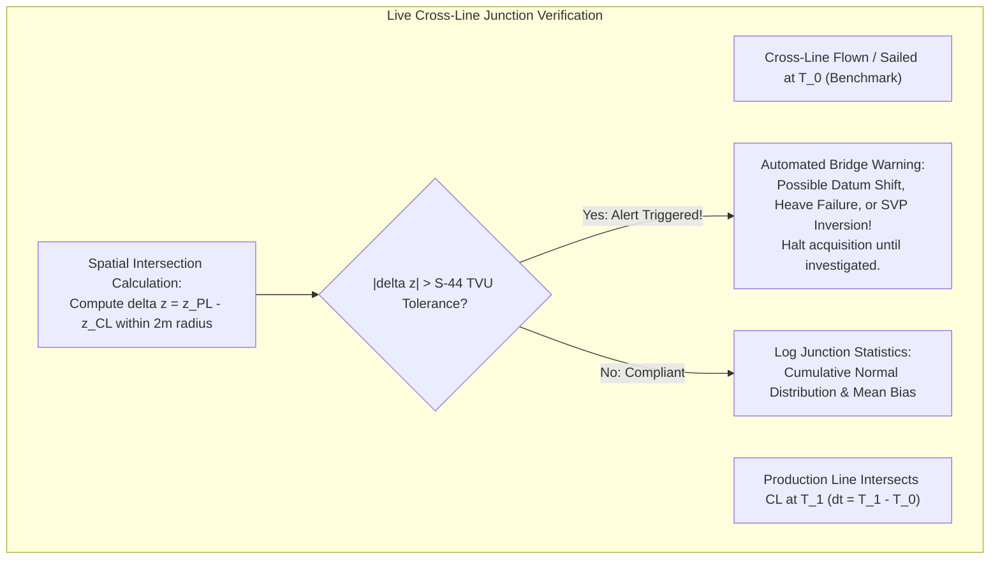

# Chapter 13: Survey Planning for Calibration, Error Reduction, and Monitoring

*How to design data acquisition in the field so systematic biases become mathematically observable, separable, and self-correcting.*

---

## 13.3 Real-Time Quality Assurance (QA) During Acquisition

In remote mapping operations—whether operating a $100\text{-meter}$ oceanographic research vessel in the Bering Sea or flying a specialized twin-engine LiDAR aircraft over the Alaskan tundra—the cost of field mobilization and vessel charter ranges from $\$10,000$ to upwards of $\$100,000$ per operational day. Discovering that a survey contains holidays (coverage gaps), excessive uncertainty, or an unsolved boresight bias after demobilizing and returning to the processing office is an unmitigated operational and financial catastrophe. Real-time Quality Assurance (QA) during acquisition integrates automated mathematical error monitoring into the live data ingestion stream, guaranteeing compliance with standards before the platform leaves the project area.

---

### 13.3.1 Live Total Propagated Uncertainty (TPU) Heatmaps

Historically, hydrographic and topographic surveys assessed data uncertainty during post-processing weeks after acquisition. Modern acquisition software (e.g., Kongsberg SIS, QPS Qinsy, Hypack Hysweep) computes the **Total Propagated Uncertainty (TPU)** for every sounding and laser pulse in real time.

#### The IHO S-44 Uncertainty Model
Under the International Hydrographic Organization (IHO) Standards for Hydrographic Surveys (S-44, 6th Edition), maximum allowable Total Vertical Uncertainty ($\text{TVU}_{\max}$) at the $95\%$ confidence level is parameterized as a function of water depth $d$:

$$\text{TVU}_{\max}(d) = \sqrt{a^2 + (b \cdot d)^2}$$

where $a$ represents depth-independent vertical uncertainty (fixed errors from draft, heave, and water levels) and $b$ represents depth-dependent uncertainty (scale errors from sound speed refraction and beam pointing):

| IHO S-44 Survey Order | Parameter $a$ (Fixed Error) | Parameter $b$ (Depth Factor) | Typical Operational Regime |
| :--- | :--- | :--- | :--- |
| **Exclusive Order** | $0.15\text{ m}$ | $0.0075$ | Critical shallow harbors, under-keel clearance $<1\text{–}2\text{ m}$ |
| **Special Order** | $0.25\text{ m}$ | $0.0075$ | Harbors, berthing areas, commercial shipping fairways $<40\text{ m}$ |
| **Order 1a / 1b** | $0.50\text{ m}$ | $0.0130$ | Coastal waters $<100\text{ m}$, navigation safety corridors |
| **Order 2** | $1.00\text{ m}$ | $0.0230$ | Deep oceanic waters $>100\text{ m}$ where navigation hazards are absent |

#### Live TPU Calculation and Display
During acquisition, the software multiplies the real-time sensor observation variance vector by the system Jacobian matrix:

$$\boldsymbol{\Sigma}_{xyz} = \mathbf{J} \, \boldsymbol{\Sigma}_{\text{obs}} \, \mathbf{J}^T$$

If real-time sea conditions degrade (causing violent ship heave) or if GNSS PDOP rises, the calculated vertical uncertainty $\sigma_z$ expands. 
* The real-time navigation display renders the survey swath not as simple raw depths, but as a **color-coded compliance heatmap**: green indicates $\text{TVU} \le \text{TVU}_{\max}$, yellow indicates marginal compliance ($80\%\text{–}100\%$ of specification), and red indicates non-compliance.
* The hydrographer immediately throttles back vessel speed or triggers a sound velocity cast before proceeding.

---

### 13.3.2 Automated Holiday (Data Gap) Detection and Point Density Tracking

A **holiday** is any unplanned void or gap within the nominal survey bounding box where elevation data is missing or fails to meet minimum point density thresholds.

#### Real-Time Grid Binning and Density Accumulators
Modern acquisition systems maintain an in-memory spatial grid of the survey area (e.g., $1\text{-m}$ or $2\text{-m}$ cells):
1. **Pulse/Sounding Accumulator:** Each incoming pulse or sounding increments the hit counter in its corresponding spatial cell.
2. **Density Compliance Thresholds:** For USGS Quality Level 1 (QL1) LiDAR, the required pulse density is $\ge 8\text{ pulses/m}^2$; for QL2, $\ge 2\text{ pulses/m}^2$. For IHO Special Order multibeam bathymetry, standards require full bottom search with $\ge 95\%$ of grid cells containing at least 5 soundings.
3. **Automated Holiday Alert Engine:** When adjacent parallel swaths fail to overlap—due to severe vessel drift in cross-currents or aircraft turbulence—the software flags unpopulated cells as active holidays, generating an immediate audio-visual alert in the wheelhouse or cockpit and automatically plotting an **infill line** (re-run track) on the pilot's navigation display.

---

### 13.3.3 Real-Time Cross-Line Junction Discrepancy Alerts

The ultimate test of data integrity during field operations is the agreement between orthogonal production lines and cross-lines.

#### Automated Junction QC Tools
Software packages such as HydrOffice QC Tools (developed jointly by NOAA and the Center for Coastal and Ocean Mapping, CCOM/JHC) run background daemons during acquisition:
* As a vessel sails over a previously surveyed cross-line, the software automatically extracts soundings within an intersection radius (e.g., $2\text{–}5\text{ m}$) from both lines.
* The system computes the junction elevation difference:
  $$\Delta z_{\text{junction}} = z_{\text{production}} - z_{\text{cross}}$$
* If the junction discrepancy exhibits a mean vertical bias exceeding allowable tolerances (e.g., $|\Delta z| > 0.15\text{ m}$ for IHO Special Order), the system raises an alarm. 
* This provides instant diagnosis: an abrupt vertical jump indicates an unmodeled tidal datum step, an antenna height entry error, or a dynamic heave filter divergence, allowing the field crew to fix the issue on the spot rather than discovering an unusable dataset months later.
