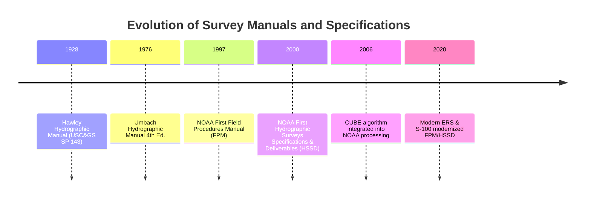
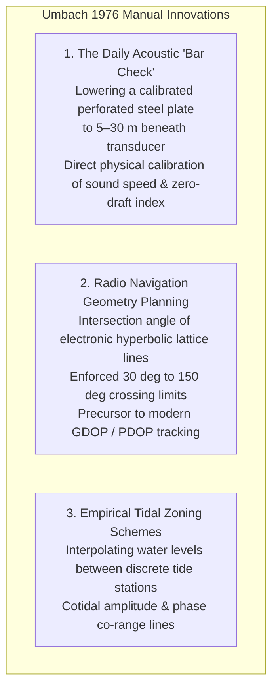
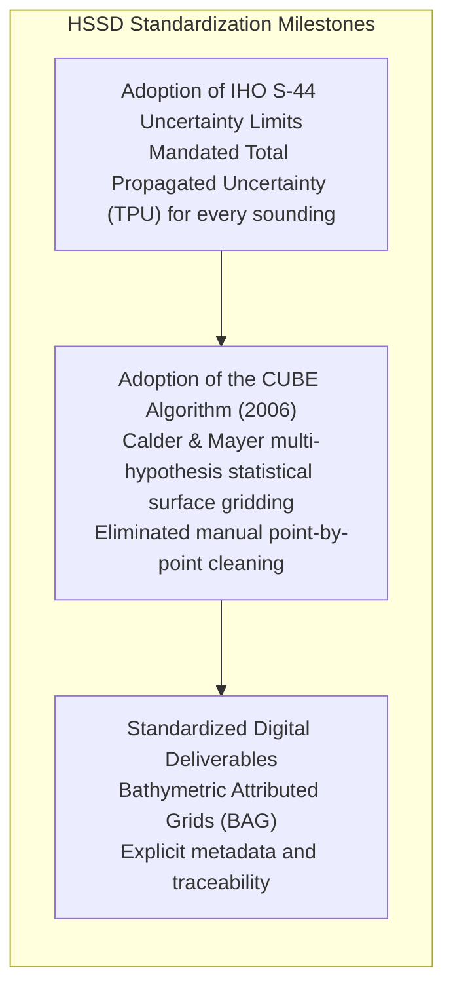

# Chapter 13: Survey Planning for Calibration, Error Reduction, and Monitoring

*How to design data acquisition in the field so systematic biases become mathematically observable, separable, and self-correcting.*

---

## 13.4 Historical Evolution of Survey Planning and Quality Control

The operational principles governing modern digital elevation and bathymetric surveys did not originate in computer algorithms; they were forged through a century of hydrographic and topographic field manuals. From early lead-line instructions designed to keep wooden survey schooners off uncharted shoals to modern specifications that dictate automated multi-beam uncertainty propagation, the history of survey manuals reflects the continuous codification of error control.

---

### 13.4.1 The 1928 Hawley Hydrographic Manual (USC&GS Special Publication 143)

In 1928, Captain Jean H. Hawley of the U.S. Coast and Geodetic Survey published Special Publication 143, the *Hydrographic Manual*. This monumental text represented the first comprehensive, systematic codification of hydrographic survey planning in North America.

#### Foundational Principles Established in 1928
1. **The First Formalization of Cross-Lines:** Hawley mandated that a system of cross-lines cutting across regular sounding lines at right angles be executed for every survey sheet. Hawley noted that while parallel lines provide systematic spatial coverage, only orthogonal cross-lines could expose undetected tide errors, lead-line shrinkage, and horizontal position misclosures.
2. **Line Spacing Formulas:** Hawley established mathematical rules linking survey line spacing directly to water depth, coastal bottom slope, and the draft of contemporary maritime commerce. In shoal or rocky waters, line spacing was compressed to $50\text{–}100\text{ m}$ intervals, requiring launch crews to maintain steady compass courses using visual three-point sextant fixes to onshore triangulation marks.
3. **Lead-Line Metrology:** The manual established strict calibration protocols for the lead-line itself: measuring the wet shrinkage of braided hemp and flax cords against brass standard pins set into the wooden deck of the survey ship before and after every working day.

---

### 13.4.2 The 1976 Hydrographic Manual, 4th Edition (Melvin J. Umbach)

By the mid-1970s, hydrography had transitioned from mechanical lead-lines to single-beam acoustic echosounders and medium-frequency terrestrial radio navigation (e.g., Raydist, Hi-Fix, Del Norte Trisponder). In 1976, Commander Melvin J. Umbach authored the *Hydrographic Manual, 4th Edition*, modernizing survey planning for the electronic era.

* **The Bar Check:** Umbach formalized the daily "bar check"—lowering a heavy, flat, perforated steel plate or pipe suspended by calibrated steel chains beneath the transducer head to depths from $2\text{ m}$ down to $30\text{ m}$. By comparing the acoustic echo against the physical chain markings, hydrographers directly calibrated both the instrument index draft and the average speed of sound in the upper water column.
* **Navigation Line Geometry:** Umbach introduced rigorous geometric dilution limits for radio positioning networks, establishing that lines of position (LOPs) intersecting at angles $<30^\circ$ or $>150^\circ$ were mathematically degenerate, establishing the conceptual ancestor of modern GNSS Dilution of Precision (DOP).

---

### 13.4.3 The 1997 / 2020 NOAA Field Procedures Manual (FPM)

With the advent of multibeam swath sonar systems, kinematic GPS, and shipboard computing in the 1990s, single-beam methods became obsolete. The NOAA Office of Coast Survey introduced the **Field Procedures Manual (FPM)** in 1997 (continuously updated through 2020 and subsequent editions) as a living, operational guide for hydrographic field units.

#### Multibeam Patch Tests and Dynamic Sound Speed Profiling
The FPM formalized the modern four-parameter **Patch Test** (latency, pitch, roll, and yaw), establishing standardized operational templates for running reciprocal lines over flat and sloping seafloors. The manual also instituted protocols for deploying Moving Vessel Profilers (MVP) and using surface sound velocity sensors directly integrated into sonar beamforming engines.

#### Ellipsoidally Referenced Surveying (ERS)
The 2020 edition of the FPM codified the transition from physical tide gauges and empirical tidal zoning to **Ellipsoidally Referenced Surveys (ERS)**. By logging dual-frequency GNSS carrier phase data on the survey vessel and processing trajectories via Post-Processed Kinematic (PPK) or PPP solutions, the water surface is tied directly to the ITRF/WGS84 ellipsoid. Vertical reduction to chart datums (MLLW) is performed via continuous separation models (NOAA VDatum), eliminating the single largest operational source of hydrographic error.

---

### 13.4.4 The 2000 NOAA Hydrographic Surveys Specifications and Deliverables (HSSD)

First promulgated in 2000 and updated annually, the **Hydrographic Surveys Specifications and Deliverables (HSSD)** established strict, legally binding technical standards for contractors and federal survey vessels conducting nautical charting surveys in the United States.

The HSSD transformed survey planning from qualitative "good seamanship" into a rigorous statistical framework:
* **Total Propagated Uncertainty (TPU) Mandate:** Mandated that every sounding ingested into a nautical chart deliverable carry an explicit, mathematically derived horizontal (THU) and vertical (TVU) uncertainty value at the $95\%$ confidence level.
* **CUBE Surface Integration:** In 2006, NOAA officially integrated the Combined Uncertainty and Bathymetry Estimator (CUBE) into the HSSD. Survey lines were no longer planned simply to generate dense soundings, but to provide the spatial and statistical redundancy required by CUBE's multi-hypothesis Kalman filters to resolve true seafloor depth in the presence of acoustic fliers, fish schools, and bubble noise.
