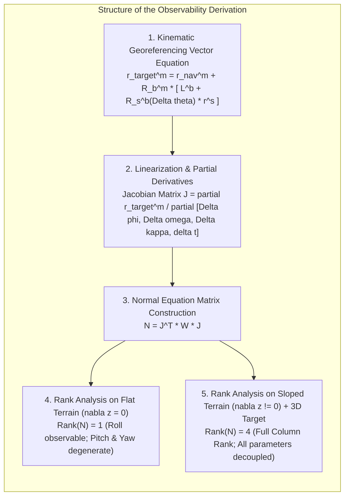
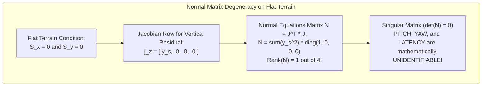
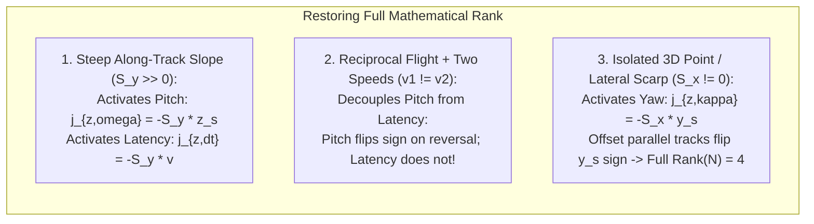

# Chapter 13: Survey Planning for Calibration, Error Reduction, and Monitoring

*How to design data acquisition in the field so systematic biases become mathematically observable, separable, and self-correcting.*

---

## 13.5 Mathematical Foundations of Boresight Calibration and Parameter Observability

A central question in survey planning is: *Why can't we solve for roll, pitch, heading, and latency simultaneously over any arbitrary patch of ground?* The answer lies in linear algebra and parameter observability. If survey lines and terrain geometries are chosen naively, the normal equations become mathematically singular (rank-deficient), or suffer from near-unity parameter correlations that prevent the least-squares solver from separating physical mounting misalignments from natural terrain features.

This section provides the rigorous derivation of the 3D boresight georeferencing Jacobian, followed by a formal rank and conditioning analysis of the normal equation matrix $\mathbf{N} = \mathbf{J}^T \mathbf{W} \mathbf{J}$ over flat versus sloped terrain.

---

### 13.5.1 The Kinematic Direct Georeferencing Equation

Let the coordinates of a mapped ground point in the local mapping frame $m$ (e.g., East, North, Up) be denoted by $\mathbf{r}_{\text{target}}^m$. The position is reconstructed from platform navigation and sensor measurements via:

$$\mathbf{r}_{\text{target}}^m = \mathbf{r}_{\text{nav}}^m(t) + \mathbf{R}_b^m(t) \left[ \mathbf{L}^b + \mathbf{R}_s^b (\Delta \boldsymbol{\theta}) \, \mathbf{r}^s(t - \delta t) \right]$$

where:
* $\mathbf{r}_{\text{nav}}^m(t) = [X_{\text{nav}}, Y_{\text{nav}}, Z_{\text{nav}}]^T$ is the position of the navigation reference center (GNSS/IMU center) in mapping frame $m$.
* $\mathbf{R}_b^m(t)$ is the time-varying attitude rotation matrix from the IMU body frame $b$ to the mapping frame $m$, parameterized by navigation roll ($\phi$), pitch ($\theta$), and yaw/heading ($\psi$).
* $\mathbf{L}^b = [L_x, L_y, L_z]^T$ is the physical lever-arm offset vector from the IMU center to the sensor reference center, expressed in the IMU body frame.
* $\mathbf{R}_s^b(\Delta \boldsymbol{\theta})$ is the static boresight rotation matrix from the sensor frame $s$ to the IMU body frame $b$. For small angular misalignments $\Delta \boldsymbol{\theta} = [\Delta \phi, \Delta \omega, \Delta \kappa]^T$ (roll, pitch, and yaw boresight angles, in radians), the rotation matrix is linearized via the small-angle skew-symmetric approximation:
  $$\mathbf{R}_s^b(\Delta \boldsymbol{\theta}) \approx \mathbf{I}_{3\times 3} + [\Delta \boldsymbol{\theta}]_\times = \begin{bmatrix} 1 & -\Delta \kappa & \Delta \omega \\ \Delta \kappa & 1 & -\Delta \phi \\ -\Delta \omega & \Delta \phi & 1 \end{bmatrix}$$
* $\mathbf{r}^s$ is the raw range measurement vector in the sensor frame. For a downward-looking scanning LiDAR or multibeam sonar with beam across-track angle $\theta_b$ and measured range $\rho$:
  $$\mathbf{r}^s = \begin{bmatrix} 0 \\ \rho \sin\theta_b \\ -\rho \cos\theta_b \end{bmatrix} = \begin{bmatrix} 0 \\ y_s \\ -z_s \end{bmatrix}$$
* $\delta t$ is the uncalibrated time latency between navigation time and sensor sampling time.

---

### 13.5.2 Derivation of the Parameter Jacobian Matrix ($\mathbf{J}$)

To solve for the parameter vector $\mathbf{x} = [\Delta \phi, \Delta \omega, \Delta \kappa, \delta t]^T$ using non-linear least squares, we expand $\mathbf{r}_{\text{target}}^m$ in a Taylor series about nominal values $\mathbf{x}_0 = \mathbf{0}$.

#### Sensitivity to Boresight Angles ($\Delta \phi, \Delta \omega, \Delta \kappa$)
Differentiating with respect to the small-angle vector $\Delta \boldsymbol{\theta}$:

$$\frac{\partial \mathbf{r}_{\text{target}}^m}{\partial \Delta \boldsymbol{\theta}} = \mathbf{R}_b^m \frac{\partial \left( [\Delta \boldsymbol{\theta}]_\times \mathbf{r}^s \right)}{\partial \Delta \boldsymbol{\theta}} = -\mathbf{R}_b^m [\mathbf{r}^s]_\times$$

where $[\mathbf{r}^s]_\times$ is the skew-symmetric cross-product matrix of the sensor beam vector $\mathbf{r}^s = [0, y_s, -z_s]^T$:

$$[\mathbf{r}^s]_\times = \begin{bmatrix} 0 & z_s & y_s \\ -z_s & 0 & 0 \\ -y_s & 0 & 0 \end{bmatrix}$$

Therefore:

$$-\mathbf{R}_b^m [\mathbf{r}^s]_\times = \mathbf{R}_b^m \begin{bmatrix} 0 & -z_s & -y_s \\ z_s & 0 & 0 \\ y_s & 0 & 0 \end{bmatrix}$$

For a platform traveling along the East-North grid with nominal heading $\psi = 0^\circ$ (flying North, where $X$ is East across-track, $Y$ is North along-track, and $Z$ is Up), the nominal rotation matrix $\mathbf{R}_b^m \approx \mathbf{I}_{3\times 3}$. The partial derivatives in the local East ($X$), North ($Y$), and Vertical ($Z$) coordinates simplify directly to:

$$\begin{aligned}
\frac{\partial \mathbf{r}_{\text{target}}^m}{\partial \Delta \phi} &= \begin{bmatrix} 0 \\ z_s \\ y_s \end{bmatrix} \quad (\text{Roll Boresight}) \\
\frac{\partial \mathbf{r}_{\text{target}}^m}{\partial \Delta \omega} &= \begin{bmatrix} -z_s \\ 0 \\ 0 \end{bmatrix} \quad (\text{Pitch Boresight}) \\
\frac{\partial \mathbf{r}_{\text{target}}^m}{\partial \Delta \kappa} &= \begin{bmatrix} -y_s \\ 0 \\ 0 \end{bmatrix} \quad (\text{Yaw / Heading Boresight})
\end{aligned}$$

#### Sensitivity to Time Latency ($\delta t$)
Applying the chain rule to the velocity vector of the platform $\mathbf{v}_{\text{nav}}^m = \frac{d\mathbf{r}_{\text{nav}}^m}{dt}$:

$$\frac{\partial \mathbf{r}_{\text{target}}^m}{\partial \delta t} = -\mathbf{v}_{\text{nav}}^m = \begin{bmatrix} 0 \\ -v \\ 0 \end{bmatrix}$$

where $v$ is the platform forward along-track velocity.

---

### 13.5.3 Jacobian Rank Analysis: Why Flat Terrain Fails

In digital elevation modeling, vertical elevation $Z$ is the primary observed quantity. Consider the vertical residual equation $\Delta Z = Z_{\text{obs}} - Z_{\text{terrain}}$ as a function of the parameter vector $\mathbf{x} = [\Delta \phi, \Delta \omega, \Delta \kappa, \delta t]^T$:

$$\Delta Z = \left( \frac{\partial Z}{\partial \Delta \phi} \right) \Delta \phi + \left( \frac{\partial Z}{\partial \Delta \omega} + \frac{\partial Z_{\text{terrain}}}{\partial Y} \frac{\partial Y}{\partial \Delta \omega} \right) \Delta \omega + \left( \frac{\partial Z}{\partial \Delta \kappa} + \frac{\partial Z_{\text{terrain}}}{\partial X} \frac{\partial X}{\partial \Delta \kappa} \right) \Delta \kappa + \left( \frac{\partial Z_{\text{terrain}}}{\partial Y} \frac{\partial Y}{\partial \delta t} \right) \delta t$$

Let the local terrain surface be parameterized by horizontal terrain slopes $S_x = \frac{\partial Z_{\text{terrain}}}{\partial X}$ and $S_y = \frac{\partial Z_{\text{terrain}}}{\partial Y}$.

#### Case 1: Perfectly Flat Terrain ($S_x = 0, S_y = 0$)
On a flat, horizontal runway or seafloor:
* $\frac{\partial Z}{\partial \Delta \phi} = y_s$ (non-zero across the swath).
* $\frac{\partial Z}{\partial \Delta \omega} = 0 + S_y (-z_s) = 0$.
* $\frac{\partial Z}{\partial \Delta \kappa} = 0 + S_x (-y_s) = 0$.
* $\frac{\partial Z}{\partial \delta t} = 0 + S_y (-v) = 0$.

The Jacobian row for vertical elevation observation on flat terrain is:

$$\mathbf{j}_z = \begin{bmatrix} y_s & 0 & 0 & 0 \end{bmatrix}$$

The resulting normal equation matrix $\mathbf{N} = \sum \mathbf{j}_z^T \mathbf{j}_z$ is:

$$\mathbf{N}_{\text{flat}} = \begin{bmatrix} \sum y_s^2 & 0 & 0 & 0 \\ 0 & 0 & 0 & 0 \\ 0 & 0 & 0 & 0 \\ 0 & 0 & 0 & 0 \end{bmatrix}$$

$$\text{Rank}(\mathbf{N}_{\text{flat}}) = 1 < 4$$

**Mathematical Conclusion:** Over flat terrain, the normal matrix has rank 1. **Roll ($\Delta \phi$) is fully observable**, but Pitch ($\Delta \omega$), Yaw ($\Delta \kappa$), and Latency ($\delta t$) lie entirely in the **null space** ($\ker(\mathbf{N})$). Attempting to invert $\mathbf{N}_{\text{flat}}$ causes numerical division by zero.

---

### 13.5.4 Restoring Full Rank: Sloped Terrain and 3D Feature Geometry

To render all four parameters mathematically observable, the survey flight plan must deliberately introduce non-zero terrain slopes and geometric asymmetry:

#### Decoupling Pitch and Latency over Along-Track Slopes ($S_y \neq 0$)
When surveying over a steep slope ($S_y \ne 0$), the Jacobian elements become non-zero:

$$\frac{\partial Z}{\partial \Delta \omega} = -S_y z_s, \quad \frac{\partial Z}{\partial \delta t} = -S_y v$$

However, on a single flight line, Pitch and Latency are **linearly dependent** (perfectly correlated) because both displace the apparent sounding along-track:

$$\Delta Y_{\text{apparent}} = -z_s \Delta \omega - v \, \delta t$$

To break this correlation, the survey plan executes two specific flight maneuvers:
1. **Reciprocal Flight ($v \to -v$):** On the return pass heading in the opposite direction ($180^\circ$ reciprocal), the platform velocity vector reverses sign ($\mathbf{v} \to -\mathbf{v}$). The pitch-induced displacement remains forward relative to the vessel heading, but reverses direction relative to the ground. In contrast, the latency displacement depends on velocity direction.
2. **Speed Variation ($v_1 \neq v_2$):** By running the same line at two distinct velocities ($v_1 \ll v_2$), the latency error scales with velocity while the pitch angular error remains constant:
   $$\begin{bmatrix} \Delta Y_1 \\ \Delta Y_2 \end{bmatrix} = \begin{bmatrix} -z_s & -v_1 \\ -z_s & -v_2 \end{bmatrix} \begin{bmatrix} \Delta \omega \\ \delta t \end{bmatrix}$$
   The determinant of this sub-matrix is:
   $$\det = -z_s (-v_2) - (-z_s)(-v_1) = z_s (v_2 - v_1) \ne 0 \quad (\text{since } v_2 \ne v_1)$$
   The system achieves full rank, completely decoupling pitch misalignment from timing latency.

#### Restoring Yaw Observability over 3D Features ($S_x \neq 0$)
Yaw misalignment $\Delta \kappa$ rotates the swath horizontally:

$$\Delta X_{\text{along}} = -y_s \Delta \kappa$$

Over a 3D feature with steep across-track slope ($S_x \ne 0$), this along-track displacement produces a vertical error:

$$\frac{\partial Z}{\partial \Delta \kappa} = -S_x y_s$$

By running two parallel lines offset on either side of the feature, the cross-track distance $y_s$ changes sign from positive (starboard) to negative (port). This asymmetric sign flip guarantees that $\sum (-S_x y_s)^2 > 0$ and eliminates parameter correlation between yaw and across-track roll, bringing the full system normal matrix to:

$$\text{Rank}(\mathbf{N}_{\text{sloped + offset}}) = 4$$

This formal proof establishes why the specific maneuvers of the hydrographic patch test and LiDAR boresight pattern are mathematical prerequisites for producing distortion-free elevation models.
