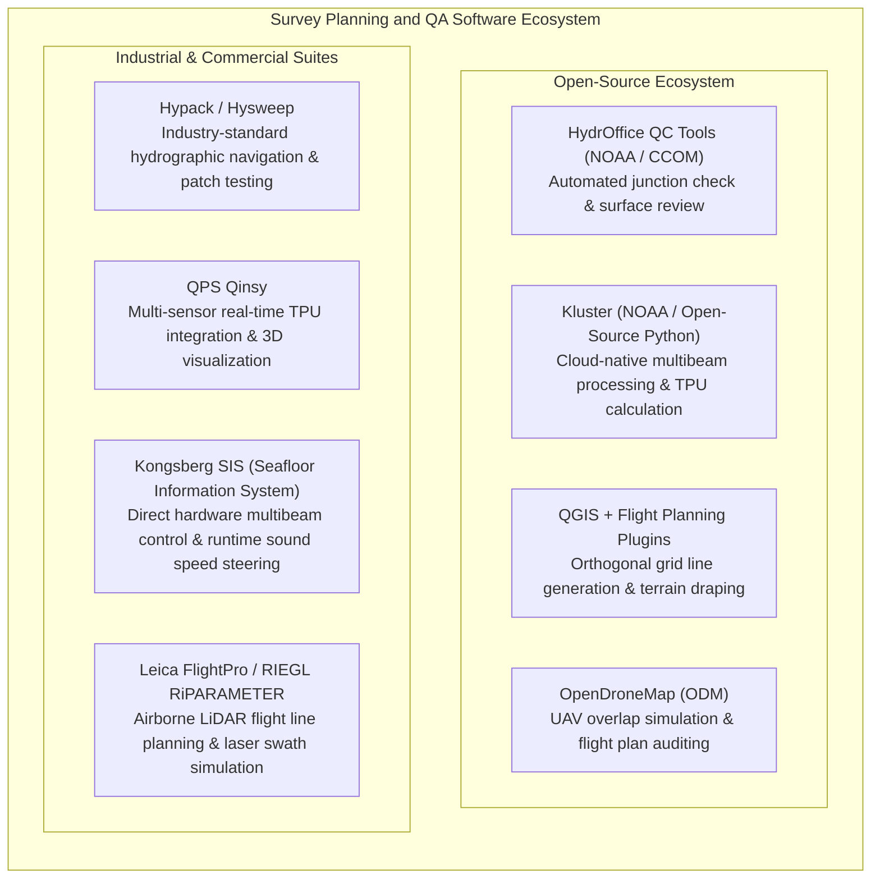
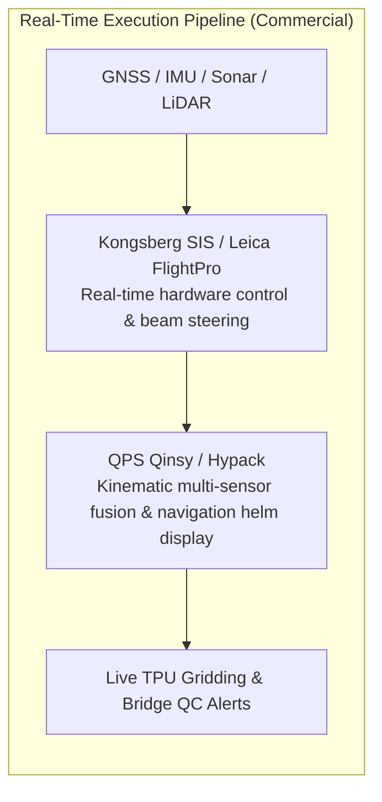

# Chapter 13: Survey Planning for Calibration, Error Reduction, and Monitoring

*How to design data acquisition in the field so systematic biases become mathematically observable, separable, and self-correcting.*

---

## 13.6 Software Ecosystem for Survey Planning, Execution, and Quality Control

Modern survey planning and real-time execution rely on specialized software architectures capable of simulating geometric coverage, ingesting high-bandwidth sensor streams, calculating live uncertainty, and auditing cross-line junctions. The software ecosystem is divided between open-source community frameworks and industrial-grade commercial survey navigation engines.

---

### 13.6.1 Open-Source Tools

#### HydrOffice QC Tools (NOAA / CCOM)
Developed collaboratively by NOAA's Office of Coast Survey and the Center for Coastal and Ocean Mapping (CCOM/JHC) at the University of New Hampshire, **HydrOffice QC Tools** is an open-source Python suite designed to standardize hydrographic quality control:
* **CrossCheck:** Performs automated statistical analysis of cross-line and production-line junctions, generating depth-difference histograms and evaluating compliance against IHO S-44 Order 1a and Special Order standards.
* **Flier Finder:** Scans gridded bathymetric surfaces (BAGs or GeoTIFFs) using Laplacian and elevation-gradient filters to identify artificial acoustic spikes, unrejected fish schools, and edge blunders.
* **Holiday Finder:** Automatically isolates voids and missing coverage within surveyed polygons, flagging cells that fail point density criteria before vessels depart the field.

#### Kluster (NOAA Open-Source Hydrographic Engine)
**Kluster** is a modern, distributed, open-source Python library developed by NOAA to process multibeam echosounder data:
* Built on `xarray`, `dask`, and `zarr`, Kluster parallelizes acoustic ray tracing, lever-arm rotations, and TPU calculations across multi-core CPUs and GPUs.
* Provides native modules for automated multibeam patch-test calibration, solving for roll, pitch, yaw, and latency using robust optimization algorithms on raw sensor data.

#### QGIS and Flight Planning Plugins
In airborne LiDAR and drone mapping, QGIS serves as the primary open-source planning hub:
* Tools like **QGIS Flight Planner** take digital surface models (SRTM, Copernicus, or national DEMs) and compute terrain-following flight lines.
* Computes real-time along-track and across-track overlap footprints based on camera sensor dimensions, focal lengths, flight speed, and camera trigger rates, ensuring consistent Ground Sample Distance (GSD) across rugged topography.

---

### 13.6.2 Commercial Survey Navigation and Execution Engines

#### Hypack and Hysweep
Hypack is one of the most widely deployed commercial hydrographic survey suites in the world:
* **Survey Planning:** Designs matrix lines, channel offset patterns, and automated cross-line layouts.
* **Hysweep Patch Test Wizard:** Guides hydrographers through latency, pitch, roll, and yaw test lines, providing automated graphical overlays where operators adjust angle sliders to align overlapping seafloor profiles visually and numerically.

#### QPS Qinsy
Qinsy is an advanced real-time data acquisition and navigation software package for hydrographic, offshore construction, and dredging operations:
* **Rigorous Kinematic Modeling:** Tracks complex multi-vessel and ROV/AUV operations, computing Kalman-filtered georeferencing solutions at up to $100\text{ Hz}$.
* **Real-Time Dynamic TPU:** Displays continuous Total Propagated Uncertainty heatmaps on the helmsman's heads-up display, color-coding areas where survey specifications are breached.

#### Kongsberg SIS (Seafloor Information System)
SIS is the proprietary hardware-control software interface for Kongsberg EM-series multibeam systems:
* Operates directly on the sonar transceiver unit, managing real-time acoustic beam steering and stabilization (pitch, roll, and yaw).
* Ingests real-time sound velocity measurements from the transducer face and updates water-column ray paths on a ping-by-ping basis.

#### Leica FlightPro and RIEGL RiPARAMETER
In airborne laser scanning:
* **Leica FlightPro:** Directs pilots along pre-planned flight tracks, adjusting scan rates and field-of-view (FOV) dynamically to maintain uniform point density over variable ground elevations.
* **RIEGL RiPARAMETER / RiACQUIRE:** Simulates airborne LiDAR scan patterns, multiple-pulses-in-the-air (MTA) zones, and laser swath overlap, warning flight planners of range ambiguities and blind zones before takeoff.

---

### 13.6.3 Software Comparison Matrix

| Software Suite | License | Domain | Key Capabilities | Primary Role |
| :--- | :--- | :--- | :--- | :--- |
| **HydrOffice QC Tools** | Open-Source (BSD-3) | Marine Bathymetry | Cross-line junction auditing, flier detection, holiday search | Post-acquisition and daily field QA compliance. |
| **Kluster** | Open-Source (BSD-3) | Marine Bathymetry | Cloud-native Dask/Zarr processing, automated patch tests, TPU | Automated multibeam calibration and pipeline processing. |
| **QGIS Flight Planner** | Open-Source (GPLv2) | Airborne LiDAR / UAV | Terrain-following flight paths, GSD/overlap simulation | Pre-mission airborne flight planning. |
| **OpenDroneMap (ODM)** | Open-Source (GPLv3) | UAV Photogrammetry | Orthomosaic generation, tie-point review, coverage simulation | Drone mission verification. |
| **Hypack / Hysweep** | Commercial (Xylem) | Hydrography / Dredging | Channel design, vessel steering, patch-test solver | Live survey execution and vessel helm guidance. |
| **QPS Qinsy** | Commercial (QPS) | Marine / Offshore | Live TPU mapping, complex multi-sensor Kalman filtering | Real-time survey execution and offshore positioning. |
| **Kongsberg SIS** | Commercial (Kongsberg) | Marine Bathymetry | Direct sonar hardware control, real-time beam steering | Multibeam acquisition and surface sound speed control. |
| **Leica FlightPro** | Commercial (Hexagon) | Airborne LiDAR | Pilot navigation guidance, dynamic FOV/pulse management | Aircraft cockpit guidance and sensor triggering. |
